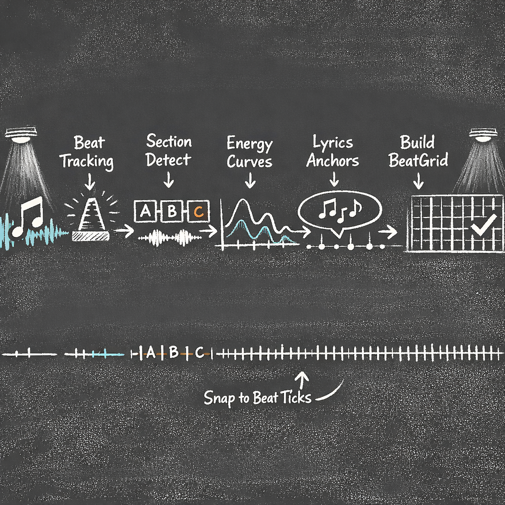

# Hearing the Music — Audio Analysis & Feature Extraction

<!-- ILLUSTRATION: ILL-01-00 — Blog header banner: audio waves → lights choreography. See ILLUSTRATION_INDEX.md for full spec. -->


A choreographer doesn't listen to music the way you or I do. They're counting bars. They're tracking where the energy builds. They're noting *exactly* which beat the chorus hits — not approximately, because "approximately" makes lights look drunk.

Before the LLM in Twinklr can make a single creative decision, it needs this same understanding. A three-minute MP3 has to become something structured: tempo, beats, bars, energy curves, section boundaries, harmonic content, lyrics. About 100KB of musical intelligence, all deterministic, all precise enough that the rendering engine downstream can align effects to individual sixteenth notes.

No LLM touches any of this. It's pure signal processing, a multi-source lyrics pipeline, and one very opinionated section detector.

---

## System Snapshot

**Purpose:** _(1–2 sentences: what this stage produces and why it exists.)_

**Inputs**
- _(e.g., raw audio file, metadata, prior stage outputs)_

**Outputs**
- _(e.g., BeatGrid, SectionMap, AudioProfile, GroupPlanSet, RenderPlan)_

**LLM vs Deterministic**
- **LLM does:** _(categorical intent / choices / summaries)_  
- **Code does:** _(math, snapping, curves, exports, validation)_

**Key invariants**
- _(3–5 invariants that must always hold; treat as contracts)_

**Telemetry to watch**
- _(success rate, avg runtime, token/cost, top failure modes)_


## Repo Anchors

**Key modules**
- `twinklr/...` _(add canonical paths for the main code in this part)_

**Key models**
- _(Pydantic models / schemas that define the contracts)_

**Key tests / tools**
- _(validators, golden tests, regression fixtures, debug utilities)_


## The BeatGrid: Where Everything Starts

Every decision the system makes downstream — which template to use, when to start a sweep, how long to hold a pulse — eventually resolves to one question: *where are we in the music right now?*

The answer lives in a frozen Pydantic model called `BeatGrid`:

```python
# packages/twinklr/core/sequencer/timing/beat_grid.py
class BeatGrid(BaseModel, frozen=True):
    """Musical timing grid — the single source of truth for all timing."""

    bar_boundaries: list[float]       # Bar start times (ms)
    beat_boundaries: list[float]      # Beat start times (ms)
    eighth_boundaries: list[float]    # Eighth-note times (ms)
    sixteenth_boundaries: list[float] # Sixteenth-note times (ms)
    tempo_bpm: float                  # Average tempo
    beats_per_bar: int                # Time signature numerator
    duration_ms: float                # Total song duration
```

Four resolution levels — bar, beat, eighth, sixteenth — pre-calculated from the detected beat positions. When the rendering pipeline needs to align a template to "bar 12, beat 3," it calls `beat_grid.snap_to_grid(time_ms, quantize_to="beat")` and gets back an exact millisecond value. Binary search under the hood. No re-computation, no floating-point drift.

<!-- ILLUSTRATION: ILL-01-04 — Snap-to-grid before/after: raw hit times snapping to beat grid, with visible drift removed. See ILLUSTRATION_INDEX.md for full spec. -->


The `frozen=True` matters. The BeatGrid is a contract between audio analysis and every stage downstream. If anything could mutate it mid-pipeline, we'd spend our lives debugging timing inconsistencies that only reproduce on the 47th bar of specific songs. We were paranoid about this one from the start. (The lyrics pipeline, on the other hand, taught us caution the hard way. More on that shortly.)

---

## Seven Domains, One Song

The audio file goes through parallel analysis across seven feature domains. It starts with HPSS — Harmonic/Percussive Source Separation — which splits the audio into its tonal content (vocals, chords, sustained notes) and its percussive content (drums, clicks, attacks). Beat detection works better on the percussive signal. Key detection works better on the harmonic. Feeding both through the same mixed signal is like trying to read a book and listen to a podcast at the same time — technically possible, practically worse at both.

<!-- ILLUSTRATION: ILL-01-03 — Audio analysis pipeline illustration (beats/energy/lyrics extraction). See ILLUSTRATION_INDEX.md for full spec. -->


<details>
<summary>Diagram: Audio Analysis Pipeline (click to expand if diagram doesn't render)</summary>


</details>

Here's what comes out the other end:

| Domain | What It Extracts | Why It Matters |
|---|---|---|
| **Rhythm** | Tempo, beats, downbeats, time signature | Builds the BeatGrid — everything aligns to this |
| **Energy** | RMS at 3 temporal scales, build/drop events | Tells the profiler *how intense* each moment is |
| **Spectral** | Centroid, flatness, brightness, motion | Vocal detection, timbral character |
| **Harmonic** | Key, mode, chroma, chords, pitch | Section detection, tension analysis |
| **Structure** | Section boundaries, labels, confidence | The map every downstream stage plans against |
| **Tension** | Composite curve (harmony + energy + onsets) | Creative arc decisions in profiling |
| **Timeline** | Frame-aligned unified features | Dense per-frame data for downstream consumers |

The complete output is a `SongBundle` — about 100KB of structured JSON for a typical three-minute song. Every field deterministic. Same MP3 in, same bundle out, every time.

---

## Energy: Why You Need Three Ears

Energy analysis seems straightforward: compute RMS from the waveform, done. But a snare hit on beat 3 and a four-bar orchestral build into the chorus are both "energy events" — and they demand completely different choreographic responses. The snare triggers a quick dimmer flash. The build should drive a gradual widening of the fan formation. You need to hear both, which means hearing at different temporal scales.

```python
# packages/twinklr/core/audio/energy/multiscale.py
rms_norm = normalize_to_0_1(rms)

rms_beat = gaussian_filter1d(rms_norm, sigma=2)     # ← Beat-level: every hit
rms_phrase = gaussian_filter1d(rms_norm, sigma=10)   # ← Phrase-level: 2-4 bar breathing
rms_section = gaussian_filter1d(rms_norm, sigma=50)  # ← Section-level: the macro arc
```

Sigma 2 sees every snare hit. Sigma 50 sees the chorus. Sigma 10 is the sweet spot that reveals the *breathing* of the music — the building and releasing that happens at the phrase level, the thing that makes a pre-chorus feel like it's going somewhere.

<!-- ILLUSTRATION: ILL-01-01 — Three overlaid energy curves (beat/phrase/section scale) on a shared time axis, showing the same song at different smoothing levels. See ILLUSTRATION_INDEX.md for full spec. -->


The system also derives a `smoothness_score`: the ratio of phrase-level variance to raw variance. High smoothness means gradual energy changes — a gentle "O Holy Night." Low smoothness means sharp dynamic contrast — Trans-Siberian Orchestra doing literally anything. The downstream profiler uses this to decide between gradual transitions and hard cuts between choreography sections.

On top of the curves, the system detects **builds** (sustained energy increases) and **drops** (sharp decreases) using a sliding window approach. Not continuous positive gradient — because real music builds aren't monotonic. The detection is adaptive: it classifies the song's overall energy profile first, then adjusts thresholds. A ballad's "build" looks nothing like a TSO track's.

---

## Section Detection: Christmas Music Is Weird

Section detection — figuring out where the intro ends, where the verse begins, where the chorus kicks in — turned out to be the single most consequential part of this pipeline. Bad boundaries don't cause local problems. They *cascade*. The profiler interprets sections wrong, the planner assigns templates to the wrong musical moments, and the whole show feels disconnected from the music.

We used a hybrid approach: Foote novelty function (self-similarity matrix analysis) combined with a baseline time grid. Foote novelty finds moments where the music changes character. The baseline grid ensures minimum coverage when novelty peaks are sparse.

And then we ran it on a Christmas playlist.

> **Decision Point:** Pure novelty detection works well on songs with clear structural changes — verse/chorus/bridge with distinct instrumentation. Christmas music breaks the rules: short songs, simple verse-chorus patterns, frequent key modulations for emotional effect, and instrumental interludes that sound harmonically identical to the verse. The algorithm would either over-segment ("Silent Night" split into 14 sections — it has three verses and an outro) or under-segment (missing the key change into the final chorus entirely). Genre-aware presets fixed this.

Here's what genre-aware tuning actually looks like:

```python
# packages/twinklr/core/audio/structure/presets.py
"christmas_classic": SectioningPreset(
    min_sections=8, max_sections=14,
    min_len_beats=20,                    # ← ~6-10s at typical Christmas tempi
    novelty_L_beats=14,                  # ← Foote kernel size
    context_weights={
        "drops_weight": 0.15,            # ← Classic Christmas doesn't "drop"
        "builds_weight": 0.3,            # ← Orchestral builds exist, but subtle
        "vocals_weight": 0.75,           # ← Vocals drive the structure
        "chords_weight": 0.75,           # ← Key changes signal sections
    },
)
```

Compare with EDM: `drops_weight: 0.9`, `vocals_weight: 0.25`. Same algorithm, completely different ears. The genre is detected from embedded metadata tags before analysis starts, so the detector is already tuned by the time it touches the audio.

---

## Naming Things (It's Always Naming Things)

Once you have sections, every downstream stage needs to agree on what to call them. The audio profiler, lyrics profiler, macro planner, and fixture planner all reference the same sections. If the profiler calls it `chorus_2` and the planner calls it `second_chorus` and the lyrics agent calls it `chorus_B`, things quietly fall apart.

```python
# packages/twinklr/core/audio/sections.py
def generate_section_ids(sections: list[dict[str, Any]]) -> list[str]:
    """Singleton types omit suffix: "intro", "bridge"
    Multi-occurrence types get 1-based: "chorus_1", "chorus_2"
    """
    labels = [_extract_label(s) for s in sections]
    totals = Counter(labels)

    type_counter: dict[str, int] = {}
    ids: list[str] = []
    for label in labels:
        type_counter[label] = type_counter.get(label, 0) + 1
        if totals[label] == 1:
            ids.append(label)                              # ← "bridge" (one of a kind)
        else:
            ids.append(f"{label}_{type_counter[label]}")   # ← "chorus_2" (seen this before)
    return ids
```

> **Decision Point:** Canonical section IDs are a cross-stage contract. This single function generates all section references for every downstream consumer. If the LLM were allowed to invent section names — and it would, creatively — we'd get reference mismatches immediately. One source of truth, deterministic, stable across re-runs.

For a typical Christmas song:

| Section ID | Type | Start | End | Confidence |
|---|---|---|---|---|
| `intro` | intro | 0.0s | 8.2s | 0.72 |
| `verse_1` | verse | 8.2s | 32.5s | 0.85 |
| `chorus_1` | chorus | 32.5s | 56.8s | 0.91 |
| `verse_2` | verse | 56.8s | 80.1s | 0.83 |
| `chorus_2` | chorus | 80.1s | 104.4s | 0.89 |
| `bridge` | bridge | 104.4s | 120.7s | 0.68 |
| `chorus_3` | chorus | 120.7s | 152.0s | 0.88 |
| `outro` | outro | 152.0s | 168.3s | 0.65 |

Thirty lines of code. Prevents an absurd number of bugs.

---

## The Lyrics Problem

Lyrics matter for choreography — the planner can time a warm red glow to "Rudolph with your nose so bright," the lyrics profiler can find narrative themes that shape the show's visual arc. But getting reliable lyrics with accurate timing is a real-world data quality problem, and it humbled us.

<!-- ILLUSTRATION: ILL-01-02 — Five-stage lyrics fallback waterfall, showing each source tried in order with escalating time cost and quality gates. See ILLUSTRATION_INDEX.md for full spec. -->


> **Decision Point:** No single lyrics source is reliable for the Christmas music catalog. Embedded tags are often missing. LRCLib has good synced lyrics but gaps in coverage. Genius has great text but no timing. WhisperX can transcribe but struggles with singing vs. speech. We built a five-stage fallback chain: each source tried in order, each result quality-scored before acceptance.

| Stage | Source | What You Get | Speed | Triggers When... |
|---|---|---|---|---|
| 1 | Embedded (LRC/SYLT/USLT) | Synced lyrics | Instant | Always tried first |
| 2 | LRCLib API | Synced lyrics | ~200ms | Embedded is empty |
| 3 | Genius API | Text only (no timing) | ~500ms | LRCLib has no match |
| 4 | WhisperX Align | Timed words | ~10s | Genius has text, we need timing |
| 5 | WhisperX Transcribe | Full transcription | 30s+ | Everything else failed |

Each stage only fires if the previous one missed. You don't run a 30-second WhisperX transcription if LRCLib already had synced lyrics sitting there.

```python
# packages/twinklr/core/audio/lyrics/pipeline.py (abbreviated)
async def resolve(self, *, audio_path, duration_ms, artist=None, title=None) -> LyricsBundle:
    # Stage 1: Embedded (instant, always tried)
    text, phrases, words, warnings = extract_embedded_lyrics(audio_path, duration_ms)
    if text:
        return self._finalize_bundle(text=text, source_kind=EMBEDDED, ...)

    # Stage 2: LRCLib synced (fast API)
    if artist or title:
        synced = await self._try_synced_lookup(artist=artist, title=title, ...)
        if synced:
            return synced

        # Stage 3: Genius plain text (slower API)
        plain = await self._try_plain_lookup(artist=artist, title=title, ...)
        if plain:
            if self.config.require_timed_words and not plain.words:
                # Stage 4: WhisperX align (add timing to existing text)
                aligned = self._try_whisperx_align(audio_path=audio_path, ...)
                if aligned:
                    return aligned
            return plain

    # Stage 5: WhisperX transcribe (last resort)
    if self.whisperx_service:
        transcribed = self._try_whisperx_transcribe(audio_path=audio_path, ...)
        if transcribed:
            return transcribed

    return LyricsBundle(stage_status=StageStatus.SKIPPED)  # ← No lyrics. Show goes on.
```

What makes this robust isn't just the fallback chain — it's quality scoring. Every result gets confidence-scored based on source, then penalized: low vocal coverage (-0.10), timing overlaps (-0.05 each, capped at -0.20), out-of-bounds timestamps, large gaps. When the planner gets a bundle with 0.55 confidence and three overlap violations, it knows to weight lyrical cues lower.

The pipeline degrades gracefully. Missing API keys? Those lookup stages just get skipped. WhisperX not installed? ML stages unavailable. No lyrics at all? The show plans without them. Lyrics are an enhancement, not a requirement.

**One more layer:** when lyrics have word-level timing, the phoneme pipeline kicks in — G2P conversion turns "Rudolph" into `[R, UW1, D, AO0, L, F]`, timing gets distributed weighted by phoneme type (vowels get 2x duration because that's how humans sing), then viseme mapping for visual mouth shapes. This feeds accent timing for moving heads and lip-sync for singing faces in the group sequencer.

---

## Caching: Analyze Once, Forget About It

Audio analysis takes 15–30 seconds per song. But it's deterministic — same input, same output — so we cache aggressively. The cache key is a SHA256 of the first 10MB of the audio file plus the file size. Not the whole file — just enough to fingerprint it without reading gigabytes of FLAC. The key includes a schema version, so when we change the output shape, old caches invalidate automatically.

Metadata enrichment and lyrics resolution run in parallel via `asyncio.gather` — no reason to wait for AcoustID fingerprinting before hitting LRCLib. Phonemes depend on lyrics, so they run sequentially after. The whole enhancement pipeline is created by `EnhancementServiceFactory`, which only initializes the services that are enabled. Missing API keys get logged as warnings, not errors.

First run of a 15-song playlist: a few minutes. Every run after: instant. This matters more than it sounds — when you're iterating on planner prompts or renderer logic, not re-analyzing audio every time saves your sanity.

---

That's what the system hears: ~100KB of tempo, beats, energy at three scales, section boundaries with labels and confidence, harmonic analysis, build/drop events, tension curves, and optionally lyrics with quality scores. Every bit deterministic. Same MP3, same bundle, every time.

But 100KB is far too much to hand to an LLM. In Part 2, we'll see how the audio profiler compresses this down to ~10KB of shaped context — keeping the *shape* of energy curves but not every data point, preserving lyrics availability metadata but not the full text — and how the LLM transforms raw features into creative intent.

---

*This is Part 1 of the [Building an AI Choreographer for Christmas Light Shows](#) series.*

← [Previous: Can an LLM Choreograph a Light Show?](00_overview.md) | [Next: Making Sense of Sound — LLM-Based Audio & Lyric Profiling →](02_audio_profiling.md)
