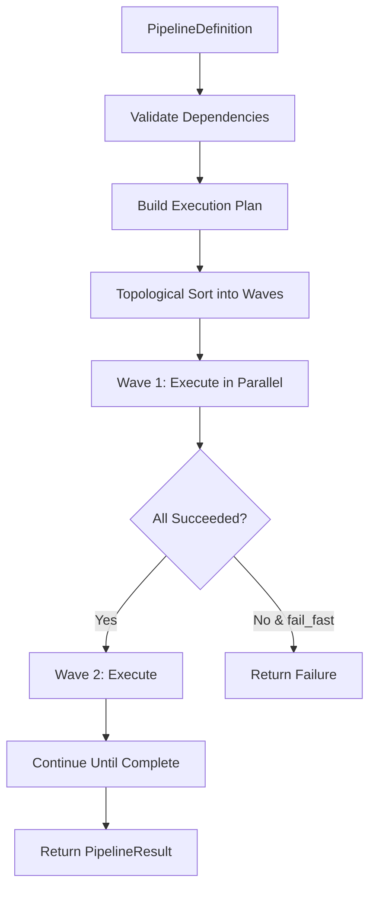

# Pipeline Orchestration Framework

**Status:** Production Ready  
**Version:** 1.0  
**Location:** `packages/twinklr/core/pipeline/`  
**Date:** 2026-02-01

---

## Overview

The Pipeline Orchestration Framework provides declarative, type-safe orchestration for multi-stage workflows in Twinklr. It handles automatic dependency resolution, parallel execution, error handling, and retry logic without requiring external frameworks like LangGraph or Airflow.

### Key Benefits

- **Declarative Configuration:** Define stages and dependencies once, execution is automatic
- **Automatic Parallelism:** Stages with satisfied dependencies run concurrently  
- **Type Safety:** Full mypy compatibility with Protocol pattern and Pydantic models
- **Built-in Patterns:** Sequential, parallel, fan-out, and conditional execution
- **Production Ready:** 84% test coverage, 0 lint/type errors, comprehensive error handling

### When to Use

✅ **Good fit:**
- Multi-stage workflows (5-20 stages)
- Clear stage dependencies
- Need automatic parallelism (e.g., audio profile + lyrics analysis)
- Fan-out patterns (e.g., group planning for N display groups)
- Retry logic and error recovery

❌ **Not needed for:**
- Single-stage operations
- Simple sequential scripts
- Complex branching logic (>10 conditional paths)

---

## Architecture

### Core Components

```
PipelineDefinition
  ├── stages: List[StageDefinition]    # Declarative stage config
  ├── validate_pipeline() -> List[str] # Dependency validation
  └── fail_fast: bool                  # Error handling mode

PipelineExecutor
  ├── execute()                        # Main entry point
  ├── _build_execution_plan()          # Topological sort
  └── _execute_wave()                  # Parallel wave execution

PipelineContext
  ├── provider: LLMProvider            # Injected dependencies
  ├── config: JobConfig
  ├── state: dict                      # Mutable shared state
  └── metrics: dict                    # Metrics tracking

PipelineStage (Protocol)
  ├── name: str                        # Stage identifier
  └── execute(input, context)          # Async execution
```

### Execution Flow



**Wave Execution:**
- Wave 1: Stages with no dependencies (entry points)
- Wave 2: Stages whose dependencies completed in Wave 1
- Wave N: Stages whose dependencies completed in Wave N-1

Stages within a wave execute in parallel automatically.

---

## Execution Patterns

### 1. Sequential (Default)

Single stage executes after dependencies complete.

```python
StageDefinition(
    id="macro",
    stage=MacroPlannerStage(),
    inputs=["profile", "lyrics"],  # Waits for both
)
```

### 2. Parallel (Automatic)

Stages with same dependencies run concurrently.

```python
# These run in parallel (both depend only on "audio")
StageDefinition("profile", AudioProfileStage(), inputs=["audio"]),
StageDefinition("lyrics", LyricsStage(), inputs=["audio"]),
```

### 3. Fan-Out

Execute stage N times in parallel (one per input item).

```python
StageDefinition(
    id="groups",
    stage=GroupPlannerStage(),
    pattern=ExecutionPattern.FAN_OUT,
    inputs=["group_contexts"],  # Must return list
)
```

**Requirements:**
- Input must be a list
- Stage executes once per list item
- Returns list of outputs

### 4. Conditional

Skip stage based on runtime condition.

```python
StageDefinition(
    id="lyrics",
    stage=LyricsStage(),
    pattern=ExecutionPattern.CONDITIONAL,
    inputs=["audio"],
    condition=lambda ctx: ctx.get_state("has_lyrics", False),
    critical=False,  # Pipeline continues if skipped
)
```

---

## Basic Usage

### 1. Define Pipeline

```python
from twinklr.core.pipeline import (
    PipelineDefinition,
    StageDefinition,
    ExecutionPattern,
)

pipeline = PipelineDefinition(
    name="audio_sequencer",
    fail_fast=True,
    stages=[
        # Stage 1: Audio Analysis
        StageDefinition("audio", AudioAnalysisStage()),
        
        # Stage 2: Profile + Lyrics (parallel)
        StageDefinition("profile", AudioProfileStage(), inputs=["audio"]),
        StageDefinition("lyrics", LyricsStage(), inputs=["audio"]),
        
        # Stage 3: Macro Planning
        StageDefinition("macro", MacroPlannerStage(), inputs=["profile", "lyrics"]),
        
        # Stage 4: Group Planning (fan-out)
        StageDefinition(
            "groups",
            GroupPlannerStage(),
            pattern=ExecutionPattern.FAN_OUT,
            inputs=["group_contexts"],
        ),
    ],
)
```

### 2. Create Pipeline Context

```python
from twinklr.core.pipeline import PipelineContext

context = PipelineContext(
    provider=provider,              # LLM provider
    app_config=app_config,          # Application config
    job_config=job_config,          # Job config
    llm_logger=llm_logger,          # Optional LLM logger
    output_dir=output_dir,          # Optional output directory
)
```

### 3. Execute Pipeline

```python
from twinklr.core.pipeline import PipelineExecutor

executor = PipelineExecutor()
result = await executor.execute(
    pipeline=pipeline,
    initial_input=audio_path,
    context=context,
)

if result.success:
    audio_bundle = result.outputs["audio"]
    macro_plan = result.outputs["macro"]
    group_plans = result.outputs["groups"]
else:
    print(f"Failed stages: {result.failed_stages}")
```

---

## Creating Custom Stages

Stages implement the `PipelineStage` protocol:

```python
from twinklr.core.pipeline import (
    PipelineContext,
    StageResult,
    success_result,
    failure_result,
)

class MyCustomStage:
    """Custom pipeline stage."""
    
    @property
    def name(self) -> str:
        return "my_stage"
    
    async def execute(
        self,
        input: MyInputType,
        context: PipelineContext,
    ) -> StageResult[MyOutputType]:
        try:
            # Access dependencies from context
            provider = context.provider
            config = context.job_config
            
            # Do work
            result = await my_logic(input, provider)
            
            # Store state for downstream stages
            context.set_state("my_flag", True)
            
            # Track metrics
            context.add_metric("my_metric", 123)
            
            # Return success
            return success_result(result, stage_name=self.name)
            
        except Exception as e:
            logger.exception("Stage failed", exc_info=e)
            return failure_result(str(e), stage_name=self.name)
```

**Key Requirements:**
1. Property `name` returns stage identifier
2. Method `execute()` is async
3. Never raise exceptions - return `failure_result()` instead
4. Use `success_result()` and `failure_result()` helpers (not `StageResult` directly)

---

## Advanced Features

### Retry Logic

```python
from twinklr.core.pipeline.definition import RetryConfig

StageDefinition(
    id="macro",
    stage=MacroPlannerStage(),
    retry_config=RetryConfig(
        max_attempts=3,
        initial_delay_ms=1000,
        backoff_multiplier=2.0,
        max_delay_ms=60000,
        retryable_errors=["timeout", "rate_limit"],  # Optional filter
    ),
)
```

**Behavior:**
- Exponential backoff between retries
- Only retries errors matching `retryable_errors` if specified
- Logs each retry attempt

### Timeout Support

```python
StageDefinition(
    id="render",
    stage=RenderingStage(),
    timeout_ms=300000,  # 5 minutes
)
```

**Behavior:**
- Stage cancelled if exceeds timeout
- Counts as retriable failure (if retry_config set)

### State Management

Share data between stages without passing through outputs:

```python
# Upstream stage stores state
class AudioAnalysisStage:
    async def execute(self, input, context):
        bundle = await analyze(input)
        context.set_state("has_lyrics", bundle.lyrics is not None)
        return success_result(bundle)

# Downstream stage reads state
StageDefinition(
    "lyrics",
    LyricsStage(),
    condition=lambda ctx: ctx.get_state("has_lyrics", False),
)
```

### Metrics Tracking

```python
# Stages add metrics
context.add_metric("tokens_used", 1500)
context.increment_metric("llm_calls")

# Access after pipeline
print(f"Total tokens: {result.metadata['tokens_used']}")
```

### Cancellation

```python
# Create cancellation token
cancel_token = asyncio.Event()

context = PipelineContext(
    provider=provider,
    config=config,
    cancel_token=cancel_token,
)

# Cancel from another task
cancel_token.set()  # Pipeline stops at next wave boundary
```

---

## Error Handling

### Critical vs Non-Critical Stages

```python
StageDefinition(
    "lyrics",
    LyricsStage(),
    critical=False,  # Pipeline continues if fails
)
```

**Behavior:**
- `critical=True` (default): Failure stops pipeline if `fail_fast=True`
- `critical=False`: Failure logged but pipeline continues

### Fail-Fast vs Continue-On-Error

```python
pipeline = PipelineDefinition(
    name="my_pipeline",
    fail_fast=True,   # Stop on first critical failure
    stages=[...],
)
```

**Options:**
- `fail_fast=True`: Stop on first critical stage failure (default)
- `fail_fast=False`: Complete all possible stages, aggregate failures

### Accessing Errors

```python
result = await executor.execute(pipeline, input, context)

if not result.success:
    for stage_id in result.failed_stages:
        stage_result = result.get_result(stage_id)
        print(f"{stage_id} failed: {stage_result.error}")
```

---

## Stage Organization

### Recommended File Structure

**Production stages should live alongside their orchestrators:**

```
packages/twinklr/core/
├── agents/
│   ├── audio/
│   │   ├── profile/
│   │   │   ├── orchestrator.py (future)
│   │   │   └── stage.py         # AudioProfileStage
│   │   ├── lyrics/
│   │   │   └── stage.py         # LyricsStage
│   │   └── stages/
│   │       ├── __init__.py
│   │       └── analysis.py      # AudioAnalysisStage
│   └── sequencer/
│       ├── macro_planner/
│       │   ├── orchestrator.py
│       │   └── stage.py         # MacroPlannerStage
│       └── group_planner/
│           ├── orchestrator.py
│           └── stage.py         # GroupPlannerStage
└── pipeline/
    ├── stages.py                # Examples/reference only
    └── ...
```

**Rationale:**
- **Co-location:** Stage wrappers live next to the orchestrators they adapt
- **Ownership:** Clear which team owns both orchestrator and stage
- **Discoverability:** Easy to find stage when working on orchestrator
- **Sync:** Stage and orchestrator stay in sync during changes

### Import Pattern

```python
# Import stages from their respective modules
from twinklr.core.agents.audio.stages import AudioAnalysisStage
from twinklr.core.agents.audio.profile.stage import AudioProfileStage
from twinklr.core.agents.audio.lyrics.stage import LyricsStage
from twinklr.core.agents.sequencer.macro_planner.stage import MacroPlannerStage
# GroupPlannerStage not yet implemented - see changes/vnext/agent_clean/11_GROUP_PLANNER_SPEC.md

# Use in pipeline definition
pipeline = PipelineDefinition(
    name="sequencer",
    stages=[
        StageDefinition("audio", AudioAnalysisStage()),
        StageDefinition("profile", AudioProfileStage(), inputs=["audio"]),
        StageDefinition("macro", MacroPlannerStage(), inputs=["profile", "lyrics"]),
        # ...
    ],
)
```

## Integration Points

### Stage Adapter Pattern

Stages act as adapters between the pipeline framework and domain orchestrators:

```
PipelineContext (infrastructure)  +  Stage Input (data)
    ↓
Stage.execute()
    ↓ builds agent-specific context
    ↓ extracts dependencies from PipelineContext  
AgentOrchestrator.run(AgentContext)
    ↓
Returns StageResult
```

**Key Principle:** Orchestrators remain domain-focused. They don't know about pipelines.

### Context Mapping

**Two types of contexts:**

1. **PipelineContext** (infrastructure) - Passed to every stage
   - `provider` (LLMProvider)
   - `app_config`, `job_config`
   - `llm_logger`
   - `state`, `metrics`

2. **Agent Context** (domain) - Created by stage for orchestrator
   - `PlanningContext` (for MacroPlanner)
   - `GroupPlanningContext` (for GroupPlanner)
   - Contains domain models (audio_profile, macro_plan, etc.)

### Example: Audio Analysis Stage

```python
# Location: packages/twinklr/core/agents/audio/stages/analysis.py

from twinklr.core.audio.analyzer import AudioAnalyzer
from twinklr.core.pipeline import PipelineContext, success_result, failure_result

class AudioAnalysisStage:
    """Wraps AudioAnalyzer for pipeline execution."""
    
    @property
    def name(self) -> str:
        return "audio_analysis"
    
    async def execute(self, input: str, context: PipelineContext):
        try:
            # Use dependencies from PipelineContext
            analyzer = AudioAnalyzer(context.app_config, context.job_config)
            bundle = await analyzer.analyze(input)
            
            # Store state for downstream stages
            context.set_state("has_lyrics", bundle.lyrics is not None)
            context.add_metric("audio_duration_ms", bundle.timing.duration_ms)
            
            return success_result(bundle, stage_name=self.name)
        except Exception as e:
            return failure_result(str(e), stage_name=self.name)
```

### Example: Agent Orchestrator Stage

```python
# Location: packages/twinklr/core/agents/sequencer/macro_planner/stage.py

from twinklr.core.agents.sequencer.macro_planner import (
    MacroPlannerOrchestrator,
    PlanningContext,  # Agent-specific context
)
from twinklr.core.pipeline import PipelineContext, success_result, failure_result

class MacroPlannerStage:
    """Wraps MacroPlannerOrchestrator for pipeline execution."""
    
    def __init__(self, display_groups: list[dict]):
        self.display_groups = display_groups
    
    @property
    def name(self) -> str:
        return "macro_planner"
    
    async def execute(self, input: dict, context: PipelineContext):
        try:
            # 1. Extract stage inputs
            audio_profile = input["profile"]
            lyric_context = input.get("lyrics")
            
            # 2. Build agent-specific context
            planning_context = PlanningContext(
                audio_profile=audio_profile,
                lyric_context=lyric_context,
                display_groups=self.display_groups,
            )
            
            # 3. Create orchestrator with PipelineContext dependencies
            orchestrator = MacroPlannerOrchestrator(
                provider=context.provider,
                llm_logger=context.llm_logger,
                max_iterations=context.job_config.agent.max_iterations,
            )
            
            # 4. Run orchestrator with agent context
            result = await orchestrator.run(planning_context=planning_context)
            
            if result.success:
                # Track metrics in PipelineContext
                context.add_metric("macro_iterations", result.context.current_iteration)
                return success_result(result.plan, stage_name=self.name)
            else:
                return failure_result(result.context.termination_reason, stage_name=self.name)
        except Exception as e:
            return failure_result(str(e), stage_name=self.name)
```

**No Refactoring Required:** Orchestrators stay unchanged. Stages act as adapters.

### With Existing Demo Script

See `packages/twinklr/core/pipeline/MIGRATION.md` for complete guide to refactoring `scripts/demo_sequencer_pipeline.py`.

---

## Testing

### Unit Testing Stages

```python
import pytest
from twinklr.core.pipeline import PipelineContext, success_result

@pytest.mark.asyncio
async def test_my_stage(mock_context):
    stage = MyCustomStage()
    result = await stage.execute(test_input, mock_context)
    
    assert result.success
    assert result.output == expected_output
```

### Integration Testing Pipelines

```python
@pytest.mark.asyncio
async def test_pipeline_execution(mock_context):
    pipeline = PipelineDefinition(
        name="test",
        stages=[
            StageDefinition("stage1", MockStage("stage1", "output1")),
            StageDefinition("stage2", MockStage("stage2", "output2"), inputs=["stage1"]),
        ],
    )
    
    executor = PipelineExecutor()
    result = await executor.execute(pipeline, "input", mock_context)
    
    assert result.success
    assert "stage1" in result.outputs
    assert "stage2" in result.outputs
```

### Test Fixtures

```python
@pytest.fixture
def mock_context():
    return PipelineContext(
        provider=MockProvider(),
        app_config=create_mock_app_config(),
        job_config=create_mock_job_config(),
    )
```

---

## Performance Considerations

### Parallelism

**Automatic:** Profile + Lyrics analysis run concurrently
**Manual (Fan-Out):** Group planning runs N times in parallel

**Concurrency Control:**
- Currently unlimited parallel execution within a wave
- Future: Add `max_concurrency` parameter to fan-out stages

### Memory

**Consideration:** All stage outputs kept in memory until pipeline completes
**Mitigation:** Use checkpointing for large intermediate results (future enhancement)

### Execution Time

**Typical Overhead:** <1ms per stage for orchestration logic
**Bottlenecks:** LLM calls, audio analysis (not orchestration)

---

## Monitoring & Debugging

### Logging

Framework logs to `twinklr.core.pipeline.executor`:

```python
import logging
logging.getLogger("twinklr.core.pipeline.executor").setLevel(logging.DEBUG)
```

**Log Levels:**
- `INFO`: Wave execution, stage completion, skipped stages
- `WARNING`: Retries, non-critical failures
- `ERROR`: Critical failures, unexpected exceptions
- `DEBUG`: Execution plan details

### Inspection

```python
# Before execution: validate pipeline
errors = pipeline.validate_pipeline()
if errors:
    print(f"Validation errors: {errors}")

# During execution: check context state
print(f"State: {context.state}")
print(f"Metrics: {context.metrics}")

# After execution: inspect results
print(f"Duration: {result.total_duration_ms}ms")
print(f"Completed: {len(result.outputs)}/{len(pipeline.stages)}")

for stage_id, stage_result in result.stage_results.items():
    print(f"{stage_id}: {'✓' if stage_result.success else '✗'}")
```

### Common Issues

**Issue:** Stage not executing  
**Check:** Dependencies satisfied? Conditional met? Previous stage failed?

**Issue:** Stages running sequentially instead of parallel  
**Check:** Do they have the same inputs? Not in fan-out pattern?

**Issue:** Fan-out fails with type error  
**Check:** Input is list? Not tuple or single item?

---

## Migration Guide

### From Manual `asyncio.gather`

**Before:**
```python
audio_task = run_audio_profile(...)
lyrics_task = run_lyrics_async(...)
audio_profile, lyric_context = await asyncio.gather(audio_task, lyrics_task)
```

**After:**
```python
pipeline = PipelineDefinition(stages=[
    StageDefinition("audio", AudioStage()),
    StageDefinition("profile", ProfileStage(), inputs=["audio"]),
    StageDefinition("lyrics", LyricsStage(), inputs=["audio"]),
])
result = await executor.execute(pipeline, audio_path, context)
```

### From Sequential Loops

**Before:**
```python
group_plans = []
for group in display_groups:
    plan = await orchestrator.run_single_group(group)
    group_plans.append(plan)
```

**After:**
```python
StageDefinition(
    "groups",
    GroupPlannerStage(),
    pattern=ExecutionPattern.FAN_OUT,
    inputs=["group_contexts"],  # List of contexts
)
```

---

## Future Enhancements

**Planned:**
- Visualization: Generate Mermaid/Graphviz diagrams from pipeline definitions
- Checkpointing: Save/resume from intermediate checkpoints
- Streaming: Output streaming for long-running stages
- Rate Limiting: Global rate limiter for LLM calls
- Profiling: Per-stage resource usage tracking

**Not Planned:**
- DAG visualization UI (use mermaid diagram generators instead)
- Distributed execution (use Celery/RQ if needed)
- Human-in-the-loop (add as stage with external queue if needed)

---

## Examples

### Complete Sequencer Pipeline

See `packages/twinklr/core/pipeline/example_usage.py` for working example demonstrating:
- Audio analysis
- Parallel audio profile + lyrics
- Macro planning with multi-input
- Group planning with fan-out
- Error handling and metrics

### Reference Stage Implementations

See `packages/twinklr/core/pipeline/stages.py` for **reference examples only**:
- `AudioAnalysisStage` - Simple sequential stage
- `AudioProfileStage` - Stage with LLM provider
- `LyricsStage` - Conditional stage
- `MacroPlannerStage` - Multi-input stage
- `GroupPlannerStage` - Fan-out stage

**Note:** These are documentation examples. Production stages should live in their respective agent modules (see "Stage Organization" section).

### Production Stage Locations

Once implemented, production stages will be at:
- `packages/twinklr/core/agents/audio/stages/analysis.py`
- `packages/twinklr/core/agents/audio/profile/stage.py`
- `packages/twinklr/core/agents/audio/lyrics/stage.py`
- `packages/twinklr/core/agents/sequencer/macro_planner/stage.py`
- `packages/twinklr/core/agents/sequencer/group_planner/stage.py` (PENDING - not yet implemented)

---

## API Reference

### PipelineDefinition

```python
class PipelineDefinition(BaseModel):
    name: str                          # Pipeline identifier
    stages: list[StageDefinition]      # Stage definitions
    description: str | None            # Optional description
    fail_fast: bool = True             # Stop on first failure
    
    def validate_pipeline() -> list[str]  # Validate dependencies
```

### StageDefinition

```python
@dataclass
class StageDefinition:
    id: str                                   # Unique stage ID
    stage: PipelineStage                      # Stage implementation
    pattern: ExecutionPattern = SEQUENTIAL    # Execution pattern
    inputs: list[str] = []                    # Dependency stage IDs
    condition: Callable | None = None         # Optional condition
    retry_config: RetryConfig | None = None   # Optional retry config
    timeout_ms: float | None = None           # Optional timeout
    critical: bool = True                     # Fail pipeline if fails
    description: str | None = None            # Optional description
```

### PipelineContext

```python
@dataclass
class PipelineContext:
    provider: LLMProvider                # LLM provider
    app_config: AppConfig                # Application config
    job_config: JobConfig                # Job config
    llm_logger: LLMCallLogger           # LLM logger
    checkpoint_dir: Path | None         # Checkpoint directory
    output_dir: Path | None             # Output directory
    state: dict[str, Any]               # Mutable state
    metrics: dict[str, Any]             # Metrics
    cancel_token: asyncio.Event | None  # Cancellation token
```

### PipelineResult

```python
class PipelineResult(BaseModel):
    success: bool                              # Overall success
    outputs: dict[str, Any]                    # Stage outputs
    stage_results: dict[str, StageResult]      # Stage results
    failed_stages: list[str]                   # Failed stage IDs
    total_duration_ms: float                   # Total duration
    metadata: dict[str, Any]                   # Pipeline metadata
```

### Helper Functions

```python
def success_result(
    output: T,
    stage_name: str = "unknown",
    metadata: dict | None = None,
) -> StageResult[T]

def failure_result(
    error: str,
    stage_name: str = "unknown",
    metadata: dict | None = None,
) -> StageResult[Any]
```

---

## Resources

### Framework

- **Core Code:** `packages/twinklr/core/pipeline/`
- **Tests:** `tests/unit/pipeline/test_pipeline.py`
- **Documentation:** `doc/PIPELINE_FRAMEWORK.md` (this file)
- **Migration Guide:** `packages/twinklr/core/pipeline/MIGRATION.md`
- **Implementation Summary:** `packages/twinklr/core/pipeline/IMPLEMENTATION_SUMMARY.md`

### Examples & Reference

- **Complete Example:** `packages/twinklr/core/pipeline/example_usage.py`
- **Reference Stages:** `packages/twinklr/core/pipeline/stages.py` (examples only)

### Production Stage Locations (when implemented)

- **Audio Stages:** `packages/twinklr/core/agents/audio/*/stage.py`
- **Sequencer Stages:** `packages/twinklr/core/agents/sequencer/*/stage.py`

---

## Support

**Issues:** File in project issue tracker  
**Questions:** Contact maintainer or team Slack channel  
**Contributions:** Follow TDD process, ensure `make validate` passes
