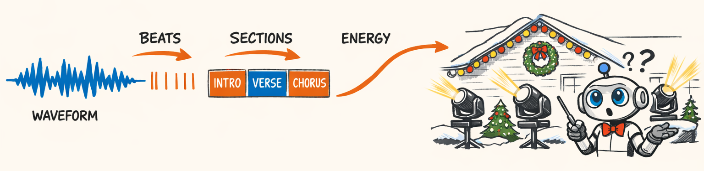
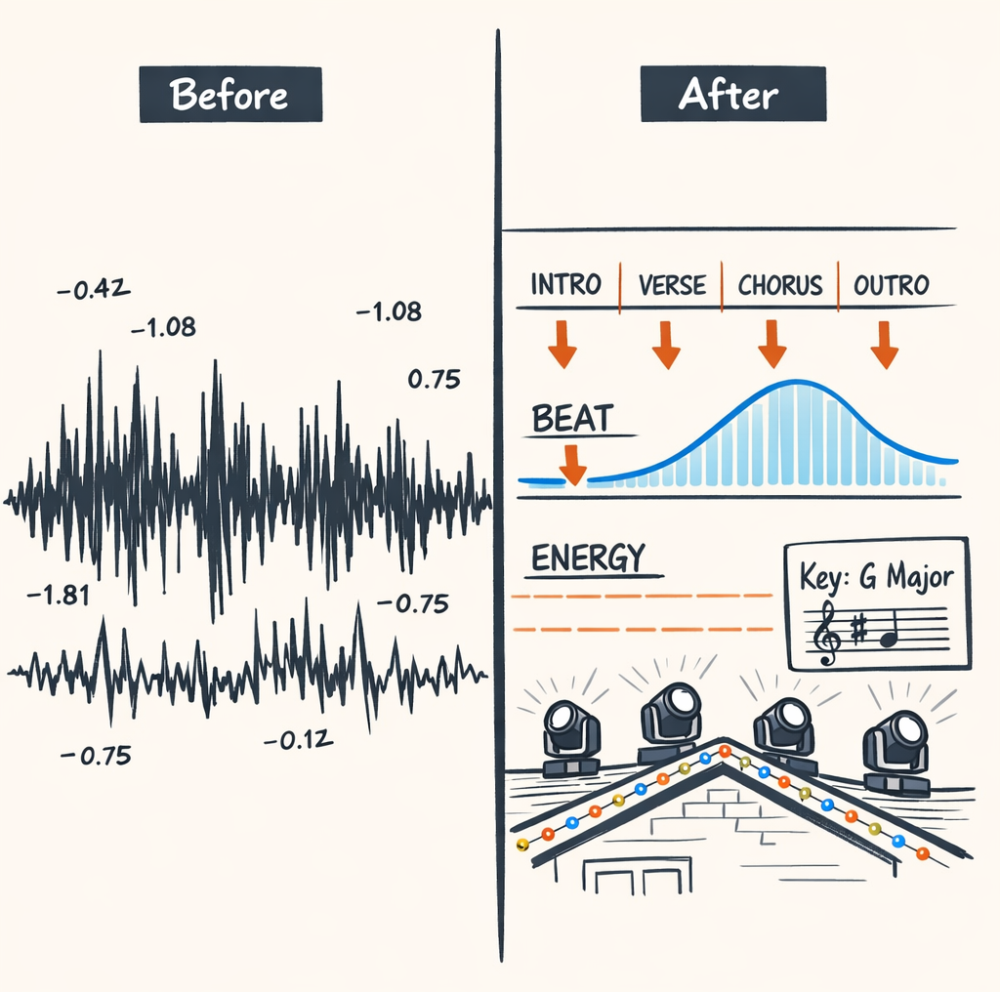
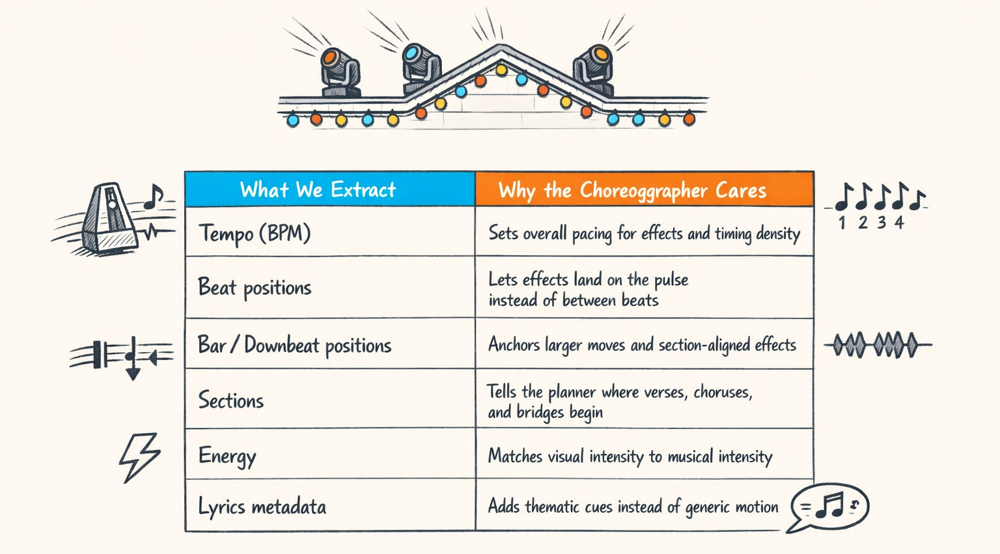
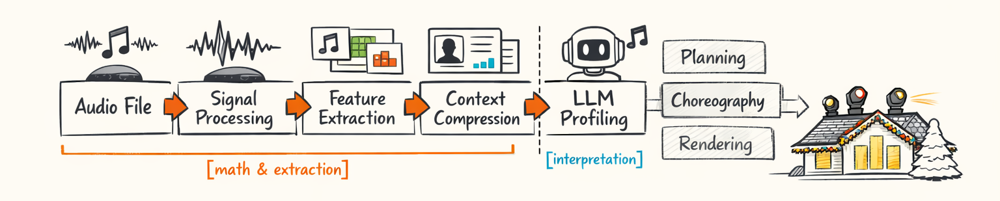
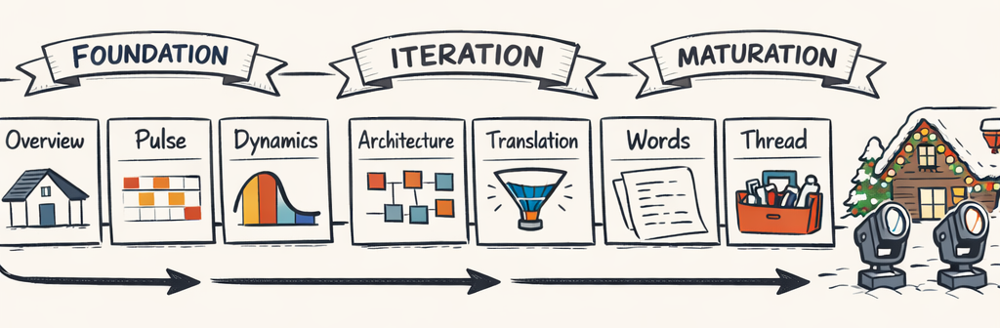
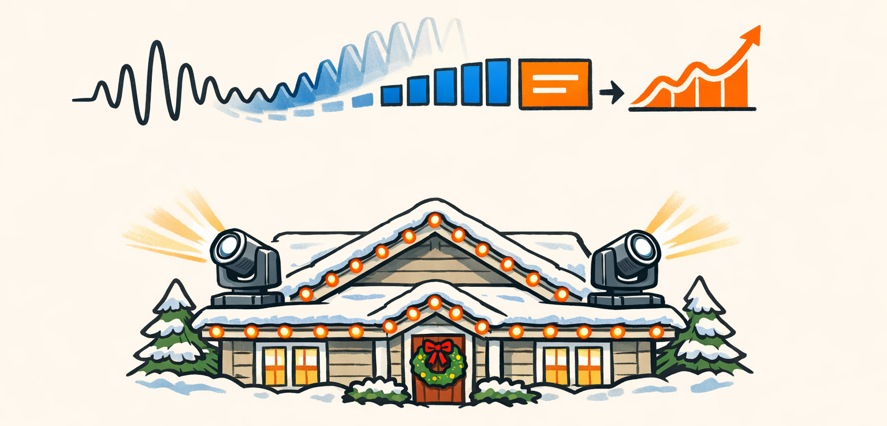

# Giving the Robot Ears Before It Touches the Lights

### The AI Asked an Embarrassingly Reasonable Question

The first really honest question our choreography system asked was basically this:

> “Cool. You want a three-minute Christmas light show. Where’s the beat? Where’s the chorus? Is this song building toward something, or just vibing politely the whole time?”

And, look, that’s an annoyingly fair question.

Because a `.wav` file is not “music” in any useful planning sense. It’s just a long stream of sample values. If you hand that directly to an LLM and say *go choreograph something magical*, you’re asking it to improvise while deaf, with moving head fixtures mounted on a roofline, in public, where everyone can see the mistakes.

Bold product strategy. Bad engineering strategy.

Bad hearing in this system doesn’t produce cute little metadata errors. It produces choreography that *looks wrong*. Hits land between beats. Big sweeps happen in the verse instead of the chorus. Energy ramps show up during quiet vocals like the house is having an emotional episode.

That’s the real setup for this whole series.

Before we ask the AI to be creative, we have to give it musical facts it can actually reason about: tempo, beats, bars, downbeats, sections, energy, and eventually lyrics. Not vibes. Not “probably pop-ish.” Actual structure.

And this boundary matters more than it first appears. A lot of what follows is really about deciding where deterministic signal processing should stop, and where the LLM is allowed to start having opinions. We’ll get to that split in Part 4, because that’s where things got philosophical and expensive.

For now, this is the origin story: the part where we taught the robot to hear before we let it touch the lights.

### A Song File Is Just Numbers, Which Is Rude Honestly

Here’s the thing: audio feels rich and meaningful to humans because our brains are doing absurd amounts of signal processing for free.

You hear *All I Want for Christmas Is You* and instantly know when the pulse starts, when the chorus lands, when the energy lifts, and when it’s time for the roofline to stop being shy.

A computer opens the same file and sees this:

- a sample rate, like 44,100 samples per second
- a few million floating-point numbers
- values that wiggle above and below zero

That’s it. No built-in “chorus starts here.” No “this is the downbeat.” No “Mariah is about to launch the neighborhood into orbit.”

A waveform is just amplitude over time. If you zoom way in, it’s a sequence of numbers telling you how much the air pressure changed at each instant. Useful, yes. Musically self-aware, absolutely not.

So feature extraction exists because raw signal data is too low-level for planning. It’s like asking someone to summarize a novel by inspecting the ink density on the page. Technically the information is there. Practically, you’ve lost the plot.

In Twinklr, the first step is turning those raw samples into features that actually describe musical behavior.

```python
# packages/twinklr/core/audio/energy/multiscale.py

def extract_smoothed_energy(
    y: np.ndarray, sr: int, *, hop_length: int, frame_length: int
) -> dict[str, Any]:
    """Extract RMS energy at multiple temporal scales."""
    rms = librosa.feature.rms(
        y=y,
        frame_length=frame_length,
        hop_length=hop_length,
    )[0].astype(np.float32)

    times_s = frames_to_time(np.arange(len(rms)), sr=sr, hop_length=hop_length)
    rms_norm = normalize_to_0_1(rms)

    if HAS_SCIPY:
        rms_beat = gaussian_filter1d(rms_norm, sigma=2).astype(np.float32)
        rms_phrase = gaussian_filter1d(rms_norm, sigma=10).astype(np.float32)
        rms_section = gaussian_filter1d(rms_norm, sigma=50).astype(np.float32)
    else:
        # Fallback: keep the raw curve so callers still get a usable shape.
        rms_beat = rms_norm.astype(np.float32)
        rms_phrase = rms_norm.astype(np.float32)
        rms_section = rms_norm.astype(np.float32)

    return {
        "times_s": as_float_list(times_s, 3),
        "raw": as_float_list(rms_norm, 5),
        "beat_level": as_float_list(rms_beat, 5),
        "phrase_level": as_float_list(rms_phrase, 5),
        "section_level": as_float_list(rms_section, 5),
    }
```

This is a tiny example, but it shows the pattern. We start with `y`, which is just the raw audio array, and transform it into something a planner can actually use: energy over time, smoothed at different scales.

That “different scales” part matters a lot. One spike might mean a snare hit. A broad rise might mean the chorus is arriving. Same song. Different questions.



Humans do this automatically.

Computers need help.

And, unfortunately, that help has to be good.

### Tempo, Beats, Bars, Downbeats, Sections — The Starter Pack

If you don’t have a music background, this vocabulary can sound more intimidating than it is. So let’s strip it down.

**Tempo** is just speed. Usually measured in BPM — beats per minute. If a Christmas song is 120 BPM, that means the pulse is moving at 120 beats each minute. Fast enough to feel lively, slow enough that your moving heads don’t look like they drank six espressos.

A **beat** is the regular pulse you clap to. The thing your foot taps to when you’re pretending not to enjoy a holiday song and then somehow know every word.

A **bar** — also called a **measure** — is a small group of beats. In a lot of Christmas music, that group is four beats long. So you count:

> one, two, three, four  
> one, two, three, four

That repeating chunk is the bar.

The **downbeat** is the first beat of the bar. It usually feels more anchored, more important. If you’re going to start a wide sweep across the roofline or snap all fixtures into a new formation, the downbeat is often where you want to do it. It’s the musical equivalent of planting your foot before you jump.

A **section** is a larger structural block: intro, verse, chorus, bridge, outro. Humans hear these pretty naturally. “Oh, this is the big singalong part” is section awareness. Computers, meanwhile, need several algorithms and a mild identity crisis.

And **energy** is how intense the music feels over time. Not just loudness. A quiet, tense build can feel more dramatic than a loud but flat section. We learned that one the hard way, and Part 2 is basically the postmortem.

Here’s the practical summary of what we extract and why the choreography engine cares:



If you want a concrete Christmas-song mental model, imagine a track with a soft piano intro, a verse with light percussion, then a chorus where bells, drums, and vocals all open up.

A human hears that and instinctively thinks:

- keep the intro restrained
- let the verse breathe
- save the bigger motion for the chorus
- hit the strong phrase changes on the bar lines

That’s the job.

The annoying part is that none of those concepts are physically present in the waveform as labeled objects. They have to be inferred from timing, onset strength, harmonic repetition, energy trends, spectral changes, and sometimes lyrics metadata if you want the choreography to do more than generic pulse-following.

So when we say “audio analysis,” we don’t mean one little preprocessing script that runs before the real work starts. We mean building a musical map the rest of the system can trust.

And yeah, “trust” is doing a lot of work in that sentence.

### Why This Isn’t Just 'Preprocessing'

Calling this stage “preprocessing” makes it sound like the parsley next to the steak.

It is not parsley.

It’s load-bearing.

Every downstream system in Twinklr assumes these musical facts are mostly correct. The planner assumes beat positions are real. The sequencer assumes bars are aligned. The creative profiling layer assumes choruses are actually choruses and not some poor confused mid-verse segment that got promoted by accident.

If tempo is wrong, timing density is wrong.

If beat tracking is wrong, fixtures fire between pulses and the whole show feels drunk.

If downbeats are wrong, larger moves lose their anchor.

If sections are wrong, the LLM starts making very sincere creative decisions on top of nonsense, which is honestly worse than random output because it’s wrong with confidence.

You can see that dependency chain in the code architecture too. `TimeResolver` in `packages/twinklr/core/sequencer/timing/resolver.py` expects `beats_s`, `bars_s`, `tempo_bpm`, and `assumptions.beats_per_bar` to already exist and be usable. Then `BeatGrid` turns that into precomputed boundaries for planning and rendering.

That means audio analysis isn’t a disposable front-end cleanup step. It’s the substrate. It’s the layer that turns “audio file” into “musical timeline.”

We’ll zoom in on rhythm in Part 1, where beat tracking occasionally hallucinates double-time tempos like 126 BPM for songs humans clearly feel at 63. Then in Part 3 we’ll get into section detection, which was the source of some truly cursed “chorus begins in the wrong universe” outputs.

But the headline is simple: if this layer lies, every layer above it tells prettier lies.

### Where Deterministic Math Stops and AI Starts Guessing Tastefully

One of the most useful decisions we made was drawing a hard line between **facts we can extract deterministically** and **interpretations we want the LLM to make**.

Because these are not the same problem.

Signal processing is where we ask questions like:

- where are the beats?
- what’s the estimated tempo?
- where do energy curves rise and fall?
- where are the likely section boundaries?
- what key is this in?
- what does the frame-by-frame timeline look like?

Those are math-and-algorithms questions. Messy sometimes, but still grounded. You can debug them. You can graph them. You can compare outputs against the song and say, “Yep, that beat marker is late by 120 ms, and that’s why the sweep looks cursed.”

Then there’s the interpretation layer. Once we have those facts, we can ask the LLM things like:

- is this chorus triumphant or intimate?
- should motion feel playful, reverent, dramatic, restrained?
- which visual motifs fit the lyrics and energy arc?
- what deserves emphasis versus just accompaniment?

That’s where taste comes in. And taste is exactly where LLMs are useful — as long as you don’t also ask them to reinvent tempo detection from first principles like a caffeinated intern with no headphones.

At a high level, the boundary looks like this:



And in code, the deterministic side is full of functions that look like this:

```python
# packages/twinklr/core/audio/rhythm/beats.py

def compute_beats(
    *,
    onset_env: np.ndarray,
    sr: int,
    hop_length: int,
    start_bpm: float = 120.0,
) -> tuple[float, np.ndarray]:
    """Extract tempo and beat frames from onset envelope."""
    tempo, beat_frames = librosa.beat.beat_track(
        onset_envelope=onset_env,
        sr=sr,
        hop_length=hop_length,
        units="frames",
        start_bpm=start_bpm,
        tightness=100,  # keep the tracker from wandering too much
    )

    if tempo is not None:
        tempo_f = float(tempo.item()) if hasattr(tempo, "item") else float(tempo)
    else:
        tempo_f = 0.0

    return tempo_f, np.asarray(beat_frames, dtype=int)
```

And then that data feeds timing infrastructure like this:

```python
# packages/twinklr/core/sequencer/timing/beat_grid.py

class BeatGrid(BaseModel):
    bar_boundaries: list[float]
    beat_boundaries: list[float]
    eighth_boundaries: list[float]
    sixteenth_boundaries: list[float]
    tempo_bpm: float
    beats_per_bar: int
    duration_ms: float

    @classmethod
    def from_resolver(cls, resolver: TimeResolver, duration_ms: float) -> "BeatGrid":
        beat_boundaries = [float(b) for b in resolver.get_beat_positions_ms()]
        bar_boundaries = [float(b) for b in resolver.get_bar_boundaries_ms()]

        return cls(
            bar_boundaries=bar_boundaries,
            beat_boundaries=beat_boundaries,
            eighth_boundaries=cls._calculate_eighth_boundaries(beat_boundaries),
            sixteenth_boundaries=cls._calculate_sixteenth_boundaries(beat_boundaries),
            tempo_bpm=resolver.tempo_bpm,
            beats_per_bar=resolver.beats_per_bar,
            duration_ms=duration_ms,
        )
```

This separation matters for three very practical reasons.

First, **debugging**. If the lights are late, we need to know whether the beat tracker was wrong or the planner made a weird creative choice. Mixing those layers together is how you end up debugging “art” at 1:30 a.m., which I do not recommend.

Second, **cost**. Deterministic extraction is cheap compared to repeatedly shoving giant blobs of raw audio-derived context into an LLM.

Third, **trust**. People will tolerate creative variation. They will not tolerate the roofline missing the chorus.

Part 4 is where we’ll get into how `packages/twinklr/core/agents/audio/profile/context.py` compresses all this into something the LLM can actually consume without setting money on fire.

### The Eight-Part Roadmap, or How We Avoid Drowning in Waveforms

So that’s the map.

This series is basically the story of how raw audio becomes something creative systems can reason about without embarrassing us in front of a suburban audience.



The arc breaks into three chunks:

**Foundation**
- **Part 0**: this one — why audio intelligence has to exist at all
- **Part 1**: rhythm, tempo, beats, downbeats, and the double-time nonsense
- **Part 2**: energy, dynamics, and why loud isn’t the same as intense
- **Part 3**: section detection, where structure finally stops being a rumor

**Iteration**
- **Part 4**: context compression, or how we squeeze musical facts into an LLM-sized suitcase
- **Part 5**: lyrics, phonemes, and the fallback chain we built because the real world is deeply committed to being inconvenient
- **Part 6**: end-to-end integration, following one audio decision all the way to the lights on the roof

**Maturation**
- **Part 7**: the playbook — what actually worked, what failed, and what we’d tell past us before letting an LLM choreograph Christmas lights again

If Part 0 has a single thesis, it’s this: audio intelligence isn’t a nice extra bolted onto choreography.

It’s the floor.

Everything else stands on it.



---

## About twinklr


twinklr is our ongoing science experiment in weaponizing holiday cheer. It's an AI-driven choreography and composition engine that takes an audio file and spits out fully synchronized sequences for Christmas light displays in xLights — because apparently we looked at a normal, peaceful hobby and thought, "What if we added AI, machine learning, and sleepless nights?"

Here's the honest disclaimer: we're not professional lighting designers. We're developers, engineers, and AI researchers who spend our days building at the frontier of AI and our nights obsessing over why a dimmer curve feels late by half a beat and whether a roofline sweep should be dramatic or merely aggressively festive. If you're expecting polished stage-production wisdom, you're in the wrong place. If you're into nerdy overengineering, mildly unhinged experimentation, and the occasional “how did that even work?” moment, welcome.

This blog is the running log of our journey: the wins, the faceplants, the weird breakthroughs, and the lessons learned the hard way, often repeatedly. We'll share what we're building, what breaks, and why certain architectural decisions matter — especially when the goal is to turn “song” into “show” without the lights looking like they're having an existential crisis.
