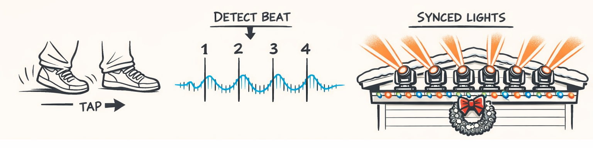
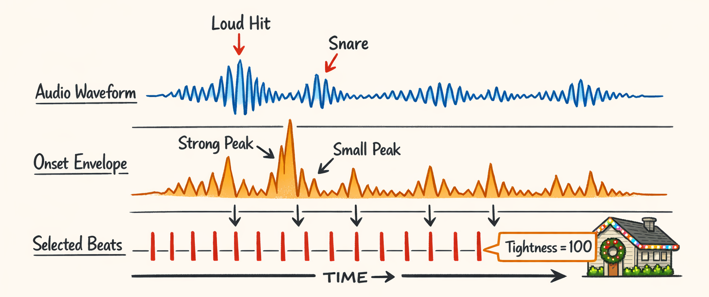
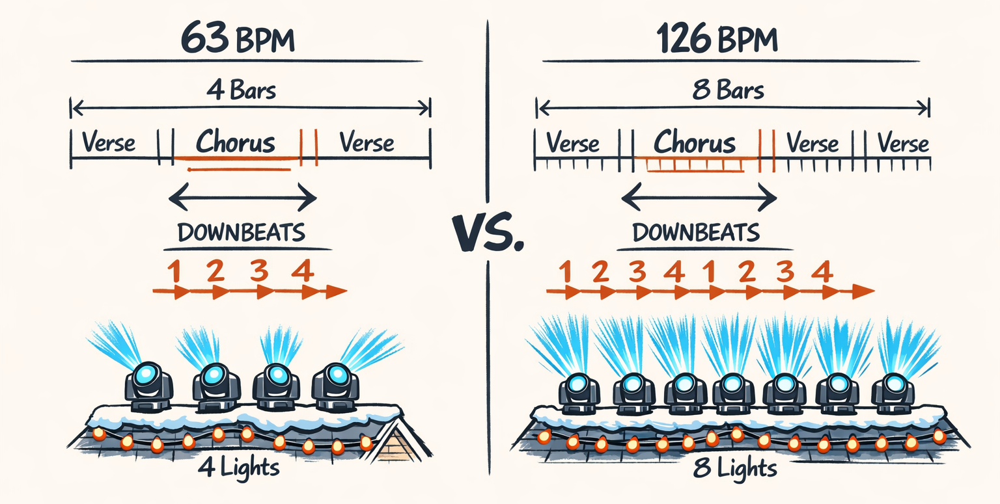
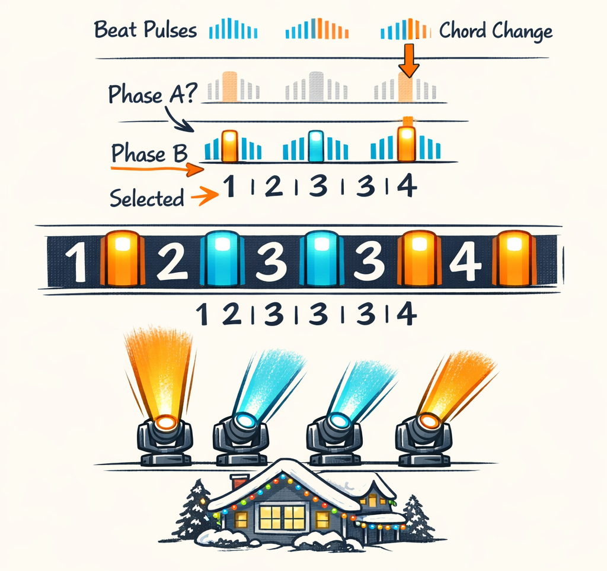
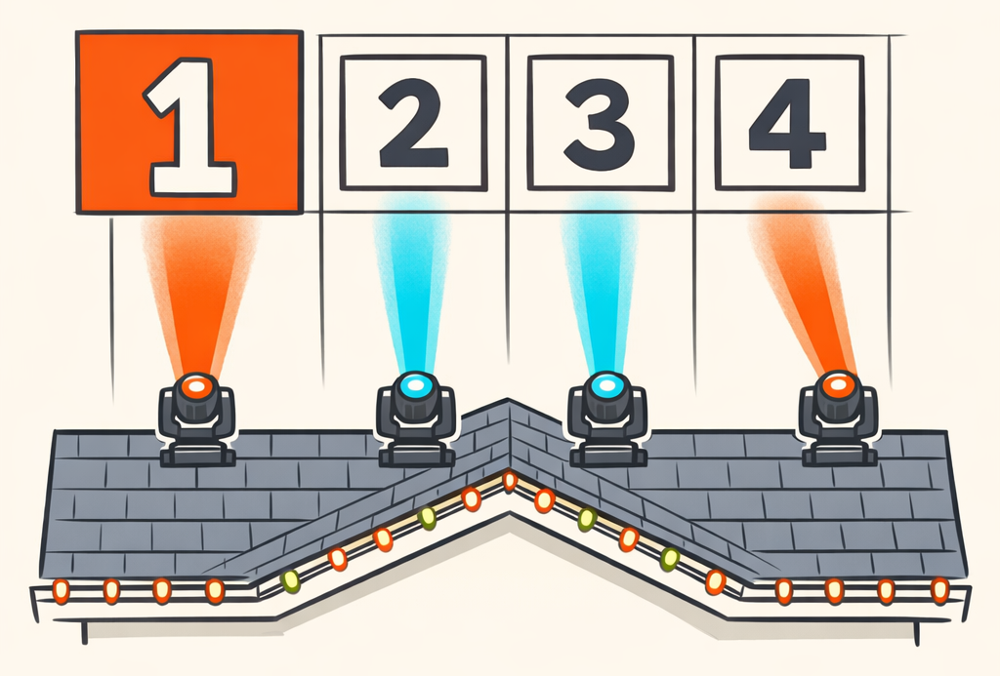

# The Pulse: When the Beat Tracker Hears 126 BPM and the Song Swears It’s 63

Part 0 was about giving the system ears at all. Raw audio had to become something more useful than “a suspiciously festive pile of float32s.” This part is where those ears start developing opinions.

And wow, did they develop opinions.

The first big rhythm question sounded almost insultingly simple: find the beat. Humans do this without thinking. A song starts, your foot starts tapping, and if you’re me, you immediately begin imagining whether the roofline should sweep on every bar or whether the moving heads should punch accents on the chorus. Easy.

Then the computer heard a song at 126 BPM that every human in the room would clap at 63.

That wasn’t a cute little off-by-one bug. That was the kind of mistake that makes the rest of the pipeline confidently build choreography in the wrong universe.

So this is the story of tempo, beat tracking, downbeats, time signatures, and the tiny timing bureaucrat we built to keep all of it from drifting into chaos.

## The Foot-Tap Test

Here’s the annoying part: before you can explain beat tracking, you have to answer a question that sounds philosophical but turns into a production bug really fast.

What *is* a beat?

In plain language, a **beat** is the regular pulse you’d clap or tap your foot to. Not every sound. Not every drum hit. Just the underlying “thump-thump-thump” your body latches onto.

**Tempo** is how fast those beats arrive, usually measured in **BPM** — beats per minute.

A **bar** is a small group of beats that repeats in a pattern. In a lot of pop and Christmas music, that pattern is four beats long:

> one, two, three, four | one, two, three, four

The **downbeat** is the first beat of the bar. The “one.” It’s the beat that feels like the start of something. If a musical phrase is a sentence, the downbeat is the capital letter.

A **time signature** tells you how those beats are grouped. If a song is in **4/4**, you count four beats per bar. If it’s **3/4**, you count three. If it’s **6/8**, things get weirder in a fun seasonal way.

You can hear this in familiar holiday stuff:

- **“Jingle Bells”** usually feels straightforward and march-like. You can count it in even groups and feel where the phrases start.
- **“Carol of the Bells”** has that relentless repeating pattern that makes your brain feel smart for recognizing it after two notes.
- **“Silent Night”** often has a waltz feel — one-two-three, one-two-three — which matters a lot if your planner assumes every song wants to be four-square and obedient.

For choreography, raw BPM is useful, but it’s not enough. If I tell the lighting engine “this song is 120 BPM,” that only tells it roughly how often beats happen. It does **not** tell it where the bars begin.

And bars are where the visual language lives.

A sweep across the roofline every bar feels intentional. A fan-out on the downbeat feels musical. A color change every eight bars feels like structure. If you miss the downbeat and fire the big moment on beat 3 instead of beat 1, the audience won’t explain the problem in music theory terms. They’ll just feel that the show is... off. Like the lights are enthusiastic but not invited.

That was our first lesson. We weren’t just detecting pulse. We were trying to detect *musical gravity*.

## How the Computer Finds the Pulse Without Owning Feet

So how do you teach a machine to tap its foot when it has neither feet nor shame?

The usual trick starts with **onset detection**. An **onset** is a moment when something new happens in the music: a drum hit, a chord attack, a vocal consonant, a piano note. If you measure “how much musical stuff just changed right now?” frame by frame, you get an **onset envelope** — basically an activity signal with spikes where events happen.

That signal is what `compute_beats()` consumes in `packages/twinklr/core/audio/rhythm/beats.py`.

```python
def compute_beats(
    *,
    onset_env: np.ndarray,
    sr: int,
    hop_length: int,
    start_bpm: float = 120.0,
) -> tuple[float, np.ndarray]:
    """Extract tempo and beat frames from onset envelope."""
    tempo, beat_frames = librosa.beat.beat_track(
        onset_envelope=onset_env,
        sr=sr,
        hop_length=hop_length,
        units="frames",
        start_bpm=start_bpm,
        tightness=100,  # this ended up mattering a lot
    )

    if tempo is not None:
        tempo_f = float(tempo.item()) if hasattr(tempo, "item") else float(tempo)
    else:
        tempo_f = 0.0

    return tempo_f, np.asarray(beat_frames, dtype=int)
```

The short version of what `librosa.beat.beat_track()` does is: it looks at the onset envelope, considers a bunch of plausible pulse spacings, and tries to find a sequence of beat positions that both:

1. land on strong onset activity, and
2. stay reasonably regular over time.

Under the hood, it’s doing dynamic programming. Which is a very elegant phrase meaning “it tries lots of possibilities and picks the least embarrassing one.”

That second part — regular spacing — is where `tightness=100` came in.

With lower tightness, the tracker was more willing to wander. That sounds nice in theory because real music breathes a little. In practice, for Christmas tracks with sleigh bells, choirs, soft intros, and then a sudden kick drum entering like it owns the place, the looser tracker got distracted constantly. It would latch onto decorative rhythmic events instead of the actual pulse.

Cranking `tightness` up to 100 made it more stubborn. More willing to say, “No, I know what the pulse is, and I’m not changing my mind because a tambourine got excited.”

That one parameter change cleaned up a surprising amount of nonsense.

Conceptually, the pipeline looked like this:

1. decode audio
2. compute onset strength over short frames
3. feed the onset envelope into beat tracking
4. get back a tempo estimate and beat frame indices
5. convert frames into real times

The frame-to-time conversion uses the helper from `packages/twinklr/core/audio/utils.py`, because eventually every musical idea has to become actual milliseconds if you want hardware to do anything useful.



When this worked, it felt almost magical. A messy waveform turned into a clean pulse train. Bars started to become possible. Planning started to become possible.

And then we ran into the part where the algorithm heard double.

## The Part Where the Algorithm Hears Double

If you’ve never dealt with beat tracking before, here’s a delightful little trap: the algorithm can be *perfectly consistent* and still be totally wrong.

Take a song humans feel at **63 BPM**. The tracker hears **126 BPM**.

Or the opposite: a song with an obvious 128-style pulse gets interpreted around 64.

This is the classic **tempo octave** problem — half-time versus double-time. The tracker isn’t hallucinating random numbers. It’s choosing between two musically plausible grids.

That sounds harmless until you use that tempo downstream.

If the song is actually felt in 63 BPM, then one beat lasts about `60 / 63 ≈ 0.95` seconds, and one bar of 4/4 lasts about 3.81 seconds. If you mistakenly plan it at 126 BPM, you cut those durations in half. Every four-bar phrase becomes two bars. Every section estimate compresses. Every “big moment on bar 33” lands way too early. The show doesn’t just drift — it sprints confidently into traffic.

Here’s the base tracker we started with:

```python
tempo_bpm, beat_frames = compute_beats(
    onset_env=onset_env,
    sr=sr,
    hop_length=hop_length,
    start_bpm=120.0,
)

beat_times_s = frames_to_time(beat_frames, sr=sr, hop_length=hop_length)
```

And here’s the kind of correction logic we ended up layering on top in the analysis pipeline, simplified but faithful to the actual idea:

```python
def correct_tempo_octave(
    tempo_bpm: float,
    beat_times_s: np.ndarray,
    beats_per_bar: int,
) -> float:
    candidates = [tempo_bpm, tempo_bpm / 2.0, tempo_bpm * 2.0]
    candidates = [t for t in candidates if 45.0 <= t <= 220.0]

    best_tempo = tempo_bpm
    best_score = -1.0

    intervals = np.diff(beat_times_s)
    if len(intervals) == 0:
        return tempo_bpm

    for candidate in candidates:
        beat_period = 60.0 / candidate

        # How well do observed beat intervals match this candidate?
        interval_error = np.mean(np.abs(intervals - beat_period))

        # In the full pipeline we also cross-check bar stability and downbeat alignment.
        phrase_score = 1.0 / (1e-6 + interval_error)

        if phrase_score > best_score:
            best_score = phrase_score
            best_tempo = candidate

    return best_tempo
```

Was this mathematically pure? Absolutely not. Was it better than letting the tracker gaslight the entire choreography stack? Very much yes.

We also cross-checked tempo hypotheses against downbeat patterns. If the “126 BPM” interpretation produced bar starts that never lined up with stronger accents, while the “63 BPM” version did, that was a huge clue that the tracker was hearing subdivisions instead of the real pulse.

The ugly truth: our first pass broke on exactly the kinds of songs you’d expect to break it.

- sparse intros with later percussion
- swung or triplet-heavy arrangements
- choir-forward recordings with soft attacks
- songs with strong eighth-note motion that tempted the tracker into double-time
- dramatic ballads where the vocal phrasing screamed one pulse and the accompaniment suggested another

We had songs where the beat spacing looked reasonable but the bar structure was nonsense. Which is honestly worse, because nonsense with confidence is harder to catch.



That’s when we stopped treating “tempo detected” as success.

Finding beats was only half the job.

## Beat Tracking Finds a Pulse. Downbeat Detection Finds “One.”

This distinction took us longer than I’d like to admit.

Beat tracking gives you a series of pulses:

> tick tick tick tick tick tick

Useful, yes. But choreography usually wants this:

> **ONE** two three four | **ONE** two three four

That bold part matters a lot.

A **downbeat** is the first beat in a bar. It’s where phrases resolve, where visual resets feel natural, and where “do the big thing now” usually belongs. If you know the beats but not which beat is **one**, you can still build a show — it’ll just have the energy of someone starting every sentence in the middle.

Our downbeat detection ended up being **phase alignment** over the beat sequence. Given detected beats and a hypothesized meter — say 4 beats per bar — we score different starting offsets:

- maybe beat 0 is the downbeat
- maybe beat 1 is
- maybe beat 2 is
- maybe beat 3 is

Then we pick the phase where the first beat of each group tends to land on stronger musical evidence.

In practice that evidence came from two places:

1. **weighted onset strength** — strong attacks often happen on bar starts
2. **harmonic change** — chord movement often lines up with downbeats too

A cleaned-up sketch of the idea looks like this:

```python
def choose_downbeat_phase(
    beat_frames: np.ndarray,
    onset_env: np.ndarray,
    beats_per_bar: int,
) -> int:
    strengths = onset_env[np.clip(beat_frames, 0, len(onset_env) - 1)]

    best_phase = 0
    best_score = float("-inf")

    for phase in range(beats_per_bar):
        phase_mask = np.arange(len(strengths)) % beats_per_bar == phase
        phase_strengths = strengths[phase_mask]
        off_strengths = strengths[~phase_mask]

        if len(phase_strengths) == 0:
            continue

        off_mean = float(np.mean(off_strengths)) if len(off_strengths) else 0.0
        score = float(np.mean(phase_strengths) - 0.35 * off_mean)
        if score > best_score:
            best_score = score
            best_phase = phase

    return best_phase
```

That’s not the whole production version, but it captures the shape of it: test each phase, reward the one whose “first beats” are strongest.



Once we had a downbeat phase, we could turn generic beats into bars. And once we had bars, we could hand the whole thing off to the timing layer that the rest of the system actually trusts.

That handoff became `BeatGrid`.

But before that, there was one more musical fact we had to stop assuming.

## Time Signatures: Because Not Every Song Wants to Be in 4/4

Most of the songs we deal with are in **4/4**. Residential Christmas light shows are not exactly a hotbed of avant-garde Balkan meter.

Still, “most” is not “all,” and the songs that break your assumptions are always the ones a customer really cares about.

So `detect_time_signature()` in `packages/twinklr/core/audio/rhythm/beats.py` tries to infer beat grouping from accent patterns instead of just shrugging and hardcoding 4/4 forever.

The function starts by sampling onset strengths at the beat locations, normalizing them, and asking a simple question for different group sizes:

> If I group beats into chunks of `n`, is the first beat of each chunk usually the strongest?

That’s the `score_grouping()` part.

```python
def score_grouping(n: int) -> float:
    if len(strengths_norm) < n * 3:
        return 0.0

    n_groups = len(strengths_norm) // n
    if n_groups < 2:
        return 0.0

    grouped = strengths_norm[: n_groups * n].reshape(n_groups, n)

    first_beat_is_max = (grouped.argmax(axis=1) == 0).astype(float)
    first_beat_above_avg = (grouped[:, 0] > grouped.mean(axis=1)).astype(float)

    return float(
        0.6 * np.mean(first_beat_is_max)
        + 0.4 * np.mean(first_beat_above_avg)
    )
```

Then it backs that up with autocorrelation on the beat-strength sequence, which is a fancy way of checking whether accent patterns repeat every 3 beats, 4 beats, 6 beats, and so on.

The point isn’t to become a full musicology engine. The point is to avoid dumb mistakes.

A waltz-like **3/4** track should not get bar boundaries every four beats just because four is common. And **6/8** is its own special holiday gremlin: it can feel like six subdivisions per bar, but often behaves more like two big pulses with internal triplet motion. If you quantize that wrong, your visuals end up looking weirdly square against a song that’s trying very hard to be flowing and circular.

Downstream, time signature affects bar construction, phrase length, and quantization. If you think a song is in 4 when it’s really in 3, every later “align to bar” operation is poisoned.

Which brings us to the object that exists mostly to prevent everyone else from making timing up as they go.

## BeatGrid, the Tiny Bureaucrat That Keeps Everyone Honest

Look, every nontrivial system eventually needs one component whose entire job is to say, “No. We already agreed what time means.”

For us, that’s `BeatGrid` in `packages/twinklr/core/sequencer/timing/beat_grid.py`.

It’s not glamorous. It’s not doing deep learning. It’s not generating choreography. It’s basically a frozen Pydantic model full of precomputed boundaries.

And I love it.

```python
class BeatGrid(BaseModel):
    model_config = ConfigDict(frozen=True)

    bar_boundaries: list[float]
    beat_boundaries: list[float]
    eighth_boundaries: list[float]
    sixteenth_boundaries: list[float]
    tempo_bpm: float
    beats_per_bar: int
    duration_ms: float
```

That’s the contract.

Everything upstream can argue about tempo hypotheses and downbeat phase and whether sleigh bells count as rhythmic evidence. Everything downstream gets a simple answer:

- here are the bar starts
- here are the beat starts
- here are the subdivisions
- here’s the average BPM
- here’s the meter
- here’s how long the song is

The preferred construction path is through real analyzed audio, not idealized math. `BeatGrid.from_resolver()` wraps `TimeResolver`, which already knows about audio-derived beat and bar positions.

```python
@classmethod
def from_resolver(cls, resolver: TimeResolver, duration_ms: float) -> BeatGrid:
    beat_boundaries_int = resolver.get_beat_positions_ms()
    bar_boundaries_int = resolver.get_bar_boundaries_ms()

    beat_boundaries = [float(b) for b in beat_boundaries_int]
    bar_boundaries = [float(b) for b in bar_boundaries_int]

    return cls(
        bar_boundaries=bar_boundaries,
        beat_boundaries=beat_boundaries,
        eighth_boundaries=cls._calculate_eighth_boundaries(beat_boundaries),
        sixteenth_boundaries=cls._calculate_sixteenth_boundaries(beat_boundaries),
        tempo_bpm=resolver.tempo_bpm,
        beats_per_bar=resolver.beats_per_bar,
        duration_ms=duration_ms,
    )
```

That `resolver` piece matters. `TimeResolver` in `packages/twinklr/core/sequencer/timing/resolver.py` is where musical time and absolute time shake hands.

Its constructor tells the whole story:

```python
class TimeResolver:
    def __init__(self, song_features: dict[str, Any]):
        self.beats_s = np.array(song_features.get("beats_s", []), dtype=np.float64)
        self.bars_s = np.array(song_features.get("bars_s", []), dtype=np.float64)
        self.tempo_bpm = song_features.get("tempo_bpm", 120.0)
        self.duration_s = song_features.get("duration_s", 0.0)
        self.beats_per_bar = song_features.get("assumptions", {}).get("beats_per_bar", 4)
```

If those arrays are populated from actual analysis, `TimeResolver` can convert positions like “bar 12.5” into milliseconds using the song’s real timing instead of pretending every recording is a perfect click-track robot.

That’s why `BeatGrid` has multiple construction paths in practice:

- from a `TimeResolver` backed by real song features
- from song feature dictionaries via resolver-style initialization
- from fallback mathematical assumptions when the audio data is incomplete

That last path exists because production systems need a plan B. But it’s very much plan B. The real-audio path is the one we trust.

And once the grid exists, the rest of the planner gets some wonderfully boring utility methods. Things like:

- `snap_to_nearest_bar(...)`
- `snap_to_nearest_beat(...)`
- `get_bar_start_ms(bar_index)`

Those methods don’t sound exciting until you’ve watched three different subsystems each invent their own version of “close enough to the beat.” That way lies chaos. Or worse, *almost* synchronized lights.

A simplified version of the behavior looks like this:

```python
def snap_to_nearest_beat(self, time_ms: float) -> float:
    return min(self.beat_boundaries, key=lambda b: abs(b - time_ms))


def snap_to_nearest_bar(self, time_ms: float) -> float:
    return min(self.bar_boundaries, key=lambda b: abs(b - time_ms))


def get_bar_start_ms(self, bar_index: int) -> float:
    if bar_index < 0 or bar_index >= len(self.bar_boundaries):
        raise IndexError(f"Bar index {bar_index} out of range")
    return self.bar_boundaries[bar_index]
```


This is the part that made the rest of the system sane.

The section detector could ask for bar-aligned boundaries. The template planner could snap effect starts to beats. Later, in Part 6, the renderer uses the same timing contract when it turns plans into actual fixture events. One shared definition of time. Fewer opportunities for everyone to be wrong in slightly different ways.

Again: tiny bureaucrat. Extremely useful.

## Why We Chose Real Beat Positions Over Metronome Math

There was a tempting shortcut early on.

Once you have BPM, you can just say:

> cool, a beat happens every `60 / BPM` seconds forever

That works great if your input is a DAW export snapped to a grid by someone with infinite patience and no swing.

Real recordings are messier.

A singer can drag a phrase a little. A live-feeling arrangement can breathe. A soft intro can have ambiguous attacks. Even commercial tracks that feel steady often have tiny timing variations that humans absorb without noticing — but lighting hardware absolutely notices if you keep quantizing to an imaginary metronome instead of the song that’s actually playing.

So we chose to use **audio-derived beat positions** as the source of truth whenever we had them.

That decision cost us more effort up front. Beat tracking had to be better. Downbeats had to be better. The grid had to support uneven real intervals instead of hiding behind average BPM.

But it paid off immediately. Effects landed where the music actually was, not where a spreadsheet thought it should be.

And it pays off again later. In Part 6, when we follow one analysis decision all the way to moving heads on a roofline, the renderer uses the same grid. No silent resynthesis of timing. No “close enough.” Just one hard promise carried through the stack.

That’s really what rhythm extraction became for us: the first promise the system makes to everything else.

If that promise is wrong, the rest of the show can be brilliant and still feel broken.



---

## About twinklr


twinklr is our ongoing science experiment in weaponizing holiday cheer. It's an AI-driven choreography and composition engine that takes an audio file and spits out fully synchronized sequences for Christmas light displays in xLights — because apparently we looked at a normal, peaceful hobby and thought, "What if we added AI, machine learning, and sleepless nights?"

Here's the honest disclaimer: we're not professional lighting designers. We're developers, engineers, and AI researchers who spend our days building at the frontier of AI and our nights obsessing over why a dimmer curve feels late by half a beat and whether a roofline sweep should be dramatic or merely aggressively festive. If you're expecting polished stage-production wisdom, you're in the wrong place. If you're into nerdy overengineering, mildly unhinged experimentation, and the occasional "how did that even work?" moment — welcome.

This blog is the running log of our journey: the wins, the faceplants, the weird breakthroughs, and the lessons learned the hard way, often repeatedly. We'll share what we're building, what breaks, and why certain architectural decisions matter — especially when the goal is to turn "song" into "show" without the lights looking like they're having an existential crisis in public.
