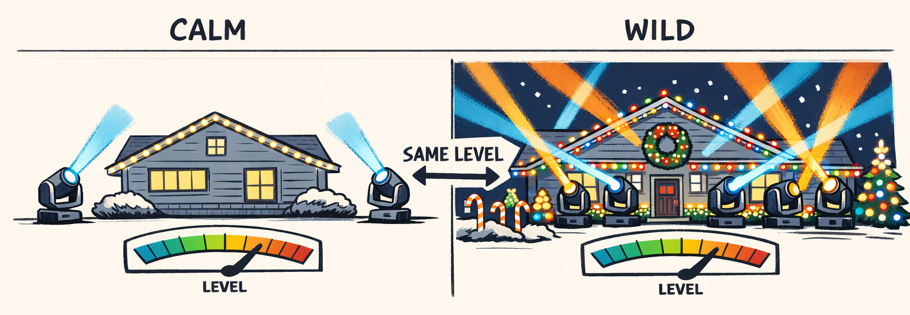
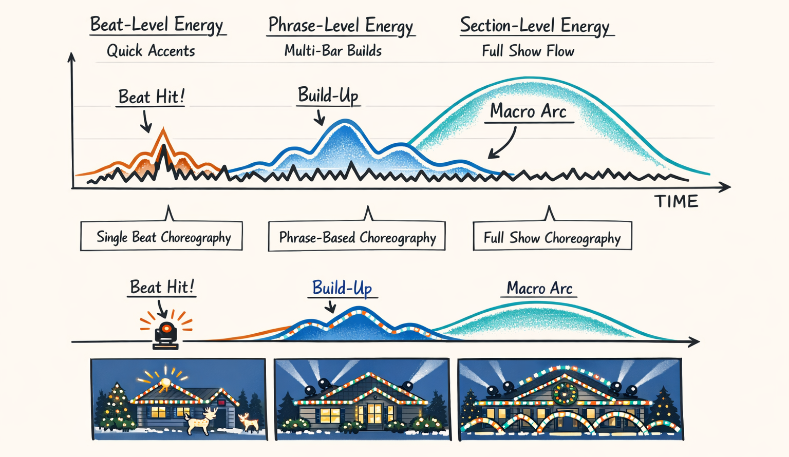
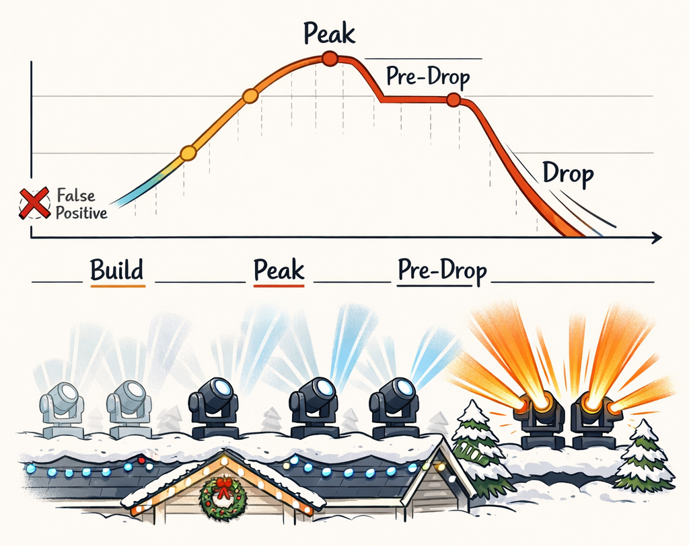
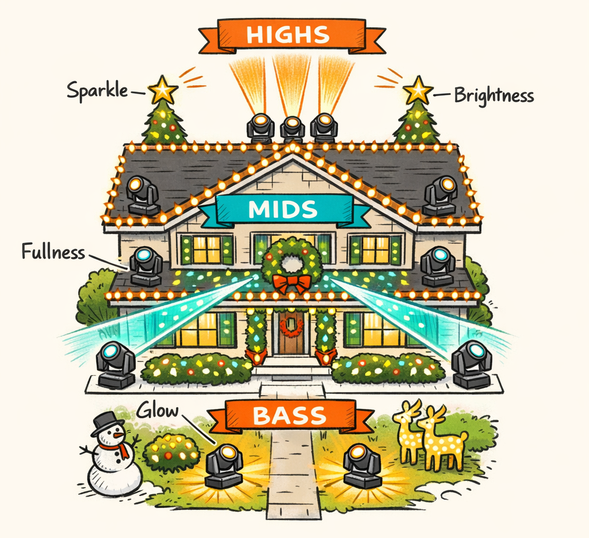
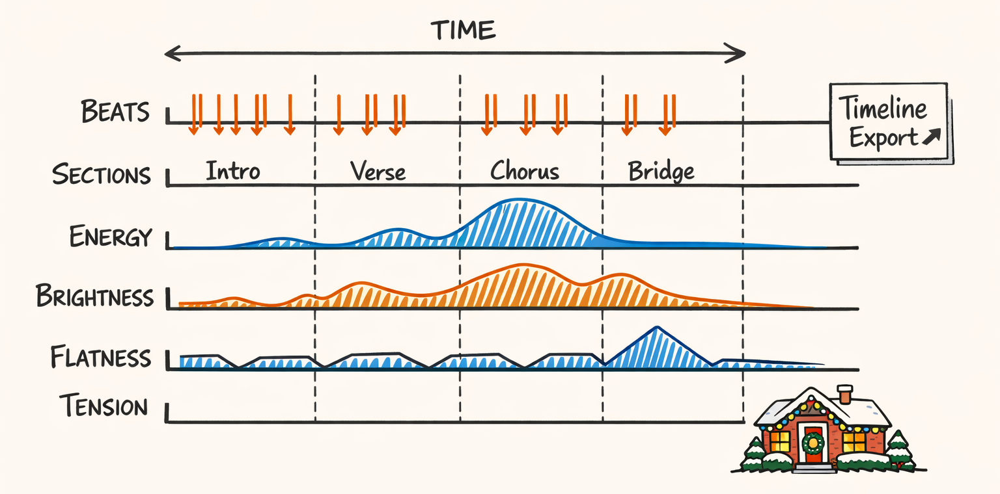
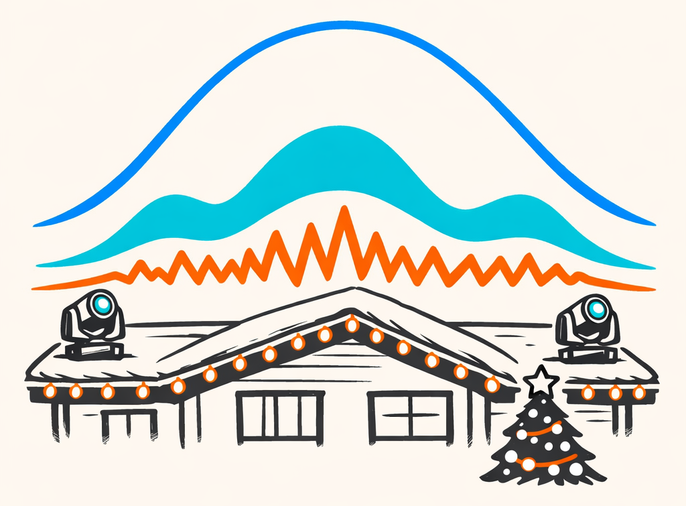

# The Dynamics: Loud Isn’t the Same as Intense, and the Audio Pipeline Learned That the Hard Way

Part 1 was about rhythm — basically teaching the machine to stop tripping over the beat and embarrassing itself in public.

This part is about something slipperier.

Intensity.

Not volume. Not just amplitude. Not “the waveform is taller so the moment must be bigger.” We tried that. It turns out modern music production has spent about two decades making “loud” a deeply untrustworthy narrator. A chorus can hit like a truck while barely moving the RMS meter. A stripped-down verse can sit at almost the same average loudness and feel like the room suddenly got twice as small.

Which is a problem when you’re asking an AI to choreograph moving heads on a roofline.

Because if the system thinks every equally loud moment deserves equally big motion, you get shows that are technically synchronized and emotionally clueless. The lights hit on time, sure, but they don’t *mean* anything. It feels like the fixtures are filling out paperwork.

So we had to stop asking, “How loud is this frame?” and start asking a much more annoying question:

> How intense does this moment *feel*, and what measurable signals get us closest to that without pretending DSP is a psychology degree?

That sent us into multi-scale energy, build/drop detection, spectral features, tension curves, and eventually a unified timeline dense enough to be useful and compact enough to survive the rest of the pipeline.

And yes, some of the early outputs were spectacularly dumb.

Like “gentle acoustic intro gets full-house panic sweep because the mastering engineer owned a compressor” dumb.

Let’s get into it.

## Volume Lied to Us

RMS energy is where a lot of audio pipelines start, and honestly, that’s not wrong.

If you’ve never seen it before, RMS means **root mean square**. In plain English: take a short chunk of audio samples, square them so negatives don’t cancel positives, average them, then take the square root so you get back to a meaningful scale. It gives you a decent “how much signal is there here?” number for each frame.

That’s useful. Very useful.

It tells you when the track is generally stronger or weaker. It catches obvious crescendos. It gives you a stable baseline that isn’t as twitchy as raw sample peaks, which are basically caffeine in numeric form.

But here’s where it bit us: **RMS is a measure of physical energy, not dramatic intent**.

A modern compressed pop mix can keep the RMS pretty high almost all the time. Verse? Loud. Chorus? Also loud. Bridge? Still pretty loud, just with different arrangement density. Meanwhile, a sparse holiday ballad can have a relatively modest RMS number while still feeling huge because the vocal opens up, the harmony thickens, and the arrangement suddenly grows a spine.

If you drive choreography from RMS alone, both situations get flattened.

The compressed mix becomes one long “pretty intense, I guess” plateau. The sparse arrangement gets underestimated right when it needs emotional payoff.

That was our first “oh, right, music is rude” moment.

You could see it in the generated motion. Two sections with similar loudness produced nearly identical movement budgets, even when one was a restrained verse and the other was the big cinematic lift. Same dimmer confidence. Same sweep size. Same fixture count. Completely wrong vibe.

So RMS stayed in the pipeline, but it got demoted from “truth” to “useful witness.” We still wanted energy. We just needed more than one kind of it.

Because intensity, it turns out, is a stack.

Not a scalar.

## Three Zoom Levels of Energy, Because One Wasn’t Cutting It

The first thing that actually helped was admitting that “energy” exists at different time scales.

A snare hit and an eight-bar build are not the same event wearing different hats. One is an accent. The other is narrative. If you smooth both with one window and call it done, you blur the exact information you need for choreography.

That logic ended up in `packages/twinklr/core/audio/energy/multiscale.py` inside `extract_smoothed_energy()`:

```python
def extract_smoothed_energy(
    y: np.ndarray, sr: int, *, hop_length: int, frame_length: int
) -> dict[str, Any]:
    """Extract RMS energy at multiple temporal scales."""
    rms = librosa.feature.rms(
        y=y,
        frame_length=frame_length,
        hop_length=hop_length,
    )[0].astype(np.float32)

    times_s = frames_to_time(np.arange(len(rms)), sr=sr, hop_length=hop_length)
    rms_norm = normalize_to_0_1(rms)

    if HAS_SCIPY:
        # Short smoothing: keeps accents and beat-sized motion
        rms_beat = gaussian_filter1d(rms_norm, sigma=2).astype(np.float32)

        # Medium smoothing: catches phrase arcs over a few bars
        rms_phrase = gaussian_filter1d(rms_norm, sigma=10).astype(np.float32)

        # Long smoothing: captures the macro section shape
        rms_section = gaussian_filter1d(rms_norm, sigma=50).astype(np.float32)
    else:
        def smooth(arr: np.ndarray, window: int) -> np.ndarray:
            if arr.size < window:
                return arr.copy()
            return np.convolve(arr, np.ones(window) / window, mode="same").astype(np.float32)

        rms_beat = smooth(rms_norm, 5)
        rms_phrase = smooth(rms_norm, 20)
        rms_section = smooth(rms_norm, 100)

    return {
        "times_s": as_float_list(times_s, 3),
        "raw": as_float_list(rms_norm, 5),
        "beat_level": as_float_list(rms_beat, 5),
        "phrase_level": as_float_list(rms_phrase, 5),
        "section_level": as_float_list(rms_section, 5),
        "_np": {"rms_norm": rms_norm, "times_s": times_s},
    }
```



The three scales ended up mapping pretty naturally to how humans talk about music:

- **Beat-level energy** is the “did something just hit?” view.
- **Phrase-level energy** is the “is this passage opening up or settling down?” view.
- **Section-level energy** is the “where are we in the song’s overall arc?” view.

If you want a metaphor, think camera zoom.

Beat-level is a close-up of the drummer’s stick hitting the snare.

Phrase-level is the shot where you can tell the whole band is leaning forward.

Section-level is the drone shot where the chorus finally arrives and everyone in the yard suddenly looks more competent than the software that got them there.

This mattered a lot for lights.

Beat-level energy helps decide whether a beat should get a punchy accent, a dimmer hit, or a sharper pan/tilt impulse.

Phrase-level energy helps shape motion over a few bars — maybe sweeps get wider, fixture groups get denser, or color changes stop being shy.

Section-level energy is where we decide the broader budget: are we in a restrained verse, a full-send chorus, or that fake breakdown where the song is clearly setting up a larger thing in 16 seconds?

And because this series likes being honest, here’s the mistake we made first: we tried using the short-scale curve for too many decisions. The result was choreography that reacted correctly to every little moment and still felt wrong overall. Lots of accurate twitching. No arc. Like a drummer with no concept of a sentence.

Remember the BeatGrid from Part 1? This is where it starts paying rent. Once you have reliable musical boundaries, these energy scales can be sampled against beats, bars, and phrases instead of floating around as anonymous frame data. That’s the bridge from signal processing to actual show planning.

Not enough by itself.

But finally useful.

## Builds, Drops, and the Moments the Audience Actually Remembers

People don’t usually walk away from a song talking about “the average energy contour.”

They remember **the build**, **the fake-out**, **the drop**, **the release**. The moments where the arrangement winds up and then either explodes or yanks the floor out from under you.

So we added explicit build/drop detection in `packages/twinklr/core/audio/energy/builds_drops.py`:

```python
def detect_builds_and_drops(
    energy_curve: np.ndarray,
    times_s: np.ndarray,
    onset_env: np.ndarray,
    beats_s: list[float],
    tempo_bpm: float,
) -> dict[str, Any]:
    """Detect energy ramps (builds) and sudden changes (drops) with context awareness."""
    if len(energy_curve) < 50:
        return {"builds": [], "drops": [], "pre_drops": []}

    profile_info = classify_song_energy_profile(
        energy_curve=energy_curve,
        tempo_bpm=tempo_bpm,
        onset_env=onset_env,
        duration_s=float(times_s[-1] - times_s[0]) if len(times_s) > 0 else 0.0,
    )
    params = profile_info["parameters"]

    window = int(len(energy_curve) / 100)
    window = max(5, min(window, 50))
    energy_smooth = gaussian_filter1d(energy_curve, sigma=window / 3)

    gradient = np.gradient(energy_smooth)

    bar_duration_s = 60.0 / tempo_bpm * 4
    min_build_bars = params["min_build_bars"]

    builds = _detect_builds_windowed(
        energy_smooth=energy_smooth,
        times_s=times_s,
        bar_duration_s=bar_duration_s,
        min_build_bars=min_build_bars,
        min_energy_gain=params["min_energy_gain"],
    )

    drops = _detect_drops_adaptive(
        energy_smooth=energy_smooth,
        gradient=gradient,
        times_s=times_s,
        threshold_percentile=params["gradient_percentile"],
    )

    pre_drops = _detect_pre_drop_tension(builds=builds, drops=drops, beats_s=beats_s)

    return {
        "builds": builds,
        "drops": drops,
        "pre_drops": pre_drops,
        "profile": profile_info,
    }
```



The sneaky important bit here is the profile classifier.

A quiet piano-and-vocal Christmas track and a four-on-the-floor holiday remix do not need the same detection thresholds. If you use fixed parameters, the ballad gets ignored and the dance track gets over-labeled like a freshman CS assignment with too many comments.

So `classify_song_energy_profile()` adjusts things like:

- minimum build length in bars
- gradient percentile for what counts as a meaningful change
- minimum energy gain before we call something a real build

That context-awareness saved us.

Before tuning, false positives were hilarious in the worst possible way. We had gentle vocal swells flagged as “major builds.” We had tiny arrangement dips labeled as drops. On some songs the detector basically saw emotional significance every time the singer took a slightly more committed breath.

Which led to choreography anchors in all the wrong places.

And these anchors matter, because once we trust them even a little, they become premium moments in the show planner. Builds can trigger progressive widening of motion, more fixtures joining over time, or a hold-back strategy where we intentionally *don’t* spend the big look yet. Drops can justify snap reveals, full-roof sweeps, or sudden contrast — like going from tight white beams to saturated color across the whole house.

This is one of those places where the audience may not know why the show suddenly feels more musical.

They just know the lights seemed to understand the song.

Which, after the first few versions, felt frankly suspicious.

## Spectral Features: The Color of Sound, Minus the Mysticism

Once energy stopped being a single number, the next obvious question was: what kind of sound is making that energy?

Because two moments can be equally “active” and still want completely different lighting.

A bass-heavy section with warm mids and very little top-end doesn’t feel like a bright glockenspiel line over shimmer pads. Same energy. Different texture. Different visual instinct.

That’s where the spectral features came in.

In `packages/twinklr/core/audio/spectral/basic.py`, we compute a few of the workhorse descriptors:

```python
def extract_spectral_features(
    y: np.ndarray, sr: int, *, hop_length: int, frame_length: int
) -> dict[str, Any]:
    centroid = librosa.feature.spectral_centroid(
        y=y, sr=sr, hop_length=hop_length
    )[0].astype(np.float32)

    bandwidth = librosa.feature.spectral_bandwidth(
        y=y, sr=sr, hop_length=hop_length
    )[0].astype(np.float32)

    rolloff = librosa.feature.spectral_rolloff(
        y=y, sr=sr, hop_length=hop_length, roll_percent=0.85
    )[0].astype(np.float32)

    flatness = librosa.feature.spectral_flatness(
        y=np.asarray(y, dtype=np.float32)
    )[0].astype(np.float32)

    return {
        "brightness": as_float_list(normalize_to_0_1(centroid), 5),
        "fullness": as_float_list(normalize_to_0_1(bandwidth), 5),
        "high_freq_energy": as_float_list(normalize_to_0_1(rolloff), 5),
        "spectral_flatness": as_float_list(normalize_to_0_1(flatness), 5),
    }
```

And in `packages/twinklr/core/audio/spectral/bands.py`, we break energy into coarse frequency bands so we can reason about bass, mids, and highs separately.

```python
# Simplified example based on the band-energy extraction path
SPLIT_HZ = {
    "bass": (20, 250),
    "mid": (250, 4000),
    "high": (4000, 12000),
}

# Result shape is basically:
band_features = {
    "bass_energy": [...],
    "mid_energy": [...],
    "high_energy": [...],
}
```



These names sound intimidating until you translate them into human terms:

- **Spectral centroid**: where the “center of mass” of the frequency content sits. Higher centroid usually means the sound feels brighter.
- **Bandwidth**: how spread out the spectrum is. Wider can feel fuller or broader.
- **Rolloff**: the frequency below which most of the energy lives. Higher rolloff often means more top-end presence.
- **Flatness**: how noise-like versus tone-like the sound is. A sustained violin note is low flatness. A hissy shaker is higher flatness.
- **Band energy**: how much of the action lives in bass, mids, or highs.

And yes, we tried very hard not to make this sound like astrology for FFTs.

For choreography, these features became surprisingly practical:

- High **brightness** can justify crisper movement, more sparkle, and visually “lighter” looks.
- More **fullness** can support wider fixture participation and thicker visual textures.
- Strong **bass dominance** tends to want grounded motion, heavier accents, and less fussy detail.
- Higher **flatness** often means noisier or more percussive material, which can support shimmer, flicker-like density, or more granular motion.
- High-band activity can bias effects toward roofline sparkle or upper visual space, while bass-heavy moments often read better with lower, weightier movement patterns.

Not as hard rules. More like instincts with data attached.

That distinction matters. We’re not saying “spectral centroid = blue” or any other nonsense that should get your audio card revoked. We’re saying these features help us distinguish *texture*, and texture changes what a visually appropriate response looks like.

If Part 1 gave us the pulse, spectral analysis gave us the tone of the conversation.

Still not enough to explain mood, though.

For that, unfortunately, music theory showed up.

## Harmony, Mood, and the Part Where We Admit Music Theory Exists

I know. Nobody asked for chroma vectors over the holidays.

But harmony carries a lot of emotional information, and if you ignore it, you miss some of the most important section changes in a song — especially in Christmas music, which is often more harmonically active than people expect.

At the simplest level, we extract a **chroma** representation: instead of tracking every exact frequency, we collapse notes into the 12 pitch classes used in Western music. So all the C notes across octaves contribute to “C,” all the D-sharps contribute to “D#,” and so on.

That gives us a frame-by-frame fingerprint of harmonic content.

Then we estimate key and use harmonic movement as one signal for mood and change. A stable stretch that sits comfortably in the home key tends to feel resolved. A passage that drifts into more unstable note combinations tends to feel tense or transitional.

That logic feeds directly into the tension pipeline in `packages/twinklr/core/audio/advanced/tension.py`:

```python
def compute_tension_curve(
    chroma_cqt: np.ndarray,
    energy_curve: np.ndarray,
    spectral_flatness: np.ndarray,
    onset_env: np.ndarray,
    times_s: np.ndarray,
    key_info: dict[str, Any],
    sr: int,
    hop_length: int,
) -> dict[str, Any]:
    # Component 1: Harmonic dissonance
    key_name = key_info.get("key", "C")
    if key_info.get("mode") == "major":
        key_profile = np.array(
            [1.0, 0.2, 0.4, 0.3, 0.8, 0.7, 0.2, 0.9, 0.2, 0.4, 0.2, 0.3],
            dtype=np.float32,
        )
    else:
        key_profile = np.array(
            [1.0, 0.2, 0.3, 0.8, 0.2, 0.7, 0.3, 0.9, 0.4, 0.2, 0.4, 0.2],
            dtype=np.float32,
        )

    # Later in the function, this harmonic component gets combined
    # with energy and spectral density into one tension curve.
```

You do **not** need to know chord names for this to be useful. We mostly care that harmonic information helps answer questions like:

- did the song just become more stable or less stable?
- are we approaching a release?
- did a section boundary happen even though the loudness barely moved?

That last one matters a lot, and it’s a preview of Part 3. Some section changes are arrangement changes. Some are harmonic changes. Some are both. If you only watch the waveform, you miss half the plot.

## The Tension Curve and the Unified Timeline

At some point we had a pile of features that were all individually useful and collectively annoying.

Energy at three scales. Spectral brightness. Flatness. Harmonic dissonance. Onset activity. Beats. Downbeats. Section boundaries. All good. All living in slightly different conceptual neighborhoods.

So we needed a way to combine them without turning the rest of the system into a soup of special cases.

The first half of that is the **tension curve** in `packages/twinklr/core/audio/advanced/tension.py`. Conceptually, it blends three things:

1. **Harmonic dissonance** — how far the current chroma frame deviates from the estimated key profile
2. **Dynamic intensity** — energy plus onset activity
3. **Spectral density** — especially flatness, which helps distinguish clean tonal moments from noisy, dense ones

A simplified slice looks like this:

```python
def compute_tension_curve(...):
    energy_curve = np.asarray(energy_curve, dtype=np.float32)
    spectral_flatness = np.asarray(spectral_flatness, dtype=np.float32)
    onset_env = np.asarray(onset_env, dtype=np.float32)

    n_frames = min(
        chroma_cqt.shape[1],
        len(energy_curve),
        len(spectral_flatness),
        len(onset_env),
    )

    # Harmonic dissonance: 1 - similarity to the key profile
    dissonance = np.zeros(n_frames, dtype=np.float32)
    for i in range(n_frames):
        chroma_frame = chroma_cqt[:, i]
        chroma_norm = chroma_frame / (np.linalg.norm(chroma_frame) + 1e-9)
        consonance = np.dot(chroma_norm, key_profile_norm)
        dissonance[i] = 1.0 - consonance

    # Dynamic component: energy + onset activity
    dynamic = normalize_to_0_1(0.7 * energy_curve[:n_frames] + 0.3 * onset_env[:n_frames])

    # Spectral density component
    density = normalize_to_0_1(spectral_flatness[:n_frames])

    # Weighted combination
    tension = normalize_to_0_1(0.45 * dissonance + 0.40 * dynamic + 0.15 * density)

    return {
        "tension": as_float_list(tension, 5),
        # peaks/releases omitted here for brevity
    }
```

This isn’t “emotion detection.” We’re not trying to infer whether the song feels wistful, triumphant, or emotionally available. We’re building a practical curve that says, “this region is getting more strained, unstable, dense, or high-pressure.”

That turns out to be enough to help.

The second half is `build_timeline_export()` in `packages/twinklr/core/audio/timeline/builder.py`, which creates the canonical frame-aligned representation we use downstream:

```python
def build_timeline_export(
    *,
    y: np.ndarray,
    sr: int,
    hop_length: int,
    frame_length: int,
    onset_env: np.ndarray,
    rms_norm: np.ndarray,
    brightness_norm: np.ndarray,
    flatness_norm: np.ndarray,
    motion_norm: np.ndarray,
    chroma_cqt: np.ndarray,
    beats_s: list[float],
    downbeats_s: list[float],
    section_bounds_s: list[float],
    y_harm: np.ndarray | None = None,
    y_perc: np.ndarray | None = None,
) -> dict[str, Any]:
    n_frames = int(len(rms_norm))
    t_sec = frames_to_time(np.arange(n_frames), sr=sr, hop_length=hop_length)

    onset_env = align_to_length(onset_env, n_frames)
    onset_env_norm = normalize_to_0_1(onset_env)

    loudness_norm = ...
    harmonic_ratio = ...
    percussive_ratio = ...

    return {
        "timeline": {
            "times_s": as_float_list(t_sec, 3),
            "energy": as_float_list(rms_norm, 5),
            "brightness": as_float_list(brightness_norm, 5),
            "flatness": as_float_list(flatness_norm, 5),
            "motion": as_float_list(motion_norm, 5),
            "onset": as_float_list(onset_env_norm, 5),
            # plus aligned beat/downbeat/section markers
        },
        "composites": {
            "show_intensity": ...,
        },
    }
```



The alignment is the important part.

If one feature is sampled per frame, another per beat, and another only at section boundaries, downstream logic gets messy fast. You spend your time reconciling clocks instead of making decisions. By putting everything on one canonical timeline, later stages can ask sane questions like:

- is brightness rising while phrase energy is rising?
- did tension peak just before the downbeat?
- is this section low-energy overall but high in percussive activity?

That’s the kind of cross-feature reasoning we need before an LLM ever sees anything.

It also creates the next problem.

This timeline is rich. It’s useful. It’s also far too large and too literal to hand directly to a language model without blowing token budget and, somehow, making it dumber in the process. Part 4 is where we deal with that and attempt the delicate art of compression without deleting the good parts.

Which, as usual, was harder than it sounded.

## From Energy Numbers to Lighting Instincts

So where does all this land in actual show behavior?

Beat-level energy becomes accents. Hits. Small bursts of movement. Dimmer punctuation.

Phrase-level energy becomes motion shaping over a few bars. Sweeps widen. More fixtures join. Patterns stop acting timid.

Section-level energy becomes the budget. How much of the rig should we spend here? Are we saving the big symmetrical roofline reveal for the chorus, or have we already blown it on verse two because the RMS looked enthusiastic?

That architectural distinction matters. Raw features aren’t the final choreography. They’re the substrate that later becomes semantic constraints: *restrained intro*, *rising pre-chorus*, *high-tension transition*, *big release but don’t overuse full-house motion*. The numbers matter because they eventually turn into meaning.

And that’s really the handoff point between this part and the next ones.

Part 1 gave us the BeatGrid so the show could stay musically aligned. This part gives us a richer sense of intensity, density, and tension over time. Part 3 is where we start using those signals to understand larger song structure, and Part 4 is where we somehow translate all this glorious numeric baggage into something an LLM can reason about without immediately wandering off into interpretive nonsense.

The big lesson, though, is simple:

Intensity is not one number.

It’s a stack of clues.

And when the lights finally start feeling musical, it’s usually because enough of those clues lined up at once.



---

## About twinklr


twinklr is our ongoing science experiment in weaponizing holiday cheer. It's an AI-driven choreography and composition engine that takes an audio file and spits out fully synchronized sequences for Christmas light displays in xLights — because apparently we looked at a normal, peaceful hobby and thought, "What if we added AI, machine learning, and sleepless nights?"

Here’s the honest disclaimer: we’re not professional lighting designers. We’re developers, engineers, and AI researchers who spend our days building at the frontier of AI… and our nights obsessing over why a dimmer curve feels late by half a beat and whether a roofline sweep should be dramatic or merely aggressively festive. If you’re expecting polished stage-production wisdom, you’re in the wrong place. If you’re into nerdy overengineering, mildly unhinged experimentation, and the occasional “how did that even work?” moment — welcome.

This blog is the running log of our journey: the wins, the faceplants, the weird breakthroughs, and the lessons learned the hard way, often repeatedly. We’ll share what we’re building, what breaks, and why certain architectural decisions matter — especially when the goal is to turn “song” into “show” without the lights looking like they’re having an existential crisis.
