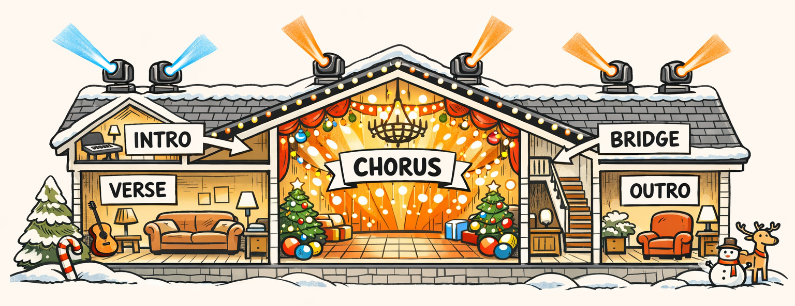
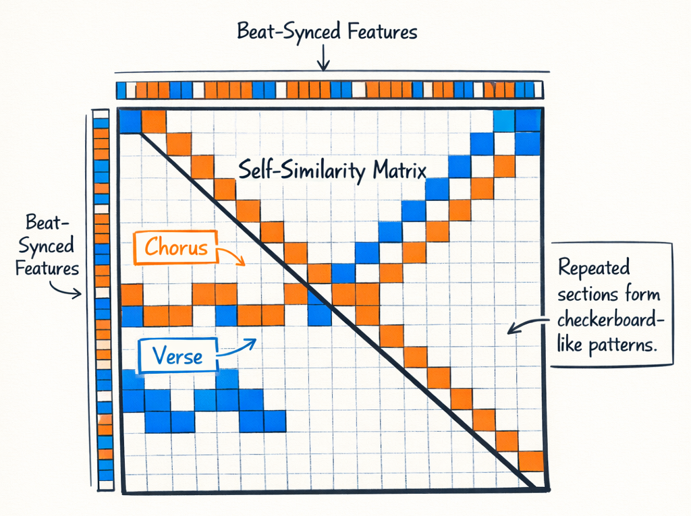
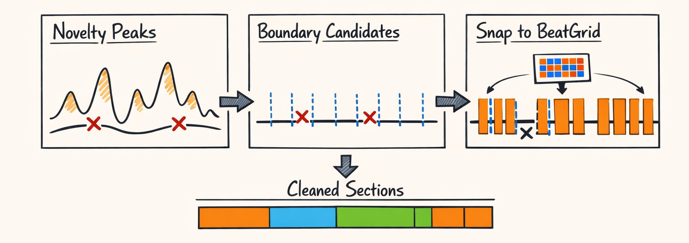
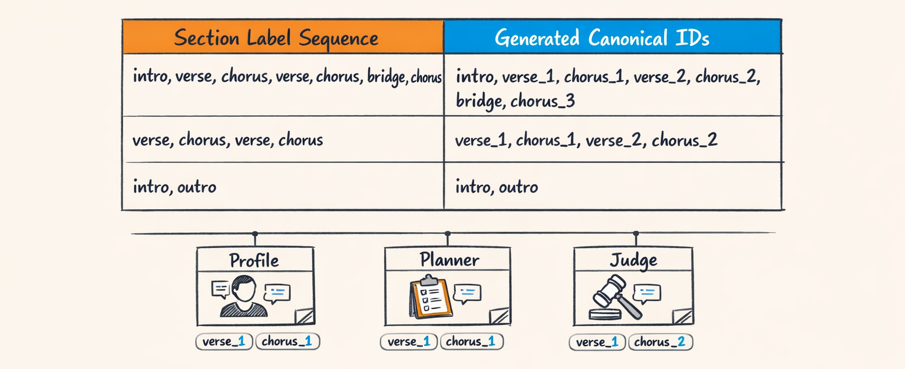
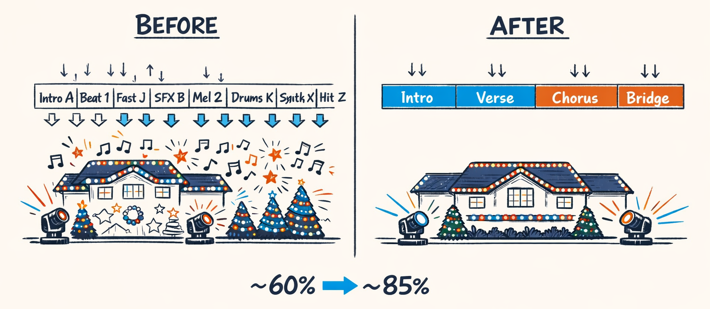
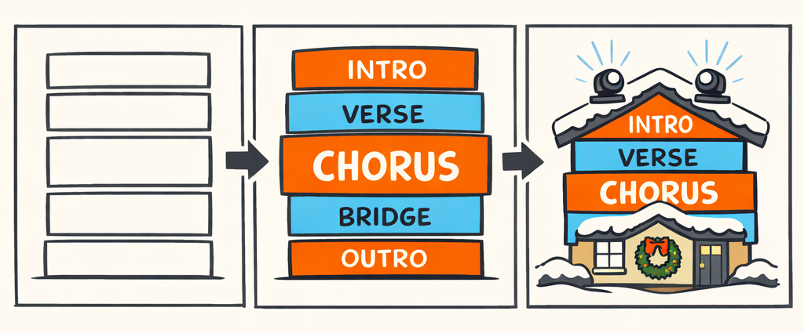

# The Architecture: Section Detection, or How We Stopped Letting the Chorus Start in the Wrong Universe

By the time we got to section detection, we were already feeling pretty good about ourselves.

We had beats. Mostly.  
We had bars. Usually.  
We had energy curves that were at least directionally honest instead of just yelling "loud!" at everything.

Part 2 got us from raw amplitude to something closer to *felt* intensity, which mattered a lot more than we expected.

And then section detection showed up like a smug QA engineer and reminded us that none of that was enough.

Because here's the ugly truth: if the beat grid is off by a little, the lights look sloppy. If the section boundaries are off by a lot, the whole show becomes emotionally wrong. The planner saves the big wide sweep for the chorus, except the chorus hasn't actually started yet, so now your roofline is doing the triumphant reveal over the last line of the verse like it got the script from a different song.

That's not a subtle bug.

That's "the audience can feel something is weird even if they can't explain it" territory.

And section boundaries are the planning unit everything downstream actually wants. Not just *where are the beats?* but *what part of the song are we in right now?* Intro. Verse. Chorus. Bridge. Outro. The big emotional blocks. The rooms in the house.

Once we had that, macro planning started making sense. Without it, the energy model from Part 2 was like a weather forecast with no map. "Storm incoming." Great. Where?

So this was the hardest audio problem in the stack for a while. Not because the math was impossible, but because songs are messy, labels are subjective, and Christmas music is apparently a hostile benchmark designed by elves with a grudge.

## Songs Have Architecture, Even When They Pretend They Don’t

If you don't know music theory, section names can sound weirdly academic. They aren't. They're just labels for the big chunks of a song.

An **intro** is the part that gets you in the door. Maybe it's instrumental, maybe it's just a few bars setting the mood, maybe it's sleigh bells trying extremely hard to let you know what month it is.

A **verse** is usually where the song tells the story. The words change each time, the melody often stays in roughly the same neighborhood, and the energy tends to be more restrained.

A **chorus** is the part the song wants you to remember. It's the big repeated payoff. Same hook, same emotional center, usually more energy, more fullness, more "okay yes *this* is the part."

A **bridge** is the song wandering off to do something different for a bit before coming home. Different harmony, different texture, maybe a little lift or breakdown.

And an **outro** is how it leaves the room.

That's all section detection is really trying to do: figure out where those chunks begin and end.

For choreography, those chunks matter more than most people realize. We don't plan a Christmas light show beat-by-beat in a vacuum. We plan in layers. The chorus gets bigger motion vocabulary. The verse gets tighter, more narrative movement. Intros and outros usually need restraint. Bridges are often where we can get weird on purpose.

So section boundaries become the control points for the whole planner.

If you say the chorus starts at 0:42 instead of 0:49, that's not a small metadata error. That's the difference between "save the big roof sweep for the payoff" and "accidentally blow the confetti cannon during the setup sentence."

And remember Part 2: macro energy only makes sense if the sections are sane. A rising intensity curve is useful, but it becomes *actionable* when you know whether that rise is leading into a chorus, just inflating a verse, or setting up a bridge fake-out.

The labels are musicology vocabulary, sure.

But in the system, they're choreography boundaries.

## Why Christmas Music Was Weirdly Hostile to Section Detection

We started this part with a pretty normal assumption: music information retrieval has been around for a while, pop songs have structure, section detection is a solved-enough problem, right?

Yeah. About that.

A lot of the standard assumptions behind MIR tooling come from mainstream pop and rock datasets. Verse/chorus repetition is relatively clean. Track lengths are longer. Mixes are more consistent. Ground truth labels, while still fuzzy, are less chaotic than what we ran into.

Holiday music did not get that memo.

First problem: Christmas songs are often short. Like, *annoyingly* short. Two minutes and change. Sometimes under that. You don't get much runway, and a short intro or instrumental pickup can be a huge percentage of the whole song.

Second problem: the structures are deceptively simple until they aren't. You get classic verse/chorus forms, sure, but then also spoken intros, narration, key changes, orchestral swells, half-choruses, tag endings, and live versions where the singer decides the phrase should breathe for another bar because apparently our parser needed a character-building experience.

Third problem: version mismatch. This one was brutal. The "same song" might exist as a crooner version, choir version, instrumental version, Michael Bublé version, aggressively jingly kid-choir version, and one deeply cursed remix with a trap beat under sleigh bells. The human knows these are all "Jingle Bell Rock." The model sees six different structures wearing the same name tag.

And then there's ground truth, which sounds nice until you try to make it real.

Where does the chorus *actually* start? On the pickup lyric before the harmonic landing? On the first downbeat of the repeated hook? Do you split a pre-chorus? Is that little two-bar instrumental turnaround its own section, or is it just connective tissue? Get five musicians in a room and you'll get seven opinions.

So our early outputs were... rough.

We had songs where the detector fired the chorus 4 bars early because the energy ramp looked exciting enough. We had tracks where one chorus got split into two sections because the first half was vocal and the second half added brass. We had intros mislabeled as verses because they reused harmonic material. We had bridges that got promoted to choruses just because they were loud.

One of my favorite terrible cases looked roughly like this:

> Human expectation: intro → verse → chorus → verse → chorus → bridge → chorus  
> Early system output: intro → verse → "chorus" → "chorus_b" → verse → bridge → chorus → outro_fragment

That `outro_fragment` section was 5.8 seconds long.

So yes, we built a machine that could detect a six-second emotional epilogue nobody asked for.

## The Self-Similarity Matrix: A Fancy Name for “What Sounds Like What”

The first thing that really started to work was stepping back from "what changed right now?" to "what parts of the song resemble other parts?"

That's the self-similarity matrix. Fancy term, simple idea.

Take the song and chop it into beat-aligned slices. For each beat, compute a feature vector describing what the audio looks like around that beat. Then compare every beat to every other beat.

If beat 12 sounds a lot like beat 44, that score is high.  
If beat 12 sounds nothing like beat 44, that score is low.

Do that for all pairs, and you get a square matrix where repeated musical sections start drawing visible patterns.

Verses that resemble each other form blocks.  
Choruses that repeat form bigger, brighter blocks.  
The main diagonal is always bright because every beat is, unsurprisingly, very similar to itself. Even our system could get that one right.

In `packages/twinklr/core/audio/structure/sections.py`, the core trick is building beat-synchronous features from several families instead of trusting a single signal. Energy helps, but energy lies. Chroma helps, but harmony alone can confuse intro and verse. Spectral features help distinguish texture, which matters a lot on holiday arrangements where the instrumentation likes to put on costumes.

A cleaned-up sketch of the feature assembly looks like this:

```python
# packages/twinklr/core/audio/structure/sections.py

import numpy as np

def build_section_features(
    *,
    chroma_beat: np.ndarray,
    mfcc_beat: np.ndarray,
    energy_beat: np.ndarray,
    spectral_beat: np.ndarray,
) -> np.ndarray:
    """Stack beat-synchronous features for structural comparison."""

    feature_blocks = [
        _normalize_rows(chroma_beat),              # harmonic identity
        _normalize_rows(mfcc_beat),                # timbral shape
        _normalize_column(energy_beat[:, None]),   # dynamics
        _normalize_rows(spectral_beat),            # brightness / texture
    ]

    return np.concatenate(feature_blocks, axis=1).astype(np.float32)


def compute_self_similarity(features: np.ndarray) -> np.ndarray:
    """Cosine similarity between every beat and every other beat."""
    feats = features / (np.linalg.norm(features, axis=1, keepdims=True) + 1e-9)
    return (feats @ feats.T).astype(np.float32)
```

That gives us a matrix where repetition becomes visible enough to reason about.



If you've never seen one before, imagine a heatmap where the song is laid out on both axes. Repeated choruses create mirrored square blocks away from the main diagonal. Repeated verses do the same. Unique sections like bridges tend to show weaker repetition and different contrast.

And that's the key intuition for everything that follows.

Section boundaries often happen where the similarity pattern changes shape.

A verse compared to another verse looks one way.  
A chorus compared to another chorus looks another way.  
The transition between them leaves a fingerprint.

Once we could *see* repetition, we had a shot at finding the walls between rooms instead of just staring at the furniture.

## Foote Novelty, Baseline Grids, and Other Ways We Tried Not to Be Wrong

So now we had a self-similarity matrix. Great.

The next question was: how do you turn that pretty square picture into actual boundary timestamps?

The classic answer is **Foote novelty**. Which sounds like a guy who'd sell you artisanal modular synth cables, but is actually a very practical idea.

You slide a checkerboard-shaped kernel along the main diagonal of the self-similarity matrix. Why a checkerboard? Because a boundary is exactly the place where "stuff before here is similar to itself" and "stuff after here is similar to itself," but the two sides are *different from each other*.

So the kernel rewards this pattern:

- top-left block: similar
- bottom-right block: similar
- off-diagonal blocks: dissimilar

When that pattern is strong, novelty spikes. And a spike is a candidate section boundary.

In cleaned-up form, it looks something like this:

```python
# packages/twinklr/core/audio/structure/sections.py

import numpy as np

def foote_kernel(size: int) -> np.ndarray:
    """Checkerboard kernel for structural novelty."""
    half = size // 2
    kernel = np.ones((size, size), dtype=np.float32)
    kernel[:half, half:] = -1.0
    kernel[half:, :half] = -1.0

    # Taper edges so we don't overreact to noise
    window = np.hanning(size).astype(np.float32)
    kernel *= np.outer(window, window)
    return kernel


def novelty_curve(ssm: np.ndarray, kernel_size: int = 32) -> np.ndarray:
    kernel = foote_kernel(kernel_size)
    half = kernel_size // 2
    novelty = np.zeros(ssm.shape[0], dtype=np.float32)

    for i in range(half, ssm.shape[0] - half):
        patch = ssm[i - half : i + half, i - half : i + half]
        novelty[i] = np.sum(patch * kernel)

    novelty -= novelty.min()
    novelty /= novelty.max() + 1e-9
    return novelty
```

This worked.

Until it didn't.

Pure novelty is great when transitions are clean. Verse ends, chorus begins, texture changes, harmony shifts, everybody claps, the algorithm looks smart.

But Christmas songs love gradual transitions. Soft swells. Pickup vocals. Instrumentation that layers in over two bars instead of flipping like a switch. Novelty can under-fire on those. It also tends to be sensitive to local texture changes that *sound* important mathematically but aren't actually new sections.

So then we tried the opposite extreme: baseline grids.

Meaning: if most songs change sections every 4, 8, or 16 bars, maybe we should propose candidates at regular musical intervals whether novelty likes it or not. Not because the grid is always right, but because real songs are not random. They have phrase structure. Humans write in chunks.

That led to the hybrid strategy:

1. Compute novelty peaks from the self-similarity matrix.
2. Add baseline candidates at musically plausible bar intervals.
3. Merge nearby candidates.
4. Snap the survivors to actual bar boundaries using the BeatGrid from Part 1.

The bar snapping part mattered a lot. If a boundary lands 700 ms before the downbeat because the novelty curve got excited about a pickup phrase, that's not useful for planning. Sections need to line up with musical structure, not just local feature turbulence.

Conceptually it looked like this:

```python
# packages/twinklr/core/audio/structure/sections.py

def propose_section_boundaries(
    novelty_peaks_s: list[float],
    beat_grid: BeatGrid,
    *,
    baseline_every_bars: int = 8,
    merge_tolerance_ms: float = 1800.0,
) -> list[float]:
    """Hybrid boundary proposal with musical quantization."""
    baseline_candidates = [
        beat_grid.bar_boundaries[i]
        for i in range(0, len(beat_grid.bar_boundaries), baseline_every_bars)
    ]

    all_candidates = sorted([
        *[t * 1000.0 for t in novelty_peaks_s],
        *baseline_candidates,
    ])

    merged = _merge_close_boundaries(all_candidates, tolerance_ms=merge_tolerance_ms)

    # The enforcement layer: snap to actual bar starts
    snapped = [_snap_to_nearest_bar(t, beat_grid.bar_boundaries) for t in merged]

    # Remove duplicates after snapping
    return _dedupe_sorted(snapped)
```

And yes, this is where the BeatGrid from Part 1 came back like the one competent adult in the room.



Novelty alone missed too much.  
Grid alone hallucinated structure where none existed.  
The combination was much less embarrassing.

Not perfect. Definitely not perfect.

But it stopped us from letting the chorus start in what can only be described as the wrong universe.

## Labeling the Sections Without Making Up Nonsense

Finding boundaries is only half the problem.

Once you've chopped the song into chunks, you still need to answer the annoying human question: *okay, but which chunk is the chorus?*

And this is where a lot of systems quietly cheat by saying "segment A, segment B, segment C" and leaving the semantics to somebody else. Which is fair. Also not enough for us. The planner wants to know whether a section is a verse or chorus because that changes the choreography vocabulary.

So we label sections with heuristics that are context-aware, not magical.

The basic signals were:

- **repetition strength**: choruses tend to repeat more clearly than bridges
- **energy rank**: choruses are often among the highest-energy repeated sections
- **harmonic change**: bridges often diverge more from the repeated core material
- **vocal density**: intros and outros are often sparser; verses tend to carry more changing lyrical content
- **build/drop context** from Part 2: a section that follows a strong build and lands high is a better chorus candidate than a random repeated block

A simplified version of the labeling pass looks like this:

```python
# packages/twinklr/core/audio/structure/sections.py

def label_sections(
    sections: list[dict],
    *,
    repetition_scores: np.ndarray,
    energy_by_section: list[float],
    harmonic_novelty: list[float],
    vocal_density: list[float],
    build_drop_context: dict,
) -> list[str]:
    """Assign human-meaningful labels to structural segments."""
    labels: list[str] = ["verse"] * len(sections)

    chorus_idx = _select_chorus_candidates(
        repetition_scores=repetition_scores,
        energy_by_section=energy_by_section,
        build_drop_context=build_drop_context,
    )
    for idx in chorus_idx:
        labels[idx] = "chorus"

    bridge_idx = _select_bridge_candidate(
        labels=labels,
        harmonic_novelty=harmonic_novelty,
        energy_by_section=energy_by_section,
    )
    if bridge_idx is not None:
        labels[bridge_idx] = "bridge"

    if sections and vocal_density[0] < 0.25 and energy_by_section[0] < 0.35:
        labels[0] = "intro"

    if sections and vocal_density[-1] < 0.20:
        labels[-1] = "outro"

    return labels
```

The important thing isn't the exact thresholds. Those moved around a lot. The important thing is that we don't decide "chorus" from one signal.

Because loud doesn't always mean chorus.  
Repeated doesn't always mean chorus.  
Harmonically different doesn't always mean bridge.

A spoken intro can be low-energy and sparse. A bridge can be huge. A final chorus can blur into the outro. Holiday songs are especially fond of all of this.

So we score candidates in context and then resolve conflicts with rules that are blunt, but grounded. The result is heuristic labeling that behaves more like a cautious engineer than a delusional wizard.

Which is good, because the last thing we needed was an LLM reading `bridge` when the segment was obviously `chorus_2` with extra bells.

## Canonical IDs: The Boring Little Contract That Saved Us

This part is less glamorous, but honestly it saved our necks.

Once sections are labeled, you need deterministic IDs. Not vibes. Not "the second chorus-ish thing." Actual stable identifiers that every stage can agree on.

That logic lives in `packages/twinklr/core/audio/sections.py`:

```python
# packages/twinklr/core/audio/sections.py

from collections import defaultdict

def generate_section_ids(section_labels: list[str]) -> list[str]:
    """Generate canonical section IDs from labels.

    Examples:
        ['verse', 'chorus', 'verse'] -> ['verse_1', 'chorus_1', 'verse_2']
        ['intro', 'verse', 'chorus', 'outro'] -> ['intro', 'verse_1', 'chorus_1', 'outro']
    """
    counts: defaultdict[str, int] = defaultdict(int)
    result: list[str] = []

    for label in section_labels:
        if label in {"intro", "bridge", "outro"}:
            result.append(label)
            continue

        counts[label] += 1
        result.append(f"{label}_{counts[label]}")

    return result
```

That's it. Tiny function. Extremely boring.

Also one of the most important contracts in the whole pipeline.

Because once profiling says `chorus_2` has the highest energy, planning needs to talk about `chorus_2`. Judging needs to talk about `chorus_2`. Rendering logs need to talk about `chorus_2`. If one stage says "second chorus," another says `chorus_b`, and a third says `segment_6`, you have invented a distributed systems bug in holiday clothing.

We did that for a while, by the way. It was dumb.

A planner would ask for a special reveal in "the last chorus," while the judge interpreted "last repeated high-energy section," and then the renderer would happily apply the big finish to the bridge because everyone's local naming made perfect sense *individually* and zero sense *together*.

Canonical IDs fixed that class of bug immediately.



This seems small because it is small.

It also turns out small contracts are how multi-stage systems avoid becoming haunted.

We'll come back to that in Part 6 when we follow one audio decision all the way to actual lights on the roof.

## What Broke, What Got Better, and Why 4-Bar Micro-Sections Had to Die

Our early section detection was hovering around 60% useful on the songs we actually cared about.

Not 60% academically respectable.  
60% "would I trust this to drive a show without babysitting it?"  
And the answer was absolutely not.

The main failure mode wasn't just wrong labels. It was over-segmentation.

The detector would carve a song into tiny little emotionally meaningless chunks because it saw local novelty everywhere. A brass entrance? New section. Brief drum fill? New section. Two bars of reduced instrumentation before the final chorus? Congratulations, apparently that's a standalone region now.

We had a lot of outputs that looked like a caffeinated intern attacking a timeline with scissors.

So we added a few constraints that felt almost insultingly practical:

- **genre-aware tuning** for holiday music and ballads
- **minimum section lengths**
- **short-section merging** into neighboring sections when the micro-section had weak independent identity
- **bar-aware snapping** everywhere we could justify it

The cleanup pass ended up being just as important as the detector:

```python
# packages/twinklr/core/audio/structure/sections.py

def enforce_section_constraints(
    boundaries_ms: list[float],
    labels: list[str],
    beat_grid: BeatGrid,
    *,
    min_section_bars: int = 8,
) -> tuple[list[float], list[str]]:
    """Remove micro-sections and re-quantize boundaries to musical form."""
    min_len_ms = _bars_to_ms(beat_grid, min_section_bars)
    merged_bounds = [boundaries_ms[0]]
    merged_labels = [labels[0]]

    for i in range(1, len(boundaries_ms) - 1):
        section_len = boundaries_ms[i] - merged_bounds[-1]

        if section_len < min_len_ms:
            # Too short to deserve its own identity. Sorry, tiny section.
            continue

        merged_bounds.append(_snap_to_nearest_bar(boundaries_ms[i], beat_grid.bar_boundaries))
        merged_labels.append(labels[i])

    merged_bounds.append(boundaries_ms[-1])
    return merged_bounds, merged_labels
```

This is one of those moments where the elegant answer and the useful answer were not the same answer.

The elegant answer was "trust the structural signal."  
The useful answer was "no real residential Christmas light show needs a one-off 4-bar sub-verse with its own planning identity."

And honestly? Once we accepted that, things got a lot better.

With the hybrid boundary strategy, better labeling, and aggressive cleanup, we got to roughly **85% section accuracy** on our internal eval set of holiday tracks and adjacent pop. Again, not "solved." But finally good enough that the planner usually got the emotional shape right instead of stepping on its own punchlines.

The remaining errors are familiar:

- gradual verse-to-chorus ramps that start feeling like chorus before the formal downbeat
- bridges that are basically mini-choruses in disguise
- songs with repeated harmonic content but different lyrical function
- weird live and remastered versions that mess with texture just enough to confuse similarity

Still, 85% felt like crossing a line. Not into certainty. Into usability.



And that mattered because now we had three major pieces:

- rhythm and bar structure from Part 1
- intensity and build/drop context from Part 2
- actual song architecture from this part

Which meant we had a richer problem next.

Because none of this helps an LLM if you dump 100 kilobytes of raw analysis on it and say, "good luck, buddy."

Part 4 is where we get into the compression problem: how we translated all this audio structure into something a model could actually use without turning the prompt into a landfill.



---

## About twinklr


twinklr is our ongoing science experiment in weaponizing holiday cheer. It's an AI-driven choreography and composition engine that takes an audio file and spits out fully synchronized sequences for Christmas light displays in xLights — because apparently we looked at a normal, peaceful hobby and thought, "What if we added AI, machine learning, and sleepless nights?"

Here's the honest disclaimer: we're not professional lighting designers. We're developers, engineers, and AI researchers who spend our days building at the frontier of AI and our nights obsessing over why a dimmer curve feels late by half a beat and whether a roofline sweep should be dramatic or merely aggressively festive. If you're expecting polished stage-production wisdom, you're in the wrong place. If you're into nerdy overengineering, mildly unhinged experimentation, and the occasional "how did that even work?" moment, welcome.

This blog is the running log of our journey: the wins, the faceplants, the weird breakthroughs, and the lessons learned the hard way, often repeatedly. We'll share what we're building, what breaks, and why certain architectural decisions matter when the goal is to turn "song" into "show" without the lights looking like they're having an existential crisis.
