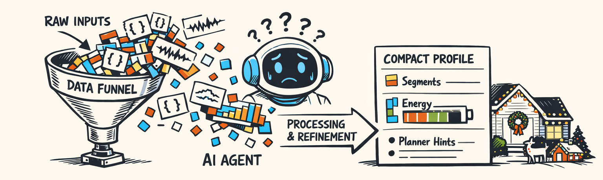
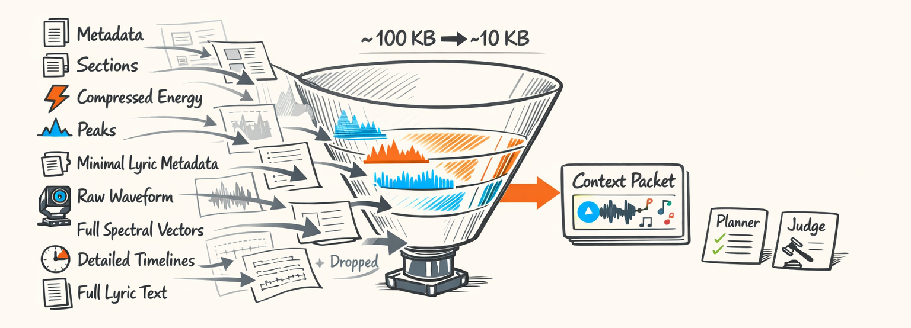
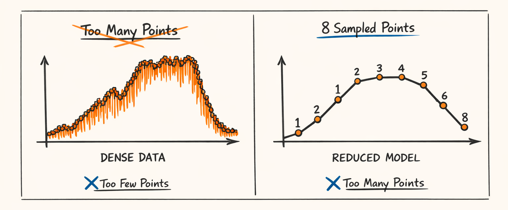
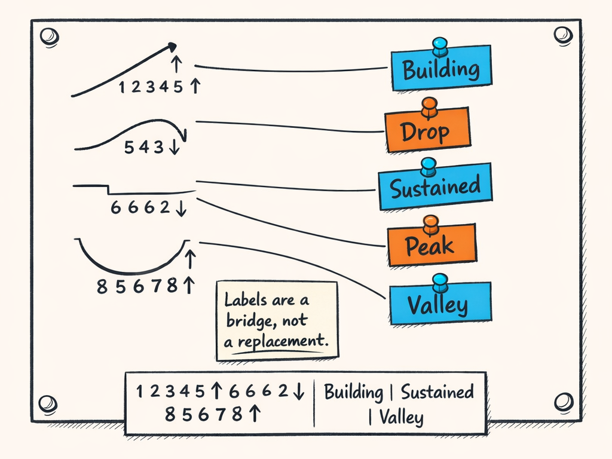
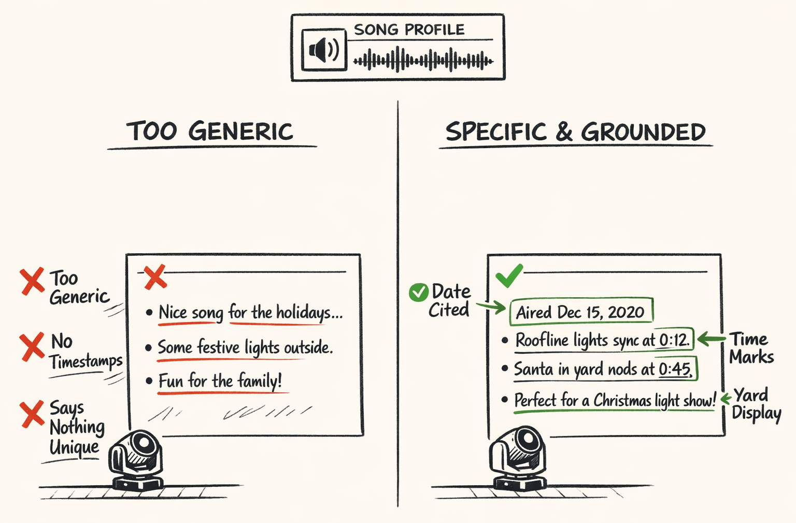
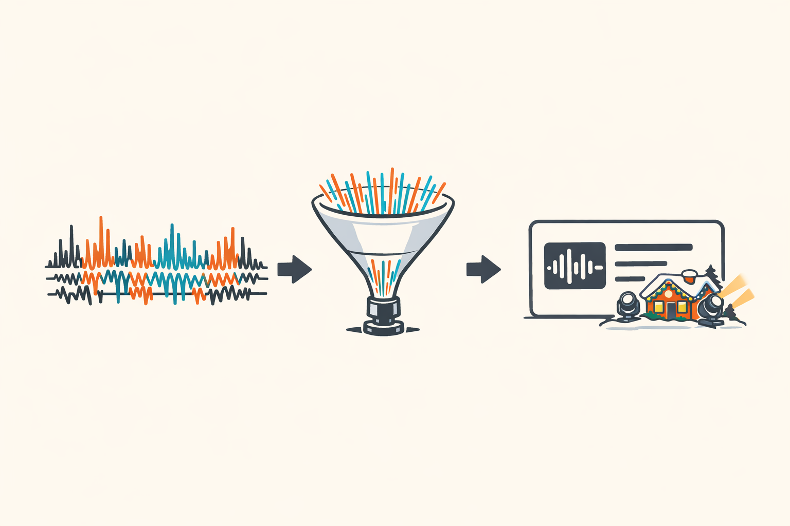

# The Translation: How We Stuffed 100KB of Audio Facts Into 10KB Without Making the LLM Useless

By the time we got through Parts 1, 2, and 3, we had a pretty respectable pile of audio facts.

We had beats and bars from the rhythm stack. We had multiscale energy curves, peaks, builds, drops, brightness, tension, and all the other ways a song can be emotionally manipulative. We had section boundaries with labels and confidence. Basically, we'd spent a lot of CPU cycles teaching the machine to hear the song before we ever asked it to imagine lights.

And then we made the most obvious mistake possible.

We handed all of it to the LLM.

Not the important parts. Not a shaped summary. I mean *all* of it. Raw-ish JSON blobs, giant frame-wise arrays, dense timelines, and enough numeric clutter to make the prompt look like a NumPy stack trace had exploded in it.

The model's response was incredible in the worst possible way. It read like every song on earth was "dynamic," had "clear sections," and featured "moments of increased energy suitable for visual emphasis." Which is technically true in the same way "water is somewhat damp" is technically true.

So this part is about the bridge. The translation layer. The place where deterministic analysis stops dumping facts onto the floor and starts handing the LLM something it can actually think with.

This turned out to matter more than we expected. Probably more than any prompt trick, honestly. Because once the context stopped being a landfill, the model stopped acting like it had suffered a mild concussion.

## The Day We Learned That More Context Made the Model Dumber

Here's the thing: we started with a very engineer-shaped instinct.

If some audio facts are good, then *all* audio facts must be better.

That instinct gave us prompts stuffed with raw feature payloads from the earlier stages of the pipeline: beat timelines from Part 1, energy and spectral curves from Part 2, section segmentation from Part 3, plus a bunch of metadata and lyric-related scraps. It was a buffet of truth. A 100KB buffet. And like most buffets, the quality drops sharply once you try to eat everything at once.

The problems showed up in three places at the same time:

- token cost went up
- latency went up
- output quality somehow went *down*

That last one annoyed us the most.

We expected bigger prompts to be expensive. Fine. That's the tax you pay for giving a model more context. What we didn't expect was that the model would get more generic as the input got more detailed. But in hindsight, it makes sense. We weren't giving it more *meaning*. We were giving it more *stuff*.

A giant frame-wise spectral vector isn't useful just because it's true. A 2,000-point energy curve isn't helpful just because we worked hard to compute it. The LLM doesn't get smarter because you bury it in arrays. It gets distracted. Or worse, it starts averaging everything into beige prose.

So that was the lesson: context quality matters more than context volume.

The raw analysis from Parts 1 through 3 still mattered. A lot. We just needed to compress it without flattening it into mush. That meant deciding what musical information actually survives the trip from deterministic code to language model, and what should stay behind in the engine room where it belongs.

Look, teaching an LLM to choreograph roof-mounted moving heads is already a weird life choice. Asking it to do DSP by staring at raw JSON was where even we had to admit we'd gotten a little carried away.

## What Survives the Cut

The shaping step lives in `packages/twinklr/core/agents/audio/profile/context.py`, and the main function is exactly as glamorous as you'd expect:

```python
def shape_context(
    *,
    song_title: str | None,
    song_artist: str | None,
    audio_analysis: dict[str, Any],
    lyric_data: dict[str, Any] | None = None,
) -> dict[str, Any]:
    """Build compact audio-profile context for the LLM."""
    sections = audio_analysis.get("sections", [])
    energy = audio_analysis.get("energy", {})
    builds_drops = audio_analysis.get("builds_drops", {})
    peaks = audio_analysis.get("peaks", {})
    metadata = audio_analysis.get("metadata", {})

    shaped_sections = []
    for section in sections:
        duration_s = max(0.0, float(section["end_s"] - section["start_s"]))
        energy_curve = compress_section_curve(
            section_start_s=float(section["start_s"]),
            section_end_s=float(section["end_s"]),
            timeline_times_s=energy.get("times_s", []),
            timeline_values=energy.get("section_level", []),
            points=8,
        )

        shaped_sections.append(
            {
                "label": section.get("label", "unknown"),
                "start_s": round(float(section["start_s"]), 2),
                "end_s": round(float(section["end_s"]), 2),
                "duration_s": round(duration_s, 2),
                "energy_curve": energy_curve,
                "characteristics": identify_characteristics(energy_curve),
            }
        )

    return {
        "song_identity": {
            "title": song_title,
            "artist": song_artist,
            "duration_s": metadata.get("duration_s"),
            "tempo_bpm": metadata.get("tempo_bpm"),
            "time_signature": metadata.get("time_signature"),
        },
        "sections": shaped_sections,
        "energy_summary": {
            "builds": builds_drops.get("builds", []),
            "drops": builds_drops.get("drops", []),
            "peaks": peaks.get("major", []),
        },
        "lyrics": _minimal_lyric_context(lyric_data),
    }
```

This was the core philosophy in code form: keep the parts that preserve musical meaning, ditch the parts that mostly preserve implementation detail.

What stayed:

- basic song metadata: title, artist, duration, tempo, time signature
- section list: intro, verse, chorus, bridge, whatever we detected in Part 3
- compressed energy per section
- major builds, drops, and peaks
- minimal lyric metadata when available

What got cut:

- raw waveform data
- full frame-by-frame RMS arrays
- dense spectral vectors from `extract_spectral_features()`
- giant unified timelines from `packages/twinklr/core/audio/timeline/builder.py`
- full lyric text dumps
- most of the `_np` internal arrays that existed for analysis, not reasoning

That last category was important. Our analysis code is full of useful intermediate arrays — normalized RMS, centroid curves, onset envelopes, chroma frames. Those are great if you're writing detection code. They're terrible if you're asking an LLM for creative guidance. That's not because the numbers are wrong. It's because they answer the wrong question.

The profile agent doesn't need to rediscover the beat grid from scratch. It doesn't need to infer section boundaries from raw energy variance. We already did that work. The whole point of the shaping layer is to hand off verified facts in a form the model can use quickly and reliably.

So the funnel looked something like this:



And yes, we measured it because of course we did. Raw analysis payloads for a typical song could drift north of 100KB once you included timeline-heavy features. The shaped profile context usually landed around 8–12KB depending on section count and lyric availability.

That wasn't just cheaper. It was better.

Which was mildly offensive after all the effort we'd spent generating the big payload in the first place.

## The 8-Point Curve: Compression With Just Enough Taste

The most useful compression trick in this whole layer was also the dumbest-looking one.

We reduced each section's energy contour to exactly 8 points.

Not 7. Not 32. Eight.

The function is in the same file, `packages/twinklr/core/agents/audio/profile/context.py`:

```python
def compress_section_curve(
    *,
    section_start_s: float,
    section_end_s: float,
    timeline_times_s: list[float],
    timeline_values: list[float],
    points: int = 8,
) -> list[float]:
    """Uniformly sample a section energy curve down to a fixed number of points."""
    if not timeline_times_s or not timeline_values or section_end_s <= section_start_s:
        return []

    times = np.asarray(timeline_times_s, dtype=np.float32)
    values = np.asarray(timeline_values, dtype=np.float32)

    mask = (times >= section_start_s) & (times <= section_end_s)
    if not np.any(mask):
        return []

    section_values = values[mask]
    if len(section_values) <= points:
        return [round(float(v), 3) for v in section_values.tolist()]

    sample_idx = np.linspace(0, len(section_values) - 1, points).astype(int)
    sampled = section_values[sample_idx]

    return [round(float(v), 3) for v in sampled.tolist()]
```

That's it. No fancy learned compressor. No wavelet wizardry. Just uniform sampling across the section duration.

And honestly? It worked way better than it had any right to.

Why eight? Because it was the smallest number that still let the model "see" a section shape. A build still looked like a build. A plateau still looked flat-ish. A drop still had a visible cliff. Once we went below that, everything started collapsing into vague blobs.

Four points was too coarse. A gradual rise followed by a hard drop could turn into "eh, maybe this section is medium." Six was better, but still lost detail on longer choruses. Eight was the first number where the shape remained legible across intros, verses, choruses, and bridges without turning the prompt back into a spreadsheet.

Twelve or sixteen also worked, but the gains were tiny and the token cost wasn't. At that point we were paying for chatter. The model didn't become meaningfully better at interpretation; it just had more decimals to ignore.

Here's the visual idea:



A few examples made this click for us:

- **Build section:** `[0.18, 0.21, 0.27, 0.35, 0.49, 0.63, 0.78, 0.84]`
- **Plateau chorus:** `[0.74, 0.76, 0.75, 0.77, 0.76, 0.74, 0.75, 0.73]`
- **Drop/release:** `[0.82, 0.79, 0.68, 0.51, 0.33, 0.24, 0.19, 0.17]`

An LLM can reason about those patterns pretty quickly. Not perfectly, but reliably enough to say "this section steadily escalates," or "this one sustains high intensity," or "here's a release after a peak."

And that's really the whole job. Not perfect reconstruction. Preserving the musical gesture.

Compression wasn't about shrinking numbers for the sake of it. It was about keeping the part that still feels like music after the arrays are gone.

## Turning Curves Into Words So the Model Stops Pretending to Be a DSP Library

Numbers alone got us partway there. But not all the way.

Even with an 8-point curve, the model still had this annoying habit of acting like it was cautiously reviewing sensor data in a legal deposition. It would notice patterns, kind of, but it often translated them into vague language unless we gave it semantic handles.

So we added labels.

In `packages/twinklr/core/agents/audio/profile/context.py`, we take the compressed curve and derive a tiny set of characteristics:

```python
def identify_characteristics(curve: list[float]) -> list[str]:
    """Assign simple semantic labels to a compressed section curve."""
    if len(curve) < 2:
        return []

    labels: list[str] = []
    arr = np.asarray(curve, dtype=np.float32)

    delta = float(arr[-1] - arr[0])
    mean_val = float(np.mean(arr))

    if delta > 0.2:
        labels.append("building")
    elif delta < -0.2:
        labels.append("drop")

    if np.max(arr) > 0.8:
        labels.append("peak")

    if np.min(arr) < 0.25:
        labels.append("valley")

    if np.std(arr) < 0.08 and mean_val > 0.55:
        labels.append("sustained")

    # keep order stable, avoid duplicates
    return list(dict.fromkeys(labels))
```

The label set is intentionally small:

- `building`
- `drop`
- `sustained`
- `peak`
- `valley`

That's not trying to replace the numeric curve. It's a bridge.

The curve says, "here are the actual sampled values."  
The labels say, "if you're moving fast, here's what those values probably mean."

That combination turned out to be much better than either one alone.

If we gave the model only labels, it got too categorical. Every section became a tidy little bucket, and nuance disappeared. If we gave it only numbers, it sometimes missed obvious patterns or described them in the most boring possible way. Together, they were weirdly effective: the numbers preserved shape, and the labels nudged the model toward the right interpretation.

This was one of those places where we had to admit something mildly embarrassing: yes, the model *can* infer a build from a rising numeric sequence. No, that doesn't mean it will do it consistently when the rest of the prompt is busy. Giving it the word `building` was less about capability and more about reliability.

Here's the mental model:



So the rule became: preserve the quantitative signal, then annotate it just enough that the model doesn't waste half its brain budget rediscovering obvious structure.

Or, put less politely: stop making the LLM cosplay as a DSP library.

## The Audio Profiling Agent: Facts In, Tasteful Opinions Out

Once the context is shaped, it gets handed to the audio profiling agent. This is where deterministic facts become something more like musical intelligence.

The orchestrator lives in `packages/twinklr/core/agents/audio/profile/orchestrator.py`, and the output schema is in `packages/twinklr/core/agents/audio/profile/models.py`.

At a high level, the orchestrator is pretty simple:

```python
class AudioProfileOrchestrator:
    """Generate a structured audio profile from shaped analysis context."""

    def __init__(self, llm_client: LLMClient):
        self.llm_client = llm_client

    async def run(
        self,
        *,
        song_title: str | None,
        song_artist: str | None,
        audio_analysis: dict[str, Any],
        lyric_data: dict[str, Any] | None = None,
    ) -> AudioProfileModel:
        context = shape_context(
            song_title=song_title,
            song_artist=song_artist,
            audio_analysis=audio_analysis,
            lyric_data=lyric_data,
        )

        response = await self.llm_client.generate_structured(
            template="audio_profile/system.j2",
            context={"audio_profile_context": context},
            response_model=AudioProfileModel,
        )
        return response
```

That's intentionally boring. Boring is good here. The orchestrator shouldn't be doing clever interpretation itself. It should prepare the context, call the model, and validate the shape of the response.

The interesting part is the model it's filling out.

A cleaned-up version of `AudioProfileModel` looks something like this:

```python
class AudioProfileModel(BaseModel):
    song_identity: SongIdentity
    structure_summary: str
    energy_profile: str
    lyric_presence: str | None = None

    standout_moments: list[StandoutMoment] = Field(default_factory=list)
    creative_guidance: list[str] = Field(default_factory=list)
    planner_hints: list[str] = Field(default_factory=list)


class StandoutMoment(BaseModel):
    timestamp_s: float
    reason: str
    suggested_visual_role: str
```

The actual shape matters because it encodes a boundary we had to be very strict about.

The LLM is **not** responsible for detecting beats.  
It is **not** responsible for finding sections.  
It is **not** responsible for deciding whether a build exists at 73.2 seconds.

That all happened earlier in deterministic code — in the rhythm extraction, energy analysis, and section detection pipeline we covered in Parts 1 through 3.

What the profile agent does is different. It looks at verified structure and says things like:

- the first chorus is the first major payoff
- the bridge releases tension before the final lift
- the intro stays restrained enough that a full-fixture reveal would feel premature
- peaks around specific timestamps are good candidates for fan sweeps, color expansion, or wider pan motion

That's interpretation. Not measurement.

And honestly, that distinction saved us. The minute we let the model "helpfully" infer basic audio facts from raw features, quality got slippery. The minute we constrained it to interpretation on top of trusted facts, it got much more useful.

So the output profile ends up carrying a few layers of value:

- **song identity** — enough metadata to keep the response grounded
- **structure** — what the song feels like section by section
- **energy profile** — how intensity evolves over time
- **lyric metadata** — only enough to note whether lyrics matter yet
- **creative guidance** — high-level suggestions for visual pacing
- **planner hints** — practical notes the downstream planners can actually consume

That last piece becomes important in Part 6, where we'll follow one of these decisions all the way into actual fixture behavior on the roof. That's where the abstractions stop being cute and start moving motors.

## Prompting Against Generic Slop

Now for the part where we discovered that if you don't pin the model to the wall a little, it will happily ooze into generic prose.

The system prompt for this agent lives in `packages/twinklr/core/agents/audio/profile/prompts/audio_profile/system.j2`. Some of the most important lines weren't about style. They were about forcing specificity.

A representative excerpt looks like this:

```python
You are creating an audio profile for a residential Christmas light show system.

Use ONLY the provided audio profile context.
Do not invent song events, timestamps, sections, or lyrics.

The output must be specific to this song's structure and timing.
If a sentence could apply to many songs, rewrite it until it depends on
the provided section labels, energy curves, peaks, or timestamps.

When referencing a notable moment, cite the timestamp in seconds.

Focus on visual choreography implications for roofline-mounted moving head
fixtures and residential Christmas light displays.
Avoid concert, nightclub, festival, or stage-production language.
```

That "if a sentence could apply to many songs, rewrite it" line did a shocking amount of work.

We started calling it the uniqueness test.

Because the default failure mode of these models isn't usually complete nonsense. It's something worse: plausible mush. Sentences that sound informed but don't commit to anything falsifiable. Stuff like:

> "The song contains dynamic shifts and several moments that could support increased visual intensity."

Thanks, robot. Very brave.

What we wanted instead was something like:

> "The section beginning at 46.8s rises steadily in energy and leads into a stronger chorus payoff at 61.2s, so the visual plan should hold back full-width motion until that transition instead of spending the biggest look in the verse."

That's useful. You can disagree with it. You can trace it back to the section map. You can plan against it.

Here's the comparison in visual form:



We also required timestamp citation for standout moments. That did two things at once:

1. it forced the model to anchor claims in the provided context  
2. it made downstream consumption easier, because planners and judges could point to real moments instead of vibes

And the residential Christmas-light framing mattered more than you'd think. If you don't specify that, the model drifts toward concert-lighting clichés almost immediately: "strobe accents," "crowd-impact moments," "stage washes," "aggressive beam hits." Which is hilarious when the actual hardware is a handful of moving heads on a suburban roofline trying not to blind the neighbor's inflatable snowman.

So we kept reminding it what world it was in.

A grounded response needed to think in terms of:

- family-friendly spectacle
- house-scale pacing
- roofline visibility
- moving-head sweeps and reveals
- restraint before payoff

Not festival pyro fantasies.

And yes, even with all of that, the model still defaults to vague language if you let it. Not always. But often enough that we had to design the prompt like a set of bowling-lane bumpers.

Dignified? No. Effective? Pretty much.

## Why We Kept Profiling Single-Shot

A lot of the later Twinklr agents use some kind of judge/refine loop. Generate a thing, critique it, patch it, validate it, maybe repeat until the output stops embarrassing everyone.

The audio profiler doesn't.

That was deliberate.

Here's a simplified version of the call pattern in `packages/twinklr/core/agents/audio/profile/orchestrator.py`:

```python
async def run(...) -> AudioProfileModel:
    context = shape_context(...)
    return await self.llm_client.generate_structured(
        template="audio_profile/system.j2",
        context={"audio_profile_context": context},
        response_model=AudioProfileModel,
    )
```

One shot. Structured output. Done.

Why? Because this task is interpretive, not constructive.

When we're generating timelines or fixture plans later in the pipeline, there are hard constraints. Timing has to line up. Fixture counts have to match reality. Motion limits matter. Those are good candidates for iterative loops because there's something concrete to validate and improve.

But the profile agent is different. It's basically writing a grounded musical brief. Once the facts are correct and the prompt is specific, multiple rounds don't usually make it *truer*. They mostly make it slower and more expensive.

And occasionally more verbose, which is not the same thing as better. Ask me how I know.

So we kept the boundary clean:

> deterministic code extracts facts, the LLM interprets them once, and we move on

That gave us lower latency, lower cost, and fewer opportunities for the model to spiral into increasingly decorative prose. Which, for this stage, was absolutely the right trade.

## This Is the Bridge in the Whole Series

So this part is the hinge.

Parts 1 through 3 were all about extracting trustworthy musical facts: beat grids, energy behavior, structural sections, and the timing backbone that keeps the rest of the system honest. This part takes those facts and turns them into compact, usable context the model can reason over without drowning in detail.

That's the inflection point.

Before this layer, the system is mostly analysis. After this layer, it starts becoming planning substrate — not yet choreography, but the thing choreography can stand on.

Part 5 does something similar for lyrics, but lyrics are their own special brand of chaos. Different data shape, different failure modes, different ways for reality to be rude. So they get their own agent and their own set of scars.

And by Part 6, we'll finally follow one of these profile decisions all the way downstream into actual show planning and fixture behavior.

Which is where the roof starts moving, and our bad decisions become visible from the street.



---

## About twinklr


twinklr is our ongoing science experiment in weaponizing holiday cheer. It's an AI-driven choreography and composition engine that takes an audio file and spits out fully synchronized sequences for Christmas light displays in xLights — because apparently we looked at a normal, peaceful hobby and thought, "What if we added AI, machine learning, and sleepless nights?"

Here's the honest disclaimer: we're not professional lighting designers. We're developers, engineers, and AI researchers who spend our days building at the frontier of AI and our nights obsessing over why a dimmer curve feels late by half a beat and whether a roofline sweep should be dramatic or merely aggressively festive. If you're expecting polished stage-production wisdom, you're in the wrong place. If you're into nerdy overengineering, mildly unhinged experimentation, and the occasional "how did that even work?" moment, welcome.

This blog is the running log of our journey: the wins, the faceplants, the weird breakthroughs, and the lessons learned the hard way, often repeatedly. We'll share what we're building, what breaks, and why certain architectural decisions matter when the goal is to turn "song" into "show" without the lights looking like they're having an existential crisis.
