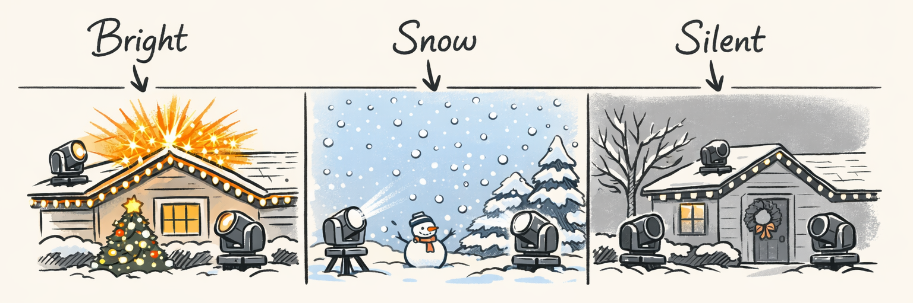
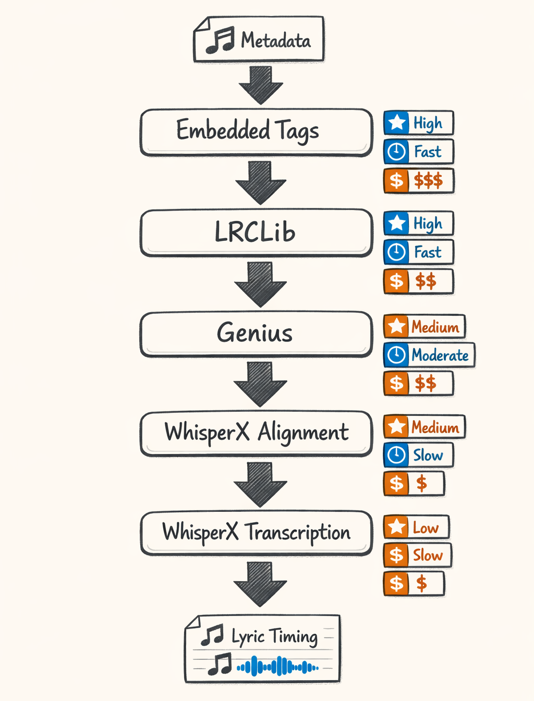
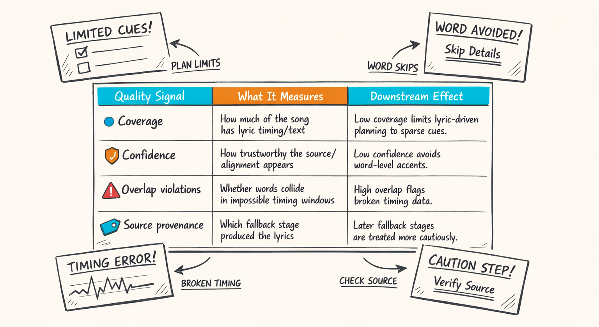
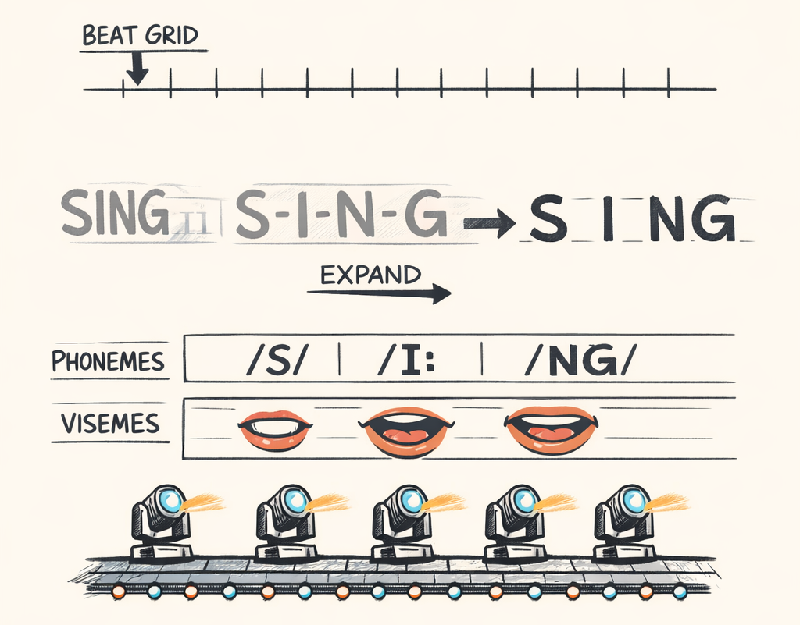
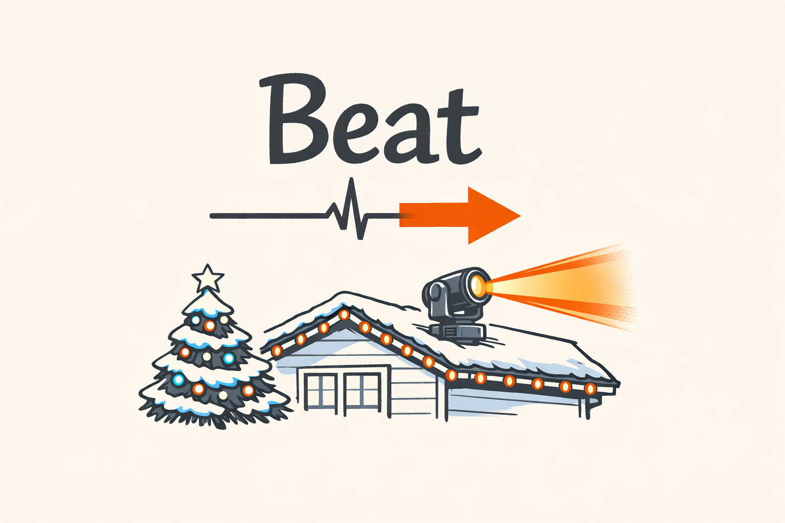

# The Words: Lyrics, Phonemes, and the Five-Layer Fallback Chain We Built Because Reality Was Rude

## Why the Word 'Bright' Should Probably Do Something Bright

So if a singer lands on *“bright”* in “Silent Night,” and the lights answer with a warm white bloom rolling across the roofline, that feels intentional.

If the next line says *“silent”* and the whole display drops into a low dim hush with barely any motion and a soft shimmer, that also feels intentional.

And if the word is *“snow”* and we get a drifting cool-white cascade instead of “random chase pattern #14,” people notice. They may not say, “ah yes, excellent semantic alignment,” because they are at a Christmas light show and not a research symposium, but they feel it.

That’s the promise of lyrics.

Not instead of rhythm. Not instead of energy. Not instead of the beat grid from Part 1. On top of all that.

Music gives you *motion*. Lyrics give you *meaning*.

Without lyrics, Twinklr can still make a show that hits the beat, rides the builds, respects the chorus, and generally avoids embarrassing itself. Honestly, that already gets you surprisingly far. Big chorus? Go wide. Build? Increase motion and density. Quiet verse? Pull back.

But lyrics add that extra layer where the show stops feeling merely synchronized and starts feeling like it’s actually listening.

The annoying part is that lyrical intelligence is built on data that is, in technical terms, kind of a mess.

Missing text. Wrong versions. Timestamps that drift. Metadata that says `Track 05` like that’s supposed to help anybody. And Christmas music is especially cursed because every song has forty recordings and half of them are trying to sound like they were discovered in a snow globe.

So yes, we wanted “bright” to do something bright.

First we had to survive the gremlin pit.

## Lyrics Data in the Wild Is a Bit of a Gremlin

Here’s the thing: lyrics data in the wild is not a clean, API-backed truth source. It’s more like a loose federation of vibes.

Sometimes the audio file has embedded tags. Great. Except the tags might have plain lyrics with no timing, or partial lyrics, or lyrics for the radio edit while your file is the live version where the singer pauses for dramatic effect and throws the whole alignment into traffic.

Sometimes an external lyrics source has the right text but no timestamps.

Sometimes it has timestamps, but they’re for a different recording of the same song.

That last one is especially nasty with Christmas standards. “Jingle Bell Rock,” “Silent Night,” “O Holy Night,” “Have Yourself a Merry Little Christmas” — these aren’t single songs in practice. They’re entire extended families of recordings with different intros, different tempos, extra bars, spoken ad-libs, and wildly different phrasing. If you match the wrong version, the text can look *almost* right while the timing is completely wrong.

And bad timing is often worse than no timing.

No timing means we can treat the lyrics as thematic hints. Fine. We can still say, “this section mentions stars, night, peace, snow, joy,” and let the planner use that at a broad level.

Bad timing means the system confidently accents the word *“night”* half a second early and flashes the roofline before the singer gets there. That doesn’t feel poetic. It feels like the show is trying to interrupt.

We saw all of it:

- complete lyrics, zero timing
- word timings with impossible overlaps
- chorus lines shifted by a full measure
- metadata pointing to the wrong artist entirely
- songs where no lyric source had decent Christmas-cover coverage at all

Which is why we stopped pretending this could be a single clean step.

We needed a pipeline that could degrade gracefully. Something that says: if we can get perfect word-level aligned lyrics, amazing. If not, get section-level text. If not, transcribe. If not, shrug politely and keep making a good show from audio alone.

That “optional but valuable” philosophy turned out to matter a lot. It kept the lyrics system from becoming the one flaky dependency that could torpedo everything else.

## The Waterfall: Five Chances to Get Lyrics Before We Give Up and Transcribe

The actual pipeline lives in `packages/twinklr/core/audio/lyrics/pipeline.py`, and it’s basically a five-stage waterfall with progressively higher cost and progressively lower certainty.

Cheap and trustworthy first. Expensive and desperate later.



At a high level, the chain goes like this:

1. embedded lyrics tags in the file
2. LRCLib lookup
3. Genius lookup
4. WhisperX alignment against known text
5. WhisperX full transcription

That order wasn’t aesthetic. It was operational survival.

If the file already contains synchronized lyrics, that’s the best day. No network call, no inference bill, no extra latency, and the version match is likely correct because the lyrics traveled with the audio file. It’s not common, but when it works it feels like finding twenty bucks in an old winter coat.

LRCLib is next because it can provide timed lyrics directly, and when it matches the right recording it’s incredibly useful. Genius is great for text coverage, but usually not for precise timing. So Genius is more like “text rescue” than “timing solution.”

Then we get into WhisperX.

WhisperX alignment is the sweet spot when we have trustworthy text but missing or weak timestamps. We feed it the audio plus known lyrics and ask it to align the words to the actual vocal delivery. That’s usually cheaper and better behaved than full transcription, because we’re not asking the model to invent the words from scratch. We’re asking it to place words we already know.

And then there’s the last resort: full WhisperX transcription.

That one is slower, more expensive, and more likely to produce weirdness on choral sections, stacked vocals, children’s choirs, and heavily reverbed holiday recordings. Which, naturally, is like half the genre.

A simplified version of the orchestration looks like this:

```python
# packages/twinklr/core/audio/lyrics/pipeline.py

async def resolve_lyrics(audio_path: str, metadata: dict[str, str]) -> LyricsResult:
    # Stage 1: embedded tags - cheapest, best version match when present
    embedded = await try_embedded_tags(audio_path)
    if embedded and embedded.is_usable():
        return embedded.with_source("embedded_tags")

    # Stage 2: LRCLib - good chance of timed lyrics
    lrclib = await try_lrclib(metadata)
    if lrclib and lrclib.is_usable():
        return lrclib.with_source("lrclib")

    # Stage 3: Genius - often text-only, useful for thematic context
    genius = await try_genius(metadata)
    if genius and genius.has_text():
        # Stage 4: align known text to audio using WhisperX
        aligned = await try_whisperx_alignment(audio_path, genius.text)
        if aligned and aligned.is_usable():
            return aligned.with_source("genius_aligned")

        # If alignment fails, keep text-only lyrics around for higher-level analysis
        if genius.is_usable_for_text():
            return genius.with_source("genius_text")

    # Stage 5: full transcription - expensive, but better than nothing
    transcribed = await try_whisperx_transcription(audio_path)
    if transcribed and transcribed.is_usable():
        return transcribed.with_source("whisperx_transcribed")

    return LyricsResult.empty(reason="no_reliable_lyrics")
```

The subtle bit is that “usable” changes by stage.

A timed LRCLib result might be good enough for word-level accents. A Genius text pull with no timing is still useful for themes and key phrases. A rough transcription might be enough to tell us the chorus is about snow, bells, and homecoming, but not enough to fire a fixture exactly on the vowel in *“glow.”*

We also learned not to overcommit too early. If a source returns something technically non-empty but obviously busted, we keep falling through.

That logic ends up looking a little defensive:

```python
def should_accept_timed_lyrics(result: LyricsResult) -> bool:
    if not result.words:
        return False

    if result.coverage_ratio < 0.35:
        return False

    if result.overlap_violation_ratio > 0.08:
        return False

    if result.alignment_confidence < 0.55:
        return False

    return True
```

Is this elegant? Not especially.

Did it save us from feeding garbage timestamps into the planners? Repeatedly.

And that was the whole goal. Not lyrical perfection. Just five chances to get something useful before we admit defeat and let the rest of the audio stack carry the song.

## Trust, But Score It

Once we had multiple lyric sources, we ran into the next obvious problem: downstream systems needed to know not just *what* lyrics we had, but *how much they should trust them*.

So we made confidence a first-class concept instead of a hand-wave.

A lyrics result carries quality signals like coverage, source provenance, alignment confidence, and overlap sanity checks. The planners don’t just ask, “do we have lyrics?” They ask, “do we have lyrics good enough for this exact decision?”

That distinction matters a lot.

Low-confidence lyrics might still be great for extracting high-level themes like *winter, home, joy, night, bells*. But the same result should absolutely not be used to place a 120-millisecond accent burst on a single sung syllable. That’s how you end up with a roofline shouting the wrong word.

Here’s the kind of scoring logic we use:

```python
# packages/twinklr/core/audio/lyrics/pipeline.py

def compute_lyrics_quality(result: LyricsResult, duration_s: float) -> dict[str, float | str]:
    timed_span = sum(
        max(0.0, word.end_s - word.start_s)
        for word in result.words
        if word.start_s is not None and word.end_s is not None
    )

    coverage = min(1.0, timed_span / max(duration_s, 1e-6))
    confidence = float(result.alignment_confidence or 0.0)
    overlap_violations = compute_overlap_violation_ratio(result.words)

    return {
        "coverage": coverage,
        "confidence": confidence,
        "overlap_violations": overlap_violations,
        "source_provenance": result.source,
    }
```

And then downstream code can branch without pretending every lyrics result is equal:

```python
def lyrics_usage_mode(quality: dict[str, float | str]) -> str:
    coverage = float(quality.get("coverage", 0.0))
    confidence = float(quality.get("confidence", 0.0))
    overlap_violations = float(quality.get("overlap_violations", 1.0))

    if coverage >= 0.7 and confidence >= 0.8 and overlap_violations < 0.02:
        return "word_level"

    if coverage >= 0.3:
        return "section_level"

    return "theme_only"
```



That last step turned out to be one of the most important architectural decisions in this whole subsystem.

Because now a mediocre lyrics source is not a failure. It just gets used appropriately.

That sounds obvious in hindsight. It was less obvious when we were still acting like every lyrics payload needed to graduate straight to precision choreography or be thrown away entirely. Reality, as usual, was rude and won the argument.

## Words Become Phonemes, Because Timing a Vowel Turns Out to Matter

This part felt absurd the first time we built it.

We had words. We had timestamps. Surely that was enough?

Not if you want tight vocal sync.

A sung word doesn’t occupy time evenly. The consonants are often quick. The vowel is where the note lives. If a singer holds the *“i”* in *“bright”*, and your light bloom ends at the start of the word instead of carrying through the vowel, the effect feels clipped and weird. Technically aligned, emotionally off.

So we added a phoneme layer in `packages/twinklr/core/audio/phonemes/`.

The basic job is:

1. convert text into phonemes
2. distribute each word’s duration across those phonemes
3. weight vowels longer than stop consonants
4. smooth the result so the lighting engine doesn’t flicker like it’s having second thoughts

A simplified version looks like this:

```python
# packages/twinklr/core/audio/phonemes/timing.py

VOWELS = {"AA", "AE", "AH", "AO", "AW", "AY", "EH", "ER", "EY", "IH", "IY", "OW", "OY", "UH", "UW"}

def allocate_phoneme_timings(word: TimedWord, phonemes: list[str]) -> list[TimedPhoneme]:
    duration = max(0.0, word.end_s - word.start_s)
    if duration <= 0.0 or not phonemes:
        return []

    # Give vowels more weight because that's usually where the sustained note is
    weights = [2.5 if p.rstrip("012") in VOWELS else 1.0 for p in phonemes]
    total = sum(weights)

    cursor = word.start_s
    timed = []

    for phoneme, weight in zip(phonemes, weights, strict=False):
        phoneme_dur = duration * (weight / total)
        timed.append(
            TimedPhoneme(
                phoneme=phoneme,
                start_s=cursor,
                end_s=cursor + phoneme_dur,
            )
        )
        cursor += phoneme_dur

    return timed
```

Then we align those phoneme windows against the beat grid and phrase timing from earlier parts. That gives us a way to do little things that matter more than they should:

- hold a brightness swell through the sung vowel
- trigger a crisp accent on a plosive without extending it too long
- map phonemes to rough viseme groups so mouth-shaped vocal moments can influence fixture motion or shimmer character

The viseme bit is not about making lights “talk.” We are absolutely not building a haunted inflatable choir. It’s more about grouping sound shapes into smoother motion categories so consecutive phonemes don’t produce nonsense.

```python
# packages/twinklr/core/audio/phonemes/visemes.py

VISEME_GROUPS = {
    "open_vowel": {"AA", "AE", "AH", "AO", "EH", "IH", "UH"},
    "wide_vowel": {"IY", "EY", "AY"},
    "rounded_vowel": {"OW", "OY", "UW"},
    "closed_consonant": {"P", "B", "M"},
    "sharp_consonant": {"T", "K", "S", "CH"},
}
```



It’s a small detail. It also makes vocal-led moments feel dramatically less robotic.

Which is annoyingly cool for something that started as, “fine, I guess we have to care about vowels now.”

## The Lyrics Profiling Agent Gets to Be a Little More Poetic

By the time lyrics come out of the retrieval pipeline, we still don’t want to dump raw text and word timings straight into every planner. We learned that lesson already with audio features in Part 4: unshaped context is how you get expensive confusion.

So lyrics get their own agent.

That code lives in:

- `packages/twinklr/core/agents/audio/lyrics/context.py`
- `packages/twinklr/core/agents/audio/lyrics/models.py`
- `packages/twinklr/core/agents/audio/lyrics/orchestrator.py`

And it’s separate from the audio profiling agent on purpose.

Audio profiling is mostly about extracting structure from deterministic signals: energy, sections, tension, cadence, spectral shape. Lyrics profiling is squishier. The input is text. The interpretation is more semantic. The acceptable creativity level is higher. Also, sometimes the whole thing is absent, and the rest of the system needs to continue without drama.

That’s a different job.

The context builder takes the resolved lyrics and compresses them into something the LLM can reason about without drowning in line-by-line text. Things like:

- recurring themes
- emotional arc
- narrative movement
- key visual phrases
- density metrics
- repeated chorus hooks
- `safe_to_use_at_word_level` vs `themes_only`

A simplified shape from `models.py` looks like this:

```python
# packages/twinklr/core/agents/audio/lyrics/models.py

from pydantic import BaseModel, Field

class LyricTheme(BaseModel):
    theme: str = Field(description="Theme label like hope, snow, home, night")
    confidence: float = Field(ge=0.0, le=1.0)
    supporting_phrases: list[str] = Field(default_factory=list)

class LyricsProfile(BaseModel):
    has_lyrics: bool = True
    usage_mode: str = Field(description="word_level, section_level, or theme_only")
    themes: list[LyricTheme] = Field(default_factory=list)
    mood_arc: list[str] = Field(default_factory=list)
    narrative_structure: list[str] = Field(default_factory=list)
    key_phrases: list[str] = Field(default_factory=list)
    visual_hooks: list[str] = Field(default_factory=list)
    lyrical_density: float = Field(ge=0.0)
    repetition_score: float = Field(ge=0.0, le=1.0)
```

Then `context.py` shapes the raw material into a promptable summary:

```python
# packages/twinklr/core/agents/audio/lyrics/context.py

def build_lyrics_context(resolved_lyrics: LyricsResult, quality: dict[str, float | str]) -> dict[str, object]:
    return {
        "has_lyrics": bool(resolved_lyrics.text),
        "usage_mode": lyrics_usage_mode(quality),
        "source": quality.get("source_provenance", "unknown"),
        "coverage": quality.get("coverage", 0.0),
        "confidence": quality.get("confidence", 0.0),
        "sample_lines": resolved_lyrics.lines[:8],
        "repeated_phrases": extract_repeated_phrases(resolved_lyrics.text),
        "timed_keywords": extract_timed_keywords(resolved_lyrics.words),
    }
```

And the orchestrator wraps the LLM call with the same paranoia we use elsewhere:

```python
# packages/twinklr/core/agents/audio/lyrics/orchestrator.py

async def profile_lyrics(ctx: dict[str, object], llm) -> LyricsProfile:
    if not ctx.get("has_lyrics"):
        return LyricsProfile(has_lyrics=False, usage_mode="none")

    response = await llm.generate_structured(
        system="Analyze song lyrics for visual storytelling in a Christmas light display.",
        user=ctx,
        response_model=LyricsProfile,
    )
    return response
```

What comes back is often surprisingly useful.

Not because the model is doing literary criticism. We’re not asking it to write a dissertation on “O Holy Night.” We’re asking for production-friendly intelligence:

- Does the song move from anticipation to celebration?
- Are there repeated visual nouns like *stars*, *bells*, *snow*, *light*, *night*, *home*?
- Is the chorus dense and declarative, or sparse and reverent?
- Are there obvious hook phrases worth reinforcing visually?
- Does the lyric intensity climb with the musical intensity, or work against it?

That last one matters more than I expected. Some songs get bigger musically while becoming more intimate lyrically. If you ignore that, the planner can make the display louder when the song is actually trying to get more tender.

Separating the agent also kept our failure modes sane. If lyrics are missing, weak, or low confidence, the audio profile still drives the show. No collapse. No existential crisis. Just less semantic richness.

And in Part 6, that’s where we’ll pick up: how this lyrics intelligence actually threads into the planners and changes what ends up happening on the roof.

## Metadata Enrichment: Because 'Track 05' Is Not a Search Query

Look, a shocking amount of lyrics quality comes down to whether you know what song you actually have.

If the uploaded file metadata says:

- title: `Track 05`
- artist: `Unknown Artist`

then every downstream lyrics source gets harder.

So we added metadata enrichment before the lyric waterfall really commits. Fingerprinting plus AcoustID/MusicBrainz-style lookups gives us a better shot at canonical artist/title/recording info, which dramatically improves LRCLib and Genius hit rates.

The code path is boring in exactly the way good infrastructure usually is.

```python
# packages/twinklr/core/audio/lyrics/pipeline.py

async def enrich_track_metadata(audio_path: str, metadata: dict[str, str]) -> dict[str, str]:
    title = (metadata.get("title") or "").strip()
    artist = (metadata.get("artist") or "").strip()

    if title and artist and title.lower() != "track 05" and artist.lower() != "unknown artist":
        return metadata

    fingerprint = await compute_fingerprint(audio_path)
    enriched = await lookup_recording_metadata(fingerprint)

    return {
        "title": enriched.get("title") or title,
        "artist": enriched.get("artist") or artist,
        "album": enriched.get("album") or (metadata.get("album") or ""),
    }
```

This is one of those features nobody sees in the final show, but it quietly saves everything else from becoming a scavenger hunt.

And that’s kind of the story of the lyrics stack in general.

It’s optional. It fails a lot. It needs confidence scoring, fallback stages, phoneme timing, and boring metadata cleanup just to become trustworthy enough to help.

But when it works, the show stops merely moving *with* the music and starts responding to what the song is actually saying.

That’s worth a lot.



---

## About twinklr


twinklr is our ongoing science experiment in weaponizing holiday cheer. It's an AI-driven choreography and composition engine that takes an audio file and spits out fully synchronized sequences for Christmas light displays in xLights — because apparently we looked at a normal, peaceful hobby and thought, "What if we added AI, machine learning, and sleepless nights?"

Here's the honest disclaimer: we're not professional lighting designers. We're developers, engineers, and AI researchers who spend our days building at the frontier of AI and our nights obsessing over why a dimmer curve feels late by half a beat and whether a roofline sweep should be dramatic or merely aggressively festive. If you're expecting polished stage-production wisdom, you're in the wrong place. If you're into nerdy overengineering, mildly unhinged experimentation, and the occasional “how did that even work?” moment, welcome.

This blog is the running log of our journey: the wins, the faceplants, the weird breakthroughs, and the lessons learned the hard way, often repeatedly. We'll share what we're building, what breaks, and why certain architectural decisions matter when the goal is to turn “song” into “show” without the lights looking like they're having an existential event on the lawn.
