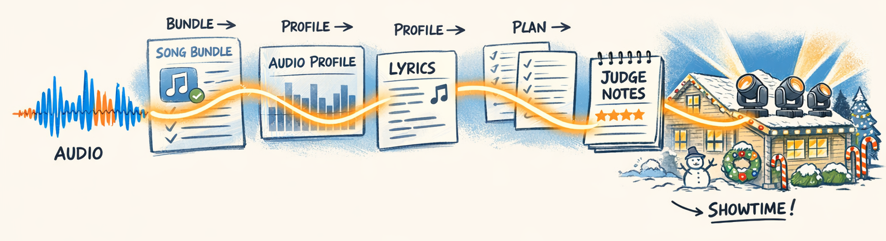
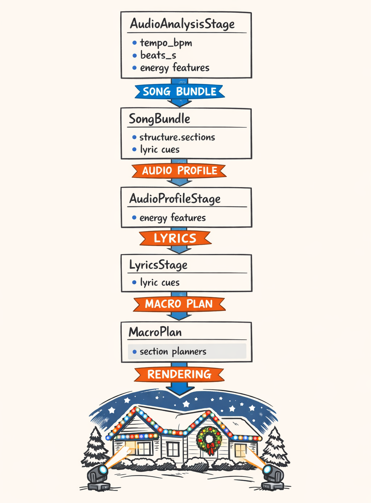
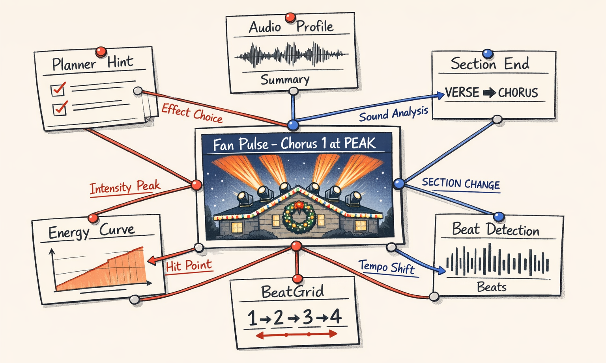
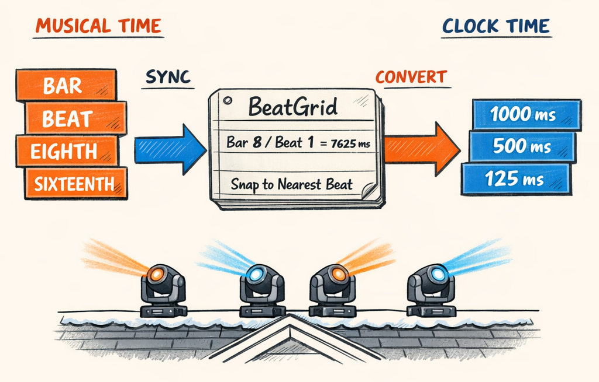
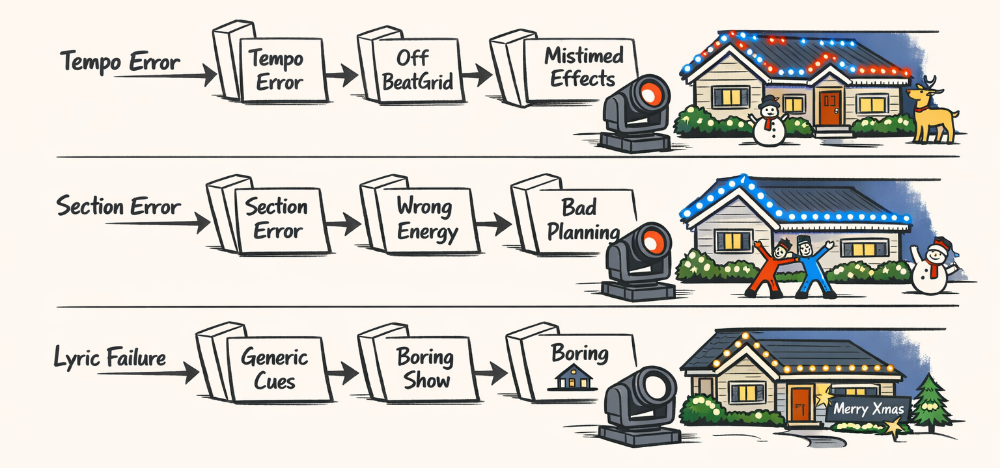
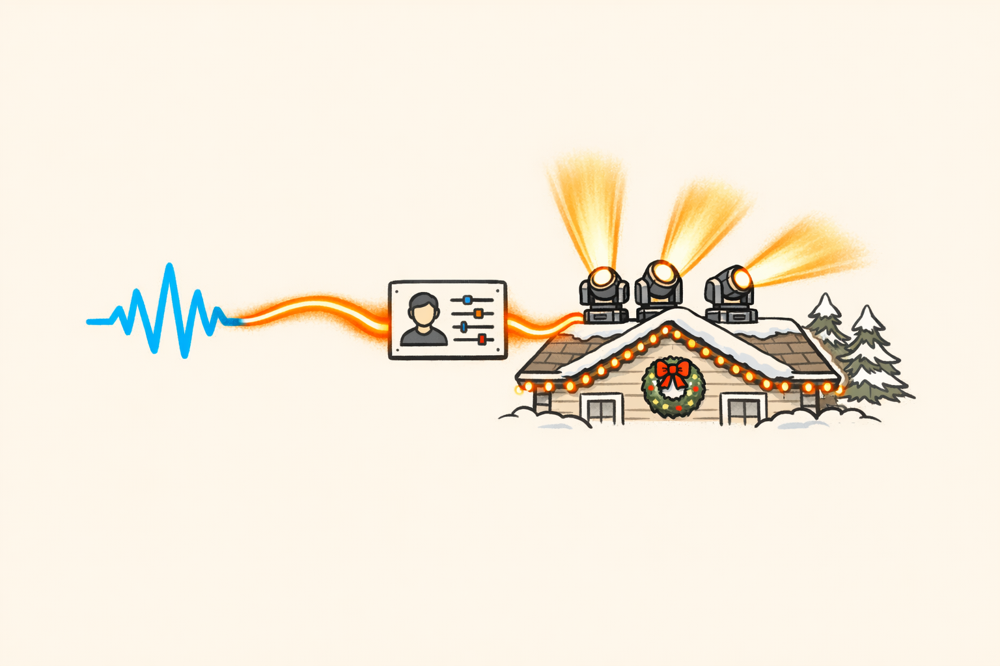

# The Thread: Following One Audio Decision All the Way to the Lights on the Roof

We had this neat mental model early on.

Audio analysis happens first. Then planning happens. Then rendering happens. Three boxes. Very civilized. Very PowerPoint.

That model lasted right up until we started debugging real shows.

Because the weird truth is this: audio isn't just the first stage. It's the shared contract holding the entire stack together. The beat tracker doesn't just hand off a tempo and clock out for the day. Section boundaries don't just help one planner prompt and disappear into the void. Lyrics don't just decorate the output if we're feeling poetic.

They keep showing up. Everywhere.

A chorus gets labeled `PEAK` in the audio profile, and suddenly the macro planner allocates more visual density there. The moving-head planner picks a wider, more aggressive effect family. The judge later rejects a sleepy-looking plan because it doesn't match the section energy. Then the renderer uses the same beat grid from Part 1 to pin every pulse to exact millisecond boundaries so the roofline and moving heads land together instead of arguing in public.

So this part is basically a detective story.

We're going to take one concrete musical decision and follow it all the way through the system: from deterministic audio extraction, into the `AudioProfileModel` we built in Part 4, through lyric enrichment from Part 5, into macro planning, into fixture-level planning, into judging, and finally into the rendered sequence that actually hits the lights on the roof.

No hand-waving. No "the AI kind of understands the song."

We're going field by field.

And honestly, that was the only way we convinced ourselves this thing wasn't making choreography decisions by consulting a haunted snow globe.

## We Thought Audio Was the First Stage. It Turned Out to Be the Whole Spine.

Remember the `AudioProfileModel` from Part 4? That object ended up being way more important than we expected.

At first it looked like a translation layer: take a giant pile of raw audio features and compress them into something an LLM can reason about without melting its token budget. Useful, sure. But still kind of "between" stages.

In practice, it became the spine.

That's because downstream stages mostly don't re-derive musical facts for themselves. They don't look back at waveforms and go, "Hmm yes, let me personally rediscover the chorus." Thank God. They trust the upstream contract. Tempo, beats, bars, section labels, energy summaries, peak moments, build regions, lyric cues — once those are shaped into shared structured context, they become the facts everyone else works from.

And that's what makes the system coherent when it works.

The macro planner sees section energy and contrast. The moving-head planner sees the same section energy and the same timing structure. The judge sees the same profile and can ask, "Does this plan actually fit the music we already agreed the song contains?" The renderer sees the same beat/bar timing and turns musical positions into exact placements.

So the goal here isn't to explain audio analysis again. We already did that in Parts 1 through 5.

The goal is to follow the thread.

We'll trace concrete fields like `tempo_bpm`, `beats_s`, `structure.sections`, compressed energy curves, and lyric cues as they move through the stack. Then we'll take one actual planner outcome — why a chorus ended up with `fan_pulse` at `PEAK` intensity — and walk backward until it lands at beat detection and section profiling.

Because once you see that chain end to end, the whole architecture makes a lot more sense.

Also, it becomes painfully obvious why the whole system acts drunk when the audio layer gets something wrong.

## The End-to-End Flow, Field by Field

Here's the practical shape of the pipeline.

Raw audio gets analyzed into timing, energy, spectral, and structure features. Those features get bundled. Then profiling compresses and labels them. Lyrics optionally enrich the same timeline. Then planning consumes that shared context. Then judging compares proposed choreography against that same context. Then rendering uses the beat grid and section map to turn musical intent into exact timed output.

The important bit is that the fields survive.

Not always in their original raw form, but as stable, named facts.

A simplified version looks like this:



From the audio side, the timing contract starts in beat extraction:

```python
# packages/twinklr/core/audio/rhythm/beats.py

def compute_beats(
    *,
    onset_env: np.ndarray,
    sr: int,
    hop_length: int,
    start_bpm: float = 120.0,
) -> tuple[float, np.ndarray]:
    tempo, beat_frames = librosa.beat.beat_track(
        onset_envelope=onset_env,
        sr=sr,
        hop_length=hop_length,
        units="frames",
        start_bpm=start_bpm,
        tightness=100,
    )

    if tempo is not None:
        tempo_f = float(tempo.item()) if hasattr(tempo, "item") else float(tempo)
    else:
        tempo_f = 0.0

    return tempo_f, np.asarray(beat_frames, dtype=int)
```

That becomes timing facts like:

- `tempo_bpm`
- `beats_s`
- `bars_s`
- `assumptions.beats_per_bar`

Then energy extraction contributes the longer-shape dynamics:

```python
# packages/twinklr/core/audio/energy/multiscale.py

def extract_smoothed_energy(
    y: np.ndarray, sr: int, *, hop_length: int, frame_length: int
) -> dict[str, Any]:
    rms = librosa.feature.rms(y=y, frame_length=frame_length, hop_length=hop_length)[0]
    times_s = frames_to_time(np.arange(len(rms)), sr=sr, hop_length=hop_length)
    rms_norm = normalize_to_0_1(rms)

    if HAS_SCIPY:
        rms_beat = gaussian_filter1d(rms_norm, sigma=2).astype(np.float32)
        rms_phrase = gaussian_filter1d(rms_norm, sigma=10).astype(np.float32)
        rms_section = gaussian_filter1d(rms_norm, sigma=50).astype(np.float32)
    else:
        # Fallback keeps the function from exploding on a missing scipy install.
        # Not glamorous, but neither is debugging production with half a stack trace.
        rms_beat = rms_norm.astype(np.float32)
        rms_phrase = rms_norm.astype(np.float32)
        rms_section = rms_norm.astype(np.float32)

    return {
        "times_s": as_float_list(times_s, 3),
        "beat_level": as_float_list(rms_beat, 5),
        "phrase_level": as_float_list(rms_phrase, 5),
        "section_level": as_float_list(rms_section, 5),
    }
```

That eventually feeds into profile-level labels like "gentle build," "sustained peak," or "low-contrast verse" instead of just giant float arrays.

By the time the audio profiler is done, the shared object in `packages/twinklr/core/agents/audio/profile/models.py` is carrying the parts planners actually need: section summaries, energy archetypes, contrast notes, musical landmarks, and timing references. Then the lyrics stage adds aligned cues on top of that same timeline — words, phrases, phonemes when we have them, and confidence-aware fallbacks when reality decides to be rude again.

So downstream planning usually doesn't ask, "What does the waveform mean?"

It asks, "Given `structure.sections`, `tempo_bpm`, the energy profile, peak moments, and lyric cues, what visual strategy fits this section?"

That's a very different problem. And a much more survivable one.

The key architectural choice here was refusing to let every stage improvise its own version of musical truth. Once a field is established upstream, later stages are supposed to consume it, not reinvent it.

That sounds obvious. It was not obvious when we were tired.

## Case File: Why Did Chorus 1 Get `fan_pulse` at PEAK?

Let's do the fun part.

Say we inspect a rendered show and notice Chorus 1 gets a moving-head effect that looks like this:

- broad fan spread
- pulse accents on each beat
- high-intensity dimmer envelope
- strong synchronized hit at the section entrance

In planner language, that may surface as something like `fan_pulse` with `PEAK` energy treatment.

Why there?

Not "because the LLM felt it." I mean the actual chain.

Start at the end. In the rendered sequence, we see beat-aligned pulses over a chorus time window. The renderer didn't invent that effect family. It got a section plan telling it to use a fan-based movement motif with beat-synchronous intensity accents.

That section plan didn't invent the section importance either. It inherited a macro-level expectation that Chorus 1 is one of the song's major payoff moments — more density, more width, less restraint.

And the macro planner didn't pull *that* from raw audio spaghetti. It got there because the audio profile likely described that section with some combination of:

- high section energy
- strong contrast versus the preceding verse
- build resolution or drop entry at the boundary
- chorus-like repetition and prominence in `structure.sections`
- maybe lyric emphasis if the first chorus carries the song title

Now walk one step farther back.

That "high section energy" label was probably derived from the compressed multiscale energy curve from Part 4 — especially the phrase-level and section-level curves from `extract_smoothed_energy()`. If the section-level curve rises into the chorus and stays elevated, and if the phrase-level curve shows repeated beat-level accents, the profiler can summarize that section as a sustained high-energy moment instead of a one-hit wonder.

Then behind *that* sits section detection from Part 3. If the boundary into Chorus 1 is correctly placed — say right after an 8-bar build — the whole profile makes sense. If the boundary is off by four beats, the planner may still get a `PEAK` label, but now it's attached to the wrong chunk of time and the effect lands like a delayed sneeze.

And underneath all of it is beat detection.

Because `fan_pulse` is only convincing if the pulses actually lock to beats. The beat tracker in `packages/twinklr/core/audio/rhythm/beats.py` gives us `tempo_bpm` and beat positions. Those become `beats_s`, then bar positions, then a `BeatGrid`, and eventually exact millisecond timings for every pulse.

So the causal chain looks like this:

1. `compute_beats()` detects pulse timing.
2. Beat/bar timing anchors section segmentation.
3. Energy analysis shows a rise and sustained high intensity.
4. Section detection marks Chorus 1 as a major structural region.
5. Audio profiling compresses that into section labels and peak descriptors.
6. Macro planning says this section deserves a bigger visual vocabulary.
7. Moving-head planning chooses `fan_pulse`.
8. The judge checks whether that matches the section's musical profile.
9. The renderer quantizes pulses to beat boundaries and emits the final timing.

That's the whole point of the architecture. The decision feels creative on the surface, but the chain beneath it is mechanical and inspectable.

Which was necessary, because before we had this traceability, debugging a bad chorus felt like arguing with a hallucinating intern who also controlled the roof.



## How Audio Shapes the Macro Planner Before It Picks Anything

The macro planner is where the system starts making high-level promises.

Not fixture commands yet. More like: where should the show feel sparse, where should it open up, where should contrast spike, where do we spend our big visual moments, and how many layers of motion can we afford before the house starts looking like it drank six espressos.

And the important thing is that the prompt is full of structured musical context, not raw DSP goo.

From `packages/twinklr/core/agents/sequencer/macro_planner/prompts/planner/user.j2`, the planner gets audio-shaped guidance along these lines:

```python
# cleaned-up excerpt from packages/twinklr/core/agents/sequencer/macro_planner/prompts/planner/user.j2

Song timing and structure:
- Tempo: {{ audio_profile.tempo_bpm }} BPM
- Time signature: {{ audio_profile.time_signature }}
- Duration: {{ audio_profile.duration_s }}s

Sections:

- {{ section.label }} | start={{ section.start_s }}s end={{ section.end_s }}s
  energy={{ section.energy_level }}
  role={{ section.musical_role }}
  contrast={{ section.contrast_from_previous }}


Energy profile:
- Overall arc: {{ audio_profile.energy.arc_summary }}
- Peak moments: {{ audio_profile.energy.peak_moments }}
- Build regions: {{ audio_profile.energy.build_regions }}
- Dynamic contrast: {{ audio_profile.energy.dynamic_contrast }}

Creative guidance:
- Reserve biggest visual reveals for confirmed peak sections
- Increase motion density gradually through builds
- Use contrast between verse and chorus, not constant intensity
- Match lyrical emphasis when confidence is high
```

That last part matters a lot. The planner isn't just told what the song *is*. It's told how to respect the song.

Which sounds suspiciously philosophical for a Jinja template, but that's what it is.

The `AudioProfileModel` from Part 4 is doing the heavy lifting here. It takes huge arrays — energy curves, structure hypotheses, spectral summaries, tension signals — and turns them into compact semantic inputs the planner can actually use:

- section energy classes
- peak vs valley moments
- build/drop landmarks
- contrast summaries
- likely emotional arc
- lyric emphasis cues when available

So when the macro planner decides Chorus 1 should get more layers, stronger contrast, and denser motion than Verse 1, it's not guessing from waveform vibes. It's consuming pre-chewed musical intelligence.

Which, in our experience, is the difference between "surprisingly coherent" and "why is the bridge brighter than the final chorus?"

We learned this the hard way. Early prompts that shoved in too much raw feature detail actually made decisions worse. The model would latch onto random specifics and miss the shape of the song. Once we gave it compressed, stable summaries, planning got less chaotic.

Not smarter in a magical sense. Just less likely to freestyle itself into nonsense.

## Section Planning, Judges, and the Feedback Loop That Keeps Everyone Honest

Once the macro planner defines section intent, the moving-head planner gets more specific.

This is where we stop asking broad questions like "How energetic should the chorus feel?" and start asking "What actual effect families, motion shapes, density, and accent patterns should the moving heads use in this section?"

And again, the planner gets audio context directly.

A cleaned-up excerpt from `packages/twinklr/core/agents/sequencer/moving_heads/prompts/planner/user.j2` looks roughly like this:

```python
# cleaned-up excerpt from packages/twinklr/core/agents/sequencer/moving_heads/prompts/planner/user.j2

Section to plan:
- label: {{ section.label }}
- start_s: {{ section.start_s }}
- end_s: {{ section.end_s }}
- energy_level: {{ section.energy_level }}
- role: {{ section.musical_role }}
- contrast_from_previous: {{ section.contrast_from_previous }}

Timing context:
- tempo_bpm: {{ audio_profile.tempo_bpm }}
- beats_per_bar: {{ audio_profile.beats_per_bar }}
- peak_moments_in_section: {{ section.peak_moments }}
- lyric_cues: {{ section.lyric_cues }}

Macro intent:
- target_motion_density: {{ macro_section.motion_density }}
- target_layer_count: {{ macro_section.layer_count }}
- target_intensity: {{ macro_section.intensity }}
- contrast_goal: {{ macro_section.contrast_goal }}
```

So the section planner is grounded by the same contract the macro planner used.

Then comes the part I like most: the judge.

Because if you let one LLM plan and never ask a second pass whether the plan matches the music, things get weird fast. Not fun weird. More like "the intro looks like a grand finale because the model got excited."

The judge prompt in `packages/twinklr/core/agents/sequencer/moving_heads/prompts/judge/user.j2` gets the proposed plan *and* the same audio and macro context:

```python
# cleaned-up excerpt from packages/twinklr/core/agents/sequencer/moving_heads/prompts/judge/user.j2

Evaluate whether this moving-head section plan matches the music.

Audio context:
- section energy_level: {{ section.energy_level }}
- role: {{ section.musical_role }}
- build/drop context: {{ section.build_drop_context }}
- lyric emphasis: {{ section.lyric_cues }}

Macro expectations:
- intended intensity: {{ macro_section.intensity }}
- intended contrast: {{ macro_section.contrast_goal }}
- intended motion density: {{ macro_section.motion_density }}

Proposed plan:
{{ planner_output }}
```

That creates a consistency loop.

The plan is generated with audio context, then judged against that same audio context. So if the planner proposes low-motion, low-contrast choreography in a section profiled as a major peak, the judge can reject it. If it overcooks a quiet verse, same deal.

It's not perfect. Sometimes both models agree on something dumb, which is honestly very human of them.

But this shared contract keeps the system from drifting too far from the musical facts established upstream. And that pattern — shared context, multiple agents, constrained checks — is going to matter a lot in Part 7, when we zoom out and talk about the design rules we'd hand to past us before letting an LLM anywhere near holiday lighting.

## BeatGrid Shows Up Again at the End, Like a Very Reliable Accountant

Remember the BeatGrid from Part 1? It never leaves.

It just gets less flashy and more important.

By the time we're rendering, we don't want poetic notions of rhythm. We want exact times in milliseconds. The planner might say "start this sweep at bar 17, hit intensity pulses on beats, resolve on the downbeat of bar 21." Cool. The renderer now has to convert that into concrete event timings that xLights can actually use.

That's where `packages/twinklr/core/sequencer/timing/beat_grid.py` and the resolver underneath it earn their keep.

The grid is built from audio-derived timing:

```python
# packages/twinklr/core/sequencer/timing/beat_grid.py

class BeatGrid(BaseModel):
    bar_boundaries: list[float]
    beat_boundaries: list[float]
    eighth_boundaries: list[float]
    sixteenth_boundaries: list[float]
    tempo_bpm: float
    beats_per_bar: int
    duration_ms: float

    @classmethod
    def from_resolver(cls, resolver: TimeResolver, duration_ms: float) -> BeatGrid:
        beat_boundaries_int = resolver.get_beat_positions_ms()
        bar_boundaries_int = resolver.get_bar_boundaries_ms()

        beat_boundaries = [float(b) for b in beat_boundaries_int]
        bar_boundaries = [float(b) for b in bar_boundaries_int]

        return cls(
            bar_boundaries=bar_boundaries,
            beat_boundaries=beat_boundaries,
            eighth_boundaries=cls._calculate_eighth_boundaries(beat_boundaries),
            sixteenth_boundaries=cls._calculate_sixteenth_boundaries(beat_boundaries),
            tempo_bpm=resolver.tempo_bpm,
            beats_per_bar=resolver.beats_per_bar,
            duration_ms=duration_ms,
        )
```

And the resolver pulls from the original song features:

```python
# packages/twinklr/core/sequencer/timing/resolver.py

class TimeResolver:
    def __init__(self, song_features: dict[str, Any]):
        self.beats_s = np.array(song_features.get("beats_s", []), dtype=np.float64)
        self.bars_s = np.array(song_features.get("bars_s", []), dtype=np.float64)
        self.tempo_bpm = song_features.get("tempo_bpm", 120.0)
        self.duration_s = song_features.get("duration_s", 0.0)
        self.beats_per_bar = song_features.get("assumptions", {}).get("beats_per_bar", 4)
```

Then in display composition, sections get mapped to musical ranges. The relevant plumbing lives in `packages/twinklr/core/pipeline/display_stages.py` and `packages/twinklr/core/sequencer/display/composition/section_map.py`. That's where section intents and musical references become actual scheduled display windows.

The practical consequence is simple: bars and beats survive all the way to final output.

A pulse "on beat 3 of bar 22" doesn't become "eh, somewhere around 58.7 seconds." It becomes an exact position from the same audio-derived grid that informed every planning stage before it.

That's why the timing contract matters so much. If it drifts, the whole show drifts. If it holds, the final render feels locked in, even though multiple planners and judges touched it on the way down.

Which is deeply comforting. Like discovering at least one adult is supervising the project.



## What Happens When Audio Is Wrong, and Why the Whole System Feels Drunk

Now for the ugly part.

When audio is wrong, the system doesn't fail gracefully in some noble, isolated way. It cascades.

The whole stack starts making internally consistent decisions about the wrong song.

That's almost worse.

### Wrong tempo

The classic one from Part 1: the beat tracker hears 126 BPM when the song is really 63. Double-time hallucination. Very common. Very annoying.

Now every beat boundary is twice as dense as it should be. The planner thinks it has lots of small rhythmic slots to play with. Pulse effects get overpacked. Motion changes happen too often. Quantized accents land on subdivisions that feel fidgety instead of confident.

Nothing is randomly broken. It's all *consistently too busy*.

Which is how you get a solemn Christmas ballad choreographed like the roofline just discovered caffeine.

### Wrong section boundary

This one is nastier.

If the chorus starts at 61.2s but section detection marks it at 59.8s, then the profile may assign peak energy and chorus semantics to the tail end of the build. The macro planner spends its contrast budget early. The moving-head planner opens the visual fan before the actual release. Then when the real chorus hits, the show has already emotionally cashed the check.

We've had renders where the lights did the big reveal four beats early and then had nowhere to go. It felt like someone yelling the punchline before the joke finished.

This is why Part 3 ended up being so painful. Section errors don't just mislabel metadata. They reorder the emotional logic of the show.

### Missing or low-confidence lyrics

Lyrics fail more softly, but they still matter.

If the lyrics pipeline from Part 5 can't produce aligned, trustworthy cues, planners lose an entire semantic layer. The system falls back to generic musical treatment: energy, structure, rhythm, maybe some broad emotional arc. That's still usable. Sometimes it's quite good.

But it won't catch phrase-level emphasis like a title hook, a held vocal, or a call-and-response moment that should get a visual echo.

So instead of "this exact word should bloom across the roofline," you get "the chorus is important in general."

That's not catastrophic. It's just less specific. More competent than expressive.

And to be honest, we've shipped plenty of sequences in that mode because bad lyrics are worse than absent lyrics. A confidently wrong lyric cue is how you get the lights dramatically emphasizing a syllable nobody cares about.

The bigger lesson is that audio errors propagate through *contracts*. If the contract is wrong, every downstream stage can still look rational while producing nonsense.

That's why debugging this system stopped being "why did the moving-head planner choose this?" and became "what upstream fact made this choice seem reasonable?"

Once we started tracing failures that way, things got fixable.

Still painful. But fixable.



## The Audio Layer Is Bigger Than Moving Heads

One last thing before we wrap.

It's tempting to treat all of this as moving-head-specific because moving heads are where the choreography gets visually dramatic. They're the divas. They pan, tilt, pulse, and generally demand attention.

But the audio layer is bigger than that.

The same timing and structural intelligence also feeds display sequencing more broadly. `BeatGrid`, `TimeResolver`, and section mapping aren't tied to one fixture family. They're fixture-agnostic infrastructure. Roofline effects, matrix moments, prop accents, and other display domains can consume the same musical contract.

You can see that in the composition plumbing:

```python
# packages/twinklr/core/sequencer/timing/resolver.py

class TimeResolver:
    """This resolver is universal and can be used across all sequencing domains."""
```

And in the display pipeline, where section mapping and timing resolution sit below effect-specific logic:

```python
# packages/twinklr/core/pipeline/display_stages.py
# packages/twinklr/core/sequencer/display/composition/section_map.py

# display stages consume musical structure and timing,
# then map planned sections into concrete composition windows
# for whatever fixture domain is being rendered.
```

That ended up being one of the healthier architecture decisions we made.

The audio intelligence is reusable infrastructure, not a moving-head hack we happened to get working once.

Which tees up Part 7 nicely, because that's where we'll pull back from the Christmas-light specifics and talk about the transferable patterns: shared contracts, compressed context, judge loops, deterministic anchors, and all the stuff we'd really like to tell past us before we let another LLM choreograph anything with electricity attached to it.



---

## About twinklr


twinklr is our ongoing science experiment in weaponizing holiday cheer. It's an AI-driven choreography and composition engine that takes an audio file and spits out fully synchronized sequences for Christmas light displays in xLights — because apparently we looked at a normal, peaceful hobby and thought, "What if we added AI, machine learning, and sleepless nights?"

Here's the honest disclaimer: we're not professional lighting designers. We're developers, engineers, and AI researchers who spend our days building at the frontier of AI and our nights obsessing over why a dimmer curve feels late by half a beat and whether a roofline sweep should be dramatic or merely aggressively festive. If you're expecting polished stage-production wisdom, you're in the wrong place. If you're into nerdy overengineering, mildly unhinged experimentation, and the occasional "how did that even work?" moment — welcome.

This blog is the running log of our journey: the wins, the faceplants, the weird breakthroughs, and the lessons learned the hard way, often repeatedly. We'll share what we're building, what breaks, and why certain architectural decisions matter — especially when the goal is to turn "song" into "show" without the lights looking like they're having an existential crisis.
