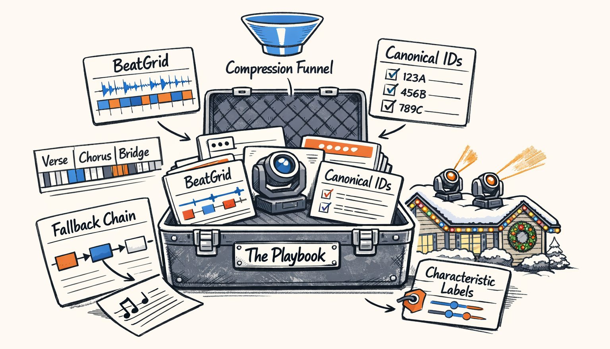
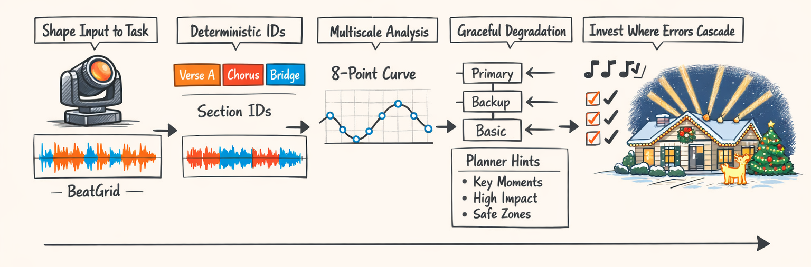
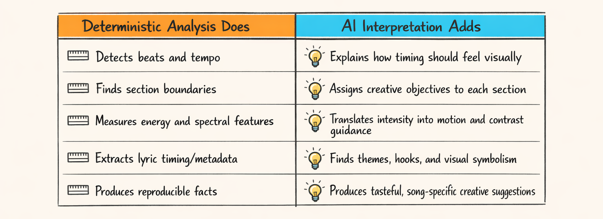

# The Playbook: Things We’d Tell Past Us Before We Let an LLM Choreograph Christmas Lights Again

So here we are at the end of the audio-intelligence side of the series.

We started with raw waveform soup, taught the system to hear beats, then sections, then energy, then lyrics, then somehow convinced an LLM to use all of that without turning a Christmas show into a pan-tilt identity crisis. A lot of it worked. Some of it worked only after we stopped being stubborn. A few things worked mainly because reality bullied us into better architecture.

This part is the cheat sheet we wish we’d had earlier.

Not the polished conference-talk version. The actual one. The version where we admit that Christmas music is a deranged dataset, lyric providers are unreliable in deeply creative ways, and giving an LLM *more* context often made it *worse*, not better. Which, in hindsight, should’ve been obvious. But hindsight is the luxury item you buy with production bugs.

## The Stuff That Actually Worked

A few decisions kept paying rent over and over.

First: the **BeatGrid** from Part 1. That thing turned out to be the boring hero of the whole stack. Once we stopped treating timing as “some beats plus vibes” and started precomputing bar, beat, eighth, and sixteenth boundaries, the rest of the planner got dramatically simpler. Not smarter. Simpler. That mattered more.

From `packages/twinklr/core/sequencer/timing/beat_grid.py`:

```python
class BeatGrid(BaseModel):
    model_config = ConfigDict(frozen=True)

    bar_boundaries: list[float]
    beat_boundaries: list[float]
    eighth_boundaries: list[float]
    sixteenth_boundaries: list[float]
    tempo_bpm: float
    beats_per_bar: int
    duration_ms: float

    @classmethod
    def from_resolver(cls, resolver: TimeResolver, duration_ms: float) -> BeatGrid:
        beat_boundaries_int = resolver.get_beat_positions_ms()
        bar_boundaries_int = resolver.get_bar_boundaries_ms()

        beat_boundaries = [float(b) for b in beat_boundaries_int]
        bar_boundaries = [float(b) for b in bar_boundaries_int]

        return cls(
            bar_boundaries=bar_boundaries,
            beat_boundaries=beat_boundaries,
            # Precompute subdivisions once so downstream code stays dumb and fast
            eighth_boundaries=cls._calculate_eighth_boundaries(beat_boundaries),
            sixteenth_boundaries=cls._calculate_sixteenth_boundaries(beat_boundaries),
            tempo_bpm=float(resolver.tempo_bpm),
            beats_per_bar=int(resolver.beats_per_bar),
            duration_ms=duration_ms,
        )
```

Second: **context compression** from Part 4. Huge win. LLMs did better when we gave them shaped summaries instead of dumping frame-level curves on their lap like a raccoon delivering trash.

Third: **characteristic labels**. “Brightness rises steadily through the pre-chorus” worked better than shipping 400 numbers and hoping the model discovered poetry in arrays.

Fourth: **fallback chains**. Especially in lyrics. Part 5 exists because reality refused to cooperate. Optional intelligence with graceful degradation beat brittle “smart” systems every time.

Fifth: **canonical IDs**. Once sections, lyric lines, and planning artifacts had stable names, debugging got way less mystical.

And sixth: **separate audio and lyrics agents**. We tried pretending one model could hold all musical structure, semantic meaning, and timing nuance in its head at once. It could not. Splitting the jobs made outputs less confused and failures easier to localize.

That’s the pattern underneath all of it: shape the problem until each component has one job it can do without lying.

## What Surprised Us More Than It Should Have

Look, the biggest surprise was that **section detection was the highest-leverage problem by far**.

We knew it mattered. We did not fully appreciate that a section boundary being wrong by even a few bars can poison almost everything downstream. If the system thinks the chorus starts at 0:42 instead of 0:50, the planner spends the emotional payoff early, the lyrics agent anchors the wrong lines to the wrong intent window, and the final show feels like it’s celebrating a future that hasn’t happened yet. It’s uncanny in the worst way.

Part 3 was basically us learning this with our face.

The second surprise: **Christmas music is an aggressively uncooperative dataset**. You’ve got whispery piano intros, huge orchestral swells, children’s choirs, sleigh bells that trick onset detectors, swing rhythms, rubato vocals, spoken interludes, and production choices that seem personally designed to embarrass beat trackers. We thought “holiday songs” would be a nice thematic domain. Instead, it was a stress test wearing a Santa hat.

And then there was the LLM context problem.

We expected more detail to help. In practice, less context often produced better profiling output. When prompts included long raw arrays or too many parallel features, the model got weirdly generic or latched onto the wrong signal. Once we compressed curves into higher-level summaries in `packages/twinklr/core/agents/audio/profile/context.py`, quality went up. Not a little. Noticeably.

The lyrics side had its own humbling moments. We expected lyric text quality to be annoying but manageable. It was worse. Missing lines. Wrong repeats. Verse order from some alternate universe. Meanwhile, **phoneme timing** ended up being more useful than we expected, because even when semantic content was messy, word- and syllable-adjacent timing still gave the planner something real to latch onto.

That changed how we thought about lyrical intelligence. The text tells you *what* matters. The phoneme timing often tells you *when* it can land.

Which sounds obvious now.

A lot of this series is things becoming obvious only after they punched us in the throat.

## What We’d Do Differently If We Were Slightly Wiser and Slightly More Rested

We would’ve tested section detection earlier. Much earlier.

Not “once the whole pipeline is assembled and producing suspiciously dramatic failures.” I mean right after basic beat and energy extraction. Section detection was the first place where small analysis errors became large creative errors, and we treated it like a middle-layer detail instead of the structural backbone it really was.

We also would’ve designed **context compression before writing the first profiling prompt**. We burned time trying to make prompts resilient to raw feature sprawl when the correct move was to stop sending feature sprawl in the first place. The model didn’t need more numbers. It needed better nouns.

And we would’ve added **confidence metrics everywhere by default**.

Not just “did we detect a thing,” but “how sure are we,” “what fallback should trigger,” and “should downstream agents trust this at full strength or treat it as advisory?” We did this in spots, but if we were doing it again, every analysis stage would emit confidence as a first-class output. Beats. Sections. Lyrics alignment. Time signature. All of it.

> If a signal can be wrong, the system should say how wrong it might be before another component builds a small civilization on top of it.

That’s not deep wisdom. That’s just what happens after enough bugs.

## Patterns That Generalize Beyond Christmas Lights

Under all the tinsel, a few patterns here are pretty reusable.

The first is **shape input to the task**. Raw data is not automatically better data. In Part 4, we stopped feeding the profiling agent giant feature dumps and instead gave it compressed, structured summaries built for interpretation. Same information density, way better usability.

From `packages/twinklr/core/agents/audio/profile/context.py`, the spirit of the thing looked like this:

```python
def build_profile_context(audio_features: dict, sections: list, lyrics_summary: dict | None) -> dict:
    # Don't dump full-resolution curves into the prompt.
    # Compress to representative points and semantic labels.
    return {
        "tempo_bpm": audio_features["tempo_bpm"],
        "time_signature": audio_features.get("time_signature", "4/4"),
        "energy_shape": compress_curve(audio_features["energy"]["phrase_level"], points=8),
        "brightness_shape": compress_curve(audio_features["spectral"]["brightness"], points=8),
        "section_summaries": [
            {
                "section_id": section["id"],
                "label": section["label"],
                "start_s": section["start_s"],
                "end_s": section["end_s"],
                "characteristics": section.get("characteristics", []),
            }
            for section in sections
        ],
        "lyrics_summary": lyrics_summary,
    }
```

Second: **use deterministic IDs**. If multiple agents touch the same entity, give that entity a canonical name early. Stable section IDs let profiling, lyrics analysis, planning, and debugging talk about the same thing without playing “which chorus are you talking about?”

Third: **do multiscale analysis for multiscale decisions**. Beat-level motion and section-level structure are different problems. Treating them as one signal is how you get shows that twitch impressively but say nothing.

From `packages/twinklr/core/audio/energy/multiscale.py`:

```python
def extract_smoothed_energy(y: np.ndarray, sr: int, *, hop_length: int, frame_length: int) -> dict[str, Any]:
    rms = librosa.feature.rms(y=y, frame_length=frame_length, hop_length=hop_length)[0].astype(
        np.float32
    )
    rms_norm = normalize_to_0_1(rms)

    # Same source signal, different temporal meanings
    rms_beat = gaussian_filter1d(rms_norm, sigma=2).astype(np.float32)
    rms_phrase = gaussian_filter1d(rms_norm, sigma=10).astype(np.float32)
    rms_section = gaussian_filter1d(rms_norm, sigma=50).astype(np.float32)

    return {
        "raw": as_float_list(rms_norm, 5),
        "beat_level": as_float_list(rms_beat, 5),
        "phrase_level": as_float_list(rms_phrase, 5),
        "section_level": as_float_list(rms_section, 5),
    }
```

Fourth: **design for graceful degradation**. The lyrics pipeline in `packages/twinklr/core/audio/lyrics/pipeline.py` mattered a lot when it worked, but the show still had to function when it didn’t. Optional enrichment beats mandatory fragility.

Fifth: **invest where errors cascade**. Beat mistakes are annoying. Section mistakes are catastrophic. That generalizes to basically any AI system touching real-world signals: spend your rigor budget where a wrong early assumption creates ten later lies.



## Facts on One Side, Meaning on the Other

Here’s the architectural boundary that ended up mattering most:

Deterministic analysis measures the song.  
AI interpretation explains what those measurements might *mean* for choreography.

That division kept us sane.

The audio stack detects beats, section boundaries, energy curves, spectral features, and lyric timing. Those are facts. Imperfect facts sometimes, sure, but still facts we can reproduce. The LLM doesn’t get to invent where beat 73 happened because it’s feeling whimsical.

Then the interpretation layer takes those facts and does the fuzzy human part: what should the chorus feel like, which lyric deserves visual emphasis, whether a build should read as anticipation or triumph, whether the bridge wants restraint or contrast.

The system works because neither side is asked to do the other’s job.

When we blurred that line, things got dumb fast. Deterministic code is bad at tasteful symbolism. LLMs are bad at being a metronome. Asking either one to cosplay as the other is how you end up debugging nonsense at 1:30 a.m. while a roofline mockup strobes with the confidence of a wrong answer.



That boundary matters in Christmas lights, but honestly it matters in any serious AI-assisted system. Measure first. Interpret second. Don’t swap them.

## So What Now?

So what now?

Now the interesting part keeps going.

The audio stack can hear the song well enough to hand the rest of the system something useful. Not perfect. Not magical. Useful. And that turns out to be the threshold that matters. Once you can separate facts from interpretation, compress reality into the right shape, and degrade gracefully when the world gets messy, you can build systems that are both creative *and* debuggable. Which is rarer than it should be.

The rest of Twinklr is still its own adventure: planning, rendering, judging candidate sequences, exporting to xLights, and continuing the deeply strange work of teaching software to be festive on purpose.

We’re still learning where the line is between analysis and taste.

We’re still finding bugs that make us laugh after they stop making us swear.

And honestly, that’s the fun part.

If you’ve read the whole series, thanks for coming along for this weird little expedition into musical structure, probabilistic interpretation, and weaponized holiday cheer.

We think the robot hears the song now.

Mostly.


---

## About twinklr


twinklr is our ongoing science experiment in weaponizing holiday cheer. It's an AI-driven choreography and composition engine that takes an audio file and spits out fully synchronized sequences for Christmas light displays in xLights — because apparently we looked at a normal, peaceful hobby and thought, "What if we added AI, machine learning and sleepless nights?"

Here's the honest disclaimer: we're not professional lighting designers. We're developers, engineers, and AI researchers who spend our days building at the frontier of AI… and our nights obsessing over why a dimmer curve feels late by half a beat and whether a roofline sweep should be dramatic or merely aggressively festive. If you're expecting polished stage-production wisdom, you're in the wrong place. If you're into nerdy overengineering, mildly unhinged experimentation, and the occasional "how did that even work?" moment — welcome.

This blog is the running log of our journey: the wins, the faceplants, the weird breakthroughs, and the lessons learned the hard way, often repeatedly. We'll share what we're building, what breaks, and why certain architectural decisions matter — especially when the goal is to turn "song" into "show" without the lights looking like they're having an existential event.
