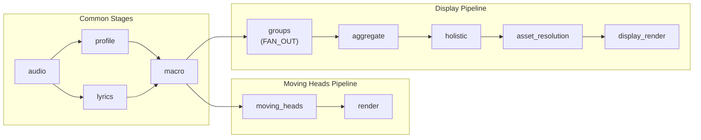

# Developer Guide

Technical reference for contributors and developers working on the Twinklr codebase.

---

## Repository Structure

Twinklr is a [uv workspace](https://docs.astral.sh/uv/concepts/workspaces/) with two packages:

```
twinklr/
├── packages/twinklr/
│   ├── core/                    # twinklr-core — core library
│   │   ├── agents/              # Multi-agent orchestration
│   │   │   ├── audio/           # Audio profiling & lyrics agents
│   │   │   ├── sequencer/       # Planner, macro planner, group planner
│   │   │   ├── providers/       # LLM provider adapters (OpenAI)
│   │   │   ├── shared/          # Judge, iteration controller, validation
│   │   │   └── logging/         # LLM call logging
│   │   ├── audio/               # Audio analysis pipeline
│   │   │   ├── rhythm/          # Tempo, beats, BeatGrid
│   │   │   ├── energy/          # RMS, builds, drops
│   │   │   ├── structure/       # Section detection
│   │   │   ├── harmonic/        # Key, chords, chroma
│   │   │   └── phonemes/        # G2P, viseme mapping
│   │   ├── caching/             # Cache backends (FS, null)
│   │   ├── config/              # App & job config models
│   │   ├── curves/              # Curve generation library
│   │   ├── feature_engineering/  # Feature extraction pipeline
│   │   ├── feature_store/       # SQLite feature store
│   │   ├── formats/             # File format handlers
│   │   │   └── xlights/         # xLights .xsq reader/writer
│   │   ├── io/                  # Filesystem abstractions
│   │   ├── parsers/             # Input file parsers
│   │   ├── pipeline/            # Declarative pipeline framework
│   │   │   └── definitions/     # Pipeline factory functions
│   │   ├── profiling/           # Audio profiling
│   │   ├── reporting/           # Output reporting
│   │   ├── resolvers/           # Value resolution
│   │   ├── sequencer/           # Rendering & compilation
│   │   │   ├── moving_heads/    # MH template compiler, DMX export
│   │   │   ├── display/         # Display effects & composition
│   │   │   ├── templates/       # Template registry & builtins
│   │   │   ├── models/          # Shared sequencer models
│   │   │   └── vocabulary/      # Semantic vocabulary enums
│   │   ├── session.py           # Universal session coordinator
│   │   └── utils/               # Shared utilities
│   └── cli/                     # twinklr-cli — CLI entry point
│       └── main.py              # Argument parsing, pipeline wiring
├── tests/                       # Unit, integration, e2e tests
├── scripts/                     # Dev/demo/analysis scripts
├── docs/                        # Documentation
├── data/                        # Runtime data (gitignored)
│   └── blog/                    # Technical blog content
├── Makefile                     # Development commands
├── pyproject.toml               # Workspace configuration
└── .env.example                 # Environment variable template
```

### Workspace Packages

| Package | Directory | PyPI Name | Description |
|---|---|---|---|
| Core | `packages/twinklr/core/` | `twinklr-core` | All library code: audio, agents, sequencer, pipeline, config |
| CLI | `packages/twinklr/cli/` | `twinklr-cli` | CLI entry point, depends on `twinklr-core` |

Workspace members are declared in the root `pyproject.toml`:

```toml
[tool.uv.workspace]
members = ["packages/twinklr/core", "packages/twinklr/cli"]

[tool.uv.sources]
twinklr-core = { workspace = true }
twinklr-cli = { workspace = true }
```

---

## Architecture

### Pipeline Framework

_Source: `packages/twinklr/core/pipeline/`_

The pipeline framework provides declarative DAG-based pipeline execution:

```python
from twinklr.core.pipeline import (
    PipelineDefinition,
    PipelineExecutor,
    PipelineContext,
    StageDefinition,
    ExecutionPattern,
)
```

**Key types:**

| Type | Purpose |
|---|---|
| `PipelineDefinition` | Declares ordered stages with dependency graph and `fail_fast` policy |
| `StageDefinition` | Stage ID, `PipelineStage` instance, input dependencies, execution pattern, type annotations |
| `PipelineStage` | Abstract base — subclass and implement `execute()` for each stage |
| `PipelineExecutor` | Resolves dependencies and runs stages, collecting `PipelineResult` |
| `PipelineContext` | Carries `TwinklrSession`, state dict, metrics, and output dir |
| `ExecutionPattern` | `SEQUENTIAL` (default), `PARALLEL`, `FAN_OUT`, `CONDITIONAL` |
| `PipelineResult` | Overall success/failure, per-stage results, timing, outputs dict |

**Conditional stages:** Set `pattern=ExecutionPattern.CONDITIONAL` with a `condition` lambda on `StageDefinition`. The lyrics stage uses this to skip when no lyrics are detected:

```python
StageDefinition(
    id="lyrics",
    stage=LyricsStage(),
    inputs=["audio"],
    pattern=ExecutionPattern.CONDITIONAL,
    condition=lambda ctx: ctx.get_state("has_lyrics", False),
    critical=False,
)
```

_Source: `packages/twinklr/core/pipeline/definitions/common.py:62-71`_

### Pipeline Definitions

Pipeline factories compose stages into complete pipelines:

**Common stages** (`build_common_stages()` in `common.py`):
1. `audio` — `AudioAnalysisStage` → `SongBundle`
2. `profile` — `AudioProfileStage` → `AudioProfileModel`
3. `lyrics` — `LyricsStage` → `LyricContextModel` (conditional, non-critical)
4. `macro` — `MacroPlannerStage` → `list[MacroSectionPlan]`

**Moving heads pipeline** (`build_moving_heads_pipeline()` in `moving_heads.py`):
- Common stages + `moving_heads` (`MovingHeadStage` → `ChoreographyPlan`) + `render` (`MovingHeadRenderingStage` → `Path`)
- Full chain: `audio → profile + lyrics → macro → moving_heads → render`
- Used by the CLI (`twinklr run`)

**Display pipeline** (`build_display_pipeline()` in `display.py`):
- Common stages + `groups` (`GroupPlannerStage`, FAN_OUT per macro section → `SectionCoordinationPlan`) + `aggregate` (`GroupPlanAggregatorStage` → `GroupPlanSet`) + `holistic` (optional evaluation) + `holistic_corrector` (optional fixes) + `asset_creation` (optional) + `asset_resolution` + `display_render`
- Full chain: `audio → profile + lyrics → macro → groups (FAN_OUT) → aggregate → holistic → asset_resolution → display_render`
- Uses `FAN_OUT` execution pattern to plan each macro section in parallel
- Configurable stages: `enable_holistic`, `enable_holistic_corrector`, `enable_assets`
- Not yet wired into the CLI; used by the display sequencer subsystem



_Source: `packages/twinklr/core/pipeline/definitions/`_

### Agent System

_Source: `packages/twinklr/core/agents/`_

The agent system is data-driven: `AgentSpec` data objects define prompt pack, response model, and LLM settings. A single `async_runner` executes any spec.

**Orchestration loop** (`AgentOrchestrationConfig` defaults):
- `max_iterations`: 3 — planner/judge cycles
- `success_threshold`: 70 — config field (0-100 scale); the CLI hard-codes `min_pass_score=7.0` (0-10 scale) as the operative gate in `build_moving_heads_pipeline()`
- `token_budget`: 75,000 — total token limit

**Agent configs** (`AgentConfig` defaults):
- `plan_agent.model`: `"gpt-5.2"`, temperature 0.7
- `judge_agent.model`: `"gpt-5-mini"`, temperature 1.0
- `implementation_agent.model`: `"gpt-5.2"`, temperature 0.7
- `refinement_agent.model`: `"gpt-5.2"`, temperature 0.7

**Schema auto-injection:** Pydantic response models generate JSON schemas shown in LLM prompts. Model changes automatically propagate to prompts — no manual schema sync.

### Configuration Models

_Source: `packages/twinklr/core/config/models.py`_

All configs use Pydantic V2 with `ConfigDict(extra="ignore")` for forward compatibility.

```
ConfigBase (load_or_default)
├── AppConfig           # config.json — LLM provider, cache dirs, audio processing, logging
└── JobConfig           # job_config.json — agent orchestration, fixtures, poses, transitions
    ├── AgentOrchestrationConfig
    │   ├── AgentConfig (plan, implementation, judge, refinement)
    │   ├── LLMLoggingConfig
    │   └── CacheConfig
    ├── PlannerFeatures
    ├── ChannelDefaults (frozen)
    ├── TransitionConfig
    ├── PoseConfig
    ├── AssumptionsConfig
    └── TimelineTracksConfig
```

`ConfigBase.load_or_default(path)` loads from a JSON file or falls back to the class's `default_path()`. `AppConfig` has special handling to load `llm_api_key` from the `OPENAI_API_KEY` environment variable.

### Session Coordinator

_Source: `packages/twinklr/core/session.py`_

`TwinklrSession` is the universal service container, created once and passed through the pipeline via `PipelineContext`:

```python
session = TwinklrSession(app_config=app_config, job_config=job_config)
```

Lazy properties (initialized on first access):
- `session.agent_cache` → `FSCache` or `NullCache`
- `session.llm_provider` → `LLMProvider` (from `create_llm_provider()`)
- `session.llm_logger` → `LLMCallLogger` or `NullLLMCallLogger`
- `session.audio_analyzer` → `AudioAnalyzer`

Factory: `TwinklrSession.from_directory(config_dir)` discovers `config.json` and `job_config.json` in a directory.

### Sequencer & Rendering

**Moving heads** (`packages/twinklr/core/sequencer/moving_heads/`):
- Template compiler transforms `ChoreographyPlan` sections into DMX fixture segments
- Each fixture gets per-channel value curves (pan, tilt, dimmer, shutter, color, gobo)
- Output is written as an xLights `.xsq` file via the format module

**Display sequencer** (`packages/twinklr/core/sequencer/display/`):
- 24 effect handlers for RGB/pixel elements
- Composition engine for layering effects across display groups

**Curves** (`packages/twinklr/core/curves/`):
- `CurveLibrary` enum provides named curves (e.g., `EASE_IN_OUT_SINE`)
- Used for transition interpolation and DMX value smoothing

**xLights format** (`packages/twinklr/core/formats/xlights/`):
- Native `.xsq` sequence reader/writer
- Custom value curve support
- Timeline tracks for beat/section markers

### Vocabulary System

_Source: `packages/twinklr/core/sequencer/vocabulary/`_

Semantic enums that bridge LLM planning (categorical terms) and rendering (precise values):

- **Intensity**: `WHISPER`, `SOFT`, `MED`, `STRONG`, `PEAK` — mapped to DMX dimmer values
- **Duration**: `HIT`, `BURST`, `PHRASE`, `EXTENDED`, `SECTION` — mapped to timing
- **Display**: `DisplayElementKind`, `DisplayProminence`, `GroupArrangement`
- **Spatial**: `DisplayZone`, `HorizontalZone`, `VerticalZone`, `DepthZone`

The LLM reasons in categorical terms; resolvers map categories to precise numeric values during rendering.

---

## Development Workflow

### Quality Commands

All commands use `uv run` to execute within the workspace environment.

| Command | Description |
|---|---|
| `make lint` | Run Ruff linter (`ruff check .`) |
| `make lint-fix` | Lint with auto-fix |
| `make format` | Format code with Ruff (`ruff format .`) |
| `make type-check` | Run mypy type checker |
| `make test` | Run all tests (`pytest tests/ -v`) |
| `make test-cov` | Tests with coverage report (HTML + JSON) |
| `make validate` | Format + lint-fix + type-check + test (shows all errors) |
| `make check-all` | Lint + format + type-check + test-cov (strict, recommended before commit) |

_Source: `Makefile`_

### Quality Gates

All commits must pass:
- **Ruff** — 0 linting issues (line-length 100, target Python 3.12)
- **mypy** — 0 type errors on new code (pydantic plugin enabled, strict on `feature_store`, `feature_engineering`, `agents.providers.anthropic`, `io.sync_adapter`)
- **pytest** — 0 failures, coverage target >= 80% (no hard enforcement via `--cov-fail-under`)

_Source: `pyproject.toml` tool configuration sections_

### Ruff Configuration

Key settings from `pyproject.toml`:
- Line length: 100
- Target: Python 3.12
- Enabled rule sets: `E`, `W`, `F`, `I`, `B`, `C4`, `UP`, `TID252`, `SIM`, `PIE`, `PLR`, `TCH`, `PTH`, `ERA`, `T20`, `N`, `PERF`, `RUF`
- Import ordering: `isort` with `twinklr` as first-party, relative parent imports banned
- Excluded: `.git`, `.venv`, `.archive`, `__pycache__`, `data/blog/content_manager`

### mypy Configuration

- Python 3.12, pydantic plugin enabled
- `check_untyped_defs = true`, `ignore_missing_imports = true`
- Strict mode (`disallow_untyped_defs = true`) enforced on: `feature_store.*`, `feature_engineering.*`, `agents.providers.anthropic`, `io.sync_adapter`

### Testing

Tests live in `tests/` and use pytest with `asyncio_mode = "auto"`.

```bash
make test                 # All tests
make test-unit            # Unit tests only
make test-integration     # Integration tests only
make test-cov             # With coverage report
make coverage             # Coverage breakdown by component
make coverage-detailed    # Detailed coverage breakdown
```

Test markers:
- `@pytest.mark.integration` — integration tests (deselect with `-m "not integration"`)
- `@pytest.mark.slow` — slow tests (deselect with `-m "not slow"`)

Coverage is configured for `twinklr.core` with term-missing, HTML, and JSON reports.

---

## Key Scripts

Scripts in `scripts/` provide demo, analysis, and validation utilities:

| Script | Purpose |
|---|---|
| `demo_moving_heads_pipeline.py` | Demo the full moving heads pipeline |
| `demo_sequencer_pipeline.py` | Demo the sequencer pipeline |
| `test_audio_pipeline.py` | Test audio analysis on a file (used by `make test-audio`) |
| `build_pipeline.py` | Build/feature engineering pipeline (in `scripts/build/`) |
| `show_coverage_by_component.py` | Coverage breakdown by component (used by `make coverage`) |

---

## Cleanup and Reset

| Command | What It Clears |
|---|---|
| `make clean` | Python caches, build artifacts, test artifacts, editor temp files |
| `make clean-cache` | Audio cache (`data/audio_cache/`), step cache (`.cache/`), logs (`data/logging/`) |
| `make reset` | Everything in `clean-cache` + feature store DB, profiles, FE output |
| `make clean-venv` | Virtual environment (`.venv/`) |
| `make clean-install` | Full clean reinstall (`clean-venv` + `install`) |

---

## Extension Points

### Adding a New Pipeline Stage

1. Create a class extending `PipelineStage` with an `execute()` method
2. Add a `StageDefinition` to the appropriate pipeline factory in `packages/twinklr/core/pipeline/definitions/`
3. Declare `inputs` (upstream stage IDs), `input_type`, and `output_type`
4. Use `ExecutionPattern.CONDITIONAL` with a `condition` lambda for optional stages

### Adding a New Moving Head Template

Templates are registered via `load_builtin_templates()` in `packages/twinklr/core/sequencer/moving_heads/templates/`. Each template defines geometry, movement patterns, dimmer behavior, and presets.

### Adding a New LLM Provider

Implement the `LLMProvider` interface in `packages/twinklr/core/agents/providers/` and register it in the provider factory (`create_llm_provider()`). Configure via `AppConfig.llm_provider` and `AppConfig.llm_base_url`.

### Adding New Audio Enhancement Features

Configure via `AudioEnhancementConfig` fields in `packages/twinklr/core/config/models.py`. Network features (AcoustID, MusicBrainz, lyrics lookup, WhisperX) require explicit opt-in and may need API keys.

---

## Known Transitional Areas

- **Display graph is hardcoded** — `build_display_graph()` in `packages/twinklr/cli/main.py` defines a fixed 3-group layout. A layout parser for xLights layout files is planned.
- **Feature engineering pipeline** — `packages/twinklr/core/feature_engineering/` and `packages/twinklr/core/feature_store/` provide an offline analysis pipeline separate from the main CLI workflow. See `docs/pipeline_guide.md` for details.
- **Display sequencer** — `packages/twinklr/core/sequencer/display/` has effect handlers but is not yet wired into the CLI pipeline.
