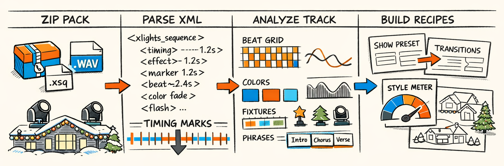
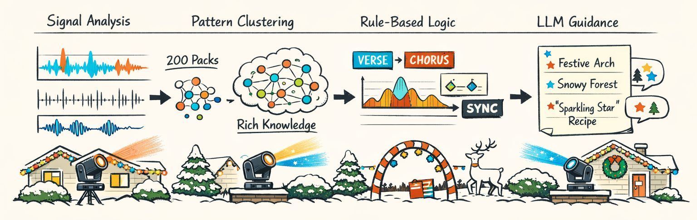
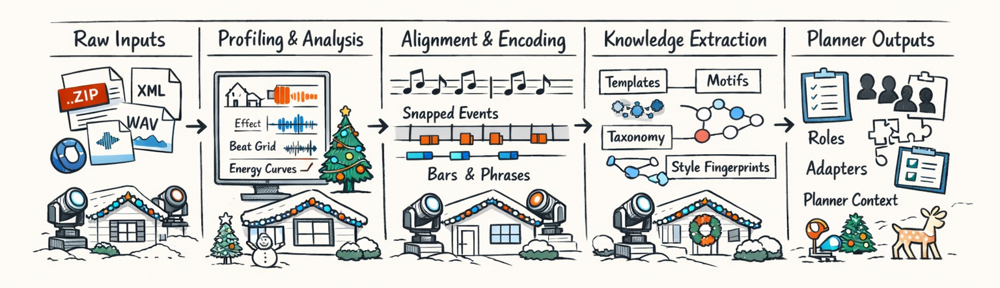
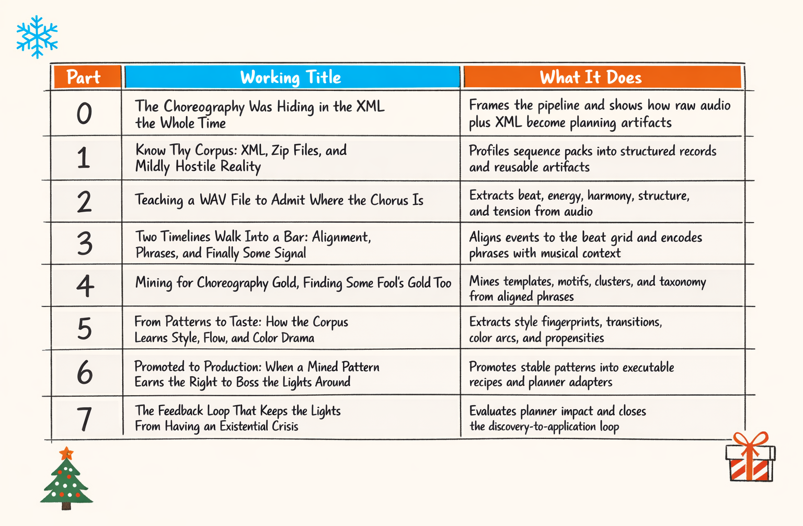
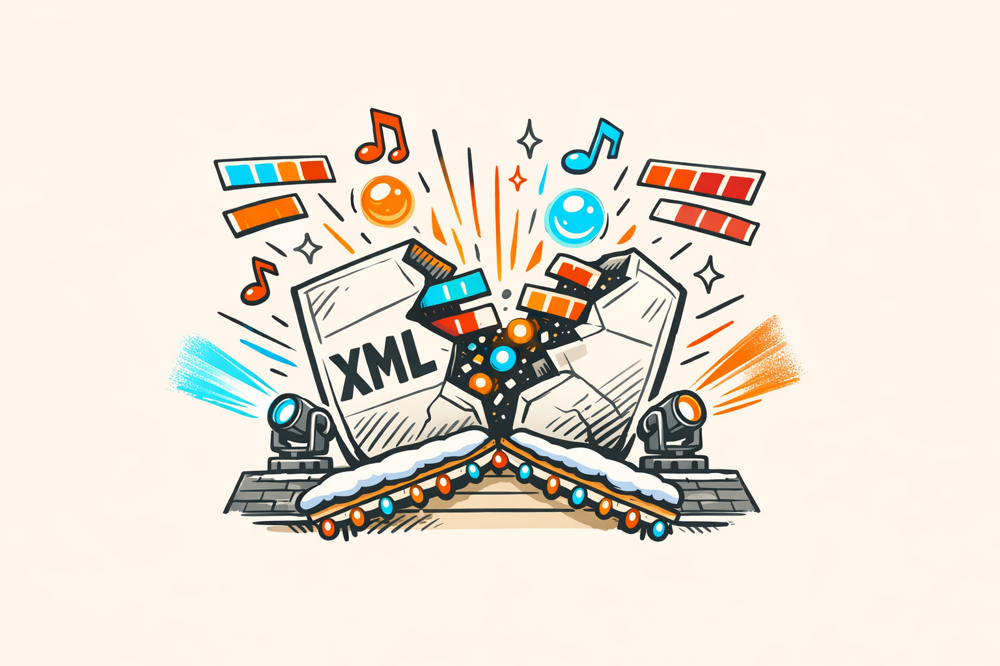

### Part 0: The Choreography Was Hiding in the XML the Whole Time

---
title: "The Choreography Was Hiding in the XML the Whole Time"
series: "The Feature Engineering Pipeline: Teaching Machines to Read Light Shows"
part: 0
tags: [ai, llm, python, christmas-lights, xlights]
---



# The Choreography Was Hiding in the XML the Whole Time

Here's the weird premise we backed ourselves into: a lot of the intelligence we wanted from an AI choreographer was already sitting there in human-made Christmas light shows.

Not in a nice clean dataset, obviously. That would've been too kind.

It was buried in xLights sequence files, layout XML, timing tracks, effect placements, audio files, palette settings, and a truly impressive amount of naming chaos. Human designers can open one of these packs and instantly see intent. They can tell where the chorus hits, which fixtures are supposed to carry the emotional weight, and when a designer is clearly saying, "Okay, now everybody sweep left and be dramatic."

A machine sees tags and timestamps.

That's the whole problem.

An xLights sequence is a little like sheet music for lights. Humans don't just read the notes; they infer phrasing, emphasis, repetition, tension, release, taste. The file contains all of that *indirectly*. But "indirectly" is doing a lot of work here. To software, a great musical moment and a deeply questionable one can both look like a pile of effect placements with start and end times.

So before any planner gets to be clever, we have to teach the machine how to read the score.

That's what feature engineering is in twinklr. Not a preprocessing checklist. Not a boring data-janitor phase we rush through to get to the "real AI." It's the part where we extract choreographic knowledge from XML and audio and turn it into artifacts a planner can actually use.

And no, we didn't train some giant end-to-end model on internet-scale lighting data, because we live on Earth and not in a research fantasy novel. We have hundreds of shows, not millions. So we got opinionated instead.

## Two Raw Materials, One Very Opinionated Pipeline

`twinklr` starts with two raw materials:

- the **audio**
- the **existing sequence pack**

That sounds simple right up until you actually inspect either one.

The audio gives us musical structure: tempo, beats, bars, sections, energy ramps, harmonic movement, spectral brightness, all the stuff that explains *why* a moment feels big or delicate or like the song is about to launch into a chorus whether you want it to or not.

The sequence pack gives us human design choices: what fixtures were used, which groups moved together, what effect types showed up at phrase boundaries, how color palettes changed over time, where designers liked to stack motion with dimming, and which patterns repeated often enough to count as actual choreography instead of random enthusiasm.

Those are different jobs, so they need different kinds of feature engineering.

Audio analysis is mostly about turning a raw waveform into a timeline with structure. Sequence analysis is about turning XML and effect placements into evidence of human intent. One side tells us what the music is doing. The other tells us how experienced humans responded to it.

The pipeline in `packages/twinklr/core/feature_engineering/pipeline.py` exists to bridge those worlds.

Not just "process inputs." Bridge them.

Because the planner doesn't want a WAV file and an `.xsq`. It wants things like phrase descriptors, transition graphs, reusable recipes, style fingerprints, and context it can reason over without pretending to be a DAW, an XML parser, and a lighting designer all at once.

We'll keep bouncing between those two worlds for the next several parts. In Part 3, they finally start agreeing on what time it is, which was harder than it sounds and, in retrospect, funnier than it had any right to be.


## Why We Didn't Just Throw Deep Learning at It and Go Home

Look, we considered it.

Any time you say "we have structured files, paired media, and a generation problem," some part of your brain starts whispering *transformer*. That's normal. It's also how you end up six weeks deep in experiments that produce extremely confident nonsense.

Our corpus is useful, but it's not deep-learning-scale. We're working with roughly 200 sequence packs. That's enough to mine patterns, estimate distributions, and build a pretty decent knowledge base. It is not enough to casually train a giant model that learns choreography end to end without overfitting to a handful of very enthusiastic designers and their favorite sweep effect.

And this domain is packed with priors. Strong ones.

Music already comes with structure: beats, bars, phrases, sections, harmonic tension, changes in density, builds, drops. Lighting design has conventions too: downbeats often get accents, choruses open up spatially, moving heads on rooflines behave differently from matrices, and a dimmer ramp means something different when it's paired with a pan sweep than when it's paired with a color snap.

So feature engineering wasn't the fallback plan. It was the practical plan when data is sparse and domain knowledge is rich.

A lot of the pipeline lives on a spectrum:

- **signal-processing features**: things we can measure directly from audio, like RMS energy, onset strength, spectral centroid, beat positions
- **ML-derived features**: clustering, embeddings, novelty scores, statistical grouping, similarity search
- **knowledge-encoded features**: fixture semantics, effect taxonomies, phrase heuristics, transition rules, spatial relationships from layout metadata
- **LLM-interpreted features**: places where language models help summarize, classify, or generalize mined patterns into planner-usable concepts

That mix matters. Some things are just math. Some things need domain rules. Some things are fuzzy enough that an LLM is actually helpful, provided you don't let it freestyle too close to production.

The codebase reflects that philosophy pretty directly. On the audio side, `packages/twinklr/core/audio/analyzer.py` orchestrates a stack that includes beat detection, section detection, harmonic analysis, energy curves, spectral features, and timeline exports. Some of those are straight DSP. Some are adaptive heuristics. For example, energy isn't just one curve; `extract_smoothed_energy()` in `packages/twinklr/core/audio/energy/multiscale.py` computes beat-level, phrase-level, and section-level views because the same song behaves differently depending on the time scale you're asking about.

And the detectors got annoyingly context-aware because the naive versions were bad. `detect_builds_and_drops()` in `packages/twinklr/core/audio/energy/builds_drops.py` first classifies the song's energy profile before deciding what even counts as a build. Which sounds fancy until you realize it was born from a humiliating bug class: ballads kept getting analyzed like they were EDM, and the resulting "drop detection" had all the musical sensitivity of a falling cinder block.

On the sequence side, we lean hard on explicit structure. `SequencePackProfiler` in `packages/twinklr/core/profiling/profiler.py` ingests zip packs, parses xLights sequences, extracts effect events, computes statistics, profiles layouts, and writes artifacts. Then `enrich_events()` in `packages/twinklr/core/profiling/enrich.py` joins those events with layout context so "effect on target X" becomes something more like "movement effect on a left-roof moving head group with this spatial footprint."

That last step is huge. Because choreography isn't just *when* something happened. It's *what* moved, *where* it lived in the display, and *how* it related to everything around it.

So no, we didn't just throw deep learning at it and go home.

We built a feature pipeline with opinions.

And honestly, that was the first adult decision we made in this project.



## The Pipeline at 10,000 Feet, Before We Dive Face-First Into It

The easiest way to understand this stack is to think in artifacts, not models.

Each stage takes some messy input, extracts structure, and emits something concrete the next stage can use. That sounds obvious, but it saved us from building one giant, mystical "understanding engine" that would've been impossible to debug and even harder to trust.

At a high level, the pipeline looks like this:

1. **Profiling** turns a raw sequence pack into structured records about layout, effects, palettes, timing tracks, and metadata.
2. **Audio extraction** turns the song into beats, sections, energy curves, harmonic context, and a unified timeline.
3. **Temporal alignment** gets the sequence timeline and the audio timeline to agree on phrase boundaries and local musical context.
4. **Phrase encoding** compresses windows of choreography into machine-comparable representations.
5. **Pattern mining** finds recurrent stacks, transitions, and reusable motifs across the corpus.
6. **Knowledge extraction** summarizes those patterns into taxonomies, fingerprints, propensities, and planner context.
7. **Recipe promotion** takes the patterns that survived contact with reality and promotes them into reusable planning recipes.

That's the elegant version.

The lived version involved a lot of, "Why does this pack think the song title is the filename but only after replacing spaces with underscores?" and "Why are there 14 timing tracks and none of them agree?" But the artifact model held up.

A simplified sketch of the orchestration looks a lot like this:

```python
def run_feature_pipeline(pack_zip: Path, audio_file: Path) -> dict:
    # 1) Sequence pack -> profile artifacts
    profile = SequencePackProfiler().profile_pack(pack_zip)

    # 2) Audio -> musical timeline
    audio = AudioAnalyzer(app_config, job_config).analyze(str(audio_file))

    # 3) Sequence time <-> audio time
    alignment = AlignmentEngine().align(profile=profile, audio_features=audio)

    # 4) Encode phrase-sized chunks of choreography
    phrases = encode_phrases(profile=profile, alignment=alignment, audio=audio)

    # 5) Mine repeated structures across the corpus
    mined = TemplateMiner().mine(phrases)

    # 6) Promote stable patterns into recipes the planner can reuse
    recipes = RecipePromotionEngine().promote(mined)

    return {
        "profile": profile,
        "audio": audio,
        "alignment": alignment,
        "phrases": phrases,
        "mined": mined,
        "recipes": recipes,
    }
```

The real code is split across modules, checkpointed, and less polite than that. But conceptually, that's it.

Some of those components are already visible in the source tree:

```python
# Representative entry points and key modules we keep coming back to
from twinklr.core.profiling.profiler import SequencePackProfiler
from twinklr.core.audio.analyzer import AudioAnalyzer
from twinklr.core.feature_engineering.alignment.engine import AlignmentEngine
from twinklr.core.feature_engineering.templates.miner import TemplateMiner
from twinklr.core.feature_engineering.recipes.promotion import RecipePromotionEngine
```

The important part is what each stage *produces*.

Profiling gives us structured pack artifacts and profile-level metadata we can store and reason over. Audio extraction gives us timelines and per-song musical descriptors. Alignment gives us shared temporal anchors. Phrase encoding gives us comparable units. Mining gives us recurring patterns. Knowledge extraction turns those into planner-facing abstractions. Promotion gives us recipes we trust enough to let near generation.

Not one giant model. A chain of receipts.

That also gives the series its shape. Part 1 is the corpus and profiling mess. Part 2 is audio. Part 3 is alignment and phrase construction. Part 4 is mining. Part 5 is style and knowledge extraction. Part 6 is recipe promotion. Part 7 is the feedback loop where we try to prove we aren't hallucinating choreography.

Or, more honestly, where we discover which parts are still hallucinating.



## Discovery, Evaluation, Refinement, Repeat Until the Lights Stop Looking Confused

Here's the part I wish more technical writeups admitted: we did not sit down, derive the correct feature set from first principles, and then gracefully implement it.

Absolutely not.

The real process was more like:

- discover a plausible signal
- build an extractor
- test it on a bunch of packs
- realize it only works on three songs and one of them is lying
- refine thresholds, representations, or grouping logic
- run it again
- decide whether the feature actually helps downstream planning
- keep it, adapt it, or kill it with prejudice

That meta-process matters as much as the features themselves.

Because a feature can be statistically cute and still useless in planning. We had several of those. Things that looked fantastic in notebooks and then contributed exactly nothing once the planner had to choose a real lighting move for a real phrase in a real song. That's when your "promising signal" becomes what it truly is: decorative math.

So this series isn't just "here are the features." It's "here's how we learned which ones earned the right to exist."

A few themes keep coming up:

- **adaptive thresholds** beat global ones more often than not
- **genre presets** are sometimes a hack and sometimes just honesty
- **cross-pack stability** matters more than looking clever on one gorgeous demo sequence
- **planner usefulness** is the final exam

That last one is brutal in a healthy way. If a feature doesn't improve pattern mining, recipe selection, transition quality, or planner confidence, it probably doesn't belong in the stack no matter how academically interesting it sounds.

We'll make that feedback loop explicit in Part 7, because eventually the planner starts telling us which upstream features are helping and which ones are just burning CPU while pretending to be insightful.

And yes, several stages in this pipeline exist only because earlier ideas failed in ways that were too educational to ignore.

## The Roadmap, With Just Enough Foreshadowing to Be Dangerous

So here's where this goes.

Part 0 is this post: the premise, the pipeline, and the claim that the choreography is already in the corpus if we can learn to read it.

Part 1 gets into the corpus itself — zip packs, xLights files, layout metadata, and the mildly hostile reality of trying to turn designer exports into clean artifacts.

Part 2 is the audio side: beat grids, sections, energy, harmony, and the long process of convincing a WAV file to admit where the chorus is.

Part 3 is where the two timelines finally meet: alignment, phrase construction, and the first genuinely useful cross-modal features.

Part 4 is taxonomy and mining: repeated patterns, phrase families, transition motifs, and our ongoing battle with fool's gold.

Part 5 is style: fingerprints, propensities, color drama, and the weirdly difficult task of representing taste without flattening it into mush.

Part 6 is recipes: the moment mined patterns either earn promotion into reusable planner assets or get sent back to the mines.

Part 7 is evaluation and feedback: the loop that tells us what to keep, what to tune, and what to quietly delete before it embarrasses us again.

Here's the roadmap in one place:



By the end of all that, the output isn't "features" in the abstract. It's a knowledge base the planner can actually use: recipes, transition graphs, phrase descriptors, style fingerprints, and context grounded in both music and real human-made shows.

That's the goal, anyway.

We *think* we figured out enough of the reading problem to make planning possible.

But I should be honest: several of these stages only exist because the earlier versions failed in entertaining ways. Which is great news for the rest of the series, because nothing improves a technical explanation quite like a backlog full of bad ideas with timestamps.



---

## About twinklr


twinklr is our ongoing science experiment in weaponizing holiday cheer. It's an AI-driven choreography and composition engine that takes an audio file and spits out fully synchronized sequences for Christmas light displays in xLights — because apparently we looked at a normal, peaceful hobby and thought, "What if we added AI, machine learning and sleepless nights?"

Here's the honest disclaimer: we're not professional lighting designers. We're developers, engineers, and AI researchers who spend our days building at the frontier of AI… and our nights obsessing over why a dimmer curve feels "late" by half a beat and whether a roofline sweep should be dramatic or merely aggressively festive. If you're expecting polished stage-production wisdom, you're in the wrong place. If you're into nerdy overengineering, mildly unhinged experimentation, and the occasional "how did that even work?" moment — welcome.

This blog is the running log of our journey: the wins, the faceplants, the weird breakthroughs, and the lessons learned the hard way (often repeatedly). We'll share what we're building, what breaks, and why certain architectural decisions matter — especially when the goal is to turn "song" into "show" without the lights looking like they're having an existential crisis.

If you want to learn alongside us — or jump in and contribute — come say hi on GitHub: https://github.com/bluewatersql/twinklr/tree/main
---