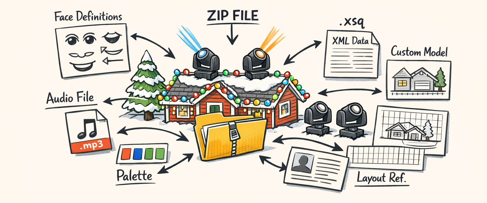
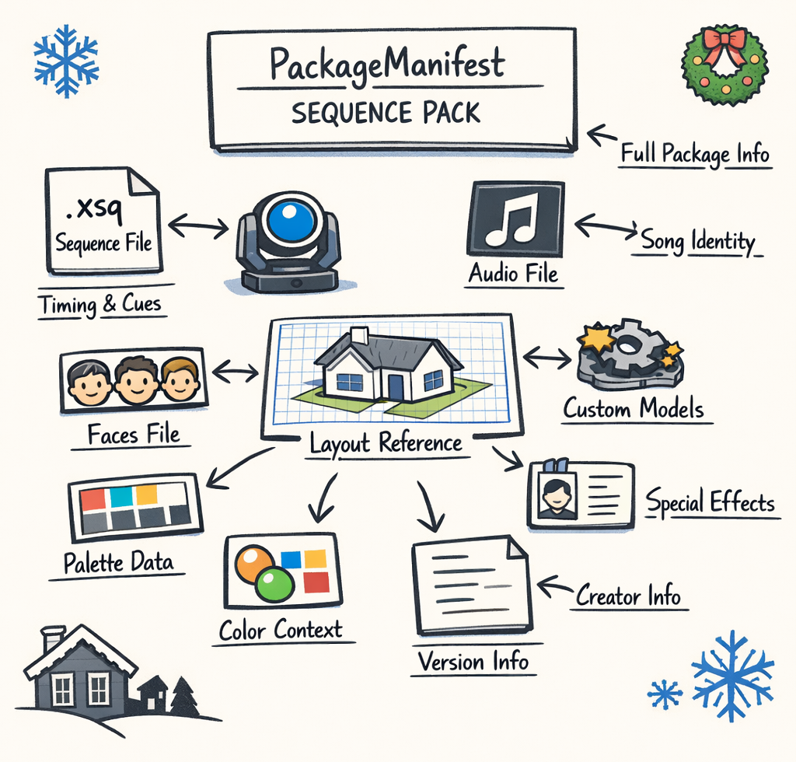
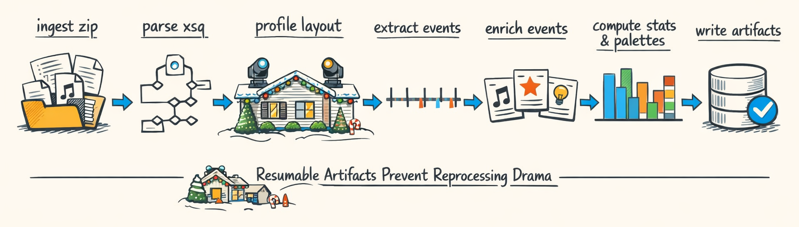
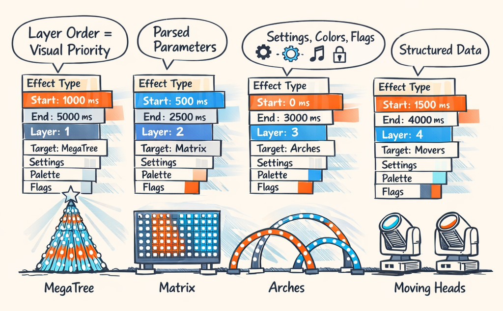
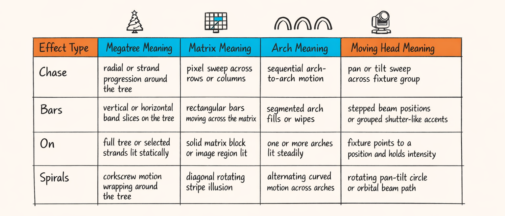

# Know Thy Corpus: XML, Zip Files, and Mildly Hostile Reality

Part 0 was the philosophical version of this story. The “maybe choreography knowledge is already in the data” version. The version where we sounded smart and optimistic and conveniently hadn’t yet spent a Saturday opening a pile of sequence packs that looked like they were assembled by raccoons with access to xLights.

This is where it gets real.

Because before you can mine patterns from human-made Christmas light shows, before you can align them to audio, before you can ask an LLM to do anything remotely tasteful, you have to answer the oldest and least glamorous question in engineering:

What, exactly, is in these files?

And the answer is not “an `.xsq`.”

That was our first wrong assumption.

The natural unit of analysis isn’t a single sequence file. It’s the whole pack: the ZIP archive, the sequence, the media reference, layout context, custom models, faces, version metadata, and whatever other little surprises somebody exported at 1:30 AM while trying to get a singing tree to stop blinking like it had seen God.

So this post is about the first concrete stage of the pipeline: turning hidden, implied, scattered knowledge into structured records we can actually trust. Or at least trust enough to hand to the next stage without immediately regretting it.

We’ll get to audio in Part 2, alignment in Part 3, and the fun pattern-mining stuff in Part 4. But none of that works if your ingestion layer thinks a pack is “just XML plus vibes.”

## The Weekend We Opened a Folder of Zip Files and Regretted Everything

The first corpus pass looked easy on paper. We had a folder full of xLights exports. We figured we’d unzip them, parse the `.xsq`, count some effects, and move on with our lives.

That lasted maybe an hour.


Here’s what actually shows up in the wild: ZIP archives with one or more sequence files, media references that may or may not exist, custom model definitions, face definitions for singing props, layout files, and enough naming inconsistency to make a schema cry quietly in the corner.

Some packs were tidy. Some were “exported from a machine that definitely knew what it was doing.” And some looked like digital yard sales.

The important realization was this: an individual `.xsq` only tells part of the story. It contains effect placements, yes, but the meaning of those placements depends heavily on the associated layout and supporting files. A `Chase` on a megatree is not the same thing as a `Chase` on a row of moving heads. Same label. Totally different visual intent. More on that little landmine later.

So the sequence pack became the analysis unit.

Not because it’s elegant, but because reality forced our hand.

And that’s really the theme of this whole stage. In Part 0 we talked about hidden choreographic knowledge. This is the point where “hidden” stops being poetic and starts meaning “buried across XML files inside ZIP archives with missing references and weird defaults.”

Mildly hostile reality. Great teacher. Terrible coworker.

## What’s Actually in a Sequence Pack?

A sequence pack is basically the minimum bundle needed to understand what the author meant, not just what xLights happened to save in one file.

At a high level, we care about a few recurring pieces:

- the `.xsq` sequence itself
- the media file or media reference
- layout context, usually via `xlights_rgbeffects.xml`
- custom models
- face definitions for singing props
- package-level metadata like song, artist, creator, version, and hashes

If you only parse the sequence file, you get placements. If you parse the pack, you get meaning.



In lighting terms, here’s why each piece matters.

The `.xsq` gives you the timeline: which effect type was placed, on what target, on which layer, from what start time to what end time, plus raw effect settings. That’s the skeleton.

The media file gives you the song identity and, later, the bridge into audio analysis. Even when the audio isn’t embedded in the pack, the reference matters because we’ll use it in Part 2 when we start asking the WAV file where the chorus actually is.

The layout file gives you the stage — except in our case the “stage” is a roofline, yard props, arches, matrices, megatrees, and moving heads mounted on structures that are definitely not trusses because this is holiday lighting, not a touring rig.

Custom models and face definitions matter because xLights lets people create very specific props and semantic groupings. A face track isn’t just decoration if you’re trying to understand why certain timing and effect choices cluster around vocals.

We wrap the package-level metadata in `PackageManifest`, which is the thing that stops the rest of the pipeline from having to infer basic facts from filenames like `final_REAL_final_v3_USE_THIS.zip`.

A simplified version looks like this:

```python
class PackageManifest(BaseModel):
    package_id: str
    zip_path: str
    zip_sha256: str
    sequence_files: tuple[str, ...]
    media_files: tuple[str, ...]
    song: str | None = None
    artist: str | None = None
    creator: str | None = None
    xlights_version: str | None = None
```

That wrapper sounds boring. It is boring.

It’s also the difference between a corpus you can reason about and a folder of artisanal chaos.

## SequencePackProfiler: The Part That Turns Chaos Into Records

Once we stopped pretending a pack was “just a sequence file,” the orchestration got much clearer. We needed one top-level thing whose whole job was: ingest the ZIP, extract the bits we care about, join them with layout context, compute a few practical summaries, and persist artifacts so a crash doesn’t send us back to the start like some cruel roguelike.

That’s `SequencePackProfiler`.

Its constructor tells the story pretty well:

```python
class SequencePackProfiler:
    def __init__(
        self,
        *,
        layout_profiler: LayoutProfiler | None = None,
        xsq_parser: XSQParser | None = None,
        artifact_writer: ProfileArtifactWriter | None = None,
        store: FeatureStoreProviderSync | None = None,
    ) -> None:
        self._layout_profiler = layout_profiler or LayoutProfiler()
        self._xsq_parser = xsq_parser or XSQParser()
        self._artifact_writer = artifact_writer or ProfileArtifactWriter()
        self._store = store or NullFeatureStore()
```

It doesn’t do one clever trick. It does a bunch of necessary ones in order.



The rough pipeline looks like this:

1. `ingest_zip()` unpacks the archive and identifies candidate files.
2. `XSQParser` parses the sequence content.
3. `LayoutProfiler.profile()` parses `xlights_rgbeffects.xml` when it’s available.
4. `extract_effect_events()` turns placements into normalized event records.
5. `enrich_events()` attaches layout and target context.
6. `compute_effect_statistics()` calculates useful aggregates.
7. `parse_color_palettes()` extracts palette information.
8. `build_asset_inventory()` records pack contents and lineage.
9. `ProfileArtifactWriter` persists the outputs.
10. `ProfileRecord` gets updated in the feature store so later stages know where things stand.

The point isn’t elegance. The point is resumability.

Because the first time you process a few hundred packs, something *will* go wrong. A malformed file. A missing layout. A weird effect config. A ZIP with duplicate names. A parser edge case from some xLights version you haven’t seen before. If every run is all-or-nothing, you will spend your evenings reprocessing 198 good packs because pack 199 contained a delightful little XML surprise.

Here’s the shape of the orchestration in practice:

```python
def profile_pack(zip_path: Path) -> SequencePackProfile:
    manifest = ingest_zip(zip_path)               # unpack and fingerprint source files
    sequence = self._xsq_parser.parse(manifest.xsq_path)

    layout_profile = None
    if manifest.layout_xml_path:
        layout_profile = self._layout_profiler.profile(manifest.layout_xml_path)

    events = extract_effect_events(sequence)
    enriched = enrich_events(events, layout_profile)

    stats = compute_effect_statistics(events)
    palettes = parse_color_palettes(events)
    inventory = build_asset_inventory(manifest)

    profile = SequencePackProfile(
        manifest=manifest,
        layout=layout_profile,
        events=enriched,
        effect_statistics=stats,
        palettes=palettes,
        inventory=inventory,
    )

    self._artifact_writer.write(profile)
    return profile
```

A few details matter here.

First, layout profiling is optional in code but not optional in spirit. We can survive without it, but the usefulness of the result drops fast.

Second, artifacts are written as we go because persisted intermediate outputs make the whole system boring in the best possible way. If the process dies after event extraction, we shouldn’t have to unzip and parse everything again just to get back to where we were.

Third, this stage is intentionally dumb about taste. It’s not trying to decide whether a pattern is good. It’s just trying to produce trustworthy records. In this phase, boring is a feature.

We’ve had enough exciting failures elsewhere.

## Effect Events: The Atomic Unit With More Baggage Than It Looks

Once a sequence is parsed, the next thing we need is a consistent atomic unit. For us, that’s the effect event.

An effect event is one placement of one effect on one target over one time interval on one layer, with whatever settings xLights attached to it. Sounds simple. It is not simple.

Because the event has to carry enough baggage that later stages can mine it without reopening the original XML every five minutes.



The base record lives in `events`, and the enriched version shows up in `profile`. The fields that actually matter look roughly like this:

```python
class EffectEventRecord(BaseModel):
    effect_event_id: str
    target_name: str
    layer_index: int
    layer_name: str | None = None
    effect_type: str
    start_ms: int
    end_ms: int
    config_fingerprint: str | None = None
    effectdb_ref: str | None = None
    effectdb_settings_raw: str | None = None
    effectdb_params: dict[str, Any] | None = None
    palette: dict[str, Any] | None = None
    protected: bool = False
    label: str | None = None
```

And then enrichment adds the stuff that turns “placement” into “something we can reason about”:

```python
class EnrichedEventRecord(BaseModel):
    effect_event_id: str
    target_name: str
    target_kind: TargetKind
    target_semantic_tags: tuple[str, ...] = ()
    target_category: str | None = None
    group_memberships: tuple[str, ...] = ()
    start_ms: int
    end_ms: int
    feat_duration_ms: int
    layer_index: int
    effect_type: str
    effectdb_params: dict[str, Any] | None = None
    palette: dict[str, Any] | None = None
    bbox_x0: float | None = None
    bbox_y0: float | None = None
```

A few of these fields are sneakily important.

`layer_index` isn’t administrative trivia. In xLights, layer order often encodes visual priority. A wipe on a lower layer with a sparkle overlay above it is not the same as the reverse. If you flatten layers too early, you destroy the compositional intent and then later wonder why your mined “patterns” feel like somebody shuffled the deck.

`effectdb_settings_raw` and parsed `effectdb_params` matter because effect names are crude buckets. Two `Bars` effects can behave wildly differently depending on direction, count, mirroring, speed, palette mode, and assorted toggles that live down in effect settings. If you don’t carry those through, later synthesis has to guess. And guessing from a label alone is how you get output that is technically legal and aesthetically cursed.

`protected` matters too. xLights authors use protection flags for a reason. Sometimes it’s because a section is precious. Sometimes it’s because they were trying to stop themselves from accidentally wrecking a complicated passage. Either way, it’s signal.

The real twist, though, is that an event is only minimally useful until you attach layout context. `target_name="MH_Left_01"` tells you almost nothing by itself. Is it a moving head? A group? A custom prop? A submodel? Just a very optimistic arch name? You need the layout to answer that.

So yes, the atomic unit is an event.

But it’s an event with a backpack full of context, because otherwise the downstream miners are basically reading choreography through a keyhole.

## Why a Chase Is Not a Chase Is Not a Chase

This was one of the first places the corpus humbled us.

At first glance, effect labels look tempting. You think: great, we’ll mine all the `Chase` events, cluster them, learn usage patterns, done by lunch.

Absolutely not.

A `Chase` means different things depending on what it’s targeting. On a megatree, it might read as rotational motion or wrapped strands stepping around the cone. On a matrix, it might look like directional travel across a 2D grid. On arches, it’s often sequential travel along neighboring props. On moving heads, it can become a fixture-to-fixture sweep or alternating beam progression in physical space.

Same label. Different visual semantics. Same problem shows up with `Bars`, `On`, `Spirals`, and a bunch of other effect families.

So we needed layout-aware enrichment to bridge that semantic gap. That’s where `LayoutProfiler` and `enrich_events()` earn their keep.

`LayoutProfiler` parses the layout XML, classifies model categories, extracts groups, and computes spatial statistics. It doesn’t just say “there are models.” It says things like: these are arches, those are matrices, these fixtures are DMX moving heads, this group spans the roofline, these models form a chain, and these targets sit in these approximate positions.

Then `enrich_events()` joins event records with that context. It attaches target kind, category, semantic tags, group membership, and simple spatial bounds so later stages can ask better questions than “how many Chases are there?”

The better question is “what kind of Chase, on what physical family, in what spatial arrangement, during what musical context?”

That’s a much more annoying question.

It’s also the useful one.



This was the first big corpus lesson for us: effect labels are too ambiguous to mine safely without layout context.

If you skip enrichment, your pattern miner will happily group together things that share a spelling and almost nothing else. Which is how you end up “discovering” fake motifs that vanish the second you look at an actual rendered show.

The XML isn’t lying, exactly.

It’s just leaving out the part you actually needed.

## The Feature Store: Because Reprocessing 200 Packs for One New Zip Is How You Lose Friends

At some point every data pipeline has to choose between being incremental or being a lifestyle problem.

We chose incremental.

Once a pack is profiled, we persist both the rich artifacts and a compact tracking record in the feature store. The shared model for that lives in `ProfileRecord`.

The fields are exactly the sort of thing you want when a batch job fails at 2 AM and you need to know what happened without becoming a forensic archaeologist:

```python
class ProfileRecord(BaseModel):
    profile_id: str
    package_id: str
    sequence_file_id: str
    profile_path: str
    zip_sha256: str | None = None
    sequence_sha256: str | None = None
    song: str | None = None
    artist: str | None = None
    duration_ms: int | None = None
    effect_total_events: int | None = None
    schema_version: str
    fe_status: Literal["pending", "complete", "error"] = "pending"
    fe_error: str | None = None
```

That `fe_status` lifecycle matters more than it looks. New profile lands? `pending`. Downstream feature engineering succeeds? `complete`. Something blows up in extraction or enrichment? `error`, with a message attached so we can fix the issue instead of squinting at logs and making up folklore.

This persistence layer is the reason we can add one new ZIP without reprocessing the whole corpus, and the reason later parts of the series can build on stable artifacts instead of reparsing raw exports every time. Part 3’s alignment logic, Part 4’s pattern mining, and Part 5’s style modeling all assume this substrate exists and is trustworthy.

Because if your corpus layer is flaky, every “smart” stage above it is just doing parkour on a swamp.

And we’ve tried that version.

It was bad.

---

## About twinklr


twinklr is our ongoing science experiment in weaponizing holiday cheer. It’s an AI-driven choreography and composition engine that takes an audio file and spits out fully synchronized sequences for Christmas light displays in xLights — because apparently we looked at a normal, peaceful hobby and thought, “What if we added AI, machine learning, and sleepless nights?”

Here’s the honest disclaimer: we’re not professional lighting designers. We’re developers, engineers, and AI researchers who spend our days building at the frontier of AI… and our nights obsessing over why a dimmer curve feels “late” by half a beat and whether a roofline sweep should be dramatic or merely aggressively festive. If you’re expecting polished stage-production wisdom, you’re in the wrong place. If you’re into nerdy overengineering, mildly unhinged experimentation, and the occasional “how did that even work?” moment — welcome.

This blog is the running log of our journey: the wins, the faceplants, the weird breakthroughs, and the lessons learned the hard way, often repeatedly. We’ll share what we’re building, what breaks, and why certain architectural decisions matter — especially when the goal is to turn “song” into “show” without the lights looking like they’re having an existential crisis.

If you want to learn alongside us — or jump in and contribute — come say hi on GitHub: https://github.com/bluewatersql/twinklr/tree/main

---
