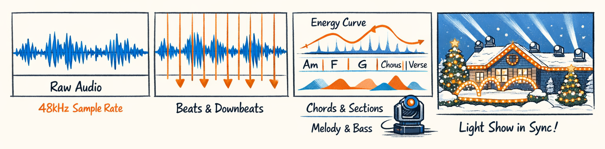
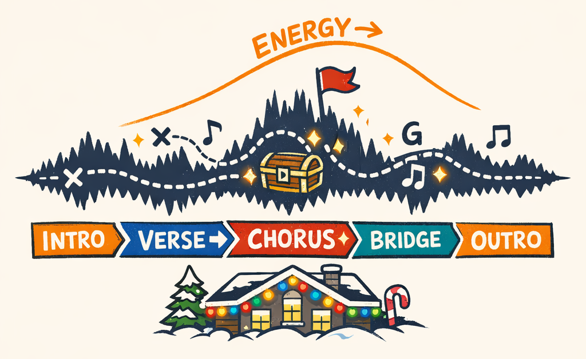
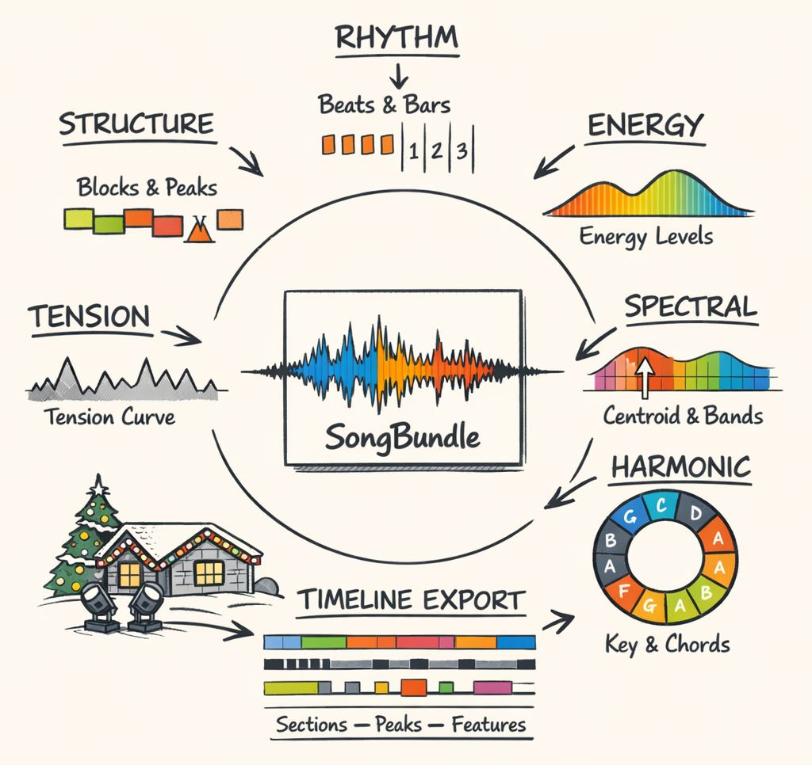
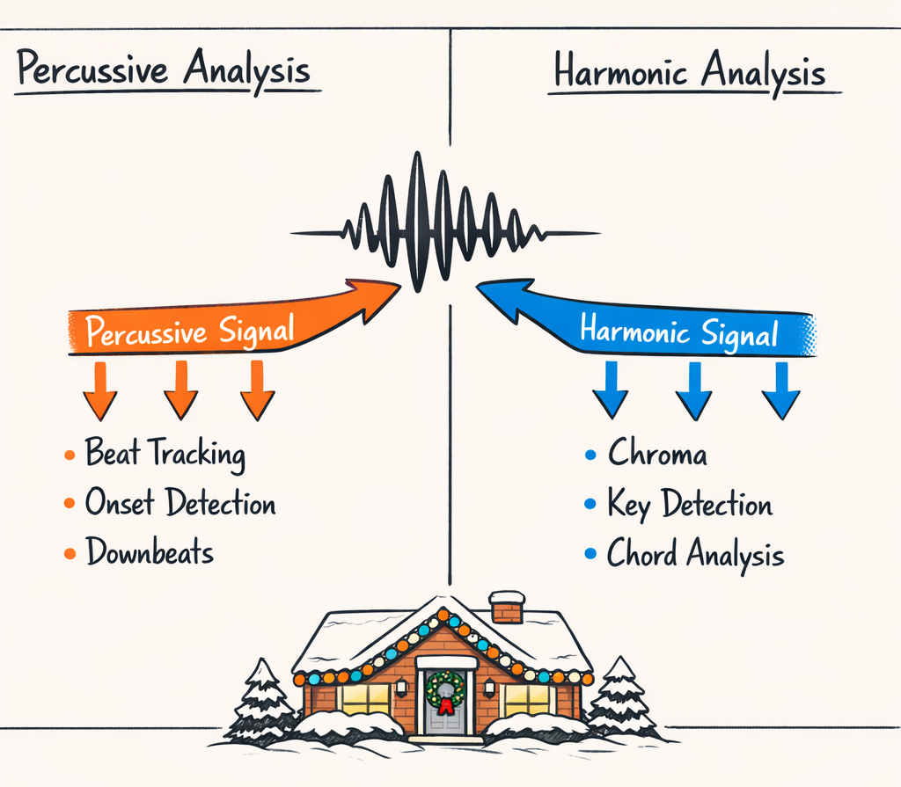
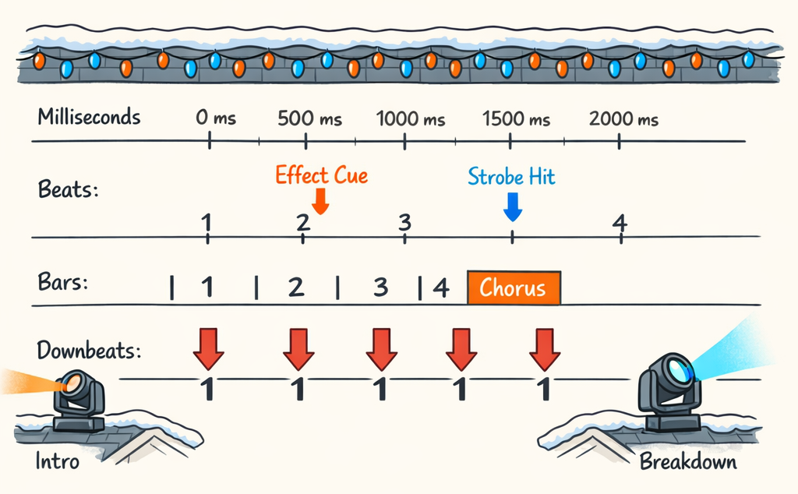
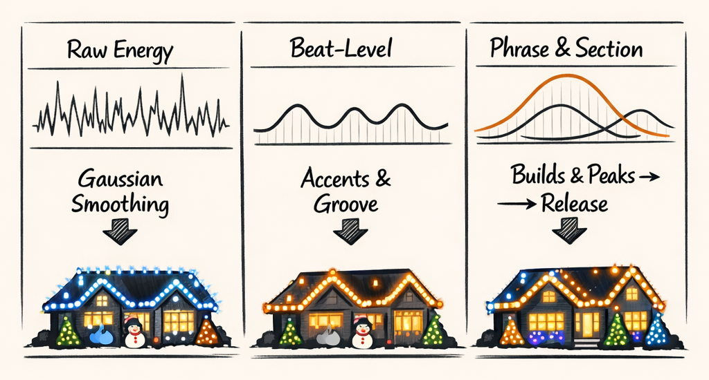
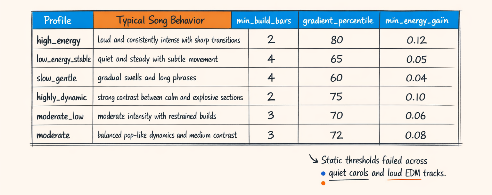
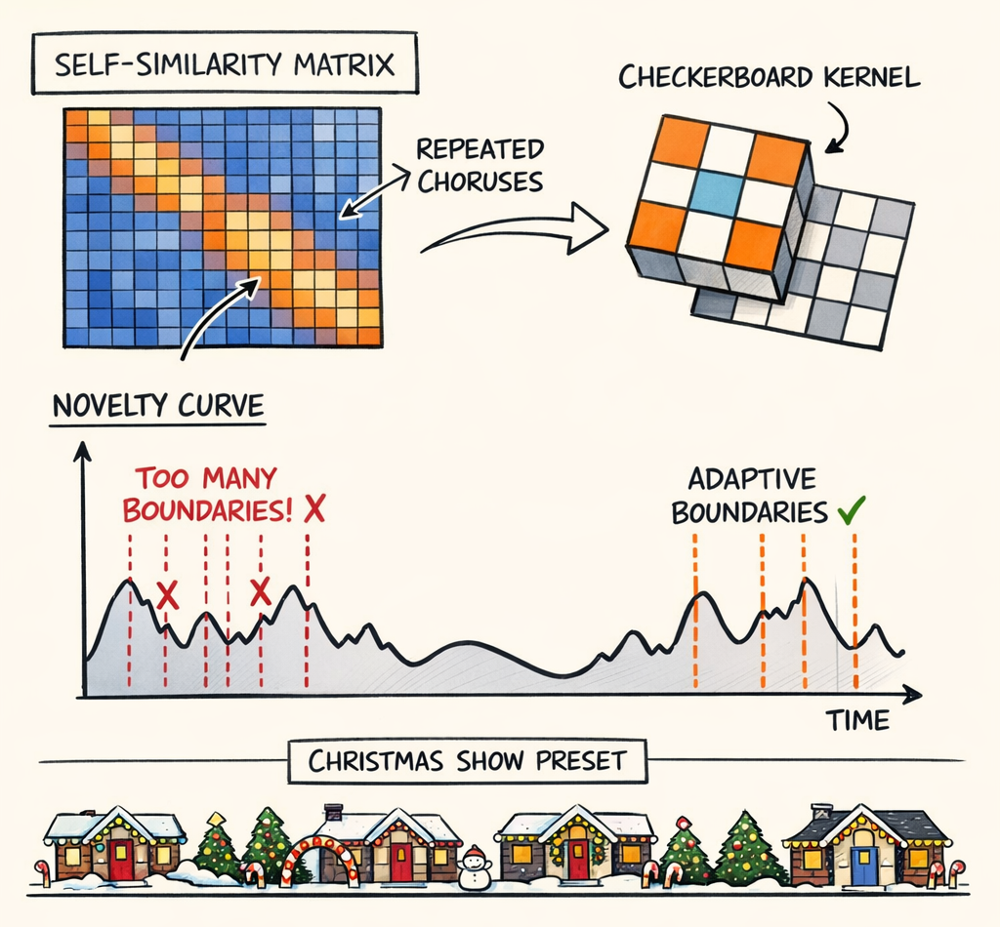

### Part 2: Teaching a WAV File to Admit Where the Chorus Is

---
title: "Teaching a WAV File to Admit Where the Chorus Is"
series: "The Feature Engineering Pipeline: Teaching Machines to Read Light Shows"
part: 2
tags: [ai, llm, python, christmas-lights, xlights]
---



# Teaching a WAV File to Admit Where the Chorus Is

By the end of Part 1, we had sequence packs cracked open, XML parsed, fixture layouts profiled, and effect events enriched with enough context to stop treating xLights files like cursed zip-based archaeology.

That gave us one half of the problem.

The other half was the song.

And here's the stupidly hard part: a raw audio file does not contain a field called `chorus_start_ms`. It does not politely annotate the build, the drop, the mood shift, the key change, or the moment where every human in the neighborhood will instinctively expect the roofline to do something dramatic.

It just sits there. Being 44,100 numbers per second.

Our job is to turn that pile of samples into something a choreography engine can reason about. Not "understand music" in the philosophical sense. We're not trying to make the machine cry during *O Holy Night*. We just need reliable proxies for the things human choreographers react to: pulse, loudness, density, harmonic mood, repeated sections, tension, release.

So this part is the audio side of the pipeline: the feature extraction stack that takes a WAV or MP3 and turns it into a structured `SongBundle` we can actually use downstream.

Some of it worked on the first pass.

Some of it absolutely did not.

And one part spent about three weeks insisting that a two-minute Christmas song had roughly fifty-seven structural boundaries, which is a fun theory if your target audience is squirrels.

## 44,100 Numbers Per Second and Somehow We Need a Light Show

A PCM waveform is brutally honest and almost completely unhelpful.

At any instant, it's just amplitude over time. Useful if you're building an audio player. Less useful if you're trying to answer questions like:

- Where does the chorus hit?
- Is this section building tension or releasing it?
- Did the harmony just go darker?
- Is the track dense and bright or soft and spacious?
- Should the moving heads sweep, pulse, hold, or get out of the way?

Humans answer those questions without thinking. A decent choreographer hears phrases, downbeats, transitions, repeated forms, and emotional contour. They don't hear "sample index 2,318,442 has value 0.087."

So we don't ask the audio to tell us meaning directly. We ask it for clues.

Beat tracking gives us pulse. RMS gives us energy. Spectral features tell us whether the sound is bright, noisy, bass-heavy, or in motion. Chroma and chord templates give us harmonic context. Self-similarity and novelty help us guess where sections begin and end. Then we glue all of that together into a timeline the planner can actually use.

That's the trick, really. Not one magical feature. A pile of imperfect, testable proxies.

And if Part 1 was about turning sequence files into something trustworthy, this is the matching half: teaching the song to reveal just enough structure that we can line those two worlds up later.



## AudioAnalyzer: The Assembly Line for Musical Clues

The center of the whole thing is `AudioAnalyzer`.

At a high level, `AudioAnalyzer._process_audio()` is less "one clever algorithm" and more "a suspiciously busy assembly line." We load the audio, split it into better task-specific representations, extract a bunch of feature families, validate the outputs, and package the result into a single object that downstream systems can consume without playing scavenger hunt across twelve JSON blobs.

The broad flow looks like this:

- HPSS and onset extraction
- rhythm analysis: tempo, beats, downbeats, time signature
- energy analysis: RMS at multiple scales, builds, drops, profile classification
- spectral analysis: centroid, rolloff, flatness, band energies, flux
- harmonic analysis: chroma, key, chords, pitch
- structure analysis: section segmentation and labels
- advanced composite signals: tension
- timeline export for later alignment and planning

The shape of the orchestration matters more than any one feature. We learned pretty quickly that scattering outputs into unrelated files is a great way to create accidental complexity. Every downstream step has to ask: which version of beats? which time base? which file owns structure labels?

So we centralized it in `SongBundle`.

```python
class AudioAnalyzer:
    def analyze(self, audio_path: str) -> SongBundle:
        # cache lookup omitted
        return asyncio.run(self._process_audio(audio_path))

    async def _process_audio(self, audio_path: str) -> SongBundle:
        # 1) load waveform
        # 2) derive harmonic/percussive views
        # 3) extract rhythm, energy, spectral, harmonic, structure
        # 4) compute composite signals like tension
        # 5) export a unified timeline
        # 6) validate and return one structured bundle
        ...
```

And the return shape is the whole point:

```python
SongBundle(
    timing=SongTiming(...),
    energy={...},
    spectral={...},
    harmonic={...},
    structure={...},
    tension={...},
    timeline_export={...},
    metadata=MetadataBundle(...),
)
```

That one decision paid for itself over and over. Later stages don't need to remember where `phrase_level` energy lives or whether chords were computed on the raw mix or the harmonic stem. The bundle is the contract.

Which is good, because once you start debugging section boundaries and beat drift at the same time, the last thing you need is a file-naming treasure hunt.



## Split the Song Before You Ask It Questions

One of the first actually useful rules we stumbled into was this: don't analyze the raw mix the same way for every task.

A song is a mess of overlapping information. Drums, vocals, pads, bass, strings, synths, reverb, sleigh bells, whatever chaos the producer felt like adding. Some tasks want the punchy transient stuff. Others want the sustained pitched stuff. If you feed the same representation into everything, some feature extractors will work and others will quietly set your weekend on fire.

So we use HPSS — harmonic/percussive source separation.

In `compute_hpss()` splits the waveform into two views:

- **percussive**: transient-heavy content like drums and attacks
- **harmonic**: sustained pitched content like chords, vocals, pads

That's not perfect source separation. It's more like "good enough to stop asking the wrong questions of the wrong signal."

```python
def compute_hpss(y: np.ndarray) -> tuple[np.ndarray, np.ndarray]:
    harmonic, percussive = librosa.effects.hpss(y)
    return harmonic.astype(np.float32), percussive.astype(np.float32)
```

And then downstream analysis branches accordingly.

```python
harmonic_y, percussive_y = compute_hpss(y)
onset_env = compute_onset_env(percussive_y, sr, hop_length=hop_length)

beats = compute_beats(percussive_y, sr, hop_length=hop_length)
chroma = extract_chroma(harmonic_y, sr, hop_length=hop_length)
key = detect_musical_key(chroma)
chords = detect_chords(chroma, beat_times_s=beats["beats_s"])
```

Beat tracking tends to behave better on the percussive signal because drums and attacks are where rhythmic accents usually live. Key and chord analysis prefer the harmonic side because sustained pitch content is where tonality lives. Asking the raw mix to serve both equally well is how you get muddy chroma and beat trackers that latch onto vocal phrasing like it's percussion. Which, musically, sure, sometimes. Computationally, not helpful.

This ended up becoming a recurring principle for the whole pipeline:

> Use the representation that best matches the question.

It sounds obvious now. It did not feel obvious while we were staring at chord outputs that looked like a music theory student had fallen down the stairs.



## The Beat Grid: Our Rosetta Stone for Time

If I had to pick one feature object that everything else quietly depends on, it's the beat grid.

Without a shared musical timebase, downstream logic turns into a swamp of milliseconds, frame indices, bar guesses, and `close enough` snapping. That's how you end up with effects that are technically aligned but still feel late, early, or just vaguely cursed.

So rhythm analysis does more than estimate BPM. It builds the canonical ruler we use everywhere else.

In `analyzer.py`, the rhythm stage pulls together:

- beat tracking
- tempo estimation
- tempo change detection
- downbeat detection
- time signature inference

The core calls look roughly like this:

```python
beats = compute_beats(percussive_y, sr, hop_length=hop_length)
downbeats = detect_downbeats_phase_aligned(
    beat_times_s=beats["beats_s"],
    onset_env=onset_env,
    sr=sr,
    hop_length=hop_length,
)
time_sig = detect_time_signature(
    beat_times_s=beats["beats_s"],
    downbeat_times_s=downbeats["downbeats_s"],
)
tempo_changes = detect_tempo_changes(
    onset_env=onset_env,
    sr=sr,
    hop_length=hop_length,
)
```

Those outputs get folded into `SongTiming`, which is effectively our beat grid in structured form.

```python
SongTiming(
    duration_s=duration_s,
    tempo_bpm=beats["tempo_bpm"],
    beats_s=beats["beats_s"],
    downbeats_s=downbeats["downbeats_s"],
    bars_s=downbeats["downbeats_s"],  # simplified bar anchors
    time_signature=time_sig["time_signature"],
    tempo_changes=tempo_changes["segments"],
)
```

Why be so religious about this? Because almost every later decision wants musical time, not raw wall-clock time.

A build isn't just "from 38.2s to 46.7s." It's "two bars leading into a downbeat." A chord change matters more if it lands on beat one. A lighting phrase feels intentional when it starts at a barline, not at 12,413 ms because some floating-point conversion got spicy.

We also use the beat grid as the alignment surface for features that were originally frame-based. Energy curves, spectral motion, novelty peaks — all of them become more useful once they can be summarized or referenced in beat and bar terms.

Part 3 is where this really starts paying rent. That's when the audio timeline and sequence timeline finally meet, get snapped onto the same musical ruler, and stop arguing about where "the phrase" is.



## Energy Curves: Reading the Room Without Pretending RMS Is Human Emotion

Let's talk about the most useful lie in the pipeline.

RMS energy is not emotion. It does not understand drama, longing, triumph, or the sacred mystery of why certain choruses make you want to point every fixture at the sky and hold for four beats.

But it correlates with perceived loudness well enough to be incredibly useful.

In practice, energy is the feature family we reach for constantly. If the planner knows where the song is quiet, rising, sustained, peaking, or collapsing, it can make a shocking number of decent decisions before it even looks at harmony or structure.

The implementation lives in `multiscale`, and the key function is `extract_smoothed_energy()`.

```python
def extract_smoothed_energy(
    y: np.ndarray, sr: int, *, hop_length: int, frame_length: int
) -> dict[str, Any]:
    rms = librosa.feature.rms(
        y=y,
        frame_length=frame_length,
        hop_length=hop_length,
    )[0].astype(np.float32)

    rms_norm = normalize_to_0_1(rms)

    rms_beat = gaussian_filter1d(rms_norm, sigma=2).astype(np.float32)
    rms_phrase = gaussian_filter1d(rms_norm, sigma=10).astype(np.float32)
    rms_section = gaussian_filter1d(rms_norm, sigma=50).astype(np.float32)

    return {
        "raw": as_float_list(rms_norm, 5),
        "beat_level": as_float_list(rms_beat, 5),
        "phrase_level": as_float_list(rms_phrase, 5),
        "section_level": as_float_list(rms_section, 5),
    }
```

The key idea isn't RMS itself. It's **multi-scale smoothing**.

A raw energy curve is twitchy. It reacts to every kick, snare, and transient jab. That's useful if you want pulse. It's terrible if you're trying to understand larger musical shape. So we smooth the same normalized signal at multiple scales:

- **beat-level** smoothing keeps local pulse and accent patterns
- **phrase-level** smoothing reveals short musical arcs, usually over a few bars
- **section-level** smoothing exposes the broad narrative contour of the song

This is basically low-pass filtering with different levels of patience.

At the beat level, you can still see the track breathing. At the phrase level, you start seeing `this is ramping upward` versus `this is holding.` At the section level, you get the macro story: intro, lift, chorus plateau, breakdown, final push.

That last one mattered a lot more than I expected. Plot section-level energy over a full song and you often get a pretty decent first draft of the choreography's emotional pacing. Not because the machine understands emotion, but because songs are engineered to manage intensity over time, and RMS captures enough of that envelope to be useful.

The function also reports a few summary stats:

```python
"statistics": {
    "raw_variance": raw_var,
    "phrase_variance": phrase_var,
    "smoothness_score": float(phrase_var / (raw_var + 1e-9)),
}
```

That `smoothness_score` turned out to be handy for later heuristics. A song with very low phrase variance and low dynamic spread probably doesn't want hyperactive visual storytelling. A highly variable track probably does.

And yes, Gaussian smoothing is doing a lot of work here. We tried simpler moving averages too. They were fine. Gaussian filtering just behaved more gracefully across songs with different densities and didn't introduce the same chunky edge artifacts. Which sounds boring until you've spent an evening wondering why your build detector thinks every windowed average is a staircase.

One important caveat: normalization is both necessary and dangerous. Mapping RMS into `[0, 1]` makes songs comparable inside the pipeline, but it also erases absolute loudness. That's fine for most choreography decisions because we're mostly interested in relative contour. But it means we have to be careful not to over-interpret a `0.8` energy value as some universal truth. It's only high relative to that track.

Still, if you force me to throw away all but one feature family and keep the planner limping along, I'm probably keeping energy. Beats tell you *when*. Energy often tells you *how much*.

And a lot of Christmas light choreography is really just that question asked over and over: how much should happen right now?



## Builds, Drops, and the Reason Static Thresholds Humiliated Us

Once we had energy curves, the obvious next step was labeling the interesting parts: where the song is building, where it peaks, where it drops, and what kind of dynamic behavior it has overall.

The first job is classifying the song's overall energy personality with `classify_song_energy_profile()`. The second is using that profile to adapt build/drop detection so one set of thresholds doesn't embarrass us across wildly different songs.

Because static thresholds absolutely embarrassed us.

A loud EDM-style Christmas remix would trigger `build` all over the place because the baseline was already high and the gradients were constantly spicy. Meanwhile a gentle orchestral carol could rise beautifully over eight bars and still miss detection because its absolute energy change looked too modest.

So we switched to profile-aware detection.

```python
profile_info = classify_song_energy_profile(
    energy_curve=energy_curve,
    tempo_bpm=tempo_bpm,
    onset_env=onset_env,
    duration_s=duration_s,
)
params = profile_info["parameters"]
```

Under the hood, the classifier uses things like:

- mean energy
- coefficient of variation
- gradient statistics
- tempo
- onset density

And it maps songs into one of six buckets that tune the downstream detector.



Then `detect_builds_and_drops()` uses those adaptive parameters instead of pretending every song should be judged by the same ruler.

```python
def detect_builds_and_drops(
    energy_curve: np.ndarray,
    times_s: np.ndarray,
    onset_env: np.ndarray,
    beats_s: list[float],
    tempo_bpm: float,
) -> dict[str, Any]:
    profile_info = classify_song_energy_profile(...)
    params = profile_info["parameters"]

    bar_duration_s = 60.0 / tempo_bpm * 4
    min_build_bars = params["min_build_bars"]

    builds = _detect_builds_windowed(
        energy_smooth=energy_smooth,
        times_s=times_s,
        bar_duration_s=bar_duration_s,
        min_build_bars=min_build_bars,
        min_energy_gain=params["min_energy_gain"],
    )
```

The word `windowed` in `_detect_builds_windowed()` matters. Continuous gradient tests alone were too twitchy for subtle songs. Looking at energy gain across bar-scale windows worked much better for slow, gentle material where the build is more of a patient incline than a dramatic ramp.

The failure modes were very concrete:

- **loud tracks**: over-detection, with `builds` every few bars because everything is already intense
- **gentle tracks**: missed detections, because the rise is musically obvious but numerically modest
- **highly dynamic tracks**: false drops after any local peak, even when the section hadn't really released

Adaptive profiling didn't make it perfect, but it made it sane. And more importantly, it produced labels the planner can use later: things like `building`, `sustained`, `peak`, and `drop` are much friendlier than raw energy derivatives and percentile math.

Which is good. We want the planner making choreography decisions, not reenacting our threshold-tuning trauma.

## What Color Is the Sound?

Energy tells us intensity. Spectral features tell us texture.

This is where the pipeline starts answering squishier questions like: is the sound bright or dark? smooth or noisy? bass-heavy or top-heavy? stable or in motion? Those aren't direct effect mappings, but they matter a lot for visual feel and are handled by core spectral extraction.

The `basic` side computes four useful broad features:

```python
def extract_spectral_features(
    y: np.ndarray, sr: int, *, hop_length: int, frame_length: int
) -> dict[str, Any]:
    centroid = librosa.feature.spectral_centroid(y=y, sr=sr, hop_length=hop_length)[0]
    bandwidth = librosa.feature.spectral_bandwidth(y=y, sr=sr, hop_length=hop_length)[0]
    rolloff = librosa.feature.spectral_rolloff(
        y=y, sr=sr, hop_length=hop_length, roll_percent=0.85
    )[0]
    flatness = librosa.feature.spectral_flatness(y=np.asarray(y, dtype=np.float32))[0]

    return {
        "brightness": as_float_list(normalize_to_0_1(centroid), 5),
        "fullness": as_float_list(normalize_to_0_1(bandwidth), 5),
        "high_freq_energy": as_float_list(normalize_to_0_1(rolloff), 5),
        "spectral_flatness": as_float_list(normalize_to_0_1(flatness), 5),
    }
```

In plain English:

- **spectral centroid**: where the center of mass of the spectrum sits; higher usually feels brighter
- **bandwidth**: how spread out the spectrum is; wider can feel fuller or more complex
- **rolloff**: how far up the frequency range significant energy extends
- **flatness**: how noise-like versus tone-like the sound is

Then `extract_dynamic_features()` adds frequency-band energy and motion proxies:

```python
dynamic = extract_dynamic_features(
    y,
    sr,
    hop_length=hop_length,
    frame_length=frame_length,
    rms_precomputed=energy["_np"]["rms_raw"],
    onset_env=onset_env,
    stft_mag=stft_mag,
)
```

That gives us things like:

- **bass energy**: low-end weight, useful for grounded, heavy visual emphasis
- **mid energy**: body and presence
- **high energy**: sparkle, bite, shimmer
- **spectral flux**: frame-to-frame spectral change, which works as a motion proxy
- **transients/onsets**: moments of attack and articulation

This is the part where `what color is the sound?` stops being poetic nonsense and becomes mildly operational.

A bright, high-rolloff, high-flux section often wants crisp, active visual texture. A darker, low-flux, bass-heavy section might want slower sweeps, broader movement, or more restrained fixture changes. High flatness can indicate noisy or percussive content, which often pairs nicely with rougher, more staccato visual language.

Not one-to-one mappings. More like texture hints.

That's important. We learned the hard way that trying to directly map spectral centroid to `use cool colors` is how you create systems that sound smart in a notebook and look ridiculous on a house. These features are better used as conditioning signals that bias other decisions.

They're not the choreographer. They're the room tone.


## Key, Chords, and Other Ways Music Theory Sneaks Into Engineering

I am contractually obligated to admit that at some point we thought we could avoid too much explicit music theory.

That lasted about twelve minutes.

If you want the system to react differently to stable harmony versus tension, or major warmth versus minor darkness, or a chorus that lifts because the harmonic center changes, you need at least a basic harmonic model. Not a conservatory degree. Just enough encoded theory to stop treating all pitched sound as interchangeable.

The first step of harmonic stack is chroma extraction: reduce the spectrum to 12 pitch classes over time. C, C#, D, and so on, independent of octave. That's a nice compact representation for tonal content.

From there, key detection uses a Krumhansl-Schmuckler-style approach: correlate the song's pitch-class distribution against major and minor key profiles and pick the best match.

```python
chroma = extract_chroma(harmonic_y, sr, hop_length=hop_length)
key_info = detect_musical_key(chroma)
```

Conceptually, it's doing this:

```python
for tonic in range(12):
    major_score = corr(rotate(MAJOR_PROFILE, tonic), chroma_summary)
    minor_score = corr(rotate(MINOR_PROFILE, tonic), chroma_summary)
    keep_best(tonic, mode, score)
```

Chord detection is similar in spirit. We define chord templates, rotate them across the 12 pitch classes, and compare them against beat-synchronous chroma slices using cosine similarity.

```python
chords = detect_chords(chroma, beat_times_s=beats["beats_s"])
```

Again, not magic. Just template matching over a musically meaningful feature space.

And yes, it can be wrong. Vocals smear things. Dense orchestration muddies chroma. Suspended chords and slash chords love making simple detectors look naive. But even a somewhat noisy chord stream is useful when aggregated over phrases and sections.

The payoff is that harmonic context gives the planner a way to reason about mood and stability. A major chorus and a minor verse should not necessarily get the same visual treatment. A section that drifts away from the home key can feel unsettled. A cadence back into the tonic can feel like resolution. Those are real cues human choreographers use, whether they name them explicitly or not.

So, no, this isn't `the machine understands music theory.`

It's more like we smuggled a few practical bits of theory into engineering clothing and asked them to behave.

## Self-Similarity, Novelty, and the Three-Week Period Where Everything Was a Boundary

Structure detection was where things got weird.

In theory, it's elegant. Songs repeat themselves. Verses resemble other verses. Choruses resemble other choruses. Bridges often break the pattern. If you compute beat-synchronous features and compare every beat to every other beat, repeated sections should light up in a self-similarity matrix.

And they do.

Sometimes.

The pipeline starts by summarizing features on the beat grid, because structure works better when you're comparing musically aligned slices than arbitrary frame windows. Then we build a self-similarity matrix, or SSM: a square matrix where each cell says how similar beat `i` is to beat `j`.

Repeated choruses tend to form bright blocks off the diagonal. Repeated verses do too. It's one of those plots that makes you feel smart right up until the next step betrays you.

To find boundaries, we use a Foote novelty function. Intuitively, you slide a checkerboard kernel along the diagonal of the SSM. Where similarity patterns change sharply — from `this region looks like itself` to `this next region looks different` — the novelty score spikes.

It's a very clever idea.

It is also fully capable of ruining your afternoon.

Here's the rough shape:

```python
section_result = detect_song_sections(
    beat_features=beat_features,
    beat_times_s=beats["beats_s"],
    preset="christmas_default",
)
```

And inside the segmentation logic, conceptually:

```python
ssm = compute_self_similarity_matrix(beat_features)
novelty = compute_foote_novelty(ssm, kernel_size=K)
boundaries = adaptive_peak_pick(
    novelty,
    min_distance_beats=min_distance,
    threshold_percentile=peak_percentile,
)
```

When this works, it's beautiful. You get boundaries near intros, verse-to-chorus transitions, bridges, breakdowns, and outros. Repeated sections can be grouped and labeled. The song starts to look like form instead of just time.

When it fails, it fails like a raccoon in a server room.

Our early novelty curves were so sensitive that some songs got boundary picks every couple seconds. One two-minute track produced 47 candidate boundaries. That's roughly one every 2.5 seconds, which is less `song structure` and more `the algorithm has become startled by its own shadow.`

The causes were boring and deadly:

- checkerboard kernels too small for the musical scale
- peak picking that was locally adaptive but globally gullible
- beat features that overreacted to instrumentation changes inside a section
- genre assumptions that fit pop better than Christmas music, which has a lot more gentle ramps, orchestral texture shifts, and repeated motifs that aren't true section changes

So we added presets.

Presets lets us tune segmentation behavior for the kind of material we actually care about. Christmas songs are weirdly broad: quiet carols, pop remixes, orchestral versions, choir-heavy recordings, novelty tracks with sleigh bells weaponized to the point of absurdity. But they still benefit from different kernel sizes, minimum section lengths, and peak-picking thresholds than generic defaults.

The adaptive part matters too. We don't just ask `is this novelty spike high?` We ask whether it's high relative to the track's novelty distribution, separated enough from neighboring peaks, and musically plausible given minimum phrase or section duration constraints.

That last check saved us a lot of pain. If your detector claims there's a brand-new major section 3 beats after the previous one, the detector is probably wrong. Or the song is being performed by goblins.

By the end of the tuning pass, structure detection got a lot less embarrassing. Not perfect — structure labeling is still one of the messiest parts of the stack — but good enough to provide useful anchors for alignment and planning.

And that's the standard here, honestly: not `perfect musicological truth,` just `reliable enough that downstream systems become smarter instead of more confused.`



## Tension: One Composite Curve to Scare and Comfort Us

At some point we realized we had a small zoo of useful signals and no humane way to hand them all to the planner.

Energy says one thing. Onset density says another. Spectral flatness adds texture. Harmonic deviation from the key adds instability. All useful. Also all annoying to juggle separately if what you really want is a rough sense of dramatic pressure over time.

So we built a composite tension curve.

The ingredients are simple enough:

- energy
- onset density
- spectral flatness
- chroma deviation from the detected key center

Then we normalize, weight, and combine them into one timeline.

```python
tension = compute_tension_curve(
    energy_curve=energy["phrase_level"],
    onset_env=onset_env,
    flatness_curve=spectral["spectral_flatness"],
    chroma=chroma,
    key_info=key_info,
    times_s=energy["times_s"],
)
```

This was one of those features that felt suspiciously hand-wavy until it started being useful.

A single composite signal is easier for planners to reason about than four semi-correlated streams. If tension is rising, maybe we increase motion density, narrow the color palette, or delay the full reveal. If tension collapses, maybe we open the stage up — sorry, the lawn up — and let the lights breathe.

It's still a shorthand. A convenience layer. A mildly opinionated summary of several lower-level cues.

But later parts lean on it a lot, because `dramatic pressure is increasing here` is the kind of statement a planner can actually use without requiring a PhD in feature wrangling.

And yes, every time we changed the weighting, we were convinced we had either invented insight or committed fraud. Sometimes both before lunch.

## So What Did We Actually Get?

By the end of the audio pass, the song has gone from `just samples` to a bundle of synchronized feature streams:

- a canonical beat/bar/downbeat timeline
- energy curves at multiple scales
- build/drop candidates and energy-profile labels
- spectral texture and motion features
- key and chord estimates
- structural boundaries and repeated-section hints
- a composite tension signal
- a timeline export that downstream systems can query without losing their minds

That's enough to make the next part interesting.

Because once you have a profiled sequence corpus from Part 1 and a musically structured song representation from this part, the obvious next question is: how do you line them up without everything drifting, snapping badly, or lying about phrase boundaries?

That's Part 3: *Two Timelines Walk Into a Bar: Alignment, Phrases, and Finally Some Signal*.

Which is where the audio features stop being descriptive and start becoming operational.

---

## About twinklr


twinklr is our ongoing science experiment in weaponizing holiday cheer. It's an AI-driven choreography and composition engine that takes an audio file and spits out fully synchronized sequences for Christmas light displays in xLights — because apparently we looked at a normal, peaceful hobby and thought, "What if we added AI, machine learning and sleepless nights?"

Here's the honest disclaimer: we're not professional lighting designers. We're developers, engineers, and AI researchers who spend our days building at the frontier of AI… and our nights obsessing over why a dimmer curve feels `late` by half a beat and whether a roofline sweep should be dramatic or merely aggressively festive. If you're expecting polished stage-production wisdom, you're in the wrong place. If you're into nerdy overengineering, mildly unhinged experimentation, and the occasional `how did that even work?` moment — welcome.

This blog is the running log of our journey: the wins, the faceplants, the weird breakthroughs, and the lessons learned the hard way, often repeatedly. We'll share what we're building, what breaks, and why certain architectural decisions matter — especially when the goal is to turn `song` into `show` without the lights looking like they're having an existential crisis.

If you want to learn alongside us — or jump in and contribute — come say hi on GitHub: https://github.com/bluewatersql/twinklr/tree/main
---