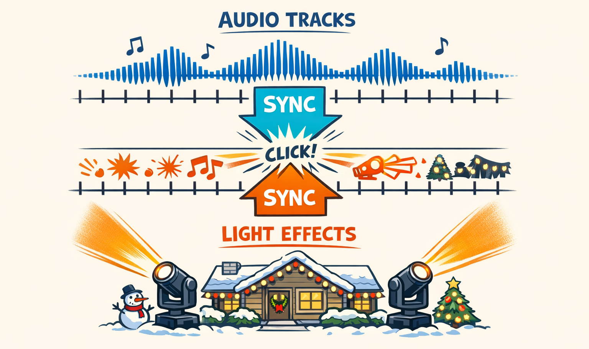
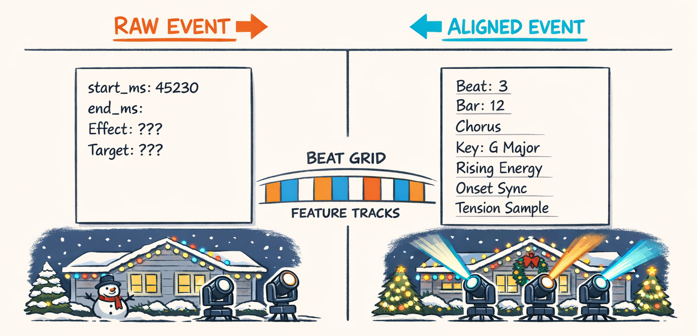
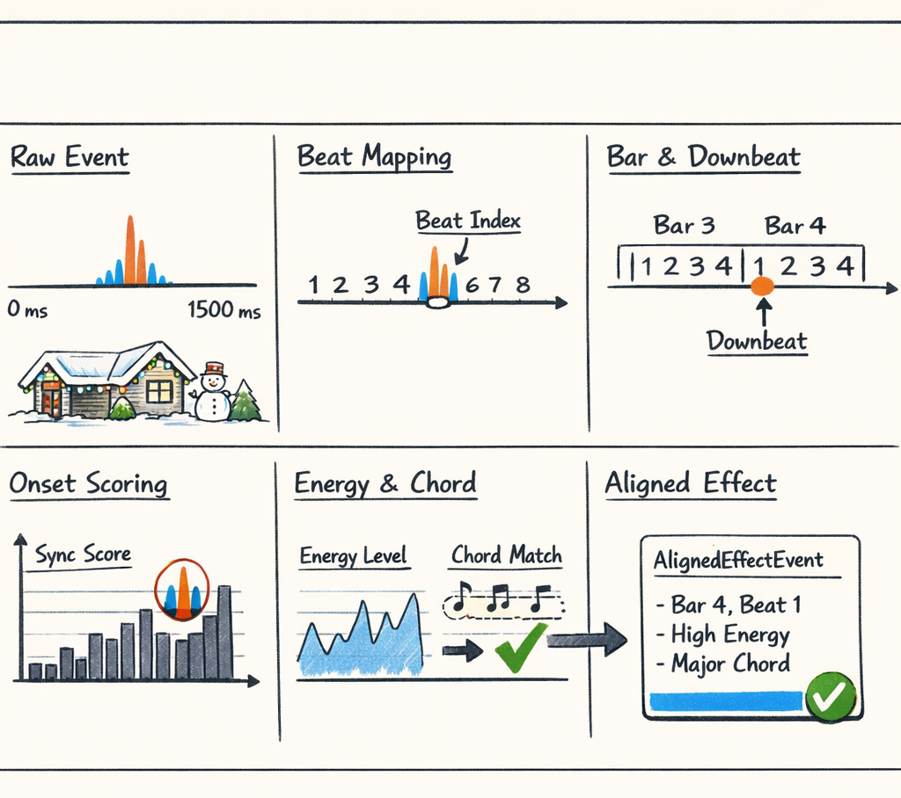
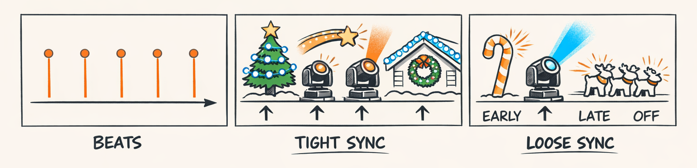
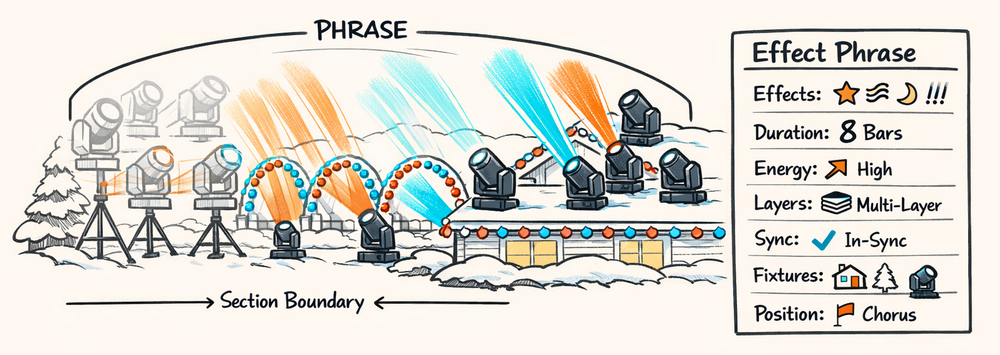
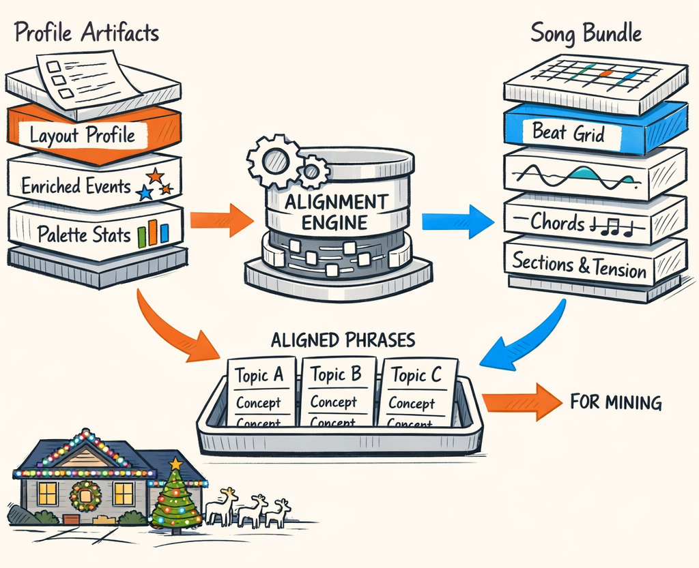

# Two Timelines Walk Into a Bar: Alignment, Phrases, and Finally Some Signal

By the end of Part 2, we'd bullied the audio into giving up the good stuff: beats, bars, sections, energy curves, chords, tension — all the musical context that makes a song feel like a song instead of a suspiciously emotional waveform.

On the other side, from Part 1, we had sequence events pulled out of xLights XML: effect types, start and end times, targets, layers, palette hints, fixture context. Basically a giant pile of “something happened at 45,230 ms.”

Useful?

Sort of.

But also not really.

Because the audio pipeline and the sequence pipeline were still living like divorced roommates. They shared a wall — time — but they weren't speaking the same language. One side said things like “pre-chorus, rising energy, beat 4, G major.” The other side said “Fan on Roofline_Left from 45,230 to 45,980 ms.” That's technically compatible, in the same way a JSON blob and a jazz chart are both “data.”

This post is where those worlds finally meet.

And honestly, this is the turning point. Before alignment, we had two parallel analyses. After alignment, we had a corpus. Not a glamorous corpus yet. More of a “held together with indexes and caffeine” corpus. But a real one: events attached to musical meaning, grouped into phrases that actually resemble choreographic ideas instead of lonely timestamps wandering through the void.

## The Same Time Axis, Two Completely Different Languages

Here's the trick that took us longer than it should have to admit: sequence events and audio features both live on the same time axis, but they absolutely do **not** live in the same representation.

The sequence side is literal. Start time. End time. Target fixture. Effect type. Layer. Maybe some parsed settings if the xLights gods are feeling generous.

The audio side is contextual. Beat positions. Bar numbers. Section labels. Chord spans. Energy sampled at multiple resolutions. Tension curves. Downbeats. The whole “what is the song doing right now?” stack from `packages/twinklr/core/audio/analyzer.py`.

So yes, both sides know what happened around 45.23 seconds. But only one side knows whether that moment is the third beat of a chorus with rising phrase energy and a harmonic change landing under it.

That shared coordinate system from Part 2 — the beat grid — is what makes translation possible. Once every event can be snapped onto beats and bars, the pipeline stops being “audio analysis over here, XML analysis over there” and starts being one joined timeline.

That sounds obvious in hindsight, which is usually how you know it consumed an unreasonable amount of engineering time.



Before this step, downstream mining had to guess at meaning from raw timings and effect metadata alone. After it, every event can carry musical context around like a little passport.

And that changes everything.

## What Alignment Buys You, Besides Fewer Existential Crises

A raw event at `45,230 ms` tells you almost nothing.

An aligned event that says:

> beat 3 of bar 12, in the chorus, during G major, with rising phrase energy and high onset sync

...is suddenly interesting.

That's the whole game.

The difference isn't cosmetic. It changes what we can ask of the data.

A bare event record is mostly good for counting things:
- how many `Fan` effects
- average durations
- which models get used most
- whether a designer really, really loved layer 2

An aligned event record is good for pattern mining:
- which effects tend to land on downbeats
- what fixture groups activate during choruses versus verses
- whether certain effect families cluster around harmonic changes
- which designers place sweeps tightly on the beat and which ones like to drag or push timing for feel

This is also where we stop treating event timestamps as the final product and start treating them as coordinates into a richer musical state space. Yes, that phrase sounds a little dramatic. But that's what happened.

The key downstream unit becomes `AlignedEffectEvent`. Not because it's magical. It's not. It's basically a carefully annotated join. But it's the first data object in the pipeline that knows both **what the lights did** and **what the music was doing when they did it**.

That joined representation feeds almost everything after this:
- phrase grouping
- taxonomy labeling
- motif and template mining in Part 4
- later planning and style modeling in Parts 5 and 6

So look, alignment isn't flashy. Nobody puts “successful temporal join” on a conference keynote slide unless they've fully given up on audience retention.

But this is the part where the dataset stops being merely organized and starts being meaningful.



## Inside `TemporalAlignmentEngine.align_events()`

The alignment engine lives in `packages/twinklr/core/feature_engineering/alignment/engine.py`, and its job is gloriously unsexy: take extracted sequence events, take analyzed song features, and join them without making a mess.

That's important, because this stage is **not** trying to do deep inference. It's not “understanding choreography.” It's doing careful temporal bookkeeping so later stages can pretend we were smart all along.

At a high level, `align_events()` does a few very specific things for each event:

1. find where the event start falls relative to the beat grid
2. assign a beat index and bar index
3. compute how tightly the event onset aligns to the nearest beat
4. sample audio-derived features at that moment or over that span
5. look up harmonic and structural context
6. emit a richer event object for phrase encoding and mining

A cleaned-up sketch looks like this:

```python
class TemporalAlignmentEngine:
    def align_events(
        self,
        events: list[EnrichedEventRecord],
        song_bundle: SongBundle,
    ) -> tuple[AlignedEffectEvent, ...]:
        aligned: list[AlignedEffectEvent] = []

        beats_s = song_bundle.timing.beats_s
        bars_s = song_bundle.timing.downbeats_s
        sections = song_bundle.structure.sections
        chords = song_bundle.harmony.chords

        for event in events:
            start_s = event.start_ms / 1000.0
            end_s = event.end_ms / 1000.0

            beat_idx = self._find_beat_index(start_s, beats_s)
            bar_idx = self._find_bar_index(start_s, bars_s)

            onset_sync = self._compute_onset_sync(start_s, beat_idx, beats_s)
            energy = self._sample_energy(start_s, song_bundle)
            tension = self._sample_tension(start_s, song_bundle)
            chord = self._lookup_chord(start_s, chords)
            section = self._lookup_section(start_s, sections)

            aligned.append(
                AlignedEffectEvent(
                    effect_event_id=event.effect_event_id,
                    effect_type=event.effect_type,
                    start_ms=event.start_ms,
                    end_ms=event.end_ms,
                    beat_index=beat_idx,
                    bar_index=bar_idx,
                    beat_in_bar=self._beat_in_bar(beat_idx, bar_idx, bars_s, beats_s),
                    onset_sync=onset_sync,
                    energy_beat=energy.beat_level,
                    energy_phrase=energy.phrase_level,
                    tension=tension,
                    chord_label=chord.label if chord else None,
                    section_label=section.label if section else None,
                    target_name=event.target_name,
                    target_kind=event.target_kind,
                    layer_index=event.layer_index,
                )
            )

        return tuple(aligned)
```

The interesting part isn't the code volume. It's the annotation layers.

Beat and bar assignment come from the timing data produced by the audio stack in `packages/twinklr/core/audio/analyzer.py`. Energy isn't one number; we usually care about at least beat-scale and phrase-scale energy from `extract_smoothed_energy()` in `packages/twinklr/core/audio/energy/multiscale.py`. Tension comes from the higher-level harmonic and dynamic analysis. Chords come from harmonic spans. Sections come from structure detection.

So one tiny XML event gets wrapped in several overlapping views of the song:
- **rhythmic context**: beat, bar, beat-in-bar, downbeat proximity
- **dynamic context**: local energy and longer-arc phrase energy
- **harmonic context**: current chord, key neighborhood
- **structural context**: verse, chorus, bridge, intro, outro
- **placement quality**: onset sync

That last one turned out to matter more than we expected.

And all of these annotations become inputs later on. Phrase encoding uses them. Taxonomy classifiers use them. Template mining definitely uses them. If alignment gets sloppy, everything downstream starts learning nonsense with incredible confidence, which is sort of the machine learning version of a raccoon driving a golf cart.



## Onset Sync: A Tiny Feature With Weirdly Strong Opinions

We almost treated onset sync as a throwaway feature.

That would've been a mistake.

The idea is simple: if an effect starts very close to a beat, it feels rhythmically tight. If it starts far from the nearest beat, it feels looser, more syncopated, or sometimes just kind of late in a way that makes you squint at the sequence file.

The computation is basically nearest-beat distance normalized by the local inter-beat interval. So the same 80 ms offset means something different at 70 BPM than it does at 150 BPM.

In cleaned-up form:

```python
def _compute_onset_sync(start_s: float, beat_idx: int, beats_s: list[float]) -> float:
    if not beats_s:
        return 0.0

    nearest_beat_s = beats_s[beat_idx]

    if beat_idx < len(beats_s) - 1:
        ibi = max(1e-6, beats_s[beat_idx + 1] - beats_s[beat_idx])
    elif beat_idx > 0:
        ibi = max(1e-6, beats_s[beat_idx] - beats_s[beat_idx - 1])
    else:
        ibi = 0.5  # sad fallback for a very lonely beat list

    distance = abs(start_s - nearest_beat_s)
    normalized = min(1.0, distance / (ibi * 0.5))

    # 1.0 = perfectly on beat, 0.0 = maximally off within half an IBI
    return 1.0 - normalized
```

A high onset sync score means the event lands almost exactly on the pulse. Think punchy hits, crisp dimmer accents, sweeps that launch right on beat 1.

A lower score means the designer is offsetting the move — maybe intentionally for groove, maybe because the visual gesture needs lead time, maybe because humans are messy and timing tracks are aspirational.

And here's the part that surprised us: onset sync distributions ended up being a decent style marker.

Some designers are absolute grid fanatics. Their event starts pile up right on beats and downbeats like they signed a contract with a metronome. Others consistently place certain effect families slightly ahead of or behind the beat, especially sweeps and movement-heavy effects on upright moving heads. Same song energy, same section type, different rhythmic taste.

That means onset sync isn't just a local quality score. It's a corpus-level fingerprint of choreographic feel.

Tiny feature. Weirdly judgmental. Extremely useful.



## Why Individual Events Are Too Small to Mean Much

Single events matter, but they're also too small to carry the whole idea.

A `Fan` on one roofline fixture for 420 ms is not a choreographic pattern. It's a syllable. Maybe a word if we're being generous.

What we actually care about downstream are short, musically coherent chunks of behavior:
- a burst of alternating hits across a 2-bar chorus entrance
- a layered sweep-plus-dimmer stack through a build
- a repeated call-and-response phrase between left and right fixture groups
- a four-bar texture that ramps intensity before a drop

Those are not individual events. They're groups.

So we introduced **phrases**: clusters of aligned events that belong together in time and context, usually spanning about 1 to 8 bars. That's fuzzy on purpose. Human designers don't compose in perfectly uniform packets, and pretending otherwise is how you end up building a very sophisticated spreadsheet instead of a choreography engine.

The NLP analogy helped us keep our heads straight here:
- effects are words
- phrases are sentences
- section-level patterns are paragraphs

You *can* do some mining on individual words. But if you want meaning, structure, and style, you need sentences.

This also saves us from a lot of statistical nonsense. Event-level mining tends to overfit to tiny local quirks: one fixture, one duration, one timing choice. Phrase-level mining starts capturing reusable choreographic intent.

Which is what we wanted all along, even if it took us three posts to admit it.

## PhraseEncoder: Turning Stacks of Effects Into Choreographic Sentences

The phrase logic lives in `packages/twinklr/core/feature_engineering/phrases/encoder.py`, plus a few helper modules in `packages/twinklr/core/feature_engineering/phrases/`.

This is where aligned events stop being isolated annotations and start becoming compositional units.

The grouping rules are intentionally conservative. We don't try to infer some grand hidden grammar of Christmas lights from first principles. We mostly ask a practical question:

> which neighboring events probably belong to the same choreographic thought?

The answer usually comes from three things:
- temporal proximity
- fixture or layer continuity
- musical coherence, especially section boundaries

That last one is non-negotiable: phrases do **not** cross section boundaries. If the song moves from verse to chorus, we cut there. Even if the event timings are close. Even if the fixtures match. Even if the previous phrase was really vibing. Musical structure wins.

A simplified sketch of the encoder looks like this:

```python
class PhraseEncoder:
    def encode(
        self,
        events: tuple[AlignedEffectEvent, ...],
    ) -> tuple[EffectPhrase, ...]:
        phrases: list[EffectPhrase] = []
        current: list[AlignedEffectEvent] = []

        for event in sorted(events, key=lambda e: (e.start_ms, e.layer_index, e.target_name)):
            if not current:
                current.append(event)
                continue

            prev = current[-1]

            if self._starts_new_phrase(prev, event):
                phrases.append(self._finalize_phrase(current))
                current = [event]
            else:
                current.append(event)

        if current:
            phrases.append(self._finalize_phrase(current))

        return tuple(phrases)

    def _starts_new_phrase(
        self,
        prev: AlignedEffectEvent,
        event: AlignedEffectEvent,
    ) -> bool:
        gap_ms = event.start_ms - prev.end_ms

        return any(
            [
                event.section_label != prev.section_label,   # never cross sections
                gap_ms > 2_000,                              # temporal break
                self._bar_distance(prev, event) > 2,         # too far apart musically
                self._fixture_context_break(prev, event),    # target family changed hard
            ]
        )
```

That `_starts_new_phrase()` logic got tuned by staring at lots of real sequences and muttering “no, that split feels dumb” at the screen. Extremely scientific process.

Once we have a phrase candidate, we summarize it into an `EffectPhrase` object with composite features. That's the real output. Not just grouped events, but a feature vector that describes the phrase as a reusable unit.

Something like this:

```python
def _finalize_phrase(self, events: list[AlignedEffectEvent]) -> EffectPhrase:
    start_ms = min(e.start_ms for e in events)
    end_ms = max(e.end_ms for e in events)

    return EffectPhrase(
        phrase_id=self._phrase_id(events),
        start_ms=start_ms,
        end_ms=end_ms,
        duration_ms=end_ms - start_ms,
        bar_start=min(e.bar_index for e in events if e.bar_index is not None),
        bar_end=max(e.bar_index for e in events if e.bar_index is not None),
        section_label=events[0].section_label,
        effect_types=self._effect_histogram(events),
        layer_count=len({e.layer_index for e in events}),
        target_count=len({e.target_name for e in events}),
        fixture_families=self._fixture_family_histogram(events),
        mean_onset_sync=self._mean(e.onset_sync for e in events),
        mean_energy=self._mean(e.energy_phrase for e in events),
        energy_profile=self._energy_profile(events),
        chord_coverage=self._chord_histogram(events),
        section_position=self._section_position(events),
    )
```

The composite features matter more than the raw members:
- **effect distribution** tells us whether the phrase is sweep-heavy, hit-heavy, dimmer-heavy, and so on
- **duration and bar span** tell us whether it's a quick accent or a longer texture
- **energy profile** tells us whether it ramps, stays flat, or decays
- **layer stats** tell us whether it's sparse or stacked
- **sync stats** tell us whether it feels rigid, loose, or mixed
- **fixture context** tells us whether it's local, mirrored, roofline-wide, or spread across families
- **section position** tells us whether it tends to occur at a section entrance, middle, or exit

That last one is sneakily powerful. A phrase that appears near chorus entrances across many songs is a very different thing from one that only shows up in late-verse connective tissue.

And now, finally, we have a unit of analysis that sounds like choreography instead of bookkeeping.

Not perfect choreography, to be clear. Sometimes the grouping still does weird stuff. We had one early run that merged a delicate pre-chorus build with the first impact hit of the chorus because the temporal gap was small and the model family was similar. Technically explainable. Musically cursed.

But after some tuning, the phrase layer became the first place where mined patterns started looking like things a human might actually have intended.

Which was honestly a relief.



## The Aligned Corpus: The Moment the Dataset Becomes Actually Interesting

Up to this point, the pipeline has been a long chain of “take something messy, make it less embarrassing.”

Zip files become parsed profiles. Audio becomes song features. XML effect placements become enriched event records. All necessary. None especially romantic.

But once alignment and phrase encoding land, the corpus changes shape.

We're no longer looking at isolated artifacts from separate pipelines. We're looking at musically contextualized phrases: chunks of choreography with timing, structure, energy, harmony, fixture context, and internal composition all attached.

That's the first version of the dataset that makes you want to mine it.

In rough terms, the flow looks like this:
- package ingestion produces sequence and layout artifacts
- audio analysis produces a `SongBundle`
- event extraction and enrichment produce fixture-aware sequence events
- `TemporalAlignmentEngine` joins those events to the song timeline
- `PhraseEncoder` groups aligned events into `EffectPhrase` records
- those phrases become the mining corpus for templates, motifs, and taxonomy

The handoff is pretty direct in code, even if the implementation details are spread across modules:

```python
def build_aligned_phrase_corpus(
    events: list[EnrichedEventRecord],
    song_bundle: SongBundle,
) -> tuple[EffectPhrase, ...]:
    alignment_engine = TemporalAlignmentEngine()
    phrase_encoder = PhraseEncoder()

    aligned_events = alignment_engine.align_events(events, song_bundle)
    phrases = phrase_encoder.encode(aligned_events)

    return phrases
```

That's it, structurally. Not simple internally, but simple in shape.

And this is the corpus Part 4 is going to dig into: mining repeated templates, identifying motifs, learning effect taxonomies, and separating actual choreography gold from patterns that just happened to recur because one vendor really loved a certain preset.

Alignment isn't the glamorous part of the stack. Nobody outside the team is going to get misty-eyed about bar assignment and chord lookup joins.

But nothing downstream works without it.

If we get this layer wrong, the mining stage learns bad phrases, the style stage learns fake preferences, and the planner starts making confident nonsense. Which, to be fair, is a very modern AI failure mode.

If we get it mostly right, the corpus starts to speak.

And for the first time in this pipeline, it says something worth listening to.



---

## About twinklr


twinklr is our ongoing science experiment in weaponizing holiday cheer. It's an AI-driven choreography and composition engine that takes an audio file and spits out fully synchronized sequences for Christmas light displays in xLights — because apparently we looked at a normal, peaceful hobby and thought, “What if we added AI, machine learning, and sleepless nights?”

Here's the honest disclaimer: we're not professional lighting designers. We're developers, engineers, and AI researchers who spend our days building at the frontier of AI… and our nights obsessing over why a dimmer curve feels “late” by half a beat and whether a roofline sweep should be dramatic or merely aggressively festive. If you're expecting polished stage-production wisdom, you're in the wrong place. If you're into nerdy overengineering, mildly unhinged experimentation, and the occasional “how did that even work?” moment — welcome.

This blog is the running log of our journey: the wins, the faceplants, the weird breakthroughs, and the lessons learned the hard way, often repeatedly. We'll share what we're building, what breaks, and why certain architectural decisions matter — especially when the goal is to turn “song” into “show” without the lights looking like they're having an existential crisis.

If you want to learn alongside us — or jump in and contribute — come say hi on GitHub: https://github.com/bluewatersql/twinklr/tree/main
---
