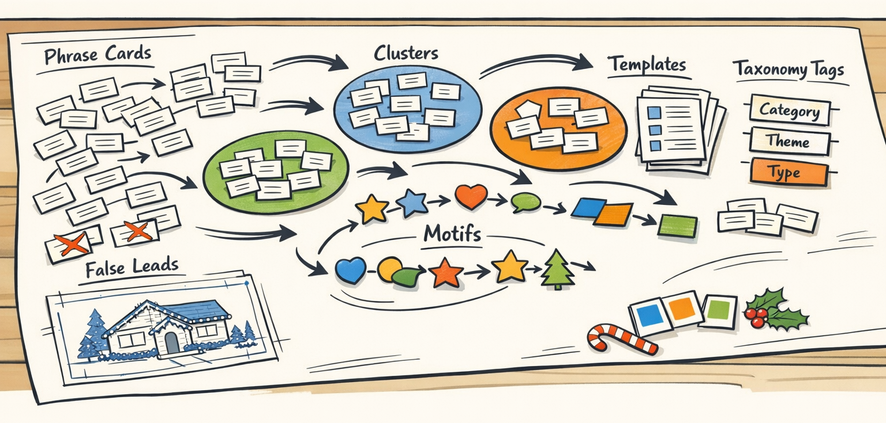
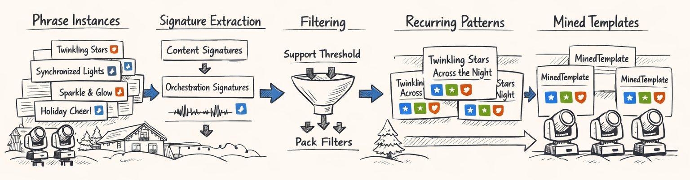
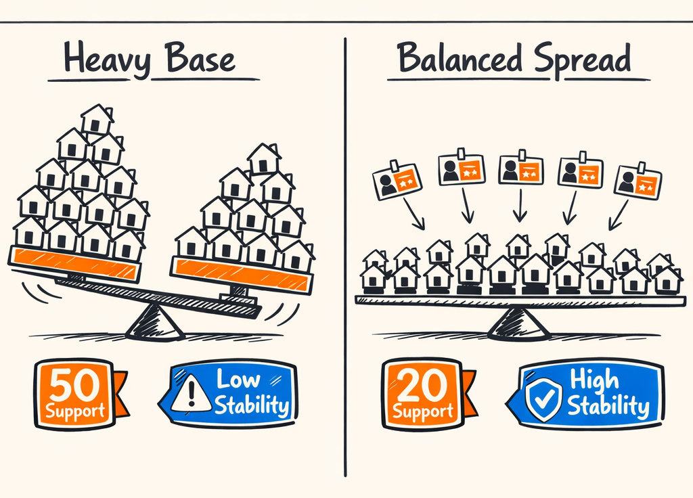
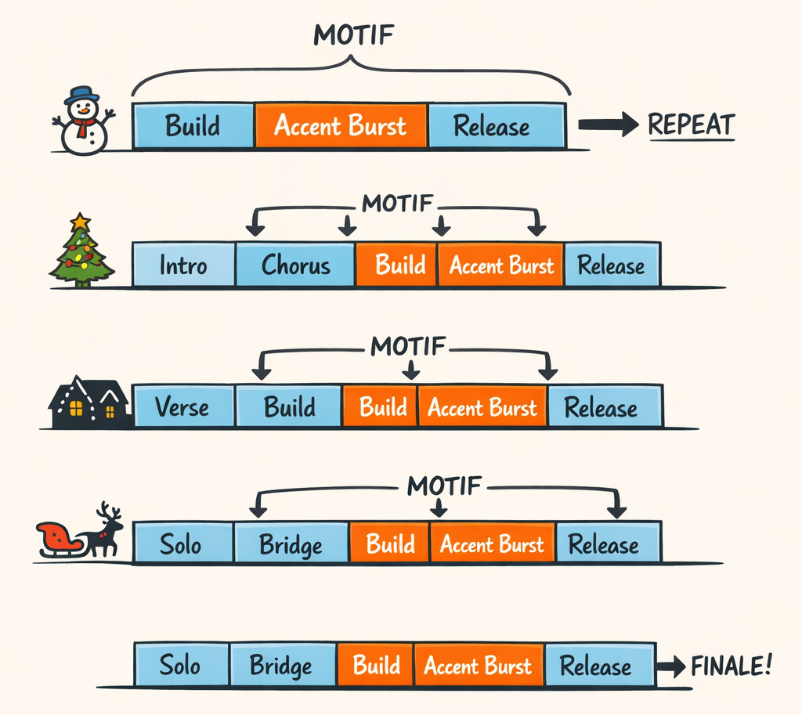
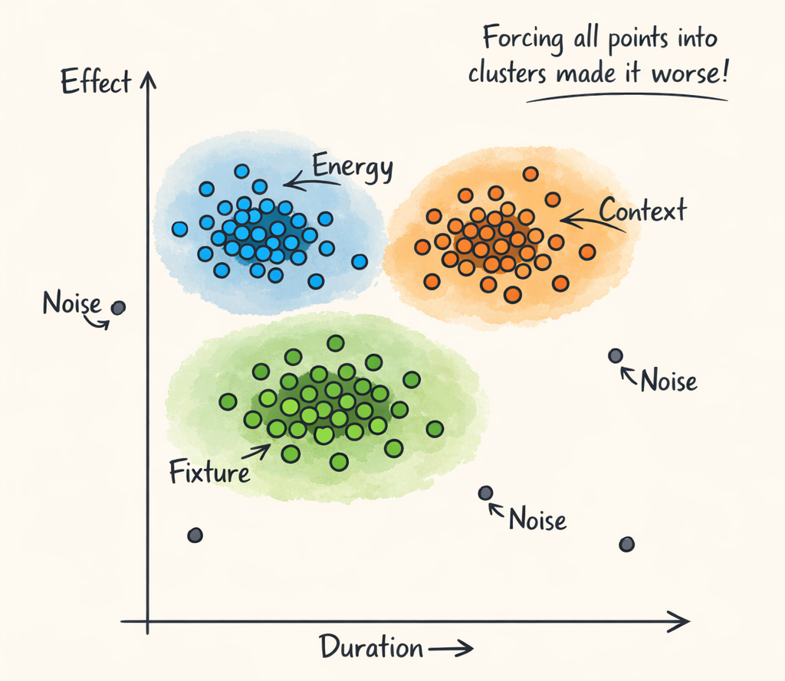
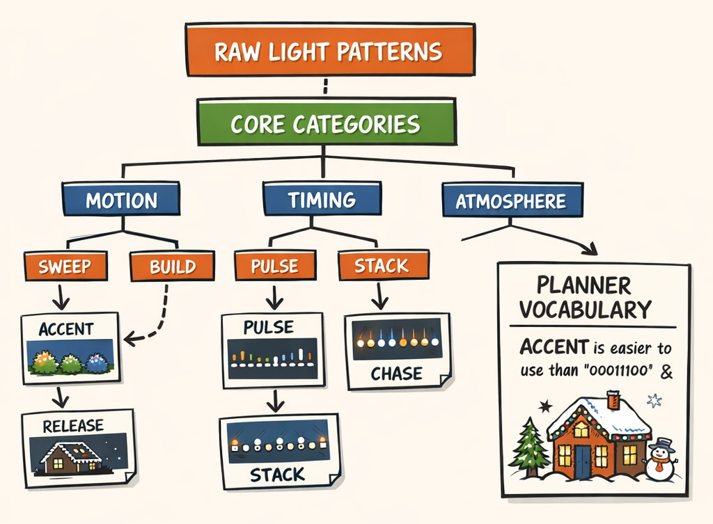
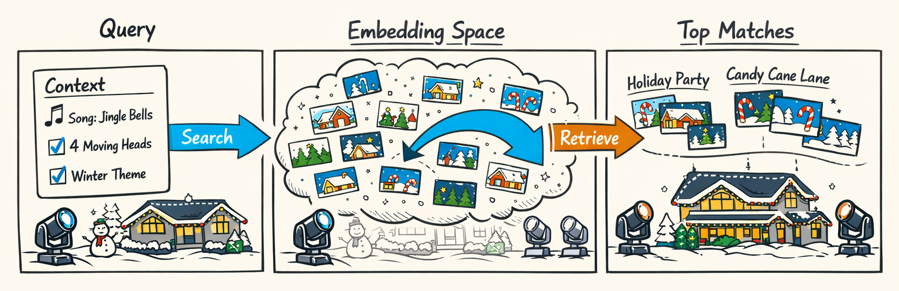
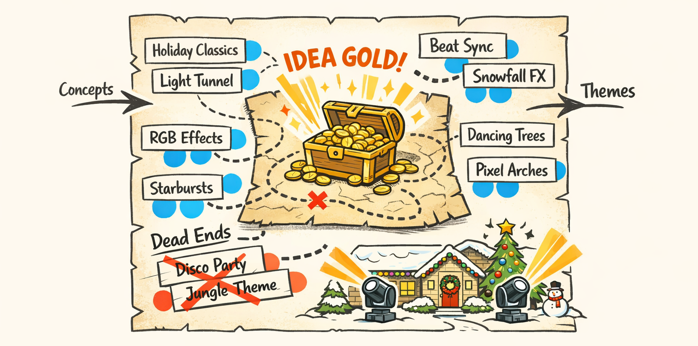

### Part 4: Mining for Choreography Gold, Finding Some Fool's Gold Too

---
title: "Mining for Choreography Gold, Finding Some Fool's Gold Too"
series: "The Feature Engineering Pipeline: Teaching Machines to Read Light Shows"
part: 4
tags: [ai, llm, python, christmas-lights, xlights]
---



# Mining for Choreography Gold, Finding Some Fool's Gold Too

By the end of Part 3, we finally had something that felt less like raw telemetry and more like actual creative material. We had phrases. Aligned phrases, specifically. Tiny chunks of human-made light choreography pinned to beat grids, section boundaries, energy curves, fixture context, and all the musical metadata we'd spent the previous posts extracting the hard way.

Which was great.

It was also dangerous.

Because once you have a few thousand aligned phrases, your brain starts seeing meaning everywhere. A repeated sweep here. A pulse cluster there. A build-and-release shape that *feels* important. And some of that is real design convention. Some of it is just coincidence. Some of it is one designer having a favorite move and using it 47 times like they're trying to earn airline status.

So this part is about the discovery phase. Not the "we have proven universal laws of Christmas light choreography" phase. More like: we dumped a mountain of aligned phrase data on the floor, started sorting it into piles, and tried very hard not to confuse recurring taste with general truth.

This is where the corpus starts developing a shared vocabulary. Templates. Motifs. Clusters. Alias groups. Taxonomy labels. Retrieval indices. All the machinery you need before a planner can say something like, "give me a medium-energy accent pattern for a roofline mover group" without sounding completely ridiculous.

And yes, a decent amount of it came from unsupervised learning, threshold tuning, and staring at bad outputs until they either made sense or offended us enough to rewrite the code.

## Five Thousand Phrases and a Very Specific Kind of Treasure Hunt

Part 3 gave us the crucial thing: alignment. Before that, the corpus was basically a lot of effect placements and audio features waving at each other from opposite sides of the street. After alignment, each phrase lived in musical context. Beat-relative timing actually meant something. Energy windows meant something. Fixture choices meant something.

So now the game changes.

We're no longer asking, "what happened in this sequence?" We're asking, "what keeps happening across many sequences, many songs, many packs, and ideally many designers?" That's a much better question. It's also a much more annoying question.

Because a corpus this size absolutely contains patterns. It also contains accidents, quirks, mislabeled effects, inherited xLights habits, and the occasional designer decision that makes perfect sense exactly once and nowhere else.

We ended up treating the whole thing like a treasure hunt with a very skeptical map. Every promising recurrence had to survive a bunch of boring but necessary tests:

- does it recur across multiple sequences?
- across multiple packs?
- across different fixture contexts?
- with similar musical timing?
- and is it still recognizable after you strip away superficial naming differences?

If not, it might still be interesting. It just probably isn't a reusable building block yet.

That's the framing for this post: discovery, not verdict. We're mining candidate structure out of the corpus, building the first reusable artifacts, and trying not to accidentally immortalize one person's extremely committed obsession with alternating two-beat pan sweeps.


## Template Mining: If Enough Designers Do the Same Thing, It's Probably Not an Accident

The first serious pass at this lives in `packages/twinklr/core/feature_engineering/templates/miner.py`, inside `TemplateMiner`.

The basic premise is gloriously unromantic: if many independent phrase instances reduce to the same structural signature, maybe that's a real template. Not always. But maybe. And "maybe" is a lot better than "we vibe-coded a choreography ontology at 2 a.m."

What mattered here was separating *what* happened from *how it was orchestrated*.

A phrase might be "short accent burst on beat 1 with rapid decay." That's the content shape. But it might be executed on four moving heads in a roofline arc, or on a wide yard group, or on alternating left/right target sets. Those are orchestration details. Both matter, but they shouldn't be mashed into one brittle identity.

So the miner works with two related signatures:

- **content signature**: effect pattern, relative timing, duration shape, dynamic envelope, and musical context
- **orchestration signature**: fixture family, target topology, spread, symmetry, layer behavior, and deployment context

That split turned out to be one of those decisions that feels obvious only after you stop doing the dumber thing.

Here's a cleaned-up sketch of the core shape:

```python
class TemplateMiner:
    """Mine recurring phrase patterns into reusable templates."""

    def mine_templates(
        self,
        phrases: list[AlignedPhrase],
        *,
        min_support: int = 8,
        min_distinct_packs: int = 3,
        min_distinct_sequences: int = 5,
    ) -> list[MinedTemplate]:
        buckets: dict[str, list[AlignedPhrase]] = {}

        for phrase in phrases:
            # Content signature ignores superficial target naming
            signature = self._content_signature(phrase)
            buckets.setdefault(signature, []).append(phrase)

        mined: list[MinedTemplate] = []
        for signature, matches in buckets.items():
            support = len(matches)
            distinct_packs = len({p.package_id for p in matches})
            distinct_sequences = len({p.sequence_id for p in matches})

            # Raw count alone lies constantly
            if support < min_support:
                continue
            if distinct_packs < min_distinct_packs:
                continue
            if distinct_sequences < min_distinct_sequences:
                continue

            mined.append(
                MinedTemplate(
                    template_id=self._stable_template_id(signature),
                    content_signature=signature,
                    orchestration_signature=self._orchestration_signature(matches),
                    support_count=support,
                    distinct_pack_count=distinct_packs,
                    distinct_sequence_count=distinct_sequences,
                    exemplar_phrase_ids=[p.phrase_id for p in matches[:5]],
                )
            )

        return mined
```

The thresholds are doing most of the boring hero work here.

`min_support` keeps us from promoting one-offs. `min_distinct_sequences` stops us from learning repeated copy-paste inside a single song pack. And `min_distinct_packs` is the first real guardrail against designer-specific habits masquerading as "industry convention."

We tried softer versions of this. They were... educational.

At one point we allowed high raw support to compensate for low pack diversity. The result was a catalog stuffed with patterns that looked statistically important and turned out to be "this one designer really likes this move in every chorus." Which is valid as style. It's just not the same thing as a reusable corpus-level primitive.

The actual artifact we keep is `MinedTemplate`. That's the first object in this pipeline that feels reusable in a downstream way. It's no longer just a phrase instance from one song. It's a candidate choreography building block with evidence attached:

- how often it appeared
- how broadly it appeared
- what musical context it tends to live in
- and which phrase examples best represent it

That last part matters more than I expected. Every time the miner made a weird decision, the exemplar list let us inspect real phrase instances instead of arguing with a vector and pretending that was somehow more scientific.



## Cross-Pack Stability: The Metric That Saved Us From Learning One Person's Weird Habits

If you only remember one thing from this post, make it this: **raw support count is a trap**.

A pattern used 50 times sounds impressive until you discover 46 of those uses came from two packs by the same designer, both built on the same house layout, both using the same sequencing habits. That's not corpus truth. That's one person being consistent. Good for them. Not automatically good for us.

So we started caring a lot more about what we now think of as cross-pack stability.

The intuition is pretty close to TF-IDF, with all the usual caveats. In text, a term that appears across many documents can be more generally meaningful than a term that's repeated obsessively in one document. Here, a choreography pattern that shows up across many packs and sequences is often more reusable than one that's massively concentrated in a tiny corner of the corpus.

Concrete example:

- Pattern A appears **50 times across 2 packs**
- Pattern B appears **20 times across 15 packs**

If you're building a shared template library, Pattern B is usually the safer bet. Pattern A might still be useful, but it's more likely to encode one designer's local taste, fixture inventory, or sequencing workflow.

This saved us from some genuinely dumb conclusions.

We had one accent pattern with a huge support count and beautiful internal consistency. For a day or two we thought we'd found a foundational template family. Then we looked at the pack distribution and realized it was basically one designer's signature move repeated all over a commercial install set. Which, again, is cool. But if we had promoted that too aggressively, the planner would have started acting like everyone on earth wants that exact move every time the chorus hits.

No thank you.

So now when we score mined candidates, we look at recurrence *and* spread:

- total support
- distinct sequences
- distinct packs
- distribution concentration
- whether recurrence survives across different songs and layouts

Part 6 is where this starts to matter operationally, because promotion into production-grade template libraries leans heavily on this idea. Discovery is allowed to be a little messy. Promotion can't be.

And honestly, this metric saved us from building a very sophisticated machine for overfitting to somebody's favorite pan-tilt flourish.



## Motifs: Because Designers Don't Speak in Single Templates

Individual templates are useful, but they aren't the whole story. Designers don't usually think in isolated one-bar moves. They think in little chains. Build something. Hit an accent. Release the tension. Reset. Repeat with variation.

That's what `packages/twinklr/core/feature_engineering/motifs/miner.py` is for.

`MotifMiner` works one level up from template mining. Instead of asking, "what recurring phrase shape do we see?" it asks, "what recurring *sequence of templates* do we see?" That's a much better way to capture flow.

A toy example looks like this:

- bars 1-2: gradual build template
- bar 3 beat 1: accent burst
- bars 3-4: release or fan-out pattern

If that chain shows up across songs with similar spacing, that's not just a template. That's a compositional habit.

Here's the rough idea:

```python
class MotifMiner:
    """Mine recurring template sequences with temporal spacing constraints."""

    def mine_motifs(
        self,
        template_spans: list[TemplateSpan],
        *,
        min_length: int = 2,
        max_length: int = 5,
        min_support: int = 6,
    ) -> list[MinedMotif]:
        sequences = self._group_by_song(template_spans)
        candidates = self._extract_ngrams(
            sequences,
            min_length=min_length,
            max_length=max_length,
            preserve_bar_offsets=True,   # spacing matters
        )

        return [
            self._to_motif(candidate)
            for candidate in candidates
            if candidate.support_count >= min_support
            and candidate.temporal_variance <= self.max_temporal_variance
        ]
```

That `preserve_bar_offsets=True` bit is doing real work. Without timing constraints, motif mining devolves into "these templates happened near each other at some point," which is about as useful as saying every Christmas song contains bells and therefore all bells are structurally equivalent.

We found motifs that looked like:

- repeated pre-chorus ramps into a downbeat punch
- alternating side-to-side sweeps followed by a center-focused accent
- energy-matched pulse chains that consistently resolve on section boundaries

Those are the kinds of patterns that start feeling like design language instead of isolated moves.

And they matter later because planners don't just need ingredients. They need ways to string ingredients together without producing choreography that feels like it was assembled by a very diligent raccoon.



## DBSCAN and the Art of Letting Outliers Be Weird

Once we had mined templates, the next temptation was to force them all into clean categories.

That instinct was wrong.

The code for clustering lives in `packages/twinklr/core/feature_engineering/templates/clusterer.py`, and the key choice there was using DBSCAN instead of k-means.

Why? Because k-means assumes the world politely consists of roughly spherical clusters and that every point deserves a cluster assignment. Our corpus did not get that memo.

Some templates are common and densely repeated. Some are transitional hybrids. Some are weird one-offs that absolutely should not define a family. And some are only similar if you squint, tilt your head, and lie to yourself a little.

So we built a feature space that tries to represent template behavior in a way clustering can use:

- effect type distribution
- normalized duration profile
- energy context from the aligned audio features
- section/beat context
- fixture-family context
- target spread and symmetry
- motion or accent density proxies

Then we let DBSCAN find dense neighborhoods and mark the rest as noise.

That last part was the breakthrough.

Noise points are not a bug here. They're a confession of uncertainty, and that's healthy. Forcing every template into a cluster made the output worse in exactly the way you'd expect: clusters got vague, boundaries got mushy, and retrieval started surfacing "similar" templates that were only similar in the sense that both existed.

Here's the shape of the clusterer:

```python
class TemplateClusterer:
    """Density-based clustering for mined templates."""

    def cluster_templates(
        self,
        templates: list[MinedTemplate],
        *,
        eps: float = 0.22,
        min_samples: int = 5,
    ) -> list[ClusterAssignment]:
        vectors = [self._feature_vector(t) for t in templates]

        # DBSCAN lets dense families emerge naturally
        labels = self._dbscan(vectors, eps=eps, min_samples=min_samples)

        return [
            ClusterAssignment(
                template_id=template.template_id,
                cluster_label=label,      # -1 means noise / unclustered
                is_noise=(label == -1),
            )
            for template, label in zip(templates, labels, strict=True)
        ]

    def _feature_vector(self, template: MinedTemplate) -> list[float]:
        return [
            *template.effect_distribution_vector,
            *template.duration_shape_vector,
            *template.energy_context_vector,
            *template.fixture_context_vector,
        ]
```

We spent about three weeks trying to make more "complete" clustering strategies work. One version produced exactly one giant cluster and a handful of crumbs. Another produced a cluster for almost every point, which is just singleton assignment with extra steps.

DBSCAN was less tidy and more honest.

It gave us dense families where they really existed, and it left the oddballs alone. That's exactly what we wanted. Some choreography patterns *are* weird. Some are tied to unusual fixture layouts. Some are artistically specific. Let them be weird. The taxonomy can still name them later without pretending they're part of a broad, well-supported family.

This was one of those moments where the better algorithm wasn't the one that organized everything. It was the one that knew when to shrug.



## Alias Clustering: Same Dance Move, Different Sticker on the Box

Then we hit a less glamorous problem: naming.

Different designers, packs, and extraction paths often describe very similar patterns with different labels. Sometimes the names are helpful. Sometimes they're inherited from xLights effect metadata. Sometimes they're basically "blue sweep fast 2," and you just have to respect the chaos.

Before we could build a useful taxonomy, we had to normalize aliases in `packages/twinklr/core/feature_engineering/normalization/clustering.py`.

Conceptually, it works like this:

1. embed each template label or descriptor into a comparable vector space
2. compute pairwise cosine similarity
3. use agglomerative grouping to propose close name clusters
4. apply union-find to merge transitive matches into alias sets

The important bit is that similarity here isn't just string matching. We care about semantically related names that differ lexically, like "burst accent," "hit pulse," and "strobe pop" when they all point to roughly the same template family in context.

Here's a simplified sketch:

```python
def cluster_aliases(
    labels: list[str],
    embeddings: list[list[float]],
    *,
    similarity_threshold: float = 0.86,
) -> list[set[str]]:
    parent = {label: label for label in labels}

    for i, left in enumerate(labels):
        for j in range(i + 1, len(labels)):
            right = labels[j]
            sim = cosine_similarity(embeddings[i], embeddings[j])

            if sim >= similarity_threshold:
                union(parent, left, right)

    return collect_sets(parent)
```

We thought this would be a tiny cleanup step.

It was not.

Without alias normalization, taxonomy labels fragmented badly and retrieval got noisy. You'd have three near-identical patterns filed under different names, and downstream systems would treat them like separate species. Which is a very efficient way to make your corpus look smarter and your planner act dumber.

## Taxonomy: Giving the Corpus a Vocabulary It Can Actually Share

At some point, vectors and clusters stop being enough. Downstream systems need words.

Not poetic words. Useful words.

This is where `packages/twinklr/core/feature_engineering/taxonomy/classifier.py` comes in. The job of `TaxonomyClassifier` is to map mined templates into a shared hierarchical vocabulary the rest of the stack can actually reason about.

Because a planner cannot sensibly ask for "the nearest 128-dimensional vector with medium onset-aligned accent energy and moderate spread symmetry." I mean, technically it can. But that way lies suffering. It's much better if it can ask for something like `accent/pulse`, `build/ramp`, or `transition/release/fanout`.

So the taxonomy is hierarchical on purpose. Broad categories capture role; deeper labels capture subtype.

A simplified shape looks like this:

- `accent`
  - `pulse`
  - `burst`
  - `hit`
- `build`
  - `ramp`
  - `stack`
  - `intensify`
- `transition`
  - `release`
  - `fanout`
  - `sweep`
- `bed`
  - `wash`
  - `texture`
  - `motion_low`

The classifier itself blends learned behavior with fallback rules. That's important because the corpus is messy, and a pure learned classifier happily becomes overconfident in all the wrong places.

Here's a condensed version of the interface:

```python
class TaxonomyClassifier:
    """Assign hierarchical taxonomy labels to mined templates."""

    def classify_template(self, template: MinedTemplate) -> TaxonomyLabel:
        features = self._taxonomy_features(template)

        prediction = self._learned_classifier.predict(features)
        confidence = prediction.confidence

        if confidence >= self.min_confidence:
            return TaxonomyLabel(
                path=prediction.path,          # e.g. "accent/pulse"
                confidence=confidence,
                source="learned",
            )

        # Fall back to hand-tuned heuristics when the model isn't sure
        return TaxonomyLabel(
            path=self._fallback_path(template),
            confidence=0.51,
            source="fallback",
        )

    def _fallback_path(self, template: MinedTemplate) -> str:
        if template.is_short_accent and template.onset_density > 0.7:
            return "accent/pulse"
        if template.energy_ramp_score > 0.6 and template.duration_bars >= 2:
            return "build/ramp"
        if template.decay_score > 0.5 and template.section_boundary_bias > 0.4:
            return "transition/release"
        return "bed/texture"
```

That fallback path kept the taxonomy from going off the rails during sparse or ambiguous cases. We needed this because some clusters were beautifully coherent, and others were a little more "these things share a neighborhood and some vibes."

The practical reason taxonomy matters is boring in the best way: it creates a common interface between discovery and planning.

Once a template is labeled as `accent/pulse`, other systems can:

- retrieve it as an accent candidate
- compare it to sibling accent types
- reason about role balance inside a section
- assign it to target roles during composition
- evaluate whether a generated sequence overuses one family

Part 6 leans hard on this. That's where mined patterns stop being interesting analysis artifacts and start earning the right to influence actual show generation.

Until then, the taxonomy is basically the corpus learning how to talk about itself without mumbling in cosine space.



## ANN Retrieval: Because 'Just Scan the Whole Catalog' Stops Being Cute at Scale

Once the template catalog gets big enough, brute-force similarity search starts feeling adorable in the worst possible way.

That's why we added `AnnTemplateRetrievalIndexer` in `packages/twinklr/core/feature_engineering/retrieval/ann_indexer.py`.

The use case is straightforward: the planner has some current musical and orchestration context and needs a few contextually similar templates *fast*. Not after scanning the whole catalog, sorting everything, and making the CPU file a complaint with HR.

Approximate nearest-neighbor search is the right trade here. We don't need mathematically perfect nearest neighbors every time. We need good-enough candidates quickly enough that retrieval can sit inside a larger planning loop without becoming the bottleneck.

Conceptually it looks like this:

```python
class AnnTemplateRetrievalIndexer:
    """Build and query ANN index over template embeddings."""

    def build_index(self, templates: list[MinedTemplate]) -> None:
        self._template_ids = [t.template_id for t in templates]
        self._vectors = [self._embedding(t) for t in templates]
        self._index = self._fit_ann(self._vectors)

    def query(
        self,
        context_vector: list[float],
        *,
        top_k: int = 12,
        taxonomy_filter: str | None = None,
    ) -> list[str]:
        candidate_ids = self._index.search(context_vector, top_k=top_k * 3)

        if taxonomy_filter is None:
            return candidate_ids[:top_k]

        filtered = [
            template_id
            for template_id in candidate_ids
            if self._taxonomy_path(template_id).startswith(taxonomy_filter)
        ]
        return filtered[:top_k]
```

The nice part is that retrieval, clustering, and taxonomy are all telling the same story at different resolutions:

- **clustering** says which templates live in dense behavioral families
- **taxonomy** gives those families usable names
- **ANN retrieval** lets the planner pull nearby examples in real time

Same similarity story. Different tools.

And yes, before this we absolutely tried "just compute similarity against everything." It worked fine right up until it didn't, which is the most dangerous kind of fine.



## The Discovery Phase Is Supposed to Be a Little Messy

What came out of this stage wasn't a perfect choreography grammar. It was a set of promising artifacts that had survived enough skepticism to be worth carrying forward:

- mined templates with evidence
- motif sequences with real timing structure
- density-based clusters that didn't pretend everything belonged
- alias groups that reduced naming chaos
- taxonomy labels the planner can actually use
- retrieval indices that make the whole thing practical

That's a lot. It's also still not the whole story.

Because once you have these building blocks, the next hard question is taste. Not just recurrence. Not just similarity. Taste. Which patterns feel appropriate in a given musical moment? Which transitions feel smooth versus awkward? Which color and motion choices create drama instead of noise?

That's where we're headed next in Part 5.

And honestly, this was the point where the project started feeling less like feature extraction and more like teaching a machine the difference between "recurring design language" and "that one move Steve really, *really* likes."

We love Steve. We just don't want the entire planner turning into Steve.



---

## About twinklr


twinklr is our ongoing science experiment in weaponizing holiday cheer. It's an AI-driven choreography and composition engine that takes an audio file and spits out fully synchronized sequences for Christmas light displays in xLights — because apparently we looked at a normal, peaceful hobby and thought, "What if we added AI, machine learning and sleepless nights?"

Here's the honest disclaimer: we're not professional lighting designers. We're developers, engineers, and AI researchers who spend our days building at the frontier of AI… and our nights obsessing over why a dimmer curve feels "late" by half a beat and whether a roofline sweep should be dramatic or merely aggressively festive. If you're expecting polished stage-production wisdom, you're in the wrong place. If you're into nerdy overengineering, mildly unhinged experimentation, and the occasional "how did that even work?" moment — welcome.

This blog is the running log of our journey: the wins, the faceplants, the weird breakthroughs, and the lessons learned the hard way (often repeatedly). We'll share what we're building, what breaks, and why certain architectural decisions matter — especially when the goal is to turn "song" into "show" without the lights looking like they're having an existential crisis.

If you want to learn alongside us — or jump in and contribute — come say hi on GitHub: https://github.com/bluewatersql/twinklr/tree/main
---

## Illustration Manifest (for this part)

[
  {
    "id": "ILL-04-00",
    "title": "Banner — Mining the Phrase Corpus",
    "post_part": 4,
    "file": "part_04/ILL-04-00.png",
    "placement": "top_of_post",
    "alt": "Banner showing aligned phrase blocks being mined into templates, motifs, clusters, and taxonomy labels",
    "prompt": "VIEW: A wide banner of thousands of aligned phrase cards flowing through a discovery pipeline and emerging as templates, motifs, clusters, and taxonomy labels.\nComposition approach: OVERHEAD VIEW like a treasure map spread across a table.\nShow phrase blocks, cluster circles, motif chains, taxonomy tags, and a few false leads crossed out.\nAdd subtle holiday context with a small house display blueprint and festive palette chips. No concert imagery.",
    "style_profile": "twinklr_sketch_light_v2",
    "model": "gpt-image-1.5",
    "size": "1536x1024",
    "type": "banner",
    "variants": 2,
    "needs_time": false,
    "needs_labels": true,
    "background": "opaque",
    "output_format": "png",
    "quality": "high",
    "composition_approach": "OVERHEAD VIEW"
  },
  {
    "id": "ILL-04-01",
    "title": "Template Mining Pipeline",
    "post_part": 4,
    "file": "part_04/ILL-04-01.png",
    "placement": "after_section:Template Mining: If Enough Designers Do the Same Thing, It's Probably Not an Accident",
    "alt": "Phrases flowing through signature extraction and threshold filters into mined templates",
    "prompt": "VIEW: A mining pipeline where many phrase instances are distilled into recurring templates through signature extraction and support filters.\nComposition approach: SEQUENCE STRIP with 5 panels.\nPanel 1: many aligned phrase cards from different packs.\nPanel 2: content signatures and orchestration signatures extracted.\nPanel 3: support thresholds and distinct-pack filters.\nPanel 4: surviving recurring patterns grouped.\nPanel 5: MinedTemplate cards with support and stability badges.\nUse small designer-pack badges to show multi-pack recurrence. Keep the setting tied to residential holiday displays.",
    "style_profile": "twinklr_sketch_light_v2",
    "model": "gpt-image-1.5",
    "size": "1024x1024",
    "type": "diagram",
    "variants": 2,
    "needs_time": false,
    "needs_labels": true,
    "background": "opaque",
    "output_format": "png",
    "quality": "high",
    "composition_approach": "SEQUENCE STRIP"
  },
  {
    "id": "ILL-04-02",
    "title": "Cross-Pack Stability Comparison",
    "post_part": 4,
    "file": "part_04/ILL-04-02.png",
    "placement": "after_section:Cross-Pack Stability: The Metric That Saved Us From Learning One Person's Weird Habits",
    "alt": "Comparison of a pattern concentrated in one designer corpus versus one distributed across many packs",
    "prompt": "VIEW: A side-by-side comparison of two patterns with similar raw counts but very different cross-pack stability.\nComposition approach: SPLIT PANEL.\nLeft panel: one pattern repeated 50 times but concentrated in 2 packs from one designer, shown as a lopsided distribution.\nRight panel: another pattern repeated 20 times across 15 packs and many designers, shown as a broad stable distribution.\nAdd support count and cross-pack stability badges to each. Use a careful TF-IDF-like visual metaphor without text overload.\nInclude tiny house icons for packs and designer badges for sources.",
    "style_profile": "twinklr_sketch_light_v2",
    "model": "gpt-image-1.5",
    "size": "1024x1024",
    "type": "micro",
    "variants": 2,
    "needs_time": false,
    "needs_labels": true,
    "background": "opaque",
    "output_format": "png",
    "quality": "high",
    "composition_approach": "SPLIT PANEL"
  },
  {
    "id": "ILL-04-03",
    "title": "Motif Chains Across Songs",
    "post_part": 4,
    "file": "part_04/ILL-04-03.png",
    "placement": "after_section:Motifs: Because Designers Don't Speak in Single Templates",
    "alt": "Repeating template chains across multiple songs with matching temporal spacing",
    "prompt": "VIEW: Several songs shown as short template timelines, with repeating multi-template chains highlighted as motifs.\nComposition approach: TIMELINE AXIS.\nShow 3 or 4 song strips, each with template blocks labeled by family.\nHighlight a recurring chain such as build -> accent burst -> release pattern with matching spacing across songs.\nUse arrows and brackets to show higher-order composition beyond single templates. Small festive display icons can sit beside each song strip.",
    "style_profile": "twinklr_sketch_light_v2",
    "model": "gpt-image-1.5",
    "size": "1024x1024",
    "type": "diagram",
    "variants": 2,
    "needs_time": true,
    "needs_labels": true,
    "background": "opaque",
    "output_format": "png",
    "quality": "high",
    "composition_approach": "TIMELINE AXIS"
  },
  {
    "id": "ILL-04-04",
    "title": "DBSCAN Clusters and Noise",
    "post_part": 4,
    "file": "part_04/ILL-04-04.png",
    "placement": "after_section:DBSCAN and the Art of Letting Outliers Be Weird",
    "alt": "Scatter plot style illustration of template vectors with DBSCAN clusters and noise points",
    "prompt": "VIEW: A scatter-plot style feature space of template vectors, with dense clusters highlighted and outliers intentionally left as noise.\nComposition approach: GHOSTED POSITIONS.\nShow several colored clusters with soft boundaries, plus isolated points labeled noise.\nAdd small callouts for effect distribution, duration, energy context, and fixture context as the axes or feature ingredients.\nInclude a note that forcing every point into a cluster made the output worse. Keep the visual playful but technically clear.",
    "style_profile": "twinklr_sketch_light_v2",
    "model": "gpt-image-1.5",
    "size": "1024x1024",
    "type": "micro",
    "variants": 2,
    "needs_time": false,
    "needs_labels": true,
    "background": "opaque",
    "output_format": "png",
    "quality": "high",
    "composition_approach": "GHOSTED POSITIONS"
  },
  {
    "id": "ILL-04-05",
    "title": "Taxonomy Tree",
    "post_part": 4,
    "file": "part_04/ILL-04-05.png",
    "placement": "after_section:Taxonomy: Giving the Corpus a Vocabulary It Can Actually Share",
    "alt": "Hierarchical taxonomy tree with example templates attached at leaves",
    "prompt": "VIEW: A hierarchical taxonomy tree that turns raw mined patterns into a shared vocabulary the planner can use.\nComposition approach: CUTAWAY/EXPLODED.\nShow root categories branching into mid-level families and leaf labels such as accent, pulse, sweep, build, release, texture.\nAttach small example template cards at several leaves.\nUse a planner vocabulary card at the side to show why names beat raw vectors. Add subtle holiday motifs and a tiny house display icon.",
    "style_profile": "twinklr_sketch_light_v2",
    "model": "gpt-image-1.5",
    "size": "1024x1024",
    "type": "diagram",
    "variants": 2,
    "needs_time": false,
    "needs_labels": true,
    "background": "opaque",
    "output_format": "png",
    "quality": "high",
    "composition_approach": "CUTAWAY/EXPLODED"
  },
  {
    "id": "ILL-04-06",
    "title": "ANN Retrieval Concept",
    "post_part": 4,
    "file": "part_04/ILL-04-06.png",
    "placement": "after_section:ANN Retrieval: Because 'Just Scan the Whole Catalog' Stops Being Cute at Scale",
    "alt": "Query context vector pulling nearest templates from a large catalog cloud",
    "prompt": "VIEW: A query context vector reaching into a large cloud of template embeddings and pulling back the nearest useful templates.\nComposition approach: FRAME STRIP with 3 panels.\nPanel 1: planner query context card with musical and fixture constraints.\nPanel 2: large embedding cloud of template candidates.\nPanel 3: nearest templates retrieved quickly, grouped by similarity and taxonomy.\nUse small festive template cards and a residential display silhouette to keep the domain grounded.",
    "style_profile": "twinklr_sketch_light_v2",
    "model": "gpt-image-1.5",
    "size": "1024x1024",
    "type": "diagram",
    "variants": 2,
    "needs_time": false,
    "needs_labels": true,
    "background": "opaque",
    "output_format": "png",
    "quality": "high",
    "composition_approach": "FRAME STRIP"
  },
  {
    "id": "ILL-04-07",
    "title": "Index Card — Choreography Gold Mine",
    "post_part": 4,
    "file": "part_04/ILL-04-07.png",
    "placement": "end_of_post",
    "alt": "Thumbnail-style miner map made of phrase blocks, clusters, and taxonomy labels",
    "prompt": "VIEW: A bold square thumbnail of a treasure map made from phrase blocks, cluster circles, and taxonomy tags, with one or two false leads crossed out.\nComposition approach: FOCAL ZOOM with the mined template card and cluster map large and central.\nInclude a tiny festive house display icon to anchor the domain.",
    "style_profile": "twinklr_sketch_light_v2",
    "model": "gpt-image-1.5",
    "size": "1024x1024",
    "type": "index_card",
    "variants": 2,
    "needs_time": false,
    "needs_labels": true,
    "background": "opaque",
    "output_format": "png",
    "quality": "high",
    "composition_approach": "FOCAL ZOOM"
  }
]
