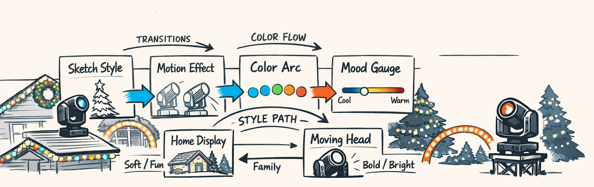
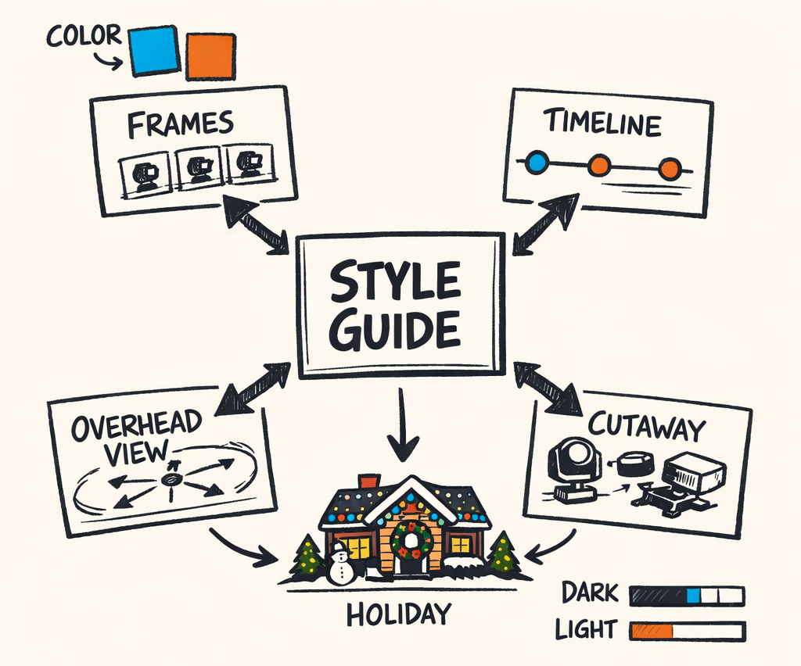
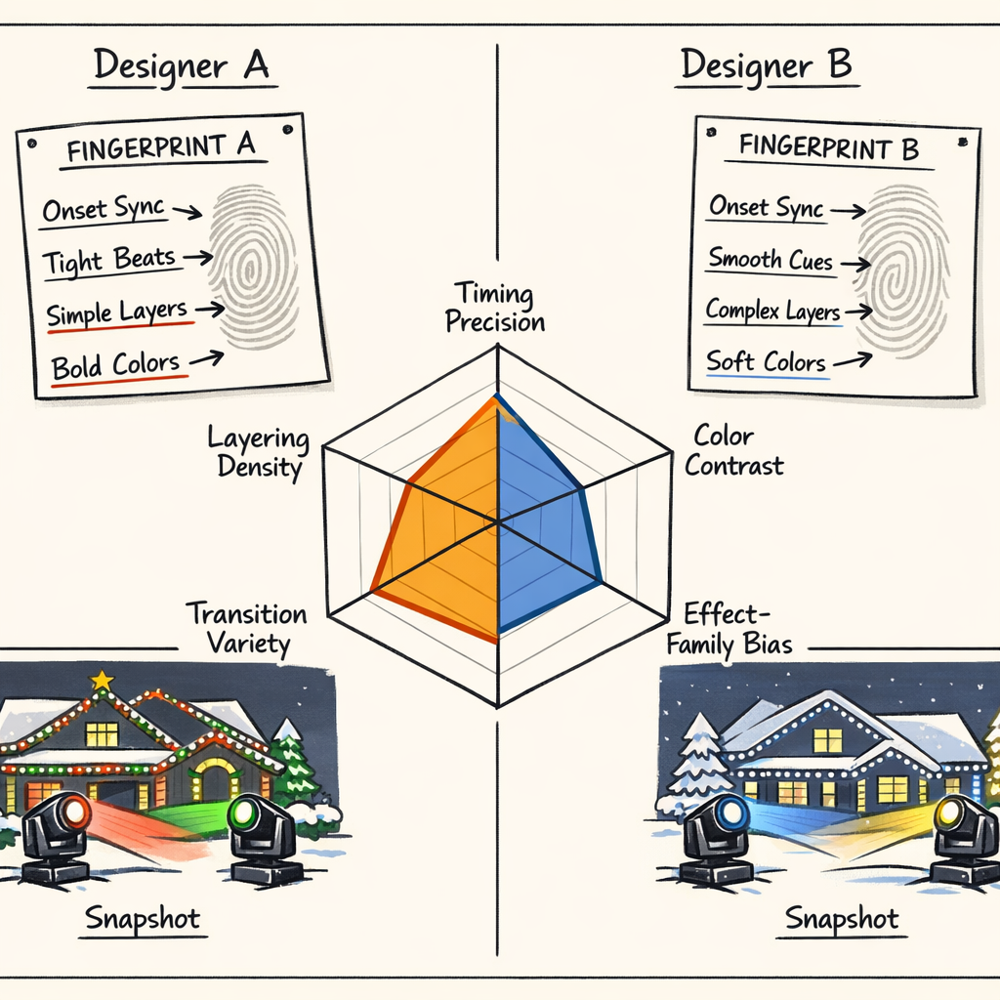
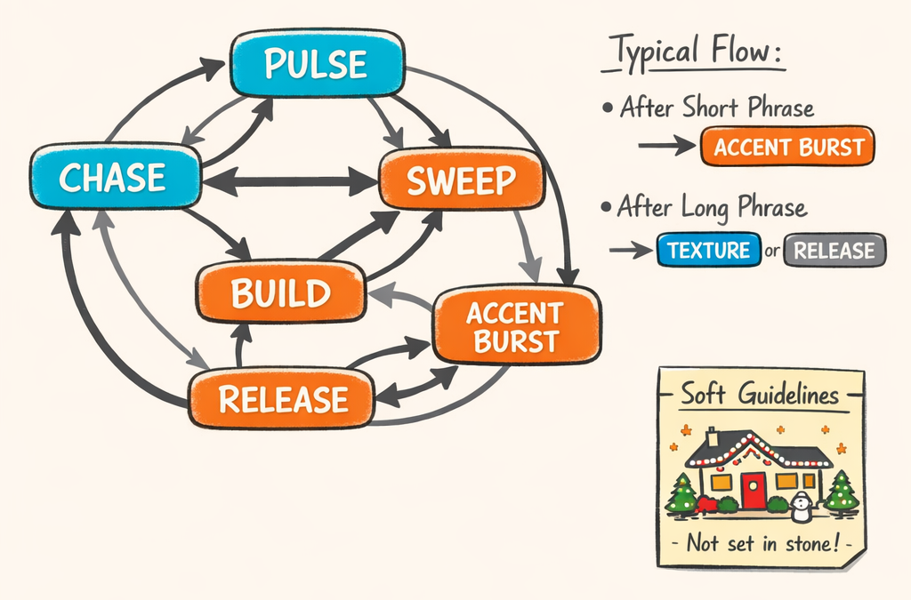
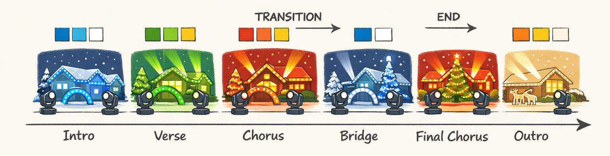
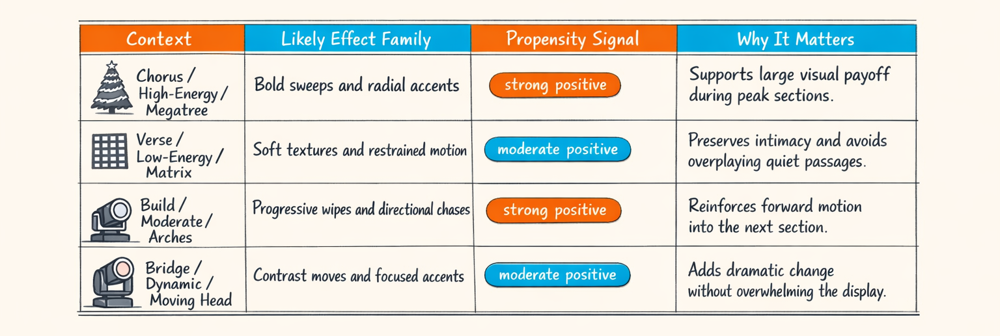
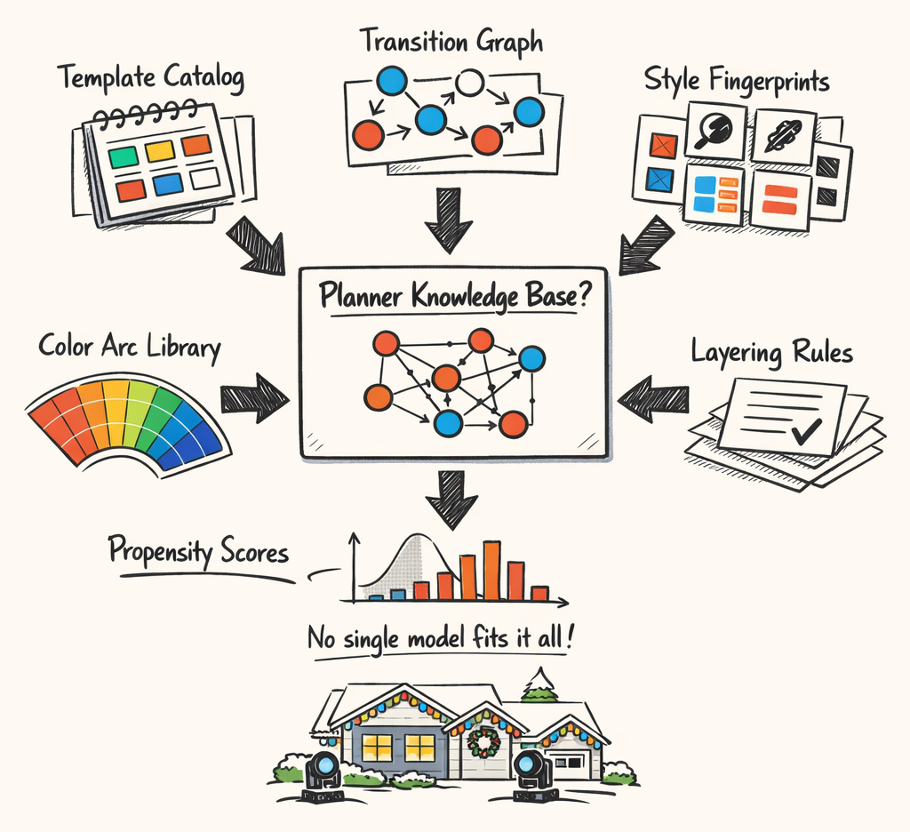

### Part 5: From Patterns to Taste: How the Corpus Learns Style, Flow, and Color Drama

---
title: "From Patterns to Taste: How the Corpus Learns Style, Flow, and Color Drama"
series: "The Feature Engineering Pipeline: Teaching Machines to Read Light Shows"
part: 5
tags: [ai, llm, python, christmas-lights, xlights]
---



# From Patterns to Taste: How the Corpus Learns Style, Flow, and Color Drama

Part 4 was the fun one.

We dug through a pile of human-made xLights sequences, mined recurring phrase templates, clustered motifs, and basically asked: *what keeps showing up often enough that it probably means something?* That got us a usable catalog of choreographic building blocks.

Which is great.

It is also wildly insufficient.

Because knowing that a show contains a lot of sweeps, pulses, fan-outs, alternating chases, and color snaps doesn't tell you how a good designer *uses* them. It doesn't tell you what tends to follow what. It doesn't tell you when color stays disciplined for 32 bars and when it suddenly blows the doors off at the chorus. And it definitely doesn't tell you why one sequence feels elegant while another feels like the lighting equivalent of a toddler discovering the "more glitter" button.

So this part is about the layer above templates. The part where the corpus starts acting less like a parts bin and more like accumulated taste.

We extract a few different kinds of higher-order knowledge:

- style fingerprints for "how this designer tends to behave"
- transition models for "what usually follows what"
- color narratives for "how the palette evolves over a song"
- propensity scores for "what effect families show up in what musical contexts"
- layering features for "how dense or sparse the visual stack tends to be"

And then we wire those into a planner-facing knowledge base that can say something more useful than, "Good luck, please select one festive item from the vending machine."

That last version, by the way, is uncomfortably close to how our early planner behaved.

## Templates Tell You What Exists. They Don't Tell You What Comes Next.

Here's the thing about pattern mining: it's great at discovering *nouns*.

You get artifacts. Phrase templates. Repeated motifs. Canonical effect stacks. Little chunks of choreography that happen often enough across the corpus that you can point at them and say, "yeah, that's a thing."

But choreography isn't just nouns. It's grammar.

A mined template tells you that a roofline chase over four beats is common. It does **not** tell you whether designers usually follow that with a hold, a contrast wash, a denser layered phrase, or a moving-head accent on the next downbeat. It doesn't tell you whether that chase tends to show up in verses, choruses, or transitions. It doesn't tell you whether the same designer likes cool palettes with clean boundaries or warm palettes with a lot of crossfading.

So after Part 4, we had a stack of useful template cards and still needed the thing that makes those cards behave like a language.

That's what this layer is for.

We're taking the raw material from the template miner and extracting relationships: sequence, preference, context, style, palette motion, density. Less "what exists in the corpus," more "how the corpus tends to think."

Or at least how it behaves when fed enough Trans-Siberian Orchestra and an unreasonable number of roofline sweeps.



## Style Fingerprints: Quantifying Taste Without Pretending Taste Is Simple

Taste is messy. That's the first honest thing to say here.

If you ask ten lighting designers what makes a sequence feel "clean," you'll get twelve answers, one strong opinion about color discipline, and at least one person who really just wants to talk about timing offsets. Fair enough.

But once we profiled enough sequences, some habits kept showing up consistently enough that we could measure them. Not perfectly. Not philosophically. Just usefully.

That's what `StyleFingerprintExtractor` does. It rolls up recurring sequence-level tendencies into a compact fingerprint the planner can actually use.

At a high level, the dimensions look like this:

- **onset sync** — how tightly effects align to onsets, beats, and phrase boundaries
- **layering density** — how many concurrent visual layers show up, and how often
- **transition preferences** — whether the designer favors hard cuts, holds, ramps, snaps, or contrast moves
- **color usage** — palette breadth, warmth/coolness balance, contrast appetite
- **effect family affinity** — whether someone leans roofline, matrix, megatree, arches, moving heads, and in what mix

So instead of saying "Designer A feels punchier than Designer B," we can say something a little less mystical, like: Designer A has higher onset alignment, lower average layer count, more transition contrast, and a strong bias toward cool high-contrast palettes with short accent phrases.

That's still an approximation. But it's a useful one.

A simplified version of the extractor shape looks like this:

```python
class StyleFingerprintExtractor:
    """Aggregate sequence-level habits into a planner-facing style vector."""

    def extract(self, phrases, transitions, palettes, layout_profile) -> dict:
        return {
            "timing_precision": self._compute_onset_sync(phrases),
            "layering_density": self._compute_layering_density(phrases),
            "transition_preferences": self._compute_transition_bias(transitions),
            "color_usage": self._compute_color_profile(palettes),
            "effect_family_affinity": self._compute_effect_family_affinity(
                phrases, layout_profile
            ),
        }
```

The timing part mattered more than I expected. Some designers play the beat grid like a drum kit: lots of phrase starts right on beat onsets, sharp visual accents on transient-rich moments, very little drift. Others are looser and more phrase-oriented, letting motion span across beats and resolving at section boundaries instead of every rhythmic hit.

That difference shows up in the numbers.

Same with layering. Some sequences stack three or four active families regularly: roofline motion, tree texture, matrix text, and moving-head punctuation all at once. Others stay sparse on purpose. One dominant layer, one support layer, maybe a boundary accent if the chorus earns it. Both can look good. The planner just shouldn't confuse one for the other.

We also use these fingerprints for style-aware planning. If a user wants "more like the clean cinematic designer" versus "more like the maximal holiday chaos gremlin," we can bias the planner accordingly. And yes, blending styles is possible too: 70% one fingerprint, 30% another, with some guardrails so the result doesn't look like two designers fighting in the driveway.

A sketch of the planner-side usage looks like this:

```python
def blend_style_fingerprints(a: dict, b: dict, alpha: float) -> dict:
    """Linear blend for continuous dimensions; keep categorical prefs separate."""
    return {
        "timing_precision": (1 - alpha) * a["timing_precision"] + alpha * b["timing_precision"],
        "layering_density": (1 - alpha) * a["layering_density"] + alpha * b["layering_density"],
        "color_contrast": (1 - alpha) * a["color_usage"]["contrast"] + alpha * b["color_usage"]["contrast"],
        "transition_variety": (1 - alpha) * a["transition_preferences"]["variety"]
        + alpha * b["transition_preferences"]["variety"],
    }
```

This worked better than I expected, mostly because style isn't one thing. It's a pile of boring measurable habits that, when combined, start looking suspiciously like taste.

Which is both satisfying and a little rude to art.



## Transition Modeling: The Planner Shouldn't Need to Guess What Usually Follows a Chase

One of the dumbest behaviors in an early planner build was this: it could choose individually plausible phrases, but the sequence between them felt random.

Not random in the mathematically pure sense. Random in the deeply human sense of "why did we go from a clean roofline chase to a full-field sparkle wall to a static hold to a moving-head fan, all inside eight seconds?" It felt like someone was pulling cards from a festive vending machine and insisting that adjacency was optional.

So we added explicit transition modeling.

The basic idea is very plain first-order Markov modeling:

> Given the current template family, what template family is likely to come next?

No clairvoyance. No deep sequence wizardry. Just "what usually follows this, based on what humans actually did?"

A simplified interface looks like this:

```python
class TransitionModeler:
    def build(self, phrase_templates) -> "MarkovTransitionModel":
        # Count observed transitions between adjacent phrases
        # Bucket by context like section label and phrase duration
        return MarkovTransitionModel.from_observations(phrase_templates)


class MarkovTransitionModel:
    def next_distribution(
        self,
        current_template_id: str,
        *,
        duration_bucket: str | None = None,
        section_type: str | None = None,
    ) -> dict[str, float]:
        """Return P(next_template | current_template, optional context)."""
```

The first-order assumption sounds simplistic, and it is. But it buys us a lot for very little complexity. Most local flow decisions in these sequences really are neighborhood effects. Designers establish a visual idea, extend it, contrast it, or resolve it. The immediate previous phrase often carries a lot of predictive signal.

The part that mattered more than the base Markov logic was **duration conditioning**.

Because "what follows a chase" depends heavily on whether that chase was a two-beat accent or a sixteen-beat phrase.

A short chase often behaves like punctuation. It tends to be followed by another accent, a hit, a cut, or a quick contrast phrase. A long chase behaves more like a sustained state. It more often resolves into a hold, broad wash, boundary transition, or a denser layer handoff.

That means we don't just ask:

- `P(next | chase)`

We ask things more like:

- `P(next | chase, short_phrase, chorus)`
- `P(next | chase, long_phrase, verse)`
- `P(next | chase, medium_phrase, build)`

And suddenly the planner stops doing weird jump cuts quite so often.

A trimmed-down example of the scoring logic looks like this:

```python
def score_next_templates(
    model: MarkovTransitionModel,
    current_template_id: str,
    *,
    duration_ms: int,
    section_type: str,
) -> dict[str, float]:
    duration_bucket = (
        "short" if duration_ms < 2000 else
        "medium" if duration_ms < 6000 else
        "long"
    )

    base = model.next_distribution(
        current_template_id,
        duration_bucket=duration_bucket,
        section_type=section_type,
    )

    # Planner uses this as a soft prior, not a hard gate.
    return base
```

A concrete example from corpus behavior:

- after a **short chorus accent chase**, common followers were high-contrast hits, pulse stacks, or immediate mirrored repeats
- after a **long verse chase**, common followers were lower-motion holds, color drift phrases, or a sparse support layer entering underneath
- after a **build phrase**, common followers often shifted toward expansion: more fixtures, more contrast, stronger downbeat articulation

That doesn't mean every good sequence does this. It means enough of them do that the planner should know it's normal.

And that's the key distinction we'll come back to in Part 7: these transitions are **soft constraints**, not laws. They're priors. Nudges. A way to make the planner less clueless without turning it into a rigid imitation machine.

Still, even a humble Markov model was a huge quality jump.

Turns out "don't make bizarre local jumps every four beats" is a surprisingly effective design principle.



## Color Narrative: The Song Has a Palette Story Too

Motion gets all the attention because it's easy to point at.

Color is what viewers remember.

If a sequence changes from icy blues in the intro to warm golds in the pre-chorus and then detonates into red/green contrast in the chorus, people feel that shift immediately. Sometimes more immediately than they notice whether the arches did a left-right chase or a center-out pulse. Motion matters, sure. But color is often the most obvious emotional signal in the whole display.

So we started treating palette evolution as its own extractable structure.

`ColorNarrativeExtractor` looks at palette usage over time and across sections. `ColorArcExtractor` summarizes the macro journey: how the show moves from one palette regime to another, where contrast spikes happen, and how boundaries are visually marked.

The shape is roughly like this:

```python
class ColorNarrativeExtractor:
    def extract(self, phrases, sections) -> dict:
        return {
            "section_palettes": self._palettes_by_section(phrases, sections),
            "boundary_contrast": self._boundary_contrast(phrases, sections),
            "dominant_hues": self._dominant_hue_sequence(phrases),
        }


class ColorArcExtractor:
    def extract(self, narrative: dict) -> dict:
        return {
            "macro_arc": self._summarize_arc(narrative["section_palettes"]),
            "contrast_peaks": self._find_boundary_peaks(narrative["boundary_contrast"]),
            "palette_regimes": self._cluster_palette_phases(narrative),
        }
```

The section-level part is straightforward and useful. We can ask:

- what palettes dominate intros versus choruses?
- where do warm/cool shifts happen?
- how much boundary contrast tends to appear between adjacent sections?
- does the sequence keep a disciplined palette family for long stretches, or mutate constantly?

Some songs have very obvious color journeys. Intro in cool whites and blue. Verse stays restrained. Build adds amber. Chorus goes full saturated contrast. Bridge strips back to monochrome. Final chorus opens everything up. It's practically screenplay structure, except with LEDs and a suspicious number of candy-cane props.

Other sequences are much flatter, color-wise. Same family all the way through, with motion doing the expressive work. That's also a valid stylistic choice, and the extractor captures that too.

One useful metric here is boundary contrast: how strongly the palette changes at section transitions. Designers often announce a new section with color before motion. That's especially true on residential displays where viewers can read broad palette changes from farther away than subtle fixture articulation.

A simplified boundary computation looks like this:

```python
def boundary_palette_shift(prev_palette: dict, next_palette: dict) -> float:
    """Estimate perceptual contrast between adjacent section palettes."""
    hue_delta = abs(prev_palette["avg_hue"] - next_palette["avg_hue"])
    sat_delta = abs(prev_palette["avg_saturation"] - next_palette["avg_saturation"])
    val_delta = abs(prev_palette["avg_value"] - next_palette["avg_value"])
    return 0.5 * hue_delta + 0.3 * sat_delta + 0.2 * val_delta
```

Later, the planner uses this extracted palette library as context shaping. If the song structure suggests a big chorus arrival, and the corpus says this style tends to mark chorus boundaries with high-contrast palette expansion, that's a pretty good hint. Not a command. Just a useful whisper from the training data saying, "humans often did something dramatic here, maybe don't fade politely into beige."

And yes, we had a version of the system that overused rainbow transitions because they scored as "high contrast." That was technically true and aesthetically criminal.



## Propensity Scores: What Goes Where, Statistically Speaking

Some effect families just like certain musical contexts.

Not always. Not universally. But enough that it would be silly to ignore.

Megatree spirals show up more often in big chorus moments than in delicate intros. Matrix text and low-motion texture show up more often in quieter verse space than in full-send drops. Moving heads tend to get called in when the music has dynamic motion worth pointing at. Arches love builds. Rooflines are basically willing to do anything if you ask nicely.

That pattern is what `PropensityMiner` is for. It computes conditional affinity between effect families and musical contexts.

The conditioning dimensions are intentionally simple:

- **section type** — intro, verse, pre-chorus, chorus, bridge, build, outro
- **energy level** — low, moderate, high, dynamic
- **fixture type** — megatree, matrix, arches, roofline, moving head, and so on

So instead of one global score for an effect family, we get context-specific tendencies.

A simplified shape looks like this:

```python
class PropensityMiner:
    def mine(self, phrase_events) -> dict:
        # Estimate P(effect_family | section_type, energy_level, fixture_type)
        return self._conditional_affinity_map(phrase_events)

    def score(
        self,
        *,
        section_type: str,
        energy_level: str,
        fixture_type: str,
    ) -> dict[str, float]:
        """Return propensity signals for likely effect families."""
```

This turned out to be one of the most practical planner hints in the stack, mostly because it's humble. It doesn't try to understand the whole sequence. It just says, "given this kind of musical moment on this kind of prop, what do humans tend to pick?"

And again, *tend to* is the key phrase.

We are not turning this into a law engine. If the planner wants to put a sparse shimmer on a megatree during a high-energy chorus for a deliberate contrast move, great. It just shouldn't do that accidentally because it has no idea what's typical.

Here's the planner-facing intuition in image form:



And here's the kind of query we actually want to support:

```python
def planner_propensity_hint(propensity_miner, context) -> dict[str, float]:
    return propensity_miner.score(
        section_type=context.section_type,
        energy_level=context.energy_level,
        fixture_type=context.fixture_type,
    )
```

In practice, this becomes a ranking prior. It boosts families that fit the context and lightly penalizes ones that look statistically odd for that moment. Not impossible. Just less preferred unless something else in the plan strongly supports them.

Which is exactly what you want.

A planner that knows common pairings is useful.
A planner that *obeys* common pairings like a tiny bureaucrat is not.

## Layering: The Difference Between Elegant and Aggressively Festive

Layering is one of those things you notice instantly when it's wrong and barely notice when it's right.

A good sequence controls visual complexity. It knows when to run one dominant idea cleanly, when to add support texture underneath, and when to stack enough simultaneous action that the yard looks gloriously overcommitted. A bad sequence just keeps adding layers until every prop is shouting.

So we extract layering features explicitly with `LayeringFeatureExtractor`.

The core ideas are pretty simple:

- **density** — how many concurrent active layers are present
- **depth** — how many distinct effect families or fixture groups participate at once
- **section patterns** — whether layering ramps up in choruses, drops in bridges, stays stable in verses, and so on

A simplified extractor shape looks like this:

```python
class LayeringFeatureExtractor:
    def extract(self, phrases) -> dict:
        return {
            "avg_density": self._average_active_layers(phrases),
            "max_density": self._peak_layer_count(phrases),
            "section_patterns": self._density_by_section(phrases),
            "depth_profile": self._family_depth_profile(phrases),
        }
```

This acts as a complexity control for planning.

If a target style fingerprint says "clean and sparse," the planner should hesitate before stacking roofline motion, matrix texture, megatree spin, arch chase, and moving-head sweep all in the same four-beat window like it's trying to win a holiday custody battle. If the target style is denser and more theatrical, then by all means, let the yard become an extremely coordinated problem.

Layering also ties directly back into style fingerprints. Some designers build deep stacks habitually. Others are disciplined minimalists. Both can be excellent. The difference is that the planner needs to know which kind of visual sentence it's trying to write before it starts piling on clauses.

## The Knowledge Graph, or Why We Ended Up With a Constellation Instead of One Model

At some point we had to admit a slightly annoying truth: no single model wanted to represent all of this cleanly.

Templates are discrete recurring artifacts.
Transitions are probabilistic edges.
Style fingerprints are aggregate behavioral vectors.
Color arcs are temporal palette summaries.
Propensity scores are conditional affinities.
Layering expectations are complexity priors.

You *can* force all of that into one giant learned representation if you're feeling brave, caffeinated, and insufficiently attached to interpretability. We tried a few versions of that thinking. What we got was a mushy latent soup that was hard to debug and even harder to trust.

So we ended up with a constellation instead.

One planner-facing knowledge base, assembled from multiple corpus-level artifacts, each doing one job reasonably well.

That means the planner can ask different questions of different structures:

- "What templates are available for this phrase shape?"
- "What usually follows this template in this context?"
- "How dense should this section feel for this style?"
- "What palette regime fits this song arc?"
- "Which effect families are statistically comfortable on this fixture here?"

That's not as elegant as one magical universal model. It is, however, vastly easier to inspect when something goes off the rails.

And things do go off the rails.

When the planner suddenly starts overusing high-contrast palette jumps in bridges, we can inspect the color arc and transition priors separately. When it gets too dense in verses, we can check layering expectations without wondering what secret neuron developed a grudge against restraint.

So this is the handoff point.

Part 4 gave us the building blocks.
This part gave us the relationships and biases that make those blocks behave like a style system.
Part 6 is where some of those mined artifacts earn a promotion: they become planner-approved recipes and adapter contracts that can actually boss the lights around in production.

Which is where the fun starts again, and where we discover that "planner-approved" does not automatically mean "good idea."



> The recurring theme here is embarrassingly simple: good choreography is relational. A phrase means something partly because of what it is, but mostly because of where it appears, what surrounds it, how it transitions, what colors carry it, and how much else is happening at the same time.

That took us a while to admit.

Mostly because "mine templates and call it done" was a much easier plan.

---

## About twinklr


twinklr is our ongoing science experiment in weaponizing holiday cheer. It's an AI-driven choreography and composition engine that takes an audio file and spits out fully synchronized sequences for Christmas light displays in xLights — because apparently we looked at a normal, peaceful hobby and thought, "What if we added AI, machine learning and sleepless nights?"

Here's the honest disclaimer: we're not professional lighting designers. We're developers, engineers, and AI researchers who spend our days building at the frontier of AI… and our nights obsessing over why a dimmer curve feels "late" by half a beat and whether a roofline sweep should be dramatic or merely aggressively festive. If you're expecting polished stage-production wisdom, you're in the wrong place. If you're into nerdy overengineering, mildly unhinged experimentation, and the occasional "how did that even work?" moment — welcome.

This blog is the running log of our journey: the wins, the faceplants, the weird breakthroughs, and the lessons learned the hard way, often repeatedly. We'll share what we're building, what breaks, and why certain architectural decisions matter — especially when the goal is to turn "song" into "show" without the lights looking like they're having an existential crisis.

If you want to learn alongside us — or jump in and contribute — come say hi on GitHub: https://github.com/bluewatersql/twinklr/tree/main
---

## Illustration Manifest (for this part)

[
  {
    "id": "ILL-05-00",
    "title": "Banner — From Patterns to Taste",
    "post_part": 5,
    "file": "part_05/ILL-05-00.png",
    "placement": "top_of_post",
    "alt": "Banner showing templates connected by transitions, color arcs, and style fingerprints",
    "prompt": "VIEW: A wide banner where mined template cards connect into a richer knowledge web of style fingerprints, transition logic, color arcs, and propensity hints over a residential Christmas display.\nComposition approach: GHOSTED POSITIONS.\nShow template cards linked by arrows, palette swatches flowing across sections, style gauges, and fixture-family affinity notes.\nInclude a house roofline, trees, arches, and upright moving heads on stands or eaves, all clearly residential and festive.",
    "style_profile": "twinklr_sketch_light_v2",
    "model": "gpt-image-1.5",
    "size": "1536x1024",
    "type": "banner",
    "variants": 2,
    "needs_time": false,
    "needs_labels": true,
    "background": "opaque",
    "output_format": "png",
    "quality": "high",
    "composition_approach": "GHOSTED POSITIONS"
  },
  {
    "id": "ILL-05-01",
    "title": "Knowledge Web Overview",
    "post_part": 5,
    "file": "part_05/ILL-05-01.png",
    "placement": "after_section:Templates Tell You What Exists. They Don't Tell You What Comes Next.",
    "alt": "Template cards connected by arrows, palette swatches, and style gauges forming a choreography knowledge web",
    "prompt": "VIEW: Mined template cards expanding into a richer choreography knowledge web with arrows for transitions, palette swatches for color motion, and style gauges for sequence-level habits.\nComposition approach: NETWORK CLUSTER.\nShow phrase templates as labeled cards, with connected notes for sequence, preference, context, style, palette motion, and density.\nInclude a small residential Christmas display at the bottom with roofline, trees, arches, and upright moving heads to anchor the domain. Keep the tone festive and clearly holiday-themed, not concert lighting.",
    "style_profile": "twinklr_sketch_light_v2",
    "model": "gpt-image-1.5",
    "size": "1024x1024",
    "type": "diagram",
    "variants": 2,
    "needs_time": false,
    "needs_labels": true,
    "background": "opaque",
    "output_format": "png",
    "quality": "high",
    "composition_approach": "NETWORK CLUSTER"
  },
  {
    "id": "ILL-05-02",
    "title": "Style Fingerprint Comparison",
    "post_part": 5,
    "file": "part_05/ILL-05-02.png",
    "placement": "after_section:Style Fingerprints: Quantifying Taste Without Pretending Taste Is Simple",
    "alt": "Two designer style fingerprints overlaid across timing precision, layering density, transition variety, color contrast, and effect-family bias",
    "prompt": "VIEW: Two designer style fingerprints compared on the same visual profile, showing measurable habits without pretending style is fully solved.\nComposition approach: SPLIT PANEL.\nLeft side: designer A fingerprint card and associated display snapshot.\nRight side: designer B fingerprint card and associated display snapshot.\nCenter overlay: radar-chart style comparison with axes labeled timing precision, layering density, transition variety, color contrast, effect-family bias.\nUse small notes showing onset sync, layering, and color usage feeding the fingerprint. Keep the display snapshots residential and holiday-themed.",
    "style_profile": "twinklr_sketch_light_v2",
    "model": "gpt-image-1.5",
    "size": "1024x1024",
    "type": "diagram",
    "variants": 2,
    "needs_time": false,
    "needs_labels": true,
    "background": "opaque",
    "output_format": "png",
    "quality": "high",
    "composition_approach": "SPLIT PANEL"
  },
  {
    "id": "ILL-05-03",
    "title": "Transition Graph",
    "post_part": 5,
    "file": "part_05/ILL-05-03.png",
    "placement": "after_section:Transition Modeling: The Planner Shouldn't Need to Guess What Usually Follows a Chase",
    "alt": "Directed transition graph with weighted edges between template nodes and duration-conditioned notes",
    "prompt": "VIEW: A directed graph of template families with weighted edges showing likely transitions, plus a side note explaining duration-conditioned behavior.\nComposition approach: OVERHEAD VIEW.\nShow nodes such as chase, pulse, sweep, build, accent burst, release, texture.\nUse thicker arrows for stronger transition probabilities.\nAdd a side annotation comparing what tends to follow a short phrase versus a long phrase.\nInclude a tiny planner card noting these are soft constraints, not hard rules. Use festive template colors and a small house display icon.",
    "style_profile": "twinklr_sketch_light_v2",
    "model": "gpt-image-1.5",
    "size": "1024x1024",
    "type": "diagram",
    "variants": 2,
    "needs_time": false,
    "needs_labels": true,
    "background": "opaque",
    "output_format": "png",
    "quality": "high",
    "composition_approach": "OVERHEAD VIEW"
  },
  {
    "id": "ILL-05-04",
    "title": "Color Arc Timeline",
    "post_part": 5,
    "file": "part_05/ILL-05-04.png",
    "placement": "after_section:Color Narrative: The Song Has a Palette Story Too",
    "alt": "Timeline with labeled sections and evolving palette swatches from intro to outro",
    "prompt": "VIEW: A section-by-section color narrative showing how palette choices evolve across a song.\nComposition approach: TIMELINE AXIS.\nShow intro, verse, chorus, bridge, final chorus, outro as labeled blocks.\nFor each section, include palette swatches and a tiny display vignette showing the dominant colors on roofline, trees, arches, and upright moving heads.\nHighlight contrast at section boundaries and the macro color journey from start to finish.",
    "style_profile": "twinklr_sketch_light_v2",
    "model": "gpt-image-1.5",
    "size": "1024x1024",
    "type": "diagram",
    "variants": 2,
    "needs_time": true,
    "needs_labels": true,
    "background": "opaque",
    "output_format": "png",
    "quality": "high",
    "composition_approach": "TIMELINE AXIS"
  },
  {
    "id": "ILL-05-05",
    "title": "Propensity Scores Table",
    "post_part": 5,
    "file": "part_05/ILL-05-05.png",
    "placement": "after_section:Propensity Scores: What Goes Where, Statistically Speaking",
    "alt": "Table of musical contexts and likely effect families with propensity signals",
    "prompt": "VIEW: A 4-column table summarizing conditional effect-family propensities in different musical and fixture contexts.\nCreate a table illustration with exact headers: Context | Likely Effect Family | Propensity Signal | Why It Matters\nRow 1: chorus/high-energy/megatree | bold sweeps and radial accents | strong positive | supports large visual payoff during peak sections\nRow 2: verse/low-energy/matrix | soft textures and restrained motion | moderate positive | preserves intimacy and avoids overplaying quiet passages\nRow 3: build/moderate/arches | progressive wipes and directional chases | strong positive | reinforces forward motion into the next section\nRow 4: bridge/dynamic/moving head | contrast moves and focused accents | moderate positive | adds dramatic change without overwhelming the display\nAdd tiny fixture icons inside or beside the Context cells where helpful. Keep the text exact and readable.",
    "style_profile": "twinklr_sketch_light_v2",
    "model": "gpt-image-1.5",
    "size": "1536x1024",
    "type": "table",
    "variants": 1,
    "needs_time": false,
    "needs_labels": true,
    "background": "opaque",
    "output_format": "png",
    "quality": "high",
    "composition_approach": "TABLE_LAYOUT_PROPENSITY"
  },
  {
    "id": "ILL-05-06",
    "title": "Knowledge Graph Assembly",
    "post_part": 5,
    "file": "part_05/ILL-05-06.png",
    "placement": "after_section:The Knowledge Graph, or Why We Ended Up With a Constellation Instead of One Model",
    "alt": "Assembly of template catalog, transition graph, style constraints, color arcs, propensity scores, and layering expectations into one planner-facing knowledge base",
    "prompt": "VIEW: Multiple corpus-level artifacts assembling into one planner-facing knowledge base, like a constellation rather than a single monolithic model.\nComposition approach: CUTAWAY/EXPLODED.\nShow separate artifact modules: template catalog, transition graph, style fingerprint set, color arc library, propensity scores, layering expectations.\nArrows converge into a central planner knowledge base card.\nUse a small note that no single model captured all relationships cleanly. Add a tiny residential display at the bottom as the real-world target.",
    "style_profile": "twinklr_sketch_light_v2",
    "model": "gpt-image-1.5",
    "size": "1024x1024",
    "type": "diagram",
    "variants": 2,
    "needs_time": false,
    "needs_labels": true,
    "background": "opaque",
    "output_format": "png",
    "quality": "high",
    "composition_approach": "CUTAWAY/EXPLODED"
  },
  {
    "id": "ILL-05-07",
    "title": "Index Card — Knowledge Web of Taste",
    "post_part": 5,
    "file": "part_05/ILL-05-07.png",
    "placement": "end_of_post",
    "alt": "Thumbnail-style knowledge web of template cards, arrows, palette swatches, and style gauges",
    "prompt": "VIEW: A bold square thumbnail showing template cards connected by arrows, palette swatches, and style gauges in a compact knowledge web.\nComposition approach: FOCAL ZOOM with the central knowledge web large and simple.\nInclude a tiny festive house display icon to anchor the domain.",
    "style_profile": "twinklr_sketch_light_v2",
    "model": "gpt-image-1.5",
    "size": "1024x1024",
    "type": "index_card",
    "variants": 2,
    "needs_time": false,
    "needs_labels": true,
    "background": "opaque",
    "output_format": "png",
    "quality": "high",
    "composition_approach": "FOCAL ZOOM"
  }
]
