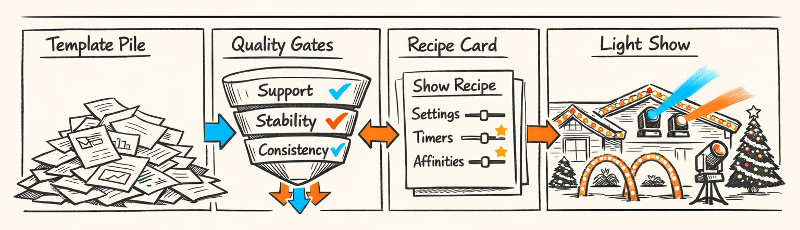
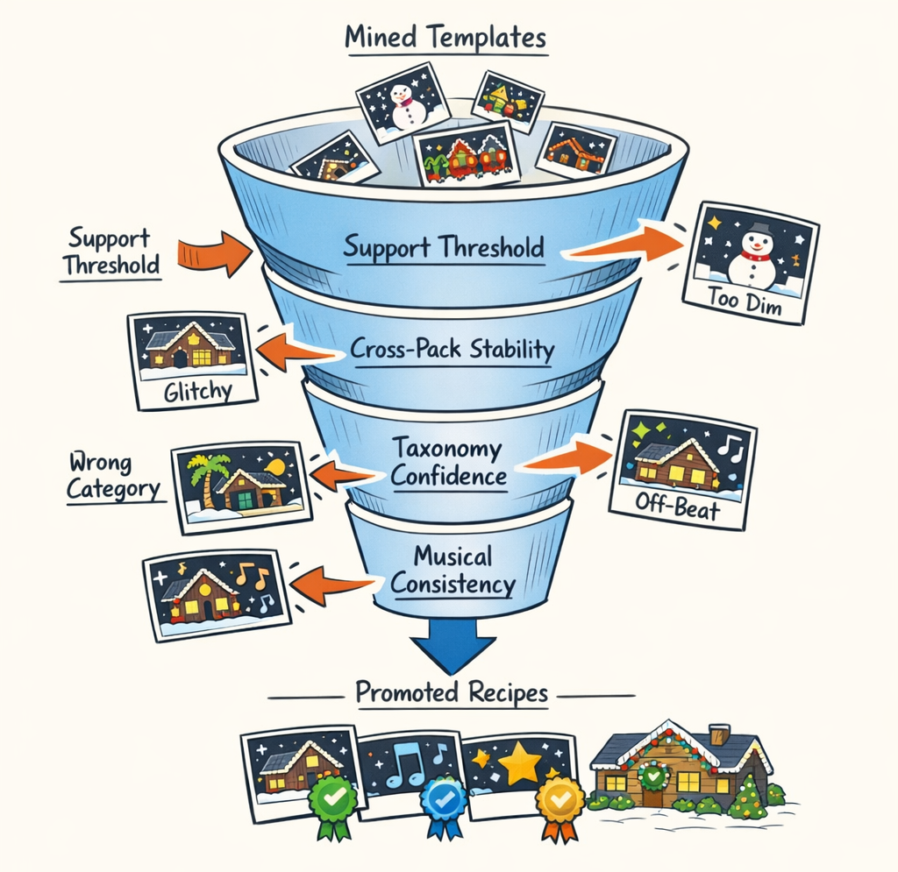
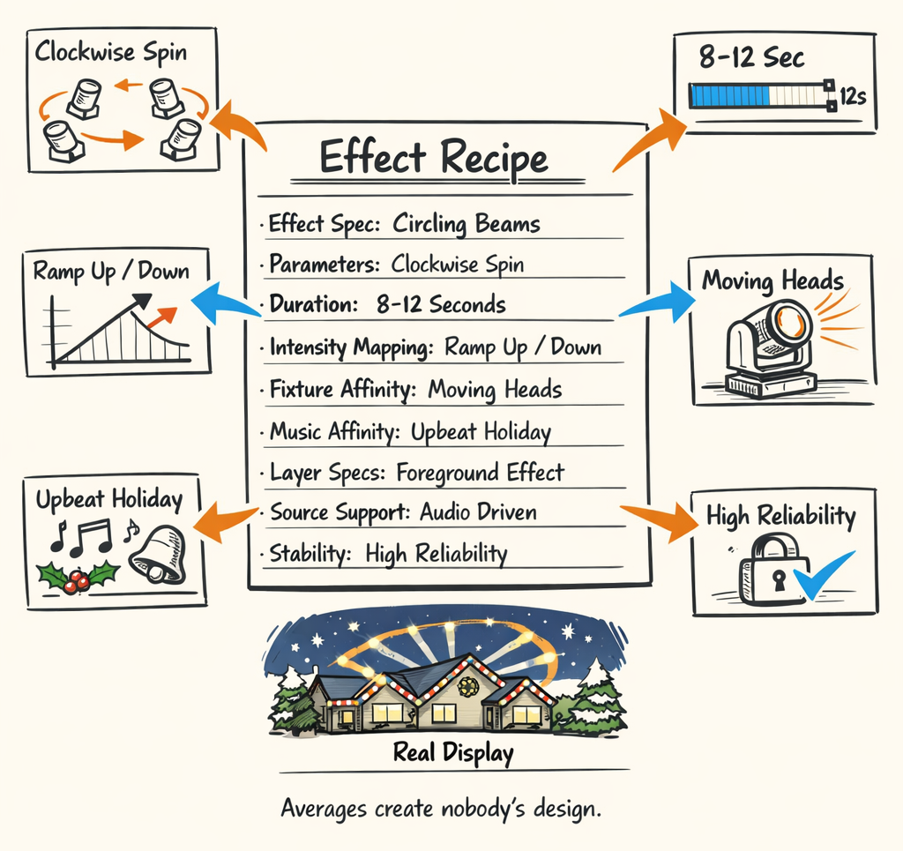
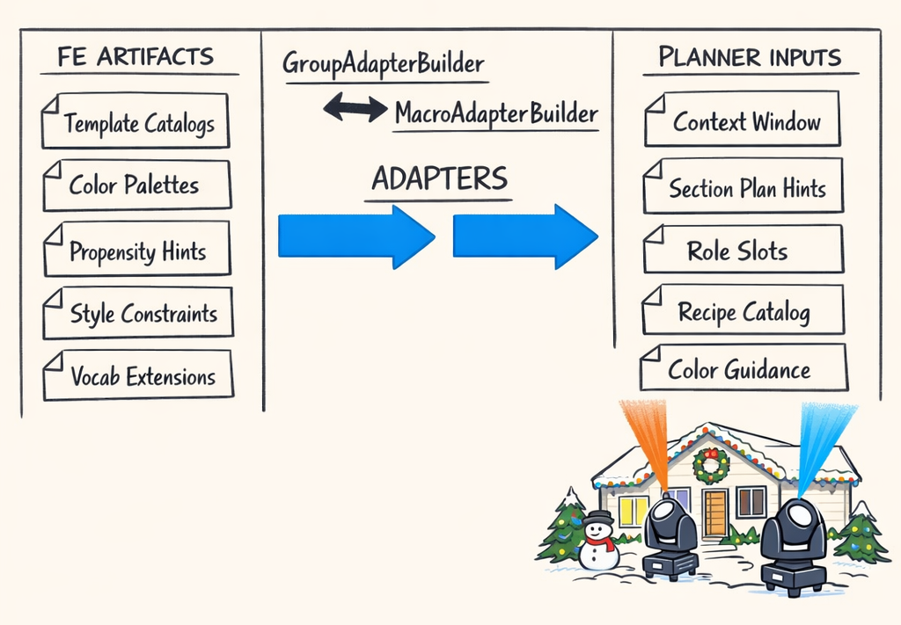
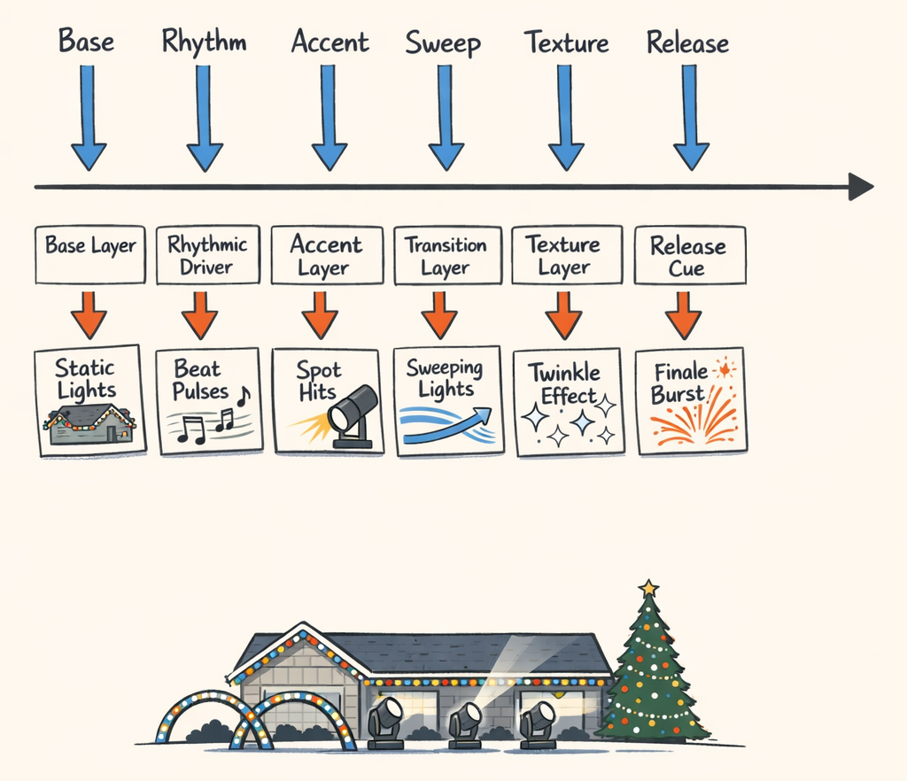
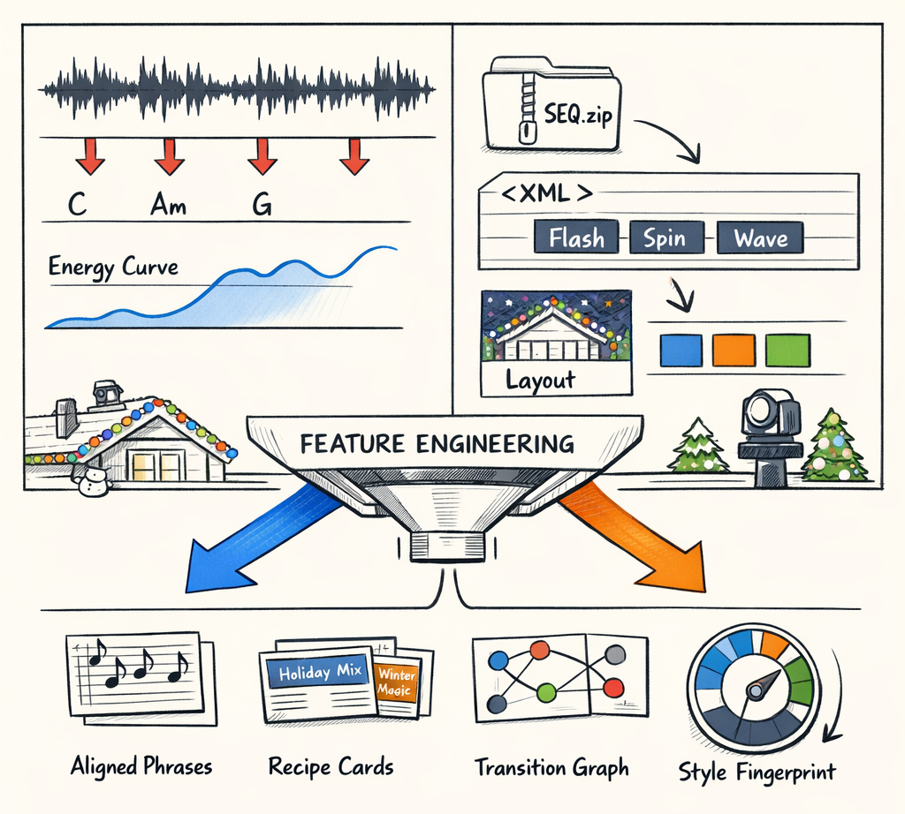
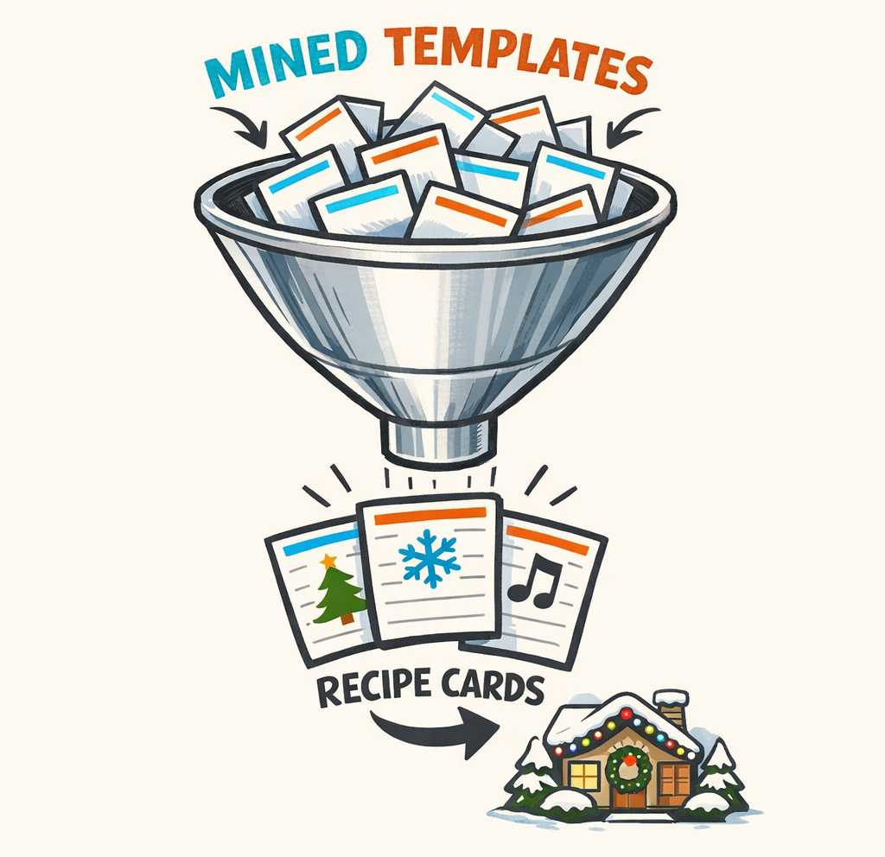

# Promoted to Production: When a Mined Pattern Earns the Right to Boss the Lights Around

By the time we got through Parts 4 and 5, we had something that looked suspiciously like knowledge.

Not wisdom. Let's not get carried away. But definitely knowledge.

We had recurring templates mined from real xLights sequences. We had support counts, taxonomy labels, context fingerprints, transition tendencies, color behaviors, and enough corpus statistics to convince ourselves we weren't just overfitting to one particularly enthusiastic house in Ohio. The feature engineering stack had gone from "parse weird XML and hope for the best" to "maybe the corpus is actually telling us how humans choreograph moving heads."

And then we hit the awkward question.

What exactly do you *do* with a mined pattern?

Because a frequent pattern is still just an observation. It's the machine equivalent of saying, "Huh, a lot of designers seem to do a fan-out sweep on the chorus." That's interesting. It is not yet a thing you want the planner using at 11:47 PM to generate an actual production sequence for roofline fixtures attached to a real house.

This is where feature engineering stops being a fun analysis project and starts becoming operational. Which is always less glamorous and more important.

So Part 6 is about promotion. Not the HR kind. The pipeline kind.

We're going to take mined templates and run them through actual gates: support, stability, taxonomy confidence, and musical context consistency. The survivors get synthesized into executable `EffectRecipe` objects. Those recipes get merged with our hand-crafted builtins. Then adapters translate the whole pile into planner-friendly contracts, because letting the sequencer parse raw mining artifacts directly would be the software equivalent of letting a toddler drive a forklift.

If Part 4 was "we found patterns" and Part 5 was "we found taste," this is the post where some of that knowledge earns the right to boss the lights around.

## Not Every Pattern Deserves a Badge and a Pension

Here's the thing: a mined template and a trusted recipe are not the same object.

A mined template says, "we observed this shape enough times that it's probably real." A trusted recipe says, "we're comfortable putting this into the planner's vocabulary and letting it affect generated output." Those are very different levels of confidence, and pretending otherwise is how you end up with a sequencer that confidently reenacts one designer's extremely specific obsession with diagonal cyan sweeps every time the snare gets excited.

Frequency alone isn't enough. It helps, obviously. If a pattern shows up 48 times across the corpus, that's more interesting than one that appears twice. But support by itself is a terrible promotion policy. One pack can dominate counts. One designer can repeat themselves. One weird layout can create a pattern that looks common only because the fixture geometry made it easy.

So the gates from Parts 4 and 5 stop being descriptive and start becoming consequential.

Support matters. Cross-pack stability matters. Taxonomy confidence matters. Musical context consistency matters. If a pattern only behaves coherently in one narrow pocket of the corpus, that's still useful knowledge — but it's not planner vocabulary yet.

Which sounds harsh, but it saved us from a lot of nonsense.

We had plenty of patterns that were frequent, flashy, and completely untrustworthy. Some were too layout-specific. Some had taxonomy labels that wobbled between categories depending on the clustering run. Some looked stable until you checked where they appeared musically and realized they were equally likely to show up in intros, bridges, and random dead air. That's not a recipe. That's a vibe.

The promotion step is basically our way of saying: congratulations, you are no longer just an interesting anecdote.



## Inside the Promotion Pipeline

The code that makes this judgment call lives in `packages/twinklr/core/feature_engineering/recipes/promotion.py`, and the main character is, very sensibly, `PromotionPipeline`.

The shape of the thing is straightforward: feed it mined template candidates plus their corpus-level metadata, and it decides which ones get promoted, which ones get rejected, and why. The "why" mattered a lot more than I expected. A reject list with reasons turned out to be absurdly useful for debugging thresholds and for revisiting old candidates after the corpus grew.

At a high level, the pipeline looks something like this:

```python
class PromotionPipeline:
    def promote(
        self,
        template_catalog,
        taxonomy_index,
        context_stats,
        corpus_stats,
    ) -> PromotionResult:
        promoted = []
        rejected = []

        for template in template_catalog.templates:
            decision = self._evaluate_template(
                template=template,
                taxonomy_index=taxonomy_index,
                context_stats=context_stats,
                corpus_stats=corpus_stats,
            )

            if decision.promote:
                promoted.append(template)
            else:
                rejected.append(
                    RejectedTemplate(
                        template_id=template.template_id,
                        reasons=decision.reasons,
                        metrics=decision.metrics,
                    )
                )

        return PromotionResult(promoted=tuple(promoted), rejected=tuple(rejected))
```

Nothing exotic there. The interesting part is `_evaluate_template`, because that's where "seems common" turns into "is safe enough to operationalize."

The criteria line up almost exactly with the work from the last two posts:

```python
def _evaluate_template(self, *, template, taxonomy_index, context_stats, corpus_stats):
    reasons = []

    support = template.support
    pack_span = template.pack_support
    taxonomy_conf = taxonomy_index.confidence_for(template.template_id)
    context_consistency = context_stats.consistency_for(template.template_id)

    if support < self.min_support:
        reasons.append("low_support")

    if pack_span < self.min_pack_support:
        reasons.append("low_cross_pack_stability")

    if taxonomy_conf < self.min_taxonomy_confidence:
        reasons.append("taxonomy_uncertain")

    if context_consistency < self.min_context_consistency:
        reasons.append("musical_context_inconsistent")

    return PromotionDecision(
        promote=not reasons,
        reasons=tuple(reasons),
        metrics={
            "support": support,
            "pack_support": pack_span,
            "taxonomy_confidence": taxonomy_conf,
            "context_consistency": context_consistency,
        },
    )
```

That code is cleaner than the real world. The real world had threshold tuning, exceptions, and a lot of "why did this very normal-looking sweep fail the gate again?" moments. But conceptually, that's it.

The failure modes were pretty predictable once we looked closely:

- **Low support**: genuinely rare patterns, usually interesting but not general enough
- **Low cross-pack stability**: common inside one vendor pack, basically absent everywhere else
- **Taxonomy uncertainty**: the clustering/taxonomy layer couldn't agree whether the thing was a sweep, accent, fan, or some cursed hybrid
- **Musical context inconsistency**: the pattern appeared all over the map, with no clear affinity for phrase positions, energy levels, or section types

And here's the part I didn't appreciate early enough: rejected patterns are not trash.

They're still observations. They still help with analysis. They still tell us what designers *sometimes* do. We just don't let them become first-class planner vocabulary yet.

That "yet" matters. As the corpus grows, support rises. Cross-pack coverage improves. Taxonomy labels stabilize. Today's maybe-pattern can become tomorrow's recipe. Which is nice, because feature engineering is one of the few places in software where hoarding old weird artifacts is occasionally the correct move.


## Recipe Synthesis: Turning Observations Into Instructions

Once a pattern survives promotion, we still have a problem: mined templates are descriptive. The planner needs prescriptive objects.

This is where `packages/twinklr/core/feature_engineering/recipes/recipe_synthesizer.py` comes in. The star of that file is `RecipeSynthesizer`, whose job is to take a cluster of observed instances and collapse it into an `EffectRecipe` the sequencer can actually use.

That means deciding what the recipe *is*, not just what it tended to look like in aggregate.

The rough interface is basically this:

```python
class RecipeSynthesizer:
    def synthesize(self, promoted_template, observed_instances) -> EffectRecipe:
        effect_spec = self._build_effect_spec(promoted_template, observed_instances)
        params = self._synthesize_params(observed_instances)
        duration = self._synthesize_duration_range(observed_instances)
        intensity = self._synthesize_intensity_mapping(observed_instances)
        affinity = self._synthesize_affinities(promoted_template, observed_instances)
        layers = self._synthesize_layers(observed_instances)

        return EffectRecipe(
            recipe_id=f"promoted::{promoted_template.template_id}",
            effect_spec=effect_spec,
            params=params,
            duration_range=duration,
            intensity_mapping=intensity,
            fixture_affinity=affinity.fixture_affinity,
            musical_context_affinity=affinity.musical_context_affinity,
            layer_specs=layers,
            provenance={"source": "promoted_template"},
        )
```

That list of fields is the important part.

An `EffectRecipe` isn't just "use a sweep." It carries enough structure that the planner can apply it in a real section plan without needing to reverse-engineer mining artifacts on the fly. In practice, the synthesized recipe usually includes:

- **Effect spec**: the canonical effect family or execution primitive
- **Parameters**: sweep direction, spread, timing shape, color behavior, motion profile, and similar knobs
- **Duration range**: not a single fixed length, but a plausible min/max envelope
- **Intensity mapping**: how energy or emphasis should scale brightness or movement
- **Fixture affinity**: what kinds of groups or fixture families this recipe likes
- **Musical context affinity**: where it tends to work — chorus, build, accent, phrase-open, phrase-close, and so on
- **Layer specs**: whether it usually runs as base motion, accent punctuation, or a supporting overlay

If that sounds suspiciously like the planner's native language, that's because it is. That's the whole point of synthesis.

One subtle but very important choice here was using **modal values** instead of means for many fields.

Because averages lie.

Or, more precisely, averages produce synthetic designs that no human actually made.

Say a promoted pattern appears across 19 instances. Twelve of them sweep left-to-right. Seven sweep right-to-left. The mean direction is not a thing. It's just an argument at Thanksgiving. Same story for categorical parameters like effect family, palette mode, or layer role. Even some numeric parameters get weird when averaged. If observed durations cluster at 500 ms and 1000 ms, the mean gives you 750 ms — a value that may be technically legal and aesthetically nobody's first choice.

So the synthesizer leans heavily on modal or representative values, with ranges where variation matters.

The shape ends up looking something like this:

```python
def _synthesize_params(self, observed_instances) -> dict[str, object]:
    return {
        # categorical choices use the most common observed value
        "motion_profile": self._mode(observed_instances, "motion_profile"),
        "direction": self._mode(observed_instances, "direction"),
        "color_mode": self._mode(observed_instances, "color_mode"),

        # numeric values get robust summaries, not naive means
        "spread_deg": self._median(observed_instances, "spread_deg"),
        "stagger_ms": self._median(observed_instances, "stagger_ms"),
    }


def _synthesize_duration_range(self, observed_instances) -> dict[str, int]:
    durations = sorted(instance.duration_ms for instance in observed_instances)
    return {
        "min_ms": self._percentile(durations, 0.2),
        "max_ms": self._percentile(durations, 0.8),
        "typical_ms": self._mode_bucket(durations, bucket_ms=100),
    }
```

That "typical bucket" trick saved us from a lot of mushy recipes. We tried mean durations early on, and the result was a catalog full of suspiciously bland timing values that looked statistically respectable and artistically dead. It was like averaging a bunch of dance moves and getting "mild leaning."

The anatomy of a synthesized recipe is easier to grasp with an example:

```python
EffectRecipe(
    recipe_id="promoted::chorus_fan_sweep_v3",
    effect_spec={
        "family": "fan_sweep",
        "execution": "group_motion",
    },
    params={
        "direction": "outward",
        "motion_profile": "ease_out",
        "color_mode": "palette_follow",
        "spread_deg": 62,
        "stagger_ms": 120,
    },
    duration_range={
        "min_ms": 400,
        "max_ms": 1200,
        "typical_ms": 800,
    },
    intensity_mapping={
        "energy_low": 0.45,
        "energy_mid": 0.72,
        "energy_high": 0.94,
    },
    fixture_affinity={
        "moving_head": 0.96,
        "roofline_group": 0.81,
        "wide_span_group": 0.88,
    },
    musical_context_affinity={
        "section:chorus": 0.91,
        "phrase_role:open": 0.76,
        "energy_profile:high": 0.84,
    },
    layer_specs=(
        {"role": "base", "weight": 0.62},
        {"role": "accent", "weight": 0.21},
    ),
)
```

That's not a mined phrase anymore. That's a planner-ready instruction packet.

And it matters that the packet is opinionated. If we leave too much ambiguity in the recipe, the planner has to improvise from half-structured evidence. Then we aren't using mined knowledge; we're just making the sequencer do archaeology.

So synthesis is where we intentionally compress the corpus into defaults, affinities, and guardrails.

Not perfect truths. Just useful ones.



## Builtins, Promoted Recipes, and the Peace Treaty Between Hand-Crafted and Mined Knowledge

We did *not* replace the hand-authored recipe catalog with promoted recipes.

That would've been very funny for about six minutes.

The merged catalog lives on the sequencer side in `packages/twinklr/core/sequencer/templates/group/recipe_catalog.py`, and the operating principle is simple: builtins are the trusted base vocabulary, promoted recipes extend it.

That's the peace treaty.

Builtins still carry precedence because they're hand-tuned, versioned intentionally, and known to behave well across a wide range of layouts. Promoted recipes add coverage and style specificity, but they don't get to casually override something a human already curated unless we make that decision explicitly.

The merge logic is basically:

```python
class RecipeCatalog:
    def build(self, builtin_recipes, promoted_recipes) -> tuple[EffectRecipe, ...]:
        catalog = {recipe.recipe_id: recipe for recipe in builtin_recipes}

        for recipe in promoted_recipes:
            # builtins win collisions by default
            if recipe.recipe_id not in catalog:
                catalog[recipe.recipe_id] = recipe

        return tuple(catalog.values())
```

In practice there's more metadata around source, version, and provenance, because corpus-derived catalogs change over time and planners hate surprises. A recipe catalog that silently shifts under you after a corpus refresh is a great way to make evaluation impossible and debugging miserable.

So we version the promoted side and preserve catalog stability across updates. New corpus run? Fine. Add new promoted recipes. Improve affinities. Retire weak ones deliberately. But don't casually reshuffle IDs or mutate semantics in place unless you're also ready to explain why last week's chorus plan suddenly turned into a polite, confused wiggle.

That builtins-first rule was one of those boring decisions that kept paying rent. The hand-crafted recipes give us a stable floor. The promoted recipes give us a growing ceiling.

And for once, the compromise was less dramatic than the meeting that produced it.

## Adapters: The Border Crossing Between Feature Engineering and Sequencing

This is the seam in the system where I got religion about contracts.

Feature engineering produces rich, messy, corpus-shaped artifacts. Sequencing wants clean, planner-shaped inputs. If you let those layers talk to each other directly, they will absolutely ruin each other's lives.

So we put adapters in the middle.

The relevant code lives in:

- `packages/twinklr/core/feature_engineering/adapters/group_adapter.py`
- `packages/twinklr/core/feature_engineering/adapters/macro_adapter.py`

And the key builders are `GroupAdapterBuilder` and `MacroAdapterBuilder`.

Their job is not to invent new knowledge. Their job is to translate. Think customs officer, not philosopher.

On the feature engineering side, we have things like:

- filtered template catalogs
- promoted recipe sets
- taxonomy labels and confidences
- palette profiles
- propensity hints from Part 5
- style constraints
- corpus-derived vocabulary extensions
- target-role hints

On the planner side, we want compact, explicit inputs that answer questions like:

- what recipe choices are available for this group?
- which colors are preferred or discouraged?
- what section-level behaviors are likely?
- what priors should influence selection weights?
- what constraints should the planner obey without knowing where they came from?

The group adapter is the local translator. It takes group-scoped FE outputs and emits planner-facing recipe and constraint bundles.

```python
class GroupAdapterBuilder:
    def build(self, *, group_profile, promoted_catalog, taxonomy, propensities):
        eligible_recipes = self._filter_recipes_for_group(
            group_profile=group_profile,
            promoted_catalog=promoted_catalog,
        )

        palette = self._build_palette_preferences(group_profile, propensities)
        hints = self._build_propensity_hints(group_profile, propensities)
        vocabulary = self._build_vocabulary_extensions(eligible_recipes, taxonomy)

        return GroupPlannerAdapter(
            group_name=group_profile.name,
            recipe_catalog=eligible_recipes,
            palette_preferences=palette,
            propensity_hints=hints,
            vocabulary_extensions=vocabulary,
        )
```

The macro adapter does the same thing one level up. Instead of one fixture group, it prepares planner inputs for section- or show-level composition: broad style priors, allowed recipe families, cross-group coordination hints, and top-down constraints that shape how the planner should think about a whole musical segment.

```python
class MacroAdapterBuilder:
    def build(self, *, section_profile, recipe_catalog, style_profile, transitions):
        return MacroPlannerAdapter(
            section_type=section_profile.label,
            allowed_recipes=self._filter_for_section(recipe_catalog, section_profile),
            style_constraints=self._style_constraints(style_profile, section_profile),
            transition_hints=self._transition_hints(transitions, section_profile),
            color_arc_preferences=self._color_arc_preferences(style_profile, section_profile),
        )
```

That separation of concerns ended up being more important than any one heuristic inside the adapters.

Feature engineering should not need planner internals to be useful. It should be able to say, "here are the recipes, affinities, and style hints we learned." Full stop.

And planners should not need to parse mining artifacts. They should not care how support was counted, how taxonomy confidence was derived, or which clustering run produced a label. That's FE's mess. The planner gets a contract.

This mattered operationally too. We changed mining thresholds several times without having to rewrite planner logic. We adjusted taxonomy labels without teaching the sequencer a new ontology every week. We revised propensity scoring from Part 5 and the planner just received updated hints through the same adapter shape.

Without adapters, every FE improvement would've become a planner migration.

Which is the kind of architecture mistake that feels "agile" right up until month three.



## Target Roles: Because "Nice Pattern" Still Isn't a Planning Instruction

Even after promotion and adaptation, there was still one annoying gap.

Taxonomy labels are descriptive. Planning roles are operational.

A template might be categorized as a sweep, fan, pulse accent, or texture layer. That's useful, but the planner still needs to know whether that thing should behave like a **base**, **rhythm**, **accent**, or supporting layer inside a section plan.

That's what `packages/twinklr/core/feature_engineering/roles/assigner.py` is for. The `TargetRolesAssigner` bridges corpus vocabulary to planner role slots.

Conceptually it looks like this:

```python
class TargetRolesAssigner:
    def assign(self, recipe, taxonomy_label, context_affinity):
        if taxonomy_label in {"wash", "texture", "slow_sweep"}:
            return "base"

        if taxonomy_label in {"pulse", "beat_chase", "meter_pattern"}:
            return "rhythm"

        if taxonomy_label in {"hit", "strobe_accent", "burst"}:
            return "accent"

        return self._fallback_from_context(context_affinity)
```

The actual implementation is a little less caveman than that, but not *that* much less. A lot of useful systems are just disciplined lookup tables wearing nicer shoes.

The important thing is that role assignment turns "what kind of thing is this?" into "how should the sequencer use this thing?" Once a recipe has a role, the planner can start making structured choices: pick one base layer for continuity, sprinkle rhythm patterns for momentum, reserve accents for phrase edges and impact points.

That role vocabulary is where the handoff becomes real.

And it's also the bridge into Part 7, because once recipes occupy actual planning roles, we can finally ask the uncomfortable question: does any of this improve generated shows, or did we just build an extremely elaborate festive taxonomy machine?



## From Raw Data to Actionable Knowledge, End to End

So let's zoom out, because we've now spent six parts building a machine whose whole job is to turn holiday show debris into planner-ready knowledge.

The arc looks like this:

- **Profiling** gave us structured artifacts from xLights packs: layouts, events, palettes, inventories, metadata. That's the `SequencePackProfiler` layer back in `packages/twinklr/core/profiling/profiler.py`.
- **Audio analysis** gave us beat grids, sections, energy curves, harmony, and dynamic features from the music itself. That's the `AudioAnalyzer` side and all the DSP trouble we lovingly documented in Part 2.
- **Alignment** joined those worlds so effect events stopped being lonely timestamps and started living inside musical context.
- **Phrase extraction and mining** gave us recurring templates and motif families from real human-authored sequences.
- **Knowledge extraction** layered on taxonomy, propensities, transitions, style fingerprints, and context affinities.
- **Promotion** filtered those observations through quality gates so only stable, coherent patterns became trusted recipes.
- **Adapters and role assignment** translated that promoted knowledge into planner-facing contracts the sequencer can actually consume.

Each stage produced an artifact because each stage solved a different problem. Raw XML told us what happened. Audio features told us when music mattered. Alignment told us where those two timelines met. Mining told us what repeated. Taxonomy told us what it *meant*. Promotion told us what we trusted. Adapters told the planner how to use it.

That's the full seven-stage arc of the feature engineering pipeline.

Which means we're finally at the point where the question changes.

It's no longer "can we extract useful knowledge from a corpus of Christmas light shows?"

We think yes.

Now the question is whether that knowledge actually improves planning decisions in production — whether the generated shows feel more coherent, more musical, more human, and less like a large language model got briefly fascinated by synchronized panic.

That's Part 7.

And honestly, it's the only question that really matters.





---

## About twinklr


twinklr is our ongoing science experiment in weaponizing holiday cheer. It's an AI-driven choreography and composition engine that takes an audio file and spits out fully synchronized sequences for Christmas light displays in xLights — because apparently we looked at a normal, peaceful hobby and thought, "What if we added AI, machine learning and sleepless nights?"

Here's the honest disclaimer: we're not professional lighting designers. We're developers, engineers, and AI researchers who spend our days building at the frontier of AI… and our nights obsessing over why a dimmer curve feels "late" by half a beat and whether a roofline sweep should be dramatic or merely aggressively festive. If you're expecting polished stage-production wisdom, you're in the wrong place. If you're into nerdy overengineering, mildly unhinged experimentation, and the occasional "how did that even work?" moment — welcome.

This blog is the running log of our journey: the wins, the faceplants, the weird breakthroughs, and the lessons learned the hard way, often repeatedly. We'll share what we're building, what breaks, and why certain architectural decisions matter — especially when the goal is to turn "song" into "show" without the lights looking like they're having an existential crisis.

If you want to learn alongside us — or jump in and contribute — come say hi on GitHub: https://github.com/bluewatersql/twinklr/tree/main

---