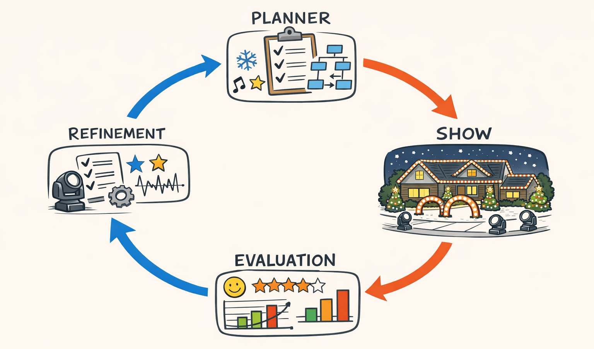
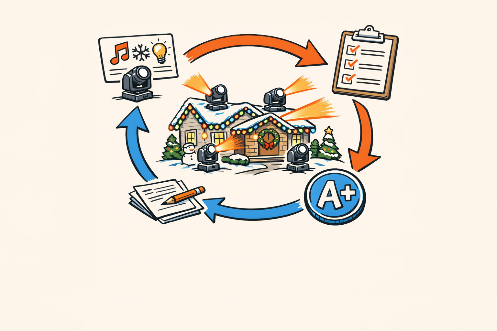
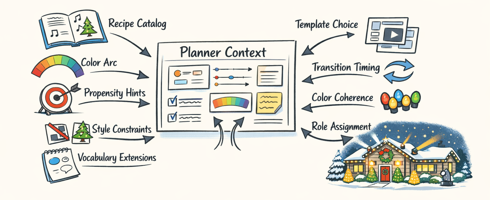
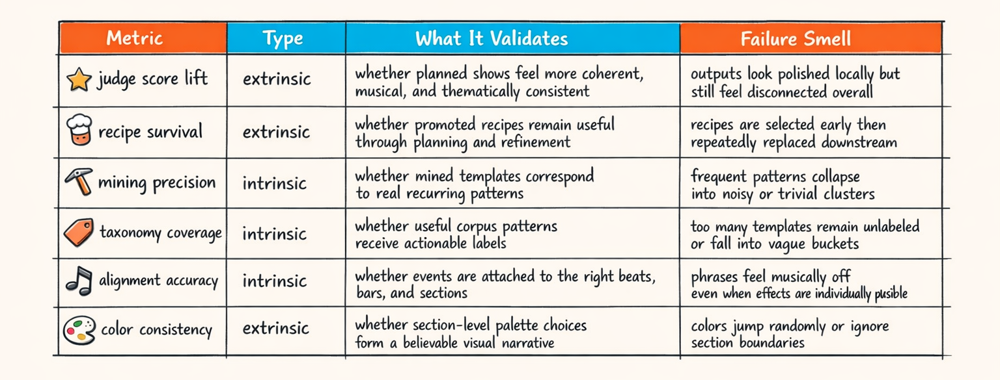
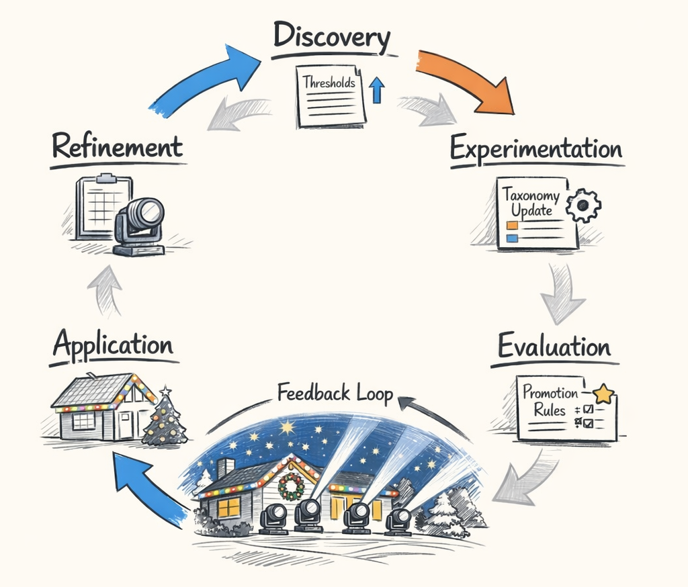
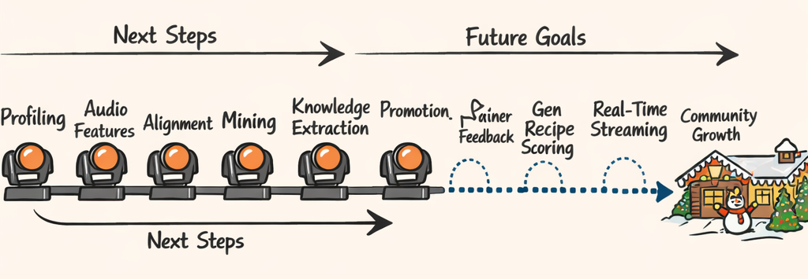

### Part 7: The Feedback Loop That Keeps the Lights From Having an Existential Crisis

---
title: "The Feedback Loop That Keeps the Lights From Having an Existential Crisis"
series: "The Feature Engineering Pipeline: Teaching Machines to Read Light Shows"
part: 7
tags: [ai, llm, python, christmas-lights, xlights]
---



# The Feedback Loop That Keeps the Lights From Having an Existential Crisis

By Part 6, we had a pretty respectable pile of artifacts.

Profiles. Phrase families. Taxonomy labels. Transition models. Color arcs. Promoted recipes. Propensity hints. Enough JSON to make a database therapist ask us how we’re feeling.

And that’s great, but here’s the thing: none of it matters if the final show still looks like the lights are having a disagreement in public.

This whole series started with a very unglamorous idea: maybe human-made xLights sequences already contain choreographic knowledge, and maybe we can extract enough of that knowledge to help an AI planner make better decisions. Not perfect decisions. Better ones. More musical. More coherent. Less “every fixture picked its own personality and now we’re all stuck with it.”

Part 7 is where all the earlier posts get dragged into the real world and judged accordingly.

Ruthlessly, if we’re being honest.

## All of This Only Counts if the Shows Get Better

We can admire the pipeline all day. The profiler can ingest sequence packs cleanly. The audio analyzer can pull out beat grids, section boundaries, energy curves, and harmonic context. The feature pipeline can mine recurring phrases, cluster them, promote some of them into recipes, and build a tiny worldview about how Christmas lights tend to behave when humans are driving.

Cool.

But the practical test is brutally simple: when those artifacts get fed into the planner, do the resulting shows actually improve?

Do they feel more tied to the music?  
Do transitions stop feeling arbitrary?  
Do color changes look intentional instead of emotionally unstable?  
Do groups of moving heads act like a coordinated formation instead of eight tiny robots all freelancing?

That’s the bar.



Every earlier artifact in the series eventually faces that test. The taxonomy from Part 4 doesn’t get credit for being elegant. The color arc machinery from Part 5 doesn’t get points for sounding smart. Promoted recipes from Part 6 don’t earn a gold star just for existing.

They survive only if they improve downstream planning often enough that we keep them around.

Which is honestly kind of refreshing. It’s hard for a bad idea to hide when you can render the output and watch the roofline panic in 4K.

## How the Planner Actually Uses All This Stuff

The important thing about these artifacts is that they shape planner decisions without hard-coding them.

That distinction mattered a lot once we started wiring this into the sequencer, because the planner still needs room to react to the song, the fixture layout, and the current state of the show. If we over-constrain it, the result gets weirdly rigid. If we under-constrain it, it starts making choices with the confidence of a raccoon opening your trash can.

The glue code for this lives in `context_shaping`. That module takes the mined knowledge we’ve been building across the series and turns it into planner-facing context: what recipes are relevant, what styles are plausible, what transitions are common, what color motion tends to cohere, and what vocabulary the planner is even allowed to speak.

At a high level, the planner context ends up looking something like this:

```python
def build_group_planner_context(
    *,
    layout_profile,
    song_analysis,
    phrase_window,
    recipe_catalog,
    taxonomy_catalog,
    transition_model,
    color_arc_hints,
    propensity_hints,
):
    return {
        # executable things the planner can choose from
        "candidate_recipes": select_candidate_recipes(
            phrase_window=phrase_window,
            recipe_catalog=recipe_catalog,
            layout_profile=layout_profile,
        ),
        # soft behavioral guidance
        "style_constraints": derive_style_constraints(
            taxonomy_catalog=taxonomy_catalog,
            phrase_window=phrase_window,
            propensity_hints=propensity_hints,
        ),
        # continuity pressure between neighboring moments
        "transition_guidance": transition_model.lookup(
            previous_label=phrase_window.previous_taxonomy_label,
            current_section=phrase_window.section_label,
        ),
        # keep colors from thrashing around randomly
        "color_guidance": derive_color_guidance(
            color_arc_hints=color_arc_hints,
            harmonic_context=song_analysis.get("harmony"),
            energy_window=phrase_window.energy_window,
        ),
        # extend the planner's language with mined patterns
        "vocabulary_extensions": taxonomy_catalog.active_labels(),
    }
```

That’s simplified, but it captures the real intent: we’re not handing the planner a script. We’re handing it a weighted memory of what tends to work.

### Recipes are the obvious part

Recipes are the clearest artifact because they’re executable. A promoted recipe already survived mining, synthesis, and quality gates. So if the current phrase looks like a strong match for “alternating sweep on grouped roofline movers during medium-high energy chorus,” that recipe goes into the candidate set with a decent prior.

But even there, the planner isn’t forced to use it. Layout compatibility matters. Section context matters. Current visual state matters. A recipe that was great after a gradual build can look ridiculous after a quiet vocal moment.

### Transition guidance is the less glamorous, more important part

The transition model in `markov` turned out to be one of those things that sounds boring until you remove it.

Without transition guidance, the planner can still pick locally reasonable effects. It just has a bad habit of sequencing them like a person shuffling a playlist while blindfolded. Every moment is individually defensible. The whole thing is nonsense.

So we use transition priors to answer questions like:

- after a broad fan-out pattern, what usually follows?
- which taxonomy families naturally hand off into each other?
- when energy drops, what transitions preserve continuity instead of feeling like a hard reset?

That guidance doesn’t dictate the next choice. It just makes the planner less likely to slam from “big symmetric sweep” into “tiny twitchy sparkle” because the LLM got bored.

### Color arcs keep us from inventing new forms of visual whiplash

Color coherence was another place where “looks plausible in isolation” repeatedly failed us.

A single phrase could have great color logic. Then the next phrase would yank the palette somewhere else for no musical reason, and suddenly the whole sequence felt like it was being art-directed by a roulette wheel.

So color arc hints act more like continuity constraints than one-shot suggestions. The planner sees not just “use blue here,” but “the recent palette motion has been cool-to-warm over the last few phrases, and the current harmonic or energy context suggests either continuing that arc or making a deliberate contrast.”

That tiny shift in framing mattered a lot. It changed color from a per-phrase decision into a sequence-level behavior.

### Propensity hints and taxonomy labels shape the planner's taste

The taxonomy work and the pipeline outputs mostly influence planner judgment, not execution.

They tell the planner what kinds of things are common in similar musical situations, which fixture formations tend to support which motion families, and which labels are overused enough that we should probably cool it.

That last one matters more than I expected.

Because once the planner learns a pattern it likes, it really likes it.

Like, “every third phrase is now a mirrored sweep” likes it.

So the context shaper also injects scarcity pressure and anti-repetition constraints. Not because the mined pattern is wrong, but because good choreography has memory.



The best way I can describe the whole setup is this: the feature pipeline gives the planner instincts.

Not commands. Instincts.

And when those instincts are bad, the rendered show lets us know immediately. Usually with great enthusiasm.

## Judge Scores, Survival Rates, and Other Imperfect but Useful Truth Serum

Now for the awkward part: measuring whether any of this helped.

We don’t have a giant gold-labeled benchmark where expert designers scored every possible generated Christmas light show on a 1–10 scale for “tasteful roofline drama.” Tragically, the academic community has failed us here.

So we use practical proxies.

One family of proxies is LLM-as-judge scoring. We render or summarize planner outputs and ask a judge model to score things like:

- thematic consistency
- energy matching
- phrase coverage
- coordination coherence across fixture groups
- transition smoothness
- color continuity

Is that perfect? Absolutely not.  
Is it useful? Annoyingly, yes.

The judge is especially good at spotting “technically valid but obviously awkward” outputs. Stuff like a calm verse getting overly busy motion, or a high-energy chorus where the fixtures somehow look emotionally disengaged.

The other family of proxies is artifact survival.

If a mined recipe gets promoted, how often is it actually selected by the planner? When selected, how often does it survive refinement instead of getting replaced downstream? When it survives, do the final sequences score better than comparable plans without it?

Those are not glamorous metrics, but they’re honest.



A few examples of what we watch:

- **Judge score lift**: does planner output score higher when a feature family is enabled?
- **Recipe survival rate**: does a promoted recipe remain in the final plan, or does it keep getting swapped out because it looked good in mining but awkward in practice?
- **Mining precision**: when we say two phrases belong to the same family, are they actually choreographically similar?
- **Taxonomy coverage**: how much of the corpus lands in meaningful categories versus “miscellaneous shrugging”?
- **Alignment accuracy**: are our phrase and beat associations stable enough that the planner is conditioning on real musical context, not timestamp soup?
- **Color consistency**: do palette transitions stay coherent over time?

Here’s the truth-serum part: a feature can look great intrinsically and still fail downstream.

We had cases where a mined cluster was beautifully tight, semantically interpretable, and absolutely useless in planner output because it represented a pattern that was too layout-specific to generalize. It passed the “data science demo” test and failed the “actual roofline in suburban America” test.

That’s why survival metrics matter. They tell you whether the artifact earned the right to stay in the loop.

> If you can’t tell whether a feature improved planning except by staring at a notebook and nodding thoughtfully, it probably hasn’t earned production influence yet.

## Intrinsic vs. Extrinsic Evaluation: The Old "Looks Right" Problem, but With More JSON

This distinction ended up saving us from several bad decisions.

Intrinsic metrics tell us whether a feature stage is behaving sensibly on its own. Extrinsic metrics tell us whether the planner actually benefits from that stage. Those sound similar until you spend two weeks optimizing the wrong one.

Intrinsic evaluation is the local stuff:

- clustering quality for phrase families
- taxonomy coverage and label separation
- mining precision for recurring motifs
- alignment behavior between sequence events and musical structure
- transition model sparsity and confidence
- recipe promotion pass rates

That’s where you catch broken plumbing. If alignment starts drifting, or a clustering pass collapses half the corpus into one bucket, you want to know before the planner sees any of it.

Extrinsic evaluation is the downstream stuff:

- judge score lift on full planned sequences
- recipe selection and survival
- transition smoothness in rendered output
- color coherence across phrases
- reduction in obvious failure modes like repetition or abrupt resets

The split looks roughly like this in code:

```python
def evaluate_feature_stage(stage_artifacts, planner_outputs):
    intrinsic = {
        "taxonomy_coverage": measure_taxonomy_coverage(stage_artifacts.taxonomy),
        "mining_precision": estimate_pattern_precision(stage_artifacts.patterns),
        "alignment_accuracy": score_alignment(stage_artifacts.alignment),
    }

    extrinsic = {
        "judge_score_lift": compare_judge_scores(
            planner_outputs.with_stage,
            planner_outputs.baseline,
        ),
        "recipe_survival": compute_recipe_survival(planner_outputs.with_stage),
        "color_consistency": score_color_continuity(planner_outputs.with_stage),
    }

    return {"intrinsic": intrinsic, "extrinsic": extrinsic}
```

We needed both because local improvements kept lying to us.

A better taxonomy label set might improve coverage while making planner prompts noisier. A more aggressive mining threshold might produce cleaner clusters but starve the recipe catalog. A transition model with sharper probabilities might look statistically nicer while making generated shows feel repetitive.

So now, whenever a feature stage “improves,” the next question is automatic:

Improves what, exactly?

If the answer is “the internal metric in the notebook,” that’s not enough. We’ve been burned by prettier JSON before.

## The Discovery-to-Application Loop, Looking Back

Looking back, the whole feature pipeline is less like a waterfall and more like a loop that keeps arguing with itself until something useful emerges.

First we do **discovery**: parse sequence packs, enrich events with layout context, align them to musical structure, and hunt for recurring behaviors across the corpus.

Then comes **experimentation**: cluster phrases, propose taxonomy labels, mine transitions, estimate propensities, synthesize candidate recipes, and generally make a lot of hypotheses in machine-readable form.

Then **evaluation** shows up and ruins everyone’s fun.

Some mined patterns are unstable. Some labels are too vague. Some promotion thresholds are too strict. Some are hilariously too loose. More than once we promoted a recipe that was technically valid and aesthetically cursed.

So we refine. Thresholds move. Taxonomy categories split or merge. Promotion rules get adjusted. Context shaping gets less trusting in one area and more permissive in another.

Then those refined artifacts go back into application, where the planner uses them in actual sequence generation.

And the outputs from application feed the next round of discovery.



That was really the thesis all the way back in Part 0: the choreography was already hiding in the XML, but reading it wasn’t enough. We needed a loop that could extract signal, test whether the signal helped, and then revise its own understanding when the answer was “not really.”

That loop now exists.

It’s imperfect. A little noisy. Occasionally embarrassing.

But it’s real, and it changes planner behavior in ways we can render, inspect, and score.

Which is a lot more satisfying than just having a folder full of very sophisticated artifacts.

## What's Next, Besides Sleep

A few next steps are already pretty obvious.

One is **taxonomy v2**. The current taxonomy is useful, but some categories are still too hand-shaped, and a few are carrying more semantic baggage than they should. We want a learned taxonomy that preserves interpretability without freezing our early assumptions into law.

Another is **recipe quality scoring**. Promotion today is gated, but fairly binary. We want richer confidence estimates so the planner can distinguish between “battle-tested recipe” and “interesting but slightly suspicious recipe that maybe shouldn’t lead the chorus.”

There’s also **cross-domain transfer**, which is the polite term for asking whether patterns mined from one layout family or style pocket can teach us anything useful about another. Sometimes yes. Sometimes absolutely not. A roofline behavior does not automatically become a yard-prop behavior just because both are festive.

And then there’s the one I’m most excited about: **generative recipe synthesis**.

That sounds dangerous because, well, it is. “Let the model invent new choreography” is how you end up with output that is novel in the same way a kitchen fire is novel.

So the only version of that idea I trust is constrained generation: use the mined corpus, taxonomy, transition priors, and quality gates as rails. Let the system propose new combinations, but only within a space that remains musically plausible, layout-aware, and stylistically coherent.

Something closer to this:

```python
def synthesize_candidate_recipe(context, corpus_knowledge):
    draft = generate_recipe_draft(
        allowed_taxonomy_labels=corpus_knowledge.taxonomy.safe_labels,
        transition_priors=corpus_knowledge.transitions,
        color_arc_rules=corpus_knowledge.color_arcs,
        layout_constraints=context.layout_constraints,
    )

    score = evaluate_recipe_quality(
        draft,
        against_promoted_catalog=corpus_knowledge.recipe_catalog,
        novelty_floor=0.15,   # not a clone
        coherence_floor=0.80, # not chaos
    )

    return draft if score.passes else None
```

That’s the part where feature engineering stops being only imitation and starts becoming a guardrail for invention.

Other future work is more infrastructural:

- real-time streaming analysis instead of fully offline planning
- broader community corpus growth so we stop overfitting to our own taste
- stronger quality models for rendered-sequence evaluation
- better transfer between residential layouts and larger commercial installs



So yeah, the pipeline is already useful. It genuinely helps the planner make better choices than it did when it was operating on vibes and a limited prompt window.

But it’s also still very much a science experiment.

A productive one, I think.  
A promising one, definitely.  
A finished one?

Absolutely not.

And honestly, that’s probably for the best. Christmas lights should feel a little magical. It would be weird if the machinery behind them wasn’t at least slightly unhinged.

---

## About twinklr


twinklr is our ongoing science experiment in weaponizing holiday cheer. It's an AI-driven choreography and composition engine that takes an audio file and spits out fully synchronized sequences for Christmas light displays in xLights — because apparently we looked at a normal, peaceful hobby and thought, "What if we added AI, machine learning and sleepless nights?"

Here's the honest disclaimer: we're not professional lighting designers. We're developers, engineers, and AI researchers who spend our days building at the frontier of AI… and our nights obsessing over why a dimmer curve feels "late" by half a beat and whether a roofline sweep should be dramatic or merely aggressively festive. If you're expecting polished stage-production wisdom, you're in the wrong place. If you're into nerdy overengineering, mildly unhinged experimentation, and the occasional "how did that even work?" moment — welcome.

This blog is the running log of our journey: the wins, the faceplants, the weird breakthroughs, and the lessons learned the hard way (often repeatedly). We'll share what we're building, what breaks, and why certain architectural decisions matter — especially when the goal is to turn "song" into "show" without the lights looking like they're having an existential crisis.

If you want to learn alongside us — or jump in and contribute — come say hi on GitHub: https://github.com/bluewatersql/twinklr

---
