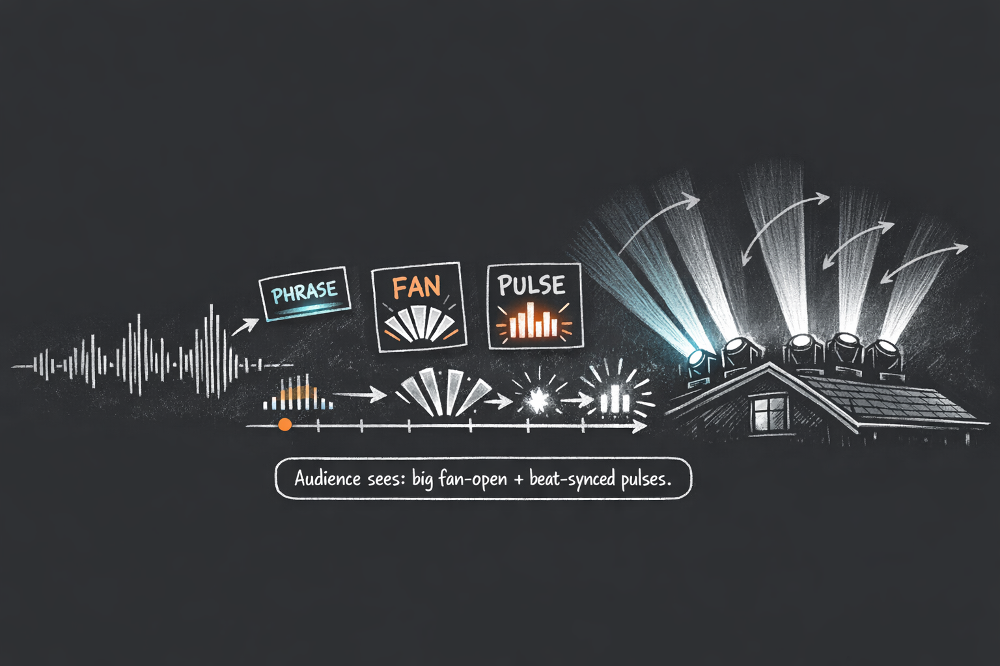
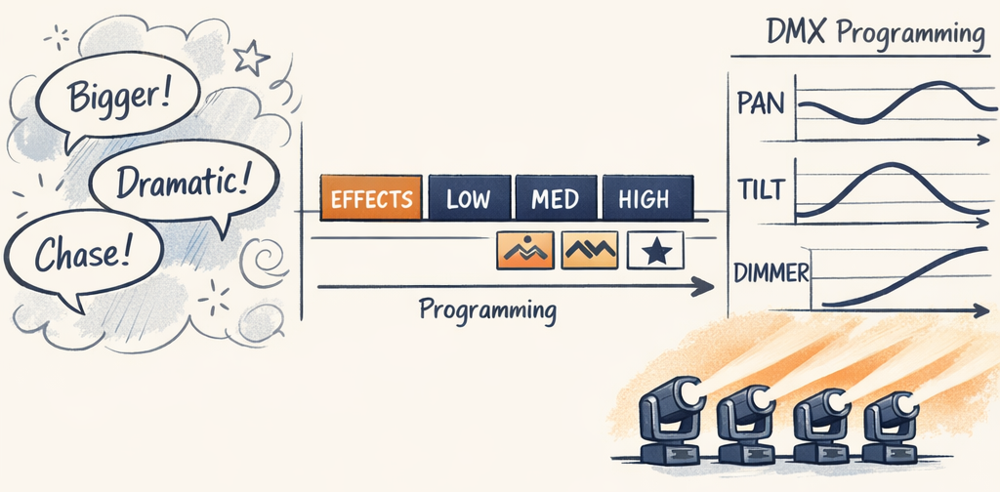

# An LLM xLights Choreographer?



Picture eight moving head fixtures bolted across your roofline. Each one has a pan motor (540° of horizontal rotation), a tilt motor (270° vertical), and a dimmer channel. You've got a three-minute Christmas song at 120 BPM — that's 360 beats to fill. Every pan angle, every tilt position, every brightness curve needs to be choreographed across all eight fixtures, synchronized to the music, producing formations that look intentional instead of like eight searchlights having a seizure.

This is what show designers spend 20+ hours doing by hand in xLights. For a single song. Multiply by a 15-song playlist and you've just lost your entire fall.

We wanted to know if an LLM could do it. The short answer: yes. The longer answer involves six months of learning exactly how bad LLMs are at trigonometry.


---

## Moving Heads: Main Character Energy
If you've watched those viral YouTube Christmas light shows — whole houses pulsing and dancing to "Wizards in Winter" — you've seen the simpler side of Christmas lighting. Strings, arches, pixel matrices. They turn on, they change color, they dim. That's it.

Moving heads are different. Borrowed from concert stages and adopted by the Christmas lighting community as high-impact accent fixtures, they're motorized lights that physically *point* in different directions. When you coordinate them into formations — fans, chevrons, waves, chases — the effect stops people mid-sidewalk.

The problem is that "coordinated" is doing a lot of heavy lifting. Here's what a fan formation actually means:

```
    8 moving heads on a roofline, "fan" formation:

     [1]    [2]    [3]    [4]    [5]    [6]    [7]    [8]
      ↙      ↙      ↙      ↙      ↘      ↘      ↘      ↘
    -60°   -45°   -30°   -15°   +15°   +30°   +45°   +60°

    Every angle = f(position, fixture_count).
    The LLM says "fan_pulse." The rest is trig.
```

Every fixture's pan angle is mathematically derived from its position. Then that geometry needs to *evolve with the music* — tighter formations during quiet verses, wide dramatic fans at the chorus, staggered chase patterns during builds. Every one of those parameters is a DMX channel value that changes over time, aligned to the beat grid of the song.

That's thousands of individual data points for one three-minute track.

---

## The Naive Approach (How Hard Could It Be?)
The first thing we tried — and probably the first thing you'd try — is the obvious one. Feed the LLM the song structure and ask it to generate DMX values directly. "Here are the beats. Here are 8 fixtures. Generate the choreography."

It failed. Immediately.

**LLMs can't do spatial math.** We asked for a "fan formation" where fixtures spread symmetrically from center to edges. The LLM got *close* — close enough that it almost looked right, which is somehow worse than being completely wrong. Seven fixtures in a nice fan and one rogue unit aimed at the neighbor's garage isn't a formation. It's a bug report.

**LLMs can't hold timing.** 360 beats at 500ms each needs millisecond-level alignment. The LLM would drift, stutter, and produce timing that felt *almost* musical — like a drummer who's one beer past their limit.

**LLMs are allergic to numeric precision.** We told the LLM to keep dimmer intensity below 1.20. It would output 1.24. Every time. We'd flag it, it'd fix that one, and break two others. Whack-a-mole with a language model.

So we stopped asking the LLM to do what it's bad at.

> **Decision Point:** The LLM should never generate DMX values directly. This became the core architectural principle: **the LLM plans intent; deterministic code implements precision.** The LLM decides *what* should happen ("wide fan, dramatic pulse, building intensity"). Python handles *how* — calculating pan angles, generating curves, snapping to the beat grid. Each side does what it's actually good at.

The LLM works with a vocabulary of pre-built choreography templates — `fan_pulse`, `sweep_lr`, `pendulum_chevron_breathe` — and selects which one to apply to each section of the song. Each template bundles the complete choreography: geometry (where fixtures point), movement (how they move), and dimmer (brightness pattern). The renderer takes that selection and compiles it to precise DMX curves.

We thought: if we get this boundary right, the LLM doesn't need to understand trigonometry. It needs to understand *music*.



---

## The Pipeline
Here's the full system:


Here's where it gets interesting — the LLM only touches two of these five stages. Everything else is pure math.

**Audio Analysis** (deterministic) — Signal processing extracts tempo, beats, energy curves, section boundaries, and lyrics from the audio file. The output is a `SongBundle`: roughly 100KB of structured musical intelligence. No LLM anywhere near it.

**LLM Profiling** (AI-powered) — An LLM interprets the raw features into creative direction. "This section has building energy" is a signal processing observation. "This building energy should drive a widening fan formation" is creative judgment. The profiler compresses 100KB down to ~10KB of shaped context first — because sending an LLM data it doesn't need is just burning money.

**Multi-Agent Planning** (AI-powered) — A planner agent generates a choreography plan: which template, at what intensity (`WHISPER` through `PEAK`), for which section of the song. But a plan isn't trusted until it survives scrutiny. A heuristic validator catches structural errors cheaply — no LLM call needed. If the plan passes, an LLM judge scores it 0–10. Below 7.0? Structured feedback goes back to the planner. Up to three iterations. We'll unpack this whole loop in Part 3.

**Rendering** (deterministic) — Templates loaded, presets applied, beat-grid timing calculated, per-fixture phase offsets computed, DMX curves generated. No ambiguity. No "close enough."

**XSQ Export** (deterministic) — Everything gets written to a `.xsq` file that opens directly in xLights for preview.

The critical pattern: **the LLM never sees a DMX value, a pan angle, or a curve equation.** It works in the language of template names, intensity levels, and musical sections. The renderer translates intent into math.

| LLM's Job (Creative Intent) | Deterministic Code (Precise Implementation) |
|---|---|
| Interpret musical energy and mood | Extract tempo, beats, energy curves from audio |
| Select choreography template per section | Calculate exact pan/tilt angles per fixture |
| Choose intensity: `STRONG` for the chorus | Map `STRONG` → numeric values per channel lane |
| Pick formations: fan at the verse, chevron at the drop | Compute phase offsets for chase effects |
| Evaluate plan quality, suggest revisions | Generate beat-aligned dimmer curves |
| Reason about narrative and thematic arc | Export to xLights `.xsq` format |

---

## What This Series Covers

This is a Christmas light show system. Residential displays, theme park shows, neighborhood spectacle. Not concert lighting, not stage production. Think "how did they DO that?" — not Coachella.

> **Decision Point:** Moving heads were deliberately chosen as the *first* fixture type because they're the hardest. Pan + tilt + dimmer across multiple fixtures, spatial coordination, beat-precise timing. If the architecture survives moving heads, simpler fixtures (strings, arches, mega trees) are a given. Prove the hard case first.

The series walks through every layer, using the moving head pipeline as an end-to-end case study:

- **Overview** (you're here) — The architecture and why the LLM/determinism boundary matters
- **Part 1: Hearing the Music** — Audio analysis: turning an MP3 into structured musical features
- **Part 2: Making Sense of Sound** — LLM profiling: compressing 100KB of features into 10KB of creative direction
- **Part 3: The Choreographer** — Multi-agent planning: the planner-validator-judge loop
- **Part 4: The Categorical Pivot** — The most transferable lesson: teaching an LLM to think in intent, not numbers
- **Part 5: Prompt Engineering** — Schema injection, taxonomy alignment, and preventing silent drift
- **Part 6: From Plan to Pixels** — Rendering: how categorical plans become DMX curves
- **Part 7: Lessons Learned** — What worked, what surprised us, what we'd do differently

We'll be honest about what didn't work. Part 4 exists because the original numeric approach had a ~38% failure rate on judge evaluations. The lyrics pipeline in Part 1 has a five-stage fallback chain because no single lyrics source is reliable. These aren't hypothetical risks — they're scars.

If you're mostly here for the LLM architecture, Parts 3–5 are the core. If you want the full journey, start here and read through.

---

In Part 1, we start at the beginning: teaching the system to hear music. Beat detection, energy analysis, section boundary detection, and a lyrics pipeline that has to survive real-world data quality. Zero LLM involvement — just signal processing and a lot of opinions about how Christmas music is structured.

---

*This is the Overview of the [Building an AI Choreographer for Christmas Light Shows](#) series.*

[Next: Hearing the Music — Audio Analysis & Feature Extraction →](01_audio_analysis.md)
