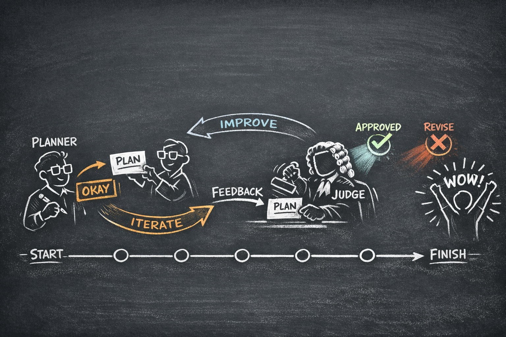
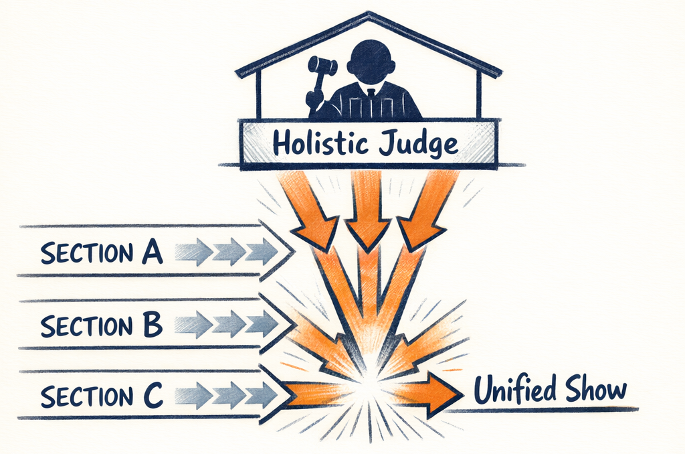
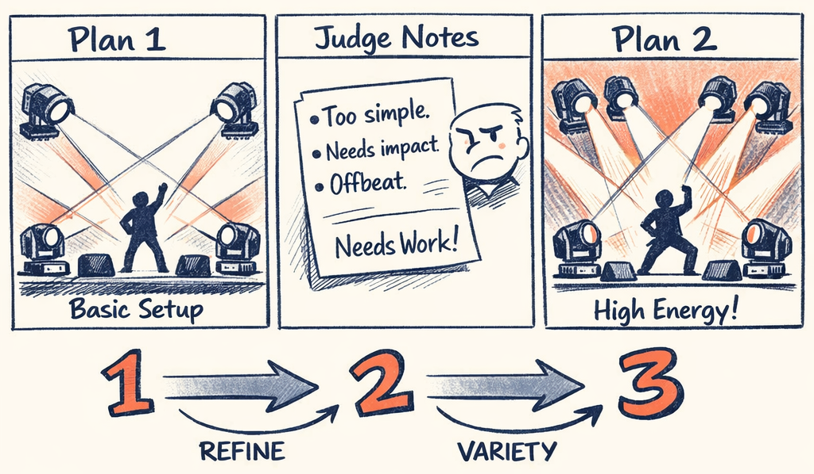
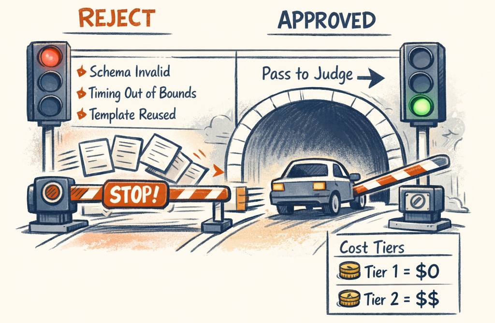

# The Choreographer — Multi-Agent Planning System

<!-- ILLUSTRATION: ILL-03-00 — Blog header banner: planner + judge dialogue cards over timeline. See ILLUSTRATION_INDEX.md for full spec. -->


The audio profile says "high-energy chorus, building intensity, lyrical hook at bar 12." Great. Now turn that into a concrete plan: which template on which fixture group, at which intensity, for how many bars, coordinated with every other fixture in the display. And get it right — or get told exactly what's wrong so you can try again.

This is the planner-critic loop: the system's central creative engine and the most LLM-intensive part of the pipeline. It's where the architecture either works or produces a show that looks like eight fixtures having independent nervous breakdowns.

---

## System Snapshot

**Purpose:** _(1–2 sentences: what this stage produces and why it exists.)_

**Inputs**
- _(e.g., raw audio file, metadata, prior stage outputs)_

**Outputs**
- _(e.g., BeatGrid, SectionMap, AudioProfile, GroupPlanSet, RenderPlan)_

**LLM vs Deterministic**
- **LLM does:** _(categorical intent / choices / summaries)_  
- **Code does:** _(math, snapping, curves, exports, validation)_

**Key invariants**
- _(3–5 invariants that must always hold; treat as contracts)_

**Telemetry to watch**
- _(success rate, avg runtime, token/cost, top failure modes)_


## Repo Anchors

**Key modules**
- `twinklr/...` _(add canonical paths for the main code in this part)_

**Key models**
- _(Pydantic models / schemas that define the contracts)_

**Key tests / tools**
- _(validators, golden tests, regression fixtures, debug utilities)_


## Agents Are Data, Not Classes

Before we get into the loop, let's talk about how agents are built — because this decision shaped everything else.

There are no `PlannerAgent`, `JudgeAgent`, or `ValidatorAgent` classes in Twinklr. There's one `AsyncAgentRunner` and different configurations:

```python
# packages/twinklr/core/agents/spec.py
class AgentSpec(BaseModel, frozen=True):
    """Data-only configuration for agent execution.
    Agent Runner uses this spec to execute agents without separate classes."""

    name: str                           # For logging, conversation IDs
    prompt_pack: str                    # Directory of Jinja2 templates
    response_model: type[Any]           # Pydantic model for validation
    mode: AgentMode                     # ONESHOT or CONVERSATIONAL
    model: str                          # e.g., "gpt-5.2"
    temperature: float                  # Sampling temperature
    max_schema_repair_attempts: int     # Auto-repair on validation failure
    default_variables: dict[str, Any]   # Default prompt variables
    token_budget: int | None            # Optional token limit
```

Adding a new agent means creating a new spec and a prompt pack directory. No subclassing, no factory pattern, no registration ceremony. The runner takes a spec, renders its templates, calls the LLM, validates the response against the Pydantic model, and returns the result. Same code path for every agent in the system.

> **Decision Point:** The AgentSpec pattern — a single runner with data-driven configuration beats agent class hierarchies. We tried the class approach first. We had `BasePlannerAgent` with abstract methods, a `MovingHeadPlannerAgent` subclass, and it was a maintenance tax on every new agent type. Specs flattened the hierarchy. Adding the lyrics profiler from Part 2 was a YAML exercise plus a prompt directory.

Here's what the planner and judge look like side-by-side:

| Property | Planner | Judge |
|---|---|---|
| **Mode** | `CONVERSATIONAL` (keeps history) | `ONESHOT` (fresh each time) |
| **Model** | gpt-5.2 | gpt-5-mini |
| **Temperature** | 0.7 (creative) | 0.3 (precise) |
| **Purpose** | Generate choreography plan | Score and critique plan |

The planner is conversational because refinement works better when the LLM remembers what it tried last time. The judge is oneshot because each evaluation should be independent — you don't want the judge anchoring to its previous score.

The judge uses a cheaper, faster model because it's doing classification (good/bad, with a score) not generation. Most of the intelligence is in the prompt and the structured output schema, not the model's raw capability.

---

## The Loop

Here's how a plan gets made:

<!-- ILLUSTRATION: ILL-03-02 — Multi-agent planning + evaluation loop illustration. See ILLUSTRATION_INDEX.md for full spec. -->


<details>
<summary>Diagram: Iteration Loop (click to expand if diagram doesn't render)</summary>


</details>

Three iterations max. Each one costs real money (LLM calls), so the system is designed to converge fast. Most plans approve on iteration 1 or 2. Reaching iteration 3 usually means something is fundamentally wrong with the section context, not that the planner needs one more try.

The `StandardIterationController.run()` manages this:

```python
# packages/twinklr/core/agents/shared/judge/controller.py (abbreviated)
for iteration in range(self.config.max_iterations):
    # === PLANNING ===
    plan_result = await runner.run(spec=planner_spec, variables=planner_vars, state=planner_state)
    plan = plan_result.data

    # === HEURISTIC VALIDATION ===
    validation_errors = validator(plan)

    if validation_errors:
        # Skip judge entirely — feed errors back to planner directly
        self.feedback.add_validation_failure(message="; ".join(validation_errors), ...)
        revision = RevisionRequest(
            priority=RevisionPriority.CRITICAL,
            focus_areas=["Schema Validation"],
            specific_fixes=validation_errors[:20],   # ← Cap at 20 to fit prompt
        )
        continue  # ← Next iteration, no judge call

    # === JUDGING ===
    judge_result = await runner.run(spec=judge_spec, variables=judge_vars)
    verdict = judge_result.data

    # === DECISION ===
    if verdict.status == VerdictStatus.APPROVE:
        return IterationResult(success=True, plan=plan, ...)

    # Build revision and iterate
    revision = RevisionRequest.from_verdict(verdict)
```

<!-- ILLUSTRATION: ILL-03-01 — The planner and judge as two agents in a back-and-forth dialogue: planner proposes, judge scores and critiques, planner revises, judge approves. Chat-bubble style showing convergence. See ILLUSTRATION_INDEX.md for full spec. -->


The key detail: if heuristic validation fails, the judge never runs. No point scoring a plan that has invalid template IDs or overlapping placements. Fix the structural problems first, then worry about creative quality. This saves a full LLM call on plans that would obviously fail anyway.

---

## Two Tiers of Validation

This is the pattern we're proudest of. And it came from frustration — we were burning judge tokens on plans that had trivially wrong template names.

### Tier 1: Heuristic Validator (free, instant)

<!-- ILLUSTRATION: ILL-03-03 — Validator “stoplight gate”: Tier-1 heuristic checks catch cheap failures; only green plans go to judge. See ILLUSTRATION_INDEX.md for full spec. -->


The `SectionPlanValidator` catches structural problems without touching an LLM:

```python
# packages/twinklr/core/agents/sequencer/group_planner/validators.py
class SectionPlanValidator:
    """Validates:
    - Template existence in catalog
    - Group existence in DisplayGraph
    - Timing bounds (placements within section)
    - No within-lane overlaps on same group
    - Template-lane compatibility (BASE templates in BASE lane)
    - IntensityLevel and EffectDuration are valid enums
    """
```

These are all things a Pydantic validator *could* catch, but we wanted richer error messages with `fix_hint` fields. "Template 'fan_pulse_v2' not found in catalog — use a valid template_id from TemplateCatalog" is actionable. "Validation error for field template_id" is not.

It also catches subtler issues: diversity constraints per lane (minimum unique templates, maximum consecutive reuse of the same template), timing driver mismatches (lyrics-driven lane with beat-snapped placements), and identical accent patterns across primary fixtures that flatten the focal hierarchy.

### Tier 2: LLM Judge (expensive, semantic)

The judge evaluates things heuristics can't:

- **Template appropriateness** — is `gentle_shimmer` really the right choice for a PEAK intensity chorus?
- **Coordination coherence** — do the fixture groups work together, or is the left group doing something completely unrelated to the right?
- **Thematic consistency** — does it match the palette, motifs, and creative direction from the macro plan?
- **Arc and pacing** — does the intensity build feel natural, or does it jump randomly?

The judge returns a `JudgeVerdict` with a score (0–10), structured issues with severity levels (ERROR/WARN/NIT), and `feedback_for_planner` — a free-text field that gets formatted and injected into the planner's refinement prompt.

> **Decision Point:** Heuristic validation before the LLM judge — catching structural failures cheaply before spending tokens on semantic evaluation. In practice, about 15% of first-iteration plans fail heuristics. That's 15% of judge calls saved, and the feedback is more actionable because it's precise ("template not found") rather than narrative ("the template choice doesn't seem right").

| | Heuristic Validator | LLM Judge |
|---|---|---|
| **Cost** | Zero (pure Python) | ~$0.02-0.05 per call |
| **Speed** | < 10ms | 3-8 seconds |
| **Catches** | Structural errors: missing templates, overlaps, out-of-bounds | Semantic issues: appropriateness, coherence, thematic consistency |
| **Feedback** | Exact error codes with fix hints | Scored issues with acceptance tests |
| **Runs when** | Every iteration | Only after heuristics pass |

---

## Structured Feedback: Not Just "Please Fix It"

When the judge returns SOFT_FAIL or HARD_FAIL, the system builds a `RevisionRequest` with typed fields:

```python
revision = RevisionRequest(
    priority=RevisionPriority.CRITICAL,    # or STANDARD
    focus_areas=["Schema Validation"],      # Categories to focus on
    specific_fixes=["Template 'foo' not found — use gtpl_base_warm_glow"],
    avoid=["Don't use HOLD movement for PEAK intensity sections"],
    context_for_planner="Fix 3 validation errors before judging",
)
```

The `FeedbackManager` formats this into structured text that goes into the planner's refinement prompt. Issues are grouped by severity — BLOCKING ERRORS first (must fix), then warnings (should fix), then suggestions (nice to have). Each issue includes:

- The problem: what went wrong
- The fix: what to do about it
- The acceptance test: how to verify it's fixed

This matters more than it sounds. Early versions used natural language feedback: "The plan has some timing issues and the template choices could be better." The planner would "fix" one thing and break two others. Structured feedback with explicit severity and fix hints converged in fewer iterations.

> **Decision Point:** Structured feedback over natural language — `RevisionRequest` with typed fields is more reliable than "please fix the timing issues." The planner gets a checklist, not a suggestion. And the feedback manager tracks which issues from previous iterations are still present, so it can flag unresolved problems with increasing urgency.

---

## Context Shaping for Planning

As we saw in Part 2, context shaping matters. The planner gets a lot of information — display graph (fixture groups), template catalog, section energy targets, motifs, timing constraints — and most of it is irrelevant to any given section.

The `shape_planner_context` function performs ~40% token reduction:

```python
# packages/twinklr/core/agents/sequencer/group_planner/context_shaping.py
def shape_planner_context(section_context: SectionPlanningContext) -> dict[str, Any]:
    """
    - Groups: Filtered to primary + secondary targets only
    - Templates: Simplified to {ID, name, lanes, tags} (descriptions dropped)
    - Layer intents: Filtered to only layers targeting these roles
    - Templates filtered by energy/motif affinity

    Before: ~75K tokens (9 groups + 61 full templates + 3 layers)
    After:  ~45K tokens (filtered groups + simplified templates)
    """
```

The template filtering is the interesting part. Templates are pre-filtered by energy affinity — a HIGH energy section only sees templates tagged with "chase", "strobe", "burst", "flash", not "glow", "soft", "warm". This doesn't just save tokens; it prevents bad choices. If the planner can't see `gentle_shimmer`, it can't pick it for a PEAK chorus.

But the filtering has a safety floor: minimum 3 templates per lane. If aggressive filtering drops a lane below threshold, it backfills from the full catalog. The planner should always have real choices, even in edge cases.

---

## Conversational Mode: Why the Planner Remembers

The planner runs in `CONVERSATIONAL` mode — it keeps its message history across iterations. The judge runs in `ONESHOT` mode — fresh context every time.

This asymmetry is deliberate. On iteration 2, the planner doesn't need the full section context re-sent. It's already in the conversation history. The refinement prompt (`user_refinement.j2`) is just the feedback and revision request. This saves roughly 40% of tokens on iterations 2 and 3.

More importantly, conversational mode means the planner remembers what it tried. "Last time I used `fan_pulse` on the LEFT group and the judge said it lacked variety" — the planner can avoid repeating the same mistake. Oneshot mode would mean re-explaining the entire context and hoping the planner independently avoids the same choice.

The judge, conversely, *should* be fresh. You don't want it thinking "well, I gave a 5.5 last time and this is slightly better, so... 6.0?" Each evaluation should be independent. Anchoring bias is a real problem with LLM judges, and oneshot mode prevents it.

> **Decision Point:** Conversational planner vs. oneshot judge — the planner keeps history for efficient refinement; the judge evaluates fresh to avoid anchoring bias. This cuts refinement prompt tokens by ~40% while keeping evaluation independent.

---

## Issue Tracking: Learning Across Runs

One more thing the iteration controller does quietly: every issue from every verdict — even from plans that get approved — gets recorded to a persistent `IssueRepository`. This isn't for the current run. It's for the next one.

When a new planning job starts, the controller loads historical issues and injects them into the developer prompt as "Common patterns to avoid." If the planner consistently produces timing misalignment on bridge sections, the next run starts with that knowledge. The system gets better at planning over time, not by fine-tuning the model, but by accumulating feedback.

It's the same principle as a human show designer getting better with practice — except the "practice" is structured issue data, not vibes.

---

The iteration loop is the creative core of Twinklr: planner proposes, heuristics catch structural failures for free, the judge evaluates semantic quality, and structured feedback drives convergence. Three iterations max, usually done in one or two.

But we skipped something important. The plan the planner produces uses categorical values — `STRONG` intensity, `PHRASE` duration — not numeric ones. That wasn't always the case. The original system used floats for intensity and precise beat fractions for timing, and it had a ~38% failure rate on judge evaluations. Part 4 is about the most consequential design change in the project: teaching the LLM to think in intent instead of numbers.

---

*This is Part 3 of the [Building an AI Choreographer for Christmas Light Shows](#) series.*

← [Previous: Making Sense of Sound — LLM-Based Audio & Lyric Profiling](02_audio_profiling.md) | [Next: The Categorical Pivot — Teaching an LLM to Think in Intent, Not Numbers →](04_categorical_planning.md)
