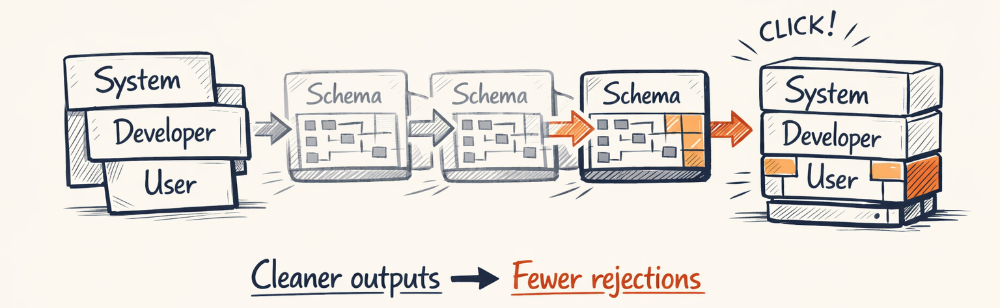
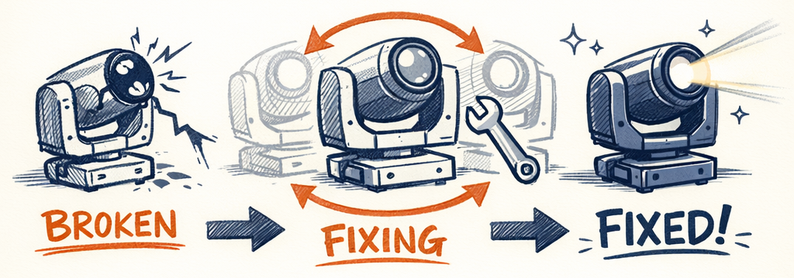
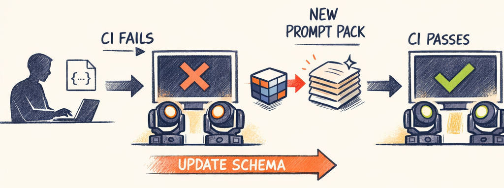
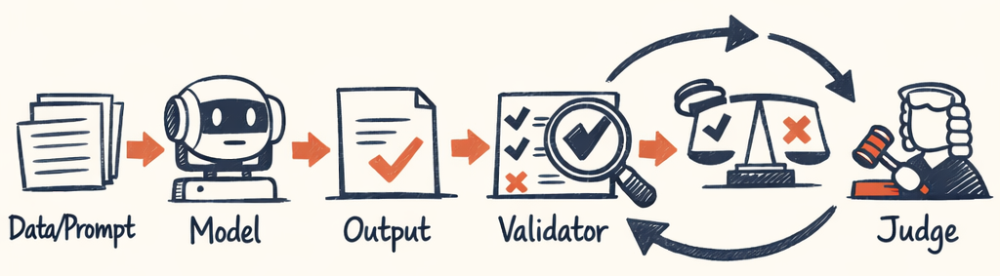

# Prompt Engineering — Schema Injection, Taxonomy, and Anti-Patterns


The dirty secret of production LLM systems is that prompts break silently. You update a Pydantic model — add a field, rename an enum value, change a constraint — and forget to update the prompt. The LLM starts generating fields that don't exist, or misses new required fields, or uses the old enum value that Pydantic now rejects. Schema drift doesn't crash. It just degrades quality until someone notices, which in our case was three weeks after we renamed `MEDIUM` to `MED`.

Here's how we solved it, and a few things we tried that didn't work.

---

## The Prompt Pack Architecture
Every agent in the system has a prompt pack: a directory of Jinja2 templates plus metadata.

```
prompts/planner/
├── system.j2             # Role, rules, energy-based recipes
├── developer.j2          # Hard constraints, schema, enum values
├── user.j2               # Task context (first iteration)
├── user_refinement.j2    # Feedback context (iteration 2+)
└── examples.jsonl        # Optional few-shot examples
```

Each file is a separate concern:
- **system.j2** — who the agent *is*. Role definition, creative principles, domain recipes ("for HIGH energy sections, use 3-lane configuration with PEAK accents"). Changes when you want the agent to think differently.
- **developer.j2** — what the agent *must* produce. JSON schema, enum values, hard constraint tables. Changes when the output shape changes.
- **user.j2** — what the agent works *with*. Section context, filtered templates, timing bounds. Changes every call.

This separation means you can change the creative direction without touching the output schema, update the schema without rewriting the role, or swap the context shape without either. In practice, we change `system.j2` when the planner is making bad creative decisions, `developer.j2` when we update the data models, and `user.j2` when we change how context is shaped.

---

## Schema Auto-Injection: The Key Technique


This is the single most impactful prompt engineering decision we made, and it's four lines of code:

```python
# packages/twinklr/core/agents/async_runner.py
# Auto-inject response schema to avoid drift
if spec.response_model and hasattr(spec.response_model, "model_json_schema"):
    merged_vars["response_schema"] = get_json_schema_example(spec.response_model)

# Auto-inject taxonomy enum values
merged_vars = inject_taxonomy(merged_vars)
```

The `response_schema` variable is generated directly from the Pydantic model that validates the response. The prompt template uses it like this:

```jinja2
{# developer.j2 #}

## Schema Injection Contract Test

This is the safety rail that prevents “prompt drift” when schemas evolve.

**Goal:** If the response schema changes (fields renamed, enums expanded, constraints tightened), the prompt pack must be updated **in the same PR** — or CI fails.

**Recommended test shape**
- Load the *current* Pydantic response model(s)
- Generate the injected schema block exactly as production does
- Assert:
  - **Required fields** are present
  - **Enum values** are included (or referenced via injection)
  - **No duplicate / stale schema blocks** exist in the prompt pack
  - A **minimal valid example** passes JSON validation

**Failure mode this prevents**
- Model outputs “valid-looking” JSON that silently violates the latest schema → judge fails late → expensive iteration.




## Response Schema
Return a `SectionCoordinationPlan` matching this schema:
{{ response_schema }}
```

The JSON schema shown to the LLM is generated from the **same Pydantic model** used to validate the response. If you add a field to `SectionCoordinationPlan`, it automatically appears in the prompt. If you rename an enum value, the schema updates. Zero manual synchronization.

Before this, we had hardcoded JSON schemas in prompts. We'd update the model, the tests would pass, the prompt would show the old schema, and the LLM would generate the old format. Pydantic would reject it. The schema repair loop would fix it. We'd burn two extra LLM calls per invocation for a problem we created ourselves.

> **Decision Point:** Auto-injected schemas over hardcoded JSON in prompts — eliminates an entire class of drift bugs. Every production LLM system that validates output should do this. The cost is one function call to `model_json_schema()`. The savings are every debugging session you'll never have.

---

## Taxonomy Injection: Keeping Enums in Sync
Beyond the schema, the system injects every vocabulary enum into prompts. The `inject_taxonomy()` function collects all enum values from the vocabulary module and makes them available as template variables:

```python
# In the Jinja2 template:

- **LaneKind:** {{ taxonomy.LaneKind | join(', ') }}
- **IntensityLevel:** {{ taxonomy.IntensityLevel | join(', ') }}
- **EffectDuration:** {{ taxonomy.EffectDuration | join(', ') }}
- **CoordinationMode:** {{ taxonomy.CoordinationMode | join(', ') }}

```

This creates a closed loop:
1. Prompt shows valid values (from enum) →
2. LLM generates using those values →
3. Pydantic validates against the same enum

If we add `EXTREME` to `IntensityLevel`, it appears in the prompt automatically. If we remove `BURST` from `EffectDuration`, the prompt stops showing it. The prompt and the validator are always in agreement because they draw from the same source.

The taxonomy covers 26 enum types across choreography, group planning, and issue tracking. Manually maintaining these in prompt text would be a maintenance nightmare.

---

## The Three-Layer Strategy in Practice
Here's how the layers work together, using the group planner as the example:

### Layer 1: System Prompt (the "who")
```jinja2
{# system.j2 — abbreviated #}
You are a Christmas light show choreographer designing
coordinated group choreography for holiday displays.

## Energy Recipes
### HIGH Energy Section
- BASE lane: SECTION duration, MED intensity (continuous bed)
- RHYTHM lane: PHRASE or EXTENDED, STRONG intensity (drive)
- ACCENT lane: HIT or BURST, PEAK intensity (punctuation)

### LOW Energy Section
- BASE lane: SECTION duration, WHISPER or SOFT intensity
- RHYTHM lane: PHRASE, SOFT intensity (gentle movement)
- ACCENT lane: Omit entirely or single BURST at SOFT
```

The system prompt includes concrete recipes per energy level — not "consider the energy" but "here's exactly what HIGH/MED/LOW configurations look like." These recipes are the distilled knowledge of what works, expressed in the categorical vocabulary from Part 4. The LLM has a playbook, not a blank page.

### Layer 2: Developer Prompt (the "what")
```jinja2
{# developer.j2 — abbreviated #}
## Response Schema
{{ response_schema }}

## Valid Values

- **LaneKind:** {{ taxonomy.LaneKind | join(', ') }}
- **CoordinationMode:** {{ taxonomy.CoordinationMode | join(', ') }}
- **IntensityLevel:** {{ taxonomy.IntensityLevel | join(', ') }}
- **EffectDuration:** {{ taxonomy.EffectDuration | join(', ') }}


## Hard Constraints
| Rule | Example | Violation |
|------|---------|-----------|
| Template must exist in catalog | ✅ gtpl_base_warm_glow | ❌ my_custom_effect |
| Group must exist in DisplayGraph | ✅ HERO_LEFT | ❌ LEFT_FIXTURES |
| Start bar must be within section | ✅ bar 5 (section: bars 3-12) | ❌ bar 1 |
```

Hard constraints as a table with examples and violations. This format works better than prose rules because the LLM can pattern-match against concrete examples. "Don't use templates not in the catalog" is vague. "✅ gtpl_base_warm_glow / ❌ my_custom_effect" is specific.

### Layer 3: User Prompt (the "with")
```jinja2
{# user.j2 — abbreviated #}
## Section: {{ section_id }} ({{ section_name }})
- Timing: {{ start_ms }}ms – {{ end_ms }}ms ({{ available_bars }} bars)
- Energy target: {{ energy_target }}
- Motion density: {{ motion_density }}

## Available Templates ({{ template_catalog.entries | length }})

- {{ entry.template_id }}: {{ entry.name }} [{{ entry.compatible_lanes | join(', ') }}]


## Available Groups

- {{ group.group_id }} ({{ group.role }})

```

On iteration 1, the user prompt contains the full section context: templates, groups, timing, energy targets, theme, palette, motifs. On iteration 2+, the loader switches to `user_refinement.j2`, which contains only the feedback and revision request — the full context is already in the conversation history (conversational mode from Part 3). This saves ~40% of tokens on refinement iterations.

> **Decision Point:** Three-layer prompt separation (system/developer/user) — allows independent evolution of role, constraints, and context. When the creative direction changes, we edit `system.j2`. When the data model changes, `developer.j2` updates automatically via injection. When context shaping changes, only `user.j2` needs attention. No cross-contamination.

---

## The Schema Repair Loop
Even with auto-injected schemas and taxonomy, the LLM sometimes produces invalid output. A missing required field. An enum value with a typo. A nested object where a string was expected.

The runner handles this with a repair loop:



The repair message includes both the specific error and the full expected schema:

```python
# packages/twinklr/core/agents/async_runner.py
repair_message = (
    f"Schema validation failed. Error:\n{error_details}\n\n"
    f"Expected schema:\n{get_json_schema_example(spec.response_model)}\n\n"
    f"Please fix the response to match the schema exactly."
)
messages.append({"role": "user", "content": repair_message})
```

Most repairs succeed on the first attempt. The LLM sees exactly what went wrong and what the schema expects. It's surgical feedback, not "try again." The `max_schema_repair_attempts` is set to 2 for most agents — if it can't get it right in 3 total attempts (1 original + 2 repairs), something more fundamental is wrong.

> **Decision Point:** Schema repair with the original model's schema, not just the error message. Showing the LLM "here's what you produced, here's what we expected, here's specifically what's wrong" converges faster than "validation failed, please retry."

---

## What Didn't Work
**Natural language schema descriptions.** Before auto-injection, we described the output format in prose: "Return a JSON object with a section_id string, a list of lane_plans, each containing..." The LLM would get creative. Extra fields, renamed fields, slightly different nesting. Prose invites interpretation. JSON schema doesn't.

**Giant monolithic prompts.** The first version had everything in one template. Role, constraints, schema, context, examples — 800 lines of Jinja2. Changing anything required reading the whole thing. Splitting into layers was a sanity decision before it was an engineering one.

**Temperature as a fix for creativity.** When the planner produced boring plans, we tried raising the temperature. It produced creative *and* broken plans. Temperature controls randomness, not quality. The fix was better recipes in the system prompt and better context shaping, not a higher temperature knob.

---

We've covered the full LLM-powered side of the pipeline: audio profiling turns features into creative intent, the multi-agent planner generates and refines choreography plans, categorical planning keeps the LLM in its lane, and prompt engineering keeps everything synchronized. Part 6 crosses back to the deterministic side — how a categorical plan becomes DMX curves that make physical lights move.

---

*This is Part 5 of the [Building an AI Choreographer for Christmas Light Shows](#) series.*

← [Previous: The Categorical Pivot — Teaching an LLM to Think in Intent, Not Numbers](04_categorical_planning.md) | [Next: From Plan to Pixels — Rendering & Compilation →](06_rendering_compilation.md)
