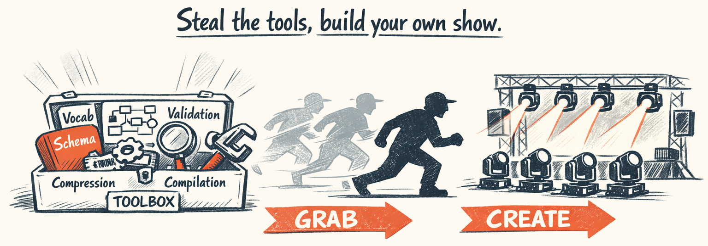
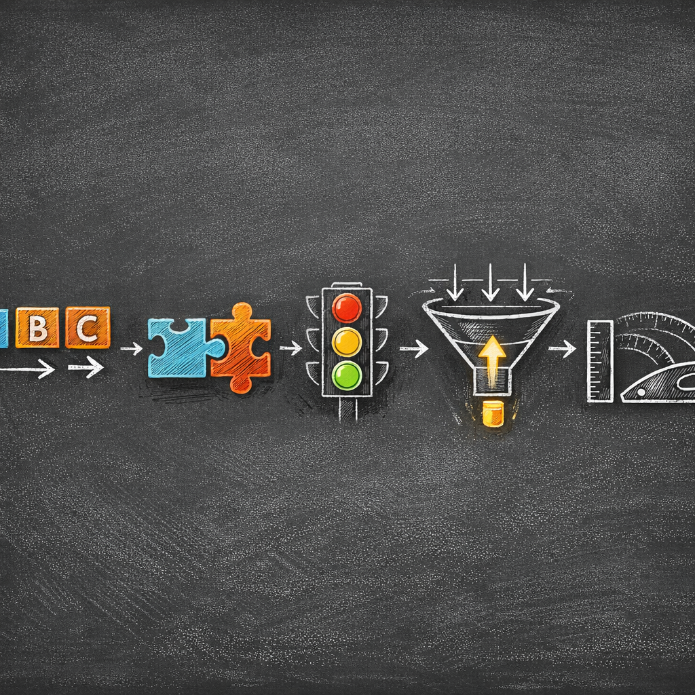
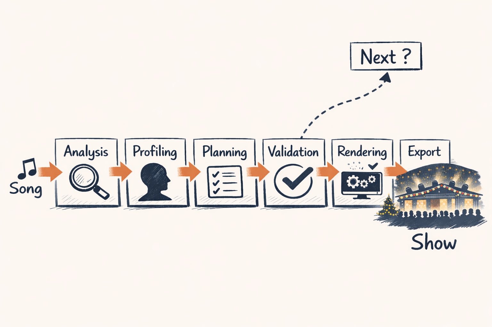

# Lessons Learned & What's Next

<!-- ILLUSTRATION: ILL-07-00 — Blog header banner: “what to steal” toolbelt + lights. See ILLUSTRATION_INDEX.md for full spec. -->

Deep breath. Months of work. Five audio extraction libraries. Three complete rewrites of the planning loop. One categorical pivot that should have been obvious from day one. And at the end of it all, an LLM that can take a Christmas song it's never heard before and produce a coordinated moving head show that actually looks... good?

We're still a little surprised it works.

This is the retrospective. Not the polished "and then we solved it" version — the honest accounting of what worked, what didn't, what we'd do over, and where the whole thing goes next.

---

## System Snapshot

**Purpose:** _(1–2 sentences: what this stage produces and why it exists.)_

**Inputs**
- _(e.g., raw audio file, metadata, prior stage outputs)_

**Outputs**
- _(e.g., BeatGrid, SectionMap, AudioProfile, GroupPlanSet, RenderPlan)_

**LLM vs Deterministic**
- **LLM does:** _(categorical intent / choices / summaries)_  
- **Code does:** _(math, snapping, curves, exports, validation)_

**Key invariants**
- _(3–5 invariants that must always hold; treat as contracts)_

**Telemetry to watch**
- _(success rate, avg runtime, token/cost, top failure modes)_

## What Worked

Some of these feel obvious in hindsight. None of them were obvious at the time.

| Principle | Impact | Part |
|---|---|---|
| LLM plans intent, renderer implements precision | Foundation of everything | All |
| Categorical over numeric | ~60% fewer validation failures | 4 |
| Two-tier validation (heuristic + LLM judge) | Saved 15% of judge token costs | 3 |
| Schema auto-injection | Eliminated schema drift bugs entirely | 5 |
| 10x context compression | Better output quality, not just cheaper | 2 |
| AgentSpec pattern | New agents in hours, not days | 3 |

The biggest one: **the boundary between AI and determinism is an architectural decision, not an implementation detail.** Get it wrong and you spend your time building guardrails around an LLM that keeps trying to do math. Get it right and each side does what it's naturally good at.

We didn't get it right immediately. The first three months were the "let the LLM try everything" phase — generating pan angles, calculating beat fractions, picking DMX values. It was simultaneously impressive and terrible. Impressive because it got close. Terrible because "close" in DMX is a servo jittering at the wrong angle.

The categorical pivot (Part 4) was the turning point. Once we stopped asking the LLM to be a calculator and started asking it to be a creative director, everything clicked. `STRONG` instead of `1.15`. `PHRASE` instead of `bar 5 beat 2 to bar 7 beat 1 with beat_frac 0.0 and offset_ms null`. The LLM is *great* at the first version and *bad* at the second. We just took too long to accept that.

> **Decision Point:** The boundary between AI and determinism is an architectural decision, not an implementation detail. Get it wrong and the LLM fights the system. Get it right and each side does what it's best at. Every design decision in Twinklr flows from this principle.

---

## What Surprised Us

**Numeric precision was the #1 failure mode.** Not hallucination. Not wrong template choices. Not bad creative judgment. The LLM consistently understood the *intent* perfectly and mangled the *numbers* every time. Intensity 1.24 when the limit was 1.20. Beat fraction 0.33 when it should have been 0.0. We expected creative failures. We got arithmetic failures.

38% of judge failures in the first 50 runs were numeric precision issues. That number is still wild to us. The LLM was reliably creative and reliably imprecise — which is exactly the opposite of what we'd been designing for.

**Lyrics data quality was worse than we expected.** We assumed we'd find reliable lyric sources and spend most of our time on the interpretation side. Instead, we built a five-stage fallback chain (embedded metadata → LRCLib → Genius → WhisperX alignment → WhisperX transcription) because no single source was reliable enough. The "over-engineered" fallback chain turned out to be table stakes. Christmas songs in particular — cover versions with slightly different lyrics, instrumental versions labeled as vocal, public domain hymns with fifteen competing transcriptions — were a special kind of mess.

**Section detection needed genre-aware tuning.** Pure ML segmentation (Laplacian of Gaussian on self-similarity matrices) works beautifully on pop music with clear verse-chorus structure. Christmas music — often short, structurally simple, with frequent key changes for dramatic effect — broke it. The hybrid approach (Foote novelty + baseline grid + genre presets) wasn't our first choice, but it was the one that worked.

**Conversational mode was more effective than we expected.** Keeping the planner's message history across refinement iterations — so it remembers what it tried, what the judge said, and what failed — made iteration 2 dramatically better than starting fresh. Not just cheaper (40% fewer tokens because we skip re-sending context), but genuinely higher quality. The planner stopped repeating mistakes. We thought we were adding this for efficiency. Turns out it was a quality feature.

---

## What We'd Do Differently

**Start categorical from day one.** The six weeks of numeric experiments were "educational" in the way that touching a hot stove is educational. LLMs are bad at precise numbers. This was known. We tested it anyway because we thought *our* numbers might be different. They were not.

Honestly, if you're building any system where an LLM makes decisions that get executed by deterministic code, skip the numeric phase. Define your vocabulary in categories. Let the LLM pick from meaningful labels. Let the deterministic side own the precision. You'll save yourself the same six weeks we burned.

**Structured feedback from the start.** The `RevisionRequest` model — typed fields for priority, focus areas, specific fixes, acceptance tests — was a late addition. Before it, the planner got natural language feedback from the judge: "The template choices could be better and there are some timing issues." Incredibly unhelpful. The planner would fix one thing and break two others because "some timing issues" is not actionable.

The structured version — here are 3 blocking errors, here are 2 warnings, here's exactly what to fix with specific acceptance criteria — converged in fewer iterations every time. This should have been the first design, not the third.

**Invest in section detection testing earlier.** Section boundaries are the foundation that everything downstream builds on. Bad boundaries mean the audio profiler mischaracterizes energy curves, the planner misaligns templates to musical structure, and the renderer produces effects that visually conflict with the music. We treated section detection as a "good enough" problem early on and paid for it later when debugging issues that traced back to a bridge section labeled as a chorus.

---

## Where AI Helps vs. Where Determinism Wins

Seven parts in, here's the explicit split:

| AI Excels At | Determinism Excels At |
|---|---|
| Interpreting musical feel | Precise DMX calculations |
| Selecting templates for mood | Timing to millisecond accuracy |
| Choosing energy and intensity arcs | Curve math and interpolation |
| Narrative and thematic reasoning | Phase offset geometry |
| Creative variety and surprise | File format compliance |
| Evaluating semantic quality | Structural validation |

The middle column is the interesting one — the handoff point. The LLM says `STRONG`. The renderer turns that into 0.95 for RHYTHM lane or 1.10 for ACCENT lane, guaranteed to maintain layer hierarchy. The LLM says `PHRASE`. The renderer calculates 8-16 beats, clamps to section boundaries, handles remainders. The LLM says `fan_pulse`. The renderer computes eight unique pan angles, applies phase offsets, generates DMX curves.

The system works because neither side tries to do the other's job. The LLM doesn't know about DMX values. The renderer doesn't have opinions about musical feel. And the categorical vocabulary — WHISPER through PEAK, HIT through SECTION — is the contract that keeps them honest.

---

## What to Steal (5 Transferable Patterns)

These are the pieces you can copy into *any* LLM+determinism system — even if you’re not doing Christmas lights.

<!-- ILLUSTRATION: ILL-07-01 — “What to steal” toolbox infographic: 5 labeled tools with tiny examples (categorical vocab, schema injection, two-tier validation, context compression, deterministic compiler). See ILLUSTRATION_INDEX.md for full spec. -->

1) **Categorical vocabulary as a bridge**  
   Let the model speak in *intent tokens* (PHRASE, HIGH, fan_pulse) and let code do precision.

2) **Schema auto-injection (contracts over prose)**  
   Prompts stay stable; schemas evolve safely.

3) **Two-tier validation**  
   Cheap heuristic checks first; expensive judge second.

4) **Context compression with purpose**  
   Strip raw data down to what changes decisions.

5) **Deterministic compilation as the “truth layer”**  
   Curves, limits, snapping, blending, export are code — always.

## What's Next

The moving head pipeline is the foundation. Here's what's being built on top of it.

**Display Renderer** — the same agent architecture extended to LED strips, mega trees, pixel matrices, and outlines. The `DisplayRenderer` is already in development: `GroupPlanSet → CompositionEngine → RenderPlan → XSQWriter`. Same AgentSpec pattern, same iteration loop, different template domain. The planner selects from group-specific effect templates (`effect_map.py`) instead of moving head geometry templates, but the categorical vocabulary and rendering pipeline are shared.

**Asset Generation Pipeline** — turning choreography plans into visual content. The pipeline is already working in demo: deterministic extraction of asset specs from plans, LLM enrichment of generation prompts via `PromptEnricher`, image generation through `OpenAIImageClient`, and content-addressed cataloging so the same concept doesn't get regenerated twice. This is the first time the LLM touches the *visual* side — but still through the same boundary principle. The LLM describes what should be generated. The image API and cataloging system handle the how.

**Render Evaluation** — closing the quality loop. Right now, the judge evaluates *plans*, not *rendered output*. A plan might look great on paper and produce weird visual results because of phase offset interactions or transition blending artifacts. An LLM-based render evaluator that can assess the final xLights output — "these two fixtures are fighting each other during the bridge transition" — would catch issues the plan-level judge can't see.

**Template Library Expansion** — the current library has 21 builtin moving head templates covering fans, sweeps, pendulums, circles, cascades, and waves. The target is 40+ with broader coverage of formation types, movement combinations, and energy profiles. More templates means more creative variety, and the categorical system makes them safe to add — the LLM picks from the catalog, the renderer handles the math, and invalid combinations are caught by heuristic validation before the judge ever runs.

<!-- ILLUSTRATION: ILL-07-02 — Roadmap / lessons pipeline illustration. See ILLUSTRATION_INDEX.md for full spec. -->

Diagram: Roadmap (click to expand if diagram doesn't render)

---

## The Honest Summary

We set out to answer one question: can an LLM choreograph a Christmas light show? The answer, after months of building, is *yes, but only if you don't let it do the hard parts.*

An LLM can't calculate pan angles. It can't interpolate DMX curves. It can't maintain millisecond timing precision. It will confidently output `beat_frac: 0.33` when it has no idea what that means.

But it *can* listen to a chorus building in energy and say "this needs STRONG intensity with a widening fan formation." It can evaluate a plan and say "the bridge should contrast with the chorus, not repeat it." It can interpret lyrics and say "hit a warm red pulse on 'nose so bright.'"

The trick was giving it a vocabulary it could reason with, a renderer that could turn intent into precision, and a validation loop that caught the gap between the two. The architecture isn't complicated. The insight isn't deep. LLMs are good at meaning and bad at math. Build accordingly.

We just wish we'd figured that out before week six.

---

*This is Part 7 of the [Building an AI Choreographer for Christmas Light Shows](#) series.*

← [Previous: From Plan to Pixels — Rendering & Compilation](06_rendering_compilation.md) | [Series Overview](00_overview.md)
