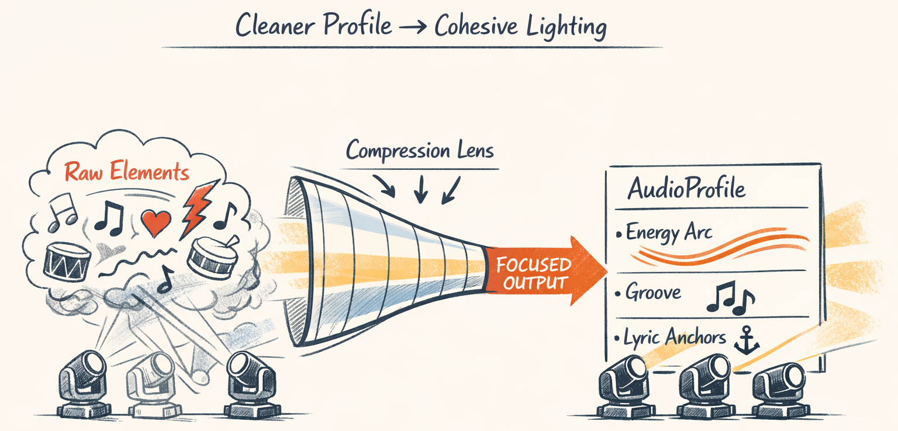
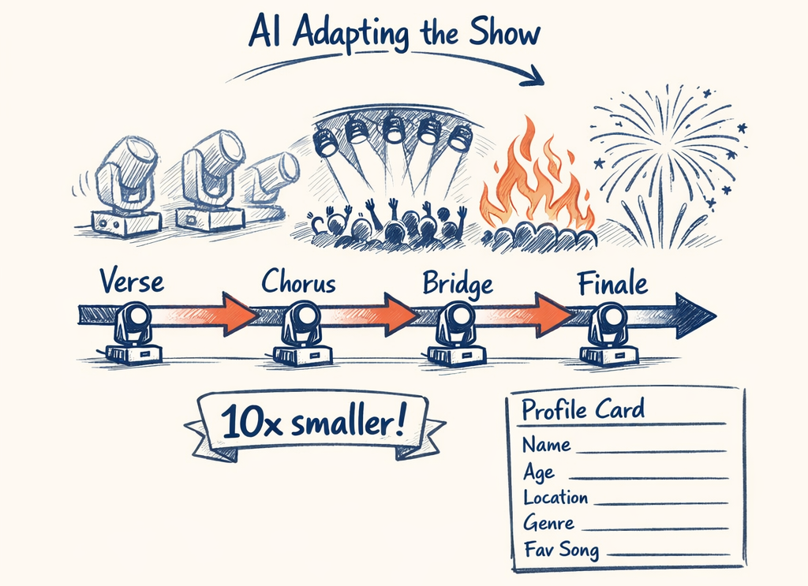
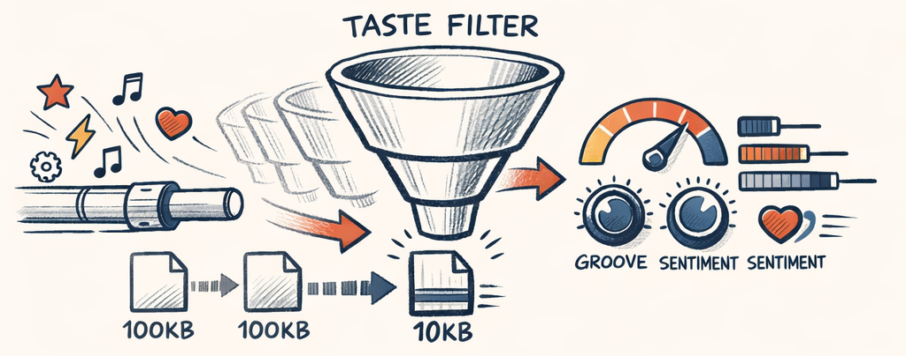
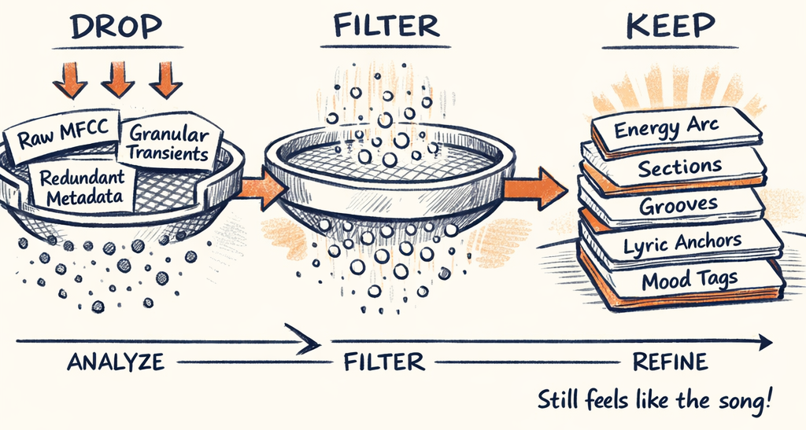

# Making Sense of Sound — LLM-Based Audio & Lyric Profiling


After Part 1, you've got ~100KB of structured audio features. Tempo, beats, energy curves at three scales, section boundaries with confidence scores, harmonic analysis, and maybe lyrics with quality metrics. It's precise. It's deterministic. And it's completely useless for making creative decisions.

Here's the problem: "section chorus_2 has mean energy 0.87, peak energy 0.94, characteristics: ['building', 'peak']" is a factual observation. "This building chorus should drive a widening fan formation at STRONG intensity, with accent pulses on the downbeats" is a creative judgment. Signal processing can produce the first. Only something that understands *music as a story* can produce the second.

This is where the LLM enters the Twinklr pipeline for the first time. And the first thing we do is throw away 90% of the data we just extracted.



---

## The 10x Compression: Why Less Is More




Sending 100KB of audio features to an LLM is a terrible idea. Not because the LLM can't handle the tokens — it can. But because drowning it in frame-level energy data and per-beat spectral centroids produces worse output than giving it a curated summary. We tested this. The verbose version generated generic, wishy-washy creative guidance. The compressed version gave us specific, actionable direction. More data, worse results. LLMs are not databases.

The `shape_context` function performs the compression:

```python
# packages/twinklr/core/agents/audio/profile/context.py
def shape_context(bundle: SongBundle) -> dict[str, Any]:
    """Shape SongBundle into minimal context for AudioProfile agent.

    Returns:
        Shaped context dictionary (~10KB, 10x reduction from ~100KB).
    """
```

Here's what survives the cut and what doesn't:

| Category | What's Kept | What's Dropped | Why |
|---|---|---|---|
| **Metadata** | Tempo, key, duration | Raw waveform, spectrograms | LLM needs the *what*, not the *how* |
| **Sections** | Canonical IDs, type, start/end ms, confidence | Frame-level segmentation data | Boundaries matter, internals don't |
| **Energy** | 8 sampled points per section, mean/peak, characteristics | Hundreds of per-frame RMS values | Shape preserved, noise removed |
| **Lyrics** | `has_plain_lyrics`, `has_timed_words`, confidence | Full lyric text, word timings | The audio profiler doesn't read lyrics — that's a different agent |
| **Harmonic** | Key, mode | Full chroma vectors, pitch curves | Key context is enough for mood |
| **Spectral** | Nothing | Centroid, flatness, brightness | Profiler doesn't need timbral detail |

The energy compression is the most interesting part. Hundreds of data points per section get reduced to exactly 8 via uniform sampling:

```python
# packages/twinklr/core/agents/audio/profile/context.py
def compress_section_curve(
    section_curve: list[dict[str, Any]], points_per_section: int = 8
) -> list[dict[str, Any]]:
    """Compress energy curve using uniform sampling.
    Always includes first and last points. 8 points preserves
    the shape (building, sustained, dropping) without the noise."""

    for i in range(points_per_section):
        fraction = i / (points_per_section - 1)
        target_ms = start_ms + int(fraction * duration_ms)
        closest_point = min(section_curve, key=lambda p: abs(p["t_ms"] - target_ms))
        result.append(closest_point)
    return result
```

Why 8? Because 8 points is enough to distinguish "building" from "sustained" from "drop" — the *shape* of the curve — without preserving every micro-fluctuation. A 30-second chorus might have 300 raw energy values. The profiler doesn't need to know about the bump at frame 147. It needs to know the energy builds from 0.65 to 0.94 over the first half and holds through the second.

Those compressed curves then get labeled:

```python
# packages/twinklr/core/agents/audio/profile/context.py
def identify_characteristics(section_curve: list[dict[str, Any]]) -> list[str]:
    """Identify: 'building', 'drop', 'sustained', 'peak', 'valley'."""

    if _is_increasing(energies, threshold=0.15):
        characteristics.append("building")
    if _has_sharp_drop(energies, threshold=0.2):
        characteristics.append("drop")
    if _is_sustained(energies, threshold=0.1):
        characteristics.append("sustained")
    if mean_energy >= 0.75:
        characteristics.append("peak")
    if mean_energy <= 0.3:
        characteristics.append("valley")
    return characteristics
```

Simple threshold logic. No ML. The labels give the LLM quick handles — "this section is building" — while the 8-point curve provides evidence. The LLM gets both the interpretation *and* the data to second-guess it.

> **Decision Point:** 10x context compression isn't just a token cost optimization — it actively improves output quality. LLMs produce better creative guidance from curated summaries than from raw data dumps. Shape the context to match the task, not the source.

---

## The Audio Profiling Agent
The compressed context goes to a single-shot LLM call that produces an `AudioProfileModel`. Here's what comes out:

```
AudioProfileModel
├── song_identity          # title, artist, BPM, key, time signature
├── structure              # section refs with canonical IDs, confidence
├── energy_profile
│   ├── macro_energy       # LOW / MED / HIGH / DYNAMIC
│   ├── section_profiles   # per-section: curve, mean, peak, characteristics
│   └── peaks              # top energy moments (up to 10)
├── creative_guidance
│   ├── recommended_layer_count   # 1-3 choreography layers
│   ├── recommended_contrast      # LOW / MED / HIGH
│   ├── recommended_motion_density # SPARSE / MED / BUSY
│   └── palette_color_guidance    # color suggestions
└── planner_hints
    ├── section_objectives  # per-section choreography goals
    ├── avoid_patterns      # what NOT to do
    └── emphasize_groups    # fixture groups to highlight
```

The `planner_hints` section is where the real value lives. This is the LLM adding interpretation that no amount of signal processing can provide. "Section verse_1 has an unusual mid-section spike at 13.8s (0.87 peak) before dropping back — use this as a surprise accent moment, not a sustained build" is the kind of observation that requires understanding *how music works*, not just what the numbers say.

> **Decision Point:** Metadata-only lyrics in the audio profile context — the LLM doesn't need to read "Rudolph with your nose so bright" to understand energy dynamics. Full lyrics go to a separate, specialized agent. This separation keeps the audio profiler focused on what it does well: interpreting sonic features.

---

## Anti-Generic Prompting: The Hardest Problem
Here's a confession: the first version of the audio profiler was useless. Not wrong — useless. It produced perfectly structured JSON that said absolutely nothing specific about any particular song. Every ballad got "keep motion minimal in the intro." Every chorus got "build gradually." Every bridge got "provide contrast." You could have swapped the output between "O Holy Night" and "Wizards in Winter" and nobody would notice.

The fix wasn't a model change or a temperature tweak. It was prompt engineering with teeth. From the system prompt:

```
## Anti-Patterns to AVOID
**FORBIDDEN - Generic Copy-Paste Advice:**
- ❌ "Start with gentle fade-in" (applies to every song with quiet intro)
- ❌ "Build gradually through section" (too generic)
- ❌ "Keep motion minimal in intro" (obvious for any low-energy section)

**REQUIRED - Song-Specific Observations:**
- ✅ "Despite the waltz time signature, this version moves at 140 BPM
     (unusually fast for a waltz) — chase patterns should be snappier
     than typical 3/4 feel"
- ✅ "The verse_1 has an unusual mid-section spike at 13.8s (0.87 peak)
     before dropping back — use this as a surprise accent moment"
- ✅ "The outro button is extremely short (4s) compared to the 3-minute
     runtime — prep for abrupt stop, not gradual fade"
```

And the enforcer — a three-question uniqueness test the LLM is instructed to apply before finalizing any recommendation:

```
**Test for Uniqueness:**
Before finalizing any creative guidance or planner hint, ask:
1. "Does this advice cite specific timing/energy data from THIS song?"
2. "Would I give this exact same advice to a different song in the same genre?"
3. "Have I identified what makes THIS song's structure/energy unusual?"

If you answer "no data cited", "yes same advice", or "no distinctive traits"
— REWRITE to be song-specific.
```

Does the LLM always follow this perfectly? No. But the failure rate dropped dramatically. The difference between "build gradually" and "energy ramps 0.30 → 0.70 across 8s (doubling) — use continuous intensity sweep" is the difference between a profile the planner can act on and one it can't.

---

## The Lyrics Profiling Agent
Lyrics get their own agent. Separate context, separate prompt pack, separate model. This isn't over-engineering — it's a fundamentally different task.

The audio profiler gets *metadata only* about lyrics: "lyrics exist, they're timed, confidence 0.82." That's it. The lyrics agent gets the full text, every word timestamp, every phrase boundary:

```python
# packages/twinklr/core/agents/audio/lyrics/context.py
def shape_lyrics_context(bundle: SongBundle) -> dict[str, Any]:
    """Full lyrics + timing for narrative analysis.
    Token budget: ~20-50KB depending on lyric length."""

    return {
        "has_lyrics": True,
        "text": bundle.lyrics.text,             # ← Full text (NOT in audio profile)
        "words": [{"text": w.text, "start_ms": w.start_ms, ...} for w in bundle.lyrics.words],
        "phrases": [...],
        "sections": [...],                       # ← Same canonical IDs as audio profile
        "quality": {"coverage_pct": ..., "source_confidence": ...},
    }
```

Notice the section IDs come from the same `generate_section_ids` function we saw in Part 1. Both agents reference `chorus_2` the same way. No "second chorus" vs. "chorus B" mismatches.

The lyrics agent produces a `LyricContextModel` with:

- **Themes** — 2–5 thematic threads ("redemption through generosity," "winter loneliness")
- **Mood arc** — emotional trajectory, not just "happy" or "sad"
- **Narrative** — story beats with timestamps, character identification, beat types (setup/conflict/climax/resolution)
- **Visual hooks** — the good stuff: "Key phrase 'jingle bell rock' at 45.2s has hard consonants — sharp white flash on 'rock' with immediate mega tree starburst"
- **Density** — vocal coverage percentage, silent sections for instrumental choreography

The visual hooks are where the lyrics agent earns its keep. "Rudolph with your nose so bright" at bar 8 → warm red glow pulse. That's a creative connection between words and lights that the audio profiler can't make because it never sees the words.

The same anti-generic techniques apply. The lyrics prompt explicitly forbids "Bright lights on chorus" and "Use red and green" — because every lyrics agent in the world would suggest red and green for a Christmas song. That's not insight. That's a default.

---

## Why Two Agents, Not One?
We get this question. If both agents look at the same song, why not combine them?

Three reasons:

**Different input shapes.** The audio profiler needs compressed energy curves and section metadata (~10KB). The lyrics agent needs full text and word-level timing (~20-50KB). Combining them means either the audio profiler drowns in lyrics it doesn't need, or the lyrics agent starves for text it does need.

**Different failure modes.** Lyrics might not exist at all — remember the five-stage fallback chain from Part 1? When lyrics are missing, the audio profiler still does its full job. The lyrics agent simply doesn't run. If they were combined, the LLM would have to handle the "no lyrics available" case inside the same prompt that handles narrative analysis. More branching in prompts means more ways to go wrong.

**Different temperatures.** The audio profiler runs at temperature 0.4 — moderate, balanced between accuracy and creative interpretation. The lyrics agent runs at 0.5 — slightly warmer, because narrative and thematic analysis benefit from more creative latitude. Both are oneshot, no iteration loop.

> **Decision Point:** Single-shot profiling vs. iterative refinement — these agents don't use the planner-critic loop from Part 3. Profiling is interpretive, not constructive. There's no "wrong" way to interpret a mood arc the way there's a "wrong" template for a section. The planner is where structural constraints exist and iteration matters. Saving that complexity here saves cost: profiling runs once per song, planning may iterate 3x.

---

## What the Planner Sees
By the time the profiling stage finishes, the downstream planner receives:

1. **Audio Profile** — energy dynamics, section character, creative guidance, planner hints (all song-specific, all grounded in timestamps and data)
2. **Lyrics Profile** (if available) — themes, mood arc, visual hooks with precise timing, narrative beats
3. **The BeatGrid** — timing truth (unchanged from Part 1)

That's roughly 15KB of curated, interpreted, creative-direction-shaped context. Down from 100KB of raw features. The planner never sees a spectral centroid or a chroma vector. It sees "chorus_2 has building energy from 0.65 to 0.94 with a peak characteristic — recommended STRONG intensity with widening fan formation."

The LLM has done its job: translate data into intent. Now the planner needs to turn that intent into a concrete choreography plan — which template, on which fixtures, at which intensity, for how many bars. That's Part 3, and it's where things get iterative.

---

*This is Part 2 of the [Building an AI Choreographer for Christmas Light Shows](#) series.*

← [Previous: Hearing the Music — Audio Analysis & Feature Extraction](audio_analysis.md) | [Next: The Choreographer — Multi-Agent Planning System →](multi_agent_planning.md)
