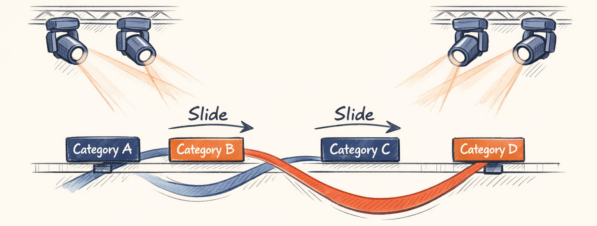
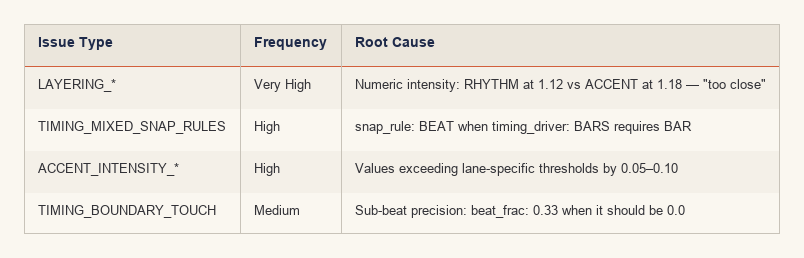
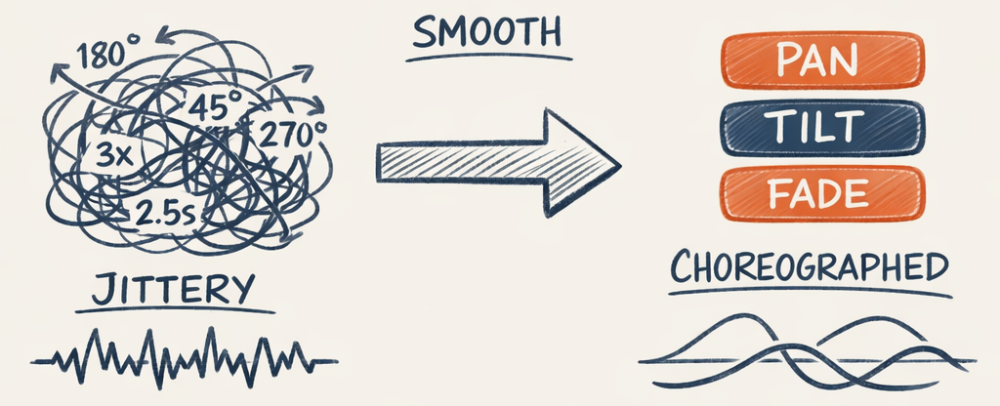
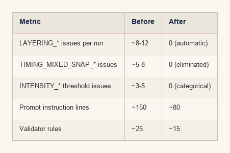

# The Categorical Pivot — Teaching an LLM to Think in Intent, Not Numbers


In our first 50 planning runs, 38% of judge failures came from numeric precision issues. The LLM would output intensity 1.24 when the limit was 1.20 — a 0.04 difference that a human wouldn't care about but a validator had to flag. We were asking the LLM to do what it's worst at. This is the story of the most consequential design change in the project, and the lesson most likely to generalize to whatever you're building.

---

## The Evidence
We keep analytics on every judge verdict. When we sorted the failure patterns, a clear picture emerged:



Here's what a concrete failure looked like. The planner would generate:

```python
# What the planner produced
Placement(
    start=TimeRef(bar=5, beat=2, beat_frac=0.33, offset_ms=None),  # ← beat_frac: why?
    end=TimeRef(bar=7, beat=1, beat_frac=0.0, offset_ms=0),        # ← offset_ms: 0 vs null
    intensity=1.24,                                                  # ← limit was 1.20
    snap_rule=SnapRule.BEAT,                                         # ← timing_driver is BARS
)
```

Four issues in one placement. The LLM got the creative decision right — "put a strong accent starting around bar 5" — but garbled every numeric detail. And every one of those details triggered a validation failure that required an iteration to fix.

The LLM wasn't stupid. It was being asked to be a calculator.

---

## The Insight
LLMs excel at categorical reasoning but struggle with precise numeric values. The architecture was asking the LLM to do what it's bad at (precision) instead of what it's good at (intent, relationships, patterns).

This isn't a Twinklr-specific observation. If you're building any system where an LLM makes decisions that get executed by deterministic code, you'll hit this. The question is whether you hit it after 50 runs of analytics or after six months of whack-a-mole prompt engineering.

---

## The Fix: Categories Instead of Numbers
We replaced every numeric field the LLM touched with a categorical enum. The principle: **the LLM expresses intent, the renderer implements precision.**



### Before (numeric)

```python
class Placement(BaseModel):
    start: TimeRef           # bar, beat, beat_frac, offset_ms
    end: TimeRef             # bar, beat, beat_frac, offset_ms
    intensity: float         # 0.0–1.5 (with lane-specific limits)
    snap_rule: SnapRule      # BAR or BEAT (must match timing_driver)
```

### After (categorical)

```python
class Placement(BaseModel):
    start: PlanningTimeRef   # bar + beat (integers only)
    duration: EffectDuration # HIT, BURST, PHRASE, EXTENDED, SECTION
    intensity: IntensityLevel # WHISPER, SOFT, MED, STRONG, PEAK
```

No `end` field. No `beat_frac`. No `offset_ms`. No `snap_rule`. Six fields became three, and all three are things the LLM is naturally good at.

---

## IntensityLevel: Names That Mean Something

```python
class IntensityLevel(str, Enum):
    WHISPER = "WHISPER"  # Barely visible, ambient
    SOFT    = "SOFT"     # Gentle, background
    MED     = "MED"      # Balanced presence
    STRONG  = "STRONG"   # Prominent, attention-drawing
    PEAK    = "PEAK"     # Maximum impact
```

The names aren't arbitrary. They carry semantic meaning the LLM can reason about. "A WHISPER during the quiet verse, building to STRONG at the pre-chorus, hitting PEAK at the final chorus" — that's a creative arc, not a numeric table. The LLM thinks in these terms naturally.

> **Decision Point:** Why WHISPER/SOFT/MED/STRONG/PEAK rather than numeric ranges — the names carry semantic weight. The LLM isn't just picking from a list; it's reasoning about musical dynamics using words that *mean something* about energy and presence. This makes the prompt simpler and the output more reliable.

## EffectDuration: Musical Time, Not Milliseconds
```python
class EffectDuration(str, Enum):
    HIT      = "HIT"       # 1-2 beats — quick accent
    BURST    = "BURST"     # 1 bar — short emphasis
    PHRASE   = "PHRASE"    # 2-4 bars — musical phrase
    EXTENDED = "EXTENDED"  # 4-8 bars — longer passage
    SECTION  = "SECTION"   # Full section duration
```

Same principle. The LLM doesn't need to calculate "start at bar 5 beat 2, end at bar 7 beat 1." It says "PHRASE starting at bar 5 beat 1" and the renderer figures out the rest based on the BeatGrid:

```python
DURATION_BEATS: dict[EffectDuration, tuple[int | None, int | None]] = {
    EffectDuration.HIT:      (1, 2),           # 1-2 beats
    EffectDuration.BURST:    (4, 4),           # Exactly 1 bar
    EffectDuration.PHRASE:   (8, 16),          # 2-4 bars
    EffectDuration.EXTENDED: (16, 32),         # 4-8 bars
    EffectDuration.SECTION:  (None, None),     # Uses section bounds
}
```

No more boundary-touch issues. No more "ends at bar 5 beat 1, next starts at bar 5 beat 1" ambiguity. The renderer resolves durations, handles gaps, and clamps to section bounds automatically.

---

## Lane-Aware Intensity: The Clever Part
This is where the design really pays off. The same `IntensityLevel` produces different numeric values depending on which lane it's in:

```python
INTENSITY_MAP: dict[IntensityLevel, dict[str, float]] = {
    IntensityLevel.WHISPER: {"BASE": 0.15, "RHYTHM": 0.25, "ACCENT": 0.35},
    IntensityLevel.SOFT:    {"BASE": 0.35, "RHYTHM": 0.50, "ACCENT": 0.65},
    IntensityLevel.MED:     {"BASE": 0.55, "RHYTHM": 0.75, "ACCENT": 0.90},
    IntensityLevel.STRONG:  {"BASE": 0.75, "RHYTHM": 0.95, "ACCENT": 1.10},
    IntensityLevel.PEAK:    {"BASE": 0.90, "RHYTHM": 1.10, "ACCENT": 1.30},
}
```

Look at the columns. At every single intensity level: `BASE < RHYTHM < ACCENT`. Always. The layer hierarchy — background quieter than rhythm, rhythm quieter than accents — is **guaranteed by the renderer**, not enforced by the LLM or the validator.

Before this change, the planner had to juggle numeric thresholds per lane: "BASE intensity must be ≤ 1.10, RHYTHM ≤ 1.20, ACCENT ≤ 1.30, and RHYTHM must always be less than ACCENT in the same section." That's four constraints the LLM had to remember simultaneously, and it would violate at least one in ~40% of plans.

Now the planner says "MED" and the renderer produces 0.55 for BASE, 0.75 for RHYTHM, and 0.90 for ACCENT. The planner doesn't know about the numbers. It doesn't need to.

> **Decision Point:** Lane-aware intensity mapping — the same "MED" intensity produces different numeric values for BASE, RHYTHM, and ACCENT lanes, guaranteeing layer hierarchy without the LLM knowing about it. This eliminated LAYERING_* issues entirely. Not reduced — eliminated.

---

## Timing: Just Bar and Beat
The old `TimeRef` had four fields:

```python
class TimeRef(BaseModel):
    bar: int                    # Bar number
    beat: int                   # Beat within bar
    beat_frac: float = 0.0     # Sub-beat fraction
    offset_ms: int | None      # Fine-tuning offset
```

The new `PlanningTimeRef` has two:

```python
class PlanningTimeRef(BaseModel):
    bar: int = Field(ge=1)     # Bar number (1-indexed)
    beat: int = Field(ge=1)    # Beat within bar (1-indexed)
```

The `beat_frac` field existed because we thought the LLM might need sub-beat precision for syncopation. It never used it correctly. It would output `0.33` or `0.5` or `0.0` seemingly at random. The `offset_ms` field was for fine-tuning — and the LLM would put `0` instead of `null`, which meant something different. The `snap_rule` field coordinated with `timing_driver`, and they mismatched constantly.

All gone. Bar and beat, both integers. The renderer handles sub-beat feel through optional `TimingHint` values (AND for half-beat syncopation, ANTICIPATE for tension), but the planner defaults to ON_BEAT and that's fine for 95% of placements.

> **Decision Point:** Eliminating `snap_rule` and `timing_driver` entirely — these were coordination fields that existed only to prevent timing mismatches. They *caused* more mismatches than they prevented. Categorical durations made them unnecessary.

---

## The Prompt Before and After
This is what the prompt instructions looked like before:

```
Intensity limits: BASE ≤1.10, RHYTHM ≤1.20, ACCENT ≤1.30
Timing: Use BAR_BEAT with offset_ms: null (never use offset_ms: 0)
Ensure start < end (no zero-duration placements)
Match snap_rule to timing_driver (BARS↔BAR, BEATS↔BEAT, LYRICS↔BEAT)
```

And after:

```
Intensity: WHISPER (ambient) → SOFT (gentle) → MED (balanced) →
           STRONG (prominent) → PEAK (maximum)

Duration:  HIT (1-2 beats) → BURST (1 bar) → PHRASE (2-4 bars) →
           EXTENDED (4-8 bars) → SECTION (full)

Timing:    bar + beat (integers only). Renderer handles the rest.
Layering:  Automatic. Same level = same relative prominence.
```

The prompt went from rules the LLM had to memorize and apply to vocabulary the LLM could reason with naturally. The instructions went from "don't exceed 1.20" to "pick STRONG for prominent moments." One of those the LLM handles effortlessly. The other it fails at 38% of the time.

---

## Results


The first-iteration approval rate jumped. Plans that would have taken 2-3 iterations to pass now approved on the first try — not because the LLM got smarter, but because we stopped asking it to do the wrong job.

---

## The Generalizable Principle
This applies to any system where an LLM makes decisions that get executed by deterministic code. The process:

1. **Track your failures.** Analytics first, opinions second. We knew numeric precision was the problem because we counted the issue types, not because we guessed.

2. **Identify the boundary.** What is the LLM good at? (Categorical reasoning, creative selection, pattern matching.) What is it bad at? (Numeric precision, spatial math, temporal consistency.) Draw the line between them.

3. **Give the LLM vocabulary, not constraints.** Rules like "don't exceed 1.20" are constraints the LLM has to enforce on itself. Categories like WHISPER/SOFT/MED/STRONG/PEAK are vocabulary the LLM reasons with. The former fails. The latter works.

4. **Let the deterministic side own precision.** The renderer doesn't care if the LLM says "STRONG" or "intensity 1.15" — but only one of those is reliable input.

We should have done this from day one. The six weeks of numeric experiments were educational in the way that touching a hot stove is educational — you only need the lesson once, but you'll remember it.

---

Part 5 dives into the mechanical side of prompting: how schemas get auto-injected to prevent drift, how taxonomy enums stay synchronized across prompts and validators, and the three-layer prompt architecture that makes all of this manageable.

---

*This is Part 4 of the [Building an AI Choreographer for Christmas Light Shows](#) series.*

← [Previous: The Choreographer — Multi-Agent Planning System](multi_agent_planning.md) | [Next: Prompt Engineering — Schema Injection, Taxonomy, and Anti-Patterns →](prompt_engineering.md)
