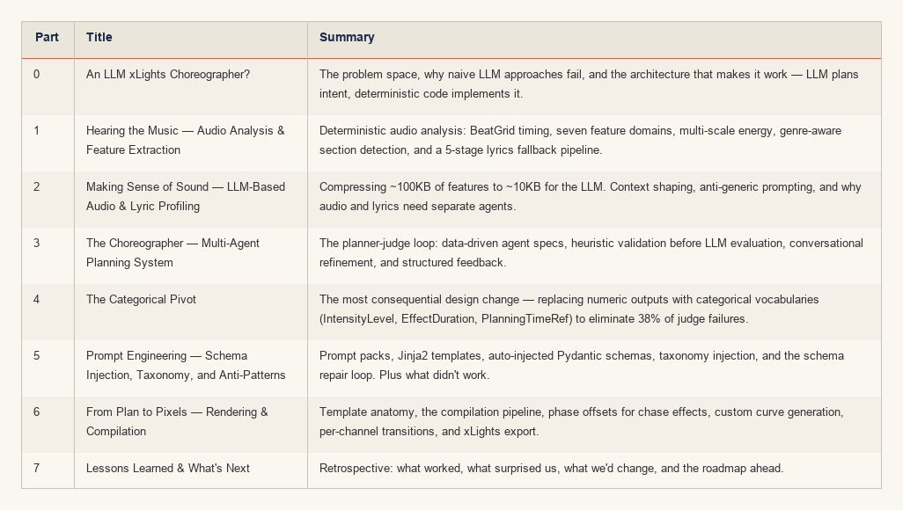

# Building an AI Choreographer for Christmas Light Shows

An 8-part series covering the design, architecture, and hard-won lessons from building **Twinklr** — an AI system that listens to a Christmas song and produces a fully choreographed moving head light show for xLights. No manual keyframing. No DMX by hand. Just music in, synchronized lights out.

The series follows the full pipeline: from raw audio analysis through LLM-based planning to deterministic rendering, covering the architecture decisions, failure modes, and design pivots along the way.

---

## Series Contents

---

## Key Themes

- **Creative vs. Deterministic boundary** — The LLM handles creative judgment (which template, what intensity, how long); deterministic code handles implementation (curves, angles, DMX values).
- **Categorical over numeric** — LLMs excel at categorical selection and fail at spatial math and numeric precision. Design your interfaces accordingly.
- **Multi-agent iteration** — A planner-judge loop with structured feedback converges faster than single-shot generation.
- **Schema as contract** — Auto-injecting Pydantic schemas into prompts eliminates schema drift and silent failures.

---

[Back to Docs Home](../index.md)
