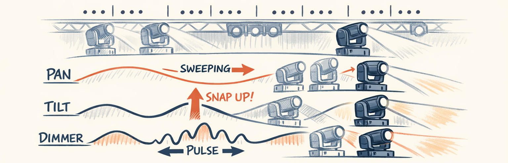
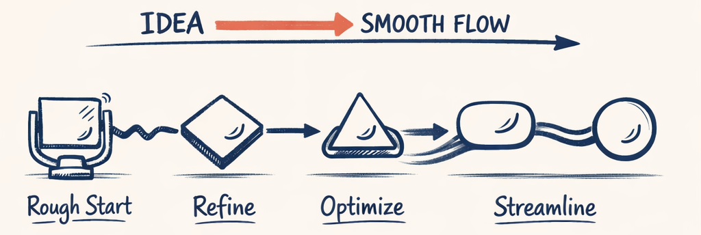
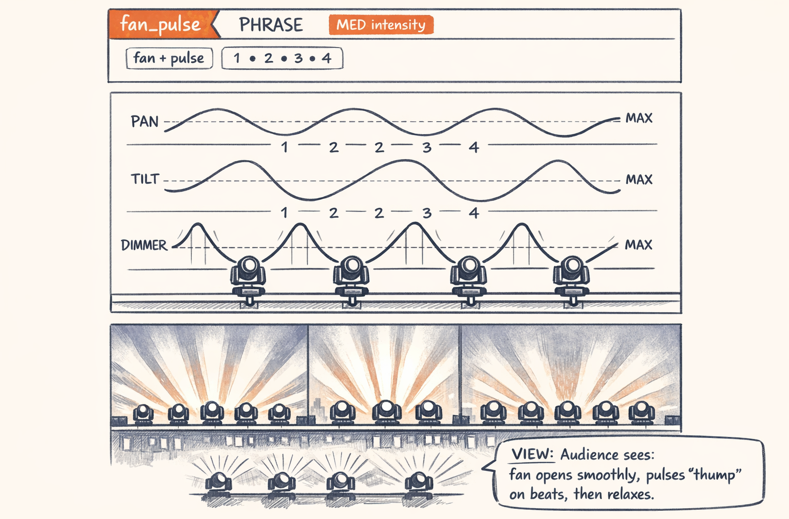
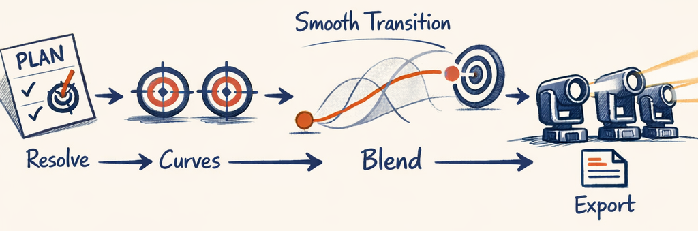
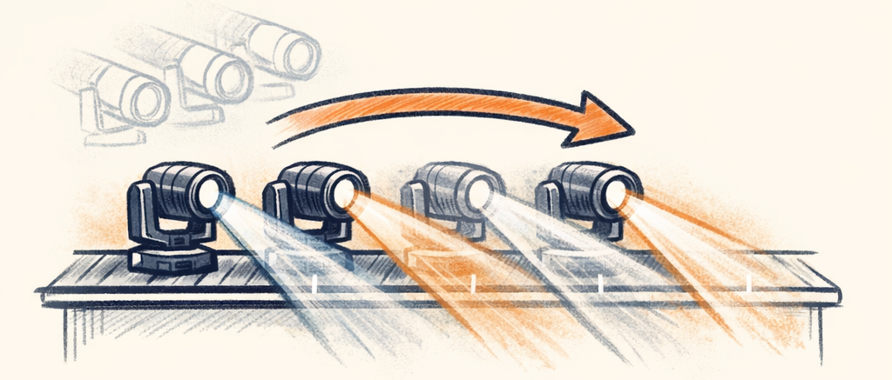

# From Plan to Pixels — Rendering & Compilation


The LLM has done its job: "fan_pulse template, MED intensity, PHRASE duration, starting at bar 5 beat 1, on the LEFT group." Beautiful. Concise. Categorical. Now the renderer takes over, and this side of the system has zero LLM involvement. It's geometry, curve math, timing, and DMX channel values — all deterministic, all precise, all reproducible. Same plan in, same lights out, every time.

This is the part where the architecture principle from Part 0 earns its keep. The LLM said "fan_pulse." The renderer has to turn that into eight individual pan angles, eight dimmer curves, all beat-aligned, all physically valid for the moving head hardware.

---

## What a Template Actually Is
A template is a complete choreography unit — geometry, movement, dimmer — defined in Python. Here's `fan_pulse` from the builtins:

```python
# packages/twinklr/core/sequencer/moving_heads/templates/builtins/fan_pulse.py
@register_template(aliases=["Fan Pulse", "fan pulse"])
def make_template() -> TemplateDoc:
    return TemplateDoc(
        template=Template(
            template_id="fan_pulse",
            category=TemplateCategory.MEDIUM_ENERGY,
            repeat=RepeatContract(
                repeatable=True,
                mode=RepeatMode.PING_PONG,       # ← Forward, then reverse
                cycle_bars=4.0,                    # ← 4 bars per cycle
                remainder_policy=RemainderPolicy.HOLD_LAST_POSE,
            ),
            steps=[
                TemplateStep(
                    step_id="main",
                    geometry=Geometry(
                        geometry_type=GeometryType.FAN,
                        pan_pose_by_role=PoseByRoleHelper.FAN_POSE_WIDE,
                        tilt_pose=TiltPose.HORIZON,
                    ),
                    movement=Movement(
                        movement_type=MovementType.HOLD,   # ← Stay in formation
                        intensity=Intensity.SMOOTH,
                    ),
                    dimmer=Dimmer(
                        dimmer_type=DimmerType.PULSE,       # ← Brightness pulses
                        intensity=Intensity.DRAMATIC,
                        min_norm=0.20,                      # ← Never fully dark
                        max_norm=1.00,                      # ← Full bright at peak
                        cycles=2.0,                         # ← 2 pulses per step
                    ),
                )
            ],
        )
    )
```



Every template has the same anatomy:

- **Geometry** — where the fixtures point. FAN means symmetric spread from center; CHEVRON means V-shape; PARALLEL means all pointing the same direction. Each type has a math function that calculates per-fixture pan/tilt angles based on position.
- **Movement** — how the fixtures move over time. HOLD means stay in the geometry position. SWEEP means pan across a range. PENDULUM means oscillate back and forth. CIRCLE means... you get it.
- **Dimmer** — the brightness pattern. PULSE is a sine-like curve. FADE_IN ramps up. HOLD stays constant.
- **Repeat** — how the step cycles within the section. PING_PONG means forward then reverse (the fan widens then narrows). LOOP means restart from the beginning.

The planner picks `template_id` + `preset_id`. A single template can have multiple presets — named variations that modify parameters like geometry width, movement speed, or dimmer range via `StepPatch`. The renderer loads the template, applies the preset, and compiles.

> **Decision Point:** Templates as complete choreography units (geometry + movement + dimmer in one step) rather than composing primitives at runtime. We tried the primitive approach first — let the planner pick geometry, movement, and dimmer independently. The combinations were combinatorially explosive and most of them looked terrible. Pre-bundled templates are predictable and testable. The tradeoff is less creative freedom, but the LLM wasn't using that freedom well anyway.

---

## The Compilation Pipeline
## Hero Walkthrough: One Template → Rendered Curves (What You’d Actually See)

This is the “make it real” bridge: one phrase-level template becomes **smooth moving-head motion + dimmer choreography** that reads from the street.



**What to notice**
- The template is **categorical** (PHRASE / MED / fan_pulse), not numeric micromanagement.
- The renderer converts it into **continuous curves** (easing + limits + blending).
- The visible result is a clean “fan opens → pulse hits on beats → fan relaxes,” not jittery servo jumps.


Here's what happens when the renderer processes a plan:


The `compile_template` function orchestrates this from `template_compiler.py`. The interesting stages:

**Repeat scheduling** figures out how many times a 4-bar template fits into a 12-bar section (3 times, with the third being a PING_PONG reverse). Remainder handling is per-template: HOLD_LAST_POSE freezes the final frame, TRUNCATE hard-cuts, FADE_OUT dims smoothly at the section boundary.

**Step compilation** is where DMX values actually get calculated. For each fixture in the step, three handlers run:
1. **Geometry handler** → pan angle and tilt angle (static DMX values, calculated from fixture position)
2. **Movement handler** → pan/tilt curves (if the fixture is moving over time)
3. **Dimmer handler** → brightness curve (from the dimmer type and intensity parameters)

Each handler produces a `ChannelValue` — either a static DMX byte or a normalized curve.

---

## Phase Offsets: Making Lights Chase
This is one of the most visually satisfying concepts in the system. A phase offset means different fixtures start the same animation at slightly different times — creating a wave or chase effect.

```python
# packages/twinklr/core/sequencer/moving_heads/compile/phase_offset.py
def calculate_fixture_offsets(
    config: PhaseOffset,
    fixture_ids: list[str],
) -> PhaseOffsetResult:
    """Linear distribution: offset = (i / (n-1)) * spread_bars"""
```

Concrete example: 4 fixtures with LEFT_TO_RIGHT chase order and `spread_bars=1.0`:

```
Fixture:     [1]     [2]     [3]     [4]
Offset:      0.0    0.33    0.67    1.0   (bars)

    Time →
    ┌─────┐
[1] ██████░░░░░░░░░░░░░░   ← starts immediately
[2] ░░░██████░░░░░░░░░░░   ← starts +0.33 bars later
[3] ░░░░░░██████░░░░░░░░   ← starts +0.67 bars later
[4] ░░░░░░░░░██████░░░░░   ← starts +1.0 bar later

    Same animation on all fixtures, just staggered in time.
    The audience sees a pulse rippling left to right.
```



The same template + different `PhaseOffset` configs produce all variants: left-to-right, right-to-left, outside-in, inside-out. One template definition, multiple visual effects through timing alone.

> **Decision Point:** Phase offset as a first-class concept. Rather than creating separate templates for "left-to-right chase" and "outside-in chase" and "synchronized," a single template with different PhaseOffset configurations produces all variants. This keeps the template library manageable while offering combinatorial visual variety.

Key consequence: fixtures with different phase offsets have different curves, so they can't be grouped in the xLights export. Each fixture gets its own effect placement. The compiler marks these segments as `allow_grouping=False` automatically.

---

## Curves: Why xLights Builtins Aren't Enough
xLights has built-in curve types — sine, ramp, ease-in-out. We use them where they fit. But three requirements forced us to build custom curve generation:

**Offset-centered movement curves.** Pan and tilt curves center around 0.5 (representing the geometry's base position), not 0.0. A SWEEP from -30° to +30° is values oscillating around 0.5, where the amplitude maps to degrees. xLights' built-in curves are 0-to-1 linear, not center-offset.

```python
# Pan/tilt DMX conversion (offset-centered)
dmx = base_dmx + amplitude_dmx * (v - 0.5)
#     ↑ from geometry   ↑ from template    ↑ curve oscillates around 0.5

# Example: base=128 (center), amplitude=64
#   v=0.0 → dmx = 128 - 32 = 96    (left extreme)
#   v=0.5 → dmx = 128              (center position)
#   v=1.0 → dmx = 128 + 32 = 160   (right extreme)
```

**Loop-ready curves.** For PING_PONG and LOOP repeat modes, curves must start and end at the same value for seamless cycling. A pulse that starts at 0.0 and ends at 0.8 would visually "pop" on each cycle boundary.

**Musical timing.** Beat-aligned pulses, accent hits on downbeats, phrases that swell across 4 bars — these require curves that know about the BeatGrid. The `CurveGenerator` routes between `NativeCurveProvider` (xLights-compatible, fast) and `CustomCurveProvider` (Twinklr-specific, for offset-centered and musical curves).

---

## ChannelValue: The Dual Representation
Every channel in every segment is either a static DMX byte or a curve:

```
ChannelValue:
  ├── Static: fixed DMX value (0-255)
  │   Example: tilt angle = 180 (pointing down)
  │
  └── Curve: normalized 0-1 points, mapped differently per channel:
      ├── Pan/Tilt (offset-centered):
      │   dmx = base_dmx + amplitude * (v - 0.5)
      │
      └── Dimmer (linear):
          dmx = clamp_min + v * (clamp_max - clamp_min)
```

A fixture that's holding a fan position but pulsing its dimmer has static pan/tilt channels and a curve dimmer channel. A fixture that's sweeping while pulsing has curves on pan, tilt, *and* dimmer. The compiler decides based on the template's movement and dimmer types.

---

## Transitions: Different Channels, Different Strategies
At section boundaries — where one template ends and the next begins — the `ChannelBlender` handles transitions per channel type:

| Channel | Strategy | Why |
|---|---|---|
| **Pan/Tilt** | `SMOOTH_INTERPOLATION` | Don't jerk the servo. Interpolate smoothly between positions. |
| **Dimmer** | `FADE_VIA_BLACK` | Dim to 0, switch geometry, dim back up. Hides the position change. |
| **Gobo/Color** | `SNAP` | Instant change. You can't crossfade a mechanical gobo wheel. |
| **Shutter** | `SEQUENCE` | Close, hold, open. Timed sequence for clean shutter cuts. |

```python
# FADE_VIA_BLACK: the workhorse transition for dimmer
if t < 0.5:
    blended = source_dmx * (1 - t * 2)    # Fade out to black
else:
    blended = target_dmx * (t - 0.5) * 2  # Fade in from black
```

The `SMOOTH_INTERPOLATION` for pan/tilt uses the curve generator to produce eased movement — not linear interpolation, which makes servos look robotic, but cosine-eased curves that accelerate and decelerate naturally.

> **Decision Point:** Per-channel transition strategies — you can't crossfade a gobo wheel, and you shouldn't snap a pan servo. Different physical channels demand different blending behavior. The blender selects strategy based on channel metadata, not a global setting.

---

## xLights Export: The Final Translation
The `DmxSettingsBuilder` converts `FixtureSegment` objects into xLights-format DMX settings strings:

```
E_SLIDER_DMX1=0,                    ← Static value (0 if curve exists)
E_VALUECURVE_DMX1=Active=TRUE|      ← Curve follows
  Type=Custom|
  Min=0.00|Max=255.00|
  Values=0.00:0.00;0.25:0.50;       ← time:value pairs, normalized [0,1]
  0.50:1.00;0.75:0.50;1.00:0.00|
```

Curve points are pairs of `time:value`, semicolon-separated, both normalized 0–1. The builder anchors at 0.0 and 1.0 to ensure clean starts and endings. Two decimal precision throughout — xLights requires it.

The export also handles per-fixture channel inversion (some fixtures wire DMX backwards), channel mapping (which DMX channel is pan, which is tilt), and semantic grouping optimization — identical curves on grouped fixtures can be written to the group element instead of per-fixture, reducing file size.

---

## The Full Stack, One Last Time
Starting from "fan_pulse, MED, PHRASE, bar 5 beat 1":

1. **Template load**: `fan_pulse` → FAN geometry + HOLD movement + PULSE dimmer
2. **Categorical resolve**: `MED` → 0.75 (RHYTHM lane) via INTENSITY_MAP
3. **Timing resolve**: bar 5, beat 1, PHRASE → 8 beats → ends at bar 7 beat 1
4. **Repeat schedule**: 1 cycle fits (PHRASE = 2-4 bars, template cycle = 4 bars)
5. **Phase offsets**: LEFT_TO_RIGHT with spread 0.5 bars across 4 fixtures
6. **Step compile**: geometry handler → pan angles (per-fixture), movement handler → static (HOLD), dimmer handler → pulse curve
7. **Clip to boundary**: section ends at bar 8, we end at bar 7 — no clipping needed
8. **Export**: 4 fixture segments → 4 xLights DMX effect placements with value curves

The LLM said three words: `fan_pulse MED PHRASE`. The renderer produced hundreds of precise DMX values — all mathematically derived, all beat-aligned, all hardware-valid.

That's the boundary working as designed.

---

*This is Part 6 of the [Building an AI Choreographer for Christmas Light Shows](#) series.*

← [Previous: Prompt Engineering — Schema Injection, Taxonomy, and Anti-Patterns](prompt_engineering.md) | [Next: Lessons Learned & What's Next →](lessons_learned.md)
