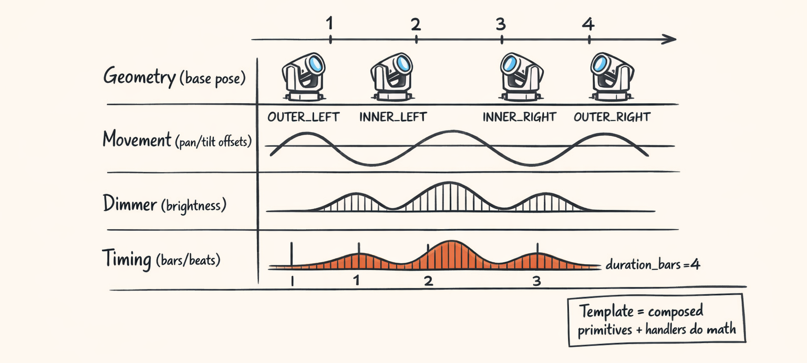
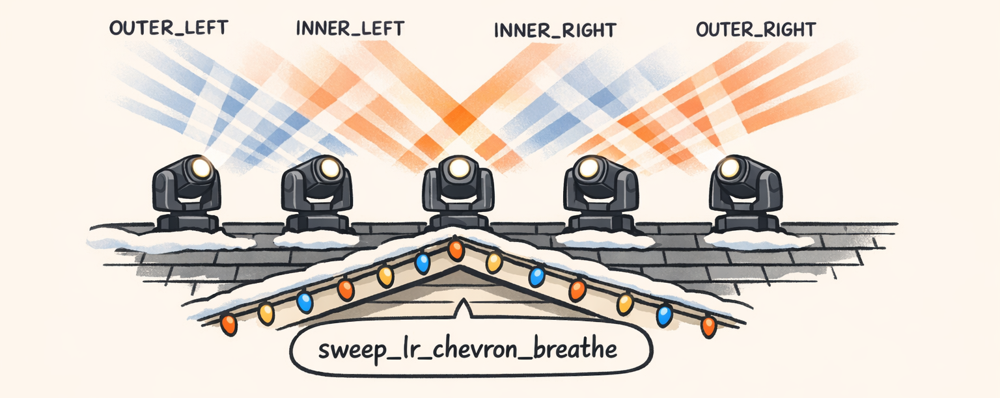

# The LLM Clocked Out. The Math Punched In.


## So… What’s a “Template,” Actually?

Look, “template” is one of those words that means nothing until you’ve debugged it at 2AM while your front yard is doing something that can only be described as *aggressively wrong*.

In Twinklr, a **template** is a choreography unit.

It’s not “a curve.” It’s not “an effect.” It’s more like a small declarative program that says:

- **Geometry**: where each fixture *wants* to point in space (like “make a chevron V”)
- **Movement**: how pan/tilt evolves over time (like “sweep left-to-right, ping-pong”)
- **Dimmer**: how brightness changes (like “breathe/pulse instead of blink”)
- **Timing**: how long it runs, how it aligns to bars/beats, and how fixtures chase each other

The important bit: templates don’t do math. Templates *compose primitives*.

The template definition is mostly configuration—types + params.

The actual math lives in handlers: geometry handlers, movement handlers, dimmer handlers. That separation is the only reason this system is still alive.

Because the deterministic core—**the part that turns intent into motion**—has **zero LLMs anywhere near it**.

Not “we limit the LLM.”
Not “the LLM suggests values.”
Not “guardrails.”

Just… no.

The planner can pick `sweep_lr_chevron_breathe`. It can pick “medium energy.” It can pick “4 bars.” It can even pick which fixtures participate.

But once we start compiling, it’s math all the way down.

Why we did it this way:

- **Testability:** you can unit test “CHEVRON_V with these roles returns these pan/tilt anchors”
- **Composability:** you can reuse geometry with different movement, or reuse dimmer with different timing
- **Sanity:** when something looks wrong, you know where to go. (Spoiler: it’s always phase offsets. Always.)

If you take anything from Part 0, it’s this: a template is a *contract* between “creative intent” and “DMX reality.”

And the compiler is the bouncer at the door.



## Meet `sweep_lr_chevron_breathe` (106 Lines of Trouble)

Here’s the thing: this template looks simple when you describe it in English:

- Put the 4 fixtures into a **chevron V**
- Sweep their pan **left → right**
- Add a little **breathing** on dimmer
- Stagger the fixtures so it feels like a chase
- Run it for **4 bars**, then **ping-pong** back on repeat

Now here’s the same thing as code. Part 1 is where we do the line-by-line autopsy.

```python
@register_template(aliases=["Sweep LR Chevron Breathe", "sweep lr chevron breathe"])
def make_template() -> TemplateDoc:
    return TemplateDoc(
        template=Template(
            template_id="sweep_lr_chevron_breathe",
            version=1,
            name="Sweep LR Chevron Breathe",
            category=TemplateCategory.MEDIUM_ENERGY,
            roles=TemplateRoleHelper.IN_OUT_LEFT_RIGHT,
            repeat=RepeatContract(
                repeatable=True,
                mode=RepeatMode.PING_PONG,
                cycle_bars=4.0,
                loop_step_ids=["main"],
                remainder_policy=RemainderPolicy.HOLD_LAST_POSE,
            ),
            defaults={"dimmer_floor_dmx": 60, "dimmer_ceiling_dmx": 255},
            steps=[
                TemplateStep(
                    step_id="main",
                    timing=StepTiming(
                        base_timing=BaseTiming(
                            mode=TimingMode.MUSICAL,
                            start_offset_bars=0.0,
                            duration_bars=4.0,
                            quantize_type=QuantizeMode.DOWNBEAT,
                        ),
                        phase_offset=PhaseOffset(
                            mode=PhaseOffsetMode.GROUP_ORDER,
                            order=ChaseOrder.LEFT_TO_RIGHT,
                            spread_bars=1.0,
                            distribution=Distribution.LINEAR,
                            wrap=True,
                        ),
                    ),
                    geometry=Geometry(
                        geometry_type=GeometryType.CHEVRON_V,
                        params={
                            "pan_start_dmx": PanPose.WIDE_LEFT.value,
                            "pan_end_dmx": PanPose.WIDE_RIGHT.value,
                            "tilt_base_dmx": TiltPose.CEILING.value,
                            "tilt_inner_bias_dmx": 18,
                            "tilt_outer_bias_dmx": 0,
                        },
                    ),
                    movement=Movement(
                        movement_type=MovementType.SWEEP_LR,
                        intensity=Intensity.MEDIUM,
                        params={
                            "ping_pong": True,
                        },
                    ),
                    dimmer=Dimmer(
                        dimmer_type=DimmerType.BREATHE,
                        intensity=Intensity.MEDIUM,
                        params={
                            "pulse_floor_key": "dimmer_floor_dmx",
                            "pulse_ceiling_key": "dimmer_ceiling_dmx",
                        },
                    ),
                    metadata=TemplateMetadata(
                        tags=["sweep", "chevron", "breathe", "moving_heads"]
                    ),
                )
            ],
        )
    )
```

Visually, what we expect:

- The four beams form a **V** shape (inner fixtures slightly “higher” / tighter)
- The whole formation sweeps **left-to-right**
- Brightness **pulses** in a smooth “breathe” (not a strobe)
- Each fixture is slightly phase-shifted so it feels like motion traveling across the roofline

The key knobs we’ll keep revisiting (and occasionally blaming):

- `GeometryType.CHEVRON_V`
- `MovementType.SWEEP_LR`
- `DimmerType.BREATHE`
- `ChaseOrder.LEFT_TO_RIGHT`
- `spread_bars=1.0`
- `RepeatMode.PING_PONG`

And yes, the weirdness is in two places:

1. **Phase offsets** (they make everything feel alive… or completely broken)
2. **Offset-centered movement semantics** (Part 4: “0.5 means don’t move” and other crimes)



## The Pipeline, End-to-End (No Magic, Just Steps)

Here’s the end-to-end pipeline that turns that template doc into DMX-driving segments.

No magic. Just a bunch of steps where we cry quietly and add another clamp.

### Template lookup: strings become factories

Templates live in a registry because we want a **fresh instance every time**. Mutable state in template models is the kind of problem that waits until you have *two* songs in a playlist, then ruins your weekend.

Registry code is in:

```python
def _norm_key(s: str) -> str:
    # "Sweep LR Chevron Breathe" -> "sweep_lr_chevron_breathe"
    return "".join(ch.lower() if ch.isalnum() else "_" for ch in s).strip("_")
```

And lookup returns a deep copy by default:

```python
class TemplateRegistry:
    def get(self, key: str, *, deep_copy: bool = True) -> TemplateDoc:
        tid = self._aliases.get(_norm_key(key), key)
        factory = self._factories_by_id.get(tid)
        if not factory:
            raise TemplateNotFoundError(f"Unknown template: {key}")

        t = factory()
        return t.model_copy(deep=True) if deep_copy else t
```

That `deep_copy=True` is doing more work than it looks like.

Because we tried `deep_copy=False` early on, and then some handler would stash compiled curves on the model “for convenience,” and suddenly template runs would leak into each other like a bad multiverse movie.

> **Open secret:** if you ever see “for convenience” in a PR description, you should probably run.

### Compile orchestration: where templates become IR segments

The top-level orchestration and main entry point is exactly what you think it is:

```python
@log_performance
def compile_template(
    template: Template,
    context: TemplateCompileContext,
    preset: TemplatePreset | None = None,
) -> TemplateCompileResult:
    """
    Orchestrates:
    1) preset patching
    2) repeat scheduling
    3) phase offsets
    4) per-step per-fixture compile into IR segments
    5) remainder handling (truncate/fade/hold)
    """
    ...
```

`TemplateCompileResult.segments` is our IR: a list of `FixtureSegment` objects.

Think: “pan curve from 4.0s to 5.2s for fixture `fx3`.” Boring on paper. Extremely loud in your yard.

Later we turn segments into DMX frames, then export to an xLights `.xsq`.

### Presets (even when you don’t use them)

This is one of those “why is this even here?” moments.

We apply presets even when none is provided because the compiler wants a single pathway. Presets can override defaults like `dimmer_floor_dmx`, or swap out handler params.

The important thing is: presets are applied to a **copy**, not the shared registry instance.

(If you’re sensing a theme: deep copy everything, trust nothing.)

### Repeat scheduling: PING_PONG isn’t just “loop it”

`RepeatMode.PING_PONG` means: play forward for one cycle, then play backward for the next, without us having to define two steps.

That happens in repeat scheduling (`schedule_repeats`) which expands `main` into step instances with reversed time semantics on alternate cycles.

We’ll dig into the guts later in the series, but for Part 0 the mental model is:

- Template says “`main` runs 4 bars”
- Repeat contract says “cycle is 4 bars, ping-pong repeatable”
- Scheduler emits a sequence of step instances: forward, backward, forward…

### Per-fixture compilation: geometry → movement → dimmer → phase offsets

For each fixture:

1. **Resolve geometry** (CHEVRON_V decides where “home” and “end” are)
2. **Generate movement curves** (SWEEP_LR produces time-varying pan/tilt curves)
3. **Generate dimmer curves** (BREATHE produces intensity over time)
4. **Apply phase shift** (LEFT_TO_RIGHT spreads offsets across 1.0 bars)
5. **Emit segments** (`FixtureSegment`s with time bounds)

Then we do transitions and DMX conversion downstream.

The pipeline diagram looks like this:


That’s the whole thing. It’s just steps.

It’s also where every bug hides, because each step is “reasonable” in isolation and *unhinged* in combination.

## Why We Don’t Let the LLM Touch the DMX (We Tried. It Was Bad.)

So yeah. We tried letting the model output “DMX-ish” values directly.

It went about as well as you’d expect when you ask a stochastic text machine to drive hardware.

Here are three real classes of failures we hit early:

1. **Physically impossible motion**
   - The model would output a pan curve that jumped from DMX 20 to DMX 240 in one frame.
   - On a moving head, that’s not “snappy.” That’s “slam the yoke like it owes you money.”

2. **Clipping and nonsense ranges**
   - Dimmer values: `-15`, `300`, `1000`
   - Tilt values that aimed straight into the neighbor’s driveway because “it felt energetic”
   - Cool. So now our QA process includes apologizing to Linda next door.

3. **Non-determinism**
   - The same prompt would produce slightly different numbers.
   - Which means you can’t regression test. You can’t reproduce bugs. You can’t do the one thing engineers do when reality is chaotic: **freeze the chaos and measure it**.

This is the boundary we ended up drawing:

- LLM can express **intent**: choose template, energy, fixture groups, rough structure
- Compiler expresses **precision**: curves, timing, phase, clamping, DMX conversion

Determinism buys us the unsexy stuff that keeps the project alive:

- reproducible renders
- unit tests
- regression tests
- “what changed?” diffs that actually mean something

Later parts preview (because these are the things that actually burned time):

- curve loop readiness (seams that pop on repeat)
- amplitude clamping (prevent neighbor-driveway incidents)
- RDP simplification (because 10,000 points per curve is how you DOS your own exporter)

The LLM didn’t get fired because it’s dumb.

It got fired because DMX is a contract with physics, and physics doesn’t accept “pretty close.”

## Checkpoint: What We Can Build Now

At this point, you can name the major stages without making up new words:

- template definition (declarative doc)
- registry lookup (factory + deep copy)
- repeat scheduling (PING_PONG expansion)
- handler compilation (geometry/movement/dimmer)
- phase offsets (fixture staggering)
- IR segments (`FixtureSegment`s)
- transitions
- DMX conversion
- xLights `.xsq` export

Part 1 is where we stop waving our hands and start reading the template line-by-line:

**Part 1: _“One Python Function, 40 Decisions: Dissecting a Template Without Crying”_**

And Part 2 is where we get into geometry math and discover that “just point them in a V” is a sentence that ruins friendships:

**Part 2: _“Point the Beams in a V, They Said. It’ll Be Easy, They Said.”_**

Until then, if you remember one thing: the planner’s output is where the story starts…

…and the compiler is where it becomes real.

---

## About twinklr


twinklr is our ongoing science experiment in weaponizing holiday cheer. It's an AI-driven choreography and composition engine that takes an audio file and spits out fully synchronized sequences for Christmas light displays in xLights — because apparently we looked at a normal, peaceful hobby and thought, "What if we added AI, machine learning and sleepless nights?"

Here's the honest disclaimer: we're not professional lighting designers. We're developers, engineers, and AI researchers who spend our days building at the frontier of AI… and our nights obsessing over why a dimmer curve feels "late" by half a beat and whether a roofline sweep should be dramatic or merely aggressively festive. If you're expecting polished stage-production wisdom, you're in the wrong place. If you're into nerdy overengineering, mildly unhinged experimentation, and the occasional "how did that even work?" moment — welcome.

This blog is the running log of our journey.

---