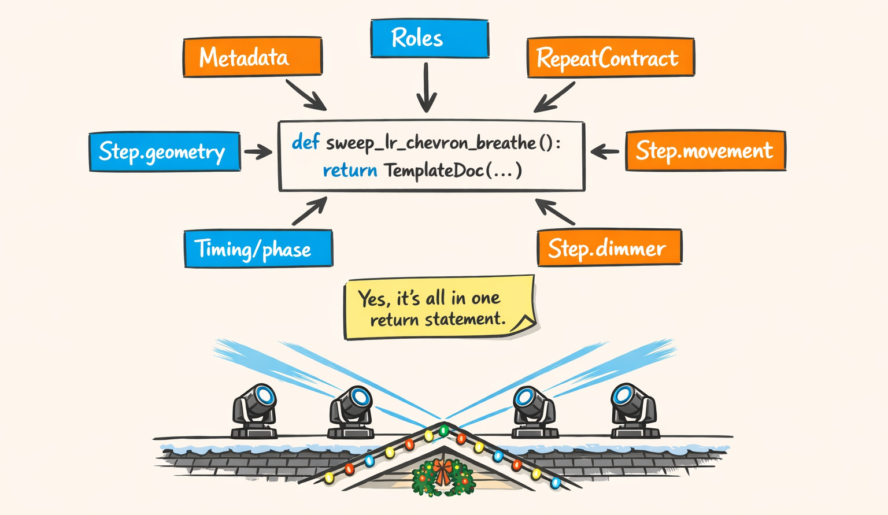
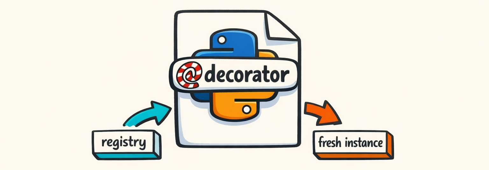
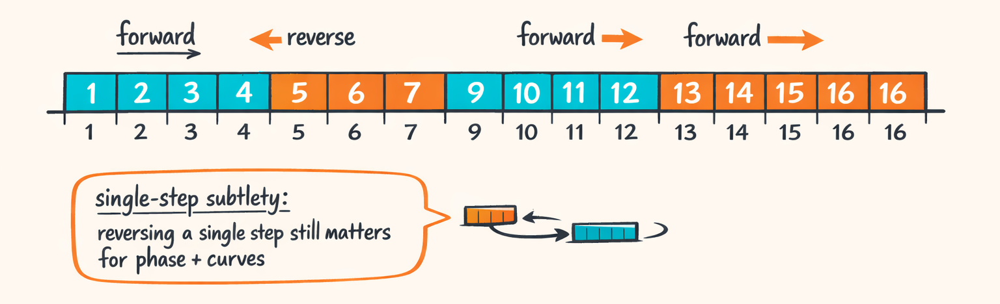

# One Python Function, 40 Decisions: Dissecting a Template Without Crying



So in the intro ("The LLM Clocked Out. The Math Punched In."), we ended with the planner cheerfully saying:

*use `sweep_lr_chevron_breathe`.*

Cool.

That’s like a chef saying “make pasta” and then leaving you alone in a kitchen where the stove randomly changes units from Fahrenheit to DMX.

This part is about the template itself: the **one Python function** that looks harmless until you realize it quietly decides:

- which fixtures are “left” vs “right” (without knowing your house exists)
- where beams should point (geometry)
- how they should move (movement curves)
- how bright they should be (dimmer curves)
- when it starts/stops (timing)
- how it repeats across a chorus (repeat contract)
- how we avoid shooting a beam directly into a neighbor’s bedroom window (…we try)

We’ll dissect `sweep_lr_chevron_breathe` and—yes—we’ll judge some of our own choices.

Lovingly.

Like engineers do.

---

## The Decorator That Summons a Choreography

The first thing you see is this little sticker:

```python
@register_template(aliases=["Sweep LR Chevron Breathe", "sweep lr chevron breathe"])
def make_template() -> TemplateDoc:
    return TemplateDoc(
        template=Template(
            template_id="sweep_lr_chevron_breathe",
            version=1,
            name="Sweep LR Chevron Breathe",
            # ...
        )
    )
```

Look, decorators are great because they let you pretend you’re not building a plugin system.

But you are.

### Registry: why we store factories (and not templates)

The registry is a key design choice: **we store factories, not objects**.

```python
class TemplateRegistry:
    """Registry stores factories so callers always get a fresh TemplateDoc instance."""

    def __init__(self) -> None:
        self._factories_by_id: dict[str, Callable[[], TemplateDoc]] = {}
        self._aliases: dict[str, str] = {}  # alias_key -> template_id
        self._info_by_id: dict[str, TemplateInfo] = {}

    def register(
        self,
        factory: Callable[[], TemplateDoc],
        *,
        template_id: str | None = None,
        aliases: Iterable[str] = (),
    ) -> None:
        t = factory()  # materialize once for validation + metadata
        tid = template_id or t.template.template_id

        self._factories_by_id[tid] = factory
        # ...
```

That `t = factory()` inside `register()` is doing two jobs:

1. **Validation** (Pydantic will scream early if the template is malformed)
2. **Metadata extraction** for list/search (more on that below)

But when you *actually* request a template, we call the factory again.

```python
def get(self, key: str, *, deep_copy: bool = True) -> TemplateDoc:
    tid = self._aliases.get(_norm_key(key), key)
    factory = self._factories_by_id.get(tid)
    if not factory:
        raise TemplateNotFoundError(f"Unknown template: {key}")

    t = factory()
    return t.model_copy(deep=True) if deep_copy else t
```

### The “why are we deep-copying this?” war story

`deep_copy=True` is not paranoia. It’s scar tissue.

Early on, we stored template objects directly. Then compilation happened. Then presets happened. Then some code did a totally reasonable thing like:

- patch a param dict
- append a step
- normalize a curve “in place”

…and suddenly every show after that had the mutated template too.

We didn’t notice immediately, because the mutation was subtle. Like:

- dimmer floor goes from **60** to **0** for “one test”
- and stays **0** forever
- and now your “breathe” template is basically “blink like a smoke alarm”

So yeah. We pay the cost of deep-copy to avoid shared state.

It’s cheaper than debugging “why does it only break on the second song.”

### Metadata vs materialized templates (forward reference)

There’s another subtle thing in `TemplateRegistry.register()`:

- we **materialize once** to validate and store lightweight info (`TemplateInfo`)
- but we don’t keep the instance

That’s why `TemplateInfo` exists:

```python
@dataclass(frozen=True)
class TemplateInfo:
    template_id: str
    version: int
    name: str
    category: Any
    tags: tuple[str, ...]
```

That lets the planner and UI list/search templates without repeatedly building big Pydantic objects.

And it prevents the “accidental mutation” bug class.

We’ll come back to “metadata drives planning” a lot in this series, because it turns out if metadata lies, the system doesn’t fail gracefully.

It fails like a Roomba falling down stairs: confidently.



---

## Template Identity: The Boring Fields That Decide What Runs in a Chorus

Here’s the “boring” part of the template:

```python
Template(
    template_id="sweep_lr_chevron_breathe",
    version=1,
    name="Sweep LR Chevron Breathe",
    category=TemplateCategory.MEDIUM_ENERGY,
    # ...
)
```

These fields don’t move a single motor.

But they decide whether the template even gets picked when the planner is building a chorus.

### `template_id`, `version`, `name`

- `template_id` is the stable key. It’s what we store in plans and provenance logs.
- `name` is what humans see.
- `version` is there because reality exists and templates change.

We don’t pretend templates are immutable. Sometimes we fix a curve, add a default, or change role ordering.

Versioning is how we can do that without silently changing behavior under an older show plan.

### `category`: the “energy knob” the planner actually uses

```python
class TemplateCategory(str, Enum):
    LOW_ENERGY = "low_energy"
    MEDIUM_ENERGY = "medium_energy"
    HIGH_ENERGY = "high_energy"
```

The planner uses category as a coarse selection filter.

If the track’s chorus is tagged high-energy, and you label your template `LOW_ENERGY` because you were feeling humble that day, the planner will do the obvious thing:

> “Oh cool, this chorus needs punch. Let me pick literally anything else.”

Or worse: it’ll mix low-energy and high-energy templates in the same section and you get whiplash.

Half the fixtures are sweeping.

The other half are gently breathing like they’re in a spa.

### Template metadata: selection hints (and how lying creates chaos)

Templates can also carry metadata hints:

- tags (e.g. `"sweep"`, `"chevron"`, `"breathe"`)
- energy ranges
- recommended sections

The registry stores tags into `TemplateInfo` for search:

```python
tags = tuple(getattr(t.template.metadata, "tags", []) or [])
```

Here’s what we learned the hard way: **metadata must be truthful**.

If a template is tagged “chorus-friendly” but it’s really a slow intro mover, the planner will happily drop it into a chorus… and then you’ll watch your show go from “hype” to “sad ceiling fans” in one bar.

And then you’ll blame the LLM, because that’s what we do.

But it was you. You lied in metadata.

This is the intent-facing surface (callback to Part 0): planners speak intent. Compilers need precision.

These identity fields are the handshake between the two.

---

## Roles: The Trick That Makes a 4-Fixture Template Work on 8 Fixtures

Here’s the part that makes templates reusable:

```python
roles=TemplateRoleHelper.IN_OUT_LEFT_RIGHT,
```

If templates referenced physical fixture IDs (“roof_1”, “roof_2”, …), every template would be married to exactly one installation.

That’s not choreography.

That’s a spreadsheet with feelings.

So templates reference **roles**.

### TemplateRole: semantic labels, not hardware

```python
class TemplateRole(str, Enum):
    OUTER_LEFT = "OUTER_LEFT"
    INNER_LEFT = "INNER_LEFT"
    INNER_RIGHT = "INNER_RIGHT"
    OUTER_RIGHT = "OUTER_RIGHT"
    # ... plus other layouts
```

And the helper to simplify template creation:

```python
class TemplateRoleHelper:
    IN_OUT_LEFT_RIGHT = [
        TemplateRole.OUTER_LEFT,
        TemplateRole.INNER_LEFT,
        TemplateRole.INNER_RIGHT,
        TemplateRole.OUTER_RIGHT,
    ]
```

So this template says: “I know how to choreograph a left-to-right sweep if you give me four roles in this semantic order.”

Not “give me fixture `fx_03`.”

### Compile-time mapping: physical fixtures → ordered roles

The mapping happens before geometry resolves (callback to Part 0 pipeline). Roughly:

1. You give us fixtures in some physical order (usually left-to-right along a roofline).
2. We assign roles based on the template’s `roles` list.
3. Then geometry handlers use those roles to compute pan/tilt targets.

If you have 8 fixtures but the template has 4 roles, we can still do useful things (depending on the resolver): we’ll map semantic groups (outer/inner/left/right), often by collapsing multiple physical fixtures into the nearest role bucket.

Is it perfect? No.

But it beats writing 400 templates for every possible roofline length.

### Why this matters: geometry handlers expect roles

Take the chevron handler, it literally has role lists:

```python
LEFT_ROLES = ["FAR_LEFT", "OUTER_LEFT", "INNER_LEFT", "CENTER_LEFT"]
RIGHT_ROLES = ["CENTER_RIGHT", "INNER_RIGHT", "OUTER_RIGHT", "FAR_RIGHT"]
```

So when we say `GeometryType.CHEVRON_V`, the handler doesn’t know your roofline.

It knows: “`OUTER_LEFT` should be more extreme than `INNER_LEFT`.”

Roles are the glue.


---

## RepeatContract: PING_PONG Isn’t a Vibe, It’s a Contract

Here’s the repeat block:

```python
repeat=RepeatContract(
    repeatable=True,
    mode=RepeatMode.PING_PONG,
    cycle_bars=4.0,
    loop_step_ids=["main"],
    remainder_policy=RemainderPolicy.HOLD_LAST_POSE,
),
```

This is where templates stop being “a movement” and start being “something you can safely drop into a 16-bar chorus without it looking like a mistake.”

### The fields, translated into English

- `repeatable=True`: this template can loop to fill a section.
- `mode=PING_PONG`: alternate forward/reverse traversal over the loop.
- `cycle_bars=4.0`: one loop cycle is 4 bars long.
- `loop_step_ids=["main"]`: only these steps participate in looping.
- `remainder_policy=HOLD_LAST_POSE`: if the section ends mid-cycle, don’t snap; hold.

That last one is a big deal.

Because snapping at bar boundaries is how you get “why did everything teleport.”

### PING_PONG: single-step subtlety

Here’s a fun gotcha: `PING_PONG` behaves differently when you have one step vs multiple steps.

- **Multi-step**: you traverse steps forward, then traverse steps backward.
- **Single-step**: you’re not traversing steps at all. So “ping pong” has to mean something else.

In our compiler/scheduler (we’ll go deep in Part 7 and Part 9), a single-step PING_PONG ends up flipping the phase progression / chase direction across cycles.

That creates a “back-and-forth” feel even though you’re technically reusing the same step.

If we didn’t do this, single-step PING_PONG would be indistinguishable from a normal loop, and we’d all feel foolish for writing it.

We have felt foolish before. We’re trying to reduce the frequency.

### RemainderPolicy: why it exists (and why TRUNCATE is ugly)

Sections don’t always fit cleanly into `cycle_bars`. Choruses come in weird lengths. Transitions steal beats. Planners make questionable choices at 2am.

- `HOLD_LAST_POSE`: keep the last computed pan/tilt/dimmer values until the section ends.
- `FADE_OUT`: gracefully dim out as you approach the boundary.
- `TRUNCATE`: hard clip segments at the boundary.

TRUNCATE looks exactly like what it is: someone cut the wires mid-sentence.

We keep it because sometimes you really do want hard cuts for effect (or you’re debugging and want the truth). But aesthetically? It’s a brick wall.

> Forward reference: the repeat scheduler lives in `packages/twinklr/core/sequencer/moving_heads/compile/scheduler.py`, and it’s where the “bars → repeated cycles → step windows” math happens. Part 7 is where we stop hand-waving and actually show timelines.



---

## The Step: Geometry + Movement + Dimmer + Timing (The Four Horsemen)

If the Template is the recipe, a `TemplateStep` is the action.

It’s the atomic unit we compile.

And yeah, a lot of our templates are single-step on purpose. Fewer steps means fewer transitions, fewer edge cases, and fewer times we accidentally invent a brand new form of flicker.

Here’s the beginning of the “main” step:

```python
TemplateStep(
    step_id="main",
    timing=StepTiming(
        base_timing=BaseTiming(
            mode=TimingMode.MUSICAL,
            start_offset_bars=0.0,
            duration_bars=4.0,
            quantize_type=QuantizeMode.DOWNBEAT,
        ),
        phase_offset=PhaseOffset(
            mode=PhaseOffsetMode.GROUP_ORDER,
            order=ChaseOrder.LEFT_TO_RIGHT,
            spread_bars=1.0,
            distribution=Distribution.LINEAR,
            wrap=True,
        ),
    ),
    geometry=Geometry(
        geometry_type=GeometryType.CHEVRON_V,
        params={
            "pan_start_dmx": PanPose.WIDE_LEFT.value,
            "pan_end_dmx": PanPose.WIDE_RIGHT.value,
            "tilt_base_dmx": TiltPose.CEILING.value,
            "tilt_inner_bias_dmx": 18,
            "tilt_outer_bias_dmx": 0,
        },
    ),
    # movement=...
    # dimmer=...
)
```

A step is basically four sub-systems duct-taped together:

1. **Timing**: when it runs, and how it lines up to bars/beats
2. **Phase offset**: per-fixture time shift to create chases
3. **Geometry**: the static “where should the beam point” structure
4. **Movement + dimmer**: the changing stuff over time

We separate them because each has different rules and different failure modes.

If geometry is wrong, you hit the neighbor’s driveway.

If movement is wrong, you slam pan into 0 like a Roomba.

If dimmer is wrong, you strobe someone into the next dimension.

If timing is wrong, nothing lines up and everyone thinks your beat grid is drunk.

### StepTiming: musical time, quantized to downbeats

This template is explicitly musical:

```python
BaseTiming(
    mode=TimingMode.MUSICAL,
    start_offset_bars=0.0,
    duration_bars=4.0,
    quantize_type=QuantizeMode.DOWNBEAT,
)
```

Meaning: we don’t say “run for 8000ms.” We say “run for 4 bars” and let the tempo map / beat grid drive the actual timestamps.

Quantizing to downbeats (`QuantizeMode.DOWNBEAT`) is our “don’t be clever” default for templates like this.

It prevents tiny timing drift from accumulating when you repeat across a section.

And yes, quantization can also make things feel *too* rigid. That’s why we have other quantize modes.

But the chevron sweep is supposed to feel anchored.

### PhaseOffset: the tiny config that changes everything

Here’s the phase offset:

```python
PhaseOffset(
    mode=PhaseOffsetMode.GROUP_ORDER,
    order=ChaseOrder.LEFT_TO_RIGHT,
    spread_bars=1.0,
    distribution=Distribution.LINEAR,
    wrap=True,
)
```

This means:

- take the step’s animation phase (movement curves, dimmer curves)
- offset each fixture based on its position in a semantic chase order
- spread the offsets over 1 bar total

Concrete example: 4 roles, `spread_bars=1.0`, linear distribution:

- OUTER_LEFT: +0.00 bars
- INNER_LEFT: +0.33 bars
- INNER_RIGHT: +0.66 bars
- OUTER_RIGHT: +1.00 bars (then wrapped if `wrap=True`)

That’s how you get motion that feels like it travels across the roofline instead of four heads doing the same nervous little wiggle in unison.

And it’s also how you get weirdness if you misunderstand `wrap`.

We’ll go deeper on this in Part 7 (“Timing & Phase: Making Four Fixtures Stop Acting Like One Big Nervous Fixture”), because phase offset is one of those things that looks obvious until you debug it at 1am and realize you’ve reinvented modular arithmetic.

### Geometry: chevron as a static formation (for now)

The geometry block:

```python
geometry=Geometry(
    geometry_type=GeometryType.CHEVRON_V,
    params={
        "pan_start_dmx": PanPose.WIDE_LEFT.value,
        "pan_end_dmx": PanPose.WIDE_RIGHT.value,
        "tilt_base_dmx": TiltPose.CEILING.value,
        "tilt_inner_bias_dmx": 18,
        "tilt_outer_bias_dmx": 0,
    },
)
```

This defines a **V**. The handler assigns slightly different pan/tilt targets per role so left fixtures aim left-ish, right fixtures aim right-ish, and inner fixtures bias tilt differently.

We’ll rip into this in Part 2 (“Point the Beams in a V, They Said. It’ll Be Easy, They Said.”) because chevrons are where we learned that:

- some fixtures lie about where “center” is
- DMX conversion is not linear on all devices (surprise!)
- and a 5° mistake on tilt looks like a 500° mistake when your roofline is tall

### Movement and dimmer (teaser, because they deserve their own pain)

The step also includes:

- `movement=Movement(...)`
- `dimmer=Dimmer(...)`

Those are where we choose waveforms, intensities, and channel blends.

Movement is Part 5. Dimmer is Part 6. Curves are Parts 3 and 4.

For now, the important thing is: **Step = all of it, at once**, and the compiler has to merge them into per-channel DMX segments without the motors screaming.


---

## Defaults and Presets: The Refactor We Didn’t Want to Do (But Had To)

There’s a line in the template that looks boring and turns out to be one of our best “we’re tired of suffering” decisions:

```python
defaults={"dimmer_floor_dmx": 60, "dimmer_ceiling_dmx": 255},
```

### Defaults exist because we kept hardcoding the same params everywhere

Before defaults, every template had its own little opinions like:

- floor is 20 in this template
- floor is 60 in that template
- ceiling is 255 unless I forgot
- oh look, this one uses 10 because someone tested something once in November and never reverted it

It was a mess. Not a fun mess. A “why does this only happen on roof fixture #7” mess.

Defaults give us a central place to set “reasonable baseline” values that:

- templates can reference
- presets can override
- compilation can treat consistently

It’s not glamorous. It’s a broom closet.

But it keeps the house from collapsing.

### Presets: patching templates without copying them

Presets are how we say:

> “Use `sweep_lr_chevron_breathe`, but make it brighter, faster, and more aggressive for this chorus.”

Without duplicating the entire template into `sweep_lr_chevron_breathe_but_more`.

In the compile pipeline, presets get applied right up front:

```python
def compile_template(
    template: Template,
    context: TemplateCompileContext,
    preset: TemplatePreset | None = None,
) -> TemplateCompileResult:
    """
    Orchestrates:
    1. Apply preset if provided
    2. Schedule repeat cycles
    3. Calculate phase offsets
    4. Compile each step for each fixture
    5. Clip segments to boundaries for TRUNCATE/FADE_OUT policies
    """
    # ...
```

We won’t dive into `TemplatePreset` and `StepPatch` implementation details here (that’s Part 9 territory), but conceptually:

- a preset is a structured patch
- it can override template defaults
- it can override step fields (like movement intensity or curve selection)
- it’s applied to a fresh template instance (deep copy saves us again)

### What broke before defaults existed (actual failure mode)

Here’s the class of bug we used to get:

- Template A hardcodes `dimmer_floor_dmx=0` because somebody wanted “more dynamic range.”
- Template B assumes the floor is ~60 so “breathe” never actually turns off.
- Planner mixes them in adjacent sections with a crossfade transition.
- Result: the transition fades via black, but Template A *already* thinks black is normal, so the fade looks like a flicker.
- Customer says: “your show is glitching.”
- We say: “no it’s… artistic?”
- It was not artistic.

Defaults didn’t “solve” that, but they gave us a single knob to standardize behavior and stop shipping accidental strobe shows.

> Forward reference: presets are applied during compilation (Part 9), and the fact that we store factories + deep copy is what makes presets safe-ish.

---

### Next up

In Part 2, we stop pretending geometry is easy and actually look at how `GeometryType.CHEVRON_V` turns role labels into pan/tilt targets… and how that immediately runs into “DMX isn’t degrees” and “fixtures have opinions.”

Because of course they do.

---

## About twinklr


twinklr is our ongoing science experiment in weaponizing holiday cheer. It's an AI-driven choreography and composition engine that takes an audio file and spits out fully synchronized sequences for Christmas light displays in xLights — because apparently we looked at a normal, peaceful hobby and thought, "What if we added AI, machine learning and sleepless nights?"

Here's the honest disclaimer: we're not professional lighting designers. We're developers, engineers, and AI researchers who spend our days building at the frontier of AI… and our nights obsessing over why a dimmer curve feels "late" by half a beat and whether a roofline sweep should be dramatic or merely aggressively festive. If you're expecting polished stage-production wisdom, you're in the wrong place. If you're into nerdy overengineering, mildly unhinged experimentation, and the occasional "how did that even work?" moment — welcome.

This blog is the running log of our journey.