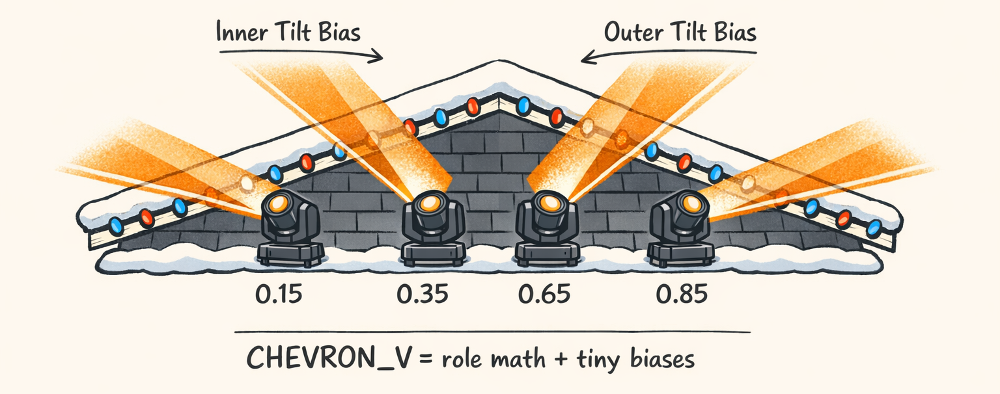

# Point the Beams in a V, They Said. It’ll Be Easy, They Said.



So in Part 1 we stared into `sweep_lr_chevron_breathe.py` long enough that it started staring back.

And we learned the cruel truth: templates are polite little Python objects that *sound* declarative… until you realize they’re basically a compact choreography *program*. Geometry. Movement. Dimmer. Timing. Repeats. Phase offsets. Roles. All jammed into one `return TemplateDoc(...)` like it’s no big deal.

This part is about the least sexy piece that still manages to ruin your whole night:

**Where the fixtures point before they do anything “cool.”**

Before a single curve wiggles, we need a base pose for every fixture: a pan and tilt target that says “this is the formation.” After that, movement handlers get to animate around it.

`CHEVRON_V` sounds like a vibe.

It’s actually role math, pose anchors, and tiny tilt biases that somehow matter a lot.

---

## Geometry Handlers: The Static Truth Under Every Movement

Here’s the thing: geometry handlers don’t know *time* exists.

No bars. No beats. No phase offsets. No waveforms. No “breathe.” Just:

> Given a fixture’s role + some params + calibration… where should it point?

The key idea is that geometry returns a **static base pose** (pan/tilt). Then movement handlers later layer animation on top of that base pose. That separation is the only reason we can compose templates without creating a spaghetti monster that can’t be debugged.

A simplified version of the contract looks like this:

```python
class GeometryResult(BaseModel):
    model_config = ConfigDict(extra="forbid")

    # Normalized values (0..1). We'll talk about the lie later.
    pan_norm: float = Field(ge=0.0, le=1.0)
    tilt_norm: float = Field(ge=0.0, le=1.0)

    # Sometimes we keep extra metadata for debugging.
    debug: dict[str, object] = Field(default_factory=dict)
```

And each handler implements something like:

```python
class SomeGeometryHandler:
    handler_id: str = "some_geometry"

    def resolve(
        self,
        fixture_id: str,
        role: str,
        params: dict[str, object],
        calibration: dict[str, object],
    ) -> GeometryResult:
        ...
```

Remember the template in Part 1?

```python
geometry=Geometry(
    geometry_type=GeometryType.CHEVRON_V,
    params={...},
),
```

That `geometry_type` is basically a pointer to math. It gets resolved via a registry.

So when the compiler hits a `TemplateStep.geometry`, it goes:

1. Find the handler for `CHEVRON_V`.
2. Ask it: for fixture `fx_03` with role `INNER_RIGHT`, what’s your base pose?
3. Store the pose.
4. Let movement/dimmer handlers do their thing later.

That’s the whole deal. Static truth first. Motion second.

And yes, we learned this separation the hard way. Early versions mixed formation *and* movement in one handler. Debugging that was like trying to fix a Roomba while it’s falling down the stairs.


---

## Normalized Coordinates: The 0..1 Lie We Tell So Templates Work Everywhere

Look, we normalize pan/tilt to **[0, 1]** because we like pain.

Kidding. Mostly.

We do it because fixture models are annoying in very practical ways:

- Fixture A has pan range 540°, Fixture B has 360°.
- Some fixtures invert tilt depending on how they’re mounted.
- DMX fine channels exist… except when they don’t.
- Home positions drift because *physics*.

So templates can’t safely talk in “DMX 173” unless we want every template to be “works on my roof.” Instead, templates and geometry handlers mostly speak in normalized space:

- `pan_norm ∈ [0,1]`
- `tilt_norm ∈ [0,1]`

Then calibration and fixture config map that normalized value into the fixture’s actual DMX channels later.

The semantic pose anchors are defined in `PanPose`/`TiltPose` values are *pose identifiers* (via `PoseLibrary`) that correspond to standard poses in `STANDARD_POSES`.

And geometry handlers often start by grabbing defaults from those standard poses:

```python
pan_start_deg = params.get(
    "pan_start_deg",
    STANDARD_POSES[PoseLibrary.WIDE_LEFT].pan_deg,
)
pan_end_deg = params.get(
    "pan_end_deg",
    STANDARD_POSES[PoseLibrary.WIDE_RIGHT].pan_deg,
)
tilt_base_deg = params.get(
    "tilt_base_deg",
    STANDARD_POSES[PoseLibrary.CEILING].tilt_deg,
)
```

### Where degrees/DMX come in (and why it’s not the geometry handler’s job)

The geometry handler should *not* have to know whether your moving head is a 16-bit pan fixture or some budget gremlin that lies about its range.

So we push that ugliness into calibration / fixture config.

A common mapping looks like:

- Convert normalized → degrees (or directly normalized → DMX)
- Clamp to bounds (because templates will absolutely try to push beyond the safe range)
- Quantize to integer DMX

A simplified mapping function looks like this:

```python
def norm_to_dmx(x: float, dmx_min: int, dmx_max: int) -> int:
    """0..1 -> [dmx_min..dmx_max], inclusive."""
    x = max(0.0, min(1.0, x))  # clamp
    return int(round(dmx_min + x * (dmx_max - dmx_min)))
```

If you’re thinking “that rounding seems trivial,” congratulations, you haven’t watched four fixtures micro-jitter because one of them rounds `.5` differently under a different Python build. (We have. It’s… festive.)

We’ll go deep on the “what does a curve value mean?” question in Part 4, and on full DMX rendering semantics in Part 10. For now: normalized is how we keep templates portable, and calibration is where reality punches back.


---

## CHEVRON_V: Role Math That Produces a Formation (Not a Spreadsheet)

So let’s talk about the formation that started this whole rant.

First, a quick correctness nit: in this post we talk about **normalized** outputs (`pan_norm`, `tilt_norm`) *and* we show template params with `_dmx` suffixes.

That’s not wrong as a design (sometimes you really do want “bias in DMX units”), but it’s easy to read this and assume geometry outputs DMX too.

It doesn’t. Geometry outputs *poses*. DMX happens later.

With that said, here’s the snippet as it appears in the template:

```python
geometry=Geometry(
    geometry_type=GeometryType.CHEVRON_V,
    params={
        "pan_start_dmx": PanPose.WIDE_LEFT.value,
        "pan_end_dmx": PanPose.WIDE_RIGHT.value,
        "tilt_base_dmx": TiltPose.CEILING.value,
        "tilt_inner_bias_dmx": 18,
        "tilt_outer_bias_dmx": 0,
    },
),
```

### Roles: the sneaky input you can’t ignore

`CHEVRON_V` is role-driven. It has two ordered lists:

```python
class ChevronVHandler:
    handler_id: str = "chevron_v"

    # Left side roles (ordered outward)
    LEFT_ROLES = ["FAR_LEFT", "OUTER_LEFT", "INNER_LEFT", "CENTER_LEFT"]

    # Right side roles (ordered outward)
    RIGHT_ROLES = ["CENTER_RIGHT", "INNER_RIGHT", "OUTER_RIGHT", "FAR_RIGHT"]
```

If your template roles are the common four-pack:

```python
TemplateRoleHelper.IN_OUT_LEFT_RIGHT = [
    TemplateRole.OUTER_LEFT,
    TemplateRole.INNER_LEFT,
    TemplateRole.INNER_RIGHT,
    TemplateRole.OUTER_RIGHT,
]
```

…then each role lands somewhere in either `LEFT_ROLES` or `RIGHT_ROLES`, and that position determines:

- where it sits across the pan range (the “V”)
- whether it counts as “inner” or “outer” for tilt bias

### The interpolation idea (a.k.a. “no, we’re not hardcoding a spreadsheet”)

We could’ve shipped chevron by just writing a dict like:

```python
{
    "OUTER_LEFT": 0.0,
    "INNER_LEFT": 0.33,
    "INNER_RIGHT": 0.66,
    "OUTER_RIGHT": 1.0,
}
```

That’s easy for 4 fixtures and immediately dumb for 6 or 8.

Instead, the handler treats each half as a mini-line segment and interpolates based on role index.

A cleaned-up version of how this usually looks:

```python
# (cleaned up for readability, but matches the intent)
def _lerp(a: float, b: float, t: float) -> float:
    return a + (b - a) * t


def _index_t(role: str, roles: list[str]) -> float:
    """Map a role within an ordered list to a 0..1 position."""
    if role not in roles:
        raise ValueError(f"Role {role} not in role list: {roles}")
    if len(roles) == 1:
        return 0.0
    i = roles.index(role)
    return i / (len(roles) - 1)
```

### Pan distribution: left and right halves

The chevron “V” is basically two lines that meet at the center:

- Left half pans from **center** toward **pan_start** (wide left)
- Right half pans from **center** toward **pan_end** (wide right)

So each side interpolates away from center.

A plausible implementation structure:

```python
def resolve(...):
    pan_start_deg = ...
    pan_end_deg = ...

    pan_center_deg = (pan_start_deg + pan_end_deg) / 2.0

    if role in self.LEFT_ROLES:
        t = _index_t(role, self.LEFT_ROLES)       # 0..1
        pan_deg = _lerp(pan_center_deg, pan_start_deg, t)
    elif role in self.RIGHT_ROLES:
        t = _index_t(role, self.RIGHT_ROLES)      # 0..1
        pan_deg = _lerp(pan_center_deg, pan_end_deg, t)
    else:
        pan_deg = pan_center_deg

    ...
```

That gives you a V even though the fixtures are physically in a line.

And yep: the first time we tried this, we accidentally interpolated from `pan_start → pan_end` for *both* halves. The “chevron” looked like… a fan.

A perfectly fine fan.

Just not what we asked for.

### Tilt bias: “18 DMX units” is a big deal, actually

Now the fun part: tilt bias.

From the template:

- `tilt_base_dmx = TiltPose.CEILING`
- `tilt_inner_bias_dmx = 18`
- `tilt_outer_bias_dmx = 0`

This is the part where you think: “18 out of 255? That’s nothing.”

And then you run it on real fixtures and realize 18 DMX units can be the difference between:

- “nice V with depth”
- “flat fan that looks like Windows Media Player 2003 edition”

The handler treats inner fixtures differently than outers. For the common 4-role layout:

- Inner fixtures: `INNER_LEFT`, `INNER_RIGHT`
- Outer fixtures: `OUTER_LEFT`, `OUTER_RIGHT`

So you end up with inner beams tilted slightly “lower” (toward horizon / crowd) than outer beams. That creates a depth illusion: the V has a point.

**But:** the sign of “lower” depends on your fixture’s tilt direction and any inversion in calibration. The safest way to say it is:

> Inner fixtures get a different tilt offset than outer fixtures, and calibration decides whether that’s visually “up” or “down.”

In `chevron.py` we can see the params are explicitly DMX for bias. That design choice is very “we have scars.” We tried bias-in-degrees. It made semantic sense. It also made templates less portable because degree→DMX resolution varies a lot by fixture, and a “5° inner dip” didn’t land the same visually across different gear.

So we bias in DMX intentionally. It’s a little gross.

But it’s consistent in the final output domain.

### Concrete walkthrough: 4 roles, approximate values

Let’s do the common 4 fixtures:

- `OUTER_LEFT`
- `INNER_LEFT`
- `INNER_RIGHT`
- `OUTER_RIGHT`

Assume:

- `pan_start = WIDE_LEFT`
- `pan_end = WIDE_RIGHT`
- Center pan = midpoint

In normalized pan terms (hand-wavy but useful), you get something like:

- `OUTER_LEFT`: pan ~ 0.10
- `INNER_LEFT`: pan ~ 0.35
- `INNER_RIGHT`: pan ~ 0.65
- `OUTER_RIGHT`: pan ~ 0.90

(Not symmetric around 0.5 if your “wide” poses aren’t symmetric — which is a real thing depending on mounting.)

Tilt:

- Base tilt = `CEILING` (pretty high / up)
- Inner fixtures: apply `tilt_inner_bias_dmx`
- Outer fixtures: apply `tilt_outer_bias_dmx`

And this is where we tripped: **tilt direction is fixture-dependent**. Some fixtures treat higher DMX as “more up,” some as “more down,” and some treat “inversion” like a lifestyle choice.

Which is why geometry handlers shouldn’t “just add degrees to tilt.” They need calibration/fixture config to apply it correctly.

We’ll unpack that mess properly in Part 10 when we talk about fixtures having six channels and our innocent three-channel mental model collapsing like a wet cardboard roof prop.


---

## Front View: Where the Tilt Bias Actually Shows Up

Overhead views are comforting. Everything is a neat V. Your brain says “yes, geometry, I get it.”

Then you look from the front.

And without tilt bias, chevron often reads like a **fan**: four beams at different pan angles, but all living on the same vertical plane. It’s wide, sure. But it’s *flat*.

The tilt bias is what makes the center feel like it’s coming “toward” you.

In `sweep_lr_chevron_breathe`, we intentionally bias inner fixtures:

- `tilt_inner_bias_dmx = 18`
- `tilt_outer_bias_dmx = 0`

And here’s the part that surprised us the first time we got it right:

**Small DMX deltas produce big perceived geometry.**

Like, “18 DMX units” sounds like nothing until you stand across the street and see the inner beams visibly hit a different part of the sky than the outers.

We originally set that bias to 5. Couldn’t see it.

Bumped it to 12. Kinda.

At 18 it suddenly snapped into “oh, that’s a shape.”

Of course, we also tried 40.

That looked like the inner fixtures were ashamed and staring at the ground.

So yeah. 18.


---

## CHEVRON_V vs FAN: Same Fixtures, Different Vibes

So what’s the difference between `CHEVRON_V` and `FAN`?

They both spread pan. They both usually share a base tilt. They both work with the same four roles.

They’re cousins.

But they read very differently.

### FAN: the baseline “spread it out” geometry

A fan is typically:

- linearly spread pan across fixtures left → right
- uniform tilt (no depth trick)

It’s great when you want width without implying a “point” or structure.

It’s also what you accidentally build when your chevron math is wrong (ask me how I know).

### CHEVRON_V: structured, intentional, a little more “designed”

Chevron uses the same fixtures but changes the read:

- It emphasizes a center seam (left half + right half)
- It often uses tilt bias to create depth
- It tends to feel more “formation” than “spread”

This is exactly why `sweep_lr_chevron_breathe` chooses chevron. That template is already doing a left-to-right sweep with phase offsets (Part 7 is gonna be *fun*).

If the base geometry is flat, the whole thing looks like four independent lights doing their taxes.

With chevron + tilt bias, the sweep feels like it’s sweeping across a *shape*.

Which is the whole point.


---

## Geometry Type Cheat Sheet (So You Can Read Future Templates)

So when you see `geometry_type=...` in templates, don’t overthink it.

It’s always the same idea:

> Geometry picks the base pose. Movement and dimmer paint over it.

Here’s a cheat sheet of the geometry types you’ll keep running into as you read future templates.

And yes, we keep it brief on purpose. This isn’t a catalog — it’s just enough to stop you from going “wait, what does that one do again?”

![Table listing geometry types and one-line descriptions with tiny sketch icons per row. Headers: “GeometryType”, “What it does (in human words)”, “When it’s handy”. Rows: “CHEVRON_V | V-shape from center out; often uses inner/outer tilt bias | Sweeps that need depth and structure”, “FAN | Linear left→right pan spread; usually uniform tilt | Wide ‘wash the sky’ moments”, “ROLE_POSE | Direct mapping from role→pose anchors (e.g., OUTER_LEFT=wide_left) | Precise, predictable formations”, “AIM_ZONE | Points fixtures toward a named zone (SKY/HORIZON/CROWD/STAGE) | Quick ‘everyone look there’ moments”, “NONE/NEUTRAL | Leaves fixtures at home/soft pose | When movement handles everything or you need calm”](assets/illustrations/02_geometry_types_table.png)

---

### One more thing before we move on

The geometry handler layer is where we decided to be boring on purpose.

No time dimension. No curves. No “musical.” Just “what pose do you want?”

And honestly? That boring decision is why the rest of the system can be un-boring without collapsing.

In Part 3 we’re going to un-bore it immediately by talking about waveforms — because once we have a base pose, we need something to wiggle around it that isn’t just `sin()` but festive.

Which, spoiler, is what our first attempt was.

It was… aggressively un-festive.

---

## About twinklr


twinklr is our ongoing science experiment in weaponizing holiday cheer. It's an AI-driven choreography and composition engine that takes an audio file and spits out fully synchronized sequences for Christmas light displays in xLights — because apparently we looked at a normal, peaceful hobby and thought, "What if we added AI, machine learning and sleepless nights?"

Here's the honest disclaimer: we're not professional lighting designers. We're developers, engineers, and AI researchers who spend our days building at the frontier of AI… and our nights obsessing over why a dimmer curve feels "late" by half a beat and whether a roofline sweep should be dramatic or merely aggressively festive. If you're expecting polished stage-production wisdom, you're in the wrong place. If you're into nerdy overengineering, mildly unhinged experimentation, and the occasional "how did that even work?" moment — welcome.

This blog is the running log of our journey.