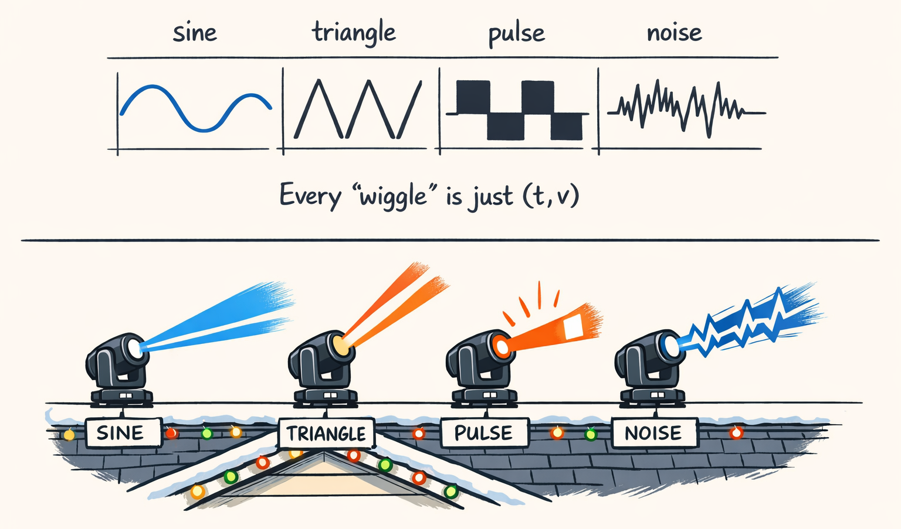
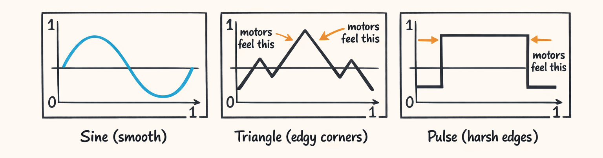
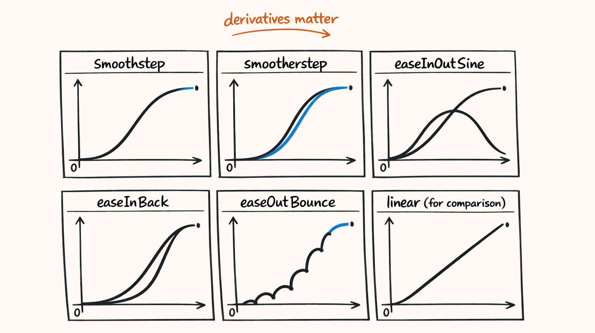
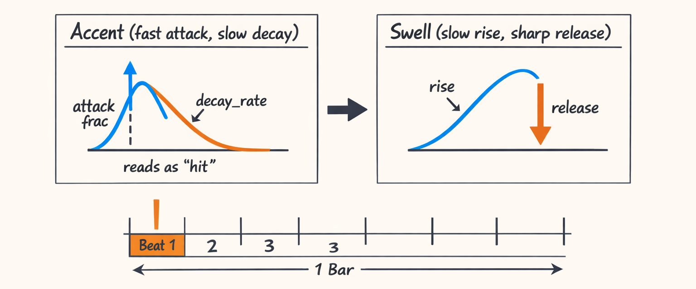
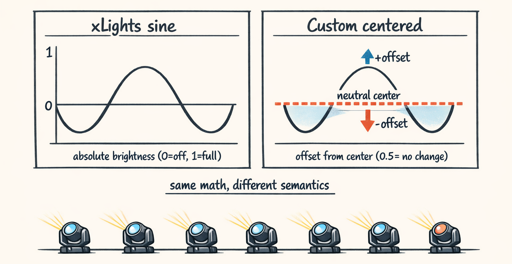

# Waveforms: Because ‘Wiggle It’ Isn’t a Compiler Option



So in Part 2 we got the fixtures pointed into a nice little `CHEVRON_V`. Everybody’s aimed. Nobody’s shining into the neighbor’s bedroom window. Huge win.

Then we did the next “obvious” step: make them move.

And that’s where we learned an uncomfortable truth:

> “Make it sweep” is not an instruction a motor understands.
> It’s a curve. Always a curve. Even when we pretend it’s not.

Every pan sweep, every dimmer breathe, every “hit the downbeat” accent… is just a function that turns time into a value. The only difference between a classy show and four possessed desk fans is the *shape* of that function… and whether the endpoints behave like adults.

This post is the waveforms Twinklr actually uses—sine, triangle, pulse, easing, musical accents, parametric weirdness, and deterministic noise—plus a few horror stories from v0 where we shipped curves that technically “worked” in the same way a shopping cart with one square wheel technically “rolls.”

---

## CurvePoint: The Smallest Unit of Motion We Trust

At the bottom of all this is a tiny model we like because it’s boring.

And boring is exactly what you want when you’re about to fling real motors around on a roof.

The concept is dead simple: a curve is a list of points. Each point is normalized time and normalized value:

- `t ∈ [0, 1]`
- `v ∈ [0, 1]`

If you remember Part 2, we did the same kind of normalization with poses: “WIDE_LEFT” means something fixture-independent, and later we convert it into fixture-specific DMX. Same philosophy, different axis.

The normalization is the whole trick.

- Curves don’t care if you’re rendering to xLights, a simulator, or directly to DMX.
- Curves don’t care if your fixture’s pan range is 540° or 360°.
- Curves don’t care if this step lasts 500ms or 4 bars at 128 BPM.

Curves just say: *at normalized time `t`, output normalized value `v`*.

### PointsCurve vs “just use a generator function”

We *do* have function-based curve generators (we’ll hit those in a second), but we almost always end up sampling into `PointsCurve` because:

1. It’s serializable and inspectable (debugging is a lot easier when you can literally print the points).
2. It’s deterministic (same inputs, same points).
3. It plays nicely with compilers that want fixed-size arrays.

Typical sampling counts in practice:

- **Motion**: 64–256 samples per segment (motors hate sharp corners)
- **Dimmer**: 32–128 (LEDs are more forgiving)
- **Very short hits**: sometimes 16 if we’re tight on compute, but you can *feel* it

And yes, our first version tried to be “smart” and auto-picked sample counts based on duration. It was… fine… until it wasn’t.

The moment we started caring about *derivatives* (velocity/acceleration), the “auto samples by duration” heuristic quietly betrayed us.

![Diagram of a tiny normalized plot t∈[0,1], v∈[0,1] with a sine wave and a highlighted point marker](assets/illustrations/03_curvepoint_index_card.png)

---

## The Usual Suspects: Sine, Triangle, Pulse (And Their Personality Problems)

Look, we all start with sine waves because sine waves *feel* like motion. They’re smooth, periodic, and they don’t have surprise corners.

Then you try to make a “sharp hit” using sine and realize sine is the golden retriever of waveforms. Friendly. Smooth. Not great at being angry.

### Sine: smooth, loopable, and occasionally too polite

The normalized sine we use is basically:

\[
v(t) = \text{offset} + \text{amplitude} \cdot \sin(2\pi \cdot \text{cycles} \cdot t + \text{phase})
\]

…but because we usually want `[0,1]`, we often set:

- `offset = 0.5`
- `amplitude = 0.5`

So it swings cleanly between 0 and 1.

Here’s a simplified version of what’s in `basic.py`:

```python
def sine_curve(*, samples: int, cycles: float = 1.0, phase: float = 0.0) -> PointsCurve:
    """Normalized sine wave.

    Returns v in [0,1] when offset=0.5 and amplitude=0.5.

    Note: This samples inclusive endpoints, so t=0 and t=1 are both present.
    """

    if samples < 2:
        raise ValueError("samples must be >= 2")

    pts: list[CurvePoint] = []
    for i in range(samples):
        t = i / (samples - 1)
        v = 0.5 + 0.5 * math.sin(2 * math.pi * cycles * t + phase)
        pts.append(CurvePoint(t=t, v=v))

    return PointsCurve(points=pts)
```

Where it shows up in our running example:

- `sweep_lr_chevron_breathe` uses a movement pattern that’s basically a left-right sweep. Sine is the default for that because it doesn’t slam the motor at the ends.

And here’s the first failure mode:

> We accidentally used a sine that didn’t guarantee `v(0) == v(1)` on looped segments.

If your phase isn’t aligned, you get a tiny discontinuity at the loop boundary. For dimmer, that’s a small blink. For motion, it’s a microscopic jerk that turns into a *very visible* “tick” because the motor controller is basically a snitch.

The result looked like the fixtures were doing a polite sweep and then flinching once per cycle like they heard a noise in the attic.

One important nuance: if `cycles` is an integer, then the *mathematical* sine is loop-safe at `t=0` and `t=1` for any phase.

So if you’re thinking “wait, your formula should match endpoints”… yeah. That’s the embarrassing part.

Our actual bug in v0 was a combo platter of:

- non-integer cycle counts in a place we *assumed* were integers
- a “sample the curve but don’t include the endpoint” optimization (so the last point wasn’t at `t=1.0`)
- and then a loop stitcher that pretended the missing endpoint didn’t matter

Small mistake. Huge visible tick.

### Triangle: edgy, readable, and rude to motors

Triangle waves are great when you want motion to *read* as mechanical. They have a constant slope, so the fixture looks like it’s “moving with purpose” instead of floating.

They’re also brutal at the turning points: the derivative jumps instantly at the peak/trough. Motors feel that as “slam into a direction change.”

Still, we use them sometimes—especially for:

- chases that need to look tight
- stylized “robotic” motion
- certain dimmer effects where sharpness is the point

A typical normalized triangle implementation looks like:

```python
def triangle_curve(*, samples: int, cycles: float = 1.0) -> PointsCurve:
    if samples < 2:
        raise ValueError("samples must be >= 2")

    pts: list[CurvePoint] = []
    for i in range(samples):
        t = i / (samples - 1)

        # scale into cycles, keep fractional part
        x = (t * cycles) % 1.0

        # triangle in [0,1]
        v = 1.0 - abs(2.0 * x - 1.0)
        pts.append(CurvePoint(t=t, v=v))

    return PointsCurve(points=pts)
```

The triangle wave has a personality problem: it’s always a little bit angry.

Which is fine for dimmer strobes. Less fine for a moving head mounted to your roof fascia.

### Pulse (square-ish): perfect for “hit”, terrible for “anything else”

Pulse waves are for “on/off with opinions.”

We use pulse-y curves for:

- beat hits
- subdivisions
- fake “strobe” patterns (but we try not to actually strobe because residential shows and photosensitive folks… yeah)

A basic pulse curve:

```python
def pulse_curve(*, samples: int, duty: float = 0.5) -> PointsCurve:
    """Single-cycle pulse.

    duty: fraction of the cycle that's 'high'
    """

    if samples < 2:
        raise ValueError("samples must be >= 2")

    # basic validation so we don't silently create a "always off" or "always on" bug
    duty = max(0.0, min(1.0, duty))

    pts: list[CurvePoint] = []
    for i in range(samples):
        t = i / (samples - 1)
        v = 1.0 if t < duty else 0.0
        pts.append(CurvePoint(t=t, v=v))

    return PointsCurve(points=pts)
```

Pulse is amazing for dimmer accents, but it has two issues:

1. It’s discontinuous (instant jumps).
2. If you don’t align duty cycles with beat subdivisions, it looks like the lights are arguing with the music.

And this tees up something we’ll get real serious about in Part 4:

> The same curve can mean totally different things depending on *semantics*.
> A sine for dimmer is “breathe.” A sine for pan might be “sweep.”
> A value of `0.5` might mean “center position” *or* “half brightness.”

We’ll make that explicit next time. For now, enjoy the waveforms in their natural habitat.



---

## Easing: The Difference Between ‘Smooth’ and ‘Looks Like a Bug’

So here’s the thing: “smooth” is not a vibe.

It’s calculus wearing a holiday sweater.

Moving heads (the residential kind we bolt to stands and rooflines, not the concert ones dangling from trusses like fancy bats) don’t just need position values. They need **velocity** and **acceleration** to behave.

If you feed a motor a curve with a hard corner, the motor tries to follow it anyway. Which means:

- velocity changes instantly
- acceleration spikes
- your fixture looks like it hit a pothole

That’s why easing exists.

### Smoothstep / Smootherstep (a.k.a. “cheap insurance”)

Smoothstep is the classic “start slow, end slow” curve:

- `smoothstep(t) = 3t² - 2t³`

Smootherstep goes further and smooths derivatives more aggressively:

- `smootherstep(t) = 6t⁵ - 15t⁴ + 10t³`

The derivative continuity matters. For motion, smootherstep makes endpoints feel *finished* instead of “oops we stopped.”

### Penner easings (because humans like drama)

We also use a handful of Robert Penner-style easings. Not all the time—this isn’t a Pixar lamp—but for transitions and envelopes they’re gold.

Common ones in our stuff:

- `easeInOutSine`: great default for anything you want to feel organic
- `easeInBack`: adds a little “pull back then go” (use sparingly or it looks like your fixture forgot where it parked)
- `easeOutBounce`: comedic, and occasionally exactly what you want for festive stuff

Where we actually use these:

- transitions between segments (Part 8 is basically “easing: the revenge arc”)
- dimmer envelopes (Part 6)
- “accent” shaping when we want a hit to feel snappy without being a pulse cliff

The main lesson we learned the hard way:

> If your easing has a kink at the endpoint, your motor will tattletale.
> It’ll show you. In public. In front of your neighbors.



---

## Musical Curves: Teaching Math to Hit the Downbeat

Okay. Basic waves are great when you want “repeatable motion.”

But music isn’t just repetition. It’s emphasis.

A downbeat “hit” is not a sine wave. It’s an attack and a decay. It’s basically a tiny envelope generator pretending it’s a lighting designer.

### Accent curve: fast attack, slow decay (a.k.a. “the hit”)

An accent curve is the classic “jump up quick, then fall off slower.”

Why it reads as a hit:

- the attack aligns with transient energy (kick/snare)
- the decay gives your eyes time to register the peak without it feeling like a glitch

A simplified version of our accent shape:

```python
def accent_curve(
    *,
    samples: int,
    attack_frac: float = 0.12,  # portion of [0,1] spent on attack
    decay_rate: float = 6.0,  # larger = faster decay
) -> PointsCurve:
    if samples < 2:
        raise ValueError("samples must be >= 2")

    # keep parameters sane; we'll still clamp per-point because 2am happens
    attack_frac = max(0.0, min(1.0, attack_frac))

    pts: list[CurvePoint] = []
    for i in range(samples):
        t = i / (samples - 1)

        if t <= attack_frac and attack_frac > 0.0:
            # attack: linear ramp 0->1
            v = t / attack_frac
        else:
            # decay: exponential-ish falloff 1->0
            x = (t - attack_frac) / max(1.0 - attack_frac, 1e-9)
            v = math.exp(-decay_rate * x)

        # clamp just to be safe
        v = max(0.0, min(1.0, v))
        pts.append(CurvePoint(t=t, v=v))

    return PointsCurve(points=pts)
```

And yes, we learned to clamp because one time we didn’t, and a rounding error turned into a negative dimmer value somewhere downstream, and then *that* turned into “why did fixture 3 go dark exactly on every other bar.”

Good times.

### Swell curve: slow rise, sharp release (a.k.a. “tension”)

Swell is the opposite emotional shape:

- build slowly (anticipation)
- release quickly (drop)

This is the curve you want when the music is doing that “hold… hold… okay GO” thing.

A simple swell curve might be:

```python
def swell_curve(*, samples: int, rise_frac: float = 0.85) -> PointsCurve:
    if samples < 2:
        raise ValueError("samples must be >= 2")

    rise_frac = max(0.0, min(1.0, rise_frac))

    pts: list[CurvePoint] = []
    for i in range(samples):
        t = i / (samples - 1)

        if t <= rise_frac and rise_frac > 0.0:
            # slow rise: quadratic-ish
            x = t / rise_frac
            v = x * x
        else:
            # sharp release: drop quickly
            x = (t - rise_frac) / max(1.0 - rise_frac, 1e-9)
            v = 1.0 - (x * 5.0)  # aggressive linear drop

        v = max(0.0, min(1.0, v))
        pts.append(CurvePoint(t=t, v=v))

    return PointsCurve(points=pts)
```

### Beat pulses for subdivisions (because humans can count to 4)

We also generate beat-synced pulse trains for subdivisions (quarter/eighth/sixteenth feels), which matter a lot once timing/phase offsets enter the chat (Part 7).

This is where Part 1 comes back: remember the beat grid and quantize modes? Those categorical choices (“downbeat”, “sixteenth”) become curve parameters here.

And this is also where we learned the difference between “mathematically correct” and “feels right.” A perfectly even sixteenth pulse can still look late if your fixture smoothing introduces latency. So we sometimes bias attack earlier.

Not because math.

Because eyeballs.



---

## Parametric Weirdness: Beziers and Lissajous (AKA ‘Accidentally Pretty’)

Sometimes you don’t want a strict periodic wave. You want something that feels organic but *not random*—because randomness is fun until you try to debug it.

### Cubic Beziers: the authoring tool that never judges you

Cubic Beziers are basically “draw a curve by moving two handles,” which makes them fantastic for:

- designing transitions
- shaping envelopes
- giving non-math people a way to create motion without learning trig

Even if you never expose the control points to users, Beziers are a nice internal representation for “this should ease in, overshoot slightly, then settle.”

### Lissajous: harmonic motion that looks smarter than it is

Lissajous curves are what you get when you combine two sines at different frequencies:

\[
x(t) = \sin(a t + \delta), \quad y(t) = \sin(b t)
\]

If you sample one axis (or map `x→pan`, `y→tilt`), you get motion that feels:

- smooth
- looping
- “designed”

Without any randomness.

And small parameter changes matter a lot:

- change `b` from 2 to 3 and suddenly it feels like a different song
- change phase offset `δ` and the whole thing “leans” differently

We don’t use Lissajous everywhere (it’s easy to overdo and end up with “screensaver at Best Buy”), but for certain movement patterns it’s that sweet spot: complex-looking, deterministic, loop-friendly.

Forward reference: in Part 5 (Movement), we’ll swap these in as sources for motion patterns to keep sweeps from feeling like metronomes.


---

## Noise: Deterministic Chaos for When Sine Is Too Polite

Noise is what you reach for when everything looks too clean.

But also: noise is what you reach for when you’re about to ruin your day.

Because if you use non-deterministic noise, you can’t reproduce bugs. And if you can’t reproduce bugs, you will end up standing in your driveway at 11:47pm whispering “why are you like this” at a fixture.

We use **deterministic** noise (seeded) so that:

- the show is repeatable
- the compiler output is stable
- debugging doesn’t become a paranormal investigation

Parameters that matter:

- **scale**: how “stretched” the noise is over time
- **octaves**: layers of noise; more octaves = more detail/roughness

Use cases:

- subtle drift so fixtures feel alive during long holds
- random-walk-ish movement overlays (but small)
- dimmer shimmer (careful: shimmer can look like electrical problems if you overdo it)

And here’s the key setup for Part 4:

> Raw noise is almost never in a usable range.
> You have to center it, normalize it, and decide what `0.5` means.

We’ll get into semantics next time, but preview: “noise in `[0,1]`” isn’t enough. Motion often wants noise centered around neutral so the fixture doesn’t slowly wander into the neighbor’s tree like it’s exploring.


---

## Why Not Just Use xLights’ Built-In Curves?

This comes up a lot, especially from folks who already author shows in xLights and are like:

“Okay cool story, but xLights already has curves. Why are you writing your own math instead of touching grass?”

Fair question.

We do output to xLights sequencing formats later (Part 9), but we can’t just reuse its curve vocabulary directly because Twinklr needs a couple things that are… annoyingly specific.

### 1) Offset-centered movement is a first-class requirement

xLights curves often assume “value means absolute output.”

But for movement we often want curves that mean:

- `0.5` = neutral (don’t move)
- above/below `0.5` = offset in either direction

That makes it easy to layer movement patterns and keep fixtures centered in a formation.

So even if the *shape* is a sine wave, the *meaning* is different. (Part 4 is literally about this.)

### 2) Loop readiness: endpoints matter more than you think

We repeat a lot. Like… a lot.

In `sweep_lr_chevron_breathe`, the template repeat contract is explicitly loopable:

- `RepeatMode.PING_PONG`
- `cycle_bars=4.0`
- phase offsets wrap

Loopable curves need:

- matching endpoints (or intentional ping-pong symmetry)
- stable derivatives at boundaries if the motion continues smoothly

A curve that “looks fine” in a one-shot preview can tick like a metronome once you loop it 40 times across a song.

### 3) Musical vocabulary mismatch

Twinklr wants curves like:

- accent (fast attack, slow decay)
- swell (slow rise, sharp release)
- beat pulse by subdivision

xLights can do similar things, but not in the same parameterized, programmatic way we need for template compilation. Our pipeline maps higher-level intent (like `Intensity`) into curve parameters. That bridging layer is a whole thing.

Preview for Part 5/6: we’re going to do stuff like “`Intensity.HIGH` means more cycles, sharper accents, wider pan offsets.” That translation needs the curve system to be ours.



---

## Up Next: When 0.5 Means Two Different Things

Right now we’ve been pretending curves are just math.

They’re not.

They’re math *with semantics*, and semantics is where we stop arguing about trig and start arguing about meaning:

- For **movement**, `0.5` often means “stay centered.”
- For **dimmer**, `0.5` means “half bright.”
- For **color** (later), `0.5` might mean “halfway between red and green,” which is… not always what you think it is.

That’s Part 4:

**“Curve Semantics: The Part Where 0.5 Means ‘Don’t Move’ (And 0.5 Also Means ‘Half Bright’)”**

And yes, it contains the moment we realized we’d been normalizing correctly and *interpreting* incorrectly, which is the most annoying kind of correct.

---

## About twinklr


twinklr is our ongoing science experiment in weaponizing holiday cheer. It's an AI-driven choreography and composition engine that takes an audio file and spits out fully synchronized sequences for Christmas light displays in xLights — because apparently we looked at a normal, peaceful hobby and thought, "What if we added AI, machine learning and sleepless nights?"

Here's the honest disclaimer: we're not professional lighting designers. We're developers, engineers, and AI researchers who spend our days building at the frontier of AI… and our nights obsessing over why a dimmer curve feels "late" by half a beat and whether a roofline sweep should be dramatic or merely aggressively festive. If you're expecting polished stage-production wisdom, you're in the wrong place. If you're into nerdy overengineering, mildly unhinged experimentation, and the occasional "how did that even work?" moment — welcome.

This blog is the running log of our journey.

---