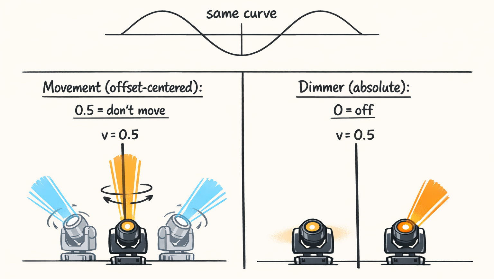
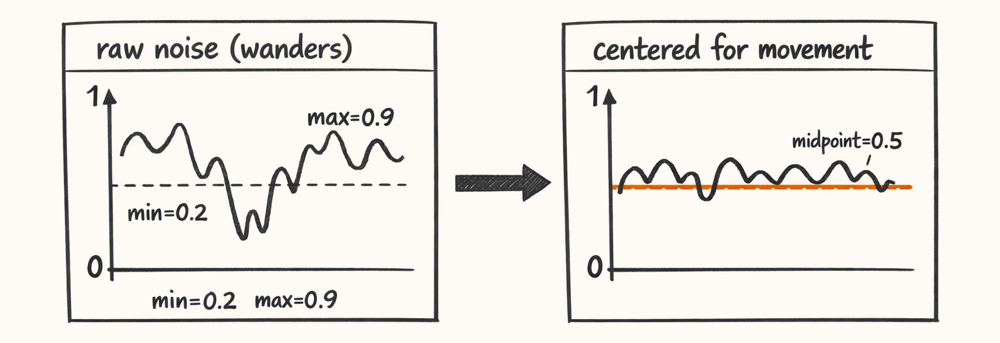
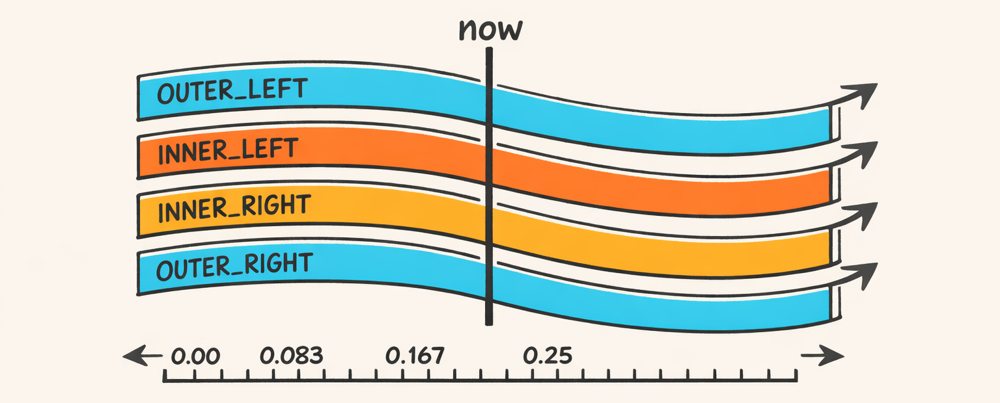
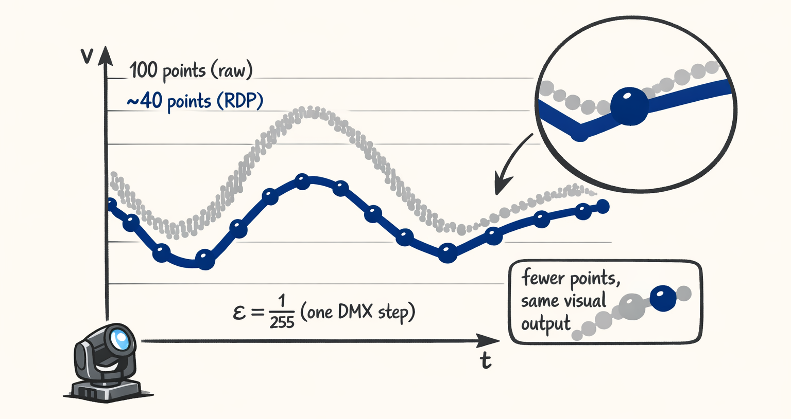
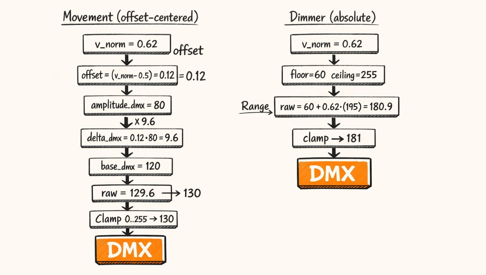

# Curve Semantics: The Part Where 0.5 Means ‘Don’t Move’ (And 0.5 Also Means ‘Half Bright’)



So here’s the thing nobody tells you when you start generating “curves” for lighting:

A curve is just numbers.

It doesn’t *mean* anything.

In Part 3 we built a bunch of waveforms—sines, triangles, noise, easing—and we felt pretty good about it… right up until we piped the *exact same sine wave* into pan and dimmer and got a show that looked like:

- the moving heads were trying to escape the roof, and
- the dimmers were… honestly fine?

Which is how we learned the fun rule of curve semantics:

> A sine wave is innocent until you interpret it.

This is the part where we stop pretending “normalized curve values” are universal truth and admit we’ve actually got **two different kinds of curves**:

- **Movement curves** are *offset-centered* (0.5 means “neutral—don’t move from the base pose”)
- **Dimmer curves** are *absolute* (0.0 means off, 1.0 means full send)

And yes, that means **0.5 means “don’t move” and also “half bright.”**
Welcome to lighting.

---

## Two Kinds of Curves (And One of Them Lies About What ‘Zero’ Is)

Remember Part 3’s promise: *curves are dumb; semantics make them useful.*

This is where we pay that off.

A curve in Twinklr is basically a list of `(t, v)` points, where:

- `t` is normalized time in `[0.0 .. 1.0]`
- `v` is normalized value in `[0.0 .. 1.0]`

The lie is thinking `v=0.0` always means “nothing.”

### Movement curves: “0.5 is neutral”

For pan/tilt movement, we almost never want `0.0` to mean “go to the physical minimum of the fixture.”

Because the fixture already has a *base pose* coming from geometry.

In our running template (`sweep_lr_chevron_breathe`) the geometry handler (CHEVRON_V) is already putting each fixture somewhere meaningful: outer fixtures wider, inner fixtures less wide, tilt biases, etc. (Part 2 was basically us sweating over those numbers.)

Movement, then, should behave like an *offset* around that base pose:

- `v = 0.5` → zero offset (stay on base pose)
- `v > 0.5` → offset positive (e.g. pan right / tilt up depending on channel)
- `v < 0.5` → offset negative

This composes beautifully with geometry. It also prevents a single bad curve from slamming a fixture to DMX 0 like a Roomba finding a staircase.

### Dimmer curves: “0.0 is off”

Dimmer is not an offset. It’s an absolute intensity.

- `v = 0.0` → off
- `v = 1.0` → full brightness (or your configured “ceiling”)
- `v = 0.5` → half brightness (or halfway between floor and ceiling)

If you treat dimmer like offset-centered you get… a whole lot of dim “neutral” light when you expected darkness.

Ask me how I know.

### Concrete “same sine, totally different show”

Take a simple sine that ranges `[0..1]`:

- at `t=0.0`, `v=0.5`
- at `t=0.25`, `v≈1.0`
- at `t=0.5`, `v=0.5`
- at `t=0.75`, `v≈0.0`

If that curve drives **dimmer**, you get a nice pulse: bright → dim → bright → dim.

If that same curve drives **pan offset**, you get: right → center → left → center. Also nice.

But if you accidentally interpret a movement curve as **absolute pan**, `v=0.0` becomes “pan DMX 0” which is usually *hard stop* territory, and your fixture will try to stare directly into the void (or your neighbor’s bedroom window).

We codified these semantics explicitly in simplified version in practice:

```python
class CurveSemantic(str, Enum):
    # Offset-centered: 0.5 means "no change"
    MOVEMENT_OFFSET = "movement_offset"
    # Absolute: 0.0 means "off", 1.0 means "max"
    DIMMER_ABSOLUTE = "dimmer_absolute"

@dataclass(frozen=True)
class SemanticCurve:
    curve: PointsCurve
    semantic: CurveSemantic
```

So yeah. In Twinklr, we don’t just ship curves around.

We ship curves with a label that says what the heck they mean.

And that label is the difference between “tasteful chevron sweep” and “possessed desk fan aimed at traffic.”


---

## Centering: Taking Curves That Wander and Making Them Behave

So movement curves want `0.5` to be neutral. Cool.

Except… not every curve generator naturally behaves.

Sine and triangle are polite. They show up centered and ready to work.

Noise curves? Parametric weirdness? LLM-generated “vibes”? Those things wander around like a drunk squirrel.

If we feed a wandering curve into movement offset math, the fixture will slowly drift away from the base pose and never come back.

Which is great if you’re animating a horror movie flashlight and less great if you’re trying to do synchronized Christmas lights.

### The idea: “center this thing around 0.5”

We added a centering modifier that takes an arbitrary curve and recenters it so its midpoint becomes 0.5.

In our codebase, this lives in the modifiers/composition area.

The behavior is stable even if the plumbing keeps getting refactored: compute a center (we usually use midrange), shift values so that center becomes `0.5`, and clamp to `[0, 1]`.

A cleaned-up version looks like this:

```python
def center_curve_midrange(curve: PointsCurve) -> PointsCurve:
    """Shift values so the curve's midrange maps to 0.5.

    For movement offsets, we want neutral == 0.5.
    """
    vs = [p.v for p in curve.points]
    if not vs:
        return curve

    v_min = min(vs)
    v_max = max(vs)
    mid = (v_min + v_max) / 2.0

    # shift so that mid -> 0.5
    shift = 0.5 - mid

    new_points = []
    for p in curve.points:
        v = p.v + shift
        v = 0.0 if v < 0.0 else 1.0 if v > 1.0 else v
        new_points.append(CurvePoint(t=p.t, v=v))

    return PointsCurve(points=new_points)
```

Is midrange always the best “center”? Not always.

But it’s robust for bounded curves, and—importantly—it’s predictable. Predictable beats clever when your output is a motor mounted on someone’s roof.

Also: this is one of those spots where we learned the hard way that *movement handlers expect centered offsets*. If you don’t center here, you end up compensating later with geometry or amplitude hacks.

And that’s how projects become haunted.



---

## Loop-Ready Curves: Avoiding the ‘Snap’ at t=1.0

Look, you can generate the prettiest curve in the world, and if it doesn’t loop cleanly, it’ll still look like garbage on repeat.

This showed up the moment we started honoring `RepeatContract` (Part 1). Later it got worse when we began scheduling real segments across longer songs (Part 7 is where we really go to town on this).

### The failure mode: the “repeat boundary snap”

Most curves don’t naturally have `v(t=0) == v(t=1)`.

So if you repeat them, the fixture jumps at the boundary.

And the jump is *always* visible on movement because motors are honest. LEDs can sometimes hide it. Pan/tilt cannot. Pan/tilt will rat you out to the entire neighborhood.

### The fix: “ensure loop-ready”

We added a small but mighty rule:

- if a curve is going to be looped, make the last point equal the first (or add a boundary point)

There are different strategies:

- **append** a point at `t=1.0` with `v=v0`
- **adjust_last**: modify the last point’s value to match the first

We mostly use the least surprising approach: preserve the shape, just ensure continuity at the boundary.

No code block here (because it’s boring glue code), but the visual is the important part.


---

## Phase Shifting: The Cheap Trick That Makes Everything Look Expensive

If you want four fixtures to stop acting like one big nervous fixture, you phase shift them.

This is the part where your show goes from “a single waveform controlling everything” to “oh dang, it’s doing a chase.”

And it’s mostly just… time offsets and wraparound.

### Where phase comes from in templates

Our running template step includes:

```python
phase_offset=PhaseOffset(
    mode=PhaseOffsetMode.GROUP_ORDER,
    order=ChaseOrder.LEFT_TO_RIGHT,
    spread_bars=1.0,
    distribution=Distribution.LINEAR,
    wrap=True,
),
```

Interpretation:

- We’re in GROUP_ORDER mode: fixtures in a semantic group get different phase offsets based on an order.
- LEFT_TO_RIGHT: OUTER_LEFT → INNER_LEFT → INNER_RIGHT → OUTER_RIGHT (for that role set)
- spread_bars=1.0: the entire chase spans 1 bar from first to last
- wrap=True: if an offset pushes you beyond `t=1.0`, wrap back around

Now we convert that into normalized phase offsets.

### Concrete numbers (because vibes are not a unit)

Step duration is `duration_bars=4.0`.

Spread is `spread_bars=1.0`.

So total normalized spread is:

- `spread_norm = spread_bars / duration_bars = 1.0 / 4.0 = 0.25`

We have 4 fixtures in the group. For LINEAR distribution, you have two sane choices:

- **include endpoints**: `pos = i/(n-1)` gives positions 0.0, 0.333…, 0.666…, 1.0
- **exclude last endpoint**: `pos = i/n` gives 0.0, 0.25, 0.5, 0.75

Twinklr typically does **include endpoints** for chases like this (first gets 0 shift, last gets full spread).

So a common allocation looks like:

- fixture 0: `0.00 * 0.25 = 0.000`
- fixture 1: `0.333... * 0.25 ≈ 0.0833`
- fixture 2: `0.666... * 0.25 ≈ 0.1667`
- fixture 3: `1.00 * 0.25 = 0.25`

So the last fixture is a quarter-cycle ahead of the first—i.e., one bar ahead in a 4-bar cycle.

### The implementation: resample with wrap

At heart, the logic resolves to:

- shift time: `t' = (t + phase_norm) mod 1.0` (if wrap)
- sample the original curve at `t'`

This is why phase shifting works best when you have a sampling utility that can interpolate between points (which we do). Otherwise you get stair-steps and sadness.

A cleaned-up version:

```python
def apply_phase_offset(
    curve: PointsCurve,
    *,
    phase_norm: float,
    wrap: bool = True,
    num_samples: int | None = None,
) -> PointsCurve:
    """Phase shift a curve by shifting sampling time.

    phase_norm is in [0..1] where 1.0 means full cycle.
    """
    if not curve.points:
        return curve

    if num_samples is None:
        # Keep original point times, re-sample values at shifted time.
        ts = [p.t for p in curve.points]
    else:
        # Or generate a new uniform grid (useful after heavy simplification).
        ts = [i / (num_samples - 1) for i in range(num_samples)]

    new_points: list[CurvePoint] = []
    for t in ts:
        t_shift = t + phase_norm
        if wrap:
            t_shift = t_shift % 1.0
        else:
            # clamp if no wrap
            t_shift = 0.0 if t_shift < 0.0 else 1.0 if t_shift > 1.0 else t_shift

        v = sample_curve(curve, t_shift)
        new_points.append(CurvePoint(t=t, v=v))

    return PointsCurve(points=new_points)
```

### Why “only phasing movement” looked wrong

We tried this early: phase shift pan/tilt movement, leave dimmer unphased.

It looked… off.

Not “subtly wrong,” but “why are these fixtures sweeping like a wave but breathing like a choir that refuses to follow the conductor.”

The fix was obvious in hindsight:

- If the template concept is “Sweep LR Chevron *Breathe*,” the breathe should chase too.
- Otherwise the fixtures move at different times but brighten together, and the human eye reads that as desynchronized intent.

So yes, we phase shift **movement and dimmer** for this template step.

Sometimes you *want* counter-phase (it can look sick), but it should be deliberate, not an accident.

Part 7 is where we’ll get deep into chase orders, distributions, and how we pick which fixtures belong to which semantic group. For now, just enjoy the cheap trick.



---

## Simplification: RDP and the ‘One DMX Unit Is Good Enough’ Revelation

So we generated curves.

We centered them.

We loop-prepped them.

We phased them.

And then we tried exporting them to xLights and discovered a new performance benchmark:

> How fast can you make xLights cry?

Turns out: pretty fast, if you feed it curves with hundreds (or thousands) of points per channel per fixture.

### Why simplification matters (a.k.a. stop hoarding points)

We were originally sampling curves at high resolution because it felt “correct.”

We told ourselves:

- more points = smoother
- smoother = more professional
- more professional = fewer bugs

This was—scientifically speaking—cope.

Because at the end of the pipeline, we convert values to **8-bit DMX** for a lot of channels. That’s 256 distinct values. One DMX unit is literally **1/255 ≈ 0.00392** of the normalized range.

So if your curve is wiggling by `0.0002` and you’re preserving that with 300 extra points…

…you’re not improving fidelity. You’re just making files bigger.

### Ramer–Douglas–Peucker (RDP) to the rescue

We use a classic polyline simplification algorithm using **Ramer–Douglas–Peucker** with one key knob:

- `epsilon ≈ 1/255`

Meaning: if the simplified curve stays within ~one DMX unit of the original, we accept it.

That was the “oh” moment:

> If the fixture can’t *express* sub-DMX changes, preserving them is just expensive self-soothing.

The result in real numbers (typical, not guaranteed):

- dense sine sampled at 100 points → simplified to ~35–45 points
- visually identical in output
- xLights suddenly stops sounding like a laptop fan test



---

## 6) DMX Conversion: From Pretty Floats to Angry Bytes

Alright. This is the part where the math finally touches hardware.

By the time we hit DMX conversion, we have:

- a semantic label (movement offset or dimmer absolute)
- base poses from geometry (`pan_base_dmx`, `tilt_base_dmx`)
- amplitude and range config (how far we’re allowed to move, floor/ceiling for dimmer)
- normalized curve values `v ∈ [0,1]`

Then we produce:

- integers `0..255` (or wider if the fixture uses 16-bit channels, which… yes, that’s coming in Part 10)

### Movement conversion: base pose + centered offset

Movement curve value `v` is centered at 0.5.

So we map it to a signed offset:

\[
\Delta = (v - 0.5) \times A
\]

Where:

- `A` is amplitude in DMX units (in this post we treat it as “DMX delta when v moves by 1.0”, i.e. `v=0` gives `-0.5A` and `v=1` gives `+0.5A`)

Then:

\[
dmx = clamp(base\_dmx + \Delta,\ 0,\ 255)
\]

### Dimmer conversion: floor + v * (ceiling-floor)

Dimmer is absolute:

\[
dmx = clamp(floor + v \times (ceiling - floor),\ 0,\ 255)
\]

And yes, we clamp because sometimes the world is messy and also because some upstream generator will eventually hand us `v=1.0000002` and we don’t need that kind of energy.

### The code (cleaned up but faithful)

```python
def clamp_dmx(x: float) -> int:
    if x < 0:
        return 0
    if x > 255:
        return 255
    return int(round(x))

def movement_value_to_dmx(v: float, params: MovementDmxParams) -> int:
    # v in [0..1], where 0.5 is neutral
    delta = (v - 0.5) * params.amplitude_dmx
    return clamp_dmx(params.base_dmx + delta)

def dimmer_value_to_dmx(v: float, params: DimmerDmxParams) -> int:
    # v in [0..1], where 0 is off (or floor)
    span = params.ceiling_dmx - params.floor_dmx
    return clamp_dmx(params.floor_dmx + v * span)
```

### Numeric walk-through (OUTER_LEFT, one sample)

Let’s pick a single fixture role: `OUTER_LEFT`.

From CHEVRON_V geometry (Part 2), suppose it resolves a base pose:

- `pan_base_dmx = 96` (wide-ish left)
- `tilt_base_dmx = 200` (ceiling-ish)

Now pick one time sample where our movement curve is:

- `v_move = 0.65` (slightly above center)
- `v_dim = 0.65` (same shape, different semantics)

Assume movement amplitude:

- `pan_amplitude_dmx = 60`
- `tilt_amplitude_dmx = 30` (tilt usually smaller so we don’t spotlight aircraft)

Assume dimmer:

- `floor_dmx = 60`
- `ceiling_dmx = 255`

Now do the math.

**Pan movement:**

- `delta = (0.65 - 0.5) * 60 = 0.15 * 60 = 9`
- `pan_dmx = 96 + 9 = 105`

So at this moment, OUTER_LEFT pans slightly *less left* (toward center). Nice.

**Dimmer:**

- `span = 255 - 60 = 195`
- `dimmer_dmx = 60 + 0.65 * 195 = 60 + 126.75 = 186.75`
- rounded → `187`

So it’s comfortably bright, but not max.

This is the key point: **same numeric curve value, different meaning, different mapping.**

If you swap these semantics accidentally, you either:

- lock movement at neutral (if you treat it like absolute and clamp weirdly), or
- blast dimmer into “mostly on” because 0.5 becomes “neutral” instead of “half.”

And then you’ll spend a night staring at logs wondering why your “breathe” never actually turns off.



---

> **The most expensive bug is the one that still looks “kinda okay.”**
> When movement semantics are wrong, the fixture freaks out and you notice immediately.
> When dimmer semantics are wrong, the show can still look “fine,” just… weirdly flat.
> Those are the bugs that steal weekends.

---

## What changed after we admitted semantics exist

The weird part is we didn’t “add complexity.” We admitted it was already there.

Once we labeled curve intent explicitly and enforced it at conversion time, a bunch of downstream hacks disappeared:

- fewer magic offsets
- fewer “why is neutral bright?” presets
- fewer “just clamp harder” bandaids
- way fewer fixtures trying to point at DMX 0 because a curve hit 0.0

In Part 5 and Part 6 we’ll take these semantics and apply them to the actual movement and dimmer handlers—the stuff that decides amplitudes, easing, smoothing, and how to avoid that “slam into the endstop” look.

And in Part 7 we’ll revisit phase, but with the full scheduler involved, where time is real and repeats are out to get you.

For now, the moral of Part 4 is simple:

0.5 is not a number.

It’s a contract.

---

## About twinklr


twinklr is our ongoing science experiment in weaponizing holiday cheer. It's an AI-driven choreography and composition engine that takes an audio file and spits out fully synchronized sequences for Christmas light displays in xLights — because apparently we looked at a normal, peaceful hobby and thought, "What if we added AI, machine learning and sleepless nights?"

Here's the honest disclaimer: we're not professional lighting designers. We're developers, engineers, and AI researchers who spend our days building at the frontier of AI… and our nights obsessing over why a dimmer curve feels "late" by half a beat and whether a roofline sweep should be dramatic or merely aggressively festive. If you're expecting polished stage-production wisdom, you're in the wrong place. If you're into nerdy overengineering, mildly unhinged experimentation, and the occasional "how did that even work?" moment — welcome.

This blog is the running log of our journey.