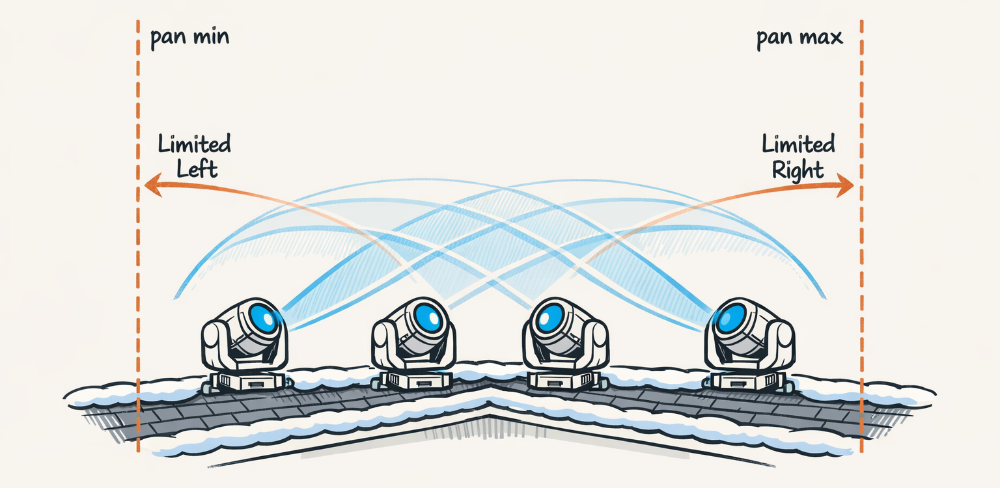
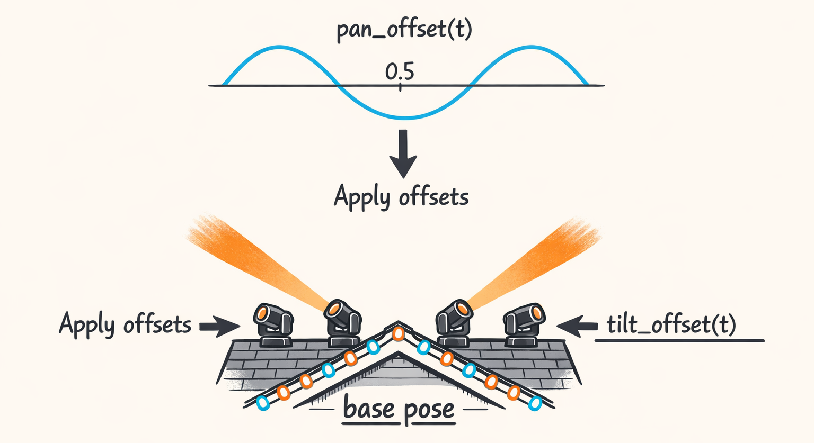
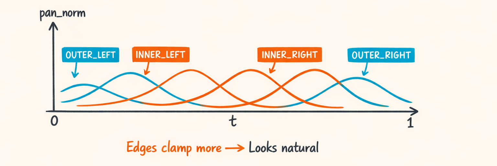
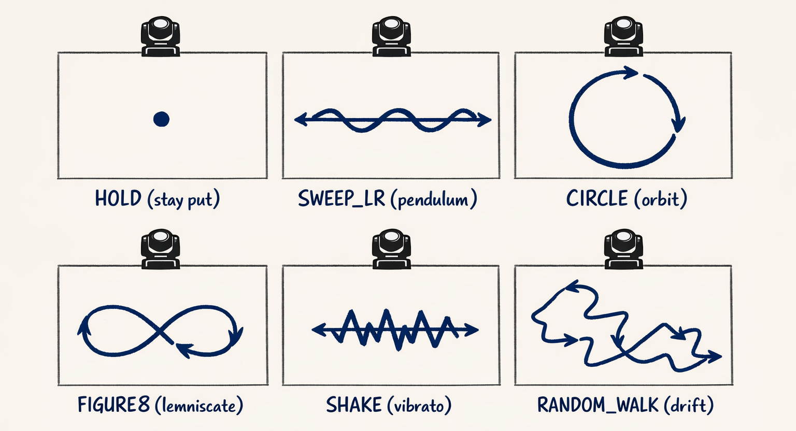

# Movement: How to Sweep Without Slamming the Pan Into 0 Like a Roomba"



Part 4 was all about curve semantics—the part where we admitted that “0.5” means *wildly different things* depending on whether you’re talking about dimmer or pan.

This part is where we take that semantic promise and try not to immediately break it.

Because “movement” in Twinklr isn’t “point somewhere else.” It’s: take a base pose from geometry (like `CHEVRON_V`), layer motion on top (like `SWEEP_LR`), then clamp the result so the `OUTER_LEFT` fixture doesn’t try to yeet itself past the physical limit and spend the rest of the segment stuck at DMX 0 like a Roomba headbutting a couch.

And yes, we absolutely shipped a version that did exactly that.

---

## Movement Handlers: Turning ‘SWEEP_LR’ into Two Curves and a Promise

A movement handler’s job sounds innocent:

- Input: `MovementType` (like `SWEEP_LR`), a **base pose** (pan/tilt), fixture calibration, plus an `Intensity`
- Output: either
  - a **pan curve** + **tilt curve**, or
  - static values (for `HOLD`), depending on the movement

In practice it’s glue code between:

- geometry (Part 2): “here’s your base chevron pose”
- curves (Part 3): “here’s a sine wave”
- semantics (Part 4): “remember: pan/tilt curves are offset-centered”
- compilation (Part 9): “turn those into per-channel `FixtureSegment`s”

If you’re thinking “ok cool, sine wave around a base pose,” yes. That’s literally the heart of it.

And the promise is this:

> For movement curves, 0.5 means “no offset from base pose.”

If a movement handler violates that, everything downstream becomes interpretive dance.

Here’s the interface shape we use for handlers (trimmed, but real spirit):

```python
class MovementHandler(Protocol):
    handler_id: str

    def resolve(
        self,
        *,
        fixture_id: str,
        role: str,
        base_pan_norm: float,
        base_tilt_norm: float,
        intensity: Intensity,
        params: dict,
        calibration: dict,
    ) -> MovementResult: ...
```

The important bit is those `base_pan_norm` / `base_tilt_norm` inputs.

That’s our “animate around base” contract. Geometry gives us a stable pose. Movement adds offsets. Everyone stays sane.

And then Part 9 comes along and stitches whatever we return into real segments per fixture/channel. Which is where bad assumptions go to die loudly.



---

## One Handler to Rule Them All (Because 15 Classes Was a Bad Weekend)

Look, the first version of movement handling was… ambitious.

We had a separate handler class per movement type:

- `SweepLeftRightHandler`
- `CircleHandler`
- `FigureEightHandler`
- `ShakeHandler`
- `RandomWalkHandler`
- …and like 10 more, each with slightly different parameter parsing, curve construction, and “oops I forgot to clamp” bugs.

It felt “clean” until we had to change *one* semantic detail (offset-centered curves from Part 4) and update 15 handlers.

We did that. It took a weekend. It was not a fun weekend.

It was the kind of weekend where you start bargaining with the universe like: “I promise I’ll write tests if you just make this stop jittering.”

So we collapsed it into:

- one `DefaultMovementHandler`
- plus a `MovementLibrary` that defines patterns

The library defines *what* a movement is (conceptually), and the default handler defines *how to execute* that concept consistently.

Here’s the shape of the pattern object (cleaned-up but mirrors the design in the repo):

```python
class MovementType(str, Enum):
    HOLD = "HOLD"
    SWEEP_LR = "SWEEP_LR"
    CIRCLE = "CIRCLE"
    FIGURE8 = "FIGURE8"
    SHAKE = "SHAKE"
    RANDOM_WALK = "RANDOM_WALK"


@dataclass(frozen=True)
class MovementPattern:
    movement_type: MovementType

    # Which underlying function family to use
    pan_driver: Literal["sine", "lissajous", "noise", "static"]
    tilt_driver: Literal["sine", "lissajous", "noise", "static"]

    # Some movements want phase offsets between pan and tilt (circle/figure8)
    pan_phase: float = 0.0
    tilt_phase: float = 0.0

    # Whether to treat outputs as offset-centered (movement) or absolute
    offset_centered: bool = True
```

Then the library is basically a dictionary with opinions:

```python
class MovementLibrary:
    PATTERNS: dict[MovementType, MovementPattern] = {
        MovementType.HOLD: MovementPattern(
            movement_type=MovementType.HOLD,
            pan_driver="static",
            tilt_driver="static",
        ),
        MovementType.SWEEP_LR: MovementPattern(
            movement_type=MovementType.SWEEP_LR,
            pan_driver="sine",
            tilt_driver="static",
            pan_phase=0.0,
            tilt_phase=0.0,
            offset_centered=True,
        ),
        MovementType.CIRCLE: MovementPattern(
            movement_type=MovementType.CIRCLE,
            pan_driver="sine",
            tilt_driver="sine",
            pan_phase=0.0,
            tilt_phase=0.25,  # quarter-cycle offset => circle-ish
            offset_centered=True,
        ),
        # etc...
    }

    @classmethod
    def get(cls, movement_type: MovementType) -> MovementPattern:
        return cls.PATTERNS[movement_type]
```

And now the handler code is boring in a good way. It looks up the pattern and runs a unified pipeline:

1. map intensity → parameters
2. generate curve(s)
3. apply base pose semantics
4. clamp to physical range (the part that saves us from Roomba mode)

Which is also why it’s more testable. You can unit test “`SWEEP_LR` at `DRAMATIC` clamps to amplitude X given base pan 0.1” without having to instantiate a bespoke class that accidentally has its own math.

Also: callback to Part 1—templates reference enums (`MovementType.SWEEP_LR`), not implementation classes. This design makes that separation actually real, instead of “we say it’s separated” while importing half the codebase.

---

## Intensity Mapping: SMOOTH Isn’t a Number, It’s a Translation Layer

Here’s the thing about `Intensity`: it’s not a scalar.

If you treat intensity as “multiply the amplitude,” you end up with:

- slow sweeps that go too far (and hit limits)
- fast sweeps that don’t read as fast because the amplitude is tiny
- jitter in planning because parameters change too much between steps

So we treat intensity as a *translation layer* from semantic words to motion parameters.

For `SWEEP_LR`, the three knobs we care about are:

- **amplitude**: how far away from the base pose we’ll swing (in normalized pan units)
- **frequency**: how quickly we oscillate (cycles per segment, basically)
- **center_offset**: a small bias left/right around the base pose (optional, but useful when geometry aims too centrally)

Mappings live in the movement curve utilities, a simplified version looks like this:

```python
def map_intensity_to_sweep_params(intensity: Intensity) -> SweepParams:
    # Numbers here are tuned by “stare at house, swear, adjust, repeat”.
    # And yes, we tried to make FAST also be BIG. It looked like chaos.
    if intensity == Intensity.SLOW:
        return SweepParams(amplitude=0.10, frequency=0.5, center_offset=0.0)
    if intensity == Intensity.SMOOTH:
        return SweepParams(amplitude=0.14, frequency=1.0, center_offset=0.0)
    if intensity == Intensity.DRAMATIC:
        return SweepParams(amplitude=0.22, frequency=1.0, center_offset=0.0)
    if intensity == Intensity.FAST:
        return SweepParams(amplitude=0.12, frequency=2.0, center_offset=0.0)
    if intensity == Intensity.INTENSE:
        return SweepParams(amplitude=0.18, frequency=3.0, center_offset=0.0)

    # fallback
    return SweepParams(amplitude=0.14, frequency=1.0, center_offset=0.0)
```

Here’s the mapping as a table:


One more subtle point that bit us:

> Keep parameters stable within a step. Changing amplitude/frequency mid-planning causes visible jitter.

If the planner tries to “help” by tweaking intensity every half-beat, you get motion that reads like nervous twitching instead of choreography. So we treat intensity as step-level intent, not beat-level micromanagement.

Also: this mapping is movement-specific. Dimmer intensity mapping is a completely different beast (Part 6 is where we confess our dimmer crimes).

---

## The SWEEP_LR Walkthrough: Base Pose + Offset Curve + Clamping

Alright. This is the meat.

Let’s say geometry (`CHEVRON_V`) gave us a base pose per fixture role:

- `OUTER_LEFT`: base pan near the left edge
- `INNER_LEFT`: closer to center
- `INNER_RIGHT`: closer to center
- `OUTER_RIGHT`: near the right edge

Now we apply `SWEEP_LR`: a sine wave offset around that base.

In offset-centered semantics (Part 4), our pan curve is centered at 0.5, meaning:

- curve value `0.5` → offset of `0.0`
- curve value `0.0` → max negative offset
- curve value `1.0` → max positive offset

### The “oops” version (what we did first)

We generated a sine curve of amplitude A and added it directly to the base pan.

For `OUTER_LEFT` with `base_pan_norm = 0.08` and `amplitude = 0.22`:

- left excursion wants to go to `0.08 - 0.22 = -0.14`

Normalized pan < 0 becomes DMX < 0, and when that hits the DMX output layer it clamps to 0.

So instead of a sweep, you get:

- sine wave on the inside of the swing
- *flatline* at the boundary on the outside

Visually, it looks like the fixture hits an invisible wall and grinds along it.

We called it “railing.” Because it’s exactly what a train does when it’s off the tracks.

### The non-embarrassing version: compute room, then clamp amplitude

We compute how much room we have to move left and right given the base pan:

- `room_left = base_pan_norm - 0.0`
- `room_right = 1.0 - base_pan_norm`

Then we compute an effective amplitude:

- `effective_amplitude = min(requested_amplitude, room_left, room_right)`

Now the sweep never asks for more excursion than the fixture has available.

Here’s a cleaned-up excerpt that shows the important bits:

```python
def _clamp01(x: float) -> float:
    return 0.0 if x < 0.0 else 1.0 if x > 1.0 else x


class DefaultMovementHandler:
    handler_id = "default_movement"

    def resolve(
        self,
        *,
        fixture_id: str,
        role: str,
        base_pan_norm: float,
        base_tilt_norm: float,
        intensity,  # Intensity in the real code; kept loose in this excerpt
        params: dict,
        calibration: dict,
    ) -> MovementResult:
        movement_type = params["movement_type"]
        pattern = MovementLibrary.get(movement_type)

        if movement_type == MovementType.HOLD:
            return MovementResult(
                pan_norm=_clamp01(base_pan_norm),
                tilt_norm=_clamp01(base_tilt_norm),
            )

        if movement_type == MovementType.SWEEP_LR:
            sweep = map_intensity_to_sweep_params(intensity)

            # How much room do we have around the base pose?
            room_left = base_pan_norm
            room_right = 1.0 - base_pan_norm

            effective_amp = min(sweep.amplitude, room_left, room_right)

            # Build an offset-centered sine: values live in [0,1] with center at 0.5.
            # NOTE: If CurveLibrary.sine() interprets amplitude differently in your repo
            # (peak-to-peak vs peak), adjust accordingly.
            pan_curve = CurveLibrary.sine(
                amplitude=effective_amp,
                frequency=sweep.frequency,
                phase=0.0,
                center=0.5,
            )

            # Tilt holds base (static). We still return it as a direct value.
            return MovementResult(
                pan_curve=pan_curve,
                tilt_norm=_clamp01(base_tilt_norm),
            )

        raise ValueError(f"Unsupported movement_type={movement_type}")
```

There are two subtle-but-critical choices in here:

1. **Clamp amplitude, not output.**  
   If you clamp the final pan samples, you get flat spots (railing). If you clamp amplitude up front, you get a smaller sine that stays smooth.

2. **Center at 0.5.**  
   This is us honoring the offset-centered semantics contract. If you center at 0.0 you’re not “offsetting,” you’re “aiming,” and the whole system becomes a semantic car crash.

### Concrete example: OUTER_LEFT clamps hard

Let’s put numbers on it.

Say in a 4-fixture chevron we got these base pans (totally plausible):

- `OUTER_LEFT`: `base_pan_norm = 0.08`
- `INNER_LEFT`: `0.30`
- `INNER_RIGHT`: `0.70`
- `OUTER_RIGHT`: `0.92`

Requested amplitude (`DRAMATIC`): `0.22`

Compute room:

- `OUTER_LEFT`: room_left = 0.08, room_right = 0.92 → effective_amp = min(0.22, 0.08, 0.92) = **0.08**
- `INNER_LEFT`: room_left = 0.30, room_right = 0.70 → effective_amp = **0.22**
- `INNER_RIGHT`: room_left = 0.70, room_right = 0.30 → effective_amp = **0.22**
- `OUTER_RIGHT`: room_left = 0.92, room_right = 0.08 → effective_amp = **0.08**

So the edges move less.

And that’s not a compromise. It’s actually nicer to watch. (We’ll get to that in the next section.)

Here’s a visual of the clamping idea:

![Diagram showing a base_pan position line, a desired sine wave exceeding the [0,1] limits, and an effective sine wave that stays inside after amplitude clamping](assets/illustrations/05_diagram_amplitude_clamping_visualization.png)

### Wait, where does “base pose + curve” actually combine?

Good catch. The handler returns a curve that’s offset-centered, but it doesn’t actually add it to the base pan in this function.

That happens later when we interpret curve semantics and convert to DMX (Part 4), and then again when we compile per-fixture segments (Part 9). The handler’s job is just to produce something that can be interpreted unambiguously.

So you’ll see code downstream doing something like:

- `offset = (curve_value - 0.5) * 2 * effective_amp`
- `final_pan_norm = base_pan_norm + offset + center_offset`
- `final_pan_norm = clamp01(final_pan_norm)`

But the big win is that the curve itself isn’t already “railed.” We prevented the crime instead of hiding the body.

---

## Overlay: All 4 Fixtures (Why the Edges Move Less and It Looks Better)

So if you plot the pan curves for all four fixtures over the same time window, with amplitude clamping applied, you get something like:

- INNER fixtures: big sweeping curves
- OUTER fixtures: smaller sweeping curves
- plus phase offsets: a ripple/chase effect (that’s Part 7’s whole party trick)

The first time we saw this, we expected to be annoyed.

Instead it looked… weirdly natural.

Because in the real world, the outer fixtures *shouldn’t* swing as far if they’re already aimed wide. If they did, they’d just paint the neighbor’s house and then smack the hard limit. The “less movement at the edges” reads like intentional staging, even though it started as “please stop slamming into DMX 0.”

Here’s what it looks like in one picture: different amplitudes plus phase shifts (LEFT_TO_RIGHT chase).



And here’s the failure mode if you skip amplitude clamping and just clamp outputs at the end:

- the outer fixtures rail at 0 or 1
- the curve turns into “sine, sine, sine, flatline”
- the motion looks robotic and broken (because it is)

We had a test sequence where `OUTER_LEFT` spent ~38% of the segment pinned at DMX 0. The beam didn’t sweep. It just… gave up.

Honestly relatable.

---

## Movement Type Gallery (Aka: Your Future Debugging Wall)

Alright, quick tour of the movement types you’re going to end up debugging at 1:30am in December.

The key mental model:

> Geometry chooses the base pose. Movement chooses the offset curves. Any movement can pair with any geometry.

So a `CHEVRON_V` can “circle.” A `FAN` can “shake.” A straight-line geometry can “random walk.” It’s all composition.

Here are the common movement patterns (not exhaustive, but the usual suspects):

- **HOLD**  
  No curves. Static pan/tilt at base pose.  
  Useful when you want dimmer-only animation (Part 6).

- **SWEEP_LR**  
  Pan: sine (offset-centered)  
  Tilt: static  
  The classic “paint the roofline” move.

- **CIRCLE**  
  Pan: sine  
  Tilt: sine with phase offset (quarter cycle)  
  Looks like circles/ellipses depending on amplitude mapping and calibration.

- **FIGURE8**  
  Pan/Tilt: lissajous-ish relationship  
  Great when you want “busy” without “random.”

- **SHAKE**  
  Small amplitude, high frequency sine (or sometimes triangle)  
  Great for accents. Terrible for your blood pressure if unclamped.

- **RANDOM_WALK**  
  Noise-driven offsets with smoothing  
  Looks organic when tuned; looks like a dying servo when not.

Here’s a little gallery diagram you can mentally pin to your wall next to “DMX values are lies”:



If you remember nothing else from this part, remember this:

- Movement handlers don’t “aim.” Geometry aims.
- Movement handlers “wiggle around aim,” using offset-centered semantics.
- Clamping is not optional. It’s the difference between choreography and Roomba cosplay.

---

> **“Roomba slam” bug** 
> We generated a sweep around a base pose near the pan limit, then clamped outputs instead of clamping amplitude, and the fixture spent half the segment pinned at DMX 0 like it was trying to tunnel through drywall.

---

Next up (Part 6): dimmer. The LED equivalent of “please breathe like a human, not like a strobe light having a panic attack.”

---

## About twinklr


twinklr is our ongoing science experiment in weaponizing holiday cheer. It's an AI-driven choreography and composition engine that takes an audio file and spits out fully synchronized sequences for Christmas light displays in xLights — because apparently we looked at a normal, peaceful hobby and thought, "What if we added AI, machine learning and sleepless nights?"

Here's the honest disclaimer: we're not professional lighting designers. We're developers, engineers, and AI researchers who spend our days building at the frontier of AI… and our nights obsessing over why a dimmer curve feels "late" by half a beat and whether a roofline sweep should be dramatic or merely aggressively festive. If you're expecting polished stage-production wisdom, you're in the wrong place. If you're into nerdy overengineering, mildly unhinged experimentation, and the occasional "how did that even work?" moment — welcome.

This blog is the running log of our journey.
