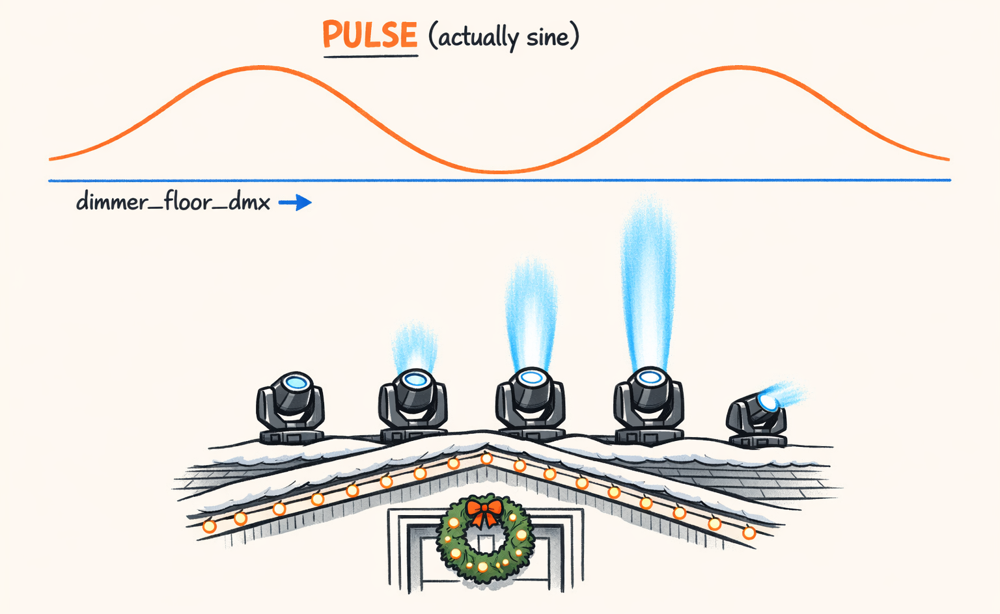
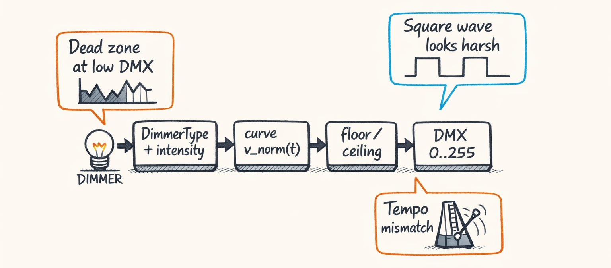

# Dimmer: Teaching LEDs to Breathe Instead of Blink



So far we’ve been obsessing over *movement*—pan, tilt, geometry, all the stuff that makes a rig look like it has intention.

But here’s the thing: movement sells the choreography. **Dimmer sells the emotion.**

If you’ve ever watched a residential show where the lights “pulse” and it feels more like a dying porch light than a living thing… yeah. That’s what we were shipping for a bit.

Not on purpose.

Just… spiritually.

This part is about how `sweep_lr_chevron_breathe` gets its “breathe” curve: a *sine-based* pulse, tempo-aware period math, and a two-stage scaling chain that sounds redundant until you remove either knob and everything immediately looks wrong.

---

## Dimmer Handler: One Channel, Surprisingly Many Ways to Mess It Up

Dimmer is one channel. A single byte. What could go wrong?

A lot, apparently.

At compile time the dimmer handler takes:

- `DimmerType` (STATIC, PULSE, etc.)
- an `intensity` (categorical “LOW/MED/HIGH” vibe knob)
- a template range (`min_norm` / `max_norm`)
- timing info (bars ↔ ms, quantization, phase offsets)

…and outputs one of two things:

1. **A curve** (time → normalized brightness 0..1)
2. **A static value** (just “hold at X”)

And unlike pan/tilt semantics from Part 4, dimmer semantics are *absolute*:

- **0.0 means OFF**
- **1.0 means FULL ON**
- **0.5 means… half bright** (not “base pose,” not “don’t move,” not “center yourself,” just… half bright)

That sounds obvious until you’ve spent three weeks living in “movement-land” where 0.5 is a special emotional support value.

Here’s a simplified-but-real sketch of how the dimmer handler is structured (names match the post; verify against repo):

```python
@dataclass(frozen=True)
class DefaultDimmerHandler:
    handler_id: str = "default_dimmer"

    def resolve(
        self,
        *,
        dimmer_type: DimmerType,
        params: dict[str, Any],
        intensity: str,  # Intensity enum serialized
        timing,          # Step timing context (bars -> ms)
        phase_offset_ms: float = 0.0,
    ) -> DimmerResult:
        """Output: either a PointsCurve (0..1) or a static normalized value."""
        cat = resolve_dimmer_params(dimmer_type, intensity=intensity, params=params)

        if dimmer_type == DimmerType.STATIC:
            # Static brightness. Still normalized 0..1 here.
            return DimmerResult(curve=None, static_norm=cat.static_norm)

        # Most fun types generate a curve.
        curve: PointsCurve = cat.build_curve(timing=timing, phase_offset_ms=phase_offset_ms)

        # NOTE: min_norm/max_norm come later (template-level scaling)
        return DimmerResult(curve=curve, static_norm=None)
```

Forward-looking gotcha: **Part 8 transitions treat dimmer differently.** For movement you can often morph or crossfade. For dimmer we frequently do **fade-via-black**, because changing movement while still lit looks like a haunted flashlight being redirected by an invisible toddler.

We’ll get there. The crime-hiding is coming.


---

## PULSE Isn’t a Square Wave (Naming Is Hard, Okay?)

Look, we named it `DimmerType.PULSE` because humans understand “pulse.”

But in Twinklr, **PULSE is not a square wave**.

It’s a sine. On purpose.

Because a square-wave pulse in a residential display looks… harsh. Not “club strobe harsh,” more like “someone wired the inflatables wrong and now the whole yard is flickering” harsh.

The jump from 0 → 1 is instant, and when you’ve got moving heads mounted on rooflines (not trusses, not stage rigs), the environment has *way* more visual context: house, trees, neighbor’s window, the mailbox you forgot exists until it’s lit like an interrogation.

We covered waveforms back in Part 3. The short version:

- **Square**: reads as *blink*
- **Sine**: reads as *breathe*
- **Triangle**: reads as *robot breathing* (useful sometimes, but not here)

So when the template says “breathe,” the dimmer library internally picks a sine-shaped curve and then we apply scaling, clamping, and timing math so it doesn’t drift off-tempo.

And yeah: we probably should’ve called it `BREATH` and kept `PULSE` for square.

We did not.

Naming is hard, okay?


---

## Period Math: Bars → Milliseconds → Cycles (So Tempo Doesn’t Break Your Breath)

Here’s the subtle failure mode: you can’t just say “do one sine wave over the duration” and call it a day.

Because templates are authored in **bars**, curves are rendered in **milliseconds**, and “one breath per X bars” needs to survive tempo changes without turning into a hyperventilating rave.

We represent the breath period as `period_bars`. It’s *not* “movement cycles” and it’s *not* “repeat cycles.” It’s literally: **how many bars per dimmer cycle**.

So the conversion pipeline is:

1. take `duration_bars` from timing
2. convert bars → ms using the BeatGrid (tempo-aware)
3. compute `cycles = duration_ms / period_ms`
4. generate a sine curve with that many cycles
5. phase-shift it (because fixtures chase)

The key concept: **cycles is often fractional.** That’s fine. A sine doesn’t care.

Concrete example (the exact one this template *claims* to use):

- `duration_bars = 4.0`
- `period_bars = 4.0`
- so we want **1 breath cycle over the whole step**

At 120 BPM in 4/4:

- 1 beat = 500 ms
- 1 bar = 4 beats = 2000 ms
- 4 bars = 8000 ms
- period is also 8000 ms
- `cycles = 8000 / 8000 = 1`

Now bump the song to 150 BPM:

- 1 beat = 400 ms
- 1 bar = 1600 ms
- 4 bars = 6400 ms
- period = 6400 ms
- `cycles = 1` still

That’s the whole point. Tempo changes don’t turn your “breathe” into a “panic.”

Here’s the code where we do this conversion (simplified). The “bars to ms” call is the important bit.

```python
def _bars_to_ms(beat_grid, bars: float) -> float:
    # beat_grid is provided by the compile context (Part 7 goes deep here)
    return beat_grid.bars_to_ms(bars)


def build_pulse_curve(
    *,
    beat_grid,
    start_ms: float,
    duration_bars: float,
    period_bars: float,
    phase_offset_ms: float = 0.0,
) -> PointsCurve:
    duration_ms = _bars_to_ms(beat_grid, duration_bars)
    period_ms = _bars_to_ms(beat_grid, period_bars)

    # Guard rails. (Ask me how I found out period_bars can be 0.0.)
    if duration_ms <= 0.0:
        return PointsCurve(points=[CurvePoint(x=0.0, y=0.0), CurvePoint(x=1.0, y=0.0)])
    if period_ms <= 0.0:
        raise ValueError(f"Invalid period_bars={period_bars} (period_ms={period_ms})")

    # How many sine cycles fit in this segment?
    cycles = duration_ms / period_ms  # e.g., 1.0 when duration_bars == period_bars

    points: list[CurvePoint] = []
    for t in CurveLibrary.default_time_samples(duration_ms):
        # Normalize 0..1 time within the segment
        x = t / duration_ms

        # Phase shift in milliseconds, but keep it inside this segment
        t_shifted = (t + phase_offset_ms) % duration_ms
        x_shifted = t_shifted / duration_ms

        # Map normalized time to radians. -π/2 starts near "low" instead of mid-bright.
        theta = (x_shifted * cycles * 2.0 * math.pi) - (math.pi / 2.0)
        y = 0.5 + 0.5 * math.sin(theta)

        points.append(CurvePoint(x=x, y=y))

    return PointsCurve(points=points)
```

Two notes from real-life testing:

1. **Starting the sine at mid-bright looked wrong.** It felt like a light “woke up already on.” The `-π/2` phase shift starts it near the bottom, so it *inhales*.
2. If you don’t treat phase offsets in the same units as timing (ms), you get drift that looks like your fixtures are arguing with each other.

And yes, Part 7 is where BeatGrid and scheduling get the spotlight. I promise it’s more fun than it sounds.


---

## The Two-Stage Scaling Chain (AKA ‘Why Isn’t min_norm the Minimum?’)

This is the part that caused the most “wait… what?” even internally.

Because we have **two** ways to scale dimmer:

1. **Stage 1: intensity scaling** (categorical knob from `Intensity`)
2. **Stage 2: template `min_norm` / `max_norm` scaling** (range knob in the template)

And the obvious question is: why not just have one?

Because we tried that and it was awful.

### Stage 1: Intensity = “character”

Intensity is a *vibe category*. “Low” should feel soft even if your min/max range is wide. “High” should feel punchier even if you’re not slamming 255.

So in our dimmer library, we resolve “categorical params” from intensity.

It’s basically a mapping table from intensity → multipliers / defaults per dimmer type.

Here’s a cleaned-up representation of what’s happening:

```python
_INTENSITY_SCALE = {
    "LOW": 0.55,
    "MEDIUM": 0.75,
    "HIGH": 1.00,
}


def resolve_dimmer_params(
    dimmer_type: DimmerType,
    *,
    intensity: str,
    params: dict[str, Any],
) -> DimmerCategoricalParams:
    scale = _INTENSITY_SCALE[intensity]

    if dimmer_type == DimmerType.STATIC:
        static_norm = float(params.get("static_norm", 1.0))
        return DimmerCategoricalParams(intensity_scale=scale, static_norm=static_norm)

    if dimmer_type == DimmerType.PULSE:
        period_bars = float(params.get("period_bars", 4.0))
        return DimmerCategoricalParams(intensity_scale=scale, period_bars=period_bars)

    raise ValueError(f"Unknown DimmerType: {dimmer_type}")
```

### Stage 2: Template min/max = “range”

Then the template can say: for this step, clamp dimmer to a range.

In `sweep_lr_chevron_breathe`, we’re not showing the whole template file here, but the defaults show we’re also clamping in **DMX space**:

```python
defaults={"dimmer_floor_dmx": 60, "dimmer_ceiling_dmx": 255}
```

Important distinction:

- `min_norm/max_norm` = shaping in normalized space (composition knob)
- `dimmer_floor_dmx/dimmer_ceiling_dmx` = hard constraints in byte space (hardware reality knob)

Both matter. Unfortunately.

### The chain, numerically (the “ohhhh” moment)

Let’s pick a single point on the raw sine:

- raw sine output: `y_raw = 0.20`

**Stage 1 (intensity scaling):**

For `Intensity.MEDIUM`, say `intensity_scale = 0.75`.

Since dimmer is absolute, we scale around 0:

- `y_stage1 = y_raw * 0.75 = 0.15`

**Stage 2 (template min/max):**

Suppose the template says:

- `min_norm = 0.10`
- `max_norm = 0.80`

We remap `0..1` into `[min_norm..max_norm]`:

- `y_stage2 = min_norm + y_stage1 * (max_norm - min_norm)`
- `y_stage2 = 0.10 + 0.15 * 0.70`
- `y_stage2 = 0.205`

So even though `min_norm=0.10`, you don’t hit 0.10 unless the scaled curve hits 0.0.

That’s the “why isn’t min_norm the minimum?” confusion.

But it’s intentional. Stage 1 changes the curve’s *character* (how deep it breathes). Stage 2 changes the *allowed range* (how bright it can get overall). Separate knobs. Different jobs.

### Where the remap lives

This remap is used all over the place (movement too), but dimmer uses it with absolute semantics.

```python
def remap_unit_interval(y: float, *, out_min: float, out_max: float) -> float:
    """Map y in [0..1] to [out_min..out_max]."""
    y = max(0.0, min(1.0, y))
    return out_min + y * (out_max - out_min)
```

And here’s how dimmer applies both stages before converting to DMX:

```python
def apply_dimmer_scaling(
    *,
    y_raw: float,
    intensity_scale: float,
    min_norm: float,
    max_norm: float,
) -> float:
    # Stage 1: categorical intensity (character)
    y1 = max(0.0, min(1.0, y_raw * intensity_scale))

    # Stage 2: template range (where in the overall brightness band we live)
    y2 = remap_unit_interval(y1, out_min=min_norm, out_max=max_norm)
    return max(0.0, min(1.0, y2))
```

If you delete stage 1, intensity stops mattering and everything feels same-y.

If you delete stage 2, templates can’t “frame” the effect for the song section.

We tried. We regretted it. We added it back. We stopped pretending it was elegant.


---

## dimmer_floor_dmx: The Empirical Fix We Found at 1AM

Here’s the part nobody wants to admit: **low DMX values often do nothing.**

Not “a little dim.” Literally nothing. Dead. Black. Like your fixture is ignoring you out of spite.

On our test rig, values below ~50–70 DMX on dimmer were effectively invisible depending on:

- the fixture’s internal dimmer curve
- ambient street lighting
- distance to the house
- camera exposure (which is how most people will see your show anyway)

So our beautiful sine “breath” had a bottom half that was just… a flatline.

It looked like:

- dim… dim… dim… (off)
- (off)
- (off)
- suddenly bright again

That is not breathing. That’s a bug.

The fix was incredibly unsexy:

- **clamp dimmer to a floor in DMX space**
- keep a ceiling too, because some fixtures clip/overdrive weirdly at 255 depending on mode

And you can see we baked sane defaults into the template:

```python
defaults={"dimmer_floor_dmx": 60, "dimmer_ceiling_dmx": 255}
```

With `dimmer_floor_dmx=60`, the “breath” becomes visible all the way through. Without it, the curve spends too long in “technically on, visually off.”

We discovered this at 1AM because of course we did. That’s when you do the most scientific work: standing in a driveway, squinting, re-running the render, and whispering “why are you like this” at four motorized fixtures.



> **Why DMX-space clamp matters:**
> If you clamp in normalized space you’re assuming a linear fixture response.
> Many fixtures are absolutely not linear at the bottom end.
> So we clamp where reality lives: DMX bytes.

---

## Phase-Shifted Breathing: When the Whole Rig Inhales Left-to-Right

Remember in Part 4 when we talked about phase shifting curves so fixtures don’t all do the exact same thing at the exact same time?

Yeah. Dimmer needs that too.

Because `sweep_lr_chevron_breathe` does movement with a left-to-right chase feel:

```python
phase_offset=PhaseOffset(
    mode=PhaseOffsetMode.GROUP_ORDER,
    order=ChaseOrder.LEFT_TO_RIGHT,
    spread_bars=1.0,
    distribution=Distribution.LINEAR,
    wrap=True,
),
```

If movement is chasing left-to-right but dimmer is perfectly in sync across fixtures, your eyes pick up a weird mismatch:

- beams *move* like a wave
- brightness *breathes* like a single blob

It reads as “four lights doing one thing” instead of “a rig with intent.”

So we apply phase offsets to dimmer curves too. Same idea as movement: shift time. Don’t change the shape.

Example with 4 fixtures and `spread_bars=1.0`:

- total spread: 1 bar across the group
- 4 fixtures → offsets of roughly `0.0, 0.333, 0.666, 1.0` bars (depending on exact distribution/wrap rules)
- which becomes ms offsets via BeatGrid

So now the whole rig “inhales” left-to-right. It’s subtle. But subtle is the point.

Christmas shows are basically the art of subtlety turned up to 255.

Part 7 is where offsets are computed for real (you mention `calculate_fixture_offsets` in the compiler—please double-check the exact function name), but dimmer participates the same way movement does: it takes `phase_offset_ms` and shifts its sampling.


---

### Tiny preview of the next mess

In Part 7 we’ll dig into timing and phase in a way that made me want to take up woodworking. We’ll talk BeatGrid, quantization, `wrap`, and why `spread_bars=1.0` is a deceptively compact sentence that actually means “please don’t let my four fixtures act like one big nervous fixture.”

And then in Part 8 we’ll talk transitions—aka how we hide the moment where we switch from one template to another without your audience noticing the beams just teleported.

Because they will.

They always do.

---

## About twinklr


twinklr is our ongoing science experiment in weaponizing holiday cheer. It's an AI-driven choreography and composition engine that takes an audio file and spits out fully synchronized sequences for Christmas light displays in xLights — because apparently we looked at a normal, peaceful hobby and thought, "What if we added AI, machine learning and sleepless nights?"

Here's the honest disclaimer: we're not professional lighting designers. We're developers, engineers, and AI researchers who spend our days building at the frontier of AI… and our nights obsessing over why a dimmer curve feels "late" by half a beat and whether a roofline sweep should be dramatic or merely aggressively festive. If you're expecting polished stage-production wisdom, you're in the wrong place. If you're into nerdy overengineering, mildly unhinged experimentation, and the occasional "how did that even work?" moment — welcome.

This blog is the running log of our journey.