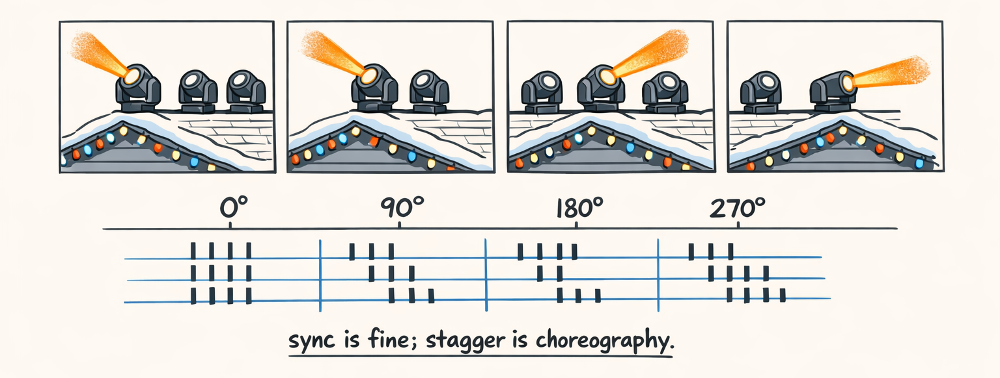
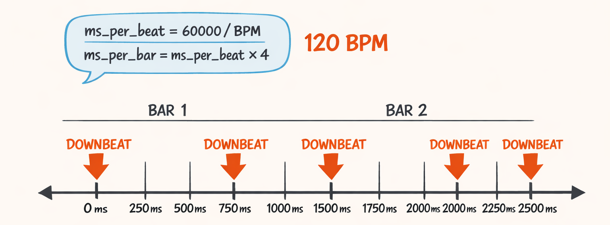
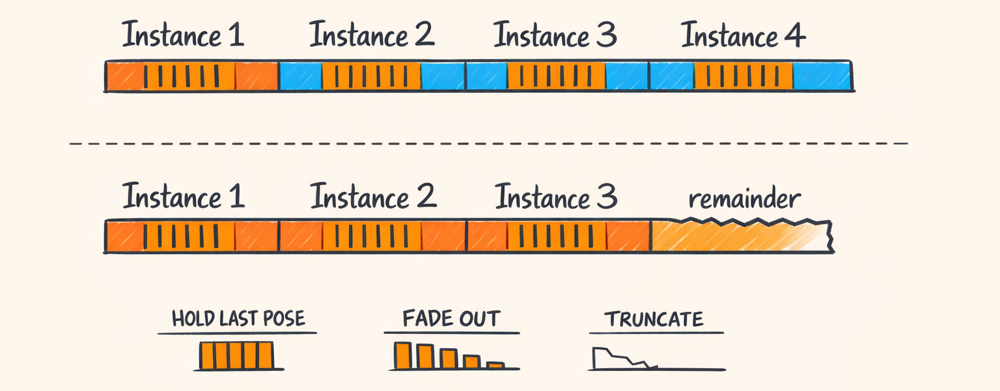
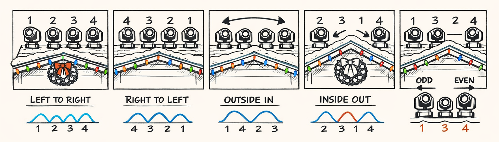
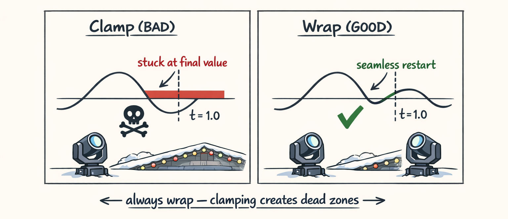

# Timing & Phase: Making Four Fixtures Stop Acting Like One Big Nervous Fixture



So here’s the thing: four fixtures in perfect sync looks… fine.

Clean. Polite. Like a choir where everyone sings the same note because they’re scared of getting yelled at.

But stagger their phase a little?

Now you’ve got motion. You’ve got a *chase*. You’ve got something that reads like choreography instead of “one big nervous fixture with four heads.”

The price tag is real though. The second you phase-shift fixtures, you basically lose grouping. You can’t cheat by dropping one effect across four fixtures anymore—because they’re no longer doing the same thing at the same time.

(And yes, it hurts. We’ll talk about that cost in section 6.)

This part is about time and phase inside Twinklr’s moving head compiler:

- **BeatGrid time**: the only clock we trust
- **Repeat scheduling**: turning “16 bars” into actual instances with start/end times
- **Phase offsets**: creating ripples across fixture roles
- **Chase orders**: same curve, different vibe
- **wrap=True**: the tiniest boolean that saves you from “falling off the curve”
- **Ungrouping**: the memory/XML tax for looking good

---

## BeatGrid: The Only Clock We Trust

You’d think the “clock” for a light show is milliseconds.

Nope.

Milliseconds are what you use when you’re debugging why a fixture blacked out **83ms early** and you’re convinced the universe hates you. But templates? Templates speak **musical time**: bars and beats.

Because the user (and the LLM, on a good day) thinks in phrases like:

- “start on the downbeat”
- “hold for 4 bars”
- “repeat for 16 bars”
- “spread the chase across 1 bar”

So we anchor everything to a beat grid, and only convert to ms at the edges.

The conversion is simple, but it shows up *everywhere*, so it’s worth writing down once:

- `ms_per_beat = 60_000 / bpm`
- `beats_per_bar = 4` (we assume 4/4 for now)
- `ms_per_bar = ms_per_beat * beats_per_bar`

Concrete example at **120 BPM**:

- `ms_per_beat = 60000 / 120 = 500 ms`
- `ms_per_bar = 500 * 4 = 2000 ms`

So a 4-bar step is `8000 ms`.

And the nice part is: it stays musically aligned even if the song tempo changes later (assuming your BeatGrid is computed from the song and not your feelings).

Also: quantization is where we stop pretending humans (or planners) are perfect.

Templates can ask for a start time like `start_offset_bars=0.13` because the planner got “creative.” That’s how you get shows that feel late/early *and* make you question your life choices.

So we quantize against the grid based on the `BaseTiming.quantize_type`:

- `DOWNBEAT`: snap to bar boundaries
- `ANY_BEAT`: snap to beats
- `SIXTEENTH_BAR`: snap to 1/16 bar increments
- …etc.

Crucial detail: quantization is relative to the **running template’s** downbeat alignment.

If your template starts at bar `32.0` in the song, “DOWNBEAT” means “bar 32, 33, 34…”—not “whatever the nearest beat is in raw milliseconds.”

That sounds obvious until you’ve watched a “repeat every 4 bars” pattern slowly drift off the chorus because you quantized against ms.

Here’s a small slice of what that conversion typically looks like in the compiler. (Cleaned up, but matches what we do all over the place when we go from musical timing → concrete time.)

```python
def bars_to_ms(bars: float, bpm: float, beats_per_bar: int = 4) -> int:
    ms_per_beat = 60_000.0 / bpm
    ms_per_bar = ms_per_beat * beats_per_bar
    return int(round(bars * ms_per_bar))

assert bars_to_ms(4.0, bpm=120.0) == 8000
```

And here’s the mental model I keep on a sticky note:

- Templates speak bars.
- BeatGrid translates bars to ms.
- Ms is just the transport currency.



---

## Scheduling Repeats: The Part That Turns ‘16 Bars’ into Concrete Instances

In template-land, repeats look adorable:

```python
repeat=RepeatContract(
    repeatable=True,
    mode=RepeatMode.PING_PONG,
    cycle_bars=4.0,
    loop_step_ids=["main"],
    remainder_policy=RemainderPolicy.HOLD_LAST_POSE,
),
```

But in compiler-land, we don’t get to be adorable. We need actual instances with actual start/end times so we can compile steps into segments.

That’s what `schedule_repeats()` does:

- input: template repeat contract, template duration, beat grid
- output: list of **ScheduledInstance** objects
  - each instance knows which cycle it is
  - where it starts/ends (in bars and usually also ms)
  - whether it’s a forward or backward pass for ping-pong
  - how to treat the remainder

The key thing repeat scheduling does is stop the template from being a single “4 bar step” and turn it into:

- cycle 0: bars 0→4
- cycle 1: bars 4→8
- cycle 2: bars 8→12
- cycle 3: bars 12→16

…plus whatever weird remainder you asked for.

### PING_PONG: the single-step subtlety that bit us

PING_PONG seems straightforward: forward then backward.

But the subtlety is *what happens at the boundary*.

If you literally play frames like `[0, 1] + [1, 0]`, you duplicated the endpoint. That causes a visible “hold” on the turnaround frame.

Sometimes that’s fine. Sometimes it looks like the fixture got distracted by a moth.

So the scheduler/phase logic has to be careful about whether a ping-pong cycle includes the endpoint twice or treats it like a continuous reflection.

In Twinklr we generally want motion to feel continuous, which means the compiler needs to avoid creating a “free pause” at the apex unless the template explicitly asked for one.

### Remainders: where your clean math goes to die

Say your template slot is 14 bars, and your cycle is 4 bars.

That’s:

- 3 full cycles (12 bars)
- remainder: 2 bars

Now what?

That’s controlled by `RemainderPolicy` (from `packages/twinklr/core/sequencer/models/template.py`):

- `HOLD_LAST_POSE`: finish the last cycle you can, then hold
- `FADE_OUT`: fade intensity to black over the remainder window (while holding movement or freezing, depending on how the step compilers interpret it)
- `TRUNCATE`: hard cut at the boundary (brutal, but honest)

Forward reference: in **Part 9**, these scheduled instances are what turn into actual per-fixture `FixtureSegment`s and eventually land in the exported `.xsq`. Scheduling is where “musical intent” becomes “real instances we can render.”

Here’s a simplified (but faithful) sketch of the scheduler output shape. The names are based on what the rest of the compiler expects, even if your local version has slightly different fields.

```python
def schedule_repeats(*, total_bars: float, cycle_bars: float, mode: str) -> list[ScheduledInstance]:
    out: list[ScheduledInstance] = []
    n_full = int(total_bars // cycle_bars)
    remainder = total_bars - (n_full * cycle_bars)

    for i in range(n_full):
        start = i * cycle_bars
        end = start + cycle_bars
        direction = "forward"
        if mode == "PING_PONG" and (i % 2 == 1):
            direction = "backward"
        out.append(ScheduledInstance(i, start, end, direction))

    if remainder > 0:
        start = n_full * cycle_bars
        end = start + remainder
        out.append(ScheduledInstance(n_full, start, end, "forward", is_remainder=True))

    return out
```

And here’s the piece we kept getting wrong early on: **the remainder is not just “another cycle.”** It’s its own weird little half-cycle with policy.

If you treat it like a normal cycle, you’ll accidentally run movement/dimmer curves past the intended end, then your show slot overruns, then your downstream exporter starts clipping things like a nervous barber.



---

## Phase Offsets: The Ripple Generator

If BeatGrid is the clock, phase offsets are the personality.

Without offsets: all fixtures sample the same curve at the same normalized time `t`.

With offsets: each fixture samples the curve at `t + offset`.

That’s it. That’s the whole trick.

And yes, it took us an embarrassing amount of time to stop screwing it up.

Phase offsets are defined per step in `StepTiming.phase_offset`:

```python
phase_offset=PhaseOffset(
    mode=PhaseOffsetMode.GROUP_ORDER,
    order=ChaseOrder.LEFT_TO_RIGHT,
    spread_bars=1.0,
    distribution=Distribution.LINEAR,
    wrap=True,
),
```

That means:

- take the fixtures in the semantic group (default `ALL`)
- order them by `LEFT_TO_RIGHT`
- spread their offsets across `spread_bars=1.0` bars total
- distribute linearly
- wrap time when offset pushes you beyond the cycle

### Offsets in bars (human-friendly)

Let’s say we have 4 fixtures, ordered left to right:

1. OUTER_LEFT
2. INNER_LEFT
3. INNER_RIGHT
4. OUTER_RIGHT

And `spread_bars = 1.0`.

A linear distribution across N fixtures is basically:

- `offset_bars[i] = spread_bars * (i / (N - 1))`

So for N = 4:

- fixture 0: `0 / 3 * 1.0 = 0.0 bars`
- fixture 1: `1 / 3 * 1.0 = 0.333... bars`
- fixture 2: `2 / 3 * 1.0 = 0.667... bars`
- fixture 3: `3 / 3 * 1.0 = 1.0 bars`

That last one is the hilarious one: “offset by 1 full bar.” Totally fine… as long as your cycle duration is > 1 bar, and as long as you wrap (we’ll get there in section 5).

### Offsets in normalized phase (machine-friendly)

Curves are sampled in normalized time `t ∈ [0, 1]`. So we convert bars to normalized phase by dividing by the step duration:

- `phase_norm = offset_bars / duration_bars`

In `sweep_lr_chevron_breathe`, the `duration_bars` is 4.0 for the step.

So the normalized phase offsets are:

- 0.0 / 4.0 = 0.000
- 0.333 / 4.0 = 0.0833
- 0.667 / 4.0 = 0.1667
- 1.0 / 4.0 = 0.250

So OUTER_RIGHT is a quarter-cycle ahead of OUTER_LEFT. That reads like a clean ripple.

### Apply to pan/tilt/dimmer (the callback to Part 4)

In Part 4 we talked about “phase shifting” curves and how resampling can be done either by shifting points or by shifting sampling time.

In the moving head pipeline we treat phase offsets as *sampling time offsets*:

- pan curve: sample at `t + phase_norm`
- tilt curve: sample at `t + phase_norm`
- dimmer curve: sample at `t + phase_norm`

Which means all channels stay “coherent” per fixture. The fixture isn’t panning left while dimmer is breathing for some other fixture’s moment.

Here’s a simplified version of what `calculate_fixture_offsets()` returns conceptually:

```python
def _linear_offsets(spread_bars: float, n: int) -> list[float]:
    if n <= 1:
        return [0.0] * n
    return [spread_bars * (i / (n - 1)) for i in range(n)]

def calculate_fixture_offsets(
    *,
    fixture_ids: list[str],
    roles: list[str],
    order: ChaseOrder,
    spread_bars: float,
    duration_bars: float,
    distribution: Distribution = Distribution.LINEAR,
) -> list[PhaseOffsetResult]:
    # 1) order fixtures (LEFT_TO_RIGHT etc.)
    ordered = _apply_order(fixture_ids, roles, order)  # real code uses semantic groups & layout

    # 2) compute offset bars
    offsets = _linear_offsets(spread_bars, len(ordered))

    # 3) convert to normalized phase for curve sampling
    results: list[PhaseOffsetResult] = []
    for (fixture_id, role), offset_bars in zip(ordered, offsets, strict=True):
        results.append(
            PhaseOffsetResult(
                fixture_id=fixture_id,
                role=role,
                offset_bars=offset_bars,
                phase_norm=(offset_bars / duration_bars) if duration_bars > 0 else 0.0,
            )
        )
    return results
```

And then in curve sampling land, the shift is basically this:

```python
# packages/twinklr/core/curves/phase.py (conceptual)
def shift_phase(t_norm: float, phase_norm: float, *, wrap: bool = True) -> float:
    x = t_norm + phase_norm
    if wrap:
        return x % 1.0
    # no wrap -> clamp
    return max(0.0, min(1.0, x))
```

If you’re thinking “that seems too simple,” congratulations: you’ve never shipped v0 of this and watched it clamp weirdly at `1.0` and freeze OUTER_RIGHT like it got unplugged.

We’ll relive that trauma in section 5.


---

## Chase Orders: Same Curves, Different Personality

We learned this the fun way: you can keep the exact same movement curve and make it feel like a totally different show just by changing **the order** you apply offsets.

```python
class ChaseOrder(str, Enum):
    LEFT_TO_RIGHT = "LEFT_TO_RIGHT"
    RIGHT_TO_LEFT = "RIGHT_TO_LEFT"
    OUTSIDE_IN = "OUTSIDE_IN"
    INSIDE_OUT = "INSIDE_OUT"
    ODD_EVEN = "ODD_EVEN"
```

Here’s how these read in the real world (roofline, 4 fixtures, audience in front):

### LEFT_TO_RIGHT / RIGHT_TO_LEFT

Obvious. Clean. Feels like a scan.

If your geometry is a chevron sweep, LEFT_TO_RIGHT tends to read like “we’re pushing energy across the house.” RIGHT_TO_LEFT reads like the same thing but with slightly more menace.

(No idea why. Humans are weird.)

### OUTSIDE_IN

This one is sneaky. You think it’ll be subtle.

It is not.

OUTSIDE_IN often reads *more dramatic* than expected because both outer fixtures move first, pulling your eyes wide, then collapsing toward center. It’s like the lights are taking a breath and tightening.

We ended up using OUTSIDE_IN more than we expected because it makes even “simple” curves feel designed.

### INSIDE_OUT

Great for “burst” energy. Center leads, then it explodes outward.

If you pair that with a dimmer accent on the downbeat, it looks like the house is doing a mini firework without committing any actual felonies.

### ODD_EVEN

This one’s great for “tension.” It’s not a spatial chase, it’s a pattern chase. Odd fixtures go first, even fixtures follow.

On a 4-head layout it reads like:

- heads 1 and 3 lead
- then heads 2 and 4 respond

It can feel glitchy (in a good way) if your curve is snappy. It can also feel like your wiring is wrong if your curve is slow.

We’ll get more opinionated about which orders template authors should pick in Part 10, once we’ve also dealt with “cool, but your fixture has 6 channels and you only choreographed 3.”



---

## wrap=True: The Small Boolean That Prevents ‘Falling Off the Curve’

Let’s talk about the dumbest bug we shipped that still made me stare at the ceiling at 2am.

Phase shifting means you sample a curve at `t + offset`.

But normalized time is supposed to live in `[0.0, 1.0]`.

So what happens when you push it past 1.0?

Two options:

1. **wrap=True**: treat the curve as cyclic

   `t_shifted = (t + offset) % 1.0`

2. **wrap=False**: clamp to the end

   `t_shifted = min(1.0, t + offset)`

Clamping sounds reasonable until you see it.

Here’s what clamping does to a cyclic effect:

- OUTER_RIGHT hits `t=1.0` early because it’s phase-advanced
- then it stays pinned at the last curve value for the rest of the step
- so you get a weird “hold” that looks like the fixture got tired and decided to stop participating

And since pan/tilt curves often end at the *same place they started* (because they’re designed to loop), that “hold” can look like a jittery stall. Or worse, it creates a visible discontinuity right at the cycle boundary.

Wrapping is almost always the correct behavior for:

- repeating steps (like our 4-bar cycle)
- oscillating curves (sine/triangle)
- anything where the endpoint equals the start point (loop-ready curves)

So we default `PhaseOffset.wrap = True` in the model.



---

## Ungrouping: The Real Cost of Looking Good

Okay. Here’s the tax.

When all fixtures are in sync, you can often represent them with one effect placement and apply it to a group in xLights (or in our internal IR) because every channel does the same thing at the same time.

That means:

- fewer segments
- fewer effect blocks
- smaller `.xsq`
- faster render/export
- less XML bloat that makes you scroll like you’re reading the Terms of Service for reality

The moment you add phase offsets, fixtures stop being identical.

Even if:

- they use the same curve shape
- same geometry
- same movement handler

…they’re sampling at different times. Which means the actual DMX values differ per fixture per moment.

So you can’t keep them grouped as a single effect instance anymore. You have to **ungroup** into per-fixture placements (or per-fixture segments in our IR).

Concrete pain for a simple scenario:

- 4 fixtures
- channels: pan, tilt, dimmer (3)
- scheduled instances: 4 cycles across a 16-bar slot

That’s roughly `4 fixtures * 3 channels * 4 instances = 48` channel-segment blocks.

…and that’s before you add transitions, fades, or extra channels.

(Part 10 is coming for us all.)

Now scale up to:

- 12 fixtures on a bigger house
- 6 channels per fixture
- lots of short high-energy templates

…and suddenly your “pretty ripple chase” is an XML novella.

This is one of those engineering tradeoffs that isn’t philosophical. It’s just arithmetic.

- **Visual richness** wants phase offsets.
- **File size and export speed** want grouping.
- **Users** want both, and they want it to render fast on a laptop that’s also running Spotify and 14 Chrome tabs.

We don’t have a magic answer. We have rules:

- group only when fixtures are truly identical for the segment window
- ungroup when phase differs (or anything else differs)
- try not to explode the segment count with overzealous curve sampling

We’ll dig deep into the export pipeline and the actual grouping rules in **Part 9**, because that’s where the “pretty theory” hits the `.xsq` writer and starts making sad CPU noises.

For now, just know this: whenever you see a chase that feels alive, there’s a non-zero chance the compiler is quietly generating 10× more segment blocks behind your back.

And you know what? Fair trade. Most nights.

---

> **Decision point we keep re-learning:**
> If the effect is meant to feel *cyclic*, phase shifting without `wrap=True` will betray you.
> If the effect is meant to feel *coordinated*, phase offsets have to apply consistently across pan/tilt/dimmer.
> If the effect is meant to feel *big*, you will pay in segment count.

---

### Up next

Part 8 is all about **transitions**: the art of hiding the crime scene between two templates so it doesn’t look like your fixtures got rebooted mid-song.

And then Part 9 is where we walk one template all the way from Python objects to an actual `.xsq` file and see where the bodies are buried.

---

## About twinklr


twinklr is our ongoing science experiment in weaponizing holiday cheer. It's an AI-driven choreography and composition engine that takes an audio file and spits out fully synchronized sequences for Christmas light displays in xLights — because apparently we looked at a normal, peaceful hobby and thought, "What if we added AI, machine learning and sleepless nights?"

Here's the honest disclaimer: we're not professional lighting designers. We're developers, engineers, and AI researchers who spend our days building at the frontier of AI… and our nights obsessing over why a dimmer curve feels "late" by half a beat and whether a roofline sweep should be dramatic or merely aggressively festive. If you're expecting polished stage-production wisdom, you're in the wrong place. If you're into nerdy overengineering, mildly unhinged experimentation, and the occasional "how did that even work?" moment — welcome.

This blog is the running log of our journey.