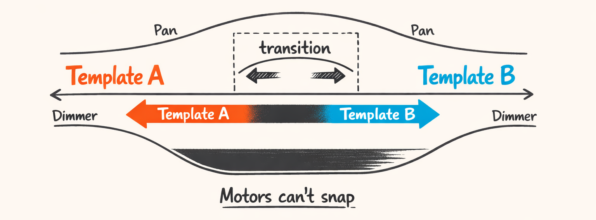
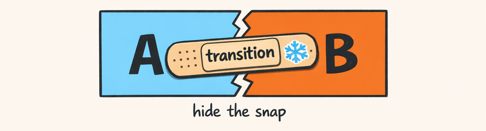
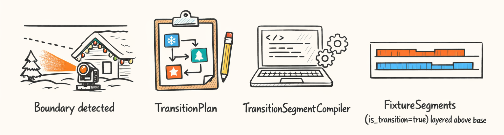
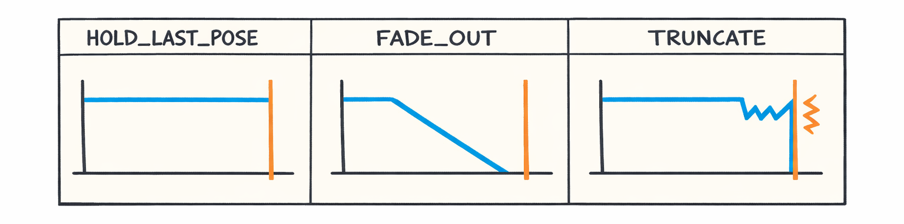

# Transitions: Hiding the Crime Scene Between Two Templates



## Why Transitions Exist: Because Motors Aren’t Audio

So here’s the part nobody posts on YouTube: the *cut*.

You can choreograph the most gorgeous 4‑bar chevron sweep in human history, nail the dimmer breathe (Part 6), phase everything so it feels like actual choreography instead of four anxious desk lamps (Part 7)… and then you switch to the next template and it looks like your fixtures got startled by a raccoon.

Template boundaries are where glitches go to be seen.

Why? Because **audio is continuous-ish** (beats, bars, phrases) but **fixtures are mechanical liars**:

- **Pan/tilt are motors.** They have inertia. They can’t “snap” without looking like they snapped.
- **Dimmer is perception.** Linear DMX does *not* equal linear brightness (also: your eyes are jerks).
- **Discrete channels are brutally binary.** Color wheel, gobo wheel, prism, macros… those need to *snap* or you’ll watch them scroll through nonsense like a slot machine.

And if you do the naïve thing—just end Template A at `t=12.000s` and start Template B at `t=12.000s`—you get the classic boundary crime:

1. Pan/tilt jumps because A ended somewhere and B starts somewhere else.
2. Dimmer crossfades reveal the repositioning (“why is the beam sliding across my garage door while fading?”)
3. Discrete channels try to interpolate and your fixture does an interpretive dance called “Gobo: Maybe?”

The core idea we landed on (after watching way too many ugly previews) is:

> **Transitions aren’t one thing. They’re per-channel strategies.**  
> Pan gets one rule. Tilt gets one rule. Dimmer gets a different rule. Discrete stuff gets a rule that basically says “nope”.

This isn’t new in pro lighting. But it *is* new when your “lighting designer” is:

- an LLM that thinks “smooth” is a vibe,
- plus a compiler that has to turn vibes into DMX,
- plus a residential roofline where your fixtures are definitely not hung on a truss like civilized people.

Also: this wasn’t a “nice to have.” This was a pipeline stage callout way back in **Part 0**: we said there’s a point where we detect boundaries and “compile transitions.” This post is the gritty reality of that sentence.



The trick is making the handoff look **intentional**.

Not “the blue screen of death crash and restarted mid-song.”

---

## Transition Pipeline: Detect → Plan → Compile

Look, we tried the “just fade everything” approach first. It was… not good.

- Fade pan/tilt? You can’t. That’s not a thing. (Unless you like beams crawling through space like a screensaver.)
- Crossfade dimmer everywhere? It reveals repositioning, which is basically the opposite of what you want.
- Snap everything? Congrats, you made a strobe of sadness.

So we built a little pipeline with three steps. It’s not fancy. It’s just explicit.

1. **Detect** where transitions should happen
2. **Plan** how big the overlap window is and what strategy to use per channel
3. **Compile** actual “transition segments” that sit *above* the base segments


The transition segments are emitted on a higher “layer” conceptually. We’ll cash that check in **Part 9**, where everything ends up in xLights layers and we try not to cry.



### Detect: finding the awkward moments

The detector’s job is boring: find boundaries between compiled template regions. The boundaries come from the higher-level scheduler (sections/steps/cycles). In practice, this means: “Template A ends at `t_end`, Template B starts at `t_start`.”

Here’s a brief version of the detector interface:

```python
def detect_boundaries(*, scheduled_templates: list[dict]) -> list[Boundary]:
    """Return boundaries where A ends exactly when B starts.

    scheduled_templates: [{'template_id': str, 'start_ms': int, 'end_ms': int}, ...]

    Note: gaps/overlaps are handled elsewhere (intentionally).
    """
    boundaries: list[Boundary] = []

    for i in range(len(scheduled_templates) - 1):
        a = scheduled_templates[i]
        b = scheduled_templates[i + 1]

        if a["end_ms"] == b["start_ms"]:
            boundaries.append(
                Boundary(
                    t_ms=a["end_ms"],
                    left_template_id=a["template_id"],
                    right_template_id=b["template_id"],
                )
            )

    return boundaries
```

Yes, it’s basically “find adjacent times.” Glamorous.

### Plan: deciding how to hide the crime scene

Planner takes a boundary and says:

- how wide is the transition window?
- is it centered on the boundary or biased left/right?
- which channels get which blend strategy?

### Compile: emit segments that override the base

Compiler takes the plan and generates actual `FixtureSegment`s (the IR we’ve been using since forever) but marks them as transitions.

That means the rest of the system can treat them as “just more segments,” except when we render them we put them on top.

We’ll talk about the renderer/layering in Part 9. For now: detect → plan → compile is the whole mental model.

---

## Five Blend Strategies (And When Each One Doesn’t Suck)

Alright. This is the meat.

We needed a small set of strategies that cover:

- continuous motion (pan/tilt)
- brightness (dimmer)
- discrete channels (wheels, shutters, macros later in Part 10)
- “I need it to look intentional, not just mathematically continuous”

So we implemented a per-channel blender and ended up with these five strategies:

1. `SNAP`
2. `SMOOTH_INTERPOLATION`
3. `CROSSFADE` (linear and equal-power)
4. `FADE_VIA_BLACK`
5. `SEQUENCE` (fade out → hold dark → fade in)

Here’s the thing: *each one fails in a different way*. Which is great, because it means you can pick your poison intentionally.


### SNAP: for channels that should never be “halfway”

Use this when the concept of “in between” is nonsense.

- color wheel positions
- gobo wheel positions
- prism enable
- “fixture macro 17: Christmas seizure mode”
- anything where the fixture physically scrolls through intermediate states

If you interpolate a gobo wheel value from 10 → 50, the fixture will *travel* through 11, 12, 13… and you’ll see a little gobo parade across your house.

Not the vibe.

It’s dumb on purpose.

**When SNAP doesn’t suck:** discrete channels. Period.

**When SNAP absolutely sucks:** pan/tilt. Unless you want your fixture to look like it got rebooted.

---

### SMOOTH_INTERPOLATION: pan/tilt need easing, not vibes

For motion, we want continuity of position *and* continuity of velocity (or at least “not a visible jerk”).

So we do a smooth interpolation with an easing curve.

We already built easing curves in Part 3 (and used them in movement in Part 5). Transitions reuse those ideas: if you’re going from `pan=70` to `pan=180`, you don’t want linear time mapping. You want ease-in/ease-out so it doesn’t slam at endpoints.

A typical pattern:

- normalize transition time:  
  `u = clamp((t - t0) / (t1 - t0), 0..1)`
- apply easing:  
  `e = ease_in_out(u)`
- mix values:  
  `v = (1-e)*v0 + e*v1`

Blending code:

```python
def _clamp01(x: float) -> float:
    return 0.0 if x < 0.0 else 1.0 if x > 1.0 else x


def _ease_in_out_sine(u: float) -> float:
    # Smooth derivative at endpoints. Great for motors.
    # e(u) = 0.5 - 0.5*cos(pi*u)
    return 0.5 - 0.5 * math.cos(math.pi * u)


def blend_value(req: BlendRequest, t_ms: int) -> float:
    if req.mode == TransitionMode.MORPH:  # internal name: "smooth interpolation"
        denom = max(1.0, float(req.t1_ms - req.t0_ms))
        u = _clamp01((t_ms - req.t0_ms) / denom)
        e = _ease_in_out_sine(u)
        return (1.0 - e) * req.v0 + e * req.v1

    ...
```

Yeah, `TransitionMode.MORPH` is doing “smooth interpolation” work right now. Naming is hard. We’ll probably split it later once we add more curve shapes.

**When it doesn’t suck:** pan and tilt, mostly.

**When it sucks:** dimmer, because your eyeballs don’t map linearly and also because crossfading brightness while motors move is basically you pointing a flashlight while walking across a wall: everyone sees it.

---

### CROSSFADE: linear vs equal-power (your eyes will judge you)

Crossfade is the classic “fade out A while fading in B.”

Except: when you do it linearly on intensity, the midpoint often looks like a dip. Human brightness perception is nonlinear, and LEDs don’t help.

So we support two mental models:

#### Linear crossfade

- `a = 1-u`
- `b = u`
- result = `a*v0 + b*v1`

#### Equal-power crossfade

Audio folks use this to keep perceived loudness steady:

- `a = cos(u * π/2)`
- `b = sin(u * π/2)`
- result = `a*v0 + b*v1`

It’s not perfect for light, but it’s *way* better than linear when both sides are “on.”

Here’s the code shape:

```python
def _xfade_linear(u: float) -> tuple[float, float]:
    return (1.0 - u, u)


def _xfade_equal_power(u: float) -> tuple[float, float]:
    a = math.cos(u * math.pi / 2.0)
    b = math.sin(u * math.pi / 2.0)
    return (a, b)


def blend_crossfade(v0: float, v1: float, u: float, *, equal_power: bool) -> float:
    u = _clamp01(u)
    a, b = _xfade_equal_power(u) if equal_power else _xfade_linear(u)
    return a * v0 + b * v1
```

**When CROSSFADE doesn’t suck:** when both templates are visually compatible and you’re not hiding a big reposition. Think dimmer-only modulation changes, or two similar poses.

**When it sucks:** when Template B needs to move somewhere else. Crossfading intensity while pan/tilt are moving makes the movement visible.

Which is exactly the thing we’re trying to hide.

That’s how we ended up with…

---

### FADE_VIA_BLACK: the default “hide the motors” move

This is the one we use most for **dimmer** at boundaries.

The idea:

1. Fade intensity down to black *before* the boundary
2. While it’s dark, let pan/tilt re-target (with smooth interpolation if needed)
3. Fade intensity back up after the boundary

It’s basically “turn the flashlight off while you move your hand.”

This lives in `TransitionMode.FADE_VIA_BLACK` already, so at least the naming is honest.

Code concept:

```python
def blend_fade_via_black(v0: float, v1: float, u: float) -> float:
    """u in [0, 1]. Fade out to 0 at u=0.5, then fade in to v1."""
    u = _clamp01(u)

    if u < 0.5:
        # fade from v0 -> 0
        uu = u / 0.5
        e = _ease_in_out_sine(uu)
        return (1.0 - e) * v0

    # fade from 0 -> v1
    uu = (u - 0.5) / 0.5
    e = _ease_in_out_sine(uu)
    return e * v1
```

This is the “adult” solution for residential installs because your environment is full of unintended projection surfaces:

- garage doors
- neighbors’ windows (oops)
- white vinyl fences (why are they always white?)

**When it doesn’t suck:** most of the time. It hides repositioning and looks intentional.

**When it sucks:** if the music is sustaining a big bright moment and you fade to black, it can feel like you dropped the show. So you don’t do this on every boundary—only when the geometry is changing enough that crossfade would expose it.

---

### SEQUENCE: fake a shutter move (without an actual shutter channel… yet)

Sometimes you want a transition that feels like:

- quick fade out
- *hold black* for a beat slice
- quick fade in

That “black hold” is important. It buys time for motors to move without any visible beam.

This is basically a timed sequence:

- `0%..40%`: fade down
- `40%..60%`: hold at 0
- `60%..100%`: fade up

We use it when we need the transition to read like a deliberate “cut,” not a soft dissolve. It’s also a decent stand-in for shutter behavior before we implement real shutter/strobe channels in Part 10.

Code:

```python
def blend_sequence(v0: float, v1: float, u: float) -> float:
    u = _clamp01(u)

    if u < 0.4:
        uu = u / 0.4
        e = _ease_in_out_sine(uu)
        return (1.0 - e) * v0

    if u < 0.6:
        return 0.0

    uu = (u - 0.6) / 0.4
    e = _ease_in_out_sine(uu)
    return e * v1
```

**When it doesn’t suck:** high-energy cuts, percussive hits, “reset” moments.

**When it sucks:** slow ambient sections where a hard black hold feels like the power flickered.

---

### Strategy selection: per channel, not per template

The practical rule set we landed on:

- `pan`: `SMOOTH_INTERPOLATION` (aka `MORPH`)
- `tilt`: `SMOOTH_INTERPOLATION`
- `dimmer`: `FADE_VIA_BLACK` (default)
- discrete channels: `SNAP`
- special cases: `SEQUENCE` when we want an intentional blackout beat

And yes, this is where we start drifting into “fixture has more than three channels.” That’s Part 10. For now, the architecture supports it, which is the main thing.

---

## The Concrete Handoff: `sweep_lr_chevron_breathe` → (Something Else)

So let’s walk one real boundary. Nothing theoretical. Just “what happens at `t = boundary`?”

We’ll take:

- Template A: `sweep_lr_chevron_breathe` (the one we’ve been dissecting since Part 1)
- Template B: imagine something with a different geometry target — say a center punch or a narrow fan (doesn’t matter which; what matters is **the base pan/tilt changes**)

Here’s what we saw in previews with the naïve approach:

- At the boundary, Template B’s base pose kicked in.
- Pan jumped ~40–80 DMX counts on some fixtures (depending on role).
- Dimmer was mid-breathe, so the beam was visible.
- Result: bright beam streaks across the house right at the transition.

It looked like the fixtures were searching for Wi‑Fi.

### The overlap window

We plan a transition window centered on the boundary. Example numbers:

- boundary at `t = 48,000 ms`
- transition window = `800 ms` total
- so:
  - `t0 = 47,600 ms`
  - `t1 = 48,400 ms`

Why centered? Because it gives you pre-roll to fade down *before* the boundary and post-roll to fade up *after* the boundary, while still letting the “template change” happen at the beat-aligned boundary time.

### Pan: smooth morph across the window

If pan in A is at DMX `96` at `t0`, and pan in B wants `160` by `t1`, we smoothly interpolate with easing.

- At `t0`: pan is still “A”
- At boundary: it’s mid-morph
- At `t1`: it’s “B”

This is the part where Part 3’s easing functions pay rent.

### Dimmer: fade via black so nobody sees the move

Dimmer is where we hide the crime.

If dimmer in A was at `210` (bright) and dimmer in B wants `180` (also bright), a crossfade would keep it lit the entire time.

Which means you’d *see* the pan morph.

Instead:

- fade dimmer from `210 → 0` during `[t0, boundary]`
- hold basically dark at boundary (depending on curve)
- fade from `0 → 180` during `[boundary, t1]`

The motors can do whatever they want while it’s dark. We don’t care. We’re not emotionally available for their problems.


### Why not crossfade dimmer?

Because crossfading dimmer is *honest*.

And we are trying to be *dishonest*, artistically.

Crossfade says: “Watch this beam move from point A to point B.”

Fade-via-black says: “Nothing to see here, officer.”

And in residential Christmas shows, “nothing to see here” is often the correct artistic choice.

---

## Remainders Revisited: When Your Section Length Refuses to Divide by 4

Okay, quick detour back into math hell.

Remember repeat scheduling from Part 7? Templates like `sweep_lr_chevron_breathe` repeat in 4‑bar cycles:

```python
repeat=RepeatContract(
    repeatable=True,
    mode=RepeatMode.PING_PONG,
    cycle_bars=4.0,
    loop_step_ids=["main"],
    remainder_policy=RemainderPolicy.HOLD_LAST_POSE,
),
```

Now imagine your planner says: “Use this template for 10 bars.”

Cool. That’s 2 full cycles (8 bars) plus 2 bars remainder.

What happens to the partial cycle matters *a lot* when you have a transition at the end of the section. Because now you have:

- remainder clipping behavior
- plus transition window overlap
- plus dimmer hiding / pan morphing

And the interactions can get… spicy.

We support three remainder policies:

- `HOLD_LAST_POSE`
- `FADE_OUT`
- `TRUNCATE`

### HOLD_LAST_POSE: usually the least offensive

Hold means: if the cycle ends early, just hold the last computed values until the section ends.

For transitions, this is nice because:

- the end of the section is stable
- the transition can start from a steady state

This is why a bunch of our built-ins default to `HOLD_LAST_POSE`. It’s boring, and boring is good when you’re about to do surgery at a boundary.

### FADE_OUT: nice when you *want* the section to “leave”

Fade out means: you intentionally fade intensity down as you approach the section end, rather than holding.

This can work great if the next section starts fresh, because it creates an intentional dip.

But you have to be careful: if you’re already doing `FADE_VIA_BLACK` on the transition, you can end up double-fading and spending too long dark. (We did that. It looked like the show lost power. Twice.)

### TRUNCATE: mathematically valid, visually brutal

Truncate means: clip the segments hard at the boundary.

No hold. No fade. Just… stop.

If the last frame before the cut has dimmer at 255 and pan mid-sweep and then it just ends, the next template starts wherever… yeah. You’ll see it. Everyone will see it. Including the neighbor who “doesn’t even like Christmas lights” but somehow always watches.

So: **TRUNCATE is almost always a bad default** unless the section is meant to hard-cut (and even then, you probably want `SEQUENCE` or a real shutter cut later).

Here’s what the remainder policy application looks like in code shape:

```python
def _apply_remainder_policy(
    *,
    segments: list,  # list[FixtureSegment]
    section_end_ms: int,
    policy: RemainderPolicy,
) -> list:
    if policy == RemainderPolicy.TRUNCATE:
        return [s for s in segments if s.t_start_ms < section_end_ms]

    if policy == RemainderPolicy.HOLD_LAST_POSE:
        # Extend the last segment per channel to section_end_ms (done per fixture/channel in real code)
        return _extend_last_values_to_end(segments, section_end_ms)

    if policy == RemainderPolicy.FADE_OUT:
        # Add a fade-to-zero segment near the end for dimmer-ish channels
        return _fade_out_near_end(segments, section_end_ms)

    raise ValueError(f"Unknown remainder policy: {policy}")
```



---

In **Part 9**, we’ll follow exactly how clip + transition compilation interact, and why we had to mark transition segments with metadata so they layer correctly and don’t get clipped out of existence.

---

## About twinklr


twinklr is our ongoing science experiment in weaponizing holiday cheer. It's an AI-driven choreography and composition engine that takes an audio file and spits out fully synchronized sequences for Christmas light displays in xLights — because apparently we looked at a normal, peaceful hobby and thought, "What if we added AI, machine learning and sleepless nights?"

Here's the honest disclaimer: we're not professional lighting designers. We're developers, engineers, and AI researchers who spend our days building at the frontier of AI… and our nights obsessing over why a dimmer curve feels "late" by half a beat and whether a roofline sweep should be dramatic or merely aggressively festive. If you're expecting polished stage-production wisdom, you're in the wrong place. If you're into nerdy overengineering, mildly unhinged experimentation, and the occasional "how did that even work?" moment — welcome.

This blog is the running log of our journey.