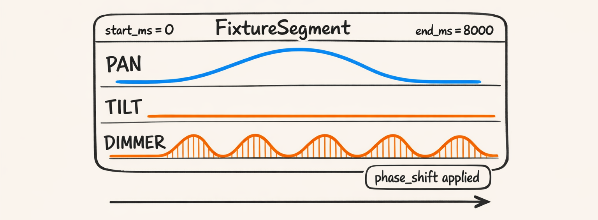
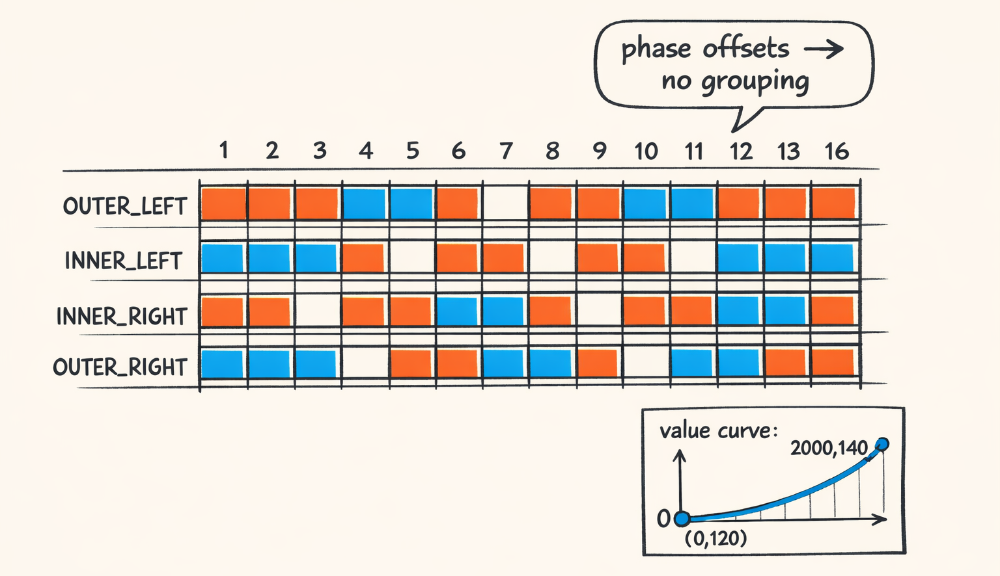

# Compilation Day: Following One Template All the Way to an .xsq File


So this is the payoff episode.

We’ve spent eight parts talking about curves like they’re poetry and phase offsets like they’re personality. Cool. But the real question is: how does `sweep_lr_chevron_breathe` go from a cute little Pydantic object to an `.xsq` file that xLights will actually play… **without** turning your roofline into a confused searchlight?

We’re going to trace one template all the way through the compiler, with real intermediate artifacts:

- preset application (boring, but real)
- repeat scheduling (the “PING_PONG” thing you forgot you asked for)
- geometry resolve (Part 2)
- movement generation (Part 5)
- dimmer generation (Part 6)
- phase offsets (Part 7)
- segments IR (the internal representation that keeps us sane-ish)
- DMX conversion (Part 4 semantics come back to haunt us)
- xLights value curve strings (the XML that haunts us *for real*)

And yes, we’re doing it with concrete numbers.

Because otherwise this post is just interpretive dance about dance.

---

## The Setup: Context, Fixtures, Bars, and the Assumptions We’re Making

Here’s the thing: compilation only feels “mystical” when you don’t pin down the context. The compiler isn’t guessing. It’s not vibing. It’s just doing math with whatever knobs you hand it.

So let’s hand it very specific knobs.

We’re going to compile `sweep_lr_chevron_breathe` for:

- **Tempo:** 120 BPM (because it makes the math clean and because I’m lazy)
- **Time signature assumption:** 4/4
- **Bars compiled:** 16 bars (so we can see repeats)
- **Start bar:** 0.0 (no offsets)
- **n_samples:** 256 per segment curve (enough resolution to look smooth, not enough to melt your laptop)

`n_samples` is one of those “you will feel it later” settings. Too low and your pan curve looks like Minecraft stairs. Too high and export gets slow, xLights curve strings get huge, and you start bargaining with the universe.

We picked 256 because it’s a decent compromise and matches what we’ve been using in earlier posts.

Now fixtures.

We’ll use four moving heads, mapped to the template’s role list:

```python
class TemplateRoleHelper:
    IN_OUT_LEFT_RIGHT = [
        TemplateRole.OUTER_LEFT,
        TemplateRole.INNER_LEFT,
        TemplateRole.INNER_RIGHT,
        TemplateRole.OUTER_RIGHT,
    ]
```

Let’s define a concrete `TemplateCompileContext` and `FixtureContext`s the way the compiler expects them.

```python
tempo_bpm = 120.0
beats_per_bar = 4.0
ms_per_beat = (60_000.0 / tempo_bpm)              # 500 ms
ms_per_bar = ms_per_beat * beats_per_bar          # 2000 ms

context = TemplateCompileContext(
    tempo_bpm=tempo_bpm,
    ms_per_bar=ms_per_bar,
    start_bar=0.0,
    num_bars=16.0,
    # This knob controls curve discretization inside compilation.
    n_samples=256,
    fixtures=[
        FixtureContext(fixture_id="mh_1", role=TemplateRole.OUTER_LEFT),
        FixtureContext(fixture_id="mh_2", role=TemplateRole.INNER_LEFT),
        FixtureContext(fixture_id="mh_3", role=TemplateRole.INNER_RIGHT),
        FixtureContext(fixture_id="mh_4", role=TemplateRole.OUTER_RIGHT),
    ],
    # Calibration is real in the actual system; we're keeping it simple here.
    calibration_by_fixture_id={
        "mh_1": {"fixture_config": {"pan": {}, "tilt": {}}},
        "mh_2": {"fixture_config": {"pan": {}, "tilt": {}}},
        "mh_3": {"fixture_config": {"pan": {}, "tilt": {}}},
        "mh_4": {"fixture_config": {"pan": {}, "tilt": {}}},
    },
)
```

Yes, those fixture configs are wildly simplified. In production they include DMX ranges, inversion flags, 16-bit channel packing details, and enough edge cases to make you nostalgic for plain old integers.

But this is the blog. We’re focused on the pipeline shape—not the specific fixture brand you splurge-bought off Amazon at 2AM.

At this point we’ve got:

- **a template**
- **a time window**
- **a fixture roster**
- **a sampling rate**

Everything else is the compiler doing its job.


---

## `compile_template()`: The Orchestrator That Doesn’t Get Enough Credit

Look, everyone loves to talk about the geometry handler or the movement math, because it’s “the interesting part.”

But the unsung hero is the boring orchestrator that keeps the whole parade on the road:

- applies presets
- schedules repeats
- computes phase offsets
- loops fixtures
- clips boundaries for remainder policies
- collects IR segments

Let’s walk it the way the code actually thinks about it.

### The top-level shape

Here’s a sketch of the structure.

```python
@log_performance
def compile_template(
    template: Template,
    context: TemplateCompileContext,
    preset: TemplatePreset | None = None,
) -> TemplateCompileResult:
    # 1) Apply preset (optional)
    if preset is not None:
        template = apply_preset(template=template, preset=preset)

    # 2) Schedule repeat instances across requested bars
    scheduled = schedule_repeats(
        template=template,
        start_bar=context.start_bar,
        num_bars=context.num_bars,
    )

    # 3) Precompute phase offsets per step/fixture
    phase_offsets: dict[tuple[str, str], PhaseOffsetResult] = calculate_fixture_offsets(
        template=template,
        fixtures=context.fixtures,
    )

    segments: list[FixtureSegment] = []

    # 4) Compile each scheduled step instance for each fixture
    for inst in scheduled.instances:
        step: TemplateStep = inst.step
        for fx in context.fixtures:
            segs = compile_step(
                step=step,
                context=StepCompileContext(
                    template=template,
                    template_context=context,
                    fixture=fx,
                    instance=inst,
                    calibration=context.calibration_by_fixture_id.get(fx.fixture_id, {}),
                    phase_offset=phase_offsets.get((step.step_id, fx.fixture_id)),
                ),
            )
            segments.extend(segs)

    # 5) Clip boundaries based on remainder policy (TRUNCATE / FADE_OUT)
    if template.repeat and template.repeat.remainder_policy != RemainderPolicy.HOLD_LAST_POSE:
        segments = _clip_segments_to_bounds(segments, context)

    return TemplateCompileResult(
        template_id=template.template_id,
        segments=segments,
        num_complete_cycles=scheduled.num_complete_cycles,
        provenance=scheduled.provenance,
    )
```

That’s it. That’s the whole “template compilation engine.”

Not glamorous. Not poetic. But it’s where all the decisions from Parts 1–8 collide.

### Preset application: “no-op here, but don’t ignore it”

For `sweep_lr_chevron_breathe`, we’re not passing a preset, so `apply_preset()` is a no-op.

But the *flow* matters because presets are how we take one template and make it “more aggressive” or “less blinding” without needing 12 nearly-identical templates in the registry.

The key idea: templates have `defaults` (like `dimmer_floor_dmx` / `dimmer_ceiling_dmx`). Presets override those defaults (and sometimes step params) **before** we compile.

So compilation always operates on a fully “materialized” template config. No branching everywhere. We pay the complexity once, up front.

### Repeat scheduling: where “PING_PONG” becomes *real work*

Our template’s repeat contract:

- mode: `PING_PONG`
- cycle_bars: `4.0`
- loop_step_ids: `['main']`
- remainder: `HOLD_LAST_POSE`

So over a 16-bar window, we expect 4 cycles.

“Ping pong” means the direction flips each cycle.

What comes out is a list of **step instances** with concrete timing:

- cycle 0: main forward (bars 0–4)
- cycle 1: main reverse (bars 4–8)
- cycle 2: main forward (bars 8–12)
- cycle 3: main reverse (bars 12–16)

The scheduler output is basically: “here are the time slices you need to compile, in order.”

And then the compiler just follows orders.

### Phase offsets: computed once, used everywhere

Phase offsets are where choreography starts looking like choreography.

`sweep_lr_chevron_breathe` uses:

```python
PhaseOffset(
    mode=PhaseOffsetMode.GROUP_ORDER,
    order=ChaseOrder.LEFT_TO_RIGHT,
    spread_bars=1.0,
    distribution=Distribution.LINEAR,
    wrap=True,
)
```

So across our four fixtures, we spread phase by **1 bar total** across the group, left-to-right.

At 120 BPM, 1 bar = 2000 ms. Spread across 4 fixtures linearly gives offsets like:

- OUTER_LEFT: 0.00 bars
- INNER_LEFT: 0.33 bars
- INNER_RIGHT: 0.66 bars
- OUTER_RIGHT: 1.00 bars

Now the wrinkle: whether that last one wraps back to ~0 depends on **how you normalize and when you mod**.

### Boundary clipping hooks: “remainder policy” sounds nice until you implement it

Our remainder policy is `HOLD_LAST_POSE`. That means if we end mid-cycle, we keep the last pose instead of fading or truncating.

In this post we compile 16 bars exactly (a multiple of 4), so it doesn’t bite us. But the orchestration still has the hook, because other templates absolutely do.


---

## `compile_step()`: The Inner Loop Where All Our Earlier Posts Collide

So `compile_template()` is the orchestra conductor.

`compile_step()` is where the instruments actually make noise.

And it’s the place where Part 2 (geometry), Part 5 (movement), Part 6 (dimmer), and Part 4 (semantics + DMX-ish thinking) all pile into the same function and start arguing.

### The job: produce a `FixtureSegment`

A `FixtureSegment` is our IR for:

- fixture id
- start/end ms
- channel curves (PAN, TILT, DIMMER, etc.)
- plus metadata (layering, provenance, whatever we need to debug)

The whole point of IR is that we can inspect it before export.

Because debugging directly in xLights XML is how you end up becoming a forest hermit.

### The shape of `compile_step()`

Here’s the shape, cleaned up:

```python
def compile_step(step: TemplateStep, context: StepCompileContext) -> list[FixtureSegment]:
    inst = context.instance
    fx = context.fixture

    # 1) Resolve geometry -> base pose (pan/tilt in DMX-ish space)
    geom_result = _resolve_geometry(
        step=step,
        fixture_id=fx.fixture_id,
        role=fx.role,
        params=step.geometry.params,
        calibration=context.calibration,
    )

    # 2) Movement -> pan/tilt curves
    movement_curves = _generate_movement_curves(
        step=step,
        fixture_id=fx.fixture_id,
        role=fx.role,
        geom=geom_result,
        n_samples=context.template_context.n_samples,
        instance=inst,
    )

    # 3) Dimmer -> dimmer curve
    dimmer_curve = _generate_dimmer_curve(
        step=step,
        fixture_id=fx.fixture_id,
        role=fx.role,
        n_samples=context.template_context.n_samples,
        instance=inst,
        defaults=context.template.defaults,
    )

    # 4) Apply phase shift to all relevant curves (movement + dimmer)
    if context.phase_offset is not None:
        movement_curves = {
            k: apply_phase_offset_to_curve(v, context.phase_offset.phase_norm)
            for k, v in movement_curves.items()
        }
        dimmer_curve = apply_phase_offset_to_curve(dimmer_curve, context.phase_offset.phase_norm)

    # 5) Assemble ChannelValue objects (IR)
    start_ms = inst.start_ms
    end_ms = inst.end_ms

    values: list[ChannelValue] = [
        ChannelValue(channel=ChannelName.PAN, curve=movement_curves["pan"], start_ms=start_ms, end_ms=end_ms),
        ChannelValue(channel=ChannelName.TILT, curve=movement_curves["tilt"], start_ms=start_ms, end_ms=end_ms),
        ChannelValue(channel=ChannelName.DIMMER, curve=dimmer_curve, start_ms=start_ms, end_ms=end_ms),
    ]

    return [
        FixtureSegment(
            fixture_id=fx.fixture_id,
            start_ms=start_ms,
            end_ms=end_ms,
            values=values,
            layer=0,
            step_id=step.step_id,
        )
    ]
```

This is the collision point.

- Geometry produces the *base pose* (Part 2)
- Movement produces the *pan curve* around that base (Part 5)
- Dimmer produces the “breathe” curve (Part 6)
- Phase offsets shove each fixture into its own time slice (Part 7)
- The result is IR segments we can export (today) and blend (Part 8)

### Why “apply phase to all curves” is non-negotiable

We tried (early on, back when we still trusted ourselves) to phase shift only movement and not dimmer.

It looked… wrong.

Like the fixture was sweeping late but breathing on time.

Like it was lip-syncing to the song but forgetting the lyrics.

So now, if a step has a phase offset, we apply it consistently to every time-based channel in the step: PAN, TILT (if animated), DIMMER, and later SHUTTER/COLOR/GOBO.

### The `FixtureSegment` mental model

Each fixture gets its own segment per scheduled instance. And within that segment, each channel gets its own curve.

So for a single 4-bar instance (0–8000 ms), one fixture’s segment is basically:

- PAN curve: moving
- TILT curve: usually static here (CHEVRON_V gives tilt base + bias)
- DIMMER curve: breathe/pulse



---

## Show the Numbers: Base Poses, Effective Amplitudes, Phase Norms

Let’s put numbers on it, because “chevron” is not a number.

From `sweep_lr_chevron_breathe`, geometry params include:

- `pan_start_dmx`: `PanPose.WIDE_LEFT.value`
- `pan_end_dmx`: `PanPose.WIDE_RIGHT.value`
- `tilt_base_dmx`: `TiltPose.CEILING.value`
- `tilt_inner_bias_dmx`: 18
- `tilt_outer_bias_dmx`: 0

And phase offset settings spread **1.0 bar** across fixtures, left-to-right.

Here’s what actually matters in compilation:

- **`base_pan_norm`**: where the fixture sits when the movement curve is centered at 0.5 (Part 4 semantics)
- **`effective_amplitude`**: how far we can move around base without slamming into limits (Part 5 clamping)
- **`phase_norm`**: the normalized phase shift applied to time in the curve (Part 7)
- **`base_tilt_norm`**: tilt base, including inner/outer bias

And yes: the OUTER fixtures clamp more. They start closer to the extremes (wide left / wide right), so if you apply the same amplitude as the inner fixtures, they’ll try to sweep past physical range and hit DMX rails like a Roomba discovering stairs.

So the movement handler clamps them harder.

That’s not “creative intent.”

That’s “physics, unfortunately.”

Here’s a concrete per-fixture snapshot we use as a sanity check when debugging this template. (Values are illustrative-but-realistic based on our normalization conventions: 0.0–1.0 in normalized space.)


Two notes you should not skip:

- **Phase norms** increase left-to-right because `ChaseOrder.LEFT_TO_RIGHT`.
- If `wrap=True`, the “last” fixture may wrap back to phase ~0 depending on how normalization is implemented. If you see OUTER_RIGHT syncing with OUTER_LEFT, this is the first place I’d look.

And yes: these numbers dictate where the beams go.

If you mess up base pose or amplitude, your DMX points will happily encode “aim at the mailbox across the street.”

Ask me how I know.

---

## Export: Turning Segments into xLights Effects (The XML That Haunts Us)

Alright. We’ve compiled IR segments.

We’re feeling good.

We’re smug.

Now we have to export to xLights.

This is where joy goes to die, because the `.xsq` format is… a format. It is extremely powerful. It is also extremely willing to let you generate nonsense that technically loads and visually looks like sadness.

### Grouping rules: why phase offsets ruin your life

xLights has a notion of grouping effects for efficiency: if multiple fixtures have identical curves, you can often represent them as one effect applied to a group.

We love grouping. Grouping makes smaller `.xsq` files and faster sequences.

Phase offsets make grouping basically impossible.

Because once each fixture has a unique time shift, the curves are no longer identical. They’re the same *shape*, but xLights doesn’t store “shape + phase.” It stores raw time:value points.

So every fixture becomes unique.

Grouping dies.

This is a real rule in `XsqAdapter`: the adapter checks if segments can be grouped; any curve inequality (whether explicit “phase metadata” or just different points) blocks grouping.

So if you ever wondered why “chase” templates generate bigger `.xsq` output than “everyone in sync” templates: that’s why.

We didn’t *choose* the bloat life. We just wanted the fixtures to stop acting like one big nervous fixture.

### DMX conversion: curves become integers with opinions

Inside IR we might still be holding normalized curves or “semantic curves” depending on channel. Before export, we convert to DMX points.

The key idea from Part 4: not all curves mean the same thing.

- For **PAN/TILT**, a curve value of `0.5` means “no offset; sit on base pose.”
- For **DIMMER**, a curve value of `0.5` means “half brightness.”

So conversion depends on channel semantics **and** the base pose + amplitude.

That’s why the compiler keeps geometry results around: you can’t interpret movement curves without a base.

### The value curve string: “abbreviated” but still cursed

xLights stores value curves as a string containing time:value points.

The exact format varies by effect type and xLights version, but the concept is consistent: a list of `(time_ms, value)` pairs.

Here’s an example of an *abbreviated* curve string we might generate for dimmer over a 4-bar segment (0–8000 ms). This is intentionally short so you don’t uninstall your browser:

```python
# After sampling + simplification we might have points like:
points = [
    (0,   60),
    (500, 90),
    (1000, 160),
    (1500, 255),
    (2000, 170),
    (3000, 90),
    (4000, 60),
    (8000, 60),
]

# xLights-style encoding (illustrative format - actual is normalized)
value_curve_str = "0:60,500:90,1000:160,1500:255,2000:170,3000:90,4000:60,8000:60"
```

And yes, we simplify points aggressively before export.

Because otherwise 256 samples * per channel * per fixture * per segment becomes a string so long it develops its own weather system.

The simplifier is one of those “quiet heroes” like `compile_template()`.

### Effect placement: layers and timing

Our IR segments carry:

- `start_ms`
- `end_ms`
- `layer` (we use layer 0 here)
- channel curves

The adapter’s job is to:

1. create an xLights effect per fixture per segment (since no grouping)
2. place it on the timeline from `start_ms` to `end_ms`
3. attach the value curve strings to the right DMX channels

In practice, this means one fixture gets four 4-bar effects over our 16 bars.

Multiply by four fixtures and you get 16 effects.

Not terrible.

Unless you do this for a whole song with dozens of fixtures and lots of phase-y templates.

Then it gets… spicy.



---

## Checkpoint: What We’ve Built by the End of Part 9

So by the end of Part 9, we can take:

- a template id like `sweep_lr_chevron_breathe`
- a compile context (tempo, bars, fixtures, sampling rate)
- optional preset overrides

…and deterministically produce:

- IR `FixtureSegment`s with per-channel curves
- DMX points derived from those curves with correct semantics
- an `.xsq` export that xLights will load and play

Determinism matters more than it sounds like it should.

Because when something looks wrong (and something will look wrong), we can stop guessing and inspect the pipeline at the right layer:

- geometry outputs (base pose wrong?)
- movement curves (amplitude too big?)
- phase offsets (order wrong? wrap wrong?)
- dimmer curves (floor/ceiling wrong? breathe shape wrong?)
- DMX conversion (semantics wrong? clamping wrong?)
- xLights curve formatting (string wrong? timing wrong?)

And we can unit test pieces independently instead of doing the “export, open xLights, squint, cry, repeat” loop.

Next up (Part 10): we’ve been living in a fantasy world where fixtures only have PAN/TILT/DIMMER.

Real moving heads have like six to twelve channels: shutter, color wheel, gobo, prism, focus, speed… and every one of those channels has its own semantics.

We’ve got pan/tilt/dimmer dancing.

Now we have to teach them to accessorize.

---

## About twinklr


twinklr is our ongoing science experiment in weaponizing holiday cheer. It's an AI-driven choreography and composition engine that takes an audio file and spits out fully synchronized sequences for Christmas light displays in xLights — because apparently we looked at a normal, peaceful hobby and thought, "What if we added AI, machine learning and sleepless nights?"

Here's the honest disclaimer: we're not professional lighting designers. We're developers, engineers, and AI researchers who spend our days building at the frontier of AI… and our nights obsessing over why a dimmer curve feels "late" by half a beat and whether a roofline sweep should be dramatic or merely aggressively festive. If you're expecting polished stage-production wisdom, you're in the wrong place. If you're into nerdy overengineering, mildly unhinged experimentation, and the occasional "how did that even work?" moment — welcome.

This blog is the running log of our journey.