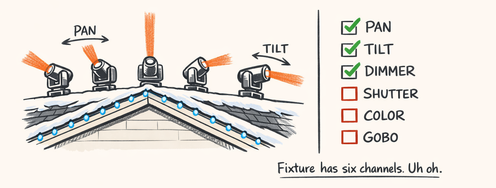
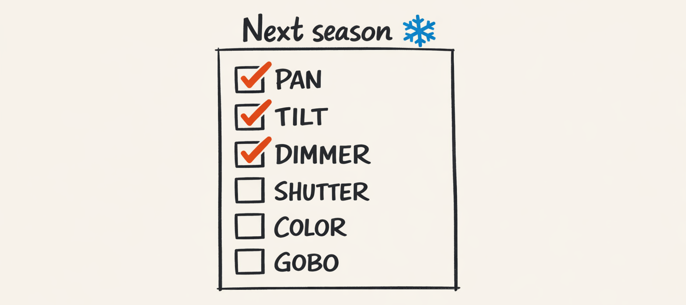
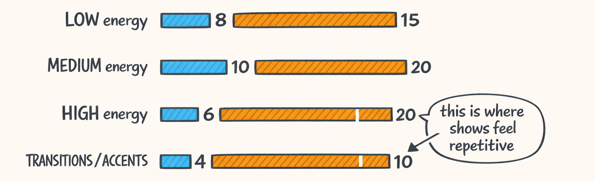
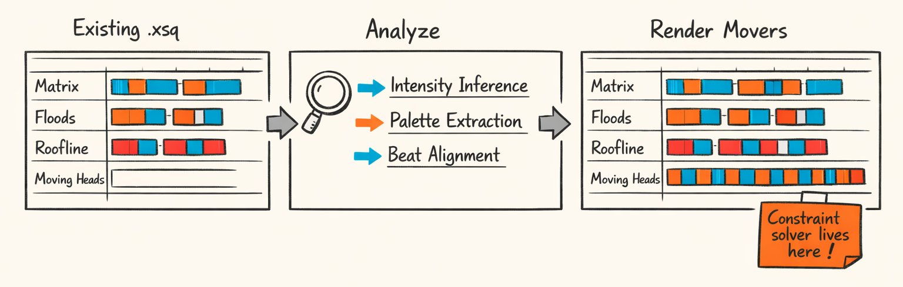

# We’ve Got Pan/Tilt/Dimmer. The Fixture Has Twelve Channels. Uh Oh.



## The Victory Lap (But Like… a Small One)

So. We did the thing.

We can take a template like `sweep_lr_chevron_breathe`, compile it into deterministic per-fixture segments, convert those into DMX values, and spit out xLights curve strings that actually move real hardware.

Most nights, it looks intentional.

Some nights, it looks like four little robots trying to interpret jazz.

Here’s the current pipeline, end-to-end, with the same running example we’ve been beating to death since Part 1:

- **Template**: `packages/twinklr/core/sequencer/moving_heads/templates/builtins/sweep_lr_chevron_breathe.py`
- **Compiler**: `compile_template()` orchestrates timing, repeats, phase offsets, and per-step compilation
- **Handlers**:
  - Geometry: “put the beams in a chevron V”
  - Movement: “sweep left-to-right with some easing”
  - Dimmer: “breathe/pulse so it feels alive”
- **IR Segments**: `FixtureSegment` objects per fixture per channel
- **DMX**: 0–255 values
- **xLights**: value curves and effect timing

The big wins still hold:

- **Normalization wasn’t optional.** (Part 4.) Everything got easier once curves lived in normalized time/value space and only turned into DMX at the last responsible moment.
- **Static + dynamic separation** is still the cleanest abstraction we’ve got. (Part 5.) Geometry gives you the base pose; movement curves add motion around it.
- **Phase offsets** remain absurdly high ROI. (Part 7.) Four fixtures doing the same thing is “nice.” Four fixtures chasing each other is “oh wow.”

And yes, it’s deterministic and testable, which is the nerdiest kind of satisfying. You can compile the same template twice and get the same segments. No “the model felt whimsical today” nonsense.

Here’s the orchestration entry point we’ve been riding:

```python
@log_performance
def compile_template(
    template: Template,
    context: TemplateCompileContext,
    preset: TemplatePreset | None = None,
) -> TemplateCompileResult:
    # 1) Apply preset (optional)
    if preset:
        template = apply_preset(template, preset)

    # 2) Schedule repeats across the target timeline
    scheduled = schedule_repeats(template, context)

    # 3) Calculate per-fixture phase offsets (the "chase sauce")
    offsets: PhaseOffsetResult = calculate_fixture_offsets(
        template=template,
        context=context,
        scheduled=scheduled,
    )

    # 4) Compile steps into per-channel IR segments
    segments: list[FixtureSegment] = []
    for step in template.steps:
        segments.extend(
            compile_step(
                step=step,
                step_context=StepCompileContext(
                    template=template,
                    context=context,
                    scheduled=scheduled,
                    phase_offsets=offsets,
                ),
            )
        )

    # 5) Clip segments based on remainder policy (HOLD_LAST_POSE / TRUNCATE / FADE_OUT)
    # (implementation omitted here, but yes, this is where "it looks broken" gets fixed)

    return TemplateCompileResult(
        template_id=template.template_id,
        segments=segments,
        num_complete_cycles=scheduled.num_complete_cycles,
        provenance=scheduled.provenance,
    )
```

Is it perfect? Nope.

- We still have edge cases around boundary transitions (Part 8) where pan/tilt look *almost* intentional… but not quite.
- We’ve got a couple templates in `templates/builtins/` that I’d describe as “legally choreography” but morally… questionable.

But overall? It’s solid.

And then we looked at the fixture manual again.

It has twelve channels.

We’re driving three.



## The Missing Channels: Why Shutter Is Next (And Why It’s Not Just Another Curve)

Look, adding “one more channel” sounds easy until you remember DMX is secretly a personality test.

Pan and tilt are continuous. Dimmer is continuous-ish.

Shutter is… a tiny little state machine disguised as a slider.

Most moving heads expose shutter like:

- **0–something**: closed (blackout)
- **some range**: open
- **some range**: strobe slow → strobe fast
- **bonus chaos**: random strobe, pulse strobe, whatever the manufacturer felt like shipping that week

And unlike dimmer, shutter isn’t just “brightness but different.” It changes *perceived energy* in a way that cheats the brain.

- A static beam at full dimmer: “cool.”
- That same beam with a tight strobe: “THE DROP IS HERE, EVERYONE PANIC.”

Also: shutter is mostly **discrete**. You don’t want to “morph” through the strobe ranges unless your goal is to make it look like a cheap haunted house.

So shutter immediately drags us back to Part 8: **transition strategy matters**, and discrete channels want `SNAP`.

### What needs to change in the models (probably)

Right now `TemplateStep` knows about:

- `geometry`
- `movement`
- `dimmer`

We need to add shutter in the same spirit: declarative, template-authored, handler-resolved.

That means:

- A `Shutter` field on the step model
- A `ShutterType` enum (like we did for `DimmerType`)
- A shutter library and handler(s) that map “intent” → DMX values/ranges
- Default behavior that won’t brick every existing template

Here’s the general shape we already use for dimmer:

```python
class Dimmer(BaseModel):
    model_config = ConfigDict(extra="forbid")
    dimmer_type: DimmerType
    params: dict[str, Any] = Field(default_factory=dict)
```

Shutter will look… suspiciously similar. Which is good. Consistency is the only reason we can debug this stuff at 2am.

```python
class ShutterType(str, Enum):
    OPEN = "OPEN"          # force open
    CLOSED = "CLOSED"      # force closed
    STROBE = "STROBE"      # strobe at rate based on intensity/params
    ACCENT = "ACCENT"      # musical accent pattern (on beats, off otherwise)
```

Then `TemplateStep` grows a new optional field:

```python
class TemplateStep(BaseModel):
    model_config = ConfigDict(extra="forbid")

    step_id: str
    timing: StepTiming

    geometry: Geometry | None = None
    movement: Movement | None = None
    dimmer: Dimmer | None = None

    shutter: Shutter | None = None   # new
```

### The annoying part: migration defaults

We’ve got a registry of builtins in. Those templates currently compile without even thinking about shutter. If we add shutter naively and the default becomes “closed,” we’ve basically invented the world’s most synchronized blackout generator.

So the default must be safe:

- If shutter is unspecified, **leave it open**.
- Or: treat it as “don’t touch this channel” if the engine supports partial channel ownership.

Also: transition mode should default to `SNAP` for shutter segments, because blending shutter is… not a vibe.

And we’ll need tests that prove “existing templates still render light” because I do not want to debug a Christmas show that’s silently dark.

Here’s the conceptual per-channel transition rule we already believe in (and will reuse):

> Continuous channels (pan/tilt/dimmer) can `MORPH` or `CROSSFADE`.
> Discrete channels (shutter/color/gobo) should almost always `SNAP`.


## Template Library Expansion: We Need More Moves (And Fewer Crimes Against Taste)

So here’s a confession.

The template engine works. The compiler works. The xLights export works.

And our template library is still… kind of tiny.

Right now, the builtins directory is basically the choreography equivalent of owning a Ferrari and only driving to Target.

A full show needs breadth. Not “one good move.” More like:

- low-energy ambience that can run for 16 bars without feeling repetitive
- mid-energy grooves that don’t scream over the verse
- high-energy chorus stuff that actually *pops*
- accents, transitions, joiners, punctuation
- “reset” templates that re-home fixtures cleanly without looking like robots having a meeting

If I had to put a number on it: a real show probably wants **50+ templates** that you can mix and match without the audience noticing you’re reusing building blocks.

And the gaps hurt in very specific places:

- **High-energy chorus**: we need more options than “sweep harder”
- **Accents**: quick hits that land on musical events without derailing the base motion
- **Transitions**: “get from A to B” without the fixtures visibly teleporting
- **Low-energy ambience**: the hardest stuff, because boring is obvious

Also: remember Part 0’s principle? Templates are authored, not generated.

The LLM can pick from a curated library. It can sequence. It can adapt intensity.

But letting it invent new physics on the fly is how you get “pan oscillates at 37Hz” and suddenly your roofline is a mechanical keyboard.

The authoring strategy we keep coming back to:

- build a small set of **primitives** (sweeps, circles, bounces, holds, breathes)
- then ship curated combinations that don’t violate taste, safety, or basic human decency

Yes, that’s boring.

Also yes, that’s what makes the system reliable.



## Color & Gobo: Discrete Meets Continuous (So, Extra Annoying)

Here’s the thing about color.

Some fixtures have RGB or CMY mixing (continuous). Some have a color wheel (discrete). Some have both because manufacturers enjoy watching software engineers age in real time.

And gobos are even weirder:

- **Gobo selection**: discrete (pick pattern 1–8)
- **Gobo rotation**: continuous (spin speed/direction), sometimes on a totally different channel

So the channel model can’t just be “a curve that goes 0–255.”

It needs to represent intent like:

- “snap to red on the downbeat”
- “hold gobo dots for 2 bars”
- “rotate clockwise faster over time”
- “fade dimmer while color snaps behind blackout” (classic trick)

The good news: our internal IR already leans in this direction with `ChannelValue` and per-segment transition modes. We just haven’t had to prove it across mixed discrete/continuous behaviors yet.

If you squint at our current segment representation (from the compiler layer), the expansion path is basically:

- keep the IR generic (`FixtureSegment` per channel)
- teach the renderer/exporter how to serialize each channel correctly
- define per-channel default transitions (`SNAP` for discrete channels)

Here’s the kind of “channel value” shape we’ve been using for pan/tilt/dimmer:

```python
class ChannelValue(BaseModel):
    channel: ChannelName
    curve: PointsCurve          # normalized time/value curve, later mapped to DMX
    transition: TransitionMode  # SNAP / MORPH / CROSSFADE / etc.
    blend_mode: str = "override"
```

For a **color wheel**, we probably don’t want a smooth curve at all. We want *events* that map to fixed DMX ranges.

So we’ll likely introduce a discrete “program” representation (or still use curves, but with step functions and forced `SNAP` transitions). Either can work, but only one will keep us from accidentally “morphing through green” on the way to blue.

For **gobo rotation**, we’ll do both:

- a discrete gobo selection segment
- a continuous rotation speed segment

Same step. Two channels. Two transition strategies. One headache.

And yes, this is where the “per-channel transition planning” we built in Part 8 stops being a nice-to-have and becomes the only reason the output doesn’t look drunk.

## The ‘Choreography to Existing xLights Sequence’ Idea (AKA Future Us Will Suffer)

So, we had this thought. And by “we,” I mean “someone said it in Slack and nobody shut it down fast enough.”

What if Twinklr could take an existing xLights sequence (`.xsq`)—like one someone already spent 80 hours perfecting for their roofline/matrix/floods—and generate **complementary moving-head choreography** on top?

Not replace. Not rewrite. Just… add movers like they were always meant to be there.

This is an objectively good idea.

It is also a heinous amount of work.

Because right now our pipeline assumes we’re composing into an empty lane. We own the timeline. We decide energy. We pick templates. We transition cleanly.

But an existing `.xsq` is like walking into a crowded kitchen mid-dinner service and announcing you’d like to “just sauté something real quick.”

### What we’d need

1. **XSQ import**
   - Parse `.xsq` (compressed XML-ish fun) and extract:
     - timing tracks
     - model tracks (roofline, matrix, floods, etc.)
     - effect placements and parameters

2. **Effect intensity inference**
   - “This section is busy” vs “this section is calm”
   - You can’t just use audio energy, because the existing sequence might already be doing a lot (or intentionally doing nothing)

3. **Palette extraction**
   - What colors are dominant in this part?
   - Are we in “red/green candy cane” world or “icy blue/white” world?
   - Movers should complement, not fight

4. **Constraint solver for clashes**
   - Don’t strobe movers if the rest of the yard is doing a slow fade (unless it’s intentional)
   - Don’t aim into the neighbor’s windows (still true)
   - Don’t overpower key props (mega tree is the lead singer)

5. **Render movers**
   - Generate mover segments *within* the existing timing grid
   - Align transitions to the existing effect cadence

The core difficulty is this:

> You’re composing into a crowded timeline, not an empty one.

You don’t get to be the main character. You’re the bassist. You have to groove with what’s already there.

Why it’s worth it anyway:

- People already have sequences they love.
- They want to add movers without learning a whole new authoring workflow.
- “Drop in movers” is the difference between Twinklr being a fun experiment and being something folks actually use in December when they’re already sleep-deprived.

And yes, future us will suffer.

But present us is planting the flag.



## What We Learned (The Transferable Bits)

So here’s what I’d steal from this project if I was building anything vaguely similar.

Static geometry + dynamic movement is a clean abstraction.  
It keeps templates readable, handlers testable, and bugs localized. When pan is wrong, you know whether geometry or movement did it.

Normalized coordinates are worth the hassle.  
Yes, it feels like extra math. But it’s the reason we can swap fixtures, clamp safely, and apply phase offsets without everything collapsing.

Phase offsets are absurdly high ROI.  
One line of config turns “four identical fixtures” into “actual choreography.” It’s the cheapest magic trick we’ve found.

Categorical intensity is the bridge between planner intent and math.  
The planner can say “HIGH energy” without inventing numbers. The compiler can map that to concrete curve amplitude, speed, strobe rate… whatever.

Templates should be authored; the LLM should select, not invent physics.  
The model is great at picking “do a chevron sweep with breathe here.”  
It is not great at inventing DMX ranges or remembering that your roof is not a truss and your moving head is not a stage rig.

Next up: shutter. Then color and gobo. Then… importing `.xsq` and voluntarily making our lives worse.

Honestly? That’s kind of the fun part.

---

## About twinklr


twinklr is our ongoing science experiment in weaponizing holiday cheer. It's an AI-driven choreography and composition engine that takes an audio file and spits out fully synchronized sequences for Christmas light displays in xLights — because apparently we looked at a normal, peaceful hobby and thought, "What if we added AI, machine learning and sleepless nights?"

Here's the honest disclaimer: we're not professional lighting designers. We're developers, engineers, and AI researchers who spend our days building at the frontier of AI… and our nights obsessing over why a dimmer curve feels "late" by half a beat and whether a roofline sweep should be dramatic or merely aggressively festive. If you're expecting polished stage-production wisdom, you're in the wrong place. If you're into nerdy overengineering, mildly unhinged experimentation, and the occasional "how did that even work?" moment — welcome.

This blog is the running log of our journey.