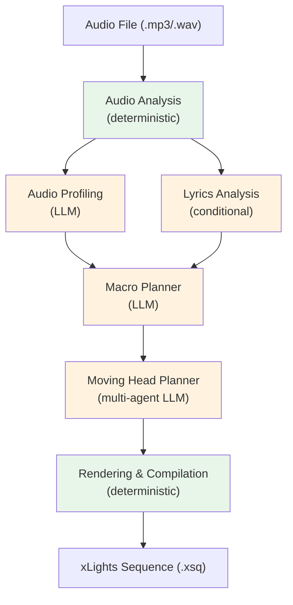

# Overview

Twinklr is an AI-powered choreography engine that transforms music into coordinated Christmas light shows. It analyzes audio, plans choreography using multi-agent LLM orchestration, and renders the result as native [xLights](https://xlights.org) sequence files (`.xsq`).

The core design principle: **LLMs plan creative intent; deterministic code handles precision.** The AI decides _what_ should happen ("fan formation with building intensity during the chorus"), and the rendering engine handles _how_ ("pan fixture 3 to 127.5 degrees over 2,400 milliseconds with a sine-eased curve").

---

## Goals

- Reduce the time to create moving head choreography from dozens of hours of manual xLights programming to minutes of automated generation.
- Produce musically-coherent, beat-aligned sequences that respond to the structure and energy of each song.
- Output native xLights `.xsq` files that can be imported and refined in the standard xLights editor.

## Current Scope

Twinklr currently supports:

- **Moving head fixtures** — pan, tilt, dimmer, shutter, color, and gobo channels via the sequencer pipeline (`packages/twinklr/core/sequencer/moving_heads/`).
- **Display sequencer** — RGB/pixel effects for outline, tree, and other display elements (`packages/twinklr/core/sequencer/display/`).
- **Feature engineering pipeline** — audio profiling, feature extraction, and feature store for offline analysis (`packages/twinklr/core/feature_engineering/`, `packages/twinklr/core/feature_store/`).

The primary CLI workflow (`twinklr run`) executes the moving heads sequencer pipeline end-to-end.

---

## High-Level Architecture

Green stages are fully deterministic (signal processing, curve math, file format compliance). Orange stages use LLMs for musical interpretation and choreography planning. The LLM never touches DMX values directly.

---

## Major Subsystems

### Pipeline Framework

_Source: `packages/twinklr/core/pipeline/`_

A declarative DAG-based pipeline framework that defines stages, their dependencies, and execution patterns. Key exports:

| Component | Role |
|---|---|
| `PipelineDefinition` | Declares stages, dependencies, and fail-fast policy |
| `StageDefinition` | Single stage with inputs, execution pattern, and type annotations |
| `PipelineExecutor` | Resolves the DAG and orchestrates execution |
| `PipelineContext` | Shared state, metrics, and session reference across stages |
| `ExecutionPattern` | `SEQUENTIAL`, `PARALLEL`, `FAN_OUT`, `CONDITIONAL` |

Pipeline definitions are composed via factory functions in `packages/twinklr/core/pipeline/definitions/`. Two main pipelines exist:

- **Moving heads pipeline** (`build_moving_heads_pipeline()` in `moving_heads.py`) — common stages + moving head planner + render. Used by the CLI.
- **Display pipeline** (`build_display_pipeline()` in `display.py`) — common stages + group planner (FAN_OUT per section) + aggregate + holistic evaluation + asset resolution + display render. Used by the display sequencer for RGB/pixel elements.

Both pipelines share common prefix stages from `common.py` (audio, profile, lyrics, macro).

### Audio Analysis

_Source: `packages/twinklr/core/audio/`_

Deterministic audio feature extraction powered by [librosa](https://librosa.org/):

- **Rhythm** — tempo detection, beat grid, downbeats (`audio/rhythm/`)
- **Energy** — RMS envelope, energy dynamics, builds and drops (`audio/energy/`)
- **Structure** — section boundary detection, segment labeling (`audio/structure/`)
- **Harmonic** — key detection, chord analysis, chroma features (`audio/harmonic/`)
- **Phonemes** — grapheme-to-phoneme conversion, viseme mapping (`audio/phonemes/`)

Audio enhancement features (metadata enrichment, lyrics from LRCLib/Genius/WhisperX, speaker diarization) are controlled by `AudioEnhancementConfig` in `packages/twinklr/core/config/models.py`.

### Multi-Agent Orchestration

_Source: `packages/twinklr/core/agents/`_

Data-driven agent system using `AgentSpec` data objects and an async runner — no agent class hierarchies. The orchestration loop:

1. **Planner** generates a `ChoreographyPlan` (template + preset per song section)
2. **Heuristic Validator** checks structural validity (fast, free)
3. **LLM Validator** checks semantic quality (template appropriateness, coordination)
4. **Judge** scores the plan (0-10) and decides: approve, soft-fail (revise), or hard-fail (redo)
5. Structured feedback loops back to the planner for the next iteration

Plans scoring >= 7.0 are approved. The loop runs up to 3 iterations by default (`AgentOrchestrationConfig.max_iterations`).

Agent sub-packages:
- `agents/audio/` — audio profiling and lyrics stages
- `agents/sequencer/` — moving head planner, macro planner, group planner
- `agents/providers/` — LLM provider adapters (OpenAI)
- `agents/shared/` — judge, iteration controller, validation
- `agents/logging/` — LLM call logging for observability

### Template Library

_Source: `packages/twinklr/core/sequencer/moving_heads/templates/`_

Pre-built choreography units that define geometry + movement + dimmer as tested, self-contained building blocks. The LLM selects templates and presets; it never invents movement patterns from scratch.

Templates are loaded via `load_builtin_templates()` and queried through `list_templates()`. Each template provides presets with phase offsets for multi-fixture coordination.

### Sequencer & Rendering

_Source: `packages/twinklr/core/sequencer/`_

- **Moving heads** (`sequencer/moving_heads/`) — template compiler, fixture segment generation, DMX channel mapping, XSQ export.
- **Display** (`sequencer/display/`) — 24 effect handlers for RGB/pixel elements, composition engine.
- **Curves** (`packages/twinklr/core/curves/`) — curve generation library (native + custom easing functions) used for smooth DMX value transitions.
- **XSQ format** (`packages/twinklr/core/formats/xlights/`) — native xLights `.xsq` file reader/writer with custom value curve support.

### Configuration System

_Source: `packages/twinklr/core/config/`_

Pydantic V2 models with a `ConfigBase` class providing `load_or_default()` for file-based loading:

| Config | Default File | Purpose |
|---|---|---|
| `AppConfig` | `config.json` | App-level settings: LLM provider, API key, cache dirs, audio processing, logging |
| `JobConfig` | `job_config.json` | Job-specific: agent orchestration, fixture config path, pose config, planner features, transitions, channel defaults |

Schema version is 3.0 (`JobConfig.schema_version`). Config files are not committed to the repo — create them from the documented field defaults in `packages/twinklr/core/config/models.py`.

### Session Coordinator

_Source: `packages/twinklr/core/session.py`_

`TwinklrSession` provides lazy-loaded shared infrastructure:

- `agent_cache` — filesystem or null cache for agent result reuse
- `llm_provider` — configured LLM provider instance
- `llm_logger` — LLM call logging (YAML or JSON format)
- `audio_analyzer` — audio analysis interface

Created by the CLI with explicit configs, or via `TwinklrSession.from_directory()` for directory-based config discovery.

---

## Constraints and Non-Goals

- **xLights-only output** — Twinklr targets `.xsq` files for xLights. Other lighting control formats are not currently supported.
- **OpenAI provider** — The agent system currently supports OpenAI-compatible APIs. The provider is configured in `AppConfig.llm_provider` with a configurable base URL.
- **No real-time control** — Twinklr generates pre-rendered sequences, not live DMX control.
- **Manual display layout** — The choreography graph (fixture groups, spatial positions) is currently hardcoded in the CLI (`build_display_graph()` in `packages/twinklr/cli/main.py`). A layout parser is planned but not yet implemented.
