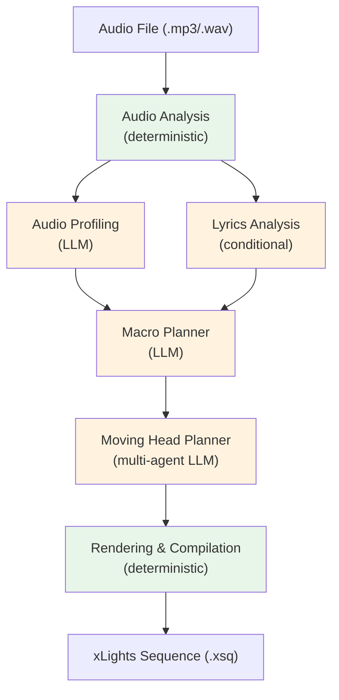

# Overview

Twinklr is an AI-powered choreography engine that transforms music into coordinated Christmas light shows. It analyzes audio, plans typed choreography intent using multi-agent LLM orchestration, and renders the result as native [xLights](https://xlights.org) sequence files (`.xsq`).

The core design principle: **LLMs plan creative intent; deterministic code handles precision.** The AI selects templates and expresses typed categorical intensity, color, shutter, gobo, and lyric-cue intent. The rendering engine resolves that intent into exact fixture channels, timing, curves, and DMX values.

---

## Goals

- Reduce the time to create moving head choreography from dozens of hours of manual xLights programming to minutes of automated generation.
- Produce musically-coherent, beat-aligned sequences that respond to the structure and energy of each song.
- Output native xLights `.xsq` files that can be imported and refined in the standard xLights editor.

## Current Scope

Twinklr currently supports:

- **Moving head fixtures** — pan, tilt, dimmer, shutter, color, and gobo channels via the sequencer pipeline (`packages/twinklr/core/sequencer/moving_heads/`).
- **Display sequencer** — RGB/pixel effects for outline, tree, and other display elements (`packages/twinklr/core/sequencer/display/`).
- **Feature engineering pipeline** — audio profiling, feature extraction, and feature store for offline analysis (`packages/twinklr/core/feature_engineering/`, `packages/twinklr/core/feature_store/`).
- **Catalog and curation tooling** — layout-aware coverage reports, corpus quality evidence, coverage-targeted recipe generation, explicit human admission logs, and style/propensity artifacts. Real author-layout/corpus curation remains an owner-driven phase exit, not a bundled catalog claim.
- **Evaluation and iteration tooling** — deterministic sync metrics, calibrated-vision contracts, a guarded three-arm comparison harness, xLights preview automation, and reserved-layer live injection/regeneration. Their live/provider/human evidence gates remain explicit and local-only.

The primary CLI workflow (`twinklr run`) executes the moving heads sequencer pipeline end-to-end.

---

## High-Level Architecture

```mermaid
flowchart TD
    A["Audio File (.mp3/.wav)"] --> B["Audio Analysis<br/>(deterministic)"]
    B --> C["Audio Profiling<br/>(LLM)"]
    B --> D["Lyrics Analysis<br/>(conditional)"]
    C --> E["Macro Planner<br/>(LLM)"]
    D --> E
    E --> F["Moving Head Planner<br/>(multi-agent LLM)"]
    F --> G["Rendering & Compilation<br/>(deterministic)"]
    G --> H["xLights Sequence (.xsq)"]

    style B fill:#e8f5e9
    style G fill:#e8f5e9
    style C fill:#fff3e0
    style D fill:#fff3e0
    style E fill:#fff3e0
    style F fill:#fff3e0
```

Green stages are fully deterministic (signal processing, curve math, file format compliance). Orange stages use LLMs for musical interpretation and choreography planning. The LLM never touches DMX values directly.

---

## Major Subsystems

### Pipeline Framework

_Source: `packages/twinklr/core/pipeline/`_

A declarative DAG-based pipeline framework that defines stages, their dependencies, and execution patterns. Key exports:

| Component | Role |
|---|---|
| `PipelineDefinition` | Declares stages, dependencies, and fail-fast policy |
| `StageDefinition` | Single stage with inputs, execution pattern, and type annotations |
| `PipelineExecutor` | Resolves the DAG and orchestrates execution |
| `PipelineContext` | Shared state, metrics, and session reference across stages |
| `ExecutionPattern` | `SEQUENTIAL`, `PARALLEL`, `FAN_OUT`, `CONDITIONAL` |

Pipeline definitions are composed via factory functions in `packages/twinklr/core/pipeline/definitions/`. Two main pipelines exist:

- **Moving heads pipeline** (`build_moving_heads_pipeline()` in `moving_heads.py`) — common stages + moving head planner + render. Used by the CLI.
- **Display pipeline** (`build_display_pipeline()` in `display.py`) — common stages + group planner (FAN_OUT per section) + aggregate + holistic evaluation + asset resolution + display render. Used by the display sequencer for RGB/pixel elements.

Both pipelines share common prefix stages from `common.py` (audio, profile, lyrics, macro).

### Audio Analysis

_Source: `packages/twinklr/core/audio/`_

Deterministic audio feature extraction powered by [librosa](https://librosa.org/):

- **Rhythm** — tempo detection, beat grid, downbeats, and selectable source adapters (`audio/rhythm/`, `audio/mir/`); custom DSP remains the runtime default, while owner review of the fixed-gate recommendation to retain it is pending
- **Energy** — RMS envelope, energy dynamics, builds and drops (`audio/energy/`)
- **Structure** — section boundary detection, segment labeling (`audio/structure/`)
- **Harmonic** — key detection, chord analysis, chroma features (`audio/harmonic/`)
- **Phonemes** — grapheme-to-phoneme conversion, viseme mapping (`audio/phonemes/`)
- **Optional stems** — cached Demucs-derived drum, bass, and vocal features with explicit full-mix fallback (`audio/stems.py`)

Audio enhancement features (metadata enrichment, lyrics from LRCLib/Genius/WhisperX, speaker diarization) are controlled by `AudioEnhancementConfig` in `packages/twinklr/core/config/models.py`.

### Multi-Agent Orchestration

_Source: `packages/twinklr/core/agents/`_

Data-driven agent system using `AgentSpec` data objects and an async runner — no agent class hierarchies. The orchestration loop:

1. **Planner** generates a schema-v2 `ChoreographyPlan` (template/preset plus typed categorical intensity, color, shutter, gobo, segmentation, and lyric MomentCue intent)
2. **Heuristic validation** checks structural validity (fast, free)
3. **Judge** scores the plan (0-10) and decides: approve, soft-fail (revise), or hard-fail (redo)
4. Structured feedback and the judge's own prior verdict history loop back into the next iteration

Plans scoring at least the configured threshold are approved (7.0 by default). The loop
runs up to 3 planner/judge cycles by default; `max_iterations=0` plans once, runs
heuristics, and skips the judge.

Registered OpenAI roles use validated strict structured outputs with bounded refusal,
truncation, malformed-response, and repair handling. Exact model/reasoning settings and
prompt/schema fingerprints participate in cache identity.

Agent sub-packages:

- `agents/audio/` — audio profiling and lyrics stages
- `agents/sequencer/` — moving head planner, macro planner, group planner
- `agents/providers/` — LLM provider adapters (OpenAI)
- `agents/shared/` — judge, iteration controller, validation
- `agents/logging/` — LLM call logging for observability

### Template Library

_Source: `packages/twinklr/core/sequencer/moving_heads/templates/`_

Pre-built choreography units define tested geometry, movement, and channel behavior as self-contained building blocks. The LLM selects templates and typed categorical intent; it never invents movement patterns or fixture math from scratch.

The validating registry loads both Python builtins and data-form `TemplateDoc` JSON, with explicit collision/override rules for progressive migration. Each template can provide presets and metadata used by LLM and deterministic selection.

### Sequencer & Rendering

_Source: `packages/twinklr/core/sequencer/`_

- **Moving heads** (`sequencer/moving_heads/`) — template compiler, schema-v2 intent resolution, fixture segment generation, DMX channel mapping, XSQ export.
- **Display** (`sequencer/display/`) — 24 effect handlers for RGB/pixel elements, composition engine.
- **Curves** (`packages/twinklr/core/curves/`) — curve generation library (native + custom easing functions) used for smooth DMX value transitions.
- **XSQ format** (`packages/twinklr/core/formats/xlights/`) — native xLights `.xsq` file reader/writer with custom value curve support.

### Configuration System

_Source: `packages/twinklr/core/config/`_

Pydantic V2 models with a `ConfigBase` class providing `load_or_default()` for file-based loading:

| Config | Default File | Purpose |
|---|---|---|
| `AppConfig` | `config.json` | App-level settings: LLM provider, API key, cache dirs, audio processing, logging |
| `JobConfig` | `job_config.json` | Job-specific: agent orchestration, fixture config path, pose config, planner features, transitions, channel defaults |

Schema version is 3.0 (`JobConfig.schema_version`). Config files are not committed to the repo — create them from the documented field defaults in `packages/twinklr/core/config/models.py`.

### Session Coordinator

_Source: `packages/twinklr/core/session.py`_

`TwinklrSession` provides lazy-loaded shared infrastructure:

- `agent_cache` — filesystem or null cache for agent result reuse
- `llm_provider` — configured LLM provider instance
- `llm_logger` — LLM call logging (YAML or JSON format)
- `audio_analyzer` — audio analysis interface

Created by the CLI with explicit configs, or via `TwinklrSession.from_directory()` for directory-based config discovery.

---

## Constraints and Non-Goals

- **xLights-only output** — Twinklr targets `.xsq` files for xLights. Other lighting control formats are not currently supported.
- **OpenAI strict-output roles** — registered agent roles currently require the OpenAI provider's strict structured-output implementation. Legacy/direct Anthropic configuration exists but is not equivalent for those roles.
- **No live DMX control** — Twinklr generates sequence effects. Its guarded xLights workflow can inject/regenerate reserved layers in an open sequence, but it is not a real-time lighting controller.
- **Display pipeline convergence remains active work** — display rendering and catalog context exist, but the primary `twinklr run` workflow remains moving-head focused. Phase 3 owns the combined show path and display CLI convergence.
