# Evaluation Report: p1p-t10-first-evaluation

**Timestamp**: 2026-08-14T03:07:08.626967+00:00  
**Engine Version**: 0.2.0  
**Git SHA**: 92af8895767aaa9bd70dbec07400d541e8c27023  
**Status**: 11 errors, 12 warnings

## Summary

- **Sections**: 7
- **Templates Used**: bounce_fan_pulse, build_drop_recover, circle_asym_left_strobe, intro_main_outro_phrase, pop_lock_spotlight_blackout, sweep_lr_fan_hold
- **Roles Targeted**: INNER_LEFT, INNER_RIGHT, OUTER_LEFT, OUTER_RIGHT
- **Curves Plotted For**: OUTER_LEFT *(showing subset of roles)*
- **Max Concurrent Layers**: 0
- **Physics Violations**: 9 ⚠️
- **Compliance Issues**: 2 ⚠️

## Song Metadata

- **BPM**: 117.45383522727273
- **Time Signature**: 2/4
- **Total Bars**: 63
- **Bar Duration**: 1000.0ms

---

## Section Analysis

### Intro (bars 1.0–4.0)

**Template**: `sweep_lr_fan_hold` (preset: chill)

**Curves (OUTER_LEFT)**:

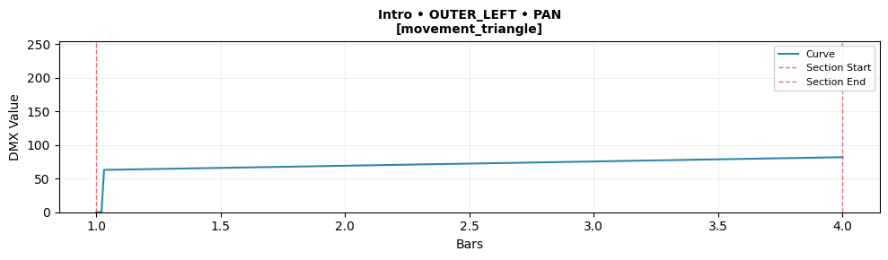
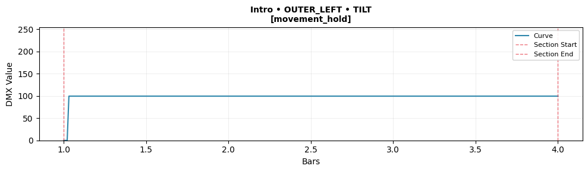
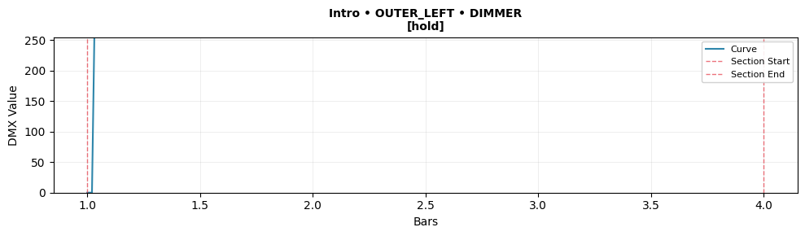

**Metrics**:
- pan [movement_triangle] (__default__): min=0.00, max=0.32, range=0.32, clamp=1.0%, energy=0.001, loop=✗ (0.321), base=0.10 ⚠️, speed=50.1°/s, accel=4789°/s²
- tilt [movement_hold] (__default__): min=0.00, max=0.39, range=0.39, clamp=1.0%, energy=0.001, loop=✗ (0.390), base=0.50 ⚠️, speed=39.5°/s, accel=3781°/s²
- dimmer [hold] (__default__): min=0.00, max=1.00, range=1.00, clamp=100.0%, energy=0.003, loop=✓, static=255

**Template Compliance**:
- Overall: ✓ Compliant
- Curve types: ✓
- Geometry: ✓

**Flags**:
- ❌ **PHYSICS_VIOLATION**: Acceleration 4788.9°/s² exceeds limit 1000.0°/s²
- ⚠️ **LOOP_DISCONTINUITY**: Loop discontinuity: delta=0.321
- ❌ **PHYSICS_VIOLATION**: Acceleration 3781.2°/s² exceeds limit 1000.0°/s²
- ⚠️ **LOOP_DISCONTINUITY**: Loop discontinuity: delta=0.390

**Transition to Chorus**:
- Status: ✓ Smooth
- Position delta: pan=0.000, tilt=0.000
- Velocity delta: 0.000

---

### Chorus (bars 5.0–8.0)

**Template**: `bounce_fan_pulse` (preset: energetic)

**Curves (OUTER_LEFT)**:

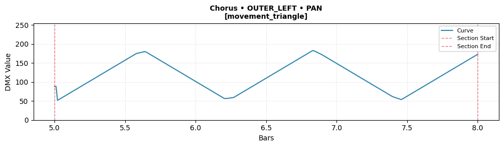
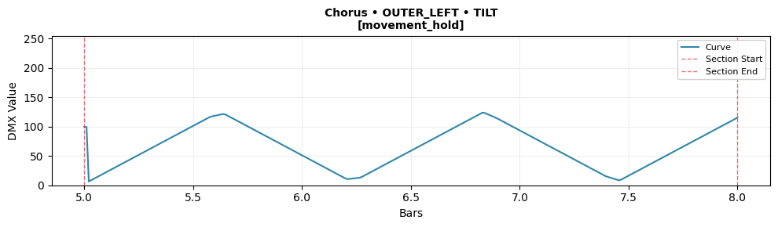
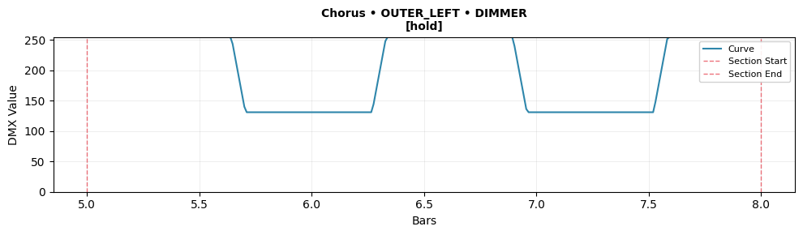

**Metrics**:
- pan [movement_triangle] (__default__): min=0.20, max=0.72, range=0.51, clamp=0.0%, energy=0.009, loop=✗ (0.332), base=0.10 ⚠️, speed=29.2°/s, accel=2966°/s²
- tilt [movement_hold] (__default__): min=0.03, max=0.49, range=0.46, clamp=0.0%, energy=0.009, loop=✗ (0.062), base=0.50 ⚠️, speed=36.9°/s, accel=3612°/s²
- dimmer [hold] (__default__): min=0.51, max=1.00, range=0.49, clamp=54.2%, energy=0.007, loop=✓, static=255

**Template Compliance**:
- Overall: ✓ Compliant
- Curve types: ✓
- Geometry: ✓

**Flags**:
- ❌ **PHYSICS_VIOLATION**: Acceleration 2965.8°/s² exceeds limit 1000.0°/s²
- ⚠️ **LOOP_DISCONTINUITY**: Loop discontinuity: delta=0.332
- ❌ **PHYSICS_VIOLATION**: Acceleration 3611.9°/s² exceeds limit 1000.0°/s²
- ⚠️ **LOOP_DISCONTINUITY**: Loop discontinuity: delta=0.062

**Transition to Drop**:
- Status: ✓ Smooth
- Position delta: pan=0.001, tilt=0.001
- Velocity delta: 0.000

---

### Drop (bars 9.0–12.0)

**Template**: `pop_lock_spotlight_blackout` (preset: energetic)

**Curves (OUTER_LEFT)**:

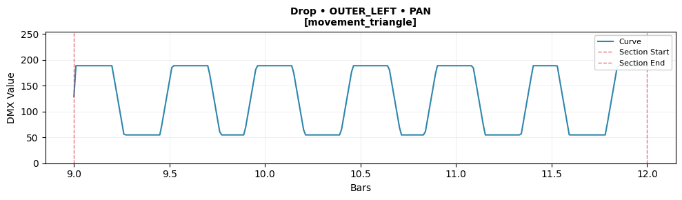
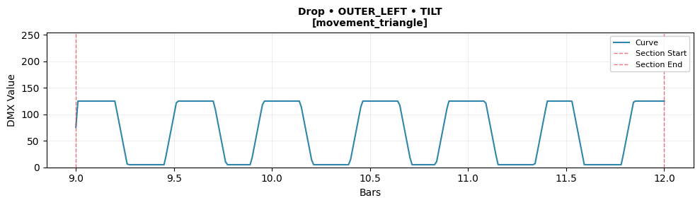
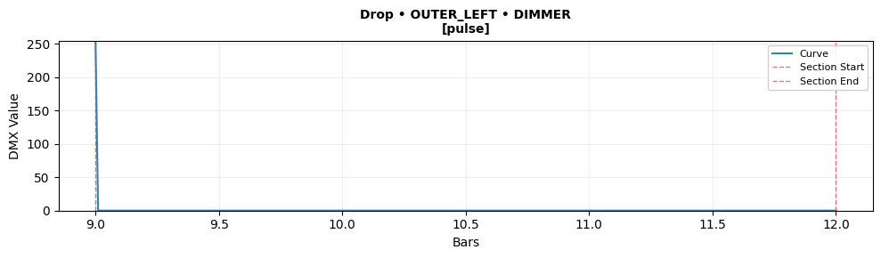

**Metrics**:
- pan [movement_triangle] (__default__): min=0.22, max=0.74, range=0.52, clamp=0.0%, energy=0.023, loop=✗ (0.235), base=0.10 ⚠️, speed=47.6°/s, accel=4557°/s²
- tilt [movement_triangle] (__default__): min=0.02, max=0.49, range=0.47, clamp=0.0%, energy=0.020, loop=✗ (0.194), base=0.50 ⚠️, speed=19.6°/s, accel=1878°/s²
- dimmer [pulse] (__default__): min=0.00, max=1.00, range=1.00, clamp=100.0%, energy=0.003, loop=✓

**Template Compliance**:
- Overall: ✓ Compliant
- Curve types: ✓
- Geometry: ✓

**Flags**:
- ❌ **PHYSICS_VIOLATION**: Acceleration 4557.2°/s² exceeds limit 1000.0°/s²
- ⚠️ **LOOP_DISCONTINUITY**: Loop discontinuity: delta=0.235
- ❌ **PHYSICS_VIOLATION**: Acceleration 1878.1°/s² exceeds limit 1000.0°/s²
- ⚠️ **LOOP_DISCONTINUITY**: Loop discontinuity: delta=0.194
- ❌ **CLAMP_PCT_HIGH**: Curve clamps 100.0% of samples

**Transition to Breakdown**:
- Status: ✓ Smooth
- Position delta: pan=0.002, tilt=0.002
- Velocity delta: 0.001

---

### Breakdown (bars 13.0–16.0)

**Template**: `circle_asym_left_strobe` (preset: chill)

**Curves (OUTER_LEFT)**:

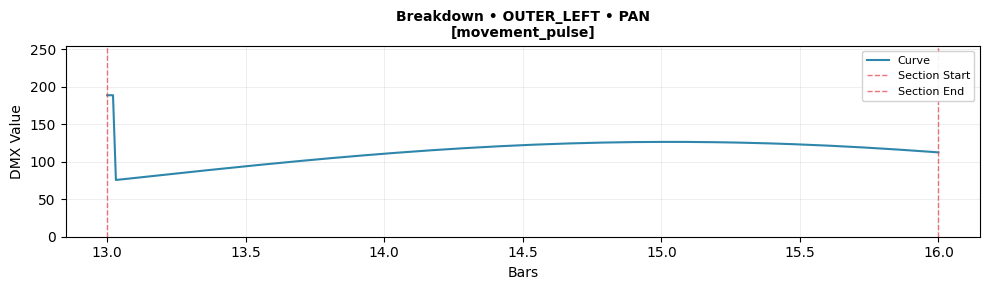
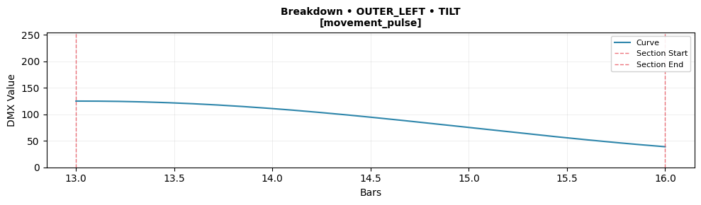
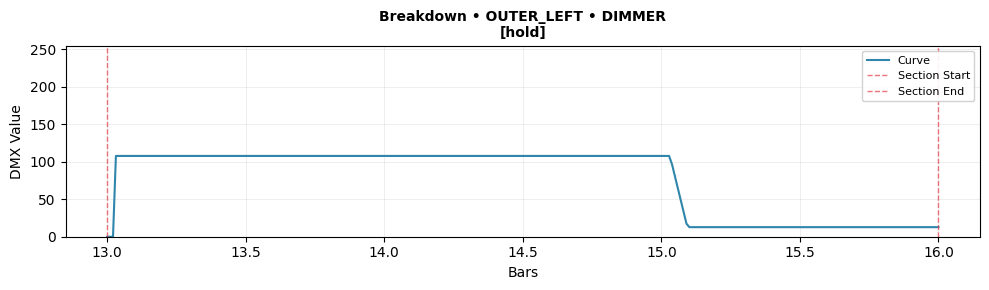

**Metrics**:
- pan [movement_pulse] (__default__): min=0.30, max=0.74, range=0.44, clamp=0.0%, energy=0.002, loop=✗ (0.299), base=0.48 ⚠️, speed=89.8°/s, accel=8622°/s²
- tilt [movement_pulse] (__default__): min=0.15, max=0.49, range=0.34, clamp=0.0%, energy=0.001, loop=✗ (0.338), base=0.31, speed=0.2°/s, accel=0°/s²
- dimmer [hold] (__default__): min=0.00, max=0.42, range=0.42, clamp=1.0%, energy=0.003, loop=✓, static=0

**Template Compliance**:
- Overall: ✓ Compliant
- Curve types: ✓
- Geometry: ✓

**Flags**:
- ❌ **PHYSICS_VIOLATION**: Acceleration 8622.4°/s² exceeds limit 1000.0°/s²
- ⚠️ **LOOP_DISCONTINUITY**: Loop discontinuity: delta=0.299
- ⚠️ **LOOP_DISCONTINUITY**: Loop discontinuity: delta=0.338

**Transition to One Bar**:
- Status: ✓ Smooth
- Position delta: pan=0.001, tilt=0.000
- Velocity delta: 0.000

---

### One Bar (bars 17.0–17.0)

**Template**: `sweep_lr_fan_hold` (preset: moderate)

**Curves (OUTER_LEFT)**:

**Metrics**:
- pan [movement_sine] (__default__): min=0.00, max=0.00, range=0.00, clamp=0.0%, energy=0.000, loop=✓, base=0.17, speed=0.0°/s
- tilt [movement_cosine] (__default__): min=0.00, max=0.00, range=0.00, clamp=0.0%, energy=0.000, loop=✓, base=0.30, speed=0.0°/s
- dimmer [pulse] (__default__): min=0.00, max=0.00, range=0.00, clamp=0.0%, energy=0.000, loop=✓

**Template Compliance**:
- Overall: ✓ Compliant
- Curve types: ✓
- Geometry: ✓

**Flags**: None

**Transition to Phrase**:
- Status: ✓ Smooth
- Position delta: pan=0.001, tilt=0.001
- Velocity delta: 0.000

---

### Phrase (bars 18.0–25.0)

**Template**: `intro_main_outro_phrase` (preset: moderate)

**Curves (OUTER_LEFT)**:

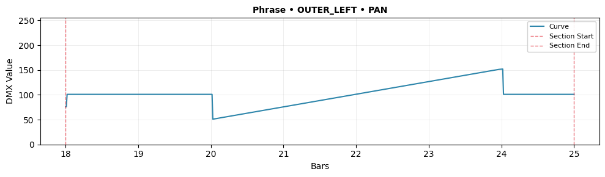
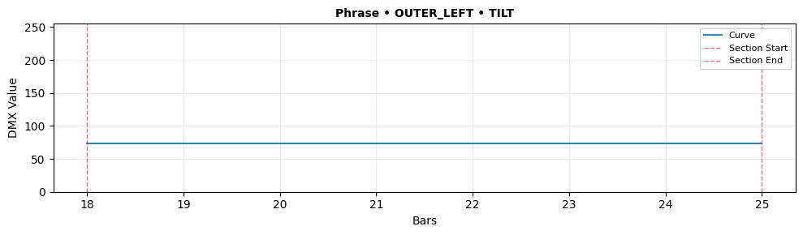
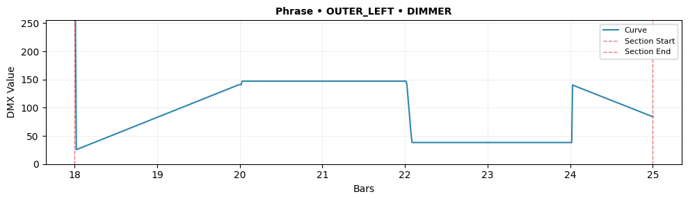

**Metrics**:
- pan: min=0.20, max=0.60, range=0.40, clamp=0.0%, energy=0.001, loop=✗ (0.099) ⚠️, speed=40.5°/s, accel=3889°/s²
- tilt: min=0.29, max=0.29, range=0.00, clamp=0.0%, energy=0.000, loop=✓, speed=0.0°/s
- dimmer: min=0.10, max=1.00, range=0.90, clamp=0.3%, energy=0.004, loop=✓

**Template Compliance**:
- Overall: ✗ Issues Detected
- Curve types: ✗
- Geometry: ✗

**Compliance Issues**:
- ⚠️ Missing curve type metadata for pan
- ⚠️ 2 curves missing handler metadata

**Flags**:
- ❌ **PHYSICS_VIOLATION**: Acceleration 3889.4°/s² exceeds limit 1000.0°/s²
- ⚠️ **LOOP_DISCONTINUITY**: Loop discontinuity: delta=0.099
- ℹ️ **LIMITED_RANGE**: Curve has limited range: 0.000
- ℹ️ **STATIC_CURVE**: Curve appears static or nearly static
- ⚠️ **COMPLIANCE_ISSUE**: Missing curve type metadata for pan
- ⚠️ **COMPLIANCE_ISSUE**: 2 curves missing handler metadata

**Transition to Arc**:
- Status: ✓ Smooth
- Position delta: pan=0.000, tilt=0.000
- Velocity delta: 0.000

---

### Arc (bars 26.0–31.0)

**Template**: `build_drop_recover` (preset: energetic)

**Curves (OUTER_LEFT)**:

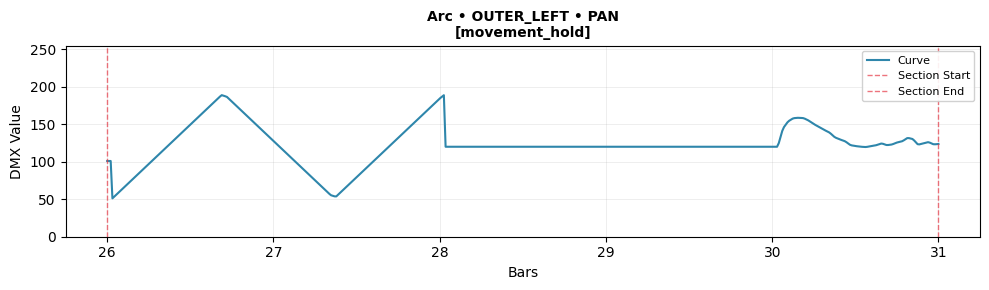
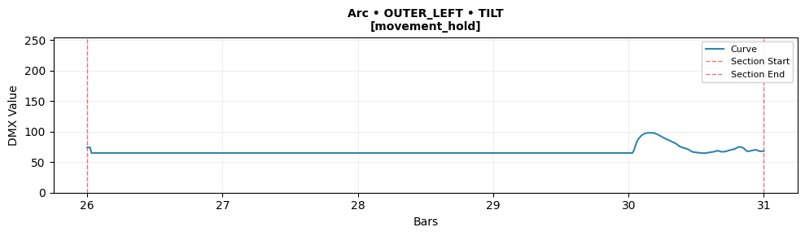
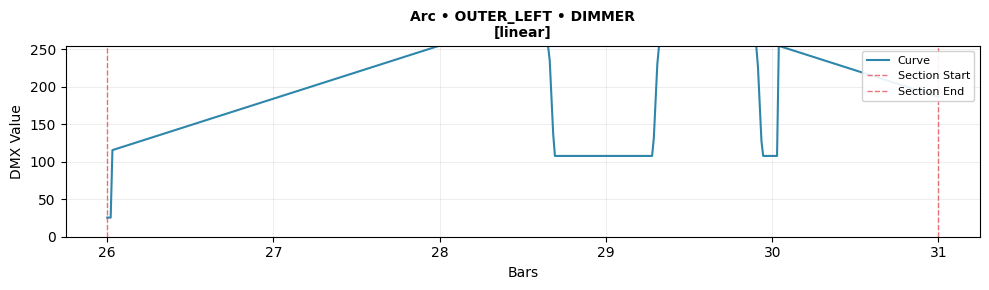

**Metrics**:
- pan [movement_hold] (__default__): min=0.20, max=0.74, range=0.54, clamp=0.0%, energy=0.005, loop=✗ (0.089), base=0.10 ⚠️, speed=54.7°/s, accel=5379°/s²
- tilt [movement_hold] (__default__): min=0.25, max=0.38, range=0.13, clamp=0.0%, energy=0.001, loop=✓, base=0.50, speed=3.6°/s, accel=343°/s²
- dimmer [linear] (__default__): min=0.10, max=1.00, range=0.90, clamp=25.0%, energy=0.007, loop=✓

**Template Compliance**:
- Overall: ✓ Compliant
- Curve types: ✓
- Geometry: ✓

**Flags**:
- ❌ **PHYSICS_VIOLATION**: Acceleration 5378.5°/s² exceeds limit 1000.0°/s²
- ⚠️ **LOOP_DISCONTINUITY**: Loop discontinuity: delta=0.089
- ❌ **CLAMP_PCT_HIGH**: Curve clamps 25.0% of samples

---
